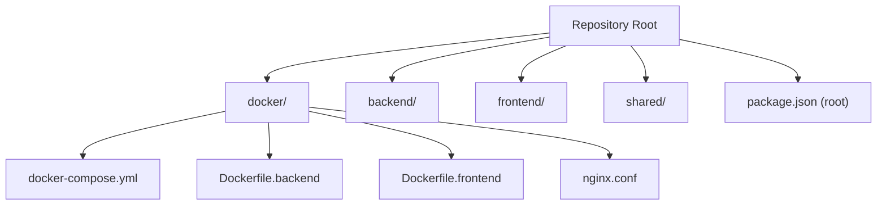
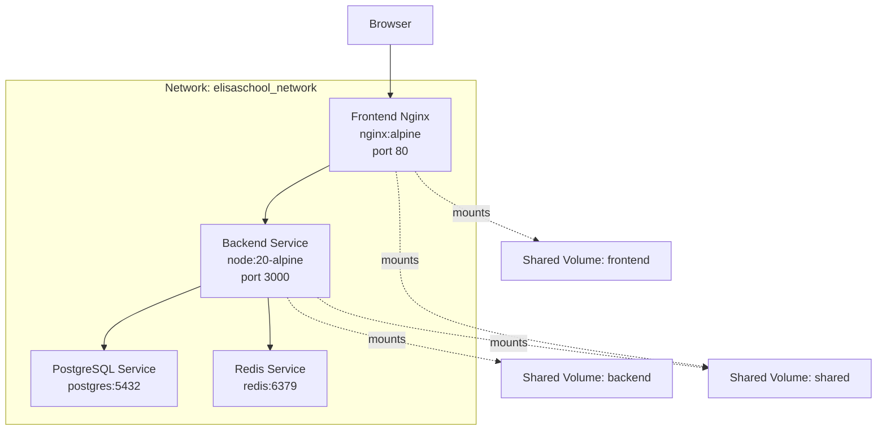
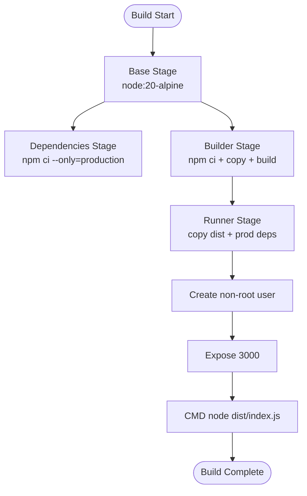
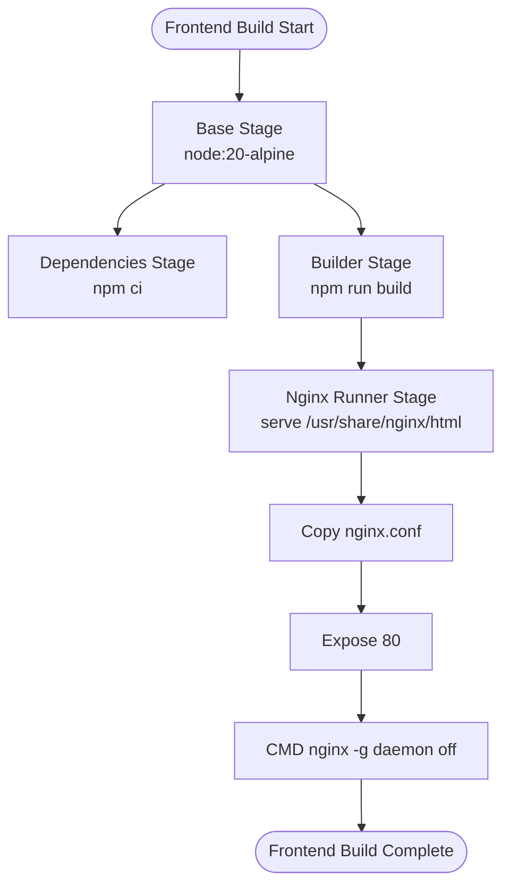
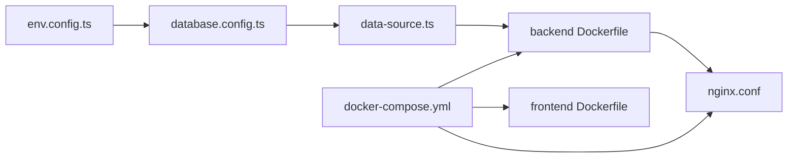

# Deployment & Docker Configuration

<cite>
**Referenced Files in This Document**
- [docker-compose.yml](file://docker/docker-compose.yml)
- [Dockerfile.backend](file://docker/Dockerfile.backend)
- [Dockerfile.frontend](file://docker/Dockerfile.frontend)
- [nginx.conf](file://docker/nginx.conf)
- [package.json](file://package.json)
- [backend/package.json](file://backend/package.json)
- [README.md](file://README.md)
- [env.config.ts](file://backend/src/config/env.config.ts)
- [database.config.ts](file://backend/src/config/database.config.ts)
- [data-source.ts](file://backend/src/database/data-source.ts)
</cite>

## Table of Contents
1. [Introduction](#introduction)
2. [Project Structure](#project-structure)
3. [Core Components](#core-components)
4. [Architecture Overview](#architecture-overview)
5. [Detailed Component Analysis](#detailed-component-analysis)
6. [Dependency Analysis](#dependency-analysis)
7. [Performance Considerations](#performance-considerations)
8. [Troubleshooting Guide](#troubleshooting-guide)
9. [Conclusion](#conclusion)
10. [Appendices](#appendices)

## Introduction
This document provides comprehensive deployment guidance for eLISAschool, focusing on Docker containerization, multi-stage builds, orchestration with docker-compose, and production-grade configuration. It covers backend and frontend Dockerfiles, image optimization, security hardening, environment configuration, scaling considerations, Nginx reverse proxy and SSL/TLS setup, load balancing, monitoring and logging, backup and disaster recovery, and operational checklists and troubleshooting procedures.

## Project Structure
The repository is a monorepo with workspaces for backend, frontend, and shared packages. Docker artifacts are centralized under the docker/ directory, including compose orchestration, backend and frontend Dockerfiles, and Nginx configuration.

**Diagram sources**
- [docker-compose.yml](file://docker/docker-compose.yml)
- [Dockerfile.backend](file://docker/Dockerfile.backend)
- [Dockerfile.frontend](file://docker/Dockerfile.frontend)
- [nginx.conf](file://docker/nginx.conf)
- [package.json](file://package.json)

**Section sources**
- [README.md](file://README.md)
- [package.json](file://package.json)

## Core Components
- Backend API service built with Node.js, Express, TypeScript, and TypeORM, orchestrated via docker-compose.
- PostgreSQL database service configured with health checks and persistent volumes.
- Redis service for caching and synchronization.
- Frontend service built with React and Vite, served via Nginx in a multi-stage production image.
- Nginx reverse proxy handling static assets, SPA fallback, and API routing to the backend.

Key runtime and build scripts are exposed at the root package.json for local development and Docker orchestration.

**Section sources**
- [docker-compose.yml](file://docker/docker-compose.yml)
- [Dockerfile.backend](file://docker/Dockerfile.backend)
- [Dockerfile.frontend](file://docker/Dockerfile.frontend)
- [nginx.conf](file://docker/nginx.conf)
- [package.json](file://package.json)

## Architecture Overview
The deployment architecture uses a bridge network to connect services. The frontend Nginx container proxies API requests to the backend service, while both backend and frontend communicate with shared volumes during development and rely on environment variables for configuration.

**Diagram sources**
- [docker-compose.yml](file://docker/docker-compose.yml)
- [Dockerfile.frontend](file://docker/Dockerfile.frontend)
- [Dockerfile.backend](file://docker/Dockerfile.backend)

## Detailed Component Analysis

### Backend Service Containerization
The backend Dockerfile implements a multi-stage build:
- Base stage sets up Node.js 20 Alpine and compatibility libraries.
- Dependencies stage installs production dependencies only.
- Builder stage installs all dependencies, copies sources, and compiles TypeScript.
- Runner stage copies compiled output and production dependencies, creates a non-root user, exposes port 3000, and runs the application.

Security and runtime hardening:
- Non-root user execution reduces privilege exposure.
- Production environment variables are set explicitly.
- Health checks are defined in docker-compose for database and cache services.

Operational notes:
- The backend container mounts the backend and shared directories for development and sets NODE_ENV via docker-compose.
- Environment variables are validated at startup using Zod-based configuration.

**Diagram sources**
- [Dockerfile.backend](file://docker/Dockerfile.backend)

**Section sources**
- [Dockerfile.backend](file://docker/Dockerfile.backend)
- [docker-compose.yml](file://docker/docker-compose.yml)
- [env.config.ts](file://backend/src/config/env.config.ts)

### Frontend Service Containerization
The frontend Dockerfile implements a multi-stage build:
- Base stage mirrors backend base configuration.
- Dependencies stage installs build-time dependencies.
- Builder stage builds the React/Vite application and shares the output.
- Runner stage uses Nginx to serve the built static assets, copying the Nginx configuration from docker/nginx.conf.

Nginx configuration:
- Enables gzip compression and long-term caching for static assets.
- Provides SPA fallback to index.html for client-side routing.
- Proxies /api requests to the backend service.
- Adds security headers.

**Diagram sources**
- [Dockerfile.frontend](file://docker/Dockerfile.frontend)
- [nginx.conf](file://docker/nginx.conf)

**Section sources**
- [Dockerfile.frontend](file://docker/Dockerfile.frontend)
- [nginx.conf](file://docker/nginx.conf)

### Orchestration with docker-compose
The compose file defines four services:
- postgres: PostgreSQL 16 with health checks, persistent volumes, and init scripts mount.
- redis: Redis 7 with health checks and persistent volume.
- backend: Multi-stage built image, environment variables, mounted volumes for development, and dependency on healthy postgres and redis.
- frontend: Multi-stage built image, environment variables, mounted volumes for development, and dependency on backend.

Networking and volumes:
- Bridge network elisaschool_network isolates services.
- Named volumes persist PostgreSQL and Redis data.

Environment variable injection:
- Variables are injected from the host environment and include database credentials, Redis settings, JWT secret, encryption key, and application ports.

**Section sources**
- [docker-compose.yml](file://docker/docker-compose.yml)

### Environment Configuration and Validation
The backend validates environment variables using Zod, ensuring minimum length keys, numeric transformations, and URL formats. Defaults are provided for development, while production exits on invalid configuration.

Database configuration:
- TypeORM options are derived from envConfig, including connection pooling, SSL behavior, and entity/migration paths.
- SSL is enabled in production with relaxed certificate verification for cloud providers.

**Section sources**
- [env.config.ts](file://backend/src/config/env.config.ts)
- [database.config.ts](file://backend/src/config/database.config.ts)
- [data-source.ts](file://backend/src/database/data-source.ts)

### Security Hardening
- Backend uses helmet for HTTP headers and rate limiting for protection against abuse.
- Nginx adds security headers (X-Frame-Options, X-Content-Type-Options, X-XSS-Protection).
- Non-root user execution in backend image.
- Strict secrets validation and enforced lengths for JWT and encryption keys.

Recommendations for production:
- Rotate JWT_SECRET and ENCRYPTION_KEY regularly.
- Use HTTPS termination at a reverse proxy and configure TLS certificates.
- Restrict exposed ports and enable firewall policies.
- Store secrets in a secure secret manager and inject via environment variables.

**Section sources**
- [backend/package.json](file://backend/package.json)
- [nginx.conf](file://docker/nginx.conf)
- [Dockerfile.backend](file://docker/Dockerfile.backend)

### Scaling Considerations
- Backend: Increase replica count behind a load balancer; ensure stateless design and externalized Redis for session/state sharing.
- Database: Use managed PostgreSQL with read replicas and connection pooling tuned per workload.
- Frontend: Serve static assets via CDN and proxy dynamic requests to multiple backend instances.
- Caching: Leverage Redis for caching and pub/sub messaging.

[No sources needed since this section provides general guidance]

### Nginx Reverse Proxy, SSL/TLS, and Load Balancing
Current configuration:
- Nginx serves static assets and proxies /api to backend.
- SPA fallback ensures client-side routing works.
- Security headers are applied.

Production enhancements:
- Terminate TLS at Nginx or a dedicated ingress controller with valid certificates.
- Enable HTTP/2 and OCSP stapling.
- Configure sticky sessions if required, otherwise ensure backend is stateless.
- Add upstream health checks and circuit breakers.

[No sources needed since this section provides general guidance]

### Monitoring, Logging, Backup, and Disaster Recovery
Monitoring and logging:
- Backend writes structured logs; configure log aggregation (e.g., ELK or similar).
- Enable container logs collection and metrics scraping (CPU/memory).

Backups:
- PostgreSQL: Schedule logical backups and test restore procedures.
- Redis: Enable persistence and snapshotting; maintain offsite backups.
- Application code: Version control and immutable container images.

Disaster recovery:
- Document restore playbooks for database and cache.
- Maintain a secondary region with automated failover.
- Test DR scenarios quarterly.

[No sources needed since this section provides general guidance]

## Dependency Analysis
The backend depends on environment-driven configuration, TypeORM data source initialization, and shared packages. The frontend depends on the backend API being reachable at /api. The compose file orchestrates dependencies and health checks.

**Diagram sources**
- [env.config.ts](file://backend/src/config/env.config.ts)
- [database.config.ts](file://backend/src/config/database.config.ts)
- [data-source.ts](file://backend/src/database/data-source.ts)
- [Dockerfile.backend](file://docker/Dockerfile.backend)
- [Dockerfile.frontend](file://docker/Dockerfile.frontend)
- [nginx.conf](file://docker/nginx.conf)
- [docker-compose.yml](file://docker/docker-compose.yml)

**Section sources**
- [env.config.ts](file://backend/src/config/env.config.ts)
- [database.config.ts](file://backend/src/config/database.config.ts)
- [data-source.ts](file://backend/src/database/data-source.ts)
- [Dockerfile.backend](file://docker/Dockerfile.backend)
- [Dockerfile.frontend](file://docker/Dockerfile.frontend)
- [nginx.conf](file://docker/nginx.conf)
- [docker-compose.yml](file://docker/docker-compose.yml)

## Performance Considerations
- Multi-stage builds reduce final image size and attack surface.
- Production Node.js runtime and non-root user improve security posture.
- Nginx static asset caching and SPA fallback optimize frontend delivery.
- Tune database connection pool sizes and Redis memory limits for production loads.
- Use CDN for static assets and enable compression.

[No sources needed since this section provides general guidance]

## Troubleshooting Guide
Common issues and resolutions:
- Backend fails to start due to invalid environment variables: Review Zod validation errors and ensure required keys meet length/format requirements.
- Database connectivity errors: Verify POSTGRES_HOST/PORT/NAME/USER/PASSWORD and health checks.
- Redis connectivity errors: Confirm REDIS_HOST/PORT and health checks.
- Frontend blank page: Check Nginx proxy configuration and /api route to backend.
- Port conflicts: Adjust exposed ports in docker-compose environment variables.
- Development hot reload not working: Ensure bind mounts for backend/frontend/shared directories are present.

Operational commands:
- Start/stop services: Use docker-compose up/down with the provided compose file.
- View logs: Use docker-compose logs with follow flag.
- Run database migrations and seeds via root scripts.

**Section sources**
- [docker-compose.yml](file://docker/docker-compose.yml)
- [env.config.ts](file://backend/src/config/env.config.ts)
- [backend/package.json](file://backend/package.json)
- [package.json](file://package.json)

## Conclusion
eLISAschool’s Docker-based deployment leverages multi-stage builds, a clear separation of concerns between backend and frontend, and a robust orchestration model. By enforcing strict environment validation, applying security hardening, and preparing for production concerns such as SSL/TLS, load balancing, monitoring, and backups, teams can operate a reliable and scalable platform.

[No sources needed since this section summarizes without analyzing specific files]

## Appendices

### Deployment Checklist
- Prepare environment variables (DB, Redis, JWT, Encryption keys).
- Build images using multi-stage Dockerfiles.
- Start services with docker-compose and confirm health checks.
- Validate frontend routing and API proxying.
- Configure TLS termination and load balancing in production.
- Set up monitoring, logging, and alerting.
- Schedule backups and test DR procedures.

[No sources needed since this section provides general guidance]