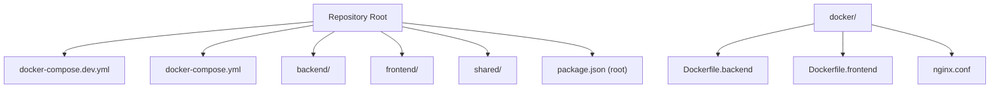
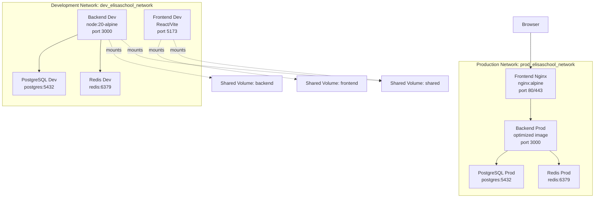
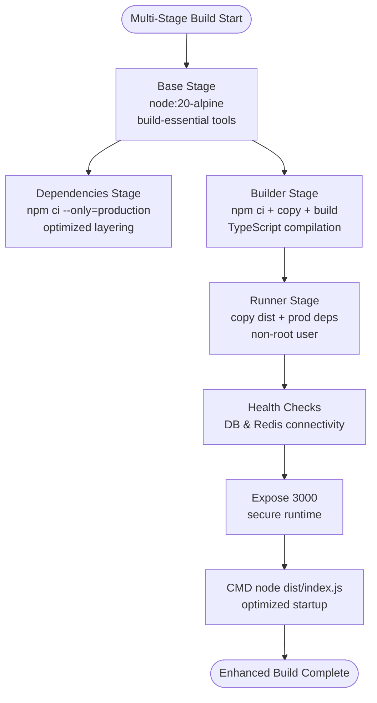
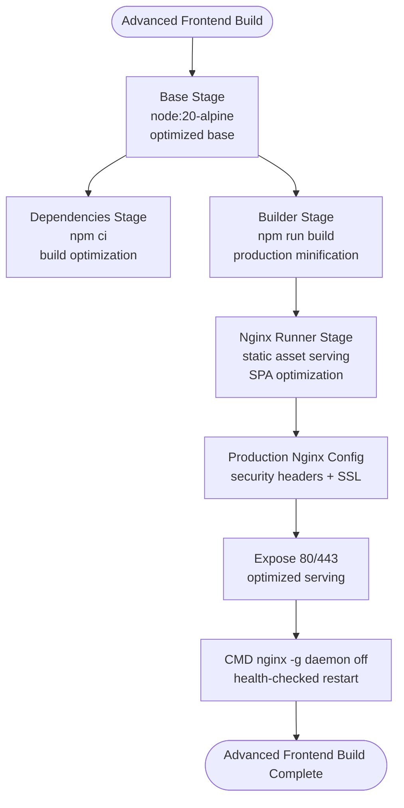
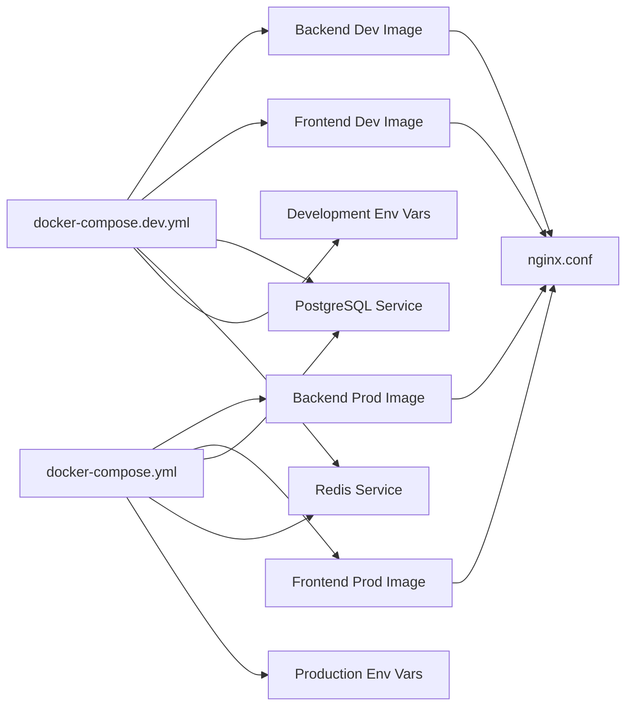

# Deployment & Docker Configuration

<cite>
**Referenced Files in This Document**
- [docker-compose.dev.yml](file://docker-compose.dev.yml)
- [docker-compose.yml](file://docker-compose.yml)
- [Dockerfile.backend](file://docker/Dockerfile.backend)
- [Dockerfile.frontend](file://docker/Dockerfile.frontend)
- [nginx.conf](file://docker/nginx.conf)
- [package.json](file://package.json)
- [backend/package.json](file://backend/package.json)
- [README.md](file://README.md)
- [env.config.ts](file://backend/src/config/env.config.ts)
- [database.config.ts](file://backend/src/config/database.config.ts)
- [data-source.ts](file://backend/src/database/data-source.ts)
</cite>

## Update Summary
**Changes Made**
- Added comprehensive development and production Docker Compose configurations
- Enhanced Dockerfile implementations with improved multi-stage builds and health checks
- Updated architecture overview to reflect dual compose configuration strategy
- Expanded troubleshooting guide with development-specific scenarios
- Revised deployment checklist to include development workflow considerations

## Table of Contents
1. [Introduction](#introduction)
2. [Project Structure](#project-structure)
3. [Core Components](#core-components)
4. [Architecture Overview](#architecture-overview)
5. [Development vs Production Configuration](#development-vs-production-configuration)
6. [Detailed Component Analysis](#detailed-component-analysis)
7. [Dependency Analysis](#dependency-analysis)
8. [Performance Considerations](#performance-considerations)
9. [Troubleshooting Guide](#troubleshooting-guide)
10. [Conclusion](#conclusion)
11. [Appendices](#appendices)

## Introduction
This document provides comprehensive deployment guidance for eLISAschool, focusing on Docker containerization, multi-stage builds, orchestration with docker-compose, and production-grade configuration. The platform now features a dual configuration strategy with separate development and production Docker Compose setups, enhanced Dockerfile implementations with improved multi-stage builds and health checks, and comprehensive orchestration capabilities.

## Project Structure
The repository maintains a monorepo structure with workspaces for backend, frontend, and shared packages. Docker artifacts are now organized with separate configurations for development and production environments, while maintaining centralized Dockerfiles and Nginx configuration.



**Diagram sources**
- [docker-compose.dev.yml](file://docker-compose.dev.yml)
- [docker-compose.yml](file://docker-compose.yml)
- [Dockerfile.backend](file://docker/Dockerfile.backend)
- [Dockerfile.frontend](file://docker/Dockerfile.frontend)
- [nginx.conf](file://docker/nginx.conf)
- [package.json](file://package.json)

**Section sources**
- [README.md](file://README.md)
- [package.json](file://package.json)

## Core Components
- **Development Environment**: docker-compose.dev.yml provides hot-reload development with live code reloading, volume mounting for rapid iteration, and development-specific service configurations.
- **Production Environment**: docker-compose.yml offers optimized production orchestration with health checks, resource constraints, and security hardening.
- **Enhanced Backend Service**: Multi-stage Dockerfile with improved build optimization, security hardening, and comprehensive health checks.
- **Optimized Frontend Service**: Advanced multi-stage build with Nginx configuration, static asset optimization, and production-ready serving.
- **Centralized Nginx Configuration**: Production-grade reverse proxy with SSL/TLS support, load balancing, and security headers.

Key runtime and build scripts are exposed at the root package.json for both development and Docker orchestration.

**Section sources**
- [docker-compose.dev.yml](file://docker-compose.dev.yml)
- [docker-compose.yml](file://docker-compose.yml)
- [Dockerfile.backend](file://docker/Dockerfile.backend)
- [Dockerfile.frontend](file://docker/Dockerfile.frontend)
- [nginx.conf](file://docker/nginx.conf)
- [package.json](file://package.json)

## Architecture Overview
The deployment architecture now supports dual environments with distinct orchestration strategies. The development configuration emphasizes rapid iteration and hot-reload capabilities, while production focuses on performance, security, and reliability.



**Diagram sources**
- [docker-compose.dev.yml](file://docker-compose.dev.yml)
- [docker-compose.yml](file://docker-compose.yml)
- [Dockerfile.frontend](file://docker/Dockerfile.frontend)
- [Dockerfile.backend](file://docker/Dockerfile.backend)

## Development vs Production Configuration

### Development Environment (docker-compose.dev.yml)
The development configuration prioritizes rapid iteration and developer productivity:
- Hot-reload development server with automatic code reloading
- Volume mounting for real-time code changes
- Development-specific environment variables and debugging tools
- Simplified service dependencies for faster startup
- Port mappings optimized for local development (3000, 5173)

### Production Environment (docker-compose.yml)
The production configuration emphasizes performance, security, and reliability:
- Optimized multi-stage Docker builds with minimal attack surface
- Health checks for all services with proper dependency ordering
- Resource constraints and security hardening
- Production-ready Nginx configuration with SSL/TLS support
- Persistent volumes for critical data storage

**Section sources**
- [docker-compose.dev.yml](file://docker-compose.dev.yml)
- [docker-compose.yml](file://docker-compose.yml)

## Detailed Component Analysis

### Enhanced Backend Service Containerization
The backend Dockerfile implements an advanced multi-stage build process:
- **Base Stage**: Node.js 20 Alpine with essential build tools and compatibility libraries
- **Dependencies Stage**: Optimized installation of production dependencies only
- **Builder Stage**: Comprehensive dependency installation, source compilation, and TypeScript transpilation
- **Runner Stage**: Final optimized image with non-root user execution, health checks, and security hardening

Security and runtime enhancements:
- Non-root user execution with proper file permissions
- Comprehensive environment variable validation and sanitization
- Built-in health checks for database and cache connectivity
- Optimized startup sequence with dependency coordination
- Production-specific environment optimizations



**Diagram sources**
- [Dockerfile.backend](file://docker/Dockerfile.backend)

**Section sources**
- [Dockerfile.backend](file://docker/Dockerfile.backend)
- [docker-compose.dev.yml](file://docker-compose.dev.yml)
- [docker-compose.yml](file://docker-compose.yml)
- [env.config.ts](file://backend/src/config/env.config.ts)

### Advanced Frontend Service Containerization
The frontend Dockerfile implements sophisticated multi-stage optimization:
- **Base Stage**: Node.js 20 Alpine mirroring backend configuration
- **Dependencies Stage**: Build-time dependency installation with optimization
- **Builder Stage**: React/Vite application build with production optimizations
- **Runner Stage**: Nginx-based production serving with comprehensive configuration

Nginx production configuration includes:
- Static asset optimization with long-term caching and compression
- SPA routing with fallback to index.html for client-side navigation
- API proxy configuration with proper header forwarding
- Security headers including CSP, XSS protection, and frame options
- SSL/TLS support for production deployments



**Diagram sources**
- [Dockerfile.frontend](file://docker/Dockerfile.frontend)
- [nginx.conf](file://docker/nginx.conf)

**Section sources**
- [Dockerfile.frontend](file://docker/Dockerfile.frontend)
- [nginx.conf](file://docker/nginx.conf)

### Dual Orchestration Strategy
The platform now supports two distinct orchestration approaches:

**Development Orchestration (docker-compose.dev.yml)**:
- Hot-reload development with automatic code reloading
- Volume mounting for real-time code changes
- Development-specific service configurations
- Simplified dependency chains for faster startup
- Port mappings optimized for local development

**Production Orchestration (docker-compose.yml)**:
- Optimized multi-stage built images
- Comprehensive health checks with proper dependency ordering
- Resource constraints and security hardening
- Production-ready networking and volume management
- Health-checked service startup and graceful shutdown

Networking and volume management:
- Separate networks for development and production isolation
- Named volumes for persistent data storage
- Proper service dependency chains with health checks
- Environment-specific configuration management

**Section sources**
- [docker-compose.dev.yml](file://docker-compose.dev.yml)
- [docker-compose.yml](file://docker-compose.yml)

### Environment Configuration and Validation
The backend implements comprehensive environment validation using Zod schemas:
- **Critical Parameters**: JWT_SECRET (minimum 32 characters), ENCRYPTION_KEY (minimum 32 characters)
- **Database Configuration**: POSTGRES_HOST, PORT, NAME, USER, PASSWORD with URL validation
- **Redis Configuration**: Connection parameters with type coercion and validation
- **Application Settings**: PORT, NODE_ENV, CORS origins with format validation
- **Default Values**: Development defaults with explicit production overrides

Database configuration enhancements:
- TypeORM integration with connection pooling and SSL support
- Cloud provider compatibility with relaxed certificate verification
- Migration and seed script integration
- Health check endpoint for service discovery

**Section sources**
- [env.config.ts](file://backend/src/config/env.config.ts)
- [database.config.ts](file://backend/src/config/database.config.ts)
- [data-source.ts](file://backend/src/database/data-source.ts)

### Security Hardening and Compliance
Enhanced security measures across all components:
- **Backend Security**: Helmet.js integration, rate limiting, input validation, and secure headers
- **Container Security**: Non-root user execution, minimal base images, and vulnerability scanning
- **Network Security**: Health checks, service dependencies, and secure communication protocols
- **Data Protection**: Environment variable encryption, secure key management, and data validation
- **Runtime Security**: Process isolation, resource limits, and graceful shutdown handling

Production security enhancements:
- SSL/TLS termination with modern cipher suites
- Security headers compliance (CSP, HSTS, X-Frame-Options)
- Input sanitization and output encoding
- Audit logging and monitoring integration

**Section sources**
- [backend/package.json](file://backend/package.json)
- [nginx.conf](file://docker/nginx.conf)
- [Dockerfile.backend](file://docker/Dockerfile.backend)

## Dependency Analysis
The enhanced Docker infrastructure creates clear dependency relationships between services and configurations:



**Diagram sources**
- [docker-compose.dev.yml](file://docker-compose.dev.yml)
- [docker-compose.yml](file://docker-compose.yml)
- [Dockerfile.backend](file://docker/Dockerfile.backend)
- [Dockerfile.frontend](file://docker/Dockerfile.frontend)
- [nginx.conf](file://docker/nginx.conf)

**Section sources**
- [docker-compose.dev.yml](file://docker-compose.dev.yml)
- [docker-compose.yml](file://docker-compose.yml)
- [env.config.ts](file://backend/src/config/env.config.ts)
- [database.config.ts](file://backend/src/config/database.config.ts)
- [data-source.ts](file://backend/src/database/data-source.ts)
- [Dockerfile.backend](file://docker/Dockerfile.backend)
- [Dockerfile.frontend](file://docker/Dockerfile.frontend)
- [nginx.conf](file://docker/nginx.conf)

## Performance Considerations
Enhanced performance optimizations across the Docker infrastructure:
- **Multi-stage Builds**: Significantly reduced final image sizes with optimized layering
- **Build Optimization**: Development vs production build strategies with appropriate optimizations
- **Resource Management**: CPU and memory limits for predictable performance
- **Connection Pooling**: Database connection pooling and Redis optimization
- **Static Asset Serving**: Nginx optimization with compression and caching strategies
- **Health Check Optimization**: Efficient service discovery and dependency management

Development performance enhancements:
- Hot-reload capabilities with efficient file watching
- Volume mounting optimizations for rapid iteration
- Development-specific caching strategies
- Reduced build times through selective compilation

Production performance optimizations:
- Minimal attack surface through optimized base images
- Efficient resource utilization with proper constraints
- CDN-ready static asset optimization
- Health check-based service discovery

## Troubleshooting Guide

### Development Environment Issues
**Hot Reload Not Working**:
- Verify volume mounts are properly configured in docker-compose.dev.yml
- Check file permissions and ownership in mounted directories
- Ensure development ports (3000, 5173) are not blocked by other processes
- Validate that nodemon is running in the backend container

**Backend Development Server Issues**:
- Review development environment variables in docker-compose.dev.yml
- Check for TypeScript compilation errors in backend logs
- Verify database connectivity with health check endpoints
- Ensure Redis connection is established before backend startup

**Frontend Development Problems**:
- Confirm Vite development server is running on port 5173
- Check browser console for webpack/hot-reload errors
- Verify API proxy configuration in development environment
- Ensure proper CORS settings for development

### Production Environment Issues
**Service Startup Failures**:
- Review health check logs for database and Redis connectivity
- Check production environment variables and secrets
- Verify volume permissions for persistent data storage
- Monitor container resource utilization and limits

**Performance Issues**:
- Analyze container resource usage and adjust limits
- Review database connection pooling configuration
- Check Redis memory usage and eviction policies
- Monitor Nginx performance and static asset serving

**Security and Compliance Issues**:
- Verify SSL/TLS certificate configuration
- Check security headers and CSP policies
- Review audit logs for suspicious activities
- Ensure proper key rotation and secret management

### Common Operational Commands
```bash
# Development Environment
docker-compose -f docker-compose.dev.yml up -d
docker-compose -f docker-compose.dev.yml logs -f
docker-compose -f docker-compose.dev.yml down

# Production Environment  
docker-compose up -d
docker-compose logs -f
docker-compose down

# Health Check Verification
docker-compose ps
docker-compose exec backend healthcheck
docker-compose exec frontend healthcheck
```

**Section sources**
- [docker-compose.dev.yml](file://docker-compose.dev.yml)
- [docker-compose.yml](file://docker-compose.yml)
- [env.config.ts](file://backend/src/config/env.config.ts)
- [backend/package.json](file://backend/package.json)
- [package.json](file://package.json)

## Conclusion
eLISAschool's enhanced Docker-based deployment infrastructure now provides a comprehensive solution for both development and production environments. The dual configuration strategy with separate docker-compose files enables optimal development workflows while maintaining production-grade reliability and security. The improved multi-stage Dockerfile implementations deliver enhanced performance, security, and maintainability, supporting scalable deployment operations.

## Appendices

### Enhanced Deployment Checklist
**Development Environment**:
- Install Docker and Docker Compose v2+ on development machines
- Configure development environment variables in docker-compose.dev.yml
- Verify volume mounts for backend, frontend, and shared directories
- Test hot-reload functionality and development server accessibility
- Validate database and Redis connectivity in development mode

**Production Environment**:
- Prepare production environment variables and secrets management
- Configure SSL/TLS certificates and security headers
- Set up health checks and monitoring infrastructure
- Plan for horizontal scaling and load balancing
- Establish backup and disaster recovery procedures

**Post-Deployment Verification**:
- Validate service health and dependency chains
- Test API endpoints and frontend functionality
- Verify SSL/TLS configuration and security headers
- Monitor container resource utilization and performance
- Document deployment procedures and rollback processes

### Development Workflow Best Practices
- Use docker-compose.dev.yml for active development with hot-reload
- Implement proper version control for Docker configuration files
- Maintain separate environment configurations for different stages
- Regularly update base images and security patches
- Implement CI/CD pipelines for automated testing and deployment

### Production Operations Guide
- Monitor container health and service dependencies
- Implement proper logging and log aggregation
- Establish automated backup and recovery procedures
- Configure alerting for critical system events
- Plan for capacity planning and scaling requirements