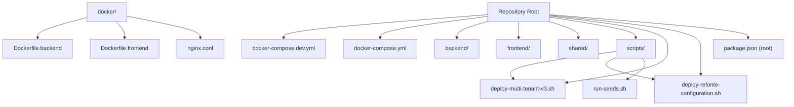
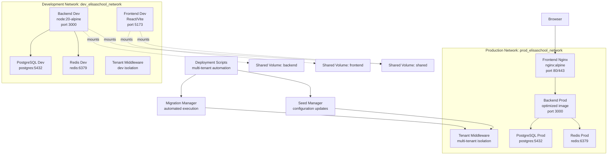
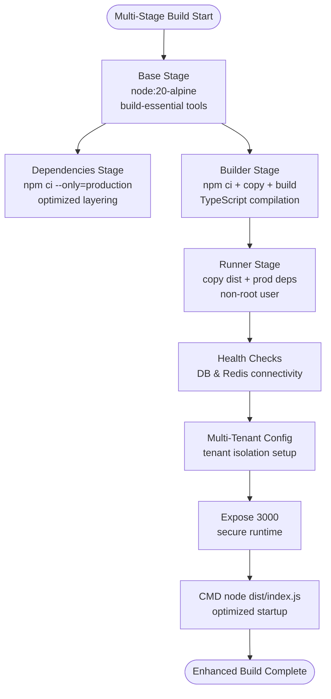
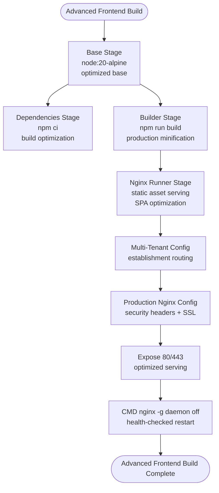
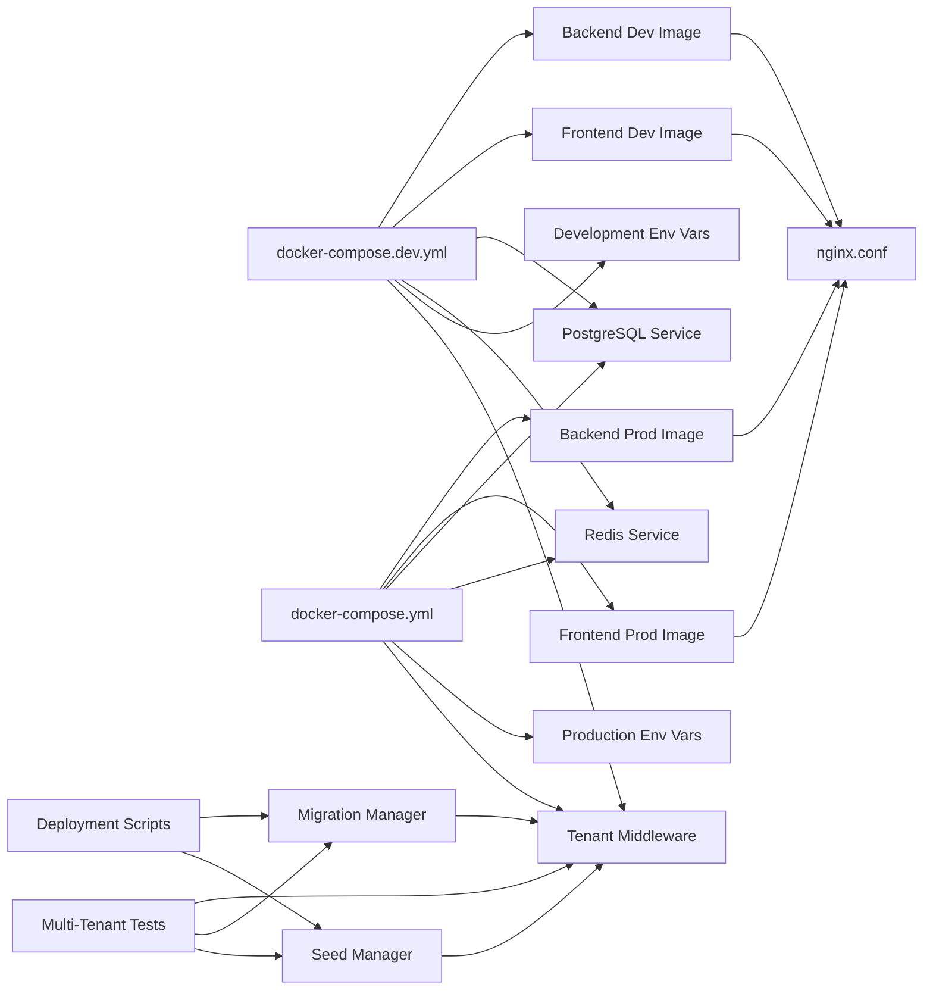

# Deployment & Docker Configuration

<cite>
**Referenced Files in This Document**
- [docker-compose.dev.yml](file://docker-compose.dev.yml)
- [docker-compose.yml](file://docker-compose.yml)
- [Dockerfile.backend](file://docker/Dockerfile.backend)
- [Dockerfile.frontend](file://docker/Dockerfile.frontend)
- [nginx.conf](file://docker/nginx.conf)
- [package.json](file://package.json)
- [backend/package.json](file://backend/package.json)
- [README.md](file://README.md)
- [env.config.ts](file://backend/src/config/env.config.ts)
- [database.config.ts](file://backend/src/config/database.config.ts)
- [data-source.ts](file://backend/src/database/data-source.ts)
- [deploy-multi-tenant-v3.sh](file://deploy-multi-tenant-v3.sh)
- [deploy-refonte-configuration.sh](file://deploy-refonte-configuration.sh)
- [deploy-all-migrations.sh](file://backend/deploy-all-migrations.sh)
- [run-seeds.sh](file://scripts/run-seeds.sh)
- [tenant.middleware.ts](file://backend/src/common/middlewares/tenant.middleware.ts)
- [use-multi-tenant.ts](file://frontend/src/hooks/use-multi-tenant.ts)
- [update-multi-tenant-structure.ts](file://backend/src/database/seeds/update-multi-tenant-structure.ts)
- [configuration-multi-tenant.spec.ts](file://backend/test/integration/configuration-multi-tenant.spec.ts)
- [multi-tenant-isolation.test.ts](file://backend/test/multi-tenant-isolation.test.ts)
</cite>

## Update Summary
**Changes Made**
- Added comprehensive multi-tenant deployment scripts and automation
- Integrated database migration management with automated deployment workflows
- Enhanced seed data management for multi-tenant configuration
- Updated deployment pipeline to support phased multi-tenant rollout
- Added tenant isolation middleware and frontend multi-tenant hooks
- Integrated comprehensive testing for multi-tenant functionality

## Table of Contents
1. [Introduction](#introduction)
2. [Project Structure](#project-structure)
3. [Core Components](#core-components)
4. [Architecture Overview](#architecture-overview)
5. [Development vs Production Configuration](#development-vs-production-configuration)
6. [Multi-Tenant Deployment Pipeline](#multi-tenant-deployment-pipeline)
7. [Database Migration Management](#database-migration-management)
8. [Seed Data Management](#seed-data-management)
9. [Tenant Isolation Implementation](#tenant-isolation-implementation)
10. [Detailed Component Analysis](#detailed-component-analysis)
11. [Dependency Analysis](#dependency-analysis)
12. [Performance Considerations](#performance-considerations)
13. [Troubleshooting Guide](#troubleshooting-guide)
14. [Conclusion](#conclusion)
15. [Appendices](#appendices)

## Introduction
This document provides comprehensive deployment guidance for eLISAschool, focusing on Docker containerization, multi-stage builds, orchestration with docker-compose, and production-grade configuration. The platform now features enhanced multi-tenant deployment capabilities with automated scripts, comprehensive database migration management, and robust seed data handling for multi-tenant environments.

## Project Structure
The repository maintains a monorepo structure with workspaces for backend, frontend, and shared packages. Docker artifacts are organized with separate configurations for development and production environments, while maintaining centralized Dockerfiles and Nginx configuration. New deployment scripts and multi-tenant configuration management are integrated throughout the project structure.



**Diagram sources**
- [docker-compose.dev.yml](file://docker-compose.dev.yml)
- [docker-compose.yml](file://docker-compose.yml)
- [Dockerfile.backend](file://docker/Dockerfile.backend)
- [Dockerfile.frontend](file://docker/Dockerfile.frontend)
- [nginx.conf](file://docker/nginx.conf)
- [package.json](file://package.json)
- [deploy-multi-tenant-v3.sh](file://deploy-multi-tenant-v3.sh)
- [deploy-refonte-configuration.sh](file://deploy-refonte-configuration.sh)
- [run-seeds.sh](file://scripts/run-seeds.sh)

**Section sources**
- [README.md](file://README.md)
- [package.json](file://package.json)

## Core Components
- **Development Environment**: docker-compose.dev.yml provides hot-reload development with live code reloading, volume mounting for rapid iteration, and development-specific service configurations.
- **Production Environment**: docker-compose.yml offers optimized production orchestration with health checks, resource constraints, and security hardening.
- **Enhanced Backend Service**: Multi-stage Dockerfile with improved build optimization, security hardening, and comprehensive health checks.
- **Optimized Frontend Service**: Advanced multi-stage build with Nginx configuration, static asset optimization, and production-ready serving.
- **Centralized Nginx Configuration**: Production-grade reverse proxy with SSL/TLS support, load balancing, and security headers.
- **Multi-Tenant Deployment Scripts**: Automated deployment pipeline for multi-tenant configuration with phased rollout strategy.
- **Database Migration Management**: Comprehensive migration system with automated execution and rollback capabilities.
- **Seed Data Management**: Structured seed data handling for multi-tenant environments with configuration updates.

**Section sources**
- [docker-compose.dev.yml](file://docker-compose.dev.yml)
- [docker-compose.yml](file://docker-compose.yml)
- [Dockerfile.backend](file://docker/Dockerfile.backend)
- [Dockerfile.frontend](file://docker/Dockerfile.frontend)
- [nginx.conf](file://docker/nginx.conf)
- [package.json](file://package.json)
- [deploy-multi-tenant-v3.sh](file://deploy-multi-tenant-v3.sh)
- [deploy-refonte-configuration.sh](file://deploy-refonte-configuration.sh)

## Architecture Overview
The deployment architecture now supports dual environments with distinct orchestration strategies and enhanced multi-tenant capabilities. The development configuration emphasizes rapid iteration and hot-reload capabilities, while production focuses on performance, security, and reliability with comprehensive multi-tenant support.



**Diagram sources**
- [docker-compose.dev.yml](file://docker-compose.dev.yml)
- [docker-compose.yml](file://docker-compose.yml)
- [Dockerfile.frontend](file://docker/Dockerfile.frontend)
- [Dockerfile.backend](file://docker/Dockerfile.backend)
- [tenant.middleware.ts](file://backend/src/common/middlewares/tenant.middleware.ts)
- [deploy-multi-tenant-v3.sh](file://deploy-multi-tenant-v3.sh)

## Development vs Production Configuration

### Development Environment (docker-compose.dev.yml)
The development configuration prioritizes rapid iteration and developer productivity:
- Hot-reload development server with automatic code reloading
- Volume mounting for real-time code changes
- Development-specific environment variables and debugging tools
- Simplified service dependencies for faster startup
- Port mappings optimized for local development (3000, 5173)
- Multi-tenant development isolation with tenant middleware

### Production Environment (docker-compose.yml)
The production configuration emphasizes performance, security, and reliability:
- Optimized multi-stage Docker builds with minimal attack surface
- Health checks for all services with proper dependency ordering
- Resource constraints and security hardening
- Production-ready Nginx configuration with SSL/TLS support
- Persistent volumes for critical data storage
- Enhanced multi-tenant isolation and security controls

**Section sources**
- [docker-compose.dev.yml](file://docker-compose.dev.yml)
- [docker-compose.yml](file://docker-compose.yml)

## Multi-Tenant Deployment Pipeline

### Phased Deployment Strategy
The multi-tenant deployment follows a structured five-phase approach:

**Phase 0: Preparation (1 day)**
- Complete database backup
- Create migration branch: `feat/config-migration`
- Set up isolated staging environment

**Phase 1: Data Migration (1-2 days)**
- Execute SQL scripts in staging environment
- Verify data consistency and integrity
- Manual testing of critical scenarios
- Establish rollback procedures with backup restoration

**Phase 2: Code Cleanup (3-4 days)**
- Remove ConfigurationApp from codebase
- Implement contextual helper functions
- Reduce isModuleActive() complexity to 2 levels
- Comprehensive unit and integration testing

**Phase 3: Authentication Multi-Tenant (2 days)**
- Fix login flow for multi-tenant support
- Correct refresh token handling
- Add establishment switching endpoint
- Multi-establishment testing

**Phase 4: Frontend Integration (2-3 days)**
- Update API call patterns for multi-tenant context
- Adapt React hooks for tenant-aware operations
- Test complete user flow
- Document all changes and updates

**Phase 5: Production Deployment (1 day)**
- Deploy during low-traffic hours
- Enhanced monitoring with logs and metrics
- Immediate rollback capability for critical errors
- User communication if necessary

### Deployment Automation Scripts
The deployment pipeline includes comprehensive automation:

**Main Deployment Script**: `deploy-multi-tenant-v3.sh`
- Orchestrates complete multi-tenant deployment
- Manages database migrations and seed data
- Handles environment-specific configurations
- Provides rollback and verification capabilities

**Configuration Refactoring Script**: `deploy-refonte-configuration.sh`
- Executes configuration migration process
- Handles data transformation and validation
- Manages cleanup and verification steps
- Supports automated testing and validation

**Migration Management**: `deploy-all-migrations.sh`
- Comprehensive migration execution
- Progress tracking and reporting
- Error handling and rollback procedures
- Success verification and next-step guidance

**Section sources**
- [deploy-multi-tenant-v3.sh](file://deploy-multi-tenant-v3.sh)
- [deploy-refonte-configuration.sh](file://deploy-refonte-configuration.sh)
- [deploy-all-migrations.sh](file://backend/deploy-all-migrations.sh)

## Database Migration Management

### Migration Execution Strategy
The database migration system provides comprehensive management for multi-tenant deployments:

**Automated Migration Execution**
- Sequential migration processing with dependency resolution
- Real-time progress tracking and status reporting
- Error handling with detailed failure analysis
- Success verification and completion notifications

**Migration Categories**
- **Multi-tenant Core**: `050-multi-tenant-v3-max-etablissements.sql`
- **Structure Academic**: `058-multi-tenant-structure-academique.sql`
- **Subject Management**: `059-multi-tenant-matiere.sql`
- **Performance Indexes**: Optimized database performance for multi-tenant queries

**Migration Verification**
- Automated success/failure counting and reporting
- Database object creation tracking (tables, indexes, materialized views)
- Migration dependency validation and conflict resolution
- Post-migration data consistency verification

### Migration Management Tools
**Migration Status Tracking**
- Real-time migration count and success metrics
- Detailed object creation statistics
- Failure analysis and dependency conflict resolution
- Next-step guidance for post-migration tasks

**Rollback Capabilities**
- Automated backup restoration procedures
- Migration dependency chain validation
- Data consistency verification before rollback
- Graceful degradation to previous state

**Section sources**
- [deploy-all-migrations.sh](file://backend/deploy-all-migrations.sh)
- [backend/database/migrations/050-multi-tenant-v3-max-etablissements.sql](file://backend/database/migrations/050-multi-tenant-v3-max-etablissements.sql)
- [backend/database/migrations/058-multi-tenant-structure-academique.sql](file://backend/database/migrations/058-multi-tenant-structure-academique.sql)
- [backend/database/migrations/059-multi-tenant-matiere.sql](file://backend/database/migrations/059-multi-tenant-matiere.sql)

## Seed Data Management

### Multi-Tenant Seed Data Strategy
The seed data management system provides structured data initialization for multi-tenant environments:

**Seed Data Categories**
- **Initial Configuration**: Basic system setup and default parameters
- **Multi-Tenant Structure**: Establishment and tenant-specific data structures
- **RBAC Configuration**: Role-based access control initialization
- **Academic Structure**: Educational program and curriculum data
- **User Management**: Default user accounts and role assignments

**Seed Data Automation**
- **Structured Execution**: Sequential seed data processing with validation
- **Multi-Tenant Updates**: Context-aware seed data for tenant isolation
- **Verification Procedures**: Data integrity and consistency validation
- **Error Handling**: Robust error management and recovery procedures

**Multi-Tenant Seed Updates**
- Context-aware data population for tenant isolation
- Establishment-specific configuration data
- Role-based user assignment per tenant
- Academic structure adaptation for multi-tenant environments

### Seed Data Management Scripts
**Seed Execution Flow**
- Automated seed data processing with progress tracking
- Multi-tenant aware data population and validation
- Integration with migration system for coordinated deployment
- Verification and cleanup procedures

**Seed Data Verification**
- Data integrity validation and consistency checks
- Multi-tenant isolation verification
- Role-based access control validation
- Academic structure and user data verification

**Section sources**
- [run-seeds.sh](file://scripts/run-seeds.sh)
- [backend/src/database/seeds/update-multi-tenant-structure.ts](file://backend/src/database/seeds/update-multi-tenant-structure.ts)

## Tenant Isolation Implementation

### Backend Tenant Middleware
The tenant isolation middleware provides comprehensive multi-tenant support at the application level:

**Tenant Context Management**
- Automatic tenant identification from requests
- Contextual data filtering and isolation
- Establishment-specific business logic enforcement
- Multi-tenant aware authentication and authorization

**Middleware Implementation**
- Request preprocessing for tenant context extraction
- Database query isolation and filtering
- Cache key management with tenant awareness
- Session and user data isolation

**Tenant-Aware Services**
- Database service layer with tenant context
- Cache service with tenant-specific keys
- Logging and audit trail with tenant identification
- Notification and messaging with tenant targeting

### Frontend Multi-Tenant Hooks
The frontend provides comprehensive multi-tenant support through React hooks:

**Establishment Selection**
- Multi-establishment user interface
- Establishment switching capabilities
- Context-aware UI rendering
- Tenant-specific feature availability

**Tenant-Aware State Management**
- Multi-tenant state isolation
- Establishment-specific data loading
- Context-aware permission checking
- Tenant-specific configuration management

**User Experience Features**
- Seamless establishment switching
- Context-aware navigation and routing
- Tenant-specific feature flags and availability
- Multi-establishment user interface adaptation

**Section sources**
- [tenant.middleware.ts](file://backend/src/common/middlewares/tenant.middleware.ts)
- [use-multi-tenant.ts](file://frontend/src/hooks/use-multi-tenant.ts)

## Detailed Component Analysis

### Enhanced Backend Service Containerization
The backend Dockerfile implements an advanced multi-stage build process:
- **Base Stage**: Node.js 20 Alpine with essential build tools and compatibility libraries
- **Dependencies Stage**: Optimized installation of production dependencies only
- **Builder Stage**: Comprehensive dependency installation, source compilation, and TypeScript transpilation
- **Runner Stage**: Final optimized image with non-root user execution, health checks, and security hardening

Security and runtime enhancements:
- Non-root user execution with proper file permissions
- Comprehensive environment variable validation and sanitization
- Built-in health checks for database and cache connectivity
- Optimized startup sequence with dependency coordination
- Production-specific environment optimizations
- Multi-tenant configuration support and isolation



**Diagram sources**
- [Dockerfile.backend](file://docker/Dockerfile.backend)

**Section sources**
- [Dockerfile.backend](file://docker/Dockerfile.backend)
- [docker-compose.dev.yml](file://docker-compose.dev.yml)
- [docker-compose.yml](file://docker-compose.yml)
- [env.config.ts](file://backend/src/config/env.config.ts)

### Advanced Frontend Service Containerization
The frontend Dockerfile implements sophisticated multi-stage optimization:
- **Base Stage**: Node.js 20 Alpine mirroring backend configuration
- **Dependencies Stage**: Build-time dependency installation with optimization
- **Builder Stage**: React/Vite application build with production optimizations
- **Runner Stage**: Nginx-based production serving with comprehensive configuration

Nginx production configuration includes:
- Static asset optimization with long-term caching and compression
- SPA routing with fallback to index.html for client-side navigation
- API proxy configuration with proper header forwarding
- Security headers including CSP, XSS protection, and frame options
- SSL/TLS support for production deployments
- Multi-tenant aware routing and establishment selection



**Diagram sources**
- [Dockerfile.frontend](file://docker/Dockerfile.frontend)
- [nginx.conf](file://docker/nginx.conf)

**Section sources**
- [Dockerfile.frontend](file://docker/Dockerfile.frontend)
- [nginx.conf](file://docker/nginx.conf)

### Dual Orchestration Strategy
The platform now supports two distinct orchestration approaches:

**Development Orchestration (docker-compose.dev.yml)**:
- Hot-reload development with automatic code reloading
- Volume mounting for real-time code changes
- Development-specific service configurations
- Simplified dependency chains for faster startup
- Port mappings optimized for local development
- Multi-tenant development isolation

**Production Orchestration (docker-compose.yml)**:
- Optimized multi-stage built images
- Comprehensive health checks with proper dependency ordering
- Resource constraints and security hardening
- Production-ready networking and volume management
- Health-checked service startup and graceful shutdown
- Enhanced multi-tenant isolation and security controls

Networking and volume management:
- Separate networks for development and production isolation
- Named volumes for persistent data storage
- Proper service dependency chains with health checks
- Environment-specific configuration management
- Multi-tenant network isolation and security

**Section sources**
- [docker-compose.dev.yml](file://docker-compose.dev.yml)
- [docker-compose.yml](file://docker-compose.yml)

### Environment Configuration and Validation
The backend implements comprehensive environment validation using Zod schemas:
- **Critical Parameters**: JWT_SECRET (minimum 32 characters), ENCRYPTION_KEY (minimum 32 characters)
- **Database Configuration**: POSTGRES_HOST, PORT, NAME, USER, PASSWORD with URL validation
- **Redis Configuration**: Connection parameters with type coercion and validation
- **Application Settings**: PORT, NODE_ENV, CORS origins with format validation
- **Multi-Tenant Settings**: ESTABLISHMENT_ID, TENANT_MODE with validation
- **Default Values**: Development defaults with explicit production overrides

Database configuration enhancements:
- TypeORM integration with connection pooling and SSL support
- Cloud provider compatibility with relaxed certificate verification
- Migration and seed script integration
- Health check endpoint for service discovery
- Multi-tenant database isolation and context management

**Section sources**
- [env.config.ts](file://backend/src/config/env.config.ts)
- [database.config.ts](file://backend/src/config/database.config.ts)
- [data-source.ts](file://backend/src/database/data-source.ts)

### Security Hardening and Compliance
Enhanced security measures across all components:
- **Backend Security**: Helmet.js integration, rate limiting, input validation, and secure headers
- **Container Security**: Non-root user execution, minimal base images, and vulnerability scanning
- **Network Security**: Health checks, service dependencies, and secure communication protocols
- **Data Protection**: Environment variable encryption, secure key management, and data validation
- **Runtime Security**: Process isolation, resource limits, and graceful shutdown handling
- **Multi-Tenant Security**: Tenant isolation, context validation, and data separation

Production security enhancements:
- SSL/TLS termination with modern cipher suites
- Security headers compliance (CSP, HSTS, X-Frame-Options)
- Input sanitization and output encoding
- Audit logging and monitoring integration
- Multi-tenant data isolation and security controls

**Section sources**
- [backend/package.json](file://backend/package.json)
- [nginx.conf](file://docker/nginx.conf)
- [Dockerfile.backend](file://docker/Dockerfile.backend)

## Dependency Analysis
The enhanced Docker infrastructure creates clear dependency relationships between services and configurations, with new multi-tenant deployment dependencies:



**Diagram sources**
- [docker-compose.dev.yml](file://docker-compose.dev.yml)
- [docker-compose.yml](file://docker-compose.yml)
- [Dockerfile.backend](file://docker/Dockerfile.backend)
- [Dockerfile.frontend](file://docker/Dockerfile.frontend)
- [nginx.conf](file://docker/nginx.conf)
- [deploy-multi-tenant-v3.sh](file://deploy-multi-tenant-v3.sh)
- [tenant.middleware.ts](file://backend/src/common/middlewares/tenant.middleware.ts)

**Section sources**
- [docker-compose.dev.yml](file://docker-compose.dev.yml)
- [docker-compose.yml](file://docker-compose.yml)
- [env.config.ts](file://backend/src/config/env.config.ts)
- [database.config.ts](file://backend/src/config/database.config.ts)
- [data-source.ts](file://backend/src/database/data-source.ts)
- [Dockerfile.backend](file://docker/Dockerfile.backend)
- [Dockerfile.frontend](file://docker/Dockerfile.frontend)
- [nginx.conf](file://docker/nginx.conf)
- [deploy-multi-tenant-v3.sh](file://deploy-multi-tenant-v3.sh)
- [tenant.middleware.ts](file://backend/src/common/middlewares/tenant.middleware.ts)

## Performance Considerations
Enhanced performance optimizations across the Docker infrastructure with multi-tenant considerations:
- **Multi-stage Builds**: Significantly reduced final image sizes with optimized layering
- **Build Optimization**: Development vs production build strategies with appropriate optimizations
- **Resource Management**: CPU and memory limits for predictable performance
- **Connection Pooling**: Database connection pooling and Redis optimization
- **Static Asset Serving**: Nginx optimization with compression and caching strategies
- **Health Check Optimization**: Efficient service discovery and dependency management
- **Multi-Tenant Performance**: Tenant isolation overhead minimization and caching strategies
- **Migration Performance**: Optimized migration execution with parallel processing capabilities
- **Seed Data Performance**: Efficient seed data loading with batch processing and validation

Development performance enhancements:
- Hot-reload capabilities with efficient file watching
- Volume mounting optimizations for rapid iteration
- Development-specific caching strategies
- Reduced build times through selective compilation
- Multi-tenant development isolation without performance impact

Production performance optimizations:
- Minimal attack surface through optimized base images
- Efficient resource utilization with proper constraints
- CDN-ready static asset optimization
- Health check-based service discovery
- Multi-tenant query optimization and caching
- Migration performance tuning and parallel execution

## Troubleshooting Guide

### Development Environment Issues
**Hot Reload Not Working**:
- Verify volume mounts are properly configured in docker-compose.dev.yml
- Check file permissions and ownership in mounted directories
- Ensure development ports (3000, 5173) are not blocked by other processes
- Validate that nodemon is running in the backend container
- Check tenant middleware configuration for development isolation

**Backend Development Server Issues**:
- Review development environment variables in docker-compose.dev.yml
- Check for TypeScript compilation errors in backend logs
- Verify database connectivity with health check endpoints
- Ensure Redis connection is established before backend startup
- Validate multi-tenant configuration in development environment

**Frontend Development Problems**:
- Confirm Vite development server is running on port 5173
- Check browser console for webpack/hot-reload errors
- Verify API proxy configuration in development environment
- Ensure proper CORS settings for development
- Validate multi-tenant establishment selection in development

### Production Environment Issues
**Service Startup Failures**:
- Review health check logs for database and Redis connectivity
- Check production environment variables and secrets
- Verify volume permissions for persistent data storage
- Monitor container resource utilization and limits
- Validate multi-tenant configuration and isolation

**Performance Issues**:
- Analyze container resource usage and adjust limits
- Review database connection pooling configuration
- Check Redis memory usage and eviction policies
- Monitor Nginx performance and static asset serving
- Evaluate multi-tenant performance impact and optimization

**Security and Compliance Issues**:
- Verify SSL/TLS certificate configuration
- Check security headers and CSP policies
- Review audit logs for suspicious activities
- Ensure proper key rotation and secret management
- Validate multi-tenant data isolation and security controls

### Multi-Tenant Deployment Issues
**Migration Failures**:
- Review migration logs for specific error details
- Check database connectivity and migration prerequisites
- Verify seed data integrity and multi-tenant configuration
- Validate rollback procedures and backup restoration
- Ensure proper dependency resolution in migration chain

**Tenant Isolation Problems**:
- Verify tenant middleware configuration and operation
- Check establishment context propagation through services
- Validate multi-tenant data filtering and isolation
- Review cache key management for tenant separation
- Test multi-tenant user authentication and authorization

**Seed Data Issues**:
- Verify seed data execution order and dependencies
- Check multi-tenant seed data context and isolation
- Validate data integrity and consistency after seeding
- Review seed data error handling and recovery procedures
- Ensure proper cleanup and verification after seed execution

### Common Operational Commands
```bash
# Development Environment
docker-compose -f docker-compose.dev.yml up -d
docker-compose -f docker-compose.dev.yml logs -f
docker-compose -f docker-compose.dev.yml down

# Production Environment  
docker-compose up -d
docker-compose logs -f
docker-compose down

# Multi-Tenant Deployment
./deploy-multi-tenant-v3.sh
./deploy-refonte-configuration.sh
./backend/deploy-all-migrations.sh

# Health Check Verification
docker-compose ps
docker-compose exec backend healthcheck
docker-compose exec frontend healthcheck

# Multi-Tenant Testing
docker-compose exec backend npx jest backend/test/integration/configuration-multi-tenant.spec.ts
docker-compose exec backend npx jest backend/test/multi-tenant-isolation.test.ts
```

**Section sources**
- [docker-compose.dev.yml](file://docker-compose.dev.yml)
- [docker-compose.yml](file://docker-compose.yml)
- [env.config.ts](file://backend/src/config/env.config.ts)
- [backend/package.json](file://backend/package.json)
- [package.json](file://package.json)
- [deploy-multi-tenant-v3.sh](file://deploy-multi-tenant-v3.sh)
- [deploy-refonte-configuration.sh](file://deploy-refonte-configuration.sh)
- [configuration-multi-tenant.spec.ts](file://backend/test/integration/configuration-multi-tenant.spec.ts)
- [multi-tenant-isolation.test.ts](file://backend/test/multi-tenant-isolation.test.ts)

## Conclusion
eLISAschool's enhanced Docker-based deployment infrastructure now provides a comprehensive solution for both development and production environments with advanced multi-tenant capabilities. The dual configuration strategy with separate docker-compose files enables optimal development workflows while maintaining production-grade reliability and security. The improved multi-stage Dockerfile implementations deliver enhanced performance, security, and maintainability, supporting scalable deployment operations with automated multi-tenant deployment scripts, comprehensive database migration management, and robust seed data handling.

## Appendices

### Enhanced Deployment Checklist
**Development Environment**:
- Install Docker and Docker Compose v2+ on development machines
- Configure development environment variables in docker-compose.dev.yml
- Verify volume mounts for backend, frontend, and shared directories
- Test hot-reload functionality and development server accessibility
- Validate database and Redis connectivity in development mode
- Verify multi-tenant development isolation and establishment selection

**Production Environment**:
- Prepare production environment variables and secrets management
- Configure SSL/TLS certificates and security headers
- Set up health checks and monitoring infrastructure
- Plan for horizontal scaling and load balancing
- Establish backup and disaster recovery procedures
- Configure multi-tenant isolation and security controls

**Multi-Tenant Deployment**:
- Execute preparation phase with database backup and staging setup
- Run data migration phase with manual testing and rollback procedures
- Complete code cleanup phase with comprehensive testing
- Implement authentication multi-tenant features
- Test frontend multi-tenant functionality and user experience
- Execute production deployment during low-traffic hours

**Post-Deployment Verification**:
- Validate service health and dependency chains
- Test API endpoints and frontend functionality
- Verify SSL/TLS configuration and security headers
- Monitor container resource utilization and performance
- Validate multi-tenant isolation and data separation
- Document deployment procedures and rollback processes

### Development Workflow Best Practices
- Use docker-compose.dev.yml for active development with hot-reload
- Implement proper version control for Docker configuration files
- Maintain separate environment configurations for different stages
- Regularly update base images and security patches
- Implement CI/CD pipelines for automated testing and deployment
- Test multi-tenant functionality in development environment
- Validate migration procedures and seed data execution

### Production Operations Guide
- Monitor container health and service dependencies
- Implement proper logging and log aggregation
- Establish automated backup and recovery procedures
- Configure alerting for critical system events
- Plan for capacity planning and scaling requirements
- Monitor multi-tenant performance and resource utilization
- Implement comprehensive testing for multi-tenant functionality
- Establish rollback procedures for multi-tenant deployments