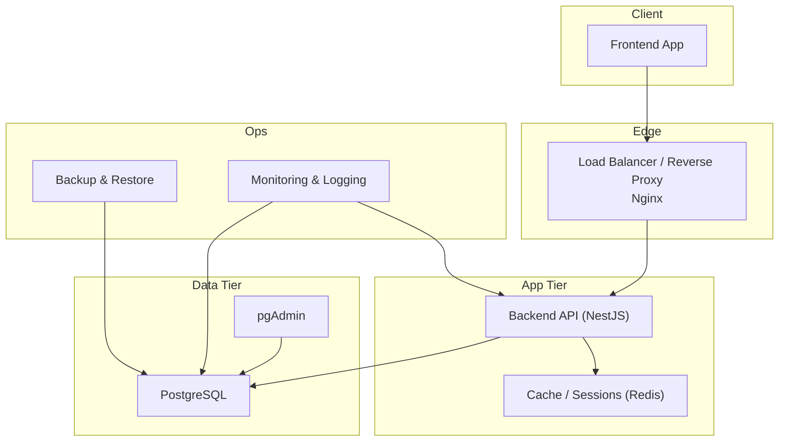
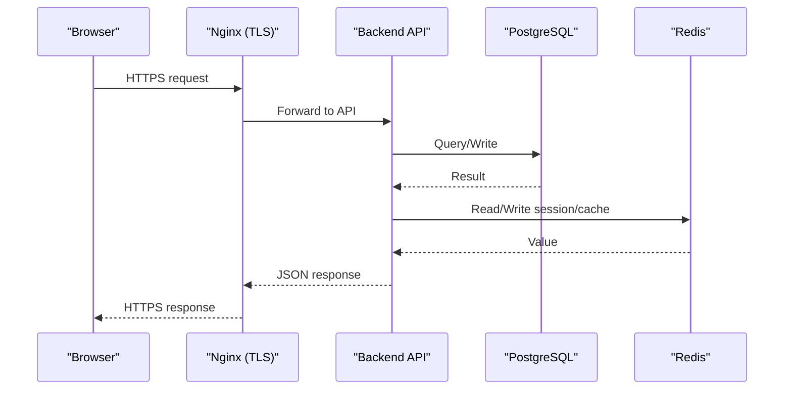
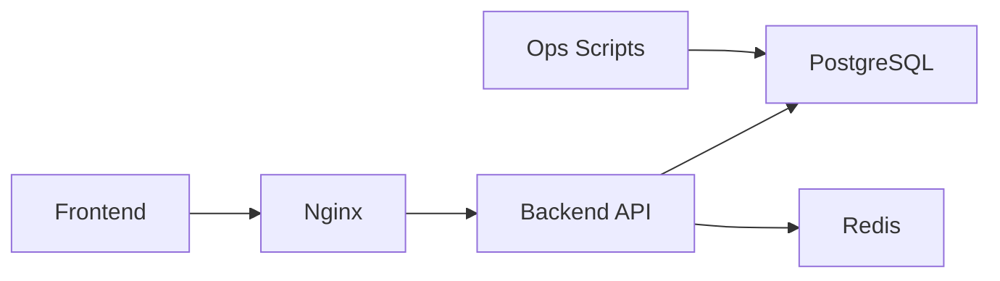

# Deployment & Operations

<cite>
**Referenced Files in This Document**
- [docker-compose.yml](file://docker/docker-compose.yml)
- [Dockerfile.backend](file://docker/Dockerfile.backend)
- [Dockerfile.frontend](file://docker/Dockerfile.frontend)
- [nginx.conf](file://docker/nginx.conf)
- [deploy.sh](file://docker/deploy.sh)
- [docker-compose.local.dev.yml](file://docker/docker-compose.local.dev.yml)
- [docker-compose.local.prod.yml](file://docker/docker-compose.local.prod.yml)
- [docker-compose.cloud.dev.yml](file://docker/docker-compose.cloud.dev.yml)
- [docker-compose.cloud.prod.yml](file://docker/docker-compose.cloud.prod.yml)
- [backup-auto.sh](file://docker/scripts/backup-auto.sh)
- [backup-manuel.sh](file://docker/scripts/backup-manuel.sh)
- [restore.sh](file://docker/scripts/restore.sh)
- [update.sh](file://docker/scripts/update.sh)
- [validate-infrastructure.sh](file://docker/scripts/validate-infrastructure.sh)
- [cron-backup.txt](file://docker/scripts/cron-backup.txt)
- [install-cron.sh](file://docker/scripts/install-cron.sh)
- [package.json](file://backend/package.json)
- [tsconfig.json](file://backend/tsconfig.json)
- [app.ts](file://backend/src/app.ts)
- [index.ts](file://backend/src/index.ts)
- [database.config.ts](file://backend/src/config/database.config.ts)
- [env.config.ts](file://backend/src/config/env.config.ts)
- [data-source.ts](file://backend/src/database/data-source.ts)
- [monitoring module](file://backend/src/modules/monitoring/)
</cite>

## Table of Contents
1. [Introduction](#introduction)
2. [Project Structure](#project-structure)
3. [Core Components](#core-components)
4. [Architecture Overview](#architecture-overview)
5. [Detailed Component Analysis](#detailed-component-analysis)
6. [Dependency Analysis](#dependency-analysis)
7. [Performance Considerations](#performance-considerations)
8. [Troubleshooting Guide](#troubleshooting-guide)
9. [Conclusion](#conclusion)
10. [Appendices](#appendices)

## Introduction
This document provides production-grade deployment and operations guidance for eLISAschool. It covers Docker-based deployment strategies, container orchestration, environment configuration, SSL setup, load balancing, scaling, monitoring and logging, health checks, alerting, backup and disaster recovery, database maintenance, performance tuning, security hardening, vulnerability scanning, compliance considerations, updates and rollbacks, and troubleshooting common issues.

## Project Structure
The repository includes a full-stack application with:
- Backend (NestJS-based) under backend/src
- Frontend under frontend/src
- Shared libraries under shared/src
- Comprehensive Docker tooling under docker/
- Database migrations and scripts under backend/database/migrations and backend/scripts
- Operational scripts under docker/scripts and scripts/
- Documentation under docs/

[No sources needed since this diagram shows conceptual workflow, not actual code structure]

**Section sources**
- [docker-compose.yml](file://docker/docker-compose.yml)
- [Dockerfile.backend](file://docker/Dockerfile.backend)
- [Dockerfile.frontend](file://docker/Dockerfile.frontend)
- [nginx.conf](file://docker/nginx.conf)

## Core Components
- Container images:
  - Backend image built from Dockerfile.backend
  - Frontend image built from Dockerfile.frontend
- Orchestration:
  - docker-compose files for local dev/prod and cloud profiles
- Reverse proxy:
  - Nginx configuration for routing, TLS termination, and static assets
- Data persistence:
  - PostgreSQL service with backups and restore utilities
- Monitoring:
  - Health endpoints and metrics integration points via backend modules

Key operational entry points:
- deploy.sh for one-command deployments
- update.sh for rolling updates
- validate-infrastructure.sh for pre-flight checks
- Backup and restore scripts under docker/scripts

**Section sources**
- [deploy.sh](file://docker/deploy.sh)
- [update.sh](file://docker/scripts/update.sh)
- [validate-infrastructure.sh](file://docker/scripts/validate-infrastructure.sh)
- [Dockerfile.backend](file://docker/Dockerfile.backend)
- [Dockerfile.frontend](file://docker/Dockerfile.frontend)
- [nginx.conf](file://docker/nginx.conf)

## Architecture Overview
Production architecture highlights:
- Multi-profile compose stacks for local and cloud environments
- Reverse proxy terminates TLS and routes to backend
- Stateless backend instances behind load balancer
- Persistent data on PostgreSQL volumes
- Optional Redis for caching/sessions
- Centralized logging and metrics collection hooks

**Diagram sources**
- [nginx.conf](file://docker/nginx.conf)
- [docker-compose.local.prod.yml](file://docker/docker-compose.local.prod.yml)
- [docker-compose.cloud.prod.yml](file://docker/docker-compose.cloud.prod.yml)

**Section sources**
- [docker-compose.local.prod.yml](file://docker/docker-compose.local.prod.yml)
- [docker-compose.cloud.prod.yml](file://docker/docker-compose.cloud.prod.yml)
- [nginx.conf](file://docker/nginx.conf)

## Detailed Component Analysis

### Docker Compose Profiles and Environments
- Local development: docker-compose.local.dev.yml
- Local production-like: docker-compose.local.prod.yml
- Cloud development: docker-compose.cloud.dev.yml
- Cloud production: docker-compose.cloud.prod.yml
- Root compose: docker-compose.yml

Operational notes:
- Use profiles or separate files per environment
- Externalize secrets via environment files
- Pin versions and tags for reproducibility
- Separate networks for app and data tiers

**Section sources**
- [docker-compose.yml](file://docker/docker-compose.yml)
- [docker-compose.local.dev.yml](file://docker/docker-compose.local.dev.yml)
- [docker-compose.local.prod.yml](file://docker/docker-compose.local.prod.yml)
- [docker-compose.cloud.dev.yml](file://docker/docker-compose.cloud.dev.yml)
- [docker-compose.cloud.prod.yml](file://docker/docker-compose.cloud.prod.yml)

### Backend Image Build and Runtime
- Build context and dependencies managed by Dockerfile.backend
- Node runtime selection and dependency installation strategy
- Application startup via NestJS bootstrap
- Environment-driven configuration through env.config.ts and database.config.ts
- Type-safe config validation recommended before startup

Best practices:
- Multi-stage builds for smaller images
- Non-root user inside containers
- Healthcheck and readiness probes
- Graceful shutdown handling

**Section sources**
- [Dockerfile.backend](file://docker/Dockerfile.backend)
- [package.json](file://backend/package.json)
- [tsconfig.json](file://backend/tsconfig.json)
- [app.ts](file://backend/src/app.ts)
- [index.ts](file://backend/src/index.ts)
- [env.config.ts](file://backend/src/config/env.config.ts)
- [database.config.ts](file://backend/src/config/database.config.ts)

### Frontend Image Build and Serving
- Static asset build via Dockerfile.frontend
- Serve via reverse proxy or lightweight server
- Asset cache headers configured at proxy layer

**Section sources**
- [Dockerfile.frontend](file://docker/Dockerfile.frontend)
- [nginx.conf](file://docker/nginx.conf)

### Reverse Proxy and TLS Termination
- Nginx handles:
  - TLS termination with certificates
  - Routing to backend API
  - Static asset serving and caching
  - Security headers and rate limiting
  - Optional WebSocket support if required

Recommendations:
- Use ACME/Let’s Encrypt automation
- Enable HSTS and modern cipher suites
- Configure upstream keepalive
- Set timeouts appropriate for long-running tasks

**Section sources**
- [nginx.conf](file://docker/nginx.conf)

### Database Configuration and Migrations
- Connection settings centralized in database.config.ts
- Data source initialization in data-source.ts
- Migration scripts under backend/database/migrations
- Scripts to run migrations and verify integrity

Operational procedures:
- Run migrations during zero-downtime deployments using blue/green or canary
- Back up schema and data prior to migration
- Validate migration idempotency
- Monitor slow queries post-migration

**Section sources**
- [database.config.ts](file://backend/src/config/database.config.ts)
- [data-source.ts](file://backend/src/database/data-source.ts)
- [backend/database/migrations](file://backend/database/migrations)

### Monitoring, Metrics, and Health Checks
- Backend exposes health and metrics endpoints
- Integrate with external monitoring systems (e.g., Prometheus, APM)
- Structured logging with correlation IDs
- Log aggregation pipeline (e.g., Loki/ELK)

Implementation pointers:
- Expose /health and /metrics endpoints
- Emit structured logs with tenant/context fields
- Instrument DB and cache calls
- Add readiness/liveness probes for orchestrators

**Section sources**
- [monitoring module](file://backend/src/modules/monitoring/)
- [app.ts](file://backend/src/app.ts)
- [index.ts](file://backend/src/index.ts)

### Load Balancing and Scaling
- Horizontal scaling of stateless backend replicas
- Sticky sessions only if required; prefer stateless design
- Use connection pooling for DB and cache
- Tune worker processes and threads per replica

Orchestrator tips:
- Set resource requests/limits
- Configure autoscaling policies
- Use rolling updates with maxUnavailable/maxSurge

**Section sources**
- [docker-compose.local.prod.yml](file://docker/docker-compose.local.prod.yml)
- [docker-compose.cloud.prod.yml](file://docker/docker-compose.cloud.prod.yml)

### SSL Setup
- Provide certificate paths to Nginx
- Automate renewal via ACME client
- Redirect HTTP to HTTPS
- Configure secure cookie flags and HSTS

**Section sources**
- [nginx.conf](file://docker/nginx.conf)

### Logging Strategy
- Centralized log collection
- Include request ID, tenant, endpoint, latency, status
- Rotate logs and set retention policies
- Alert on error spikes and slow responses

**Section sources**
- [monitoring module](file://backend/src/modules/monitoring/)

### Alerting Mechanisms
- Define SLOs and SLIs
- Alert on:
  - Error rates
  - Latency p95/p99
  - DB connection pool saturation
  - Disk usage and replication lag
- Integrate with notification channels (email, Slack, PagerDuty)

[No sources needed since this section provides general guidance]

### Backup and Disaster Recovery
Automated and manual backups are provided:
- Automated daily backups via cron-backed script
- Manual backup trigger
- Restore procedure
- Cron definitions and installer

Procedures:
- Schedule frequent backups (daily + transaction logs if supported)
- Test restores regularly
- Retain multiple generations (daily/weekly/monthly)
- Store backups offsite and encrypted

**Section sources**
- [backup-auto.sh](file://docker/scripts/backup-auto.sh)
- [backup-manuel.sh](file://docker/scripts/backup-manuel.sh)
- [restore.sh](file://docker/scripts/restore.sh)
- [cron-backup.txt](file://docker/scripts/cron-backup.txt)
- [install-cron.sh](file://docker/scripts/install-cron.sh)

### Database Maintenance
- Periodic VACUUM/ANALYZE
- Index rebuilds where necessary
- Slow query analysis and optimization
- Capacity planning and growth forecasting

**Section sources**
- [backend/database/migrations](file://backend/database/migrations)

### Performance Tuning
- Backend:
  - Increase worker count based on CPU cores
  - Tune GC parameters for Node.js
  - Enable compression at proxy
- Database:
  - Adjust shared_buffers, work_mem, effective_cache_size
  - Tune connection limits and pool sizes
- Caching:
  - Cache hot reads and expensive computations
  - Set TTLs appropriately

[No sources needed since this section provides general guidance]

### Security Hardening
- Least privilege for services and users
- Secrets management via environment vaults
- Network segmentation between tiers
- Regular patching of base images and OS
- Input validation and output encoding
- Rate limiting and WAF rules at edge

Vulnerability scanning:
- Scan images and dependencies regularly
- Enforce policy gates in CI/CD
- Track CVEs and remediate promptly

Compliance:
- Audit logging and retention
- Data encryption at rest and in transit
- Access controls and role-based permissions
- Data minimization and privacy controls

**Section sources**
- [nginx.conf](file://docker/nginx.conf)
- [env.config.ts](file://backend/src/config/env.config.ts)

### Updates and Rollbacks
- Rolling updates with health checks
- Blue/green or canary deployments for critical releases
- Database migration rollback plan
- Artifact version pinning and immutable images

Operational scripts:
- update.sh for safe updates
- deploy.sh for full stack deployment
- validate-infrastructure.sh for pre-checks

**Section sources**
- [update.sh](file://docker/scripts/update.sh)
- [deploy.sh](file://docker/deploy.sh)
- [validate-infrastructure.sh](file://docker/scripts/validate-infrastructure.sh)

### Troubleshooting Common Issues
- Connectivity:
  - Verify DNS, ports, firewall rules
  - Check service discovery and network policies
- TLS:
  - Certificate validity and chain
  - Cipher suite compatibility
- Database:
  - Connection pool exhaustion
  - Lock contention and long transactions
- Performance:
  - Identify slow endpoints and queries
  - Inspect memory/CPU usage and GC pauses
- Logs:
  - Correlate request IDs across services
  - Aggregate and search logs centrally

**Section sources**
- [validate-infrastructure.sh](file://docker/scripts/validate-infrastructure.sh)
- [monitoring module](file://backend/src/modules/monitoring/)

## Dependency Analysis
High-level runtime dependencies:
- Backend depends on PostgreSQL and optionally Redis
- Frontend is static assets served by Nginx
- Nginx depends on valid TLS certs and upstream backend
- Backup tools depend on pg_dump/restore availability

**Diagram sources**
- [docker-compose.local.prod.yml](file://docker/docker-compose.local.prod.yml)
- [docker-compose.cloud.prod.yml](file://docker/docker-compose.cloud.prod.yml)
- [nginx.conf](file://docker/nginx.conf)

**Section sources**
- [docker-compose.local.prod.yml](file://docker/docker-compose.local.prod.yml)
- [docker-compose.cloud.prod.yml](file://docker/docker-compose.cloud.prod.yml)
- [nginx.conf](file://docker/nginx.conf)

## Performance Considerations
- Right-size containers and set resource quotas
- Use connection pooling for DB and cache
- Enable HTTP/2 and gzip/brotli at proxy
- Cache static assets aggressively
- Monitor and tune DB indexes and queries
- Implement pagination and selective field retrieval

[No sources needed since this section provides general guidance]

## Troubleshooting Guide
Systematic approach:
- Reproduce with minimal steps
- Collect logs, metrics, and traces
- Isolate component failures
- Validate configuration drift
- Test failover and recovery paths

Useful commands and artifacts:
- Infrastructure validation script
- Backup/restore scripts
- Health and metrics endpoints
- Database diagnostics and migration logs

**Section sources**
- [validate-infrastructure.sh](file://docker/scripts/validate-infrastructure.sh)
- [backup-auto.sh](file://docker/scripts/backup-auto.sh)
- [restore.sh](file://docker/scripts/restore.sh)

## Conclusion
eLISAschool provides a robust, containerized foundation suitable for production. By following the outlined procedures for deployment, scaling, monitoring, backups, security, and maintenance, operators can achieve high availability, reliability, and performance while maintaining strong security and compliance posture.

## Appendices

### Environment Variables Checklist
- Backend:
  - Database URL, credentials, pool size
  - Redis URL and options
  - JWT secret and token expiry
  - Feature flags and module toggles
  - Logging level and format
- Nginx:
  - TLS cert and key paths
  - Upstream backend address
  - Timeouts and buffer sizes
- Orchestrator:
  - Resource limits and requests
  - Autoscaling thresholds
  - Secret store references

[No sources needed since this section provides general guidance]

### Pre-Deployment Validation
- Run infrastructure validation
- Verify connectivity to DB and cache
- Confirm TLS configuration
- Dry-run migrations on staging
- Smoke test core flows

**Section sources**
- [validate-infrastructure.sh](file://docker/scripts/validate-infrastructure.sh)

### Post-Deployment Verification
- Health and readiness checks pass
- Metrics baseline established
- Alerts firing correctly
- Backups scheduled and verified
- Rollback procedure tested

**Section sources**
- [monitoring module](file://backend/src/modules/monitoring/)
- [backup-auto.sh](file://docker/scripts/backup-auto.sh)