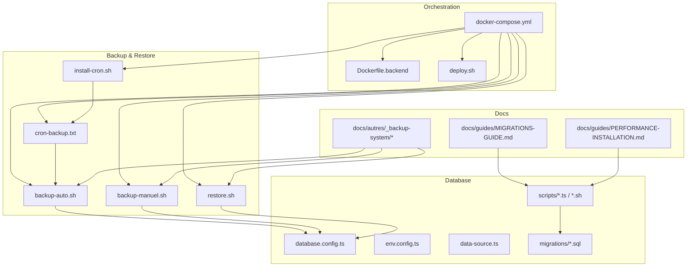
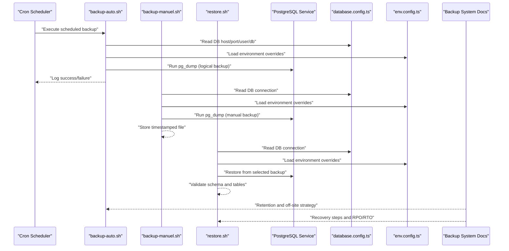
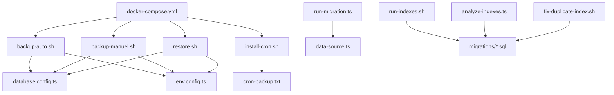

# Maintenance & Backup

<cite>
**Referenced Files in This Document**
- [docker-compose.yml](file://docker/docker-compose.yml)
- [backup-auto.sh](file://docker/scripts/backup-auto.sh)
- [backup-manuel.sh](file://docker/scripts/backup-manuel.sh)
- [restore.sh](file://docker/scripts/restore.sh)
- [cron-backup.txt](file://docker/scripts/cron-backup.txt)
- [install-cron.sh](file://docker/scripts/install-cron.sh)
- [update.sh](file://docker/scripts/update.sh)
- [validate-infrastructure.sh](file://docker/scripts/validate-infrastructure.sh)
- [009-performance-indexes.sql](file://backend/database/migrations/009-performance-indexes.sql)
- [042-annonces-performance-optimization.sql](file://backend/database/migrations/042-annonces-performance-optimization.sql)
- [046-organisation-performance-avancee.sql](file://backend/database/migrations/046-organisation-performance-avancee.sql)
- [047-optimisations-performance-v3.1.sql](file://backend/database/migrations/047-optimisations-performance-v3.1.sql)
- [048-notifications-performance-optimizations.sql](file://backend/database/migrations/048-notifications-performance-optimizations.sql)
- [050-multi-tenant-v3-max-etablissements.sql](file://backend/database/migrations/050-multi-tenant-v3-max-etablissements.sql)
- [054-refonte-structure-academique-v2.sql](file://backend/database/migrations/054-refonte-structure-academique-v2.sql)
- [058-multi-tenant-structure-academique.sql](file://backend/database/migrations/058-multi-tenant-structure-academique.sql)
- [069-fix-super-admin-permissions.sql](file://backend/database/migrations/069-fix-super-admin-permissions.sql)
- [070-fix-super-admin-all-permission.sql](file://backend/database/migrations/070-fix-super-admin-all-permission.sql)
- [082-fix-contrainte-unique-preferences.sql](file://backend/database/migrations/082-fix-contrainte-unique-preferences.sql)
- [083-fix-contrainte-unique-parametres.sql](file://backend/database/migrations/083-fix-contrainte-unique-parametres.sql)
- [084-cleanup-classe-id-notes.sql](file://backend/database/migrations/084-cleanup-classe-id-notes.sql)
- [085-periode-etablissement-id.sql](file://backend/database/migrations/085-periode-etablissement-id.sql)
- [086-affectation-matiere-etablissement-id.sql](file://backend/database/migrations/086-affectation-matiere-etablissement-id.sql)
- [087-affectation-matiere-verifications.sql](file://backend/database/migrations/087-affectation-matiere-verifications.sql)
- [088-refactorisation-architecture-academique.sql](file://backend/database/migrations/088-refactorisation-architecture-academique.sql)
- [089-finalisation-architecture-academique-v2.sql](file://backend/database/migrations/089-finalisation-architecture-academique-v2.sql)
- [090-correction-migration-088-camelcase.sql](file://backend/database/migrations/090-correction-migration-088-camelcase.sql)
- [091-peuplement-architecture-academique.sql](file://backend/database/migrations/091-peuplement-architecture-academique.sql)
- [092-refactorisation-classeAnneeId.sql](file://backend/database/migrations/092-refactorisation-classeAnneeId.sql)
- [099-add-monitoring-params.sql](file://backend/database/migrations/099-add-monitoring-params.sql)
- [100-classes-salle-principale.sql](file://backend/database/migrations/100-classes-salle-principale.sql)
- [101-normalisation-annee-scolaire-cloture.sql](file://backend/database/migrations/101-normalisation-annee-scolaire-cloture.sql)
- [102-periodes-hierarchie.sql](file://backend/database/migrations/102-periodes-hierarchie.sql)
- [103-templates-periode-personnalisables.sql](file://backend/database/migrations/103-templates-periode-personnalisables.sql)
- [104-refonte-periodes-niveaux-configurables.sql](file://backend/database/migrations/104-refonte-periodes-niveaux-configurables.sql)
- [105-migration-templates-v5.sql](file://backend/database/migrations/105-migration-templates-v5.sql)
- [106-rename-sequence-to-evaluation.sql](file://backend/database/migrations/106-rename-sequence-to-evaluation.sql)
- [107-cleanup-configuration-modules-actif.sql](file://backend/database/migrations/107-cleanup-configuration-modules-actif.sql)
- [108-refactor-salle-principale.sql](file://backend/database/migrations/108-refactor-salle-principale.sql)
- [run-migration.ts](file://backend/scripts/run-migration.ts)
- [run-pending-migrations.ts](file://backend/scripts/run-pending-migrations.ts)
- [run-indexes.sh](file://backend/scripts/run-indexes.sh)
- [fix-duplicate-index.sh](file://backend/scripts/fix-duplicate-index.sh)
- [analyze-indexes.ts](file://backend/scripts/analyze-indexes.ts)
- [database.config.ts](file://backend/src/config/database.config.ts)
- [env.config.ts](file://backend/src/config/env.config.ts)
- [data-source.ts](file://backend/src/database/data-source.ts)
- [index.ts](file://backend/src/database/index.ts)
- [diagnose-enum.ts](file://backend/src/database/diagnose-enum.ts)
- [fix-index.ts](file://backend/src/database/fix-index.ts)
- [package.json](file://backend/package.json)
- [Dockerfile.backend](file://docker/Dockerfile.backend)
- [deploy.sh](file://docker/deploy.sh)
- [README.md](file://docker/README.md)
- [QUICK-START.md](file://docker/QUICK-START.md)
- [AUDIT-FINAL.md](file://docker/AUDIT-FINAL.md)
- [CLEANUP-SUMMARY.md](file://docker/CLEANUP-SUMMARY.md)
- [VALIDATION-REPORT.md](file://docker/VALIDATION-REPORT.md)
- [PGADMIN-GUIDE.md](file://docker/PGADMIN-GUIDE.md)
- [BACKUP-SYSTEM-IMPLEMENTATION-COMPLETE.md](file://docs/autres/_backup-system/BACKUP-SYSTEM-IMPLEMENTATION-COMPLETE.md)
- [BACKUP-SYSTEM-PROGRESS.md](file://docs/autres/_backup-system/BACKUP-SYSTEM-PROGRESS.md)
- [BACKUP-SYSTEM-README-FINAL.md](file://docs/autres/_backup-system/BACKUP-SYSTEM-README-FINAL.md)
- [BACKUP-SYSTEM-USER-GUIDE.md](file://docs/autres/_backup-system/BACKUP-SYSTEM-USER-GUIDE.md)
- [GUIDE-MAINTENANCE-DOCUMENTATION.md](file://docs/GUIDE-MAINTENANCE-DOCUMENTATION.md)
- [MIGRATIONS-GUIDE.md](file://docs/guides/MIGRATIONS-GUIDE.md)
- [PERFORMANCE-INSTALLATION.md](file://docs/guides/PERFORMANCE-INSTALLATION.md)
- [GUIDE-MONITORING-PERFORMANCE-RBAC.md](file://docs/guides/GUIDE-MONITORING-PERFORMANCE-RBAC.md)
- [OPTIMISATIONS-PERFORMANCE-V3.1.md](file://docs/OPTIMISATIONS-PERFORMANCE-V3.1.md)
- [elisaschool_backup_20260621_143000.sql](file://backups/elisaschool_backup_20260621_143000.sql)
- [elisaschool_backup_20260621_143332.sql](file://backups/elisaschool_backup_20260621_143332.sql)
- [schema-pre-migrations-084-087.sql](file://backups/schema-pre-migrations-084-087.sql)
</cite>

## Table of Contents
1. [Introduction](#introduction)
2. [Project Structure](#project-structure)
3. [Core Components](#core-components)
4. [Architecture Overview](#architecture-overview)
5. [Detailed Component Analysis](#detailed-component-analysis)
6. [Dependency Analysis](#dependency-analysis)
7. [Performance Considerations](#performance-considerations)
8. [Troubleshooting Guide](#troubleshooting-guide)
9. [Conclusion](#conclusion)
10. [Appendices](#appendices)

## Introduction
This document provides comprehensive maintenance and backup guidance for eLISAschool, focusing on:
- Routine maintenance procedures for database and application layers
- Data backup strategies including automated scheduling, incremental considerations, and off-site storage
- Disaster recovery processes and business continuity planning
- Database maintenance tasks such as index optimization and vacuuming
- Application maintenance including dependency updates, security patches, and version upgrades
- Seed data management, demo data cleanup, and environment synchronization
- Troubleshooting guides for common maintenance issues and performance degradation scenarios

The content is derived from the repository’s Docker orchestration, scripts, migrations, configuration files, and documentation to ensure accuracy and practical applicability.

## Project Structure
At a high level, maintenance and backup capabilities are implemented across:
- Docker Compose services and images for orchestrating backend, database, and utilities
- Backup and restore scripts under docker/scripts
- Cron definitions and installation helpers for automation
- Database migration and index maintenance scripts under backend/scripts and backend/database/migrations
- Configuration files for database connectivity and environment variables
- Documentation describing the backup system and maintenance practices

**Diagram sources**
- [docker-compose.yml](file://docker/docker-compose.yml)
- [backup-auto.sh](file://docker/scripts/backup-auto.sh)
- [backup-manuel.sh](file://docker/scripts/backup-manuel.sh)
- [restore.sh](file://docker/scripts/restore.sh)
- [cron-backup.txt](file://docker/scripts/cron-backup.txt)
- [install-cron.sh](file://docker/scripts/install-cron.sh)
- [Dockerfile.backend](file://docker/Dockerfile.backend)
- [deploy.sh](file://docker/deploy.sh)
- [database.config.ts](file://backend/src/config/database.config.ts)
- [env.config.ts](file://backend/src/config/env.config.ts)
- [data-source.ts](file://backend/src/database/data-source.ts)
- [009-performance-indexes.sql](file://backend/database/migrations/009-performance-indexes.sql)
- [BACKUP-SYSTEM-IMPLEMENTATION-COMPLETE.md](file://docs/autres/_backup-system/BACKUP-SYSTEM-IMPLEMENTATION-COMPLETE.md)
- [MIGRATIONS-GUIDE.md](file://docs/guides/MIGRATIONS-GUIDE.md)
- [PERFORMANCE-INSTALLATION.md](file://docs/guides/PERFORMANCE-INSTALLATION.md)

**Section sources**
- [docker-compose.yml](file://docker/docker-compose.yml)
- [README.md](file://docker/README.md)
- [QUICK-START.md](file://docker/QUICK-START.md)

## Core Components
- Automated backup scheduler: cron-based job invoking backup-auto.sh
- Manual backup utility: backup-manuel.sh for ad-hoc backups
- Restore utility: restore.sh for restoring from backups
- Database configuration: database.config.ts and env.config.ts define connection parameters used by backup/restore and migrations
- Migration and index tools: run-migration.ts, run-pending-migrations.ts, run-indexes.sh, fix-duplicate-index.sh, analyze-indexes.ts
- Performance-related migrations: multiple SQL migrations optimizing indexes and query patterns
- Documentation: backup system docs and maintenance/performance guides

Key responsibilities:
- Ensure consistent, repeatable backups with timestamps and retention directories
- Provide safe restore flows with pre-checks and validation
- Maintain database health via index analysis and fixes
- Keep application dependencies updated through update.sh and deployment scripts

**Section sources**
- [backup-auto.sh](file://docker/scripts/backup-auto.sh)
- [backup-manuel.sh](file://docker/scripts/backup-manuel.sh)
- [restore.sh](file://docker/scripts/restore.sh)
- [cron-backup.txt](file://docker/scripts/cron-backup.txt)
- [install-cron.sh](file://docker/scripts/install-cron.sh)
- [database.config.ts](file://backend/src/config/database.config.ts)
- [env.config.ts](file://backend/src/config/env.config.ts)
- [run-migration.ts](file://backend/scripts/run-migration.ts)
- [run-pending-migrations.ts](file://backend/scripts/run-pending-migrations.ts)
- [run-indexes.sh](file://backend/scripts/run-indexes.sh)
- [fix-duplicate-index.sh](file://backend/scripts/fix-duplicate-index.sh)
- [analyze-indexes.ts](file://backend/scripts/analyze-indexes.ts)
- [BACKUP-SYSTEM-IMPLEMENTATION-COMPLETE.md](file://docs/autres/_backup-system/BACKUP-SYSTEM-IMPLEMENTATION-COMPLETE.md)
- [MIGRATIONS-GUIDE.md](file://docs/guides/MIGRATIONS-GUIDE.md)

## Architecture Overview
The maintenance architecture integrates containerized services with operational scripts and scheduled jobs. The following diagram maps the primary components involved in backup, restore, and database maintenance.

**Diagram sources**
- [cron-backup.txt](file://docker/scripts/cron-backup.txt)
- [backup-auto.sh](file://docker/scripts/backup-auto.sh)
- [backup-manuel.sh](file://docker/scripts/backup-manuel.sh)
- [restore.sh](file://docker/scripts/restore.sh)
- [database.config.ts](file://backend/src/config/database.config.ts)
- [env.config.ts](file://backend/src/config/env.config.ts)
- [BACKUP-SYSTEM-IMPLEMENTATION-COMPLETE.md](file://docs/autres/_backup-system/BACKUP-SYSTEM-IMPLEMENTATION-COMPLETE.md)

## Detailed Component Analysis

### Backup Automation and Scheduling
- Automated backups are driven by a cron entry that invokes backup-auto.sh. The cron definition is provided in cron-backup.txt and installed via install-cron.sh.
- backup-auto.sh performs logical backups using PostgreSQL dump utilities, writes timestamped files into organized directories, and logs outcomes.
- Retention policies and off-site storage recommendations are documented in the backup system documentation.

Operational notes:
- Ensure the cron service is running inside the appropriate container or host environment.
- Verify permissions for writing backup directories and accessing database credentials.
- Validate that backup files are rotated according to policy and copied to off-site storage if required.

**Section sources**
- [cron-backup.txt](file://docker/scripts/cron-backup.txt)
- [install-cron.sh](file://docker/scripts/install-cron.sh)
- [backup-auto.sh](file://docker/scripts/backup-auto.sh)
- [BACKUP-SYSTEM-IMPLEMENTATION-COMPLETE.md](file://docs/autres/_backup-system/BACKUP-SYSTEM-IMPLEMENTATION-COMPLETE.md)
- [BACKUP-SYSTEM-README-FINAL.md](file://docs/autres/_backup-system/BACKUP-SYSTEM-README-FINAL.md)
- [BACKUP-SYSTEM-USER-GUIDE.md](file://docs/autres/_backup-system/BACKUP-SYSTEM-USER-GUIDE.md)

### Manual Backups
- backup-manuel.sh supports on-demand backups for quick operations or before risky changes.
- It uses the same configuration and logging conventions as automated backups for consistency.

Best practices:
- Run manual backups prior to migrations or major updates.
- Store outputs in a secure location and verify integrity post-run.

**Section sources**
- [backup-manuel.sh](file://docker/scripts/backup-manuel.sh)
- [BACKUP-SYSTEM-USER-GUIDE.md](file://docs/autres/_backup-system/BACKUP-SYSTEM-USER-GUIDE.md)

### Restore Procedures
- restore.sh restores the database from a specified backup file, performing pre-checks and logging results.
- Use this script after verifying the target environment matches the source schema version.

Safety checks:
- Confirm the correct backup file and target database.
- Optionally validate schema compatibility before restore.
- Test restores in non-production environments first.

**Section sources**
- [restore.sh](file://docker/scripts/restore.sh)
- [BACKUP-SYSTEM-USER-GUIDE.md](file://docs/autres/_backup-system/BACKUP-SYSTEM-USER-GUIDE.md)

### Database Configuration and Connectivity
- database.config.ts centralizes database connection settings consumed by applications and maintenance scripts.
- env.config.ts loads environment variables that can override defaults for different environments.
- data-source.ts initializes the TypeORM data source used by migrations and runtime.

Maintenance implications:
- Ensure credentials and hostnames are correctly configured per environment.
- Avoid committing secrets; use environment variables or secret managers.
- Validate connectivity before running backups or migrations.

**Section sources**
- [database.config.ts](file://backend/src/config/database.config.ts)
- [env.config.ts](file://backend/src/config/env.config.ts)
- [data-source.ts](file://backend/src/database/data-source.ts)

### Database Maintenance: Index Optimization and Fixes
- run-indexes.sh executes index maintenance routines defined in the project.
- fix-duplicate-index.sh identifies and resolves duplicate indexes that can degrade performance.
- analyze-indexes.ts provides diagnostics to identify unused or inefficient indexes.
- Multiple SQL migrations include performance optimizations and index creation/rebuilds.

Recommended routine:
- Periodically run index analysis and apply fixes.
- Monitor slow queries and adjust indexes accordingly.
- Rebuild indexes after large data loads or schema changes.

**Section sources**
- [run-indexes.sh](file://backend/scripts/run-indexes.sh)
- [fix-duplicate-index.sh](file://backend/scripts/fix-duplicate-index.sh)
- [analyze-indexes.ts](file://backend/scripts/analyze-indexes.ts)
- [009-performance-indexes.sql](file://backend/database/migrations/009-performance-indexes.sql)
- [042-annonces-performance-optimization.sql](file://backend/database/migrations/042-annonces-performance-optimization.sql)
- [046-organisation-performance-avancee.sql](file://backend/database/migrations/046-organisation-performance-avancee.sql)
- [047-optimisations-performance-v3.1.sql](file://backend/database/migrations/047-optimisations-performance-v3.1.sql)
- [048-notifications-performance-optimizations.sql](file://backend/database/migrations/048-notifications-performance-optimizations.sql)

### Database Maintenance: Vacuuming and Health
- While explicit vacuum scripts are not present, standard PostgreSQL maintenance should be performed regularly to reclaim space and update statistics.
- Use autovacuum tuning and periodic manual VACUUM ANALYZE during low-traffic windows.

Guidance:
- Monitor table bloat and dead tuples.
- Schedule vacuuming after bulk inserts or deletes.
- Review autovacuum settings for production workloads.

[No sources needed since this section provides general guidance]

### Application Maintenance: Dependency Updates and Security Patches
- update.sh provides an update workflow for the application stack.
- package.json defines Node.js dependencies and scripts for the backend.
- Dockerfile.backend builds the backend image with pinned versions for reproducibility.

Procedure:
- Review changelogs and security advisories for dependencies.
- Update package.json and lockfiles, then rebuild images.
- Run tests and smoke checks post-update.

**Section sources**
- [update.sh](file://docker/scripts/update.sh)
- [package.json](file://backend/package.json)
- [Dockerfile.backend](file://docker/Dockerfile.backend)

### Version Upgrades and Deployment
- deploy.sh coordinates deployment tasks, including building images and applying migrations.
- MIGRATIONS-GUIDE.md outlines migration execution best practices.
- run-migration.ts and run-pending-migrations.ts automate migration runs.

Upgrade checklist:
- Back up the database before upgrading.
- Apply migrations in order and verify success.
- Roll back using previous backups if necessary.

**Section sources**
- [deploy.sh](file://docker/deploy.sh)
- [MIGRATIONS-GUIDE.md](file://docs/guides/MIGRATIONS-GUIDE.md)
- [run-migration.ts](file://backend/scripts/run-migration.ts)
- [run-pending-migrations.ts](file://backend/scripts/run-pending-migrations.ts)

### Seed Data Management and Demo Cleanup
- Seed data and demo datasets are managed via scripts and documentation referenced in the repository.
- For controlled resets or environment synchronization, follow the seed execution guidelines and ensure tenant isolation.

Recommendations:
- Separate seed data for development/demo vs production.
- Use idempotent seed scripts to avoid duplicates.
- Validate referential integrity after seeding.

**Section sources**
- [GUIDE-MAINTENANCE-DOCUMENTATION.md](file://docs/GUIDE-MAINTENANCE-DOCUMENTATION.md)
- [BACKUP-SYSTEM-USER-GUIDE.md](file://docs/autres/_backup-system/BACKUP-SYSTEM-USER-GUIDE.md)

### Environment Synchronization
- To synchronize configurations between environments, align env.config.ts values and database.config.ts settings.
- Use docker-compose profiles or environment files to manage differences safely.

Caution:
- Never sync secrets directly; use environment-specific secret stores.
- Validate connectivity and permissions in each environment.

**Section sources**
- [env.config.ts](file://backend/src/config/env.config.ts)
- [database.config.ts](file://backend/src/config/database.config.ts)

## Dependency Analysis
The maintenance ecosystem depends on:
- Container orchestration (docker-compose.yml)
- Scripts for backup, restore, and updates
- Database configuration and data source initialization
- Migration and index maintenance tools
- Documentation guiding operations

**Diagram sources**
- [docker-compose.yml](file://docker/docker-compose.yml)
- [backup-auto.sh](file://docker/scripts/backup-auto.sh)
- [backup-manuel.sh](file://docker/scripts/backup-manuel.sh)
- [restore.sh](file://docker/scripts/restore.sh)
- [install-cron.sh](file://docker/scripts/install-cron.sh)
- [cron-backup.txt](file://docker/scripts/cron-backup.txt)
- [database.config.ts](file://backend/src/config/database.config.ts)
- [env.config.ts](file://backend/src/config/env.config.ts)
- [run-migration.ts](file://backend/scripts/run-migration.ts)
- [data-source.ts](file://backend/src/database/data-source.ts)
- [run-indexes.sh](file://backend/scripts/run-indexes.sh)
- [analyze-indexes.ts](file://backend/scripts/analyze-indexes.ts)
- [fix-duplicate-index.sh](file://backend/scripts/fix-duplicate-index.sh)
- [009-performance-indexes.sql](file://backend/database/migrations/009-performance-indexes.sql)

**Section sources**
- [docker-compose.yml](file://docker/docker-compose.yml)
- [backup-auto.sh](file://docker/scripts/backup-auto.sh)
- [backup-manuel.sh](file://docker/scripts/backup-manuel.sh)
- [restore.sh](file://docker/scripts/restore.sh)
- [install-cron.sh](file://docker/scripts/install-cron.sh)
- [cron-backup.txt](file://docker/scripts/cron-backup.txt)
- [database.config.ts](file://backend/src/config/database.config.ts)
- [env.config.ts](file://backend/src/config/env.config.ts)
- [run-migration.ts](file://backend/scripts/run-migration.ts)
- [data-source.ts](file://backend/src/database/data-source.ts)
- [run-indexes.sh](file://backend/scripts/run-indexes.sh)
- [analyze-indexes.ts](file://backend/scripts/analyze-indexes.ts)
- [fix-duplicate-index.sh](file://backend/scripts/fix-duplicate-index.sh)
- [009-performance-indexes.sql](file://backend/database/migrations/009-performance-indexes.sql)

## Performance Considerations
- Leverage performance-oriented migrations to optimize indexes and query plans.
- Regularly analyze indexes and remove duplicates to reduce overhead.
- Tune autovacuum and monitor table bloat for sustained performance.
- Use monitoring guides to track latency and resource usage.

**Section sources**
- [009-performance-indexes.sql](file://backend/database/migrations/009-performance-indexes.sql)
- [042-annonces-performance-optimization.sql](file://backend/database/migrations/042-annonces-performance-optimization.sql)
- [046-organisation-performance-avancee.sql](file://backend/database/migrations/046-organisation-performance-avancee.sql)
- [047-optimisations-performance-v3.1.sql](file://backend/database/migrations/047-optimisations-performance-v3.1.sql)
- [048-notifications-performance-optimizations.sql](file://backend/database/migrations/048-notifications-performance-optimizations.sql)
- [PERFORMANCE-INSTALLATION.md](file://docs/guides/PERFORMANCE-INSTALLATION.md)
- [GUIDE-MONITORING-PERFORMANCE-RBAC.md](file://docs/guides/GUIDE-MONITORING-PERFORMANCE-RBAC.md)
- [OPTIMISATIONS-PERFORMANCE-V3.1.md](file://docs/OPTIMISATIONS-PERFORMANCE-V3.1.md)

## Troubleshooting Guide
Common maintenance issues and resolutions:
- Backup failures due to missing credentials or network issues:
  - Verify database.config.ts and env.config.ts settings.
  - Check container networking and service availability.
- Restore errors indicating schema mismatch:
  - Ensure migrations have been applied in the target environment.
  - Compare backup metadata with current schema version.
- Duplicate indexes causing slowdowns:
  - Run fix-duplicate-index.sh and analyze-indexes.ts to identify and resolve.
- Slow queries after schema changes:
  - Rebuild indexes and run VACUUM ANALYZE.
  - Review performance migrations and apply any pending ones.

Diagnostic utilities:
- diagnose-enum.ts helps identify enum inconsistencies.
- fix-index.ts addresses specific index problems.

**Section sources**
- [database.config.ts](file://backend/src/config/database.config.ts)
- [env.config.ts](file://backend/src/config/env.config.ts)
- [restore.sh](file://docker/scripts/restore.sh)
- [fix-duplicate-index.sh](file://backend/scripts/fix-duplicate-index.sh)
- [analyze-indexes.ts](file://backend/scripts/analyze-indexes.ts)
- [diagnose-enum.ts](file://backend/src/database/diagnose-enum.ts)
- [fix-index.ts](file://backend/src/database/fix-index.ts)

## Conclusion
eLISAschool provides a robust set of tools and documentation for maintaining database health, automating backups, and executing disaster recovery. By adhering to the outlined procedures—scheduled backups, index optimization, careful migrations, and thorough testing—you can ensure reliability, performance, and resilience across environments.

[No sources needed since this section summarizes without analyzing specific files]

## Appendices

### Disaster Recovery and Business Continuity
- Define RPO (Recovery Point Objective) and RTO (Recovery Time Objective).
- Use automated daily backups and retain copies off-site.
- Practice restore drills periodically to validate procedures.
- Document escalation paths and communication plans.

**Section sources**
- [BACKUP-SYSTEM-IMPLEMENTATION-COMPLETE.md](file://docs/autres/_backup-system/BACKUP-SYSTEM-IMPLEMENTATION-COMPLETE.md)
- [BACKUP-SYSTEM-README-FINAL.md](file://docs/autres/_backup-system/BACKUP-SYSTEM-README-FINAL.md)
- [BACKUP-SYSTEM-USER-GUIDE.md](file://docs/autres/_backup-system/BACKUP-SYSTEM-USER-GUIDE.md)

### Example Backup Artifacts
- Sample backup files demonstrate naming conventions and organization:
  - elisaschool_backup_20260621_143000.sql
  - elisaschool_backup_20260621_143332.sql
  - schema-pre-migrations-084-087.sql

Use these as references for file structure and retention.

**Section sources**
- [elisaschool_backup_20260621_143000.sql](file://backups/elisaschool_backup_20260621_143000.sql)
- [elisaschool_backup_20260621_143332.sql](file://backups/elisaschool_backup_20260621_143332.sql)
- [schema-pre-migrations-084-087.sql](file://backups/schema-pre-migrations-084-087.sql)