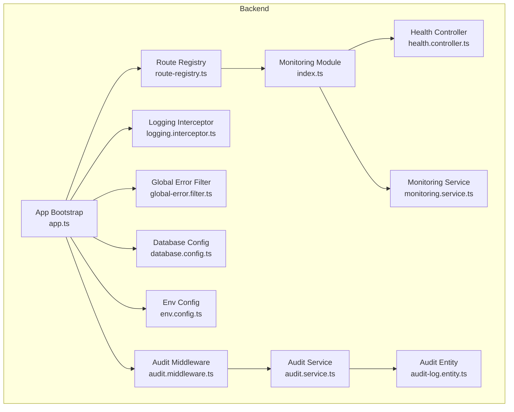
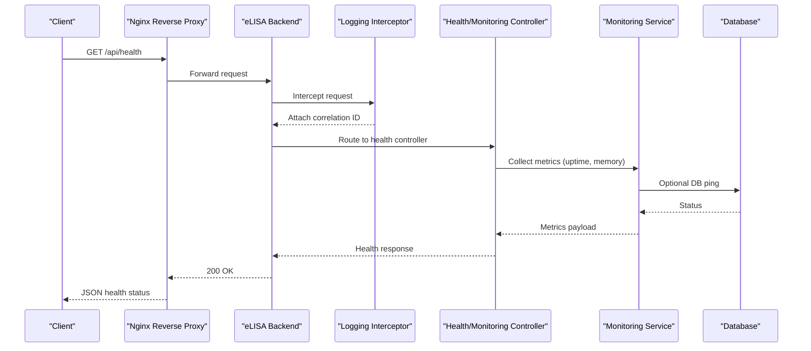
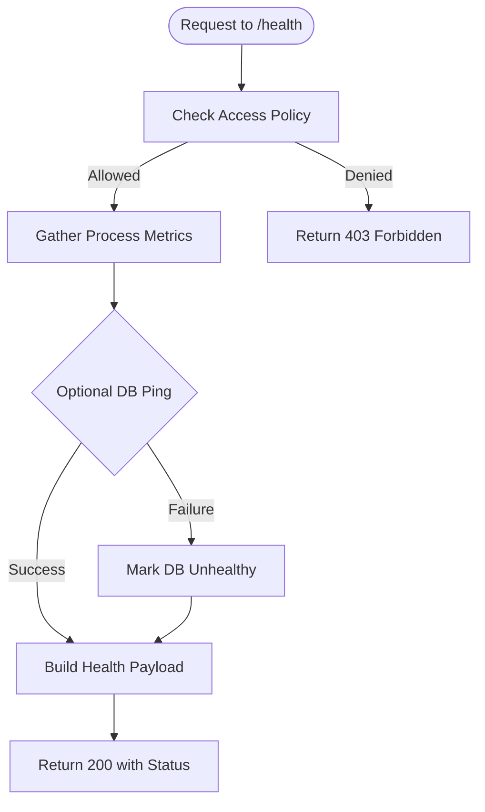
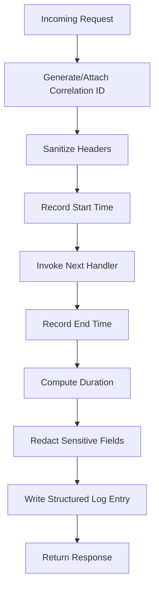
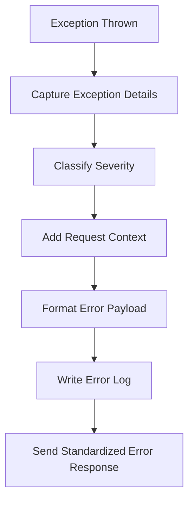
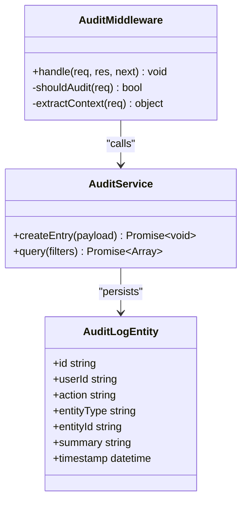
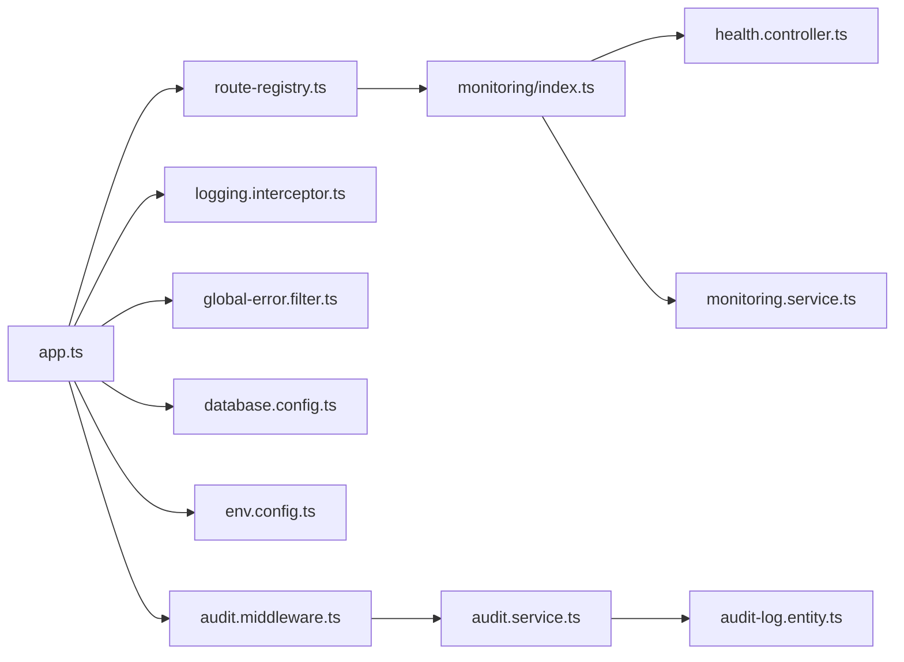

# Monitoring & Logging

<cite>
**Referenced Files in This Document**
- [backend/src/modules/monitoring/index.ts](file://backend/src/modules/monitoring/index.ts)
- [backend/src/modules/monitoring/controllers/health.controller.ts](file://backend/src/modules/monitoring/controllers/health.controller.ts)
- [backend/src/modules/monitoring/services/monitoring.service.ts](file://backend/src/modules/monitoring/services/monitoring.service.ts)
- [backend/src/common/interceptors/logging.interceptor.ts](file://backend/src/common/interceptors/logging.interceptor.ts)
- [backend/src/common/filters/global-error.filter.ts](file://backend/src/common/filters/global-error.filter.ts)
- [backend/src/config/database.config.ts](file://backend/src/config/database.config.ts)
- [backend/src/config/env.config.ts](file://backend/src/config/env.config.ts)
- [backend/src/app.ts](file://backend/src/app.ts)
- [backend/src/routes/route-registry.ts](file://backend/src/routes/route-registry.ts)
- [backend/src/modules/audit/entities/audit-log.entity.ts](file://backend/src/modules/audit/entities/audit-log.entity.ts)
- [backend/src/modules/audit/services/audit.service.ts](file://backend/src/modules/audit/services/audit.service.ts)
- [backend/src/modules/audit/middlewares/audit.middleware.ts](file://backend/src/modules/audit/middlewares/audit.middleware.ts)
- [backend/database/migrations/099-add-monitoring-params.sql](file://backend/database/migrations/099-add-monitoring-params.sql)
- [docker/docker-compose.yml](file://docker/docker-compose.yml)
- [docker/nginx.conf](file://docker/nginx.conf)
- [backend/package.json](file://backend/package.json)
</cite>

## Table of Contents
1. [Introduction](#introduction)
2. [Project Structure](#project-structure)
3. [Core Components](#core-components)
4. [Architecture Overview](#architecture-overview)
5. [Detailed Component Analysis](#detailed-component-analysis)
6. [Dependency Analysis](#dependency-analysis)
7. [Performance Considerations](#performance-considerations)
8. [Troubleshooting Guide](#troubleshooting-guide)
9. [Conclusion](#conclusion)
10. [Appendices](#appendices)

## Introduction
This document provides comprehensive monitoring and logging guidance for eLISAschool, focusing on system observability, performance tracking, and operational insights. It covers built-in monitoring endpoints, health checks, metrics collection for backend services and database performance, audit trails, request logging, error tracking, profiling strategies, log aggregation and rotation, centralized logging, alerting mechanisms, and integration with external tools such as Prometheus, Grafana, and the ELK stack.

## Project Structure
The monitoring and logging capabilities are implemented across dedicated modules and shared infrastructure:
- Monitoring module exposes health and metrics endpoints and provides a service layer for collecting runtime information.
- Common interceptors and filters implement structured request logging and global error handling.
- Audit module records user actions and sensitive operations for compliance and security.
- Database configuration includes connection pooling and query logging options.
- Docker and Nginx configurations support centralized logging and reverse proxy access to monitoring endpoints.

**Diagram sources**
- [backend/src/app.ts](file://backend/src/app.ts)
- [backend/src/routes/route-registry.ts](file://backend/src/routes/route-registry.ts)
- [backend/src/modules/monitoring/index.ts](file://backend/src/modules/monitoring/index.ts)
- [backend/src/modules/monitoring/controllers/health.controller.ts](file://backend/src/modules/monitoring/controllers/health.controller.ts)
- [backend/src/modules/monitoring/services/monitoring.service.ts](file://backend/src/modules/monitoring/services/monitoring.service.ts)
- [backend/src/common/interceptors/logging.interceptor.ts](file://backend/src/common/interceptors/logging.interceptor.ts)
- [backend/src/common/filters/global-error.filter.ts](file://backend/src/common/filters/global-error.filter.ts)
- [backend/src/config/database.config.ts](file://backend/src/config/database.config.ts)
- [backend/src/config/env.config.ts](file://backend/src/config/env.config.ts)
- [backend/src/modules/audit/entities/audit-log.entity.ts](file://backend/src/modules/audit/entities/audit-log.entity.ts)
- [backend/src/modules/audit/services/audit.service.ts](file://backend/src/modules/audit/services/audit.service.ts)
- [backend/src/modules/audit/middlewares/audit.middleware.ts](file://backend/src/modules/audit/middlewares/audit.middleware.ts)

**Section sources**
- [backend/src/app.ts](file://backend/src/app.ts)
- [backend/src/routes/route-registry.ts](file://backend/src/routes/route-registry.ts)
- [backend/src/modules/monitoring/index.ts](file://backend/src/modules/monitoring/index.ts)
- [backend/src/modules/monitoring/controllers/health.controller.ts](file://backend/src/modules/monitoring/controllers/health.controller.ts)
- [backend/src/modules/monitoring/services/monitoring.service.ts](file://backend/src/modules/monitoring/services/monitoring.service.ts)
- [backend/src/common/interceptors/logging.interceptor.ts](file://backend/src/common/interceptors/logging.interceptor.ts)
- [backend/src/common/filters/global-error.filter.ts](file://backend/src/common/filters/global-error.filter.ts)
- [backend/src/config/database.config.ts](file://backend/src/config/database.config.ts)
- [backend/src/config/env.config.ts](file://backend/src/config/env.config.ts)
- [backend/src/modules/audit/entities/audit-log.entity.ts](file://backend/src/modules/audit/entities/audit-log.entity.ts)
- [backend/src/modules/audit/services/audit.service.ts](file://backend/src/modules/audit/services/audit.service.ts)
- [backend/src/modules/audit/middlewares/audit.middleware.ts](file://backend/src/modules/audit/middlewares/audit.middleware.ts)

## Core Components
- Monitoring module: Provides health check endpoints and a service for gathering runtime metrics (process info, uptime, memory usage).
- Request logging interceptor: Captures incoming requests, response status, duration, and correlation IDs; writes structured logs.
- Global error filter: Centralizes error formatting, severity classification, and contextual details for consistent error logs.
- Audit middleware and service: Records significant user actions and data changes into an audit table for traceability.
- Database configuration: Enables query logging and connection pool tuning to observe database performance.
- Environment configuration: Controls feature toggles for logging verbosity, sampling, and endpoint exposure.

Key responsibilities:
- Health checks: Expose readiness/liveness endpoints for orchestrators and load balancers.
- Metrics collection: Provide process-level metrics suitable for export or scraping by external systems.
- Structured logging: Ensure machine-readable logs with consistent fields for aggregation and analysis.
- Audit trail: Persist immutable records of critical operations for compliance and incident investigation.

**Section sources**
- [backend/src/modules/monitoring/index.ts](file://backend/src/modules/monitoring/index.ts)
- [backend/src/modules/monitoring/controllers/health.controller.ts](file://backend/src/modules/monitoring/controllers/health.controller.ts)
- [backend/src/modules/monitoring/services/monitoring.service.ts](file://backend/src/modules/monitoring/services/monitoring.service.ts)
- [backend/src/common/interceptors/logging.interceptor.ts](file://backend/src/common/interceptors/logging.interceptor.ts)
- [backend/src/common/filters/global-error.filter.ts](file://backend/src/common/filters/global-error.filter.ts)
- [backend/src/modules/audit/middlewares/audit.middleware.ts](file://backend/src/modules/audit/middlewares/audit.middleware.ts)
- [backend/src/modules/audit/services/audit.service.ts](file://backend/src/modules/audit/services/audit.service.ts)
- [backend/src/modules/audit/entities/audit-log.entity.ts](file://backend/src/modules/audit/entities/audit-log.entity.ts)
- [backend/src/config/database.config.ts](file://backend/src/config/database.config.ts)
- [backend/src/config/env.config.ts](file://backend/src/config/env.config.ts)

## Architecture Overview
The monitoring architecture integrates application-level observability with database visibility and centralized logging. The flow below shows how requests are logged, errors are captured, and health/metrics endpoints are served.

**Diagram sources**
- [docker/nginx.conf](file://docker/nginx.conf)
- [backend/src/app.ts](file://backend/src/app.ts)
- [backend/src/common/interceptors/logging.interceptor.ts](file://backend/src/common/interceptors/logging.interceptor.ts)
- [backend/src/modules/monitoring/controllers/health.controller.ts](file://backend/src/modules/monitoring/controllers/health.controller.ts)
- [backend/src/modules/monitoring/services/monitoring.service.ts](file://backend/src/modules/monitoring/services/monitoring.service.ts)
- [backend/src/config/database.config.ts](file://backend/src/config/database.config.ts)

## Detailed Component Analysis

### Monitoring Endpoints and Health Checks
- Health controller exposes endpoints for liveness/readiness checks used by orchestration platforms.
- Monitoring service aggregates process metrics and optional database connectivity checks.
- Route registry mounts monitoring routes under a controlled path.

Operational considerations:
- Liveness vs readiness: Use separate endpoints if needed to distinguish process health from dependency availability.
- Security: Restrict health endpoints to internal networks or require authentication tokens in production.
- Response format: Return structured JSON with timestamp, version, and component statuses.

**Diagram sources**
- [backend/src/modules/monitoring/controllers/health.controller.ts](file://backend/src/modules/monitoring/controllers/health.controller.ts)
- [backend/src/modules/monitoring/services/monitoring.service.ts](file://backend/src/modules/monitoring/services/monitoring.service.ts)
- [backend/src/config/database.config.ts](file://backend/src/config/database.config.ts)
- [backend/src/routes/route-registry.ts](file://backend/src/routes/route-registry.ts)

**Section sources**
- [backend/src/modules/monitoring/controllers/health.controller.ts](file://backend/src/modules/monitoring/controllers/health.controller.ts)
- [backend/src/modules/monitoring/services/monitoring.service.ts](file://backend/src/modules/monitoring/services/monitoring.service.ts)
- [backend/src/routes/route-registry.ts](file://backend/src/routes/route-registry.ts)

### Request Logging Interceptor
- Captures method, URL, headers (sanitized), body size, IP, user agent, and correlation ID.
- Measures request duration and logs response status and latency.
- Ensures PII is redacted and sensitive fields are excluded.

Best practices:
- Use correlation IDs propagated from upstream proxies to trace requests across components.
- Avoid logging full request/response bodies; prefer checksums or sizes.
- Apply sampling for high-volume endpoints to reduce log volume.

**Diagram sources**
- [backend/src/common/interceptors/logging.interceptor.ts](file://backend/src/common/interceptors/logging.interceptor.ts)

**Section sources**
- [backend/src/common/interceptors/logging.interceptor.ts](file://backend/src/common/interceptors/logging.interceptor.ts)

### Global Error Filter
- Catches unhandled exceptions and formats them consistently.
- Classifies severity (info, warn, error, fatal) based on status codes and exception types.
- Includes context such as request ID, route, and partial stack traces without leaking secrets.

Error taxonomy:
- Validation errors: 4xx with detailed messages.
- Business logic errors: 4xx with actionable hints.
- System errors: 5xx with correlation IDs for tracing.

**Diagram sources**
- [backend/src/common/filters/global-error.filter.ts](file://backend/src/common/filters/global-error.filter.ts)

**Section sources**
- [backend/src/common/filters/global-error.filter.ts](file://backend/src/common/filters/global-error.filter.ts)

### Audit Trail Implementation
- Audit middleware intercepts write operations and records actor, action, entity, and change summaries.
- Audit service persists entries using the audit entity model.
- Supports filtering by user, date range, and operation type for investigations.

Compliance notes:
- Immutable records: Append-only storage with tamper-evident design.
- Retention policy: Align with organizational policies and legal requirements.
- Privacy: Exclude sensitive payloads; store only necessary metadata.

**Diagram sources**
- [backend/src/modules/audit/middlewares/audit.middleware.ts](file://backend/src/modules/audit/middlewares/audit.middleware.ts)
- [backend/src/modules/audit/services/audit.service.ts](file://backend/src/modules/audit/services/audit.service.ts)
- [backend/src/modules/audit/entities/audit-log.entity.ts](file://backend/src/modules/audit/entities/audit-log.entity.ts)

**Section sources**
- [backend/src/modules/audit/middlewares/audit.middleware.ts](file://backend/src/modules/audit/middlewares/audit.middleware.ts)
- [backend/src/modules/audit/services/audit.service.ts](file://backend/src/modules/audit/services/audit.service.ts)
- [backend/src/modules/audit/entities/audit-log.entity.ts](file://backend/src/modules/audit/entities/audit-log.entity.ts)

### Database Performance Observability
- Connection pooling parameters can be tuned via environment variables to optimize throughput and latency.
- Query logging can be enabled to capture slow queries and execution plans for analysis.
- Migration artifacts include indexes and schema improvements that impact performance.

Recommendations:
- Monitor connection utilization and queue lengths.
- Track query latency percentiles and identify hotspots.
- Use read replicas for heavy reporting workloads.

**Section sources**
- [backend/src/config/database.config.ts](file://backend/src/config/database.config.ts)
- [backend/database/migrations/099-add-monitoring-params.sql](file://backend/database/migrations/099-add-monitoring-params.sql)

### Configuration and Environment
- Environment configuration centralizes logging levels, sampling rates, and feature flags.
- Database configuration encapsulates connection strings, pool sizes, and logging toggles.
- Application bootstrap wires interceptors, filters, and modules.

**Section sources**
- [backend/src/config/env.config.ts](file://backend/src/config/env.config.ts)
- [backend/src/config/database.config.ts](file://backend/src/config/database.config.ts)
- [backend/src/app.ts](file://backend/src/app.ts)

## Dependency Analysis
The following diagram illustrates key dependencies among monitoring, logging, audit, and configuration components.

**Diagram sources**
- [backend/src/app.ts](file://backend/src/app.ts)
- [backend/src/routes/route-registry.ts](file://backend/src/routes/route-registry.ts)
- [backend/src/modules/monitoring/index.ts](file://backend/src/modules/monitoring/index.ts)
- [backend/src/modules/monitoring/controllers/health.controller.ts](file://backend/src/modules/monitoring/controllers/health.controller.ts)
- [backend/src/modules/monitoring/services/monitoring.service.ts](file://backend/src/modules/monitoring/services/monitoring.service.ts)
- [backend/src/common/interceptors/logging.interceptor.ts](file://backend/src/common/interceptors/logging.interceptor.ts)
- [backend/src/common/filters/global-error.filter.ts](file://backend/src/common/filters/global-error.filter.ts)
- [backend/src/config/database.config.ts](file://backend/src/config/database.config.ts)
- [backend/src/config/env.config.ts](file://backend/src/config/env.config.ts)
- [backend/src/modules/audit/middlewares/audit.middleware.ts](file://backend/src/modules/audit/middlewares/audit.middleware.ts)
- [backend/src/modules/audit/services/audit.service.ts](file://backend/src/modules/audit/services/audit.service.ts)
- [backend/src/modules/audit/entities/audit-log.entity.ts](file://backend/src/modules/audit/entities/audit-log.entity.ts)

**Section sources**
- [backend/src/app.ts](file://backend/src/app.ts)
- [backend/src/routes/route-registry.ts](file://backend/src/routes/route-registry.ts)
- [backend/src/modules/monitoring/index.ts](file://backend/src/modules/monitoring/index.ts)
- [backend/src/modules/monitoring/controllers/health.controller.ts](file://backend/src/modules/monitoring/controllers/health.controller.ts)
- [backend/src/modules/monitoring/services/monitoring.service.ts](file://backend/src/modules/monitoring/services/monitoring.service.ts)
- [backend/src/common/interceptors/logging.interceptor.ts](file://backend/src/common/interceptors/logging.interceptor.ts)
- [backend/src/common/filters/global-error.filter.ts](file://backend/src/common/filters/global-error.filter.ts)
- [backend/src/config/database.config.ts](file://backend/src/config/database.config.ts)
- [backend/src/config/env.config.ts](file://backend/src/config/env.config.ts)
- [backend/src/modules/audit/middlewares/audit.middleware.ts](file://backend/src/modules/audit/middlewares/audit.middleware.ts)
- [backend/src/modules/audit/services/audit.service.ts](file://backend/src/modules/audit/services/audit.service.ts)
- [backend/src/modules/audit/entities/audit-log.entity.ts](file://backend/src/modules/audit/entities/audit-log.entity.ts)

## Performance Considerations
- Sampling: Enable request sampling for high-throughput endpoints to reduce overhead.
- Batching: Batch audit entries and metrics flushes to minimize I/O pressure.
- Indexing: Leverage database indexes and query optimizations identified in migrations.
- Pool sizing: Tune connection pools based on workload characteristics and resource limits.
- Profiling: Use Node.js profiling tools (CPU/memory) periodically in staging environments.

[No sources needed since this section provides general guidance]

## Troubleshooting Guide
Common issues and resolutions:
- Health endpoint returns unhealthy: Verify database connectivity and credentials; inspect error logs for timeouts.
- High log volume: Adjust sampling and log levels; exclude verbose debug output in production.
- Slow queries: Enable query logging, analyze execution plans, and add missing indexes.
- Memory leaks: Profile heap snapshots during load tests and review long-lived references.

Actionable steps:
- Inspect structured logs for correlation IDs to trace request paths.
- Review global error filter outputs for standardized error contexts.
- Validate environment configuration for logging and monitoring toggles.

**Section sources**
- [backend/src/common/filters/global-error.filter.ts](file://backend/src/common/filters/global-error.filter.ts)
- [backend/src/common/interceptors/logging.interceptor.ts](file://backend/src/common/interceptors/logging.interceptor.ts)
- [backend/src/config/database.config.ts](file://backend/src/config/database.config.ts)

## Conclusion
eLISAschool implements a robust foundation for observability through health endpoints, structured request logging, centralized error handling, and audit trails. By integrating these components with external monitoring and logging systems, teams can achieve comprehensive visibility into application and database performance, streamline incident response, and maintain compliance through detailed audit records.

[No sources needed since this section summarizes without analyzing specific files]

## Appendices

### External Monitoring Integration Guidance
- Prometheus:
  - Export metrics via a dedicated endpoint or scrape process-level metrics.
  - Configure job targets in docker-compose for backend and database exporters.
- Grafana:
  - Create dashboards for request latency, error rates, and database metrics.
  - Set up alerts for thresholds on p95 latency, error rate spikes, and DB connection saturation.
- ELK Stack:
  - Ship logs to Elasticsearch using Filebeat or Fluent Bit.
  - Use Kibana for log exploration and alerting rules for anomalies.

Centralized logging and rotation:
- Use container logging drivers to forward logs to a central collector.
- Implement log rotation policies based on size and retention windows.
- Enforce structured JSON format for all log entries.

Alerting mechanisms:
- Critical system events: Service down, high error rates, auth failures.
- Database performance issues: Slow queries, connection pool exhaustion, replication lag.
- Security incidents: Repeated failed logins, unauthorized access attempts, suspicious patterns.

Docker and Nginx integration:
- Mount log volumes and configure Nginx to expose monitoring endpoints securely.
- Use environment variables to control logging verbosity and feature flags.

**Section sources**
- [docker/docker-compose.yml](file://docker/docker-compose.yml)
- [docker/nginx.conf](file://docker/nginx.conf)
- [backend/package.json](file://backend/package.json)