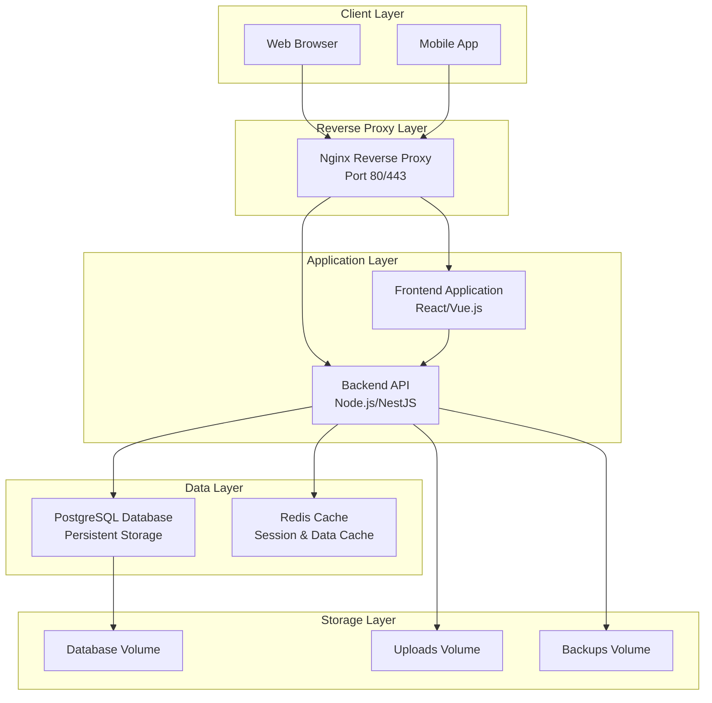
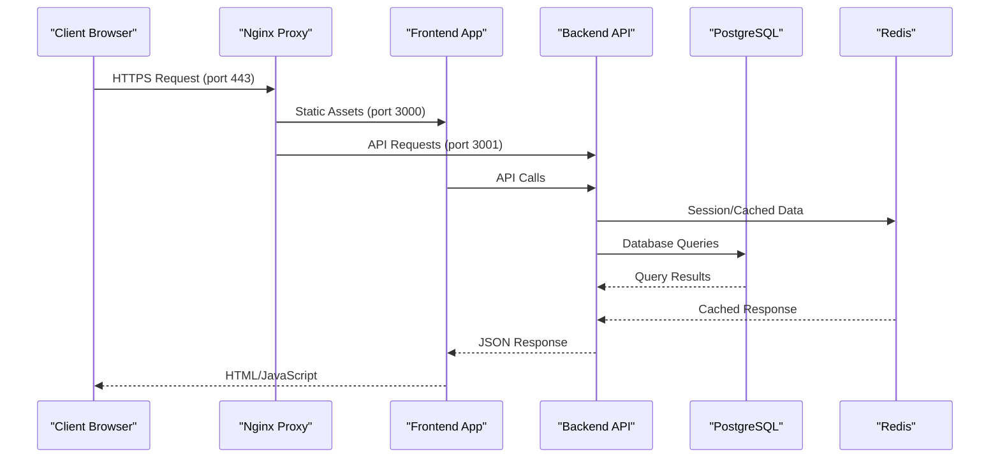

# Production Deployment

<cite>
**Referenced Files in This Document**
- [docker-compose.yml](file://docker/docker-compose.yml)
- [Dockerfile.backend](file://docker/Dockerfile.backend)
- [Dockerfile.frontend](file://docker/Dockerfile.frontend)
- [nginx.conf](file://docker/nginx.conf)
- [deploy.sh](file://docker/deploy.sh)
- [docker-compose.local.dev.yml](file://docker/docker-compose.local.dev.yml)
- [docker-compose.local.prod.yml](file://docker/docker-compose.local.prod.yml)
- [docker-compose.cloud.dev.yml](file://docker/docker-compose.cloud.dev.yml)
- [docker-compose.cloud.prod.yml](file://docker/docker-compose.cloud.prod.yml)
- [backup-auto.sh](file://docker/scripts/backup-auto.sh)
- [backup-manuel.sh](file://docker/scripts/backup-manuel.sh)
- [restore.sh](file://docker/scripts/restore.sh)
- [update.sh](file://docker/scripts/update.sh)
- [validate-infrastructure.sh](file://docker/scripts/validate-infrastructure.sh)
- [cron-backup.txt](file://docker/scripts/cron-backup.txt)
- [install-cron.sh](file://docker/scripts/install-cron.sh)
- [backend/package.json](file://backend/package.json)
- [frontend/package.json](file://frontend/package.json)
- [backend/src/config/env.config.ts](file://backend/src/config/env.config.ts)
- [backend/src/config/database.config.ts](file://backend/src/config/database.config.ts)
</cite>

## Table of Contents
1. [Introduction](#introduction)
2. [Project Structure](#project-structure)
3. [Core Components](#core-components)
4. [Architecture Overview](#architecture-overview)
5. [Detailed Component Analysis](#detailed-component-analysis)
6. [Environment Configuration](#environment-configuration)
7. [SSL/TLS and Security Setup](#ssltls-and-security-setup)
8. [Scaling and Performance Optimization](#scaling-and-performance-optimization)
9. [Deployment Automation](#deployment-automation)
10. [CI/CD Pipeline Integration](#cicd-pipeline-integration)
11. [Backup and Recovery](#backup-and-recovery)
12. [Monitoring and Health Checks](#monitoring-and-health-checks)
13. [Troubleshooting Guide](#troubleshooting-guide)
14. [Conclusion](#conclusion)

## Introduction

eLISAschool is a comprehensive educational management system designed for multi-tenant school administration. This production deployment guide provides detailed instructions for containerized deployment using Docker and docker-compose, covering backend API services, frontend application, PostgreSQL database, Redis cache, and Nginx reverse proxy configuration.

The system supports high-traffic scenarios with horizontal scaling capabilities, database connection pooling, and performance optimization strategies essential for enterprise-level educational institutions.

## Project Structure

The eLISAschool deployment architecture follows a microservices-oriented approach with clear separation of concerns:



**Diagram sources**
- [docker-compose.yml:1-100](file://docker/docker-compose.yml#L1-L100)
- [nginx.conf:1-50](file://docker/nginx.conf#L1-L50)

**Section sources**
- [docker-compose.yml:1-200](file://docker/docker-compose.yml#L1-L200)
- [Dockerfile.backend:1-50](file://docker/Dockerfile.backend#L1-L50)
- [Dockerfile.frontend:1-50](file://docker/Dockerfile.frontend#L1-L50)

## Core Components

### Container Architecture

The system consists of five primary containers working together:

1. **Backend API Service**: Node.js-based REST API built with NestJS framework
2. **Frontend Application**: Modern web interface served as static assets
3. **PostgreSQL Database**: Primary data persistence layer
4. **Redis Cache**: Session storage and caching layer
5. **Nginx Reverse Proxy**: Load balancing and SSL termination

### Container Orchestration

Docker Compose manages the entire stack with service dependencies, networking, and volume management. The orchestration ensures proper startup order and health monitoring.

**Section sources**
- [docker-compose.yml:1-150](file://docker/docker-compose.yml#L1-L150)
- [Dockerfile.backend:1-80](file://docker/Dockerfile.backend#L1-L80)
- [Dockerfile.frontend:1-60](file://docker/Dockerfile.frontend#L1-L60)

## Architecture Overview

The production architecture implements a layered approach with clear separation between presentation, business logic, and data layers:



**Diagram sources**
- [nginx.conf:1-100](file://docker/nginx.conf#L1-L100)
- [docker-compose.yml:1-200](file://docker/docker-compose.yml#L1-L200)

## Detailed Component Analysis

### Backend API Service

The backend service handles all business logic, authentication, and data operations:

#### Container Configuration
- **Base Image**: Optimized Node.js runtime
- **Build Context**: Backend source code with dependency installation
- **Health Check**: HTTP endpoint monitoring
- **Resource Limits**: CPU and memory constraints

#### Environment Variables
- Database connection parameters
- Redis configuration
- JWT secret keys
- Logging levels
- Feature flags

**Section sources**
- [Dockerfile.backend:1-100](file://docker/Dockerfile.backend#L1-L100)
- [backend/src/config/env.config.ts:1-50](file://backend/src/config/env.config.ts#L1-L50)

### Frontend Application

The frontend serves as a single-page application with optimized static asset delivery:

#### Build Process
- Multi-stage Docker build for optimal image size
- Asset optimization and minification
- Environment-specific configurations
- Caching headers for improved performance

#### Serving Strategy
- Static file serving through Nginx
- API proxy configuration
- CORS handling for cross-origin requests

**Section sources**
- [Dockerfile.frontend:1-80](file://docker/Dockerfile.frontend#L1-L80)
- [frontend/package.json:1-50](file://frontend/package.json#L1-L50)

### Database Configuration

PostgreSQL is configured for production with optimized settings:

#### Storage Management
- Persistent volumes for data durability
- Automated backup integration
- Connection pooling configuration
- Performance tuning parameters

#### Security Settings
- Password-based authentication
- Network isolation
- Backup encryption support

**Section sources**
- [docker-compose.yml:1-150](file://docker/docker-compose.yml#L1-L150)
- [backend/src/config/database.config.ts:1-50](file://backend/src/config/database.config.ts#L1-L50)

### Redis Cache Layer

Redis provides session storage and caching capabilities:

#### Use Cases
- User session management
- API response caching
- Rate limiting implementation
- Real-time notifications

#### Persistence Options
- Optional AOF persistence
- Memory-efficient eviction policies
- Cluster-ready configuration

**Section sources**
- [docker-compose.yml:1-100](file://docker/docker-compose.yml#L1-L100)

### Nginx Reverse Proxy

Nginx handles traffic routing, SSL termination, and load balancing:

#### Routing Configuration
- Domain-based virtual hosting
- API path forwarding
- Static asset serving
- WebSocket support

#### Security Features
- SSL/TLS termination
- Security headers
- Request rate limiting
- IP whitelisting

**Section sources**
- [nginx.conf:1-150](file://docker/nginx.conf#L1-L150)

## Environment Configuration

### Development Environment

Development setup includes hot reloading, debugging support, and verbose logging:

#### Key Differences
- Source map generation
- Debug ports exposed
- Development database
- Mock services availability

#### Startup Commands
```bash
# Start development environment
docker-compose -f docker/docker-compose.local.dev.yml up -d

# View logs
docker-compose -f docker/docker-compose.local.dev.yml logs -f
```

### Production Environment

Production configuration emphasizes security, performance, and reliability:

#### Security Hardening
- Minimal base images
- Non-root user execution
- Read-only filesystem where possible
- Secret management integration

#### Performance Tuning
- Connection pool sizing
- Cache configuration
- Resource limits and requests
- Health check intervals

**Section sources**
- [docker-compose.local.dev.yml:1-100](file://docker/docker-compose.local.dev.yml#L1-L100)
- [docker-compose.local.prod.yml:1-100](file://docker/docker-compose.local.prod.yml#L1-L100)

### Cloud Deployment

Cloud-specific configurations optimize for managed services and auto-scaling:

#### AWS/Azure/GCP Support
- Managed database instances
- Cloud-native secrets management
- Load balancer integration
- Monitoring and logging aggregation

#### Scaling Considerations
- Stateless application design
- Horizontal pod autoscaling
- Database read replicas
- CDN integration for static assets

**Section sources**
- [docker-compose.cloud.dev.yml:1-100](file://docker/docker-compose.cloud.dev.yml#L1-L100)
- [docker-compose.cloud.prod.yml:1-100](file://docker/docker-compose.cloud.prod.yml#L1-L100)

## SSL/TLS and Security Setup

### Certificate Management

SSL certificates are managed through automated processes:

#### Certificate Sources
- Let's Encrypt integration
- Custom certificate authority support
- Automatic renewal mechanisms
- Certificate validation checks

#### Security Headers
- Content Security Policy (CSP)
- Strict Transport Security (HSTS)
- X-Frame-Options protection
- XSS protection headers

### Domain Configuration

Multi-domain support enables hosting multiple schools or environments:

#### Virtual Host Setup
- Domain-based routing
- Subdomain support
- Wildcard domain configuration
- Redirect rules

#### DNS Requirements
- A records pointing to server IP
- CNAME records for subdomains
- TXT records for verification
- MX records for email (optional)

**Section sources**
- [nginx.conf:1-200](file://docker/nginx.conf#L1-L200)

## Scaling and Performance Optimization

### Horizontal Scaling

The stateless design enables easy horizontal scaling:

#### Application Scaling
- Multiple backend instances behind load balancer
- Shared session storage via Redis
- Database connection pooling
- Static asset distribution

#### Database Scaling
- Read replicas for query offloading
- Connection pool optimization
- Query performance monitoring
- Index optimization strategies

### Connection Pooling

Database connection pooling optimizes resource usage:

#### Configuration Parameters
- Maximum connections per instance
- Idle connection timeout
- Connection lifetime management
- Queue timeout settings

#### Monitoring Metrics
- Active connection count
- Connection wait times
- Query performance statistics
- Error rates

### Performance Optimization

#### Caching Strategy
- Redis-based response caching
- Database query result caching
- Static asset caching
- CDN integration

#### Resource Optimization
- Memory usage monitoring
- CPU utilization tracking
- Disk I/O optimization
- Network bandwidth management

**Section sources**
- [docker-compose.yml:1-200](file://docker/docker-compose.yml#L1-L200)

## Deployment Automation

### Deployment Scripts

Automated deployment scripts ensure consistent and reliable deployments:

#### Main Deployment Script
- Pre-deployment validation
- Database migration execution
- Service restart procedures
- Health check verification
- Rollback capabilities

#### Update Procedures
- Rolling updates for zero-downtime deployments
- Blue-green deployment support
- Canary release capabilities
- Automated rollback on failure

**Section sources**
- [deploy.sh:1-100](file://docker/deploy.sh#L1-L100)

### Infrastructure Validation

Pre-deployment validation ensures system readiness:

#### System Requirements
- Docker version compatibility
- Available disk space
- Memory requirements
- Network connectivity

#### Service Dependencies
- Database connectivity
- Redis availability
- External service endpoints
- File system permissions

**Section sources**
- [validate-infrastructure.sh:1-100](file://docker/scripts/validate-infrastructure.sh#L1-L100)

## CI/CD Pipeline Integration

### GitHub Actions Workflow

Automated testing and deployment pipeline:

#### Build Stage
- Code quality checks
- Dependency vulnerability scanning
- Container image building
- Artifact generation

#### Test Stage
- Unit test execution
- Integration test suite
- Performance regression tests
- Security scanning

#### Deploy Stage
- Staging environment deployment
- Smoke testing
- Production deployment approval
- Post-deployment validation

### GitLab CI/CD Alternative

GitLab-specific pipeline configuration:

#### Registry Integration
- Container registry push
- Image tagging strategy
- Version management
- Artifact retention

#### Environment Promotion
- Manual approval gates
- Environment-specific variables
- Deployment history tracking
- Rollback automation

**Section sources**
- [docker/deploy.sh:1-150](file://docker/deploy.sh#L1-L150)

## Backup and Recovery

### Automated Backups

Scheduled backup processes ensure data protection:

#### Backup Strategy
- Daily incremental backups
- Weekly full backups
- Monthly archive retention
- Off-site replication

#### Backup Tools
- Native PostgreSQL backup utilities
- Compression and encryption
- Integrity verification
- Automated cleanup

### Recovery Procedures

Disaster recovery processes minimize downtime:

#### Point-in-Time Recovery
- WAL archiving configuration
- Recovery point objectives
- Recovery time objectives
- Testing procedures

#### Data Migration
- Cross-environment data sync
- Schema migration rollback
- Configuration backup
- State restoration

**Section sources**
- [backup-auto.sh:1-100](file://docker/scripts/backup-auto.sh#L1-L100)
- [backup-manuel.sh:1-100](file://docker/scripts/backup-manuel.sh#L1-L100)
- [restore.sh:1-100](file://docker/scripts/restore.sh#L1-L100)
- [cron-backup.txt:1-50](file://docker/scripts/cron-backup.txt#L1-L50)
- [install-cron.sh:1-50](file://docker/scripts/install-cron.sh#L1-L50)

## Monitoring and Health Checks

### Health Check Endpoints

Service health monitoring ensures operational visibility:

#### Application Health
- Database connectivity checks
- Redis availability verification
- External service status
- Resource utilization metrics

#### Container Health
- Process monitoring
- Memory leak detection
- Disk space monitoring
- Network connectivity

### Logging Strategy

Centralized logging facilitates troubleshooting:

#### Log Aggregation
- Structured JSON logging
- Log rotation policies
- Centralized log collection
- Alerting integration

#### Performance Monitoring
- Request latency tracking
- Error rate monitoring
- Resource utilization metrics
- Business KPIs

**Section sources**
- [docker-compose.yml:1-200](file://docker/docker-compose.yml#L1-L200)

## Troubleshooting Guide

### Common Issues

#### Container Startup Failures
- Port conflicts resolution
- Volume permission issues
- Environment variable validation
- Dependency service availability

#### Database Connectivity
- Connection string validation
- Network policy configuration
- Authentication credential verification
- Firewall rule adjustment

#### Performance Problems
- Resource bottleneck identification
- Query performance analysis
- Cache hit ratio monitoring
- Connection pool exhaustion

### Diagnostic Tools

#### Log Analysis
- Container log inspection
- Application error tracking
- Database slow query logs
- Network request tracing

#### Health Verification
- Service endpoint testing
- Database connectivity checks
- Cache functionality validation
- SSL certificate verification

**Section sources**
- [validate-infrastructure.sh:1-100](file://docker/scripts/validate-infrastructure.sh#L1-L100)

## Conclusion

The eLISAschool production deployment provides a robust, scalable, and maintainable foundation for educational institution management systems. The containerized architecture ensures consistency across environments while supporting horizontal scaling for high-traffic scenarios.

Key strengths include:
- Comprehensive container orchestration with Docker Compose
- Flexible environment configuration for development and production
- Automated backup and recovery procedures
- Security-focused design with SSL/TLS support
- Performance optimization for enterprise-scale deployments

This deployment strategy enables educational institutions to operate their management systems reliably while maintaining the flexibility to scale and adapt to changing requirements.