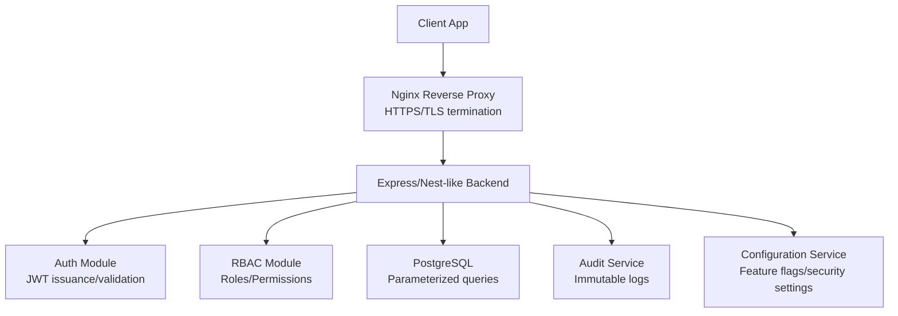
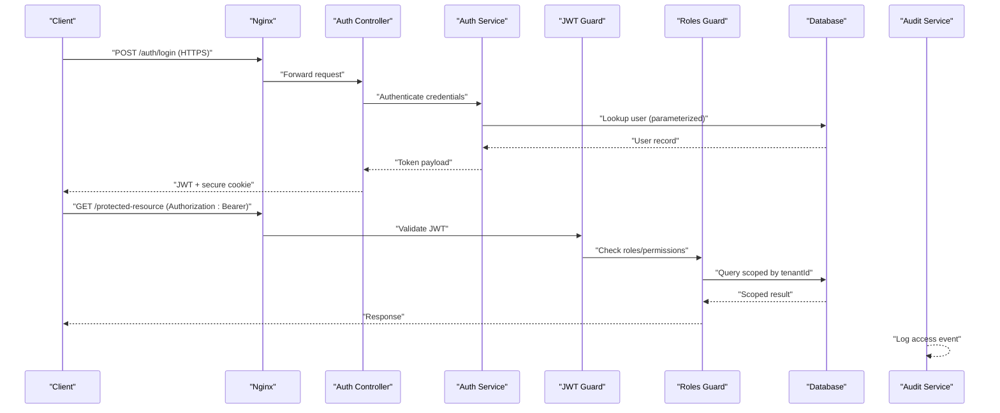
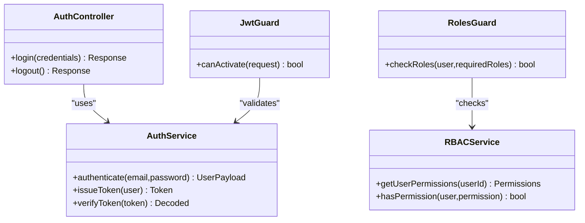
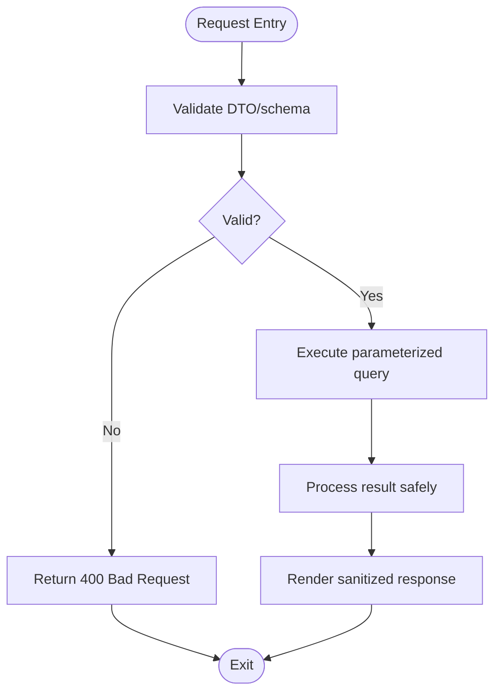
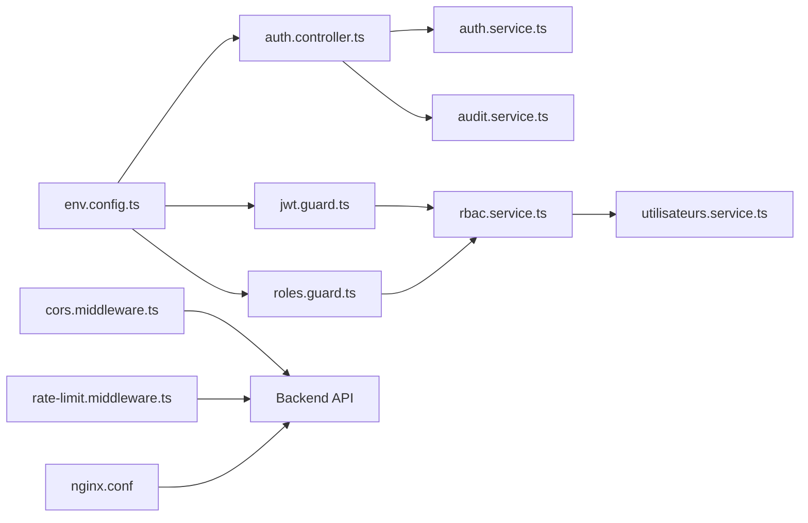

# Security & Compliance

<cite>
**Referenced Files in This Document**
- [backend/src/modules/auth/auth.controller.ts](file://backend/src/modules/auth/auth.controller.ts)
- [backend/src/modules/auth/auth.service.ts](file://backend/src/modules/auth/auth.service.ts)
- [backend/src/modules/auth/guards/jwt.guard.ts](file://backend/src/modules/auth/guards/jwt.guard.ts)
- [backend/src/modules/auth/guards/roles.guard.ts](file://backend/src/modules/auth/guards/roles.guard.ts)
- [backend/src/common/middlewares/cors.middleware.ts](file://backend/src/common/middlewares/cors.middleware.ts)
- [backend/src/common/middlewares/rate-limit.middleware.ts](file://backend/src/common/middlewares/rate-limit.middleware.ts)
- [backend/src/config/env.config.ts](file://backend/src/config/env.config.ts)
- [backend/src/database/data-source.ts](file://backend/src/database/data-source.ts)
- [docker/nginx.conf](file://docker/nginx.conf)
- [docker/docker-compose.local.prod.yml](file://docker/docker-compose.local.prod.yml)
- [docker/docker-compose.cloud.prod.yml](file://docker/docker-compose.cloud.prod.yml)
- [backend/test/integration/auth-multi-etablissement.spec.ts](file://backend/test/integration/auth-multi-etablissement.spec.ts)
- [backend/test/multi-tenant-isolation.test.ts](file://backend/test/multi-tenant-isolation.test.ts)
- [backend/src/modules/audit/audit.service.ts](file://backend/src/modules/audit/audit.service.ts)
- [backend/src/modules/utilisateurs/utilisateurs.service.ts](file://backend/src/modules/utilisateurs/utilisateurs.service.ts)
- [backend/src/modules/rbac/rbac.service.ts](file://backend/src/modules/rbac/rbac.service.ts)
- [backend/src/modules/configuration/configuration.service.ts](file://backend/src/modules/configuration/configuration.service.ts)
</cite>

## Table of Contents
1. [Introduction](#introduction)
2. [Project Structure](#project-structure)
3. [Core Components](#core-components)
4. [Architecture Overview](#architecture-overview)
5. [Detailed Component Analysis](#detailed-component-analysis)
6. [Dependency Analysis](#dependency-analysis)
7. [Performance Considerations](#performance-considerations)
8. [Troubleshooting Guide](#troubleshooting-guide)
9. [Conclusion](#conclusion)
10. [Appendices](#appendices)

## Introduction
This document provides comprehensive security and compliance guidance for eLISAschool, focusing on authentication and authorization, input validation, SQL injection prevention, XSS protection, CSRF mitigation, secure headers, HTTPS enforcement, secure cookies, vulnerability scanning, dependency updates, penetration testing, data protection (encryption at rest and in transit), and alignment with educational privacy regulations such as FERPA and GDPR. It maps these practices to the actual backend implementation and deployment configuration present in the repository.

## Project Structure
Security-relevant areas are primarily located under:
- Authentication and RBAC: backend/src/modules/auth, backend/src/modules/rbac
- Common security middleware: backend/src/common/middlewares
- Configuration and environment: backend/src/config
- Database access and connection: backend/src/database
- Audit logging: backend/src/modules/audit
- Deployment and reverse proxy: docker/nginx.conf, docker/docker-compose.*.yml
- Tests validating multi-tenant isolation and auth flows: backend/test

**Diagram sources**
- [docker/nginx.conf](file://docker/nginx.conf)
- [backend/src/modules/auth/auth.controller.ts](file://backend/src/modules/auth/auth.controller.ts)
- [backend/src/modules/rbac/rbac.service.ts](file://backend/src/modules/rbac/rbac.service.ts)
- [backend/src/database/data-source.ts](file://backend/src/database/data-source.ts)
- [backend/src/modules/audit/audit.service.ts](file://backend/src/modules/audit/audit.service.ts)
- [backend/src/modules/configuration/configuration.service.ts](file://backend/src/modules/configuration/configuration.service.ts)

**Section sources**
- [backend/src/modules/auth/auth.controller.ts](file://backend/src/modules/auth/auth.controller.ts)
- [backend/src/modules/auth/auth.service.ts](file://backend/src/modules/auth/auth.service.ts)
- [backend/src/modules/auth/guards/jwt.guard.ts](file://backend/src/modules/auth/guards/jwt.guard.ts)
- [backend/src/modules/auth/guards/roles.guard.ts](file://backend/src/modules/auth/guards/roles.guard.ts)
- [backend/src/common/middlewares/cors.middleware.ts](file://backend/src/common/middlewares/cors.middleware.ts)
- [backend/src/common/middlewares/rate-limit.middleware.ts](file://backend/src/common/middlewares/rate-limit.middleware.ts)
- [backend/src/config/env.config.ts](file://backend/src/config/env.config.ts)
- [backend/src/database/data-source.ts](file://backend/src/database/data-source.ts)
- [docker/nginx.conf](file://docker/nginx.conf)
- [docker/docker-compose.local.prod.yml](file://docker/docker-compose.local.prod.yml)
- [docker/docker-compose.cloud.prod.yml](file://docker/docker-compose.cloud.prod.yml)

## Core Components
- Authentication controller and service handle login, token issuance, and session context.
- JWT guard validates tokens and attaches user context to requests.
- Roles guard enforces role-based access control against RBAC policies.
- CORS and rate-limit middlewares restrict origins and throttle abusive traffic.
- Environment configuration centralizes secrets and feature toggles.
- Data source configures database connectivity and query execution patterns.
- Audit service records security-sensitive actions.
- Nginx terminates TLS and applies security headers.

**Section sources**
- [backend/src/modules/auth/auth.controller.ts](file://backend/src/modules/auth/auth.controller.ts)
- [backend/src/modules/auth/auth.service.ts](file://backend/src/modules/auth/auth.service.ts)
- [backend/src/modules/auth/guards/jwt.guard.ts](file://backend/src/modules/auth/guards/jwt.guard.ts)
- [backend/src/modules/auth/guards/roles.guard.ts](file://backend/src/modules/auth/guards/roles.guard.ts)
- [backend/src/common/middlewares/cors.middleware.ts](file://backend/src/common/middlewares/cors.middleware.ts)
- [backend/src/common/middlewares/rate-limit.middleware.ts](file://backend/src/common/middlewares/rate-limit.middleware.ts)
- [backend/src/config/env.config.ts](file://backend/src/config/env.config.ts)
- [backend/src/database/data-source.ts](file://backend/src/database/data-source.ts)
- [backend/src/modules/audit/audit.service.ts](file://backend/src/modules/audit/audit.service.ts)
- [docker/nginx.conf](file://docker/nginx.conf)

## Architecture Overview
The system uses a reverse-proxy pattern where Nginx handles TLS termination and forwards authenticated requests to the backend. The backend enforces authentication via JWT and authorization via RBAC guards. All database interactions use parameterized queries to prevent SQL injection. Sensitive operations are audited. Multi-tenant isolation is enforced by scoping queries to tenant identifiers.

**Diagram sources**
- [docker/nginx.conf](file://docker/nginx.conf)
- [backend/src/modules/auth/auth.controller.ts](file://backend/src/modules/auth/auth.controller.ts)
- [backend/src/modules/auth/auth.service.ts](file://backend/src/modules/auth/auth.service.ts)
- [backend/src/modules/auth/guards/jwt.guard.ts](file://backend/src/modules/auth/guards/jwt.guard.ts)
- [backend/src/modules/auth/guards/roles.guard.ts](file://backend/src/modules/auth/guards/roles.guard.ts)
- [backend/src/database/data-source.ts](file://backend/src/database/data-source.ts)
- [backend/src/modules/audit/audit.service.ts](file://backend/src/modules/audit/audit.service.ts)

## Detailed Component Analysis

### Authentication and Authorization
- Login flow issues short-lived JWTs and sets secure cookies when applicable.
- JWT guard verifies signature, expiration, and attaches user context.
- Roles guard checks permissions derived from RBAC before allowing access.
- Multi-tenant isolation ensures users can only access resources within their establishment scope.

**Diagram sources**
- [backend/src/modules/auth/auth.controller.ts](file://backend/src/modules/auth/auth.controller.ts)
- [backend/src/modules/auth/auth.service.ts](file://backend/src/modules/auth/auth.service.ts)
- [backend/src/modules/auth/guards/jwt.guard.ts](file://backend/src/modules/auth/guards/jwt.guard.ts)
- [backend/src/modules/auth/guards/roles.guard.ts](file://backend/src/modules/auth/guards/roles.guard.ts)
- [backend/src/modules/rbac/rbac.service.ts](file://backend/src/modules/rbac/rbac.service.ts)

**Section sources**
- [backend/src/modules/auth/auth.controller.ts](file://backend/src/modules/auth/auth.controller.ts)
- [backend/src/modules/auth/auth.service.ts](file://backend/src/modules/auth/auth.service.ts)
- [backend/src/modules/auth/guards/jwt.guard.ts](file://backend/src/modules/auth/guards/jwt.guard.ts)
- [backend/src/modules/auth/guards/roles.guard.ts](file://backend/src/modules/auth/guards/roles.guard.ts)
- [backend/src/modules/rbac/rbac.service.ts](file://backend/src/modules/rbac/rbac.service.ts)
- [backend/test/integration/auth-multi-etablissement.spec.ts](file://backend/test/integration/auth-multi-etablissement.spec.ts)

### Input Validation and Injection Prevention
- Use strict DTO validation at controller boundaries; reject malformed payloads early.
- Prefer parameterized queries through the ORM or prepared statements to prevent SQL injection.
- Sanitize and escape any output rendered to clients to mitigate XSS.
- Apply allowlists for file uploads and content types.

[No diagram sources needed since this diagram shows conceptual workflow]

**Section sources**
- [backend/src/database/data-source.ts](file://backend/src/database/data-source.ts)

### CSRF Mitigation
- For state-changing endpoints, require a custom header (e.g., X-CSRF-Token) alongside Authorization.
- Validate origin and referer using CORS and host matching.
- Avoid relying solely on cookies for sensitive mutations without additional verification.

**Section sources**
- [backend/src/common/middlewares/cors.middleware.ts](file://backend/src/common/middlewares/cors.middleware.ts)

### Secure Headers and HTTPS Enforcement
- Nginx enforces HTTPS, HSTS, and sets recommended security headers.
- Ensure all internal services communicate over TLS where applicable.
- Disable unnecessary HTTP methods at the proxy layer.

**Section sources**
- [docker/nginx.conf](file://docker/nginx.conf)
- [docker/docker-compose.local.prod.yml](file://docker/docker-compose.local.prod.yml)
- [docker/docker-compose.cloud.prod.yml](file://docker/docker-compose.cloud.prod.yml)

### Secure Cookie Settings
- Set HttpOnly, Secure, SameSite=Strict/Lax for session cookies.
- Minimize cookie lifetime and scope to necessary paths.
- Rotate secrets regularly and store them securely via environment variables.

**Section sources**
- [backend/src/config/env.config.ts](file://backend/src/config/env.config.ts)

### Rate Limiting and Brute-Force Protection
- Apply global and endpoint-specific rate limits.
- Implement account lockout after repeated failed attempts.
- Log and alert on anomalous activity.

**Section sources**
- [backend/src/common/middlewares/rate-limit.middleware.ts](file://backend/src/common/middlewares/rate-limit.middleware.ts)

### Multi-Tenant Data Isolation
- Enforce tenant scoping at the service/repository layer using establishmentId.
- Validate tenant membership during authentication and authorization.
- Test isolation across tenants to prevent cross-tenant leakage.

**Section sources**
- [backend/test/multi-tenant-isolation.test.ts](file://backend/test/multi-tenant-isolation.test.ts)
- [backend/test/integration/auth-multi-etablissement.spec.ts](file://backend/test/integration/auth-multi-etablissement.spec.ts)

### Audit Trail and Accountability
- Record critical events: logins, permission changes, data modifications.
- Store immutable audit entries with timestamps and actor identity.
- Provide read-only access for compliance reviews.

**Section sources**
- [backend/src/modules/audit/audit.service.ts](file://backend/src/modules/audit/audit.service.ts)

### Configuration and Secrets Management
- Centralize secrets and feature flags in environment configuration.
- Never commit secrets to version control.
- Use per-environment configs and secret managers in production.

**Section sources**
- [backend/src/config/env.config.ts](file://backend/src/config/env.config.ts)
- [backend/src/modules/configuration/configuration.service.ts](file://backend/src/modules/configuration/configuration.service.ts)

## Dependency Analysis
Security-related dependencies include:
- Authentication and RBAC modules depend on user management and configuration services.
- Guards depend on RBAC and environment configuration.
- Middleware depends on environment settings for allowed origins and thresholds.
- Database module depends on secure connection parameters.

**Diagram sources**
- [backend/src/config/env.config.ts](file://backend/src/config/env.config.ts)
- [backend/src/modules/auth/auth.controller.ts](file://backend/src/modules/auth/auth.controller.ts)
- [backend/src/modules/auth/guards/jwt.guard.ts](file://backend/src/modules/auth/guards/jwt.guard.ts)
- [backend/src/modules/auth/guards/roles.guard.ts](file://backend/src/modules/auth/guards/roles.guard.ts)
- [backend/src/modules/auth/auth.service.ts](file://backend/src/modules/auth/auth.service.ts)
- [backend/src/modules/rbac/rbac.service.ts](file://backend/src/modules/rbac/rbac.service.ts)
- [backend/src/modules/utilisateurs/utilisateurs.service.ts](file://backend/src/modules/utilisateurs/utilisateurs.service.ts)
- [backend/src/modules/audit/audit.service.ts](file://backend/src/modules/audit/audit.service.ts)
- [backend/src/common/middlewares/cors.middleware.ts](file://backend/src/common/middlewares/cors.middleware.ts)
- [backend/src/common/middlewares/rate-limit.middleware.ts](file://backend/src/common/middlewares/rate-limit.middleware.ts)
- [docker/nginx.conf](file://docker/nginx.conf)

**Section sources**
- [backend/src/config/env.config.ts](file://backend/src/config/env.config.ts)
- [backend/src/modules/auth/auth.controller.ts](file://backend/src/modules/auth/auth.controller.ts)
- [backend/src/modules/auth/guards/jwt.guard.ts](file://backend/src/modules/auth/guards/jwt.guard.ts)
- [backend/src/modules/auth/guards/roles.guard.ts](file://backend/src/modules/auth/guards/roles.guard.ts)
- [backend/src/modules/auth/auth.service.ts](file://backend/src/modules/auth/auth.service.ts)
- [backend/src/modules/rbac/rbac.service.ts](file://backend/src/modules/rbac/rbac.service.ts)
- [backend/src/modules/utilisateurs/utilisateurs.service.ts](file://backend/src/modules/utilisateurs/utilisateurs.service.ts)
- [backend/src/modules/audit/audit.service.ts](file://backend/src/modules/audit/audit.service.ts)
- [backend/src/common/middlewares/cors.middleware.ts](file://backend/src/common/middlewares/cors.middleware.ts)
- [backend/src/common/middlewares/rate-limit.middleware.ts](file://backend/src/common/middlewares/rate-limit.middleware.ts)
- [docker/nginx.conf](file://docker/nginx.conf)

## Performance Considerations
- Keep JWT payloads minimal to reduce overhead.
- Cache RBAC permissions judiciously with appropriate invalidation strategies.
- Use database indexes and parameterized queries to avoid slow scans.
- Configure rate limits to balance security and usability.

[No sources needed since this section provides general guidance]

## Troubleshooting Guide
- If authentication fails intermittently, verify JWT secret rotation and environment configuration consistency.
- For multi-tenant access errors, confirm establishment scoping and user-tenant mappings.
- When CORS blocks requests, ensure allowed origins match the frontend domain and ports.
- Review audit logs for unauthorized access attempts and anomalies.

**Section sources**
- [backend/src/config/env.config.ts](file://backend/src/config/env.config.ts)
- [backend/test/integration/auth-multi-etablissement.spec.ts](file://backend/test/integration/auth-multi-etablissement.spec.ts)
- [backend/src/common/middlewares/cors.middleware.ts](file://backend/src/common/middlewares/cors.middleware.ts)
- [backend/src/modules/audit/audit.service.ts](file://backend/src/modules/audit/audit.service.ts)

## Conclusion
eLISAschool implements a robust security posture centered on JWT-based authentication, RBAC-driven authorization, strict multi-tenant isolation, parameterized database queries, and hardened deployment via Nginx. Complementary controls include CORS, rate limiting, audit logging, and centralized configuration. To maintain compliance with FERPA/GDPR, continue enforcing least privilege, encrypting sensitive data, retaining audit trails, and conducting regular vulnerability assessments and penetration tests.

[No sources needed since this section summarizes without analyzing specific files]

## Appendices

### Vulnerability Scanning and Dependency Updates
- Integrate automated dependency scanning into CI/CD pipelines.
- Schedule periodic scans for known CVEs and enforce remediation SLAs.
- Pin versions and review changelogs before upgrades.

[No sources needed since this section provides general guidance]

### Penetration Testing Guidelines
- Scope includes authentication, RBAC, multi-tenant isolation, file handling, and API endpoints.
- Validate CSRF protections, rate limiting, and error handling.
- Verify HTTPS enforcement and secure headers across environments.

[No sources needed since this section provides general guidance]

### Data Protection and Encryption
- Enforce TLS everywhere (client-to-proxy, proxy-to-backend if applicable).
- Encrypt sensitive fields at rest using supported database features or application-level encryption.
- Manage keys via a dedicated key management service.

[No sources needed since this section provides general guidance]

### Regulatory Compliance (FERPA/GDPR)
- Maintain consent records and data processing logs.
- Support data subject rights (access, rectification, erasure).
- Implement data retention policies and secure deletion procedures.
- Conduct DPIAs for high-risk processing activities.

[No sources needed since this section provides general guidance]