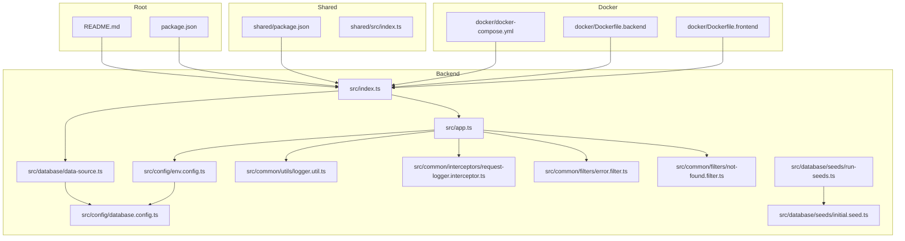
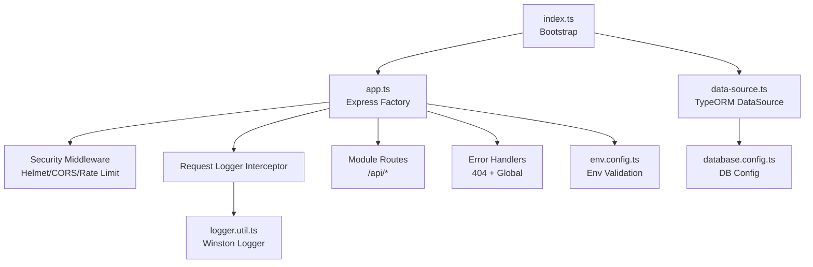
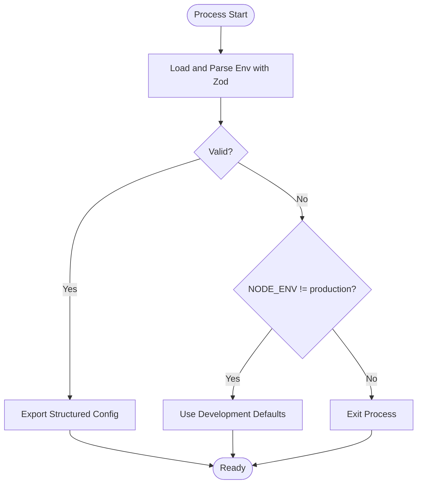
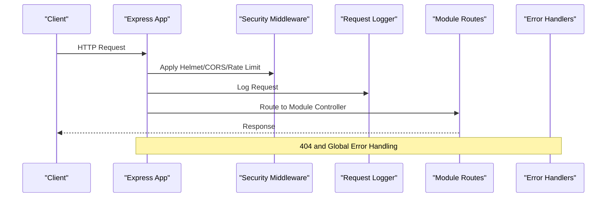
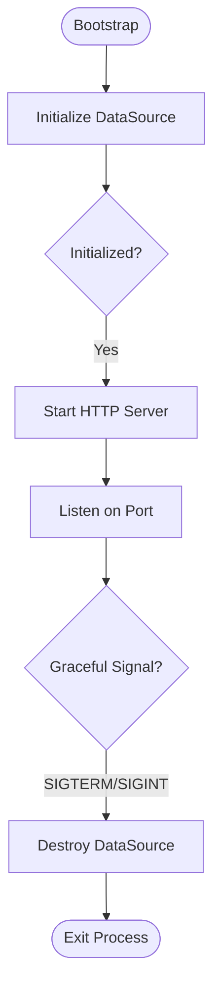
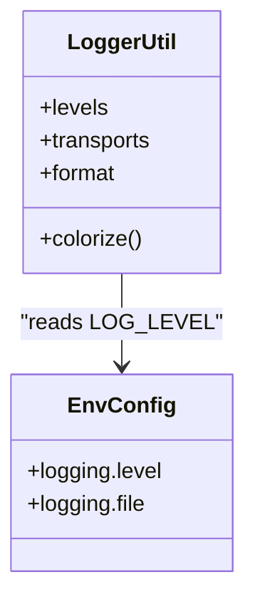
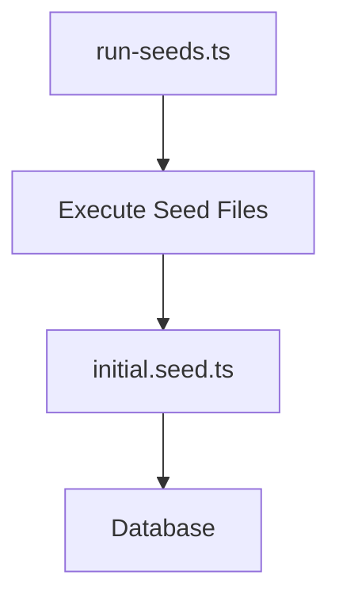
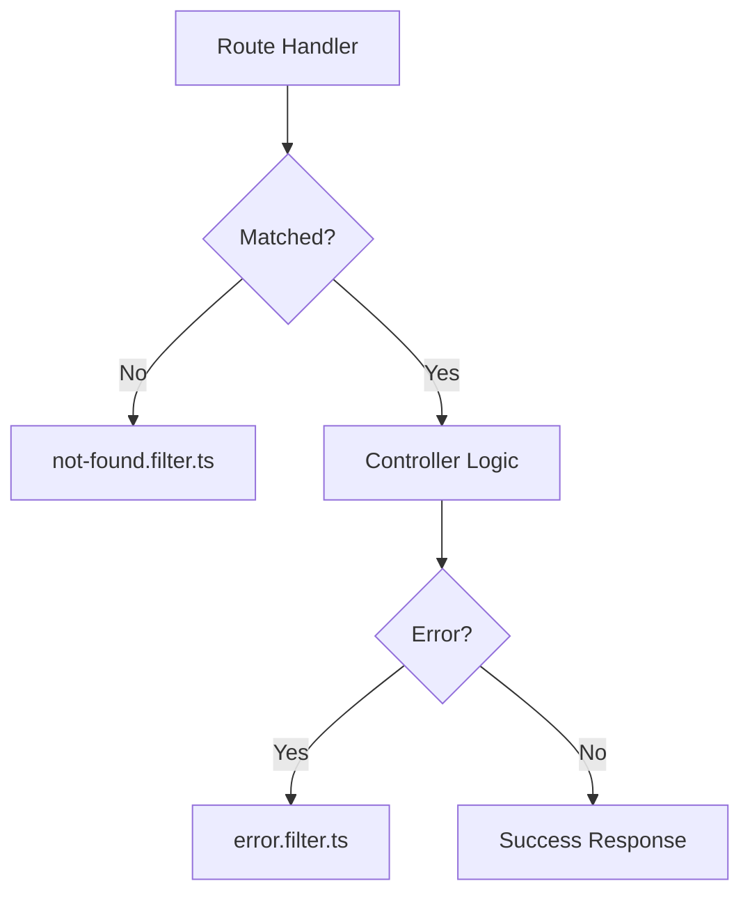
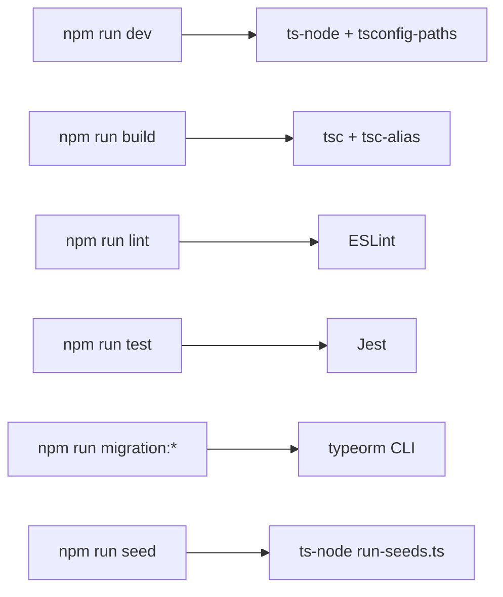
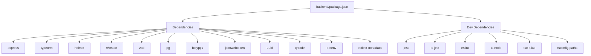

# Development & Testing Guide

<cite>
**Referenced Files in This Document**
- [README.md](file://README.md)
- [backend/package.json](file://backend/package.json)
- [backend/src/index.ts](file://backend/src/index.ts)
- [backend/src/app.ts](file://backend/src/app.ts)
- [backend/src/config/env.config.ts](file://backend/src/config/env.config.ts)
- [backend/src/config/database.config.ts](file://backend/src/config/database.config.ts)
- [backend/src/database/data-source.ts](file://backend/src/database/data-source.ts)
- [backend/src/common/utils/logger.util.ts](file://backend/src/common/utils/logger.util.ts)
- [backend/src/common/interceptors/request-logger.interceptor.ts](file://backend/src/common/interceptors/request-logger.interceptor.ts)
- [backend/src/common/filters/error.filter.ts](file://backend/src/common/filters/error.filter.ts)
- [backend/src/common/filters/not-found.filter.ts](file://backend/src/common/filters/not-found.filter.ts)
- [backend/src/database/seeds/run-seeds.ts](file://backend/src/database/seeds/run-seeds.ts)
- [backend/src/database/seeds/initial.seed.ts](file://backend/src/database/seeds/initial.seed.ts)
- [docker/docker-compose.yml](file://docker/docker-compose.yml)
- [docker/Dockerfile.backend](file://docker/Dockerfile.backend)
- [docker/Dockerfile.frontend](file://docker/Dockerfile.frontend)
- [shared/package.json](file://shared/package.json)
- [shared/src/index.ts](file://shared/src/index.ts)
</cite>

## Table of Contents
1. [Introduction](#introduction)
2. [Project Structure](#project-structure)
3. [Core Components](#core-components)
4. [Architecture Overview](#architecture-overview)
5. [Detailed Component Analysis](#detailed-component-analysis)
6. [Dependency Analysis](#dependency-analysis)
7. [Performance Considerations](#performance-considerations)
8. [Troubleshooting Guide](#troubleshooting-guide)
9. [Conclusion](#conclusion)
10. [Appendices](#appendices)

## Introduction
This guide documents the development and testing workflow for eLISAschool, a modular school management PWA. It covers development setup, code standards, logging and debugging, seed data and database migrations, testing strategies (unit, integration, end-to-end), code review and CI/CD practices, and quality assurance processes including performance, security, and load testing.

## Project Structure
The repository is organized into:
- backend: Express.js API with TypeScript, modular domain structure, shared utilities, and database configuration.
- shared: Shared types, constants, and validators used across backend and frontend.
- docker: Containerization for backend and frontend with orchestration via docker-compose.
- docs: Technical and user documentation.
- Root: Top-level scripts and installation instructions.

**Diagram sources**
- [backend/src/index.ts:1-62](file://backend/src/index.ts#L1-L62)
- [backend/src/app.ts:1-205](file://backend/src/app.ts#L1-L205)
- [backend/src/config/env.config.ts:1-168](file://backend/src/config/env.config.ts#L1-L168)
- [backend/src/config/database.config.ts](file://backend/src/config/database.config.ts)
- [backend/src/database/data-source.ts:1-40](file://backend/src/database/data-source.ts#L1-L40)
- [backend/src/common/utils/logger.util.ts:1-91](file://backend/src/common/utils/logger.util.ts#L1-L91)
- [backend/src/common/interceptors/request-logger.interceptor.ts](file://backend/src/common/interceptors/request-logger.interceptor.ts)
- [backend/src/common/filters/error.filter.ts](file://backend/src/common/filters/error.filter.ts)
- [backend/src/common/filters/not-found.filter.ts](file://backend/src/common/filters/not-found.filter.ts)
- [backend/src/database/seeds/run-seeds.ts](file://backend/src/database/seeds/run-seeds.ts)
- [backend/src/database/seeds/initial.seed.ts](file://backend/src/database/seeds/initial.seed.ts)
- [shared/package.json](file://shared/package.json)
- [shared/src/index.ts](file://shared/src/index.ts)
- [docker/docker-compose.yml](file://docker/docker-compose.yml)
- [docker/Dockerfile.backend](file://docker/Dockerfile.backend)
- [docker/Dockerfile.frontend](file://docker/Dockerfile.frontend)

**Section sources**
- [README.md:1-39](file://README.md#L1-L39)
- [backend/package.json:1-61](file://backend/package.json#L1-L61)

## Core Components
- Environment configuration and validation: Centralized Zod-based validation for environment variables, exported as structured domains (app, database, jwt, encryption, redis, email, license, logging).
- Express application factory: Security middleware (Helmet, CORS, rate limiting), request logging interceptor, health endpoints, and modular routing.
- Database: TypeORM DataSource configured via environment-driven database config, with initialization and graceful shutdown hooks.
- Logging: Winston-based logger with console and file transports, configurable log levels, and development-specific verbosity.
- Seed system: Seed runner and initial seed data for database initialization.
- Scripts and tooling: npm scripts for dev, build, lint, test, migrations, and seeding.

**Section sources**
- [backend/src/config/env.config.ts:1-168](file://backend/src/config/env.config.ts#L1-L168)
- [backend/src/app.ts:58-205](file://backend/src/app.ts#L58-L205)
- [backend/src/database/data-source.ts:1-40](file://backend/src/database/data-source.ts#L1-L40)
- [backend/src/common/utils/logger.util.ts:1-91](file://backend/src/common/utils/logger.util.ts#L1-L91)
- [backend/src/database/seeds/run-seeds.ts](file://backend/src/database/seeds/run-seeds.ts)
- [backend/src/database/seeds/initial.seed.ts](file://backend/src/database/seeds/initial.seed.ts)
- [backend/package.json:9-22](file://backend/package.json#L9-L22)

## Architecture Overview
The backend follows a layered architecture:
- Entry point initializes environment, connects to the database, and starts the Express server.
- Middleware layer applies security, compression, rate limiting, and request logging.
- Routing groups modules by functional domain.
- Error handling centralizes 404 and generic error responses.

**Diagram sources**
- [backend/src/index.ts:22-61](file://backend/src/index.ts#L22-L61)
- [backend/src/app.ts:58-205](file://backend/src/app.ts#L58-L205)
- [backend/src/config/env.config.ts:120-165](file://backend/src/config/env.config.ts#L120-L165)
- [backend/src/database/data-source.ts:17-37](file://backend/src/database/data-source.ts#L17-L37)
- [backend/src/config/database.config.ts](file://backend/src/config/database.config.ts)
- [backend/src/common/utils/logger.util.ts:58-91](file://backend/src/common/utils/logger.util.ts#L58-L91)

## Detailed Component Analysis

### Environment Configuration and Validation
- Validates required environment variables with Zod, providing defaults in non-production environments.
- Exposes a typed configuration object grouped by domain for use across modules.

**Diagram sources**
- [backend/src/config/env.config.ts:68-112](file://backend/src/config/env.config.ts#L68-L112)
- [backend/src/config/env.config.ts:115-165](file://backend/src/config/env.config.ts#L115-L165)

**Section sources**
- [backend/src/config/env.config.ts:14-112](file://backend/src/config/env.config.ts#L14-L112)
- [backend/src/config/env.config.ts:120-165](file://backend/src/config/env.config.ts#L120-L165)

### Express Application Factory and Middleware Pipeline
- Security: Helmet hardens headers; CORS allows frontend origin; rate limiter protects against abuse.
- Parsing: Compression, JSON/URL-encoded body parsing with size limits.
- Logging: Request interceptor logs incoming requests.
- Routes: Modular mounting under /api for each domain module.
- Error handling: Not found and global error handlers.

**Diagram sources**
- [backend/src/app.ts:66-117](file://backend/src/app.ts#L66-L117)
- [backend/src/app.ts:149-185](file://backend/src/app.ts#L149-L185)
- [backend/src/app.ts:197-201](file://backend/src/app.ts#L197-L201)

**Section sources**
- [backend/src/app.ts:58-205](file://backend/src/app.ts#L58-L205)

### Database Initialization and Graceful Shutdown
- DataSource is initialized at startup and destroyed on SIGTERM/SIGINT signals.
- Provides helper functions for tests and scripts.

**Diagram sources**
- [backend/src/index.ts:22-58](file://backend/src/index.ts#L22-L58)
- [backend/src/database/data-source.ts:23-37](file://backend/src/database/data-source.ts#L23-L37)

**Section sources**
- [backend/src/index.ts:22-58](file://backend/src/index.ts#L22-L58)
- [backend/src/database/data-source.ts:17-37](file://backend/src/database/data-source.ts#L17-L37)

### Logging System
- Winston logger with console and file transports.
- Timestamped, colored console output and structured file logs.
- Development mode increases verbosity.

**Diagram sources**
- [backend/src/common/utils/logger.util.ts:58-91](file://backend/src/common/utils/logger.util.ts#L58-L91)
- [backend/src/config/env.config.ts:161-164](file://backend/src/config/env.config.ts#L161-L164)

**Section sources**
- [backend/src/common/utils/logger.util.ts:1-91](file://backend/src/common/utils/logger.util.ts#L1-L91)
- [backend/src/config/env.config.ts:56-57](file://backend/src/config/env.config.ts#L56-L57)

### Seed Data System
- Seed runner executes seed files to populate initial data.
- Typical pattern: a run-seeds entrypoint and an initial seed module.

**Diagram sources**
- [backend/src/database/seeds/run-seeds.ts](file://backend/src/database/seeds/run-seeds.ts)
- [backend/src/database/seeds/initial.seed.ts](file://backend/src/database/seeds/initial.seed.ts)

**Section sources**
- [backend/src/database/seeds/run-seeds.ts](file://backend/src/database/seeds/run-seeds.ts)
- [backend/src/database/seeds/initial.seed.ts](file://backend/src/database/seeds/initial.seed.ts)

### Error and Not Found Handling
- Centralized not-found handler for unmatched routes.
- Global error filter to normalize error responses.

**Diagram sources**
- [backend/src/app.ts:197-201](file://backend/src/app.ts#L197-L201)
- [backend/src/common/filters/not-found.filter.ts](file://backend/src/common/filters/not-found.filter.ts)
- [backend/src/common/filters/error.filter.ts](file://backend/src/common/filters/error.filter.ts)

**Section sources**
- [backend/src/app.ts:197-201](file://backend/src/app.ts#L197-L201)
- [backend/src/common/filters/not-found.filter.ts](file://backend/src/common/filters/not-found.filter.ts)
- [backend/src/common/filters/error.filter.ts](file://backend/src/common/filters/error.filter.ts)

### Development Workflow and Tooling
- Development: nodemon with ts-node and path resolution.
- Build: TypeScript compilation and alias resolution.
- Linting: ESLint with TypeScript parser and plugin.
- Testing: Jest with ts-jest, watch mode, coverage.
- Migrations: TypeORM commands bound to the DataSource.
- Seeding: ts-node script to run seed files.

**Diagram sources**
- [backend/package.json:9-22](file://backend/package.json#L9-L22)

**Section sources**
- [backend/package.json:9-22](file://backend/package.json#L9-L22)

## Dependency Analysis
- Backend depends on Express, TypeORM, Helmet, CORS, compression, winston, bcrypt, jsonwebtoken, pg, uuid, qrcode, reflect-metadata, dotenv, zod.
- Scripts orchestrate development, testing, migrations, and seeding.
- Shared package provides reusable types and constants for both backend and frontend.

**Diagram sources**
- [backend/package.json:23-60](file://backend/package.json#L23-L60)

**Section sources**
- [backend/package.json:23-60](file://backend/package.json#L23-L60)

## Performance Considerations
- Enable compression middleware to reduce payload sizes.
- Use rate limiting to prevent resource exhaustion.
- Monitor database connections and queries; leverage TypeORM metrics and connection pooling.
- Optimize image and QR generation where applicable.
- Profile API endpoints and database queries during development and pre-deployment.

[No sources needed since this section provides general guidance]

## Troubleshooting Guide
- Environment validation failures: Review invalid or missing environment variables; development mode falls back to defaults but production exits on failure.
- Database connectivity: Verify host, port, name, user, and password; ensure the DataSource is initialized before starting the server.
- Logging: Confirm log level and file paths; check logs directory permissions.
- Migration and seed issues: Run migrations and seeds with the provided scripts; ensure the DataSource is configured correctly.

**Section sources**
- [backend/src/config/env.config.ts:68-112](file://backend/src/config/env.config.ts#L68-L112)
- [backend/src/index.ts:24-27](file://backend/src/index.ts#L24-L27)
- [backend/src/common/utils/logger.util.ts:61-81](file://backend/src/common/utils/logger.util.ts#L61-L81)
- [backend/package.json:18-21](file://backend/package.json#L18-L21)

## Conclusion
This guide outlines the development and testing practices for eLISAschool, emphasizing secure middleware, robust configuration validation, structured logging, modular routing, and reliable database operations. Following the outlined workflows ensures consistent development, maintainable code, and dependable releases.

[No sources needed since this section summarizes without analyzing specific files]

## Appendices

### A. Development Setup and Commands
- Install dependencies and start with Docker Compose or locally.
- Use npm scripts for development, building, linting, testing, migrations, and seeding.

**Section sources**
- [README.md:7-16](file://README.md#L7-L16)
- [backend/package.json:9-22](file://backend/package.json#L9-L22)

### B. Testing Strategies
- Unit tests: Use Jest with ts-jest for isolated unit tests.
- Integration tests: Test controller and service interactions with a test database instance.
- End-to-end tests: Validate full request flows using a real server and database.

[No sources needed since this section provides general guidance]

### C. Code Review Guidelines
- Validate environment variables with Zod and ensure defaults are appropriate per environment.
- Keep controllers thin; delegate business logic to services.
- Use consistent logging levels and avoid sensitive data in logs.
- Write tests for critical paths and error conditions.
- Document public APIs and keep DTOs aligned with entities.

[No sources needed since this section provides general guidance]

### D. CI/CD and Quality Assurance
- CI: Run lint, unit tests, and integration tests on pull requests; gate merges on passing checks.
- CD: Build images with Dockerfiles and deploy via docker-compose or container orchestrator.
- Security: Rotate secrets, enforce HTTPS, and review JWT and encryption keys regularly.
- Performance and load testing: Use profiling tools and simulate traffic to validate scalability.

[No sources needed since this section provides general guidance]

### E. Database Migration Procedures
- Generate migrations with the provided script; review generated SQL.
- Run migrations in staging before production.
- Revert only in controlled rollback scenarios.

**Section sources**
- [backend/package.json:18-20](file://backend/package.json#L18-L20)

### F. Seed Data Management
- Use the seed runner to populate initial data.
- Keep seed data deterministic and idempotent for repeatable environments.

**Section sources**
- [backend/package.json:21](file://backend/package.json#L21)
- [backend/src/database/seeds/run-seeds.ts](file://backend/src/database/seeds/run-seeds.ts)
- [backend/src/database/seeds/initial.seed.ts](file://backend/src/database/seeds/initial.seed.ts)

### G. Containerization
- Backend and frontend Dockerfiles define build contexts and runtime behavior.
- docker-compose orchestrates services and volumes.

**Section sources**
- [docker/Dockerfile.backend](file://docker/Dockerfile.backend)
- [docker/Dockerfile.frontend](file://docker/Dockerfile.frontend)
- [docker/docker-compose.yml](file://docker/docker-compose.yml)

### H. Shared Package
- Provides shared types and constants for backend and frontend alignment.

**Section sources**
- [shared/package.json](file://shared/package.json)
- [shared/src/index.ts](file://shared/src/index.ts)