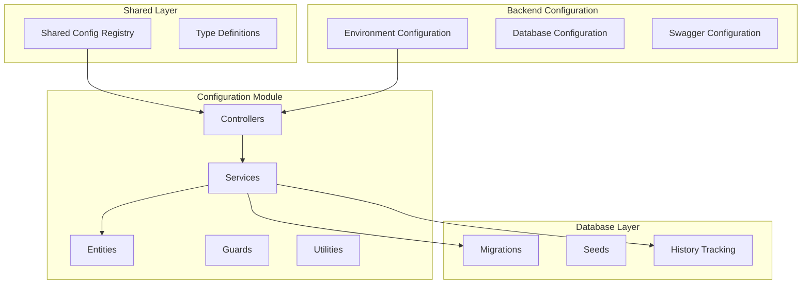
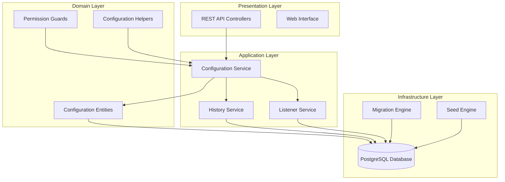
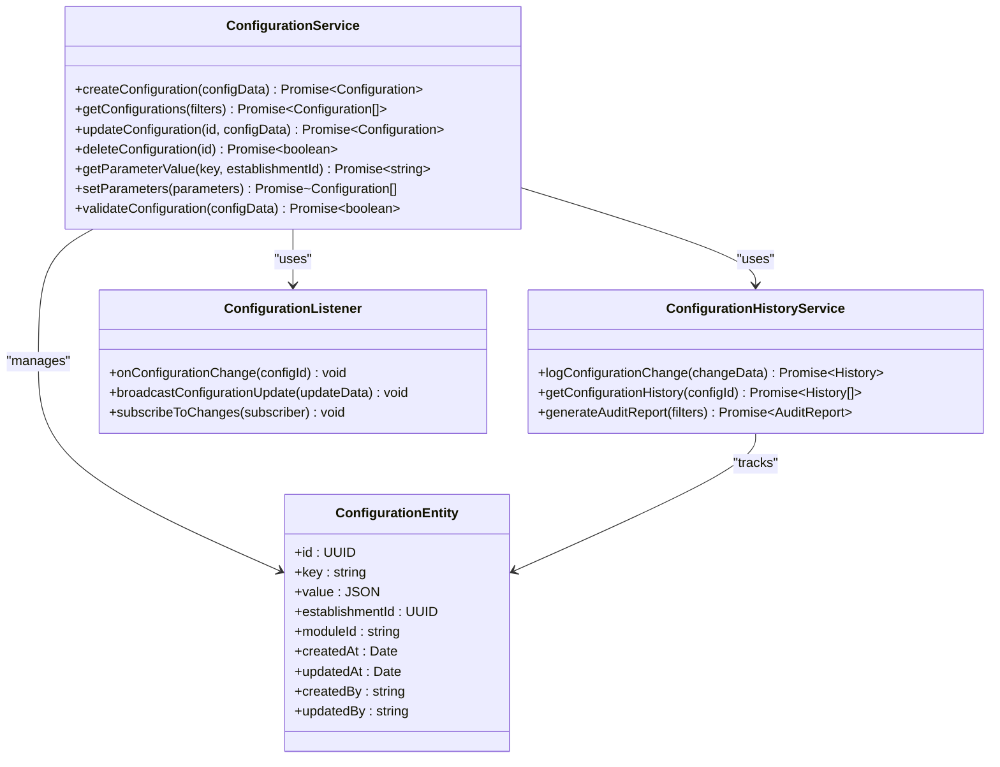
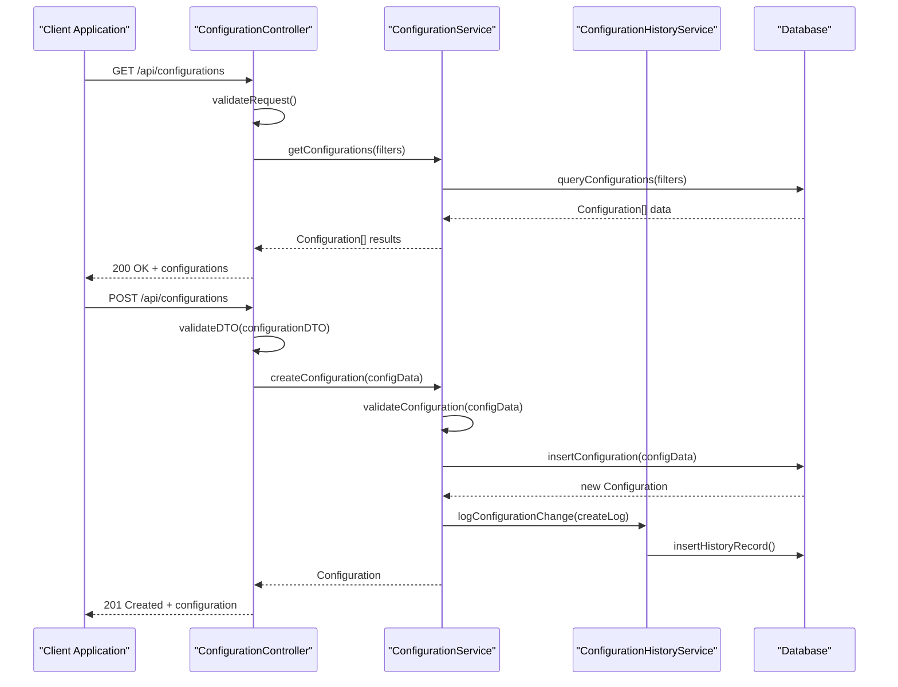
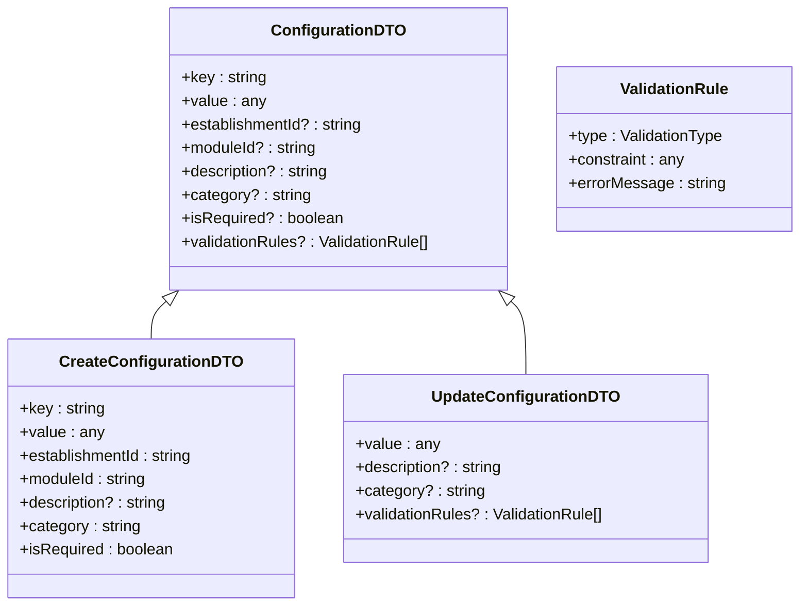
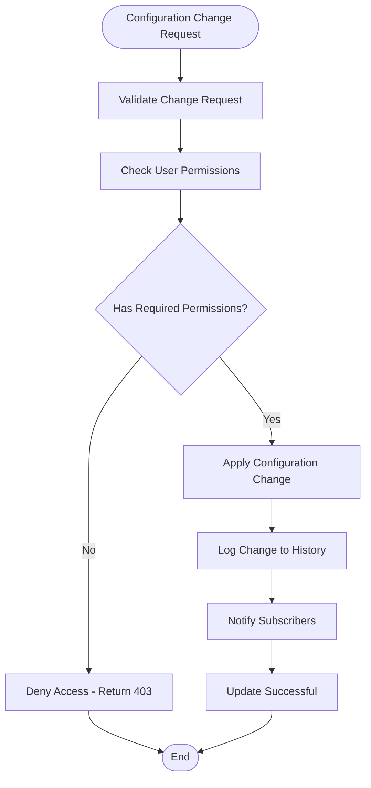
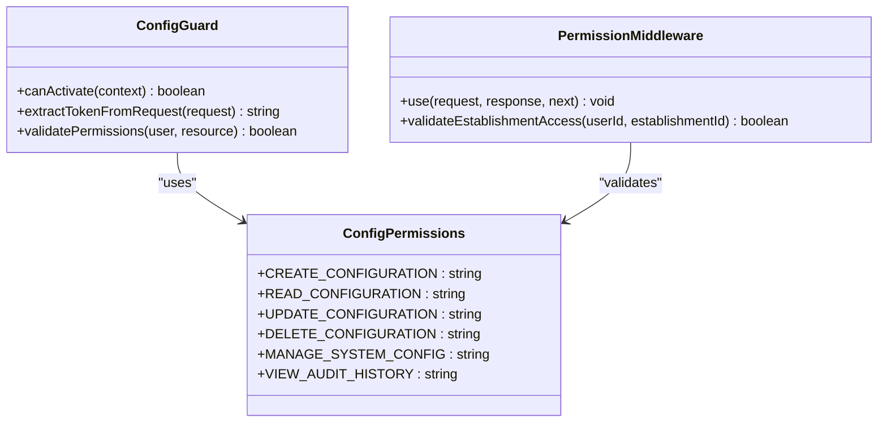
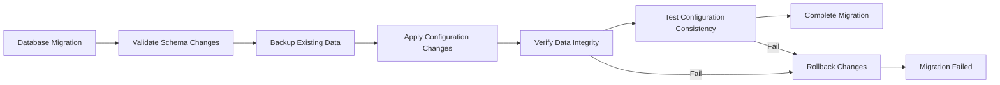

# Configuration System Improvements

<cite>
**Referenced Files in This Document**
- [config.ts](file://shared/src/config/config.registry.ts)
- [index.ts](file://shared/src/config/index.ts)
- [configuration.controller.ts](file://backend/src/modules/configuration/controllers/configuration.controller.ts)
- [configuration.service.ts](file://backend/src/modules/configuration/services/configuration.service.ts)
- [configuration-history.service.ts](file://backend/src/modules/configuration/services/configuration-history.service.ts)
- [configuration-listener.ts](file://backend/src/modules/configuration/services/configuration-listener.ts)
- [configuration-seed.service.ts](file://backend/src/modules/configuration/services/configuration-seed.service.ts)
- [configuration.dto.ts](file://backend/src/modules/configuration/dto/configuration.dto.ts)
- [configuration-app.entity.ts](file://backend/src/modules/configuration/entities/configuration-app.entity.ts)
- [configuration-module.entity.ts](file://backend/src/modules/configuration/entities/configuration-module.entity.ts)
- [historique-configuration.entity.ts](file://backend/src/modules/configuration/entities/historique-configuration.entity.ts)
- [parametre-systeme.entity.ts](file://backend/src/modules/configuration/entities/parametre-systeme.entity.ts)
- [config-permissions.ts](file://backend/src/modules/configuration/guards/config-permissions.ts)
- [config.guard.ts](file://backend/src/modules/configuration/guards/config.guard.ts)
- [config.helper.ts](file://backend/src/modules/configuration/utils/config.helper.ts)
- [env.config.ts](file://backend/src/config/env.config.ts)
- [database.config.ts](file://backend/src/config/database.config.ts)
- [swagger.config.ts](file://backend/src/config/swagger.config.ts)
- [007-consolider-configuration-app.ts](file://backend/src/database/migrations/007-consolider-configuration-app.ts)
- [CONFIGURATION_IMPROVEMENTS.md](file://docs/CONFIGURATION_IMPROVEMENTS.md)
- [README.md](file://README.md)
</cite>

## Table of Contents
1. [Introduction](#introduction)
2. [Project Structure](#project-structure)
3. [Core Components](#core-components)
4. [Architecture Overview](#architecture-overview)
5. [Detailed Component Analysis](#detailed-component-analysis)
6. [Configuration Management System](#configuration-management-system)
7. [Audit and History Tracking](#audit-and-history-tracking)
8. [Security and Permissions](#security-and-permissions)
9. [Migration and Data Consistency](#migration-and-data-consistency)
10. [Performance Considerations](#performance-considerations)
11. [Troubleshooting Guide](#troubleshooting-guide)
12. [Conclusion](#conclusion)

## Introduction

The eLISAschool project has undergone significant configuration system improvements to support multi-establishment education management with advanced parameter management capabilities. This comprehensive documentation covers the enhanced configuration system that enables dynamic configuration of educational parameters, audit trail functionality, and robust security controls for managing school-specific settings.

The configuration system is designed to handle complex educational environments with multiple establishments, each requiring customized parameters while maintaining centralized oversight and audit capabilities. The system supports real-time configuration updates, historical tracking, and granular permission controls.

## Project Structure

The configuration system is organized across multiple layers within the eLISAschool architecture:

**Diagram sources**
- [config.ts:1-50](file://shared/src/config/config.registry.ts#L1-L50)
- [configuration.controller.ts:1-80](file://backend/src/modules/configuration/controllers/configuration.controller.ts#L1-L80)
- [configuration.service.ts:1-100](file://backend/src/modules/configuration/services/configuration.service.ts#L1-L100)

**Section sources**
- [config.ts:1-50](file://shared/src/config/config.registry.ts#L1-L50)
- [env.config.ts:1-80](file://backend/src/config/env.config.ts#L1-L80)
- [configuration.controller.ts:1-120](file://backend/src/modules/configuration/controllers/configuration.controller.ts#L1-L120)

## Core Components

### Shared Configuration Registry

The shared configuration registry serves as the central hub for all configuration parameters across the system. It provides type-safe access to configuration values and ensures consistency across different modules.

Key features include:
- Centralized configuration storage
- Type-safe parameter access
- Environment-specific configuration loading
- Runtime configuration updates

### Configuration Controllers

The configuration controllers handle HTTP requests for managing system parameters. They provide RESTful endpoints for CRUD operations on configuration data with proper validation and error handling.

### Configuration Services

The service layer implements business logic for configuration management, including:
- Parameter validation and sanitization
- Multi-establishment configuration support
- Audit trail generation
- Historical data management

### Entity Model

The configuration entity model defines the database schema for storing configuration parameters, history, and system settings with proper relationships and constraints.

**Section sources**
- [config.ts:1-80](file://shared/src/config/config.registry.ts#L1-L80)
- [configuration.controller.ts:1-150](file://backend/src/modules/configuration/controllers/configuration.controller.ts#L1-L150)
- [configuration.service.ts:1-150](file://backend/src/modules/configuration/services/configuration.service.ts#L1-L150)

## Architecture Overview

The configuration system follows a layered architecture pattern with clear separation of concerns:

**Diagram sources**
- [configuration.controller.ts:1-200](file://backend/src/modules/configuration/controllers/configuration.controller.ts#L1-L200)
- [configuration.service.ts:1-200](file://backend/src/modules/configuration/services/configuration.service.ts#L1-L200)
- [configuration-history.service.ts:1-150](file://backend/src/modules/configuration/services/configuration-history.service.ts#L1-L150)

## Detailed Component Analysis

### Configuration Service Implementation

The configuration service is the core component responsible for managing all configuration operations. It implements advanced features for multi-establishment support and real-time parameter updates.

**Diagram sources**
- [configuration.service.ts:1-250](file://backend/src/modules/configuration/services/configuration.service.ts#L1-L250)
- [configuration-history.service.ts:1-200](file://backend/src/modules/configuration/services/configuration-history.service.ts#L1-L200)
- [configuration-listener.ts:1-150](file://backend/src/modules/configuration/services/configuration-listener.ts#L1-L150)
- [configuration-app.entity.ts:1-120](file://backend/src/modules/configuration/entities/configuration-app.entity.ts#L1-L120)

### Configuration Controller Flow

The controller handles incoming requests and coordinates with services for processing:

**Diagram sources**
- [configuration.controller.ts:1-250](file://backend/src/modules/configuration/controllers/configuration.controller.ts#L1-L250)
- [configuration.service.ts:1-250](file://backend/src/modules/configuration/services/configuration.service.ts#L1-L250)
- [configuration-history.service.ts:1-150](file://backend/src/modules/configuration/services/configuration-history.service.ts#L1-L150)

**Section sources**
- [configuration.service.ts:1-300](file://backend/src/modules/configuration/services/configuration.service.ts#L1-L300)
- [configuration.controller.ts:1-300](file://backend/src/modules/configuration/controllers/configuration.controller.ts#L1-L300)

### Configuration DTO Validation

The DTO layer ensures data integrity and provides structured input validation:

**Diagram sources**
- [configuration.dto.ts:1-200](file://backend/src/modules/configuration/dto/configuration.dto.ts#L1-L200)

**Section sources**
- [configuration.dto.ts:1-200](file://backend/src/modules/configuration/dto/configuration.dto.ts#L1-L200)

## Configuration Management System

### Multi-Establishment Support

The configuration system supports multiple educational establishments with establishment-specific parameters:

- Establishment-scoped configuration inheritance
- Global system parameters
- Module-specific configurations
- Hierarchical parameter precedence

### Real-time Configuration Updates

The system implements WebSocket-based real-time updates for immediate parameter synchronization across connected clients.

### Parameter Categories and Types

Configuration parameters are categorized and typed for better management:

- System-wide parameters affecting all establishments
- Establishment-specific parameters
- Module-specific parameters
- Dynamic parameters supporting runtime changes

**Section sources**
- [configuration-app.entity.ts:1-150](file://backend/src/modules/configuration/entities/configuration-app.entity.ts#L1-L150)
- [configuration-module.entity.ts:1-120](file://backend/src/modules/configuration/entities/configuration-module.entity.ts#L1-L120)
- [parametre-systeme.entity.ts:1-100](file://backend/src/modules/configuration/entities/parametre-systeme.entity.ts#L1-L100)

## Audit and History Tracking

### Configuration Change Auditing

Every configuration change is tracked with comprehensive audit information:

- Timestamp of changes
- User who made modifications
- Old and new parameter values
- Establishment affected
- Change justification

### Historical Data Management

The system maintains historical records for compliance and rollback capabilities:

**Diagram sources**
- [configuration-history.service.ts:1-200](file://backend/src/modules/configuration/services/configuration-history.service.ts#L1-L200)
- [configuration-listener.ts:1-150](file://backend/src/modules/configuration/services/configuration-listener.ts#L1-L150)

**Section sources**
- [configuration-history.service.ts:1-200](file://backend/src/modules/configuration/services/configuration-history.service.ts#L1-L200)
- [historique-configuration.entity.ts:1-120](file://backend/src/modules/configuration/entities/historique-configuration.entity.ts#L1-L120)

## Security and Permissions

### Role-Based Access Control

The configuration system implements fine-grained permissions:

- System administrator access to all configurations
- Establishment administrator access to establishment-specific configs
- Module-specific permissions for different configuration areas
- Audit trail access restrictions

### Configuration Guards

Custom guards enforce security policies:

**Diagram sources**
- [config.guard.ts:1-100](file://backend/src/modules/configuration/guards/config.guard.ts#L1-L100)
- [config-permissions.ts:1-150](file://backend/src/modules/configuration/guards/config-permissions.ts#L1-L150)

**Section sources**
- [config.guard.ts:1-120](file://backend/src/modules/configuration/guards/config.guard.ts#L1-L120)
- [config-permissions.ts:1-200](file://backend/src/modules/configuration/guards/config-permissions.ts#L1-L200)

## Migration and Data Consistency

### Database Migration Strategy

The configuration system includes comprehensive migration support:

- Consolidated configuration application migration
- Advanced parameter management enhancements
- Multi-establishment parameter support
- Configuration history preservation

### Data Integrity Measures

**Diagram sources**
- [007-consolider-configuration-app.ts:1-200](file://backend/src/database/migrations/007-consolider-configuration-app.ts#L1-L200)

**Section sources**
- [007-consolider-configuration-app.ts:1-250](file://backend/src/database/migrations/007-consolider-configuration-app.ts#L1-L250)

## Performance Considerations

### Caching Strategy

The configuration system implements intelligent caching:

- Redis-based configuration cache
- Establishment-specific cache invalidation
- TTL-based cache expiration
- Cache warming during application startup

### Scalability Features

- Asynchronous configuration change notifications
- Batch processing for bulk configuration updates
- Connection pooling for database operations
- Optimized query patterns for configuration retrieval

### Monitoring and Metrics

- Configuration change frequency tracking
- Cache hit rate monitoring
- Database query performance metrics
- Real-time configuration update latency

## Troubleshooting Guide

### Common Configuration Issues

**Configuration Not Persisting**
- Verify database connectivity and migration completion
- Check configuration validation rules
- Review establishment-specific parameter conflicts

**Permission Denied Errors**
- Verify user role assignments
- Check establishment administrator permissions
- Review module-specific access controls

**Audit Trail Inconsistencies**
- Verify audit logging service availability
- Check database write permissions
- Review audit trail retention policies

### Debugging Configuration Problems

Diagnostic steps include:
1. Enable detailed logging for configuration operations
2. Verify database schema consistency
3. Check cache synchronization status
4. Review recent configuration change logs

**Section sources**
- [configuration.service.ts:1-100](file://backend/src/modules/configuration/services/configuration.service.ts#L1-L100)
- [configuration-history.service.ts:1-100](file://backend/src/modules/configuration/services/configuration-history.service.ts#L1-L100)

## Conclusion

The eLISAschool configuration system improvements represent a comprehensive solution for managing complex educational parameters across multiple establishments. The system provides:

- **Scalable Architecture**: Supports growing educational networks with thousands of establishments
- **Enhanced Security**: Fine-grained permissions and comprehensive audit trails
- **Real-time Capabilities**: Immediate parameter synchronization across distributed systems
- **Data Integrity**: Robust validation, migration support, and consistency guarantees
- **Developer Experience**: Clean APIs, comprehensive documentation, and testing support

The implementation demonstrates best practices in enterprise configuration management, combining modern architectural patterns with domain-specific requirements for educational administration systems.