# Development & Testing Guide

<cite>
**Referenced Files in This Document**
- [README.md](file://README.md)
- [backend/package.json](file://backend/package.json)
- [backend/src/index.ts](file://backend/src/index.ts)
- [backend/src/app.ts](file://backend/src/app.ts)
- [backend/src/config/env.config.ts](file://backend/src/config/env.config.ts)
- [backend/src/config/database.config.ts](file://backend/src/config/database.config.ts)
- [backend/src/database/data-source.ts](file://backend/src/database/data-source.ts)
- [backend/src/common/utils/logger.util.ts](file://backend/src/common/utils/logger.util.ts)
- [backend/src/common/interceptors/request-logger.interceptor.ts](file://backend/src/common/interceptors/request-logger.interceptor.ts)
- [backend/src/common/filters/error.filter.ts](file://backend/src/common/filters/error.filter.ts)
- [backend/src/common/filters/not-found.filter.ts](file://backend/src/common/filters/not-found.filter.ts)
- [backend/src/common/middlewares/tenant.middleware.ts](file://backend/src/common/middlewares/tenant.middleware.ts)
- [backend/src/modules/configuration/services/configuration.service.ts](file://backend/src/modules/configuration/services/configuration.service.ts)
- [backend/src/modules/configuration/utils/config.helper.ts](file://backend/src/modules/configuration/utils/config.helper.ts)
- [backend/src/database/seeds/run-seeds.ts](file://backend/src/database/seeds/run-seeds.ts)
- [backend/src/database/seeds/initial.seed.ts](file://backend/src/database/seeds/initial.seed.ts)
- [backend/test/multi-tenant-isolation.test.ts](file://backend/test/multi-tenant-isolation.test.ts)
- [backend/test/integration/configuration-multi-tenant.spec.ts](file://backend/test/integration/configuration-multi-tenant.spec.ts)
- [backend/test/integration/auth-multi-etablissement.spec.ts](file://backend/test/integration/auth-multi-etablissement.spec.ts)
- [frontend/src/hooks/use-multi-tenant.ts](file://frontend/src/hooks/use-multi-tenant.ts)
- [docker/docker-compose.yml](file://docker/docker-compose.yml)
- [docker/Dockerfile.backend](file://docker/Dockerfile.backend)
- [docker/Dockerfile.frontend](file://docker/Dockerfile.frontend)
- [shared/package.json](file://shared/package.json)
- [shared/src/index.ts](file://shared/src/index.ts)
</cite>

## Update Summary
**Changes Made**
- Added comprehensive multi-tenant testing framework documentation
- Documented tenant isolation test suites for structure académique entities
- Added configuration multi-tenant integration tests
- Documented authentication multi-établissement tests
- Added tenant middleware implementation details
- Included frontend multi-tenant hook optimization
- Enhanced testing strategies with multi-tenant scenarios

## Table of Contents
1. [Introduction](#introduction)
2. [Project Structure](#project-structure)
3. [Core Components](#core-components)
4. [Architecture Overview](#architecture-overview)
5. [Detailed Component Analysis](#detailed-component-analysis)
6. [Multi-Tenant Testing Framework](#multi-tenant-testing-framework)
7. [Dependency Analysis](#dependency-analysis)
8. [Performance Considerations](#performance-considerations)
9. [Troubleshooting Guide](#troubleshooting-guide)
10. [Conclusion](#conclusion)
11. [Appendices](#appendices)

## Introduction
This guide documents the development and testing workflow for eLISAschool, a modular school management PWA. It covers development setup, code standards, logging and debugging, seed data and database migrations, comprehensive testing strategies including unit, integration, and end-to-end testing with multi-tenant scenarios, code review and CI/CD practices, and quality assurance processes including performance, security, and load testing.

**Updated** Added comprehensive multi-tenant testing framework covering tenant isolation, establishment-specific functionality, and unified configuration management.

## Project Structure
The repository is organized into:
- backend: Express.js API with TypeScript, modular domain structure, shared utilities, database configuration, and multi-tenant testing infrastructure.
- shared: Shared types, constants, and validators used across backend and frontend.
- docker: Containerization for backend and frontend with orchestration via docker-compose.
- docs: Technical and user documentation.
- frontend: React frontend with TanStack Query integration and multi-tenant optimizations.
- Root: Top-level scripts and installation instructions.

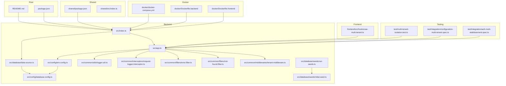

**Diagram sources**
- [backend/src/index.ts:1-62](file://backend/src/index.ts#L1-L62)
- [backend/src/app.ts:1-205](file://backend/src/app.ts#L1-L205)
- [backend/src/config/env.config.ts:1-168](file://backend/src/config/env.config.ts#L1-L168)
- [backend/src/config/database.config.ts](file://backend/src/config/database.config.ts)
- [backend/src/database/data-source.ts:1-40](file://backend/src/database/data-source.ts#L1-L40)
- [backend/src/common/utils/logger.util.ts:1-91](file://backend/src/common/utils/logger.util.ts#L1-L91)
- [backend/src/common/interceptors/request-logger.interceptor.ts](file://backend/src/common/interceptors/request-logger.interceptor.ts)
- [backend/src/common/filters/error.filter.ts](file://backend/src/common/filters/error.filter.ts)
- [backend/src/common/filters/not-found.filter.ts](file://backend/src/common/filters/not-found.filter.ts)
- [backend/src/common/middlewares/tenant.middleware.ts:1-132](file://backend/src/common/middlewares/tenant.middleware.ts#L1-L132)
- [backend/src/database/seeds/run-seeds.ts](file://backend/src/database/seeds/run-seeds.ts)
- [backend/src/database/seeds/initial.seed.ts](file://backend/src/database/seeds/initial.seed.ts)
- [frontend/src/hooks/use-multi-tenant.ts:1-258](file://frontend/src/hooks/use-multi-tenant.ts#L1-L258)
- [backend/test/multi-tenant-isolation.test.ts:1-320](file://backend/test/multi-tenant-isolation.test.ts#L1-L320)
- [backend/test/integration/configuration-multi-tenant.spec.ts:1-220](file://backend/test/integration/configuration-multi-tenant.spec.ts#L1-L220)
- [backend/test/integration/auth-multi-etablissement.spec.ts:1-161](file://backend/test/integration/auth-multi-etablissement.spec.ts#L1-L161)
- [shared/package.json](file://shared/package.json)
- [shared/src/index.ts](file://shared/src/index.ts)
- [docker/docker-compose.yml](file://docker/docker-compose.yml)
- [docker/Dockerfile.backend](file://docker/Dockerfile.backend)
- [docker/Dockerfile.frontend](file://docker/Dockerfile.frontend)

**Section sources**
- [README.md:1-39](file://README.md#L1-L39)
- [backend/package.json:1-61](file://backend/package.json#L1-L61)

## Core Components
- Environment configuration and validation: Centralized Zod-based validation for environment variables, exported as structured domains (app, database, jwt, encryption, redis, email, license, logging).
- Express application factory: Security middleware (Helmet, CORS, rate limiting), request logging interceptor, health endpoints, and modular routing.
- Database: TypeORM DataSource configured via environment-driven database config, with initialization and graceful shutdown hooks.
- Logging: Winston-based logger with console and file transports, configurable log levels, and development-specific verbosity.
- Seed system: Seed runner and initial seed data for database initialization.
- Scripts and tooling: npm scripts for dev, build, lint, test, migrations, and seeding.
- **Multi-tenant middleware**: Tenant-aware middleware supporting SUPER_ADMIN access, multi-establishment users, and legacy single-establishment compatibility.
- **Configuration service**: Unified configuration management with caching, multi-tenant parameter resolution, and performance optimizations.
- **Frontend hooks**: Optimized React Query hooks for multi-tenant operations with caching and error handling.

**Updated** Added multi-tenant middleware, configuration service, and frontend hooks to support comprehensive tenant isolation and establishment-specific functionality.

**Section sources**
- [backend/src/config/env.config.ts:1-168](file://backend/src/config/env.config.ts#L1-L168)
- [backend/src/app.ts:58-205](file://backend/src/app.ts#L58-L205)
- [backend/src/database/data-source.ts:1-40](file://backend/src/database/data-source.ts#L1-L40)
- [backend/src/common/utils/logger.util.ts:1-91](file://backend/src/common/utils/logger.util.ts#L1-L91)
- [backend/src/database/seeds/run-seeds.ts](file://backend/src/database/seeds/run-seeds.ts)
- [backend/src/database/seeds/initial.seed.ts](file://backend/src/database/seeds/initial.seed.ts)
- [backend/src/common/middlewares/tenant.middleware.ts:1-132](file://backend/src/common/middlewares/tenant.middleware.ts#L1-L132)
- [backend/src/modules/configuration/services/configuration.service.ts:1-200](file://backend/src/modules/configuration/services/configuration.service.ts#L1-L200)
- [frontend/src/hooks/use-multi-tenant.ts:1-258](file://frontend/src/hooks/use-multi-tenant.ts#L1-L258)
- [backend/package.json:9-22](file://backend/package.json#L9-L22)

## Architecture Overview
The backend follows a layered architecture with comprehensive multi-tenant support:
- Entry point initializes environment, connects to the database, and starts the Express server.
- Middleware layer applies security, compression, rate limiting, request logging, and tenant filtering.
- Routing groups modules by functional domain with tenant-aware middleware.
- Error handling centralizes 404 and generic error responses.
- Configuration service provides unified parameter management with caching and multi-tenant resolution.

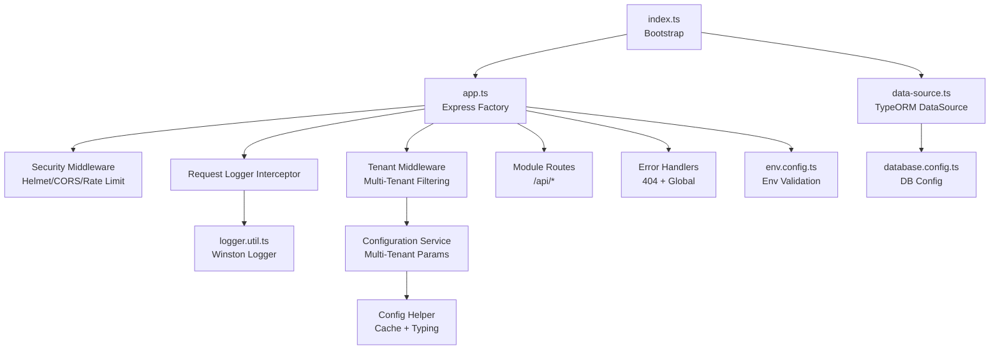

**Diagram sources**
- [backend/src/index.ts:22-61](file://backend/src/index.ts#L22-L61)
- [backend/src/app.ts:58-205](file://backend/src/app.ts#L58-L205)
- [backend/src/config/env.config.ts:120-165](file://backend/src/config/env.config.ts#L120-L165)
- [backend/src/database/data-source.ts:17-37](file://backend/src/database/data-source.ts#L17-L37)
- [backend/src/config/database.config.ts](file://backend/src/config/database.config.ts)
- [backend/src/common/utils/logger.util.ts:58-91](file://backend/src/common/utils/logger.util.ts#L58-L91)
- [backend/src/common/middlewares/tenant.middleware.ts:41-119](file://backend/src/common/middlewares/tenant.middleware.ts#L41-L119)
- [backend/src/modules/configuration/services/configuration.service.ts:58-74](file://backend/src/modules/configuration/services/configuration.service.ts#L58-L74)
- [backend/src/modules/configuration/utils/config.helper.ts:12-163](file://backend/src/modules/configuration/utils/config.helper.ts#L12-L163)

## Detailed Component Analysis

### Environment Configuration and Validation
- Validates required environment variables with Zod, providing defaults in non-production environments.
- Exposes a typed configuration object grouped by domain for use across modules.

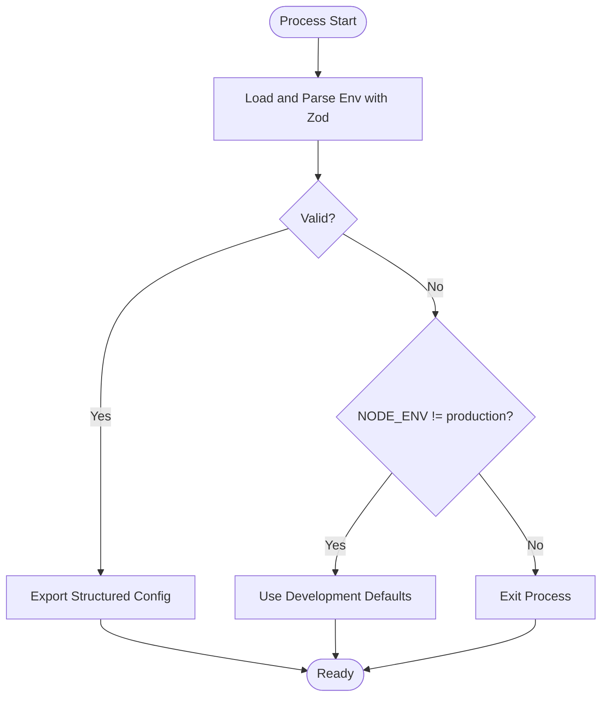

**Diagram sources**
- [backend/src/config/env.config.ts:68-112](file://backend/src/config/env.config.ts#L68-L112)
- [backend/src/config/env.config.ts:115-165](file://backend/src/config/env.config.ts#L115-L165)

**Section sources**
- [backend/src/config/env.config.ts:14-112](file://backend/src/config/env.config.ts#L14-L112)
- [backend/src/config/env.config.ts:120-165](file://backend/src/config/env.config.ts#L120-L165)

### Express Application Factory and Middleware Pipeline
- Security: Helmet hardens headers; CORS allows frontend origin; rate limiter protects against abuse.
- Parsing: Compression, JSON/URL-encoded body parsing with size limits.
- Logging: Request interceptor logs incoming requests.
- Routes: Modular mounting under /api for each domain module.
- Error handling: Not found and global error handlers.

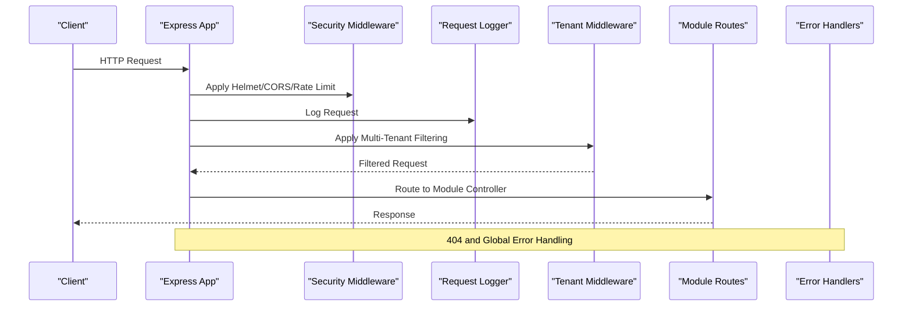

**Diagram sources**
- [backend/src/app.ts:66-117](file://backend/src/app.ts#L66-L117)
- [backend/src/app.ts:149-185](file://backend/src/app.ts#L149-L185)
- [backend/src/app.ts:197-201](file://backend/src/app.ts#L197-L201)
- [backend/src/common/middlewares/tenant.middleware.ts:41-119](file://backend/src/common/middlewares/tenant.middleware.ts#L41-L119)

**Section sources**
- [backend/src/app.ts:58-205](file://backend/src/app.ts#L58-L205)

### Database Initialization and Graceful Shutdown
- DataSource is initialized at startup and destroyed on SIGTERM/SIGINT signals.
- Provides helper functions for tests and scripts.

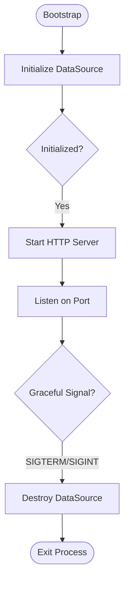

**Diagram sources**
- [backend/src/index.ts:22-58](file://backend/src/index.ts#L22-L58)
- [backend/src/database/data-source.ts:23-37](file://backend/src/database/data-source.ts#L23-L37)

**Section sources**
- [backend/src/index.ts:22-58](file://backend/src/index.ts#L22-L58)
- [backend/src/database/data-source.ts:17-37](file://backend/src/database/data-source.ts#L17-L37)

### Logging System
- Winston logger with console and file transports.
- Timestamped, colored console output and structured file logs.
- Development mode increases verbosity.

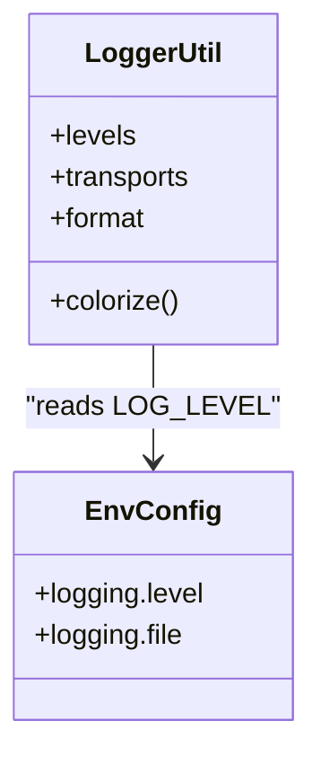

**Diagram sources**
- [backend/src/common/utils/logger.util.ts:58-91](file://backend/src/common/utils/logger.util.ts#L58-L91)
- [backend/src/config/env.config.ts:161-164](file://backend/src/config/env.config.ts#L161-L164)

**Section sources**
- [backend/src/common/utils/logger.util.ts:1-91](file://backend/src/common/utils/logger.util.ts#L1-L91)
- [backend/src/config/env.config.ts:56-57](file://backend/src/config/env.config.ts#L56-L57)

### Seed Data System
- Seed runner executes seed files to populate initial data.
- Typical pattern: a run-seeds entrypoint and an initial seed module.

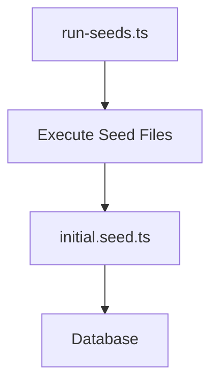

**Diagram sources**
- [backend/src/database/seeds/run-seeds.ts](file://backend/src/database/seeds/run-seeds.ts)
- [backend/src/database/seeds/initial.seed.ts](file://backend/src/database/seeds/initial.seed.ts)

**Section sources**
- [backend/src/database/seeds/run-seeds.ts](file://backend/src/database/seeds/run-seeds.ts)
- [backend/src/database/seeds/initial.seed.ts](file://backend/src/database/seeds/initial.seed.ts)

### Error and Not Found Handling
- Centralized not-found handler for unmatched routes.
- Global error filter to normalize error responses.

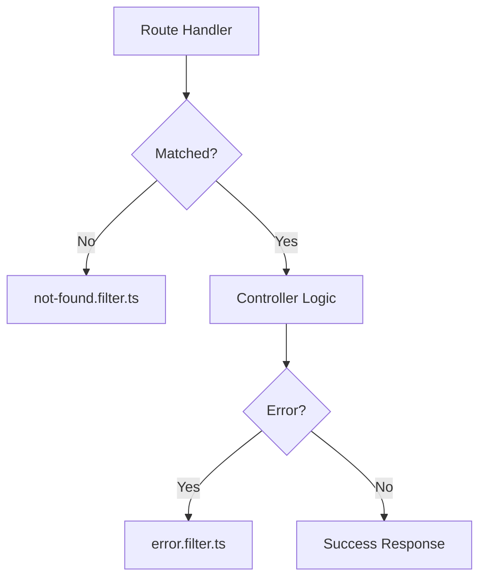

**Diagram sources**
- [backend/src/app.ts:197-201](file://backend/src/app.ts#L197-L201)
- [backend/src/common/filters/not-found.filter.ts](file://backend/src/common/filters/not-found.filter.ts)
- [backend/src/common/filters/error.filter.ts](file://backend/src/common/filters/error.filter.ts)

**Section sources**
- [backend/src/app.ts:197-201](file://backend/src/app.ts#L197-L201)
- [backend/src/common/filters/not-found.filter.ts](file://backend/src/common/filters/not-found.filter.ts)
- [backend/src/common/filters/error.filter.ts](file://backend/src/common/filters/error.filter.ts)

### Development Workflow and Tooling
- Development: nodemon with ts-node and path resolution.
- Build: TypeScript compilation and alias resolution.
- Linting: ESLint with TypeScript parser and plugin.
- Testing: Jest with ts-jest, watch mode, coverage, and comprehensive multi-tenant test suites.
- Migrations: TypeORM commands bound to the DataSource.
- Seeding: ts-node script to run seed files.

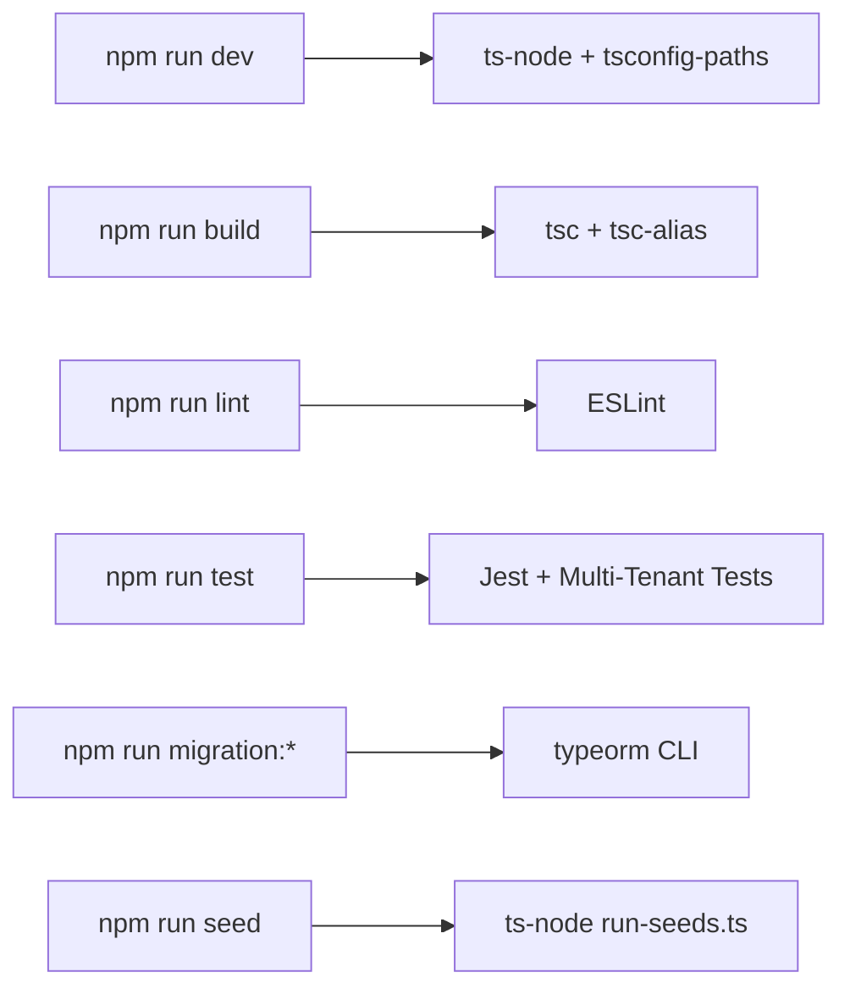

**Diagram sources**
- [backend/package.json:9-22](file://backend/package.json#L9-L22)

**Section sources**
- [backend/package.json:9-22](file://backend/package.json#L9-L22)

## Multi-Tenant Testing Framework

### Tenant Isolation Test Suite
Comprehensive integration tests validate multi-tenant isolation across core academic structure entities including Filieres, Specialites, and Competences. The test suite creates two establishments and verifies proper data segregation, unique constraints per establishment, and cascading deletion behavior.

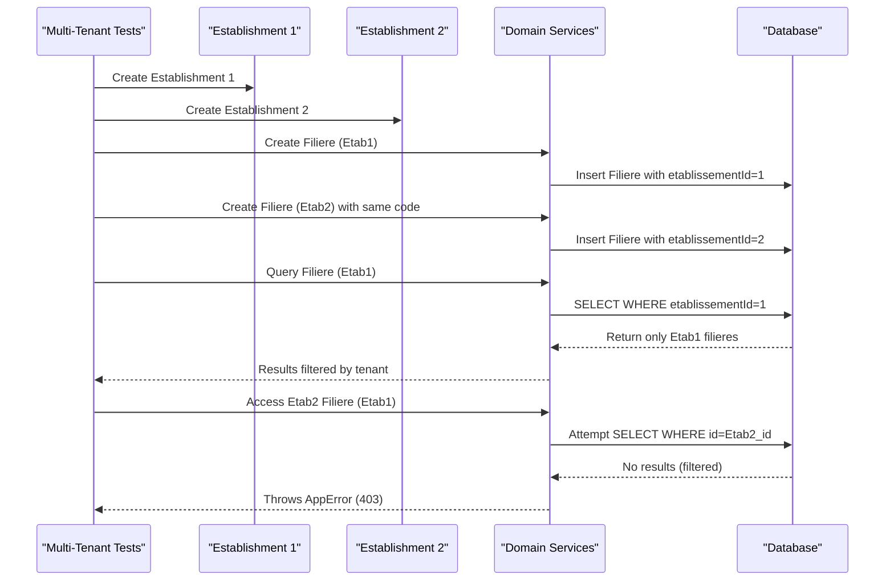

**Diagram sources**
- [backend/test/multi-tenant-isolation.test.ts:97-156](file://backend/test/multi-tenant-isolation.test.ts#L97-L156)
- [backend/test/multi-tenant-isolation.test.ts:158-225](file://backend/test/multi-tenant-isolation.test.ts#L158-L225)
- [backend/test/multi-tenant-isolation.test.ts:227-299](file://backend/test/multi-tenant-isolation.test.ts#L227-L299)

**Section sources**
- [backend/test/multi-tenant-isolation.test.ts:1-320](file://backend/test/multi-tenant-isolation.test.ts#L1-L320)

### Configuration Multi-Tenant Integration Tests
Tests validate the unified configuration system with multi-tenant parameter resolution, fallback mechanisms, and performance optimizations. The test suite covers parameter reading with fallback, module activation resolution, parameter creation and reset operations, and caching performance characteristics.

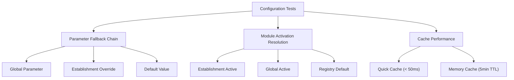

**Diagram sources**
- [backend/test/integration/configuration-multi-tenant.spec.ts:29-79](file://backend/test/integration/configuration-multi-tenant.spec.ts#L29-L79)
- [backend/test/integration/configuration-multi-tenant.spec.ts:81-119](file://backend/test/integration/configuration-multi-tenant.spec.ts#L81-L119)
- [backend/test/integration/configuration-multi-tenant.spec.ts:195-218](file://backend/test/integration/configuration-multi-tenant.spec.ts#L195-L218)

**Section sources**
- [backend/test/integration/configuration-multi-tenant.spec.ts:1-220](file://backend/test/integration/configuration-multi-tenant.spec.ts#L1-L220)

### Authentication Multi-Établissement Tests
Integration tests cover multi-establishment authentication flows including automatic establishment selection, token refresh with establishment updates, establishment switching, and tenant middleware validation. These tests ensure proper establishment context propagation through the authentication flow.

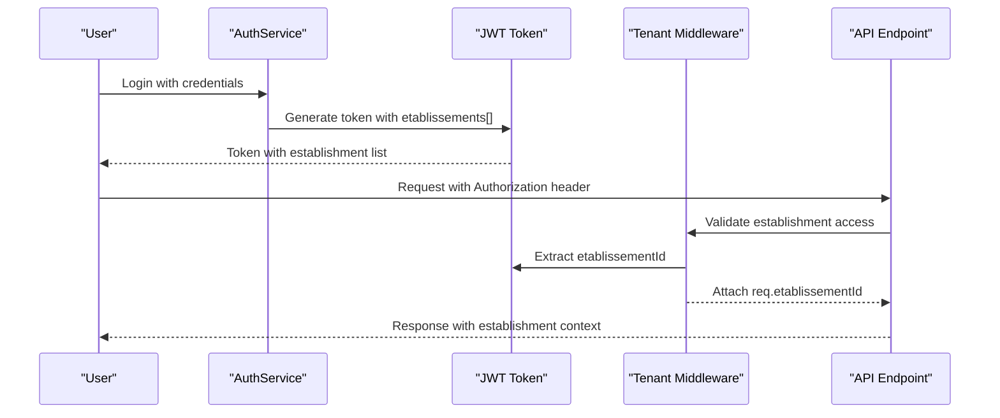

**Diagram sources**
- [backend/test/integration/auth-multi-etablissement.spec.ts:33-75](file://backend/test/integration/auth-multi-etablissement.spec.ts#L33-L75)
- [backend/test/integration/auth-multi-etablissement.spec.ts:115-133](file://backend/test/integration/auth-multi-etablissement.spec.ts#L115-L133)

**Section sources**
- [backend/test/integration/auth-multi-etablissement.spec.ts:1-161](file://backend/test/integration/auth-multi-etablissement.spec.ts#L1-L161)

### Tenant Middleware Implementation
The tenant middleware provides comprehensive multi-tenant filtering with support for different user types and establishment access patterns. It implements a tiered establishment selection algorithm with fallback mechanisms and proper error handling.

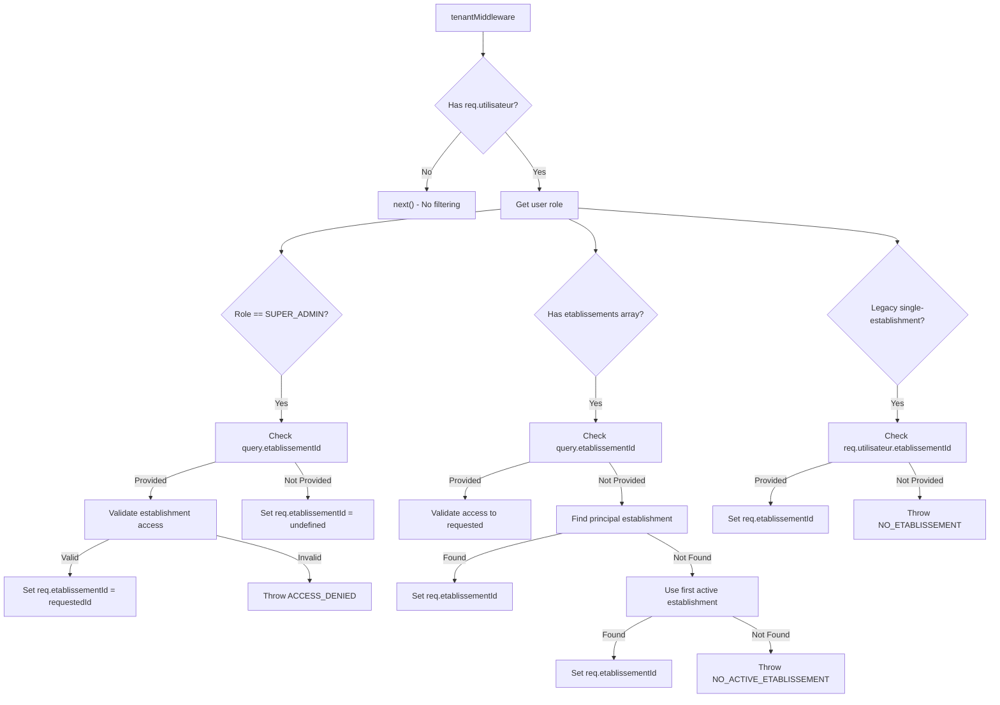

**Diagram sources**
- [backend/src/common/middlewares/tenant.middleware.ts:41-119](file://backend/src/common/middlewares/tenant.middleware.ts#L41-L119)

**Section sources**
- [backend/src/common/middlewares/tenant.middleware.ts:1-132](file://backend/src/common/middlewares/tenant.middleware.ts#L1-L132)

### Frontend Multi-Tenant Hooks Optimization
React Query hooks provide optimized multi-tenant operations with establishment-aware caching, centralized error handling, and intelligent retry mechanisms. The hooks automatically handle establishment context and provide consistent caching strategies across the application.

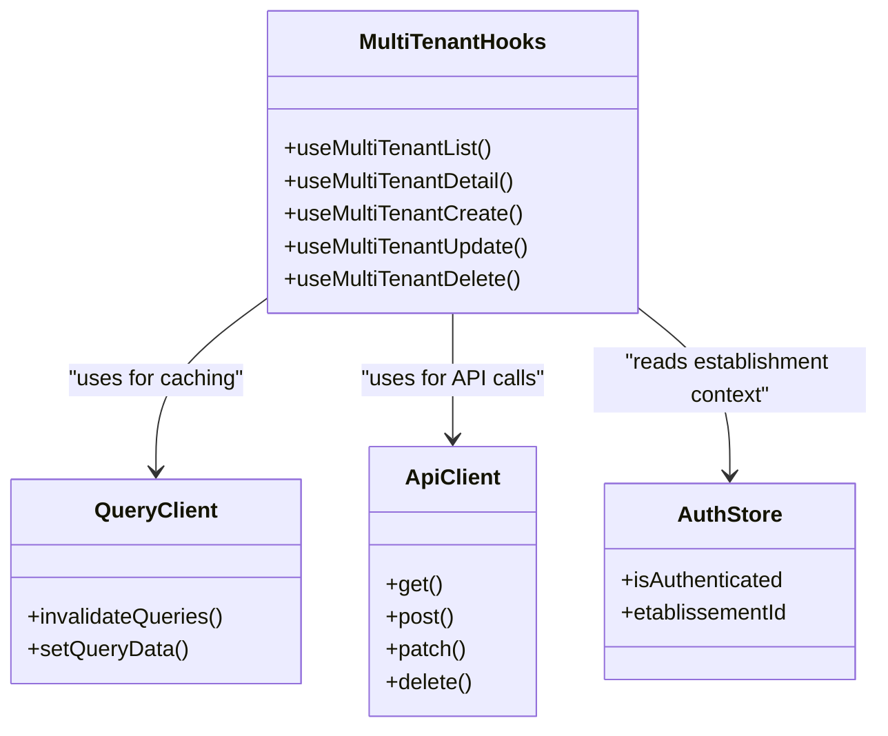

**Diagram sources**
- [frontend/src/hooks/use-multi-tenant.ts:36-76](file://frontend/src/hooks/use-multi-tenant.ts#L36-L76)
- [frontend/src/hooks/use-multi-tenant.ts:93-121](file://frontend/src/hooks/use-multi-tenant.ts#L93-L121)
- [frontend/src/hooks/use-multi-tenant.ts:137-165](file://frontend/src/hooks/use-multi-tenant.ts#L137-L165)

**Section sources**
- [frontend/src/hooks/use-multi-tenant.ts:1-258](file://frontend/src/hooks/use-multi-tenant.ts#L1-L258)

## Dependency Analysis
- Backend depends on Express, TypeORM, Helmet, CORS, compression, winston, bcrypt, jsonwebtoken, pg, uuid, qrcode, reflect-metadata, dotenv, zod.
- Scripts orchestrate development, testing, migrations, and seeding.
- Shared package provides reusable types and constants for both backend and frontend.
- **Multi-tenant dependencies**: Configuration service with caching, tenant middleware, and frontend hooks.
- **Testing dependencies**: Jest with comprehensive multi-tenant test suites.

**Updated** Added multi-tenant dependencies and testing infrastructure to the dependency analysis.

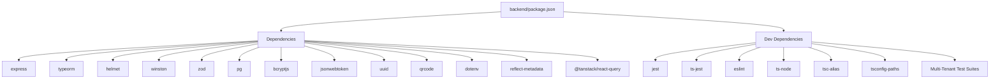

**Diagram sources**
- [backend/package.json:23-60](file://backend/package.json#L23-L60)

**Section sources**
- [backend/package.json:23-60](file://backend/package.json#L23-L60)

## Performance Considerations
- Enable compression middleware to reduce payload sizes.
- Use rate limiting to prevent resource exhaustion.
- Monitor database connections and queries; leverage TypeORM metrics and connection pooling.
- Optimize image and QR generation where applicable.
- Profile API endpoints and database queries during development and pre-deployment.
- **Multi-tenant performance**: Implement caching strategies, optimize tenant middleware, and use efficient parameter resolution.
- **Configuration performance**: Leverage memory caching for frequently accessed parameters and modules.

**Updated** Added multi-tenant specific performance considerations including caching strategies and parameter resolution optimization.

## Troubleshooting Guide
- Environment validation failures: Review invalid or missing environment variables; development mode falls back to defaults but production exits on failure.
- Database connectivity: Verify host, port, name, user, and password; ensure the DataSource is initialized before starting the server.
- Logging: Confirm log level and file paths; check logs directory permissions.
- Migration and seed issues: Run migrations and seeds with the provided scripts; ensure the DataSource is configured correctly.
- **Multi-tenant issues**: Verify tenant middleware is properly configured, check establishment IDs in JWT tokens, and validate parameter scoping.
- **Configuration problems**: Ensure proper parameter hierarchy (establishment override → global → default) and cache invalidation.

**Updated** Added troubleshooting guidance for multi-tenant specific issues including tenant middleware configuration and parameter scoping.

**Section sources**
- [backend/src/config/env.config.ts:68-112](file://backend/src/config/env.config.ts#L68-L112)
- [backend/src/index.ts:24-27](file://backend/src/index.ts#L24-L27)
- [backend/src/common/utils/logger.util.ts:61-81](file://backend/src/common/utils/logger.util.ts#L61-L81)
- [backend/package.json:18-21](file://backend/package.json#L18-L21)

## Conclusion
This guide outlines the development and testing practices for eLISAschool, emphasizing secure middleware, robust configuration validation, structured logging, modular routing, reliable database operations, and comprehensive multi-tenant testing. The addition of multi-tenant test suites ensures proper tenant isolation, establishment-specific functionality, and unified configuration management. Following the outlined workflows ensures consistent development, maintainable code, dependable releases, and reliable multi-tenant operations.

**Updated** Enhanced conclusion to reflect the comprehensive multi-tenant testing framework and establishment-specific functionality.

## Appendices

### A. Development Setup and Commands
- Install dependencies and start with Docker Compose or locally.
- Use npm scripts for development, building, linting, testing, migrations, and seeding.
- **Multi-tenant testing**: Run specific test suites for tenant isolation, configuration, and authentication.

**Updated** Added multi-tenant testing commands to the development setup.

**Section sources**
- [README.md:7-16](file://README.md#L7-L16)
- [backend/package.json:9-22](file://backend/package.json#L9-L22)

### B. Testing Strategies
- Unit tests: Use Jest with ts-jest for isolated unit tests.
- Integration tests: Test controller and service interactions with a test database instance.
- End-to-end tests: Validate full request flows using a real server and database.
- **Multi-tenant tests**: Comprehensive integration tests for tenant isolation, establishment-specific functionality, and unified configuration management.
- **Authentication tests**: Multi-establishment authentication flows and establishment switching scenarios.

**Updated** Added comprehensive multi-tenant testing strategies including tenant isolation, establishment-specific functionality, and authentication flows.

### C. Code Review Guidelines
- Validate environment variables with Zod and ensure defaults are appropriate per environment.
- Keep controllers thin; delegate business logic to services.
- Use consistent logging levels and avoid sensitive data in logs.
- Write tests for critical paths and error conditions.
- Document public APIs and keep DTOs aligned with entities.
- **Multi-tenant code review**: Verify tenant isolation implementation, establishment context propagation, and proper parameter scoping.
- **Configuration review**: Ensure proper fallback mechanisms and caching strategies.

**Updated** Added multi-tenant specific code review guidelines focusing on tenant isolation and configuration management.

### D. CI/CD and Quality Assurance
- CI: Run lint, unit tests, and integration tests on pull requests; gate merges on passing checks.
- CD: Build images with Dockerfiles and deploy via docker-compose or container orchestrator.
- Security: Rotate secrets, enforce HTTPS, and review JWT and encryption keys regularly.
- Performance and load testing: Use profiling tools and simulate traffic to validate scalability.
- **Multi-tenant CI**: Include multi-tenant test suites in CI pipeline with establishment-specific test scenarios.

**Updated** Added multi-tenant CI/CD considerations including establishment-specific test scenarios.

### E. Database Migration Procedures
- Generate migrations with the provided script; review generated SQL.
- Run migrations in staging before production.
- Revert only in controlled rollback scenarios.
- **Multi-tenant migrations**: Ensure proper establishment ID columns and tenant-aware foreign key constraints.

**Updated** Added multi-tenant migration considerations including establishment ID columns and tenant-aware constraints.

**Section sources**
- [backend/package.json:18-20](file://backend/package.json#L18-L20)

### F. Seed Data Management
- Use the seed runner to populate initial data.
- Keep seed data deterministic and idempotent for repeatable environments.
- **Multi-tenant seeds**: Ensure proper establishment context in seed data and tenant isolation validation.

**Updated** Added multi-tenant seed data considerations.

**Section sources**
- [backend/package.json:21](file://backend/package.json#L21)
- [backend/src/database/seeds/run-seeds.ts](file://backend/src/database/seeds/run-seeds.ts)
- [backend/src/database/seeds/initial.seed.ts](file://backend/src/database/seeds/initial.seed.ts)

### G. Containerization
- Backend and frontend Dockerfiles define build contexts and runtime behavior.
- docker-compose orchestrates services and volumes.

**Section sources**
- [docker/Dockerfile.backend](file://docker/Dockerfile.backend)
- [docker/Dockerfile.frontend](file://docker/Dockerfile.frontend)
- [docker/docker-compose.yml](file://docker/docker-compose.yml)

### H. Shared Package
- Provides shared types and constants for backend and frontend alignment.

**Section sources**
- [shared/package.json](file://shared/package.json)
- [shared/src/index.ts](file://shared/src/index.ts)

### I. Multi-Tenant Configuration Service
- **Unified parameter management**: Single source of truth for all configuration parameters.
- **Multi-tenant resolution**: Automatic fallback from establishment-specific to global parameters.
- **Performance optimization**: Memory caching with TTL and quick cache for frequent access.
- **Module activation**: Hierarchical module activation resolution with dependency validation.

**Updated** Added comprehensive multi-tenant configuration service documentation.

**Section sources**
- [backend/src/modules/configuration/services/configuration.service.ts:1-200](file://backend/src/modules/configuration/services/configuration.service.ts#L1-L200)
- [backend/src/modules/configuration/utils/config.helper.ts:1-163](file://backend/src/modules/configuration/utils/config.helper.ts#L1-L163)

### J. Frontend Multi-Tenant Hooks
- **Optimized caching**: Establishment-aware caching with intelligent invalidation.
- **Error handling**: Centralized error handling with user-friendly notifications.
- **Retry mechanisms**: Intelligent retry with exponential backoff for failed operations.
- **Performance optimization**: Stale-time caching and garbage collection tuning.

**Updated** Added comprehensive frontend multi-tenant hooks documentation.

**Section sources**
- [frontend/src/hooks/use-multi-tenant.ts:1-258](file://frontend/src/hooks/use-multi-tenant.ts#L1-L258)