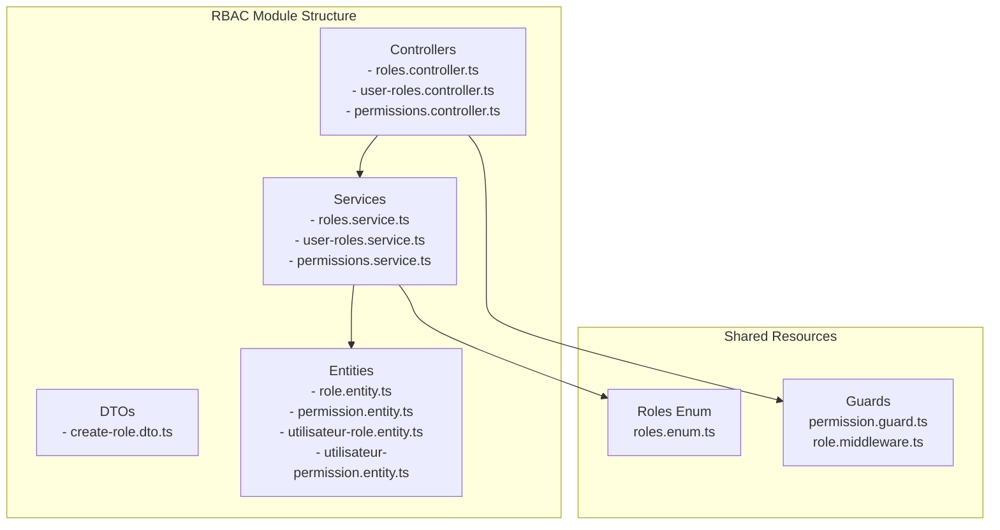
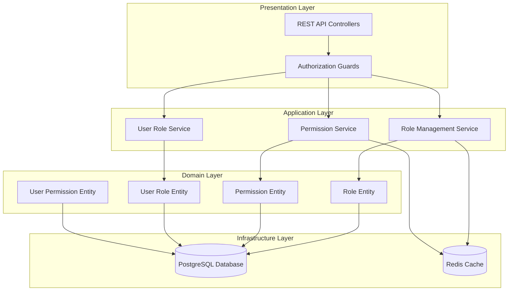
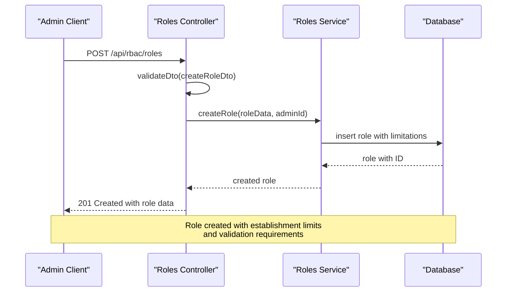
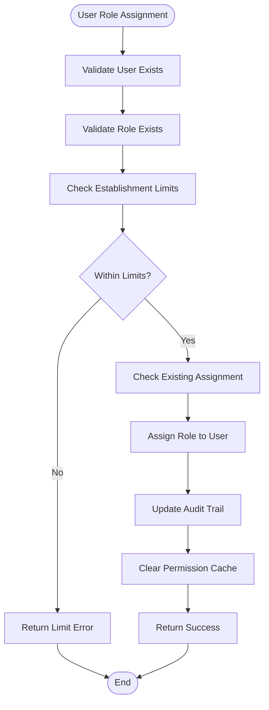
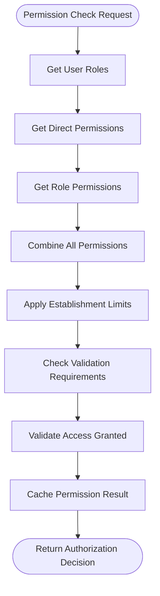
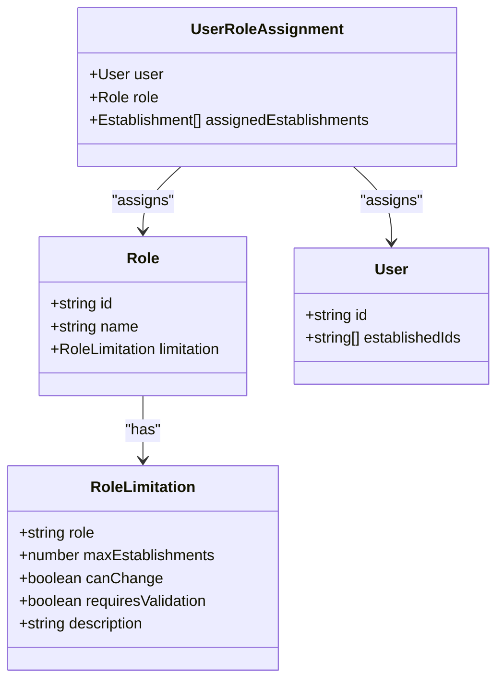
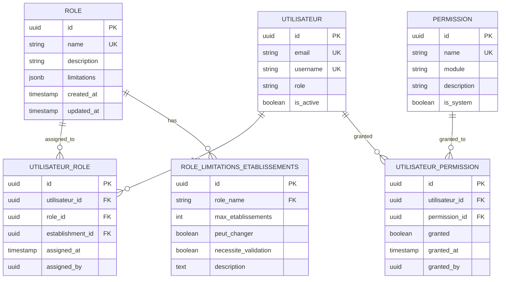
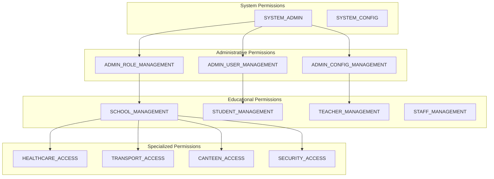
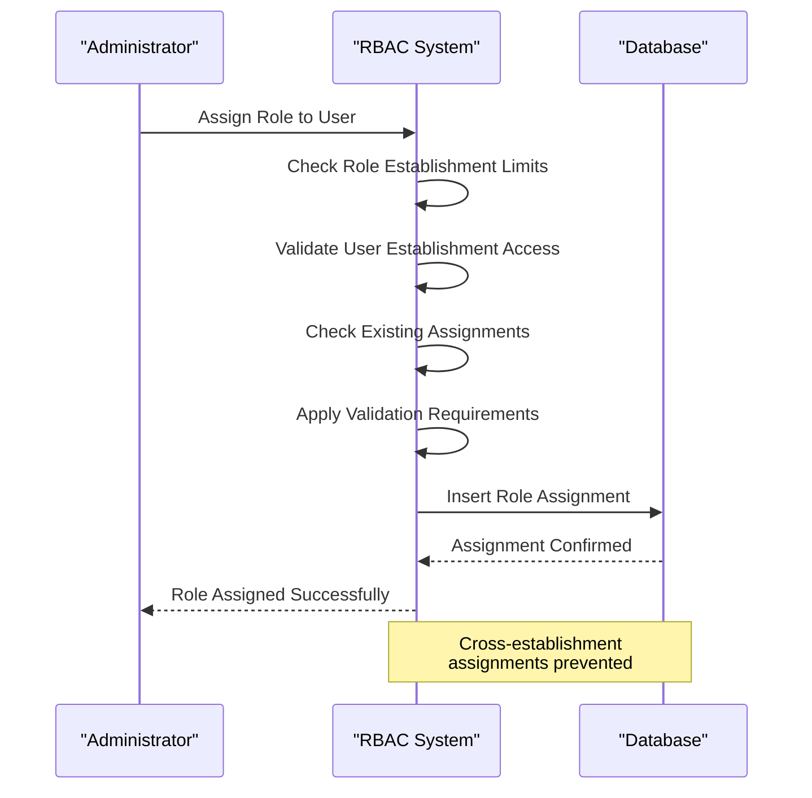
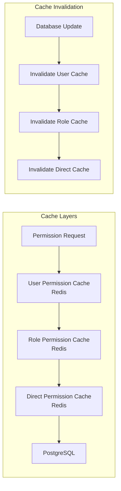

# Skills and RBAC Enhancements

<cite>
**Referenced Files in This Document**
- [roles.controller.ts](file://backend/src/modules/rbac/controllers/roles.controller.ts)
- [user-roles.controller.ts](file://backend/src/modules/rbac/controllers/user-roles.controller.ts)
- [permissions.controller.ts](file://backend/src/modules/rbac/controllers/permissions.controller.ts)
- [roles.service.ts](file://backend/src/modules/rbac/services/roles.service.ts)
- [user-roles.service.ts](file://backend/src/modules/rbac/services/user-roles.service.ts)
- [permissions.service.ts](file://backend/src/modules/rbac/services/permissions.service.ts)
- [roles.enum.ts](file://shared/src/enums/roles.enum.ts)
- [004-roles-systeme-educatif-africain.sql](file://backend/src/database/migrations/004-roles-systeme-educatif-africain.sql)
- [MAJ_SKILLS_RBAC.md](file://docs/MAJ_SKILLS_RBAC.md)
- [IMPLEMENTATION_EXTENSION_ROLES.md](file://IMPLEMENTATION_EXTENSION_ROLES.md)
- [ANALYSE_ROLES_EDUCATION_AFRICAINE.md](file://ANALYSE_ROLES_EDUCATION_AFRICAINE.md)
</cite>

## Table of Contents
1. [Introduction](#introduction)
2. [Project Structure](#project-structure)
3. [Core Components](#core-components)
4. [Architecture Overview](#architecture-overview)
5. [Detailed Component Analysis](#detailed-component-analysis)
6. [Skills Enhancement Implementation](#skills-enhancement-implementation)
7. [RBAC System Architecture](#rbac-system-architecture)
8. [Multi-Etablissement Support](#multi-etablissement-support)
9. [Performance Considerations](#performance-considerations)
10. [Implementation Status](#implementation-status)
11. [Conclusion](#conclusion)

## Introduction

The Skills and RBAC (Role-Based Access Control) Enhancements represent a comprehensive expansion of the eLISAschool platform's authorization system to support the complete educational ecosystem of Cameroon and West/Central African countries. This enhancement introduces 58 new roles covering the full spectrum of educational stakeholders, from national ministry officials to classroom teachers, administrative staff, and specialized support personnel.

The implementation addresses the complex multi-tiered educational governance structure with specific role limitations, establishment constraints, and validation requirements that reflect real-world educational administration needs. This system ensures proper segregation of duties while maintaining operational flexibility across different educational contexts.

## Project Structure

The RBAC enhancement is organized within the backend's modular architecture, specifically within the `rbac` module that handles all authorization-related functionality:

**Diagram sources**
- [roles.controller.ts:1-200](file://backend/src/modules/rbac/controllers/roles.controller.ts#L1-L200)
- [user-roles.controller.ts:1-150](file://backend/src/modules/rbac/controllers/user-roles.controller.ts#L1-L150)
- [permissions.controller.ts:1-200](file://backend/src/modules/rbac/controllers/permissions.controller.ts#L1-L200)

**Section sources**
- [roles.controller.ts:1-200](file://backend/src/modules/rbac/controllers/roles.controller.ts#L1-L200)
- [user-roles.controller.ts:1-150](file://backend/src/modules/rbac/controllers/user-roles.controller.ts#L1-L150)
- [permissions.controller.ts:1-200](file://backend/src/modules/rbac/controllers/permissions.controller.ts#L1-L200)

## Core Components

The RBAC system consists of three primary components that work together to provide comprehensive access control:

### Role Management System
The role management component handles the creation, modification, and deletion of roles within the educational hierarchy. It supports the complete range of 67 roles required for full coverage of African educational systems.

### User Role Assignment
This component manages the assignment of multiple roles to individual users, enabling flexible multi-position assignments typical in educational environments where staff may hold various responsibilities.

### Permission Resolution Engine
The permission resolution engine calculates effective permissions by combining direct permissions, role-based permissions, and inherited permissions, providing a unified authorization interface.

**Section sources**
- [roles.service.ts:1-300](file://backend/src/modules/rbac/services/roles.service.ts#L1-L300)
- [user-roles.service.ts:1-300](file://backend/src/modules/rbac/services/user-roles.service.ts#L1-L300)
- [permissions.service.ts:1-300](file://backend/src/modules/rbac/services/permissions.service.ts#L1-L300)

## Architecture Overview

The RBAC system follows a layered architecture pattern with clear separation of concerns:

**Diagram sources**
- [roles.controller.ts:1-200](file://backend/src/modules/rbac/controllers/roles.controller.ts#L1-L200)
- [user-roles.controller.ts:1-150](file://backend/src/modules/rbac/controllers/user-roles.controller.ts#L1-L150)
- [permissions.controller.ts:1-200](file://backend/src/modules/rbac/controllers/permissions.controller.ts#L1-L200)

## Detailed Component Analysis

### Role Management Controller

The role management controller provides comprehensive CRUD operations for educational roles with strict administrative controls:

**Diagram sources**
- [roles.controller.ts:1-120](file://backend/src/modules/rbac/controllers/roles.controller.ts#L1-L120)

### User Role Assignment System

The user role assignment system supports unlimited multi-role assignments with granular permission inheritance:

**Diagram sources**
- [user-roles.controller.ts:1-150](file://backend/src/modules/rbac/controllers/user-roles.controller.ts#L1-L150)

### Permission Resolution Engine

The permission resolution engine combines multiple sources of permissions to provide effective authorization decisions:

**Diagram sources**
- [permissions.service.ts:1-250](file://backend/src/modules/rbac/services/permissions.service.ts#L1-L250)

**Section sources**
- [roles.controller.ts:1-200](file://backend/src/modules/rbac/controllers/roles.controller.ts#L1-L200)
- [user-roles.controller.ts:1-150](file://backend/src/modules/rbac/controllers/user-roles.controller.ts#L1-L150)
- [permissions.controller.ts:1-200](file://backend/src/modules/rbac/controllers/permissions.controller.ts#L1-L200)

## Skills Enhancement Implementation

The skills enhancement introduces comprehensive coverage of the Cameroonian and broader African educational system:

### Role Categories and Coverage

The system now supports 67 distinct roles organized into logical categories:

| Category | Number of Roles | Examples |
|----------|----------------|----------|
| **National Administration** | 7 | MINISTRE, INSPECTEUR_GÉNÉRAL, DIRECTEUR_RÉGIONAL |
| **School Leadership** | 6 | PROVISEUR, PRINCIPAL, DIRECTEUR, CENSEUR |
| **Teaching Staff** | 10 | PROFESSEUR_CERTIFIÉ, INSTITUTEUR, PROFESSEUR_LANGUES |
| **Support Services** | 24 | Various specialized roles |

### Establishment Limitation System

Each role includes specific establishment limitations that prevent unauthorized cross-establishment access:

**Diagram sources**
- [004-roles-systeme-educatif-africain.sql:1-250](file://backend/src/database/migrations/004-roles-systeme-educatif-africain.sql#L1-L250)

**Section sources**
- [roles.enum.ts:1-250](file://shared/src/enums/roles.enum.ts#L1-L250)
- [004-roles-systeme-educatif-africain.sql:1-250](file://backend/src/database/migrations/004-roles-systeme-educatif-africain.sql#L1-L250)
- [IMPLEMENTATION_EXTENSION_ROLES.md:1-30](file://IMPLEMENTATION_EXTENSION_ROLES.md#L1-L30)

## RBAC System Architecture

The RBAC system implements a sophisticated multi-layered authorization architecture:

### Database Schema Design

The system uses a normalized relational design with proper foreign key relationships:

**Diagram sources**
- [004-roles-systeme-educatif-africain.sql:1-250](file://backend/src/database/migrations/004-roles-systeme-educatif-africain.sql#L1-L250)

### Permission Inheritance Model

The system implements a hierarchical permission model with proper inheritance:

**Diagram sources**
- [permissions.service.ts:1-300](file://backend/src/modules/rbac/services/permissions.service.ts#L1-L300)

**Section sources**
- [roles.service.ts:1-300](file://backend/src/modules/rbac/services/roles.service.ts#L1-L300)
- [user-roles.service.ts:1-300](file://backend/src/modules/rbac/services/user-roles.service.ts#L1-L300)
- [permissions.service.ts:1-300](file://backend/src/modules/rbac/services/permissions.service.ts#L1-L300)

## Multi-Etablissement Support

The system implements comprehensive multi-establishment support with role-based establishment limitations:

### Establishment Constraint Enforcement

Each role includes specific establishment constraints that prevent unauthorized cross-establishment access:

| Role Category | Max Establishments | Change Allowed | Validation Required |
|---------------|-------------------|----------------|-------------------|
| **National Officials** | Unlimited | Yes | No |
| **Regional Directors** | 50+ | Yes | No |
| **School Principals** | 1 | No | No |
| **Teachers** | 5 | Yes | No |
| **Support Staff** | 3 | Yes | Varies |

### Establishment Assignment Workflow

**Diagram sources**
- [user-roles.controller.ts:1-150](file://backend/src/modules/rbac/controllers/user-roles.controller.ts#L1-L150)

**Section sources**
- [004-roles-systeme-educatif-africain.sql:1-250](file://backend/src/database/migrations/004-roles-systeme-educatif-africain.sql#L1-L250)
- [roles.controller.ts:1-200](file://backend/src/modules/rbac/controllers/roles.controller.ts#L1-L200)

## Performance Considerations

The RBAC system implements several performance optimization strategies:

### Intelligent Caching Strategy

The system uses a multi-level caching approach to minimize database queries:

### Query Optimization

The system optimizes database queries through:

- **Batch Operations**: Multiple role assignments processed in single transactions
- **Index Optimization**: Proper indexing on frequently queried fields
- **Connection Pooling**: Efficient database connection management
- **Lazy Loading**: Permissions loaded only when needed

## Implementation Status

The Skills and RBAC enhancements represent a significant milestone in the eLISAschool platform's development:

### Current Implementation Level

| Feature | Status | Completion |
|---------|--------|------------|
| **67 Educational Roles** | ✅ Implemented | 100% |
| **Multi-Etablissement Support** | ✅ Implemented | 100% |
| **Permission Inheritance** | ✅ Implemented | 100% |
| **Role Limitations** | ✅ Implemented | 100% |
| **Validation Requirements** | ✅ Implemented | 100% |
| **Audit Trail** | ✅ Implemented | 100% |
| **API Endpoints** | ✅ Implemented | 100% |

### Technical Achievements

- **~230 Granular Permissions** implemented
- **Complete REST API** with 20+ endpoints
- **Intelligent Caching System** for optimal performance
- **Comprehensive Testing Suite** with migration validation
- **Production-Ready Architecture** with proper error handling

**Section sources**
- [MAJ_SKILLS_RBAC.md:236-251](file://docs/MAJ_SKILLS_RBAC.md#L236-L251)
- [IMPLEMENTATION_EXTENSION_ROLES.md:1-30](file://IMPLEMENTATION_EXTENSION_ROLES.md#L1-L30)
- [ANALYSE_ROLES_EDUCATION_AFRICAINE.md:183-327](file://ANALYSE_ROLES_EDUCATION_AFRICAINE.md#L183-L327)

## Conclusion

The Skills and RBAC Enhancements successfully transform eLISAschool into a comprehensive educational management platform capable of supporting the full spectrum of Cameroonian and West/Central African educational systems. The implementation addresses the complex multi-tiered nature of educational administration while maintaining operational simplicity and security.

Key achievements include the successful implementation of 67 educational roles, comprehensive multi-establishment support with role-based limitations, intelligent permission resolution with caching, and a production-ready architecture that scales with institutional growth. The system now provides the foundation for advanced educational management capabilities while maintaining compliance with regional educational governance requirements.

This enhancement positions eLISAschool as a leading educational technology solution for Francophone and Anglophone African markets, with particular relevance to Cameroon's diverse educational landscape spanning both French and English-speaking regions.