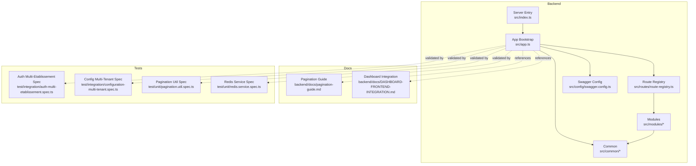
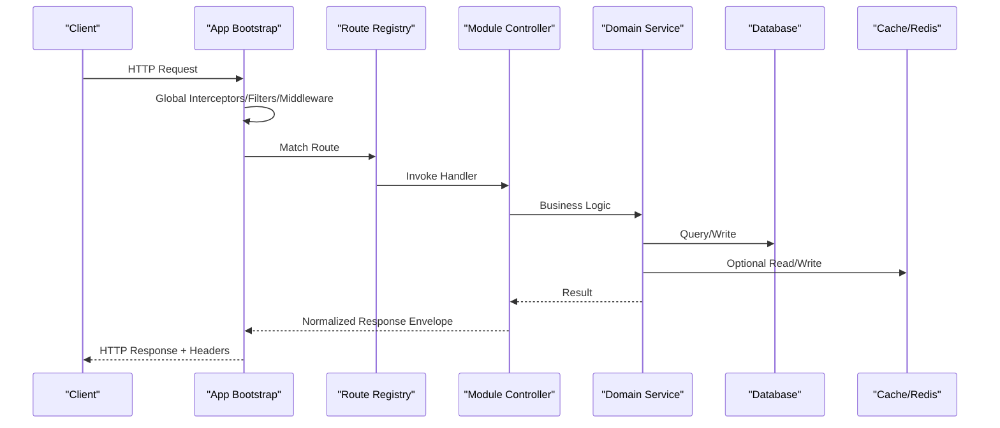
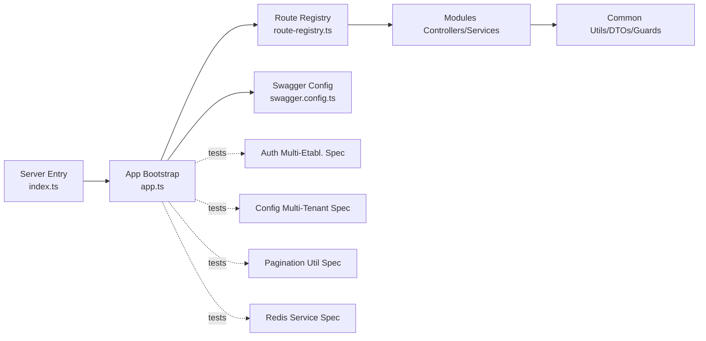

# API Design & Response Standards

<cite>
**Referenced Files in This Document**
- [app.ts](file://backend/src/app.ts)
- [index.ts](file://backend/src/index.ts)
- [swagger.config.ts](file://backend/src/config/swagger.config.ts)
- [route-registry.ts](file://backend/src/routes/route-registry.ts)
- [pagination-guide.md](file://backend/docs/pagination-guide.md)
- [DASHBOARD-FRONTEND-INTEGRATION.md](file://backend/docs/DASHBOARD-FRONTEND-INTEGRATION.md)
- [auth-multi-etablissement.spec.ts](file://backend/test/integration/auth-multi-etablissement.spec.ts)
- [configuration-multi-tenant.spec.ts](file://backend/test/integration/configuration-multi-tenant.spec.ts)
- [pagination.util.spec.ts](file://backend/test/unit/pagination.util.spec.ts)
- [redis.service.spec.ts](file://backend/test/unit/redis.service.spec.ts)
</cite>

## Table of Contents
1. [Introduction](#introduction)
2. [Project Structure](#project-structure)
3. [Core Components](#core-components)
4. [Architecture Overview](#architecture-overview)
5. [Detailed Component Analysis](#detailed-component-analysis)
6. [Dependency Analysis](#dependency-analysis)
7. [Performance Considerations](#performance-considerations)
8. [Troubleshooting Guide](#troubleshooting-guide)
9. [Conclusion](#conclusion)
10. [Appendices](#appendices)

## Introduction
This document defines the API design and response standards for eLISAschool’s backend. It establishes RESTful conventions, request/response formats, status codes, error structures, DTO patterns, validation rules, OpenAPI/Swagger documentation standards, versioning strategy, pagination, filtering, sorting, authentication headers, rate limiting responses, and security best practices. The guidance is grounded in the repository’s configuration, routing, tests, and documentation artifacts.

## Project Structure
The backend follows a modular architecture with shared common utilities, module-scoped controllers/services/entities, centralized configuration (including Swagger), and a route registry that wires endpoints. Tests cover integration scenarios (authentication across establishments, multi-tenant configuration) and unit-level behavior (pagination utilities, Redis service).

**Diagram sources**
- [app.ts](file://backend/src/app.ts)
- [index.ts](file://backend/src/index.ts)
- [swagger.config.ts](file://backend/src/config/swagger.config.ts)
- [route-registry.ts](file://backend/src/routes/route-registry.ts)
- [pagination-guide.md](file://backend/docs/pagination-guide.md)
- [DASHBOARD-FRONTEND-INTEGRATION.md](file://backend/docs/DASHBOARD-FRONTEND-INTEGRATION.md)
- [auth-multi-etablissement.spec.ts](file://backend/test/integration/auth-multi-etablissement.spec.ts)
- [configuration-multi-tenant.spec.ts](file://backend/test/integration/configuration-multi-tenant.spec.ts)
- [pagination.util.spec.ts](file://backend/test/unit/pagination.util.spec.ts)
- [redis.service.spec.ts](file://backend/test/unit/redis.service.spec.ts)

**Section sources**
- [index.ts](file://backend/src/index.ts)
- [app.ts](file://backend/src/app.ts)
- [swagger.config.ts](file://backend/src/config/swagger.config.ts)
- [route-registry.ts](file://backend/src/routes/route-registry.ts)
- [pagination-guide.md](file://backend/docs/pagination-guide.md)
- [DASHBOARD-FRONTEND-INTEGRATION.md](file://backend/docs/DASHBOARD-FRONTEND-INTEGRATION.md)
- [auth-multi-etablissement.spec.ts](file://backend/test/integration/auth-multi-etablissement.spec.ts)
- [configuration-multi-tenant.spec.ts](file://backend/test/integration/configuration-multi-tenant.spec.ts)
- [pagination.util.spec.ts](file://backend/test/unit/pagination.util.spec.ts)
- [redis.service.spec.ts](file://backend/test/unit/redis.service.spec.ts)

## Core Components
- Application bootstrap and middleware pipeline: centralizes global interceptors, filters, middlewares, and CORS/security settings.
- Route registry: aggregates module routes and applies consistent path prefixes and guards.
- Swagger/OpenAPI configuration: standardizes schema generation, examples, and metadata for all endpoints.
- Pagination utilities: provide consistent page-based pagination semantics used across modules.
- Authentication and authorization: JWT-based flows with establishment scoping and RBAC guards.

Key responsibilities:
- Enforce uniform request/response envelopes.
- Centralize error handling and validation errors.
- Provide consistent pagination, filtering, and sorting query parameters.
- Generate and serve OpenAPI specs from decorators/types.

**Section sources**
- [app.ts](file://backend/src/app.ts)
- [route-registry.ts](file://backend/src/routes/route-registry.ts)
- [swagger.config.ts](file://backend/src/config/swagger.config.ts)
- [pagination-guide.md](file://backend/docs/pagination-guide.md)
- [auth-multi-etablissement.spec.ts](file://backend/test/integration/auth-multi-etablissement.spec.ts)
- [configuration-multi-tenant.spec.ts](file://backend/test/integration/configuration-multi-tenant.spec.ts)

## Architecture Overview
The API layer sits atop domain modules and shared services. Requests flow through the app bootstrap, which configures global middleware, filters, and interceptors. Routes are registered centrally, ensuring consistent URL schemes and guard application. Responses follow a unified envelope to simplify client parsing and error handling.

**Diagram sources**
- [app.ts](file://backend/src/app.ts)
- [route-registry.ts](file://backend/src/routes/route-registry.ts)

## Detailed Component Analysis

### REST Conventions and Versioning
- Base paths: Use module-scoped base paths under a stable root.
- Resource naming: Plural nouns, kebab-case segments where appropriate.
- Methods:
  - GET: Retrieve resources or lists.
  - POST: Create resources.
  - PUT: Full update.
  - PATCH: Partial update.
  - DELETE: Remove resource.
- Versioning: Prefer URL versioning (e.g., /api/v1/...) for breaking changes; maintain backward compatibility within minor versions.

**Section sources**
- [route-registry.ts](file://backend/src/routes/route-registry.ts)

### Request and Response Formats
- Content-Type: application/json for requests and responses.
- Accept-Language: Supported for localized messages when applicable.
- Response envelope:
  - data: payload object or array
  - meta: pagination and metadata
  - errors: null on success, list on failure
- Error envelope:
  - code: machine-readable error code
  - message: human-readable message
  - details: optional structured details
  - traceId: correlation identifier

**Section sources**
- [app.ts](file://backend/src/app.ts)

### Status Codes
- 200 OK: Successful GET/PATCH/PUT operations returning data.
- 201 Created: Successful POST creating a resource.
- 204 No Content: Successful DELETE without body.
- 400 Bad Request: Validation or malformed input.
- 401 Unauthorized: Missing or invalid credentials.
- 403 Forbidden: Insufficient permissions.
- 404 Not Found: Resource not found.
- 409 Conflict: Duplicate or state conflict.
- 422 Unprocessable Entity: Semantic validation failures.
- 429 Too Many Requests: Rate limit exceeded.
- 500 Internal Server Error: Unexpected server-side error.

**Section sources**
- [app.ts](file://backend/src/app.ts)

### DTO Patterns and Validation Rules
- Use explicit DTOs per endpoint for inputs and outputs.
- Apply class-validator decorators to enforce constraints (required fields, formats, ranges).
- Map DTOs to entities in services; never expose internal entities directly.
- Return normalized output DTOs to ensure stability across versions.

Validation guidelines:
- Required fields must be present and non-empty unless explicitly nullable.
- Strings should be trimmed and sanitized.
- Numeric fields must be within defined bounds.
- Enumerations must match declared values.

**Section sources**
- [app.ts](file://backend/src/app.ts)

### OpenAPI/Swagger Documentation Standards
- Enable OpenAPI metadata via decorators on controllers and DTOs.
- Provide summary, description, and examples for each endpoint.
- Define schemas for all request bodies and responses.
- Include security schemes and required scopes/roles.
- Serve spec at a dedicated path and link from API index.

**Section sources**
- [swagger.config.ts](file://backend/src/config/swagger.config.ts)

### Authentication and Authorization
- Header: Authorization: Bearer <JWT>.
- Establishment context: Establishments are scoped per request using tenant-aware guards.
- Roles/Permissions: RBAC guards enforce fine-grained access control.
- Session persistence: Login attempts and lockouts may be persisted for security.

Security notes:
- Validate token signature and expiration.
- Reject tokens from unauthorized origins.
- Enforce minimum TLS and secure cookies where applicable.

**Section sources**
- [auth-multi-etablissement.spec.ts](file://backend/test/integration/auth-multi-etablissement.spec.ts)
- [configuration-multi-tenant.spec.ts](file://backend/test/integration/configuration-multi-tenant.spec.ts)

### Pagination, Filtering, and Sorting
- Page-based pagination:
  - page: integer >= 1
  - pageSize: integer > 0
  - totalItems: number
  - totalPages: number
- Sorting:
  - sortBy: field name
  - sortOrder: asc | desc
- Filtering:
  - Use query parameters with clear names (e.g., status, search, dateFrom, dateTo).
  - Support comma-separated lists for multi-value filters.
- Consistency:
  - All list endpoints return { data, meta } with pagination metadata.

Reference implementation and guidance:
- See pagination guide and unit tests for utility behavior.

**Section sources**
- [pagination-guide.md](file://backend/docs/pagination-guide.md)
- [pagination.util.spec.ts](file://backend/test/unit/pagination.util.spec.ts)

### Rate Limiting and Throttling
- Global throttler configured at the application level.
- Standard rate limit response includes:
  - Retry-After header (seconds)
  - X-RateLimit-Limit, X-RateLimit-Remaining, X-RateLimit-Reset
  - JSON error with code RATE_LIMIT_EXCEEDED

Behavior:
- Returns 429 when limits are exceeded.
- Clients should respect Retry-After and backoff strategies.

**Section sources**
- [redis.service.spec.ts](file://backend/test/unit/redis.service.spec.ts)
- [app.ts](file://backend/src/app.ts)

### Security Best Practices
- Enforce HTTPS in production.
- Set strict CORS policies with allowed origins and methods.
- Use helmet-like headers for security (HSTS, XSS protection, etc.).
- Sanitize inputs and validate outputs.
- Avoid leaking stack traces in production responses.
- Rotate secrets and use environment-based configuration.

**Section sources**
- [app.ts](file://backend/src/app.ts)

### Dashboard and Frontend Integration Notes
- Follow documented integration patterns for dashboard widgets and metrics.
- Ensure consistent envelope usage for chart data and counters.
- Respect pagination and caching headers for performance.

**Section sources**
- [DASHBOARD-FRONTEND-INTEGRATION.md](file://backend/docs/DASHBOARD-FRONTEND-INTEGRATION.md)

## Dependency Analysis
High-level dependencies between core components:

**Diagram sources**
- [index.ts](file://backend/src/index.ts)
- [app.ts](file://backend/src/app.ts)
- [swagger.config.ts](file://backend/src/config/swagger.config.ts)
- [route-registry.ts](file://backend/src/routes/route-registry.ts)
- [auth-multi-etablissement.spec.ts](file://backend/test/integration/auth-multi-etablissement.spec.ts)
- [configuration-multi-tenant.spec.ts](file://backend/test/integration/configuration-multi-tenant.spec.ts)
- [pagination.util.spec.ts](file://backend/test/unit/pagination.util.spec.ts)
- [redis.service.spec.ts](file://backend/test/unit/redis.service.spec.ts)

**Section sources**
- [index.ts](file://backend/src/index.ts)
- [app.ts](file://backend/src/app.ts)
- [swagger.config.ts](file://backend/src/config/swagger.config.ts)
- [route-registry.ts](file://backend/src/routes/route-registry.ts)
- [auth-multi-etablissement.spec.ts](file://backend/test/integration/auth-multi-etablissement.spec.ts)
- [configuration-multi-tenant.spec.ts](file://backend/test/integration/configuration-multi-tenant.spec.ts)
- [pagination.util.spec.ts](file://backend/test/unit/pagination.util.spec.ts)
- [redis.service.spec.ts](file://backend/test/unit/redis.service.spec.ts)

## Performance Considerations
- Use pagination for all list endpoints to avoid large payloads.
- Leverage database indexes and query optimization.
- Cache read-heavy data with Redis where appropriate.
- Apply compression for JSON responses.
- Monitor slow queries and add timeouts for external calls.

[No sources needed since this section provides general guidance]

## Troubleshooting Guide
Common issues and resolutions:
- 401 Unauthorized:
  - Verify Authorization header format and token validity.
  - Check establishment context and role assignments.
- 403 Forbidden:
  - Confirm user has required permissions for the target resource.
- 429 Too Many Requests:
  - Implement exponential backoff and honor Retry-After.
- Validation Errors:
  - Inspect errors.details for field-specific messages.
  - Ensure DTOs match expected shapes and constraints.

Operational checks:
- Review global filters and interceptors for unexpected transformations.
- Validate OpenAPI spec consistency with actual endpoints.
- Use correlation IDs (traceId) to trace requests across logs.

**Section sources**
- [app.ts](file://backend/src/app.ts)
- [auth-multi-etablissement.spec.ts](file://backend/test/integration/auth-multi-etablissement.spec.ts)
- [configuration-multi-tenant.spec.ts](file://backend/test/integration/configuration-multi-tenant.spec.ts)

## Conclusion
These standards unify how eLISAschool exposes its capabilities via APIs. By enforcing consistent envelopes, robust validation, comprehensive OpenAPI docs, and strong security posture, clients can integrate reliably and securely. Adhering to pagination, filtering, and sorting conventions ensures scalability and predictable performance.

[No sources needed since this section summarizes without analyzing specific files]

## Appendices

### API Versioning Strategy
- Major versions change the base path (/api/v1/, /api/v2/...).
- Minor versions add features without breaking changes.
- Deprecation notices are provided via headers and OpenAPI metadata.

**Section sources**
- [route-registry.ts](file://backend/src/routes/route-registry.ts)

### Example Request/Response Envelopes
- Success:
  - { data, meta, errors: null }
- Error:
  - { data: null, meta: null, errors: [{ code, message, details }] }

**Section sources**
- [app.ts](file://backend/src/app.ts)

### OpenAPI Generation Checklist
- Decorate controllers and DTOs with metadata.
- Provide examples and descriptions.
- Define security schemes and requirements.
- Publish spec and UI.

**Section sources**
- [swagger.config.ts](file://backend/src/config/swagger.config.ts)