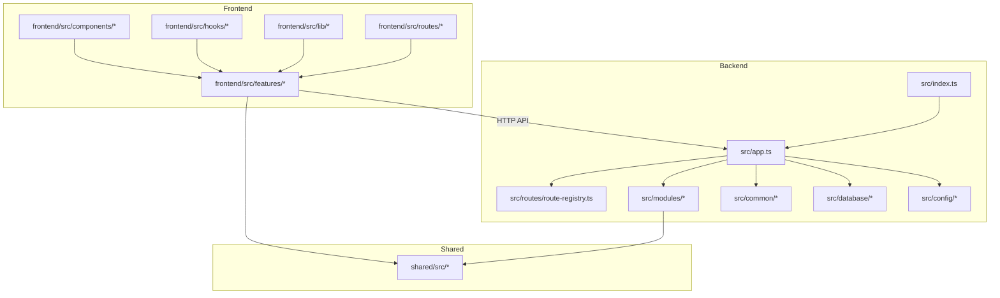
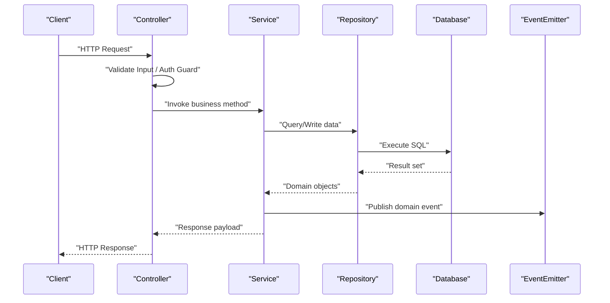
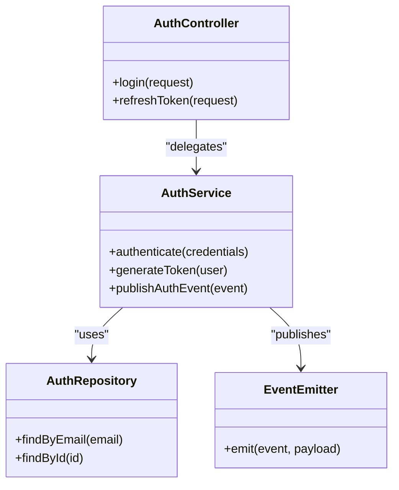
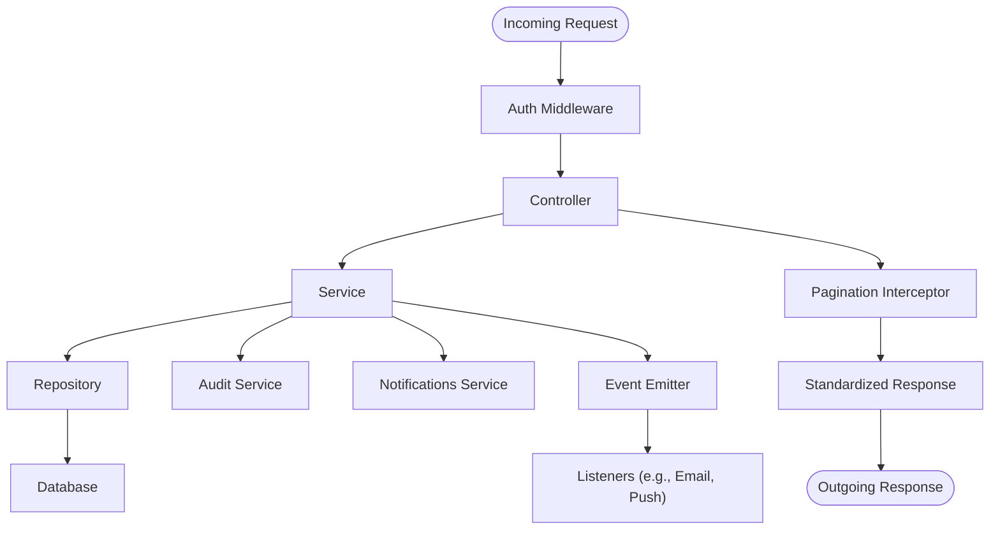
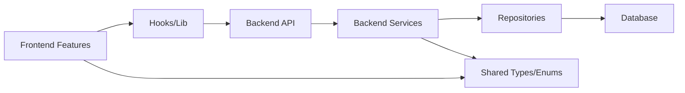
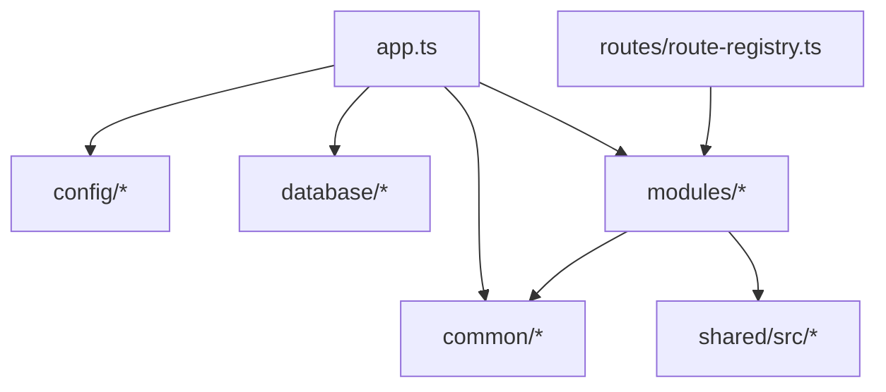

# Architectural Patterns & Structure

<cite>
**Referenced Files in This Document**
- [app.ts](file://backend/src/app.ts)
- [index.ts](file://backend/src/index.ts)
- [route-registry.ts](file://backend/src/routes/route-registry.ts)
- [data-source.ts](file://backend/src/database/data-source.ts)
- [database.config.ts](file://backend/src/config/database.config.ts)
- [env.config.ts](file://backend/src/config/env.config.ts)
- [index.ts](file://backend/src/modules/index.ts)
- [auth.controller.ts](file://backend/src/modules/auth/controllers/auth.controller.ts)
- [auth.service.ts](file://backend/src/modules/auth/services/auth.service.ts)
- [auth.repository.ts](file://backend/src/modules/auth/repositories/auth.repository.ts)
- [auth.middleware.ts](file://backend/src/common/middlewares/auth.middleware.ts)
- [pagination.interceptor.ts](file://backend/src/common/interceptors/pagination.interceptor.ts)
- [error.filter.ts](file://backend/src/common/filters/error.filter.ts)
- [audit.service.ts](file://backend/src/modules/audit/services/audit.service.ts)
- [notifications.service.ts](file://backend/src/modules/notifications/services/notifications.service.ts)
- [event.emitter.ts](file://backend/src/common/utils/event.emitter.ts)
- [swagger.config.ts](file://backend/src/config/swagger.config.ts)
- [package.json](file://backend/package.json)
</cite>

## Table of Contents
1. [Introduction](#introduction)
2. [Project Structure](#project-structure)
3. [Core Components](#core-components)
4. [Architecture Overview](#architecture-overview)
5. [Detailed Component Analysis](#detailed-component-analysis)
6. [Dependency Analysis](#dependency-analysis)
7. [Performance Considerations](#performance-considerations)
8. [Troubleshooting Guide](#troubleshooting-guide)
9. [Conclusion](#conclusion)
10. [Appendices](#appendices)

## Introduction
This document explains the architectural patterns used across eLISAschool, focusing on modular backend design, controller-service-repository separation, dependency injection, cross-cutting concerns, and event-driven interactions. It also outlines how backend modules, frontend features, and shared utilities are separated and provides guidelines for creating new modules consistently.

## Project Structure
The repository is organized into clear layers:
- Backend (NestJS-based):
  - src/app.ts: application bootstrap and global configuration
  - src/index.ts: server entry point
  - src/config: environment and database configuration
  - src/database: TypeORM data source and migrations/seeds
  - src/common: cross-cutting utilities (middleware, interceptors, filters, services, utils)
  - src/modules: feature modules following controller-service-repository pattern
  - src/routes: route registry to wire controllers
- Frontend (React + TanStack Router):
  - src/features: feature-based UI modules
  - src/components: shared UI components
  - src/hooks: reusable hooks
  - src/lib: shared libraries
  - src/routes: route definitions
- Shared:
  - shared/src: types, enums, constants, validators reused by both frontend and backend

**Diagram sources**
- [app.ts](file://backend/src/app.ts)
- [index.ts](file://backend/src/index.ts)
- [route-registry.ts](file://backend/src/routes/route-registry.ts)
- [data-source.ts](file://backend/src/database/data-source.ts)
- [database.config.ts](file://backend/src/config/database.config.ts)
- [env.config.ts](file://backend/src/config/env.config.ts)
- [index.ts](file://backend/src/modules/index.ts)

**Section sources**
- [app.ts](file://backend/src/app.ts)
- [index.ts](file://backend/src/index.ts)
- [route-registry.ts](file://backend/src/routes/route-registry.ts)
- [data-source.ts](file://backend/src/database/data-source.ts)
- [database.config.ts](file://backend/src/config/database.config.ts)
- [env.config.ts](file://backend/src/config/env.config.ts)
- [index.ts](file://backend/src/modules/index.ts)

## Core Components
- Application bootstrap and global wiring:
  - Entry points initialize the NestJS app, register middleware, interceptors, filters, and Swagger.
  - Route registry centralizes module/controller registration.
- Configuration:
  - Environment variables and database connection settings are centralized and validated at startup.
- Cross-cutting concerns:
  - Authentication middleware enforces security policies.
  - Pagination interceptor standardizes list responses.
  - Global error filter normalizes error payloads.
- Module organization:
  - Each feature module encapsulates its own controllers, services, repositories, DTOs, guards, and tests.

Key responsibilities:
- Controllers: HTTP request/response handling, input validation, authorization checks via guards.
- Services: business logic orchestration, transaction boundaries, event publishing.
- Repositories: data access abstraction over TypeORM entities.

**Section sources**
- [app.ts](file://backend/src/app.ts)
- [index.ts](file://backend/src/index.ts)
- [route-registry.ts](file://backend/src/routes/route-registry.ts)
- [auth.middleware.ts](file://backend/src/common/middlewares/auth.middleware.ts)
- [pagination.interceptor.ts](file://backend/src/common/interceptors/pagination.interceptor.ts)
- [error.filter.ts](file://backend/src/common/filters/error.filter.ts)

## Architecture Overview
The system follows a layered architecture with clear separation of concerns:
- Presentation layer: Controllers handle HTTP requests and delegate to services.
- Business layer: Services implement domain logic, coordinate repositories, and publish events.
- Data access layer: Repositories abstract TypeORM queries and enforce multi-tenant scoping where applicable.
- Cross-cutting: Middleware, interceptors, filters, and decorators provide consistent behavior across modules.

**Diagram sources**
- [auth.controller.ts](file://backend/src/modules/auth/controllers/auth.controller.ts)
- [auth.service.ts](file://backend/src/modules/auth/services/auth.service.ts)
- [auth.repository.ts](file://backend/src/modules/auth/repositories/auth.repository.ts)
- [event.emitter.ts](file://backend/src/common/utils/event.emitter.ts)

## Detailed Component Analysis

### Modular Architecture Pattern
- Feature modules are self-contained under src/modules/<feature>.
- Each module includes:
  - controllers: REST endpoints
  - services: business logic
  - repositories: data access
  - dto: request/response models
  - guards/decorators: authorization and policy enforcement
  - tests: unit/integration coverage
- Modules index file aggregates exports for DI and route registration.

Guidelines for new modules:
- Create a folder under src/modules/<feature> with controllers, services, repositories, dto, and tests.
- Implement service methods that encapsulate business rules; avoid direct DB calls from controllers.
- Use repositories for all persistence operations; keep them focused on data access.
- Register routes via the route registry or module provider.
- Add relevant permissions and audit hooks in services.

**Section sources**
- [index.ts](file://backend/src/modules/index.ts)

### Controller-Service-Repository Pattern
- Controllers:
  - Parse and validate inputs, call services, return standardized responses.
- Services:
  - Orchestrate workflows, manage transactions, emit events, and compose multiple repositories.
- Repositories:
  - Encapsulate TypeORM queries, enforce tenant scoping, and expose domain-friendly APIs.

Example flow (authentication):
- Controller receives login request.
- Service validates credentials, interacts with auth repository.
- Repository queries users table and returns user entity.
- Service publishes authentication events and returns token.

**Diagram sources**
- [auth.controller.ts](file://backend/src/modules/auth/controllers/auth.controller.ts)
- [auth.service.ts](file://backend/src/modules/auth/services/auth.service.ts)
- [auth.repository.ts](file://backend/src/modules/auth/repositories/auth.repository.ts)
- [event.emitter.ts](file://backend/src/common/utils/event.emitter.ts)

**Section sources**
- [auth.controller.ts](file://backend/src/modules/auth/controllers/auth.controller.ts)
- [auth.service.ts](file://backend/src/modules/auth/services/auth.service.ts)
- [auth.repository.ts](file://backend/src/modules/auth/repositories/auth.repository.ts)

### Dependency Injection Usage
- NestJS DI container wires controllers, services, and repositories via providers.
- Services depend on repositories through constructor injection.
- Cross-cutting services (e.g., audit, notifications) are injected into business services.
- Configuration values are provided via env config and database config providers.

Best practices:
- Prefer constructor injection for clarity and testability.
- Keep services stateless where possible; use repositories for side effects.
- Use module providers to scope dependencies per feature.

**Section sources**
- [env.config.ts](file://backend/src/config/env.config.ts)
- [database.config.ts](file://backend/src/config/database.config.ts)
- [data-source.ts](file://backend/src/database/data-source.ts)

### Cross-Cutting Concerns Handling
- Authentication middleware:
  - Validates tokens, attaches user context, enforces multi-tenant isolation.
- Interceptors:
  - Standardize pagination responses and transform outputs uniformly.
- Filters:
  - Centralized error mapping and logging for consistent client feedback.
- Audit service:
  - Logs critical actions triggered by services.
- Notifications service:
  - Emits notifications based on domain events.

**Diagram sources**
- [auth.middleware.ts](file://backend/src/common/middlewares/auth.middleware.ts)
- [pagination.interceptor.ts](file://backend/src/common/interceptors/pagination.interceptor.ts)
- [error.filter.ts](file://backend/src/common/filters/error.filter.ts)
- [audit.service.ts](file://backend/src/modules/audit/services/audit.service.ts)
- [notifications.service.ts](file://backend/src/modules/notifications/services/notifications.service.ts)
- [event.emitter.ts](file://backend/src/common/utils/event.emitter.ts)

**Section sources**
- [auth.middleware.ts](file://backend/src/common/middlewares/auth.middleware.ts)
- [pagination.interceptor.ts](file://backend/src/common/interceptors/pagination.interceptor.ts)
- [error.filter.ts](file://backend/src/common/filters/error.filter.ts)
- [audit.service.ts](file://backend/src/modules/audit/services/audit.service.ts)
- [notifications.service.ts](file://backend/src/modules/notifications/services/notifications.service.ts)
- [event.emitter.ts](file://backend/src/common/utils/event.emitter.ts)

### Event-Driven Patterns
- Services publish domain events using an event emitter utility.
- Listeners react to events to trigger notifications, analytics, or external integrations.
- Decouples core business flows from side effects.

Guidelines:
- Define clear event names and payloads.
- Ensure idempotent listeners to handle retries safely.
- Avoid heavy processing in listeners; offload to background jobs if needed.

**Section sources**
- [event.emitter.ts](file://backend/src/common/utils/event.emitter.ts)
- [notifications.service.ts](file://backend/src/modules/notifications/services/notifications.service.ts)

### Middleware Usage
- Authentication middleware runs early in the pipeline to secure routes.
- Additional middlewares can be added for logging, rate limiting, or CORS.
- Middleware should not contain business logic; it prepares context for downstream handlers.

**Section sources**
- [auth.middleware.ts](file://backend/src/common/middlewares/auth.middleware.ts)

### Service Layer Design Principles
- Single Responsibility: each service focuses on one bounded context.
- Transaction Boundaries: wrap related writes in transactions within services.
- No Direct DB Access from Controllers: enforce repository usage.
- Consistent Error Handling: throw typed exceptions handled by global filter.
- Testability: inject mocks for repositories and external services.

**Section sources**
- [auth.service.ts](file://backend/src/modules/auth/services/auth.service.ts)
- [auth.repository.ts](file://backend/src/modules/auth/repositories/auth.repository.ts)

### Separation of Concerns: Backend, Frontend, Shared
- Backend:
  - Implements business logic, persistence, and API contracts.
- Frontend:
  - Organized by features; consumes backend APIs via hooks and lib utilities.
- Shared:
  - Types, enums, constants, and validators ensure consistency across layers.

[No sources needed since this diagram shows conceptual workflow, not actual code structure]

## Dependency Analysis
High-level dependencies:
- App depends on configuration and database setup.
- Modules depend on common utilities and shared types.
- Controllers depend on services; services depend on repositories and cross-cutting services.
- Frontend depends on backend APIs and shared types.

**Diagram sources**
- [app.ts](file://backend/src/app.ts)
- [route-registry.ts](file://backend/src/routes/route-registry.ts)
- [index.ts](file://backend/src/modules/index.ts)

**Section sources**
- [app.ts](file://backend/src/app.ts)
- [route-registry.ts](file://backend/src/routes/route-registry.ts)
- [index.ts](file://backend/src/modules/index.ts)

## Performance Considerations
- Database:
  - Use indexes judiciously; review migration scripts for performance tuning.
  - Batch operations where possible; prefer efficient queries in repositories.
- API:
  - Leverage pagination interceptor for large datasets.
  - Cache frequently accessed read-only data at service level when appropriate.
- Events:
  - Offload heavy listeners to background workers to avoid blocking request-response cycles.

[No sources needed since this section provides general guidance]

## Troubleshooting Guide
Common issues and strategies:
- Authentication failures:
  - Verify middleware order and token validation logic.
  - Check multi-tenant scoping and role/permission assignments.
- Pagination anomalies:
  - Ensure interceptor is applied globally and response shape matches expectations.
- Error normalization:
  - Confirm global error filter maps exceptions to consistent payloads.
- Event listener errors:
  - Inspect event payloads and ensure idempotency; add logging around listeners.

**Section sources**
- [auth.middleware.ts](file://backend/src/common/middlewares/auth.middleware.ts)
- [pagination.interceptor.ts](file://backend/src/common/interceptors/pagination.interceptor.ts)
- [error.filter.ts](file://backend/src/common/filters/error.filter.ts)

## Conclusion
eLISAschool employs a robust modular architecture with clear separation of concerns, leveraging controller-service-repository separation, dependency injection, and event-driven patterns. Cross-cutting concerns are centralized via middleware, interceptors, and filters, ensuring consistency and maintainability. Following the provided guidelines will help teams extend the system coherently while preserving quality and performance.

## Appendices

### Guidelines for Creating New Modules
- Folder structure:
  - controllers, services, repositories, dto, guards, tests
- Implementation steps:
  - Define DTOs for input/output validation.
  - Implement repository methods for data access.
  - Build service methods for business logic; publish events as needed.
  - Wire controllers to services and register routes.
  - Add audit and notification hooks where relevant.
  - Write unit and integration tests.

**Section sources**
- [index.ts](file://backend/src/modules/index.ts)

### API Documentation Setup
- Swagger configuration centralizes API metadata and examples.
- Controllers should annotate endpoints for discoverability.

**Section sources**
- [swagger.config.ts](file://backend/src/config/swagger.config.ts)

### Backend Dependencies
- Review package.json for framework and library versions to align development environments.

**Section sources**
- [package.json](file://backend/package.json)