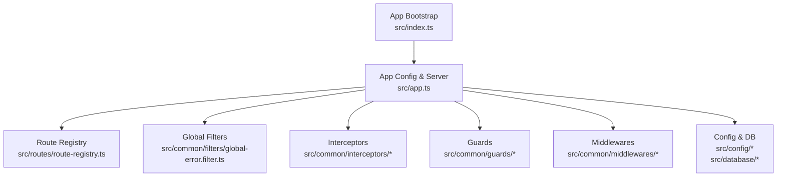
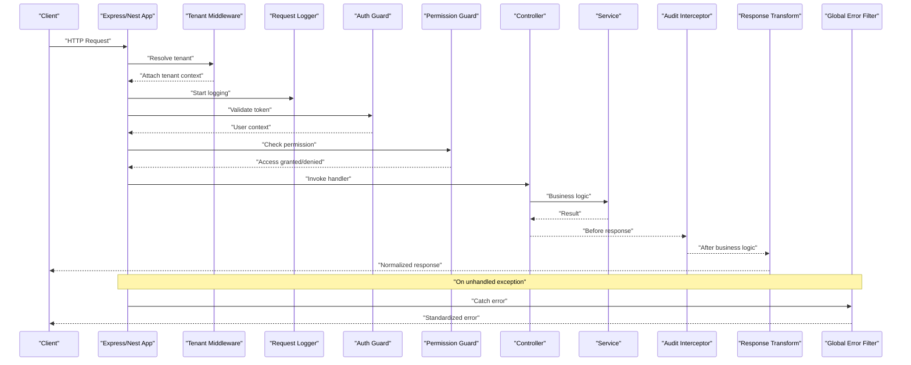
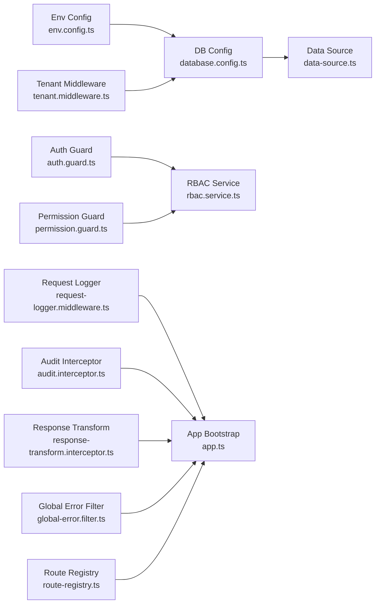

# Cross-Cutting Concerns

<cite>
**Referenced Files in This Document**
- [app.ts](file://backend/src/app.ts)
- [index.ts](file://backend/src/index.ts)
- [route-registry.ts](file://backend/src/routes/route-registry.ts)
- [tenant.middleware.ts](file://backend/src/common/middlewares/tenant.middleware.ts)
- [request-logger.middleware.ts](file://backend/src/common/middlewares/request-logger.middleware.ts)
- [auth.guard.ts](file://backend/src/common/guards/auth.guard.ts)
- [permission.guard.ts](file://backend/src/common/guards/permission.guard.ts)
- [audit.interceptor.ts](file://backend/src/common/interceptors/audit.interceptor.ts)
- [response-transform.interceptor.ts](file://backend/src/common/interceptors/response-transform.interceptor.ts)
- [global-error.filter.ts](file://backend/src/common/filters/global-error.filter.ts)
- [database.config.ts](file://backend/src/config/database.config.ts)
- [env.config.ts](file://backend/src/config/env.config.ts)
- [data-source.ts](file://backend/src/database/data-source.ts)
- [rbac.service.ts](file://backend/src/modules/rbac/services/rbac.service.ts)
- [utilisateurs.controller.ts](file://backend/src/modules/utilisateurs/controllers/utilisateurs.controller.ts)
- [multi-tenant-isolation.test.ts](file://backend/test/multi-tenant-isolation.test.ts)
</cite>

## Table of Contents
1. [Introduction](#introduction)
2. [Project Structure](#project-structure)
3. [Core Components](#core-components)
4. [Architecture Overview](#architecture-overview)
5. [Detailed Component Analysis](#detailed-component-analysis)
6. [Dependency Analysis](#dependency-analysis)
7. [Performance Considerations](#performance-considerations)
8. [Troubleshooting Guide](#troubleshooting-guide)
9. [Conclusion](#conclusion)
10. [Appendices](#appendices)

## Introduction
This document explains how eLISAschool implements cross-cutting concerns across the backend: tenant isolation, request logging, authentication, authorization, audit trails, response transformation, and global error handling. It focuses on middleware, guards, interceptors, and filters, showing how they are wired into the application and how to extend them for new requirements.

## Project Structure
Cross-cutting concerns live under common modules and are registered at application bootstrap. The main entry initializes configuration, database, and HTTP server, then registers routes and cross-cutting components.

**Diagram sources**
- [index.ts](file://backend/src/index.ts)
- [app.ts](file://backend/src/app.ts)
- [route-registry.ts](file://backend/src/routes/route-registry.ts)
- [global-error.filter.ts](file://backend/src/common/filters/global-error.filter.ts)
- [audit.interceptor.ts](file://backend/src/common/interceptors/audit.interceptor.ts)
- [response-transform.interceptor.ts](file://backend/src/common/interceptors/response-transform.interceptor.ts)
- [auth.guard.ts](file://backend/src/common/guards/auth.guard.ts)
- [permission.guard.ts](file://backend/src/common/guards/permission.guard.ts)
- [tenant.middleware.ts](file://backend/src/common/middlewares/tenant.middleware.ts)
- [request-logger.middleware.ts](file://backend/src/common/middlewares/request-logger.middleware.ts)
- [database.config.ts](file://backend/src/config/database.config.ts)
- [env.config.ts](file://backend/src/config/env.config.ts)
- [data-source.ts](file://backend/src/database/data-source.ts)

**Section sources**
- [index.ts](file://backend/src/index.ts)
- [app.ts](file://backend/src/app.ts)
- [route-registry.ts](file://backend/src/routes/route-registry.ts)
- [database.config.ts](file://backend/src/config/database.config.ts)
- [env.config.ts](file://backend/src/config/env.config.ts)
- [data-source.ts](file://backend/src/database/data-source.ts)

## Core Components
- Middleware
  - Tenant isolation: resolves tenant context from request headers or host and attaches it to the request object for downstream processing.
  - Request logging: captures timing, method, path, user identity (if available), and response status for observability.
- Guards
  - Authentication guard: validates tokens and populates authenticated user context.
  - Permission guard: enforces RBAC permissions using a central service.
- Interceptors
  - Audit interceptor: records significant mutations for audit trails.
  - Response transform interceptor: normalizes responses and adds correlation IDs.
- Filters
  - Global error filter: catches unhandled exceptions and returns consistent error payloads.

These components are applied globally or per-route to ensure consistent behavior across modules.

**Section sources**
- [tenant.middleware.ts](file://backend/src/common/middlewares/tenant.middleware.ts)
- [request-logger.middleware.ts](file://backend/src/common/middlewares/request-logger.middleware.ts)
- [auth.guard.ts](file://backend/src/common/guards/auth.guard.ts)
- [permission.guard.ts](file://backend/src/common/guards/permission.guard.ts)
- [audit.interceptor.ts](file://backend/src/common/interceptors/audit.interceptor.ts)
- [response-transform.interceptor.ts](file://backend/src/common/interceptors/response-transform.interceptor.ts)
- [global-error.filter.ts](file://backend/src/common/filters/global-error.filter.ts)

## Architecture Overview
The request lifecycle flows through middlewares first, then guards, controllers, services, and finally interceptors and filters shape the response and errors.

**Diagram sources**
- [app.ts](file://backend/src/app.ts)
- [tenant.middleware.ts](file://backend/src/common/middlewares/tenant.middleware.ts)
- [request-logger.middleware.ts](file://backend/src/common/middlewares/request-logger.middleware.ts)
- [auth.guard.ts](file://backend/src/common/guards/auth.guard.ts)
- [permission.guard.ts](file://backend/src/common/guards/permission.guard.ts)
- [audit.interceptor.ts](file://backend/src/common/interceptors/audit.interceptor.ts)
- [response-transform.interceptor.ts](file://backend/src/common/interceptors/response-transform.interceptor.ts)
- [global-error.filter.ts](file://backend/src/common/filters/global-error.filter.ts)

## Detailed Component Analysis

### Middleware: Tenant Isolation
Purpose:
- Extract tenant identifier from request headers or host.
- Attach tenant context to the request for all downstream operations.
- Ensure data access is scoped to the tenant by default.

Key behaviors:
- Validates presence of tenant context; rejects requests without valid tenant.
- Normalizes tenant ID format and stores it in a well-known location on the request.
- Integrates with database configuration to apply tenant scoping where needed.

Extension points:
- Add header-based tenant resolution strategies.
- Support multi-tenant routing by subdomain or path prefix.

**Section sources**
- [tenant.middleware.ts](file://backend/src/common/middlewares/tenant.middleware.ts)
- [database.config.ts](file://backend/src/config/database.config.ts)
- [env.config.ts](file://backend/src/config/env.config.ts)
- [data-source.ts](file://backend/src/database/data-source.ts)

### Middleware: Request Logging
Purpose:
- Record request metadata and timing for observability.
- Include user identity when available.
- Emit structured logs suitable for aggregation and alerting.

Key behaviors:
- Starts timer on request entry.
- Captures method, path, query parameters (sanitized), headers (filtered), and tenant context.
- Records response status and duration on completion.

Extension points:
- Add sampling for high-volume endpoints.
- Enrich logs with correlation IDs propagated from upstream.

**Section sources**
- [request-logger.middleware.ts](file://backend/src/common/middlewares/request-logger.middleware.ts)

### Guard: Authentication
Purpose:
- Validate bearer tokens and populate user context.
- Reject unauthorized requests early.

Key behaviors:
- Reads token from standard locations (e.g., Authorization header).
- Verifies signature and expiration.
- Attaches user information to the request for downstream use.

Integration:
- Used globally or per-route to protect endpoints.
- Works alongside permission guard for fine-grained access control.

**Section sources**
- [auth.guard.ts](file://backend/src/common/guards/auth.guard.ts)

### Guard: Permission Checking
Purpose:
- Enforce RBAC permissions based on roles and resource actions.
- Centralize policy evaluation via a shared service.

Key behaviors:
- Resolves required permissions from route metadata or decorators.
- Queries RBAC service to determine if current user has sufficient rights.
- Returns standardized forbidden responses when denied.

Integration:
- Applied per controller or method for granular protection.
- Composed with authentication guard to ensure identity is present.

**Section sources**
- [permission.guard.ts](file://backend/src/common/guards/permission.guard.ts)
- [rbac.service.ts](file://backend/src/modules/rbac/services/rbac.service.ts)

### Interceptor: Audit Trail
Purpose:
- Record significant mutations for compliance and traceability.
- Capture who did what, when, and on which tenant.

Key behaviors:
- Detects write operations (create/update/delete) in controllers.
- Persists audit entries with user, tenant, action, entity type, and identifiers.
- Runs asynchronously to avoid impacting response time.

Extension points:
- Mask sensitive fields before persisting audit records.
- Route audit events to external systems.

**Section sources**
- [audit.interceptor.ts](file://backend/src/common/interceptors/audit.interceptor.ts)

### Interceptor: Response Transformation
Purpose:
- Normalize API responses and add operational metadata.
- Inject correlation IDs and timestamps.

Key behaviors:
- Wraps successful responses in a consistent envelope.
- Adds correlation ID derived from request or generated.
- Ensures uniform structure for clients.

Extension points:
- Add versioning headers.
- Integrate metrics collection.

**Section sources**
- [response-transform.interceptor.ts](file://backend/src/common/interceptors/response-transform.interceptor.ts)

### Filter: Global Error Handling
Purpose:
- Catch unhandled exceptions and return consistent error responses.
- Avoid leaking internal details to clients.

Key behaviors:
- Maps known exception types to appropriate HTTP codes.
- Produces a stable error payload with message and optional code.
- Logs full stack traces internally while returning safe messages externally.

Extension points:
- Add domain-specific error codes.
- Integrate with centralized logging and alerting.

**Section sources**
- [global-error.filter.ts](file://backend/src/common/filters/global-error.filter.ts)

### Practical Examples Across Modules
- Protecting user management endpoints:
  - Apply authentication and permission guards to controller methods.
  - Use tenant middleware to scope queries to the current tenant.
  - Leverage audit interceptor to record changes to user profiles.
- Example reference:
  - Controller demonstrating guarded endpoints: [utilisateurs.controller.ts](file://backend/src/modules/utilisateurs/controllers/utilisateurs.controller.ts)

- Validating tenant isolation:
  - Integration test verifying that data access respects tenant boundaries: [multi-tenant-isolation.test.ts](file://backend/test/multi-tenant-isolation.test.ts)

**Section sources**
- [utilisateurs.controller.ts](file://backend/src/modules/utilisateurs/controllers/utilisateurs.controller.ts)
- [multi-tenant-isolation.test.ts](file://backend/test/multi-tenant-isolation.test.ts)

## Dependency Analysis
Cross-cutting components depend on configuration and shared services. The following diagram shows key relationships.

**Diagram sources**
- [env.config.ts](file://backend/src/config/env.config.ts)
- [database.config.ts](file://backend/src/config/database.config.ts)
- [data-source.ts](file://backend/src/database/data-source.ts)
- [auth.guard.ts](file://backend/src/common/guards/auth.guard.ts)
- [permission.guard.ts](file://backend/src/common/guards/permission.guard.ts)
- [rbac.service.ts](file://backend/src/modules/rbac/services/rbac.service.ts)
- [tenant.middleware.ts](file://backend/src/common/middlewares/tenant.middleware.ts)
- [request-logger.middleware.ts](file://backend/src/common/middlewares/request-logger.middleware.ts)
- [audit.interceptor.ts](file://backend/src/common/interceptors/audit.interceptor.ts)
- [response-transform.interceptor.ts](file://backend/src/common/interceptors/response-transform.interceptor.ts)
- [global-error.filter.ts](file://backend/src/common/filters/global-error.filter.ts)
- [app.ts](file://backend/src/app.ts)
- [route-registry.ts](file://backend/src/routes/route-registry.ts)

**Section sources**
- [env.config.ts](file://backend/src/config/env.config.ts)
- [database.config.ts](file://backend/src/config/database.config.ts)
- [data-source.ts](file://backend/src/database/data-source.ts)
- [auth.guard.ts](file://backend/src/common/guards/auth.guard.ts)
- [permission.guard.ts](file://backend/src/common/guards/permission.guard.ts)
- [rbac.service.ts](file://backend/src/modules/rbac/services/rbac.service.ts)
- [tenant.middleware.ts](file://backend/src/common/middlewares/tenant.middleware.ts)
- [request-logger.middleware.ts](file://backend/src/common/middlewares/request-logger.middleware.ts)
- [audit.interceptor.ts](file://backend/src/common/interceptors/audit.interceptor.ts)
- [response-transform.interceptor.ts](file://backend/src/common/interceptors/response-transform.interceptor.ts)
- [global-error.filter.ts](file://backend/src/common/filters/global-error.filter.ts)
- [app.ts](file://backend/src/app.ts)
- [route-registry.ts](file://backend/src/routes/route-registry.ts)

## Performance Considerations
- Keep middleware lightweight; avoid heavy I/O in request path.
- Prefer async audit logging to prevent blocking responses.
- Use correlation IDs to correlate logs across services.
- Sample high-frequency logs in production environments.
- Cache RBAC permission checks where feasible to reduce repeated lookups.

[No sources needed since this section provides general guidance]

## Troubleshooting Guide
Common issues and resolutions:
- Missing tenant context:
  - Ensure client sends required tenant header or uses correct host routing.
  - Verify tenant middleware is registered before route handlers.
- Unauthorized or forbidden responses:
  - Confirm token validity and expiration.
  - Check that required permissions exist for the user’s role.
- Inconsistent error formats:
  - Ensure global error filter is registered and not bypassed.
- High latency on protected endpoints:
  - Profile RBAC service calls and consider caching strategies.
  - Review audit interceptor overhead and adjust persistence strategy.

**Section sources**
- [global-error.filter.ts](file://backend/src/common/filters/global-error.filter.ts)
- [auth.guard.ts](file://backend/src/common/guards/auth.guard.ts)
- [permission.guard.ts](file://backend/src/common/guards/permission.guard.ts)
- [audit.interceptor.ts](file://backend/src/common/interceptors/audit.interceptor.ts)
- [tenant.middleware.ts](file://backend/src/common/middlewares/tenant.middleware.ts)

## Conclusion
eLISAschool applies cross-cutting concerns consistently through middleware, guards, interceptors, and filters. Tenant isolation ensures data separation, authentication and permission guards enforce security, audit and response interceptors provide observability and consistency, and the global error filter standardizes error handling. Extending these patterns allows new concerns to be added cleanly without modifying business logic.

[No sources needed since this section summarizes without analyzing specific files]

## Appendices

### How to Extend Cross-Cutting Concerns
- New middleware:
  - Implement request/response hooks and register it in the app bootstrap.
  - Place near the top of the pipeline for broad impact.
- New guard:
  - Create a guard class that evaluates conditions and throws standardized errors.
  - Apply per-controller or per-method as needed.
- New interceptor:
  - Wrap around controller execution to transform inputs/outputs or collect metrics.
- New filter:
  - Map additional exception types to HTTP responses and log details.

[No sources needed since this section provides general guidance]