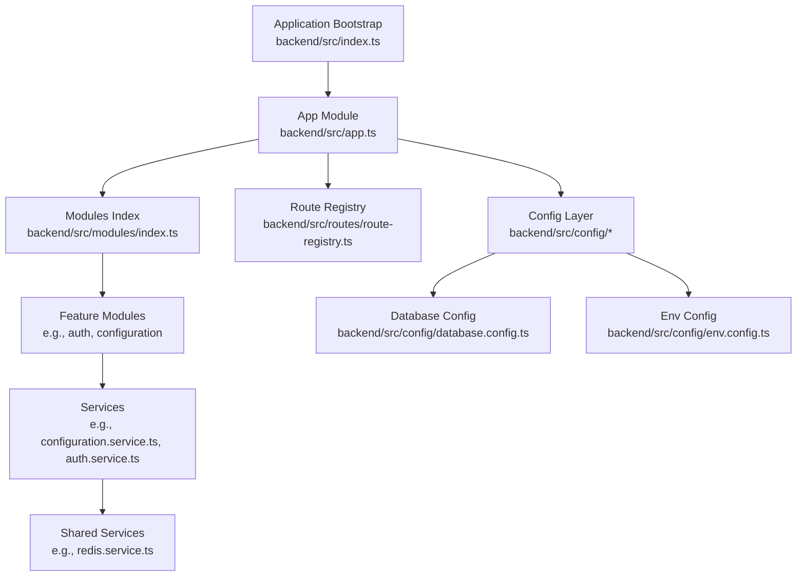
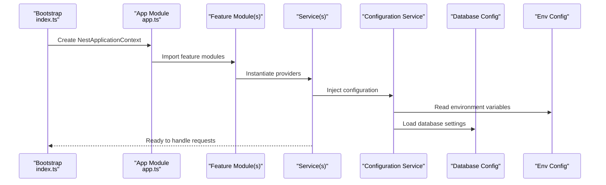
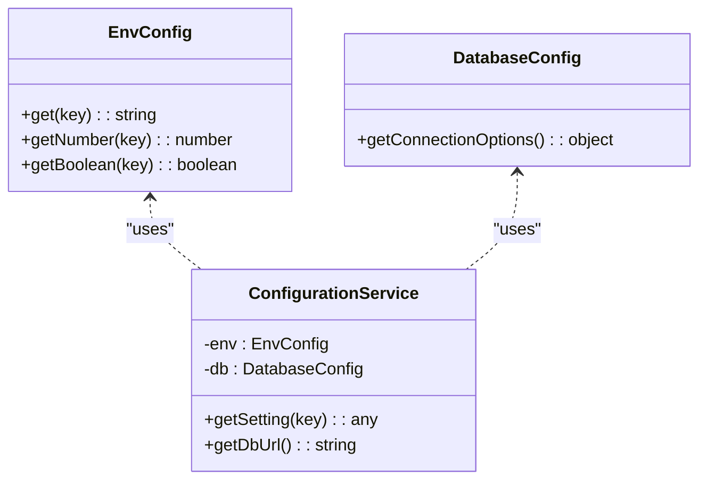
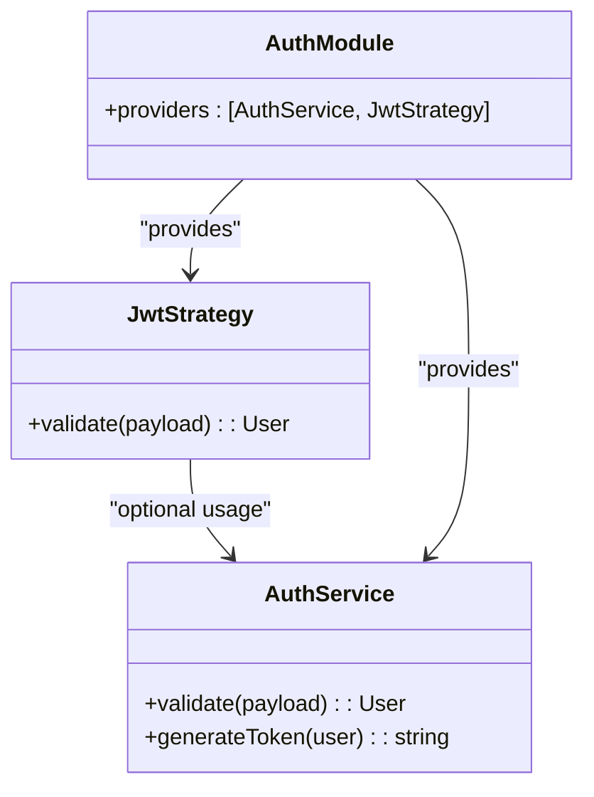
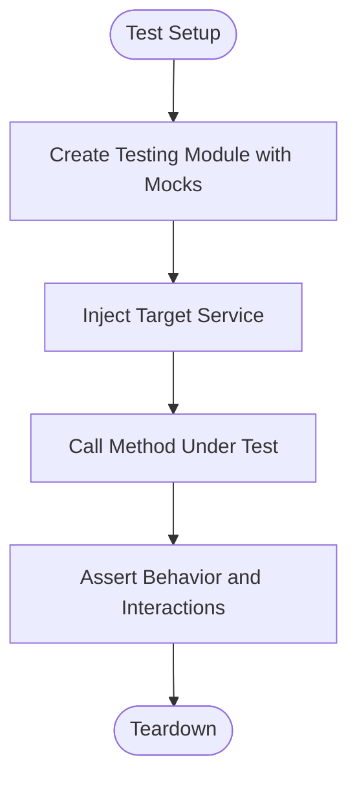
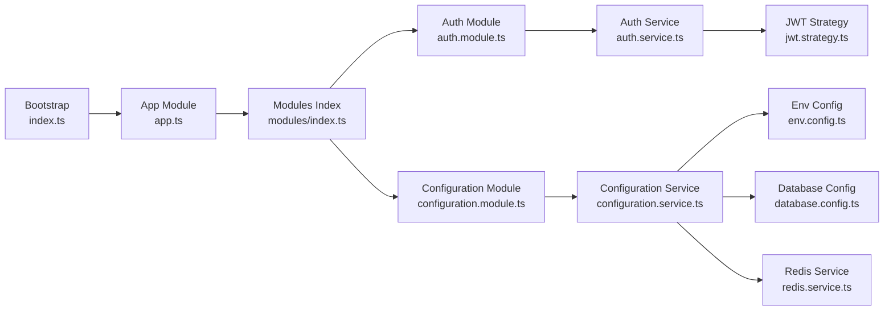

# Dependency Injection & Service Management

<cite>
**Referenced Files in This Document**
- [app.ts](file://backend/src/app.ts)
- [index.ts](file://backend/src/index.ts)
- [database.config.ts](file://backend/src/config/database.config.ts)
- [env.config.ts](file://backend/src/config/env.config.ts)
- [index.ts](file://backend/src/config/index.ts)
- [data-source.ts](file://backend/src/database/data-source.ts)
- [index.ts](file://backend/src/modules/index.ts)
- [route-registry.ts](file://backend/src/routes/route-registry.ts)
- [configuration.module.ts](file://backend/src/modules/configuration/configuration.module.ts)
- [configuration.service.ts](file://backend/src/modules/configuration/configuration.service.ts)
- [auth.module.ts](file://backend/src/modules/auth/auth.module.ts)
- [auth.service.ts](file://backend/src/modules/auth/auth.service.ts)
- [jwt.strategy.ts](file://backend/src/modules/auth/strategies/jwt.strategy.ts)
- [redis.service.ts](file://backend/src/common/services/redis.service.ts)
- [pagination.util.spec.ts](file://backend/test/unit/pagination.util.spec.ts)
- [utilisateurs.service.test.ts](file://backend/test/services/utilisateurs.service.test.ts)
</cite>

## Table of Contents
1. [Introduction](#introduction)
2. [Project Structure](#project-structure)
3. [Core Components](#core-components)
4. [Architecture Overview](#architecture-overview)
5. [Detailed Component Analysis](#detailed-component-analysis)
6. [Dependency Analysis](#dependency-analysis)
7. [Performance Considerations](#performance-considerations)
8. [Troubleshooting Guide](#troubleshooting-guide)
9. [Conclusion](#conclusion)
10. [Appendices](#appendices)

## Introduction
This document explains how dependency injection (DI) is implemented and used across the eLISAschool backend, which is built with NestJS. It covers service registration, provider configuration, module dependencies, creating injectable services, handling circular dependencies, managing lifecycles, custom decorators, factory providers, conditional dependencies, shared configuration, environment-specific settings, and testing strategies with mocked dependencies. The goal is to provide a clear, practical guide for developers working on or extending the application’s DI system.

## Project Structure
The NestJS application bootstraps from a main entry point that configures the application context, loads modules, and wires up global configuration. Modules encapsulate feature domains and declare their own providers and dependencies. Configuration is centralized under a dedicated config directory and consumed by services via typed accessors.

**Diagram sources**
- [index.ts](file://backend/src/index.ts)
- [app.ts](file://backend/src/app.ts)
- [index.ts](file://backend/src/modules/index.ts)
- [route-registry.ts](file://backend/src/routes/route-registry.ts)
- [database.config.ts](file://backend/src/config/database.config.ts)
- [env.config.ts](file://backend/src/config/env.config.ts)
- [configuration.service.ts](file://backend/src/modules/configuration/configuration.service.ts)
- [auth.service.ts](file://backend/src/modules/auth/auth.service.ts)
- [redis.service.ts](file://backend/src/common/services/redis.service.ts)

**Section sources**
- [index.ts](file://backend/src/index.ts)
- [app.ts](file://backend/src/app.ts)
- [index.ts](file://backend/src/modules/index.ts)
- [route-registry.ts](file://backend/src/routes/route-registry.ts)
- [database.config.ts](file://backend/src/config/database.config.ts)
- [env.config.ts](file://backend/src/config/env.config.ts)

## Core Components
- Application bootstrap: Initializes NestFactory, applies global configuration, and starts the HTTP server.
- App module: Declares top-level imports, controllers, and global providers.
- Feature modules: Encapsulate domain logic, register providers, and expose interfaces to other modules.
- Configuration layer: Loads environment variables and database settings; exposes typed accessors to services.
- Shared services: Cross-cutting concerns like Redis client access are provided as singletons.

Key responsibilities:
- Registering providers at module scope (module-scoped vs. application-scoped).
- Injecting dependencies via constructor parameters.
- Centralizing configuration through a typed configuration service.
- Using guards/strategies to integrate authentication into the DI container.

**Section sources**
- [index.ts](file://backend/src/index.ts)
- [app.ts](file://backend/src/app.ts)
- [index.ts](file://backend/src/modules/index.ts)
- [configuration.service.ts](file://backend/src/modules/configuration/configuration.service.ts)
- [auth.service.ts](file://backend/src/modules/auth/auth.service.ts)
- [redis.service.ts](file://backend/src/common/services/redis.service.ts)

## Architecture Overview
At runtime, NestJS constructs an internal dependency graph based on module declarations and provider metadata. Controllers request services via constructor injection; services request other services or configuration values. Global configuration is loaded early and made available to all services that depend on it.

**Diagram sources**
- [index.ts](file://backend/src/index.ts)
- [app.ts](file://backend/src/app.ts)
- [configuration.service.ts](file://backend/src/modules/configuration/configuration.service.ts)
- [env.config.ts](file://backend/src/config/env.config.ts)
- [database.config.ts](file://backend/src/config/database.config.ts)

## Detailed Component Analysis

### Application Bootstrap and App Module
- The bootstrap file creates the Nest application instance, registers global middleware/filters/interceptors if needed, and starts the HTTP server.
- The app module aggregates imports from feature modules and may define global providers or controllers.

Best practices:
- Keep the app module thin; delegate feature-specific registrations to feature modules.
- Use the bootstrap to apply cross-cutting concerns (CORS, Swagger, etc.).

**Section sources**
- [index.ts](file://backend/src/index.ts)
- [app.ts](file://backend/src/app.ts)

### Configuration System
- Environment configuration is loaded from process.env and validated/typed for safe consumption.
- Database configuration is defined separately and consumed by data source setup.
- A configuration service centralizes access to settings and provides getters for environment-specific values.

How services access settings:
- Inject the configuration service into any service or controller.
- Call typed getters to retrieve environment-specific values.

**Diagram sources**
- [env.config.ts](file://backend/src/config/env.config.ts)
- [database.config.ts](file://backend/src/config/database.config.ts)
- [configuration.service.ts](file://backend/src/modules/configuration/configuration.service.ts)

**Section sources**
- [env.config.ts](file://backend/src/config/env.config.ts)
- [database.config.ts](file://backend/src/config/database.config.ts)
- [configuration.service.ts](file://backend/src/modules/configuration/configuration.service.ts)

### Authentication Integration
- Auth module declares guards, strategies, and services required for JWT-based authentication.
- Strategies extend Passport strategies and are registered as providers so they can be injected where needed.
- Auth service coordinates token generation/validation and integrates with user management.

**Diagram sources**
- [auth.module.ts](file://backend/src/modules/auth/auth.module.ts)
- [auth.service.ts](file://backend/src/modules/auth/auth.service.ts)
- [jwt.strategy.ts](file://backend/src/modules/auth/strategies/jwt.strategy.ts)

**Section sources**
- [auth.module.ts](file://backend/src/modules/auth/auth.module.ts)
- [auth.service.ts](file://backend/src/modules/auth/auth.service.ts)
- [jwt.strategy.ts](file://backend/src/modules/auth/strategies/jwt.strategy.ts)

### Shared Services (Redis Example)
- A shared Redis service is typically provided at the application level to ensure a single connection across the app.
- Other modules import the module that exports this service to use it in their own services.

Lifecycle considerations:
- Ensure proper initialization and graceful shutdown of connections.
- Handle reconnection and error propagation consistently.

**Section sources**
- [redis.service.ts](file://backend/src/common/services/redis.service.ts)

### Route Registration
- A route registry centralizes dynamic route discovery and controller registration, simplifying module composition.
- It can be invoked during bootstrap to auto-register controllers discovered in specific directories.

**Section sources**
- [route-registry.ts](file://backend/src/routes/route-registry.ts)

### Creating Injectable Services
- Decorate classes with the appropriate decorator to make them providers.
- Declare them in a module’s providers array or export them for reuse across modules.
- Inject dependencies via constructor parameters; Nest resolves them automatically.

Guidelines:
- Prefer constructor injection over property injection for clarity and testability.
- Keep services focused on a single responsibility.

**Section sources**
- [configuration.service.ts](file://backend/src/modules/configuration/configuration.service.ts)
- [auth.service.ts](file://backend/src/modules/auth/auth.service.ts)

### Handling Circular Dependencies
Common patterns:
- Use forwardRef when two modules must reference each other.
- Extract shared logic into a third module to break cycles.
- Use interface-based contracts to decouple implementations.

When to apply:
- Only when unavoidable; refactor first to reduce coupling.

**Section sources**
- [auth.module.ts](file://backend/src/modules/auth/auth.module.ts)
- [configuration.module.ts](file://backend/src/modules/configuration/configuration.module.ts)

### Managing Service Lifecycles
- OnModuleInit and OnApplicationShutdown hooks allow startup and teardown logic.
- Use these to initialize caches, open connections, or perform cleanup.

Recommendations:
- Avoid heavy work in constructors; defer to lifecycle hooks.
- Log errors during lifecycle events to aid diagnostics.

**Section sources**
- [configuration.service.ts](file://backend/src/modules/configuration/configuration.service.ts)

### Custom Decorators
- Create reusable decorators to attach metadata or enforce behavior (e.g., permission checks).
- Combine with guards to implement authorization policies.

Usage pattern:
- Define a decorator factory that returns metadata.
- Consume metadata in a guard or interceptor.

**Section sources**
- [auth.service.ts](file://backend/src/modules/auth/auth.service.ts)

### Factory Providers and Conditional Dependencies
- Use factory providers to create instances conditionally based on environment or configuration.
- Return different implementations depending on flags or external state.

Typical scenarios:
- Switch between in-memory and persistent caches.
- Provide different clients for dev vs. prod environments.

**Section sources**
- [configuration.service.ts](file://backend/src/modules/configuration/configuration.service.ts)
- [env.config.ts](file://backend/src/config/env.config.ts)

### Testing Services with Mocked Dependencies
- For unit tests, replace real dependencies with mocks using Jest.
- For integration tests, spin up a partial NestTestingModule with only the necessary providers.

Examples in repository:
- Unit test for pagination utilities demonstrates mocking helpers.
- Service-level tests show how to mock dependent services.

**Diagram sources**
- [pagination.util.spec.ts](file://backend/test/unit/pagination.util.spec.ts)
- [utilisateurs.service.test.ts](file://backend/test/services/utilisateurs.service.test.ts)

**Section sources**
- [pagination.util.spec.ts](file://backend/test/unit/pagination.util.spec.ts)
- [utilisateurs.service.test.ts](file://backend/test/services/utilisateurs.service.test.ts)

## Dependency Analysis
The following diagram shows key relationships among core components involved in DI and configuration.

**Diagram sources**
- [index.ts](file://backend/src/index.ts)
- [app.ts](file://backend/src/app.ts)
- [index.ts](file://backend/src/modules/index.ts)
- [auth.module.ts](file://backend/src/modules/auth/auth.module.ts)
- [configuration.module.ts](file://backend/src/modules/configuration/configuration.module.ts)
- [auth.service.ts](file://backend/src/modules/auth/auth.service.ts)
- [configuration.service.ts](file://backend/src/modules/configuration/configuration.service.ts)
- [env.config.ts](file://backend/src/config/env.config.ts)
- [database.config.ts](file://backend/src/config/database.config.ts)
- [jwt.strategy.ts](file://backend/src/modules/auth/strategies/jwt.strategy.ts)
- [redis.service.ts](file://backend/src/common/services/redis.service.ts)

**Section sources**
- [index.ts](file://backend/src/index.ts)
- [app.ts](file://backend/src/app.ts)
- [index.ts](file://backend/src/modules/index.ts)
- [auth.module.ts](file://backend/src/modules/auth/auth.module.ts)
- [configuration.module.ts](file://backend/src/modules/configuration/configuration.module.ts)
- [auth.service.ts](file://backend/src/modules/auth/auth.service.ts)
- [configuration.service.ts](file://backend/src/modules/configuration/configuration.service.ts)
- [env.config.ts](file://backend/src/config/env.config.ts)
- [database.config.ts](file://backend/src/config/database.config.ts)
- [jwt.strategy.ts](file://backend/src/modules/auth/strategies/jwt.strategy.ts)
- [redis.service.ts](file://backend/src/common/services/redis.service.ts)

## Performance Considerations
- Prefer singleton providers for expensive-to-initialize resources (e.g., database connections, cache clients).
- Defer heavy initialization to lifecycle hooks to avoid slowing down application startup.
- Use lazy loading for large feature modules when appropriate to reduce initial memory footprint.
- Monitor and profile dependency graphs to identify unnecessary transitive dependencies.

[No sources needed since this section provides general guidance]

## Troubleshooting Guide
Common issues and resolutions:
- Circular dependency errors: Refactor into separate modules or use forwardRef judiciously.
- Missing provider errors: Ensure the provider is declared in the importing module’s imports or exported from a shared module.
- Configuration not found: Verify environment variables are set and accessible via the configuration service.
- Lifecycle hook failures: Add robust logging around OnModuleInit and OnApplicationShutdown to capture errors.

**Section sources**
- [configuration.service.ts](file://backend/src/modules/configuration/configuration.service.ts)
- [auth.service.ts](file://backend/src/modules/auth/auth.service.ts)

## Conclusion
The eLISAschool backend leverages NestJS’s DI system to compose modular, testable, and maintainable services. By centralizing configuration, carefully structuring modules, and applying best practices for lifecycle and testing, the codebase remains scalable and resilient. Follow the guidelines above to introduce new features cleanly and keep the dependency graph coherent.

[No sources needed since this section summarizes without analyzing specific files]

## Appendices

### Quick Reference: Provider Patterns
- Class provider: Standard service class with constructor injection.
- Factory provider: Dynamic creation based on environment or configuration.
- Value provider: Simple constant or object exposed as a provider.
- Existing provider: Alias an existing provider with a different token.

[No sources needed since this section provides general guidance]