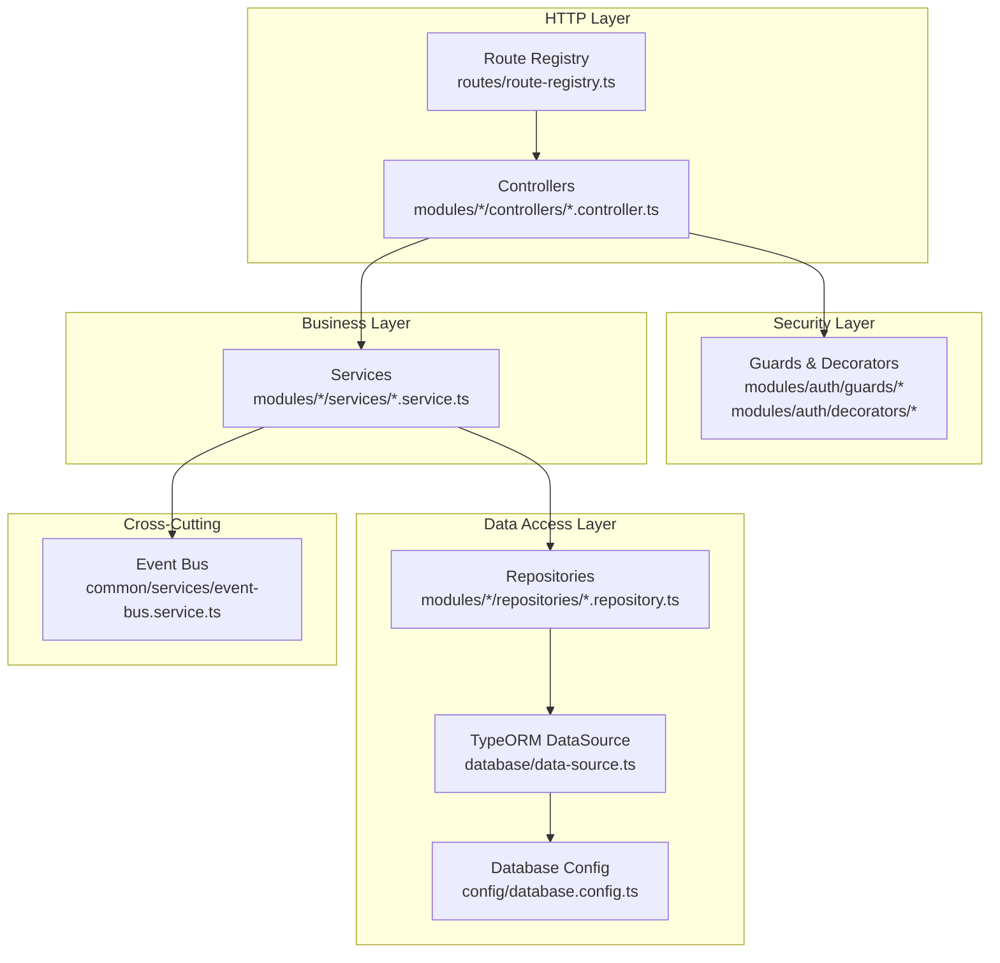
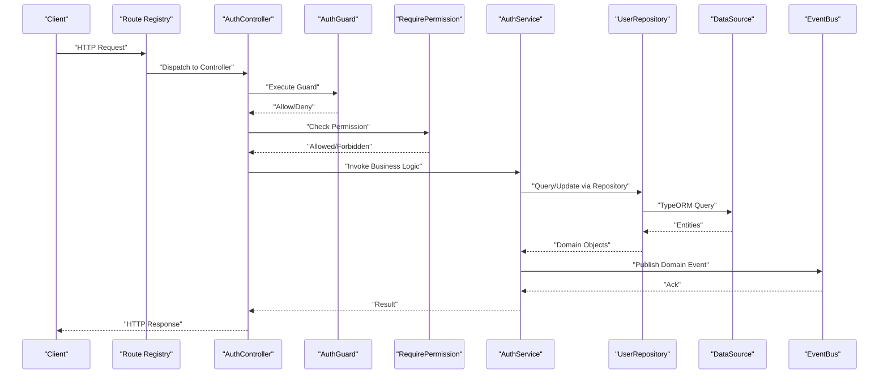
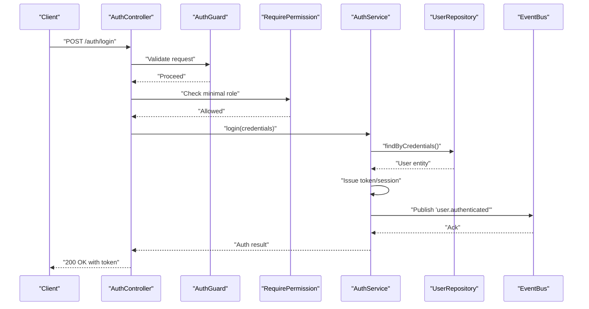
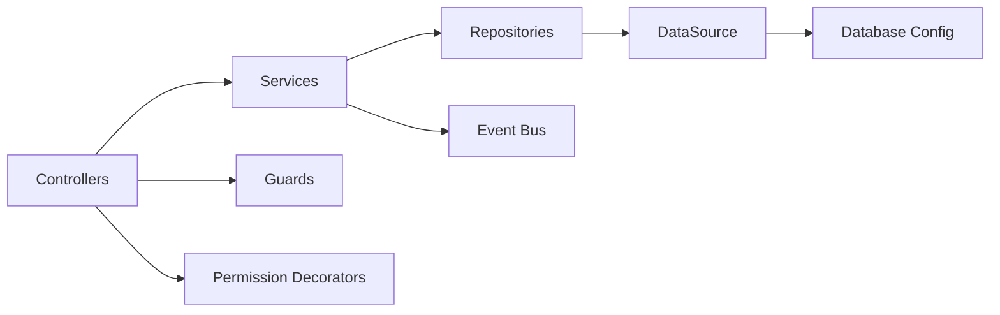

# Design Patterns Implementation

<cite>
**Referenced Files in This Document**
- [app.ts](file://backend/src/app.ts)
- [index.ts](file://backend/src/index.ts)
- [route-registry.ts](file://backend/src/routes/route-registry.ts)
- [auth.controller.ts](file://backend/src/modules/auth/controllers/auth.controller.ts)
- [auth.service.ts](file://backend/src/modules/auth/services/auth.service.ts)
- [auth.guard.ts](file://backend/src/modules/auth/guards/auth.guard.ts)
- [require-permission.decorator.ts](file://backend/src/modules/auth/decorators/require-permission.decorator.ts)
- [event-bus.service.ts](file://backend/src/common/services/event-bus.service.ts)
- [user.repository.ts](file://backend/src/modules/utilisateurs/repositories/user.repository.ts)
- [user.entity.ts](file://backend/src/modules/utilisateurs/entities/user.entity.ts)
- [notification.service.ts](file://backend/src/modules/notifications/services/notification.service.ts)
- [database.config.ts](file://backend/src/config/database.config.ts)
- [data-source.ts](file://backend/src/database/data-source.ts)
</cite>

## Table of Contents
1. [Introduction](#introduction)
2. [Project Structure](#project-structure)
3. [Core Components](#core-components)
4. [Architecture Overview](#architecture-overview)
5. [Detailed Component Analysis](#detailed-component-analysis)
6. [Dependency Analysis](#dependency-analysis)
7. [Performance Considerations](#performance-considerations)
8. [Troubleshooting Guide](#troubleshooting-guide)
9. [Conclusion](#conclusion)
10. [Appendices](#appendices)

## Introduction
This document explains how eLISAschool implements clean architecture through four key design patterns:
- Repository Pattern for data access abstraction
- Service Layer Pattern for business logic encapsulation
- Guard Pattern for authentication and authorization
- Event-Driven Architecture for inter-module communication

It provides concrete examples from the codebase, diagrams mapping to actual files, benefits achieved, and guidelines for applying these patterns consistently across new features.

## Project Structure
The backend is organized by feature modules under src/modules, with shared infrastructure in src/common and configuration in src/config. Controllers expose HTTP endpoints, services implement business logic, repositories abstract persistence, guards enforce security, and an event bus enables decoupled communication between modules.

**Diagram sources**
- [route-registry.ts](file://backend/src/routes/route-registry.ts)
- [auth.controller.ts](file://backend/src/modules/auth/controllers/auth.controller.ts)
- [auth.service.ts](file://backend/src/modules/auth/services/auth.service.ts)
- [auth.guard.ts](file://backend/src/modules/auth/guards/auth.guard.ts)
- [require-permission.decorator.ts](file://backend/src/modules/auth/decorators/require-permission.decorator.ts)
- [user.repository.ts](file://backend/src/modules/utilisateurs/repositories/user.repository.ts)
- [user.entity.ts](file://backend/src/modules/utilisateurs/entities/user.entity.ts)
- [event-bus.service.ts](file://backend/src/common/services/event-bus.service.ts)
- [data-source.ts](file://backend/src/database/data-source.ts)
- [database.config.ts](file://backend/src/config/database.config.ts)

**Section sources**
- [app.ts](file://backend/src/app.ts)
- [index.ts](file://backend/src/index.ts)
- [route-registry.ts](file://backend/src/routes/route-registry.ts)

## Core Components
- Controllers: Route handlers that orchestrate requests and responses. They delegate to services and apply guards/decorators for security.
- Services: Encapsulate business rules, coordinate multiple repositories, and publish events when domain actions occur.
- Repositories: Provide a clean interface over entities and queries, hiding TypeORM specifics from service logic.
- Guards and Decorators: Centralize authentication and authorization checks before controller methods execute.
- Event Bus: A simple pub/sub mechanism enabling modules to react to domain events without tight coupling.

Key implementation references:
- Controller example: [auth.controller.ts](file://backend/src/modules/auth/controllers/auth.controller.ts)
- Service example: [auth.service.ts](file://backend/src/modules/auth/services/auth.service.ts)
- Guard example: [auth.guard.ts](file://backend/src/modules/auth/guards/auth.guard.ts)
- Permission decorator example: [require-permission.decorator.ts](file://backend/src/modules/auth/decorators/require-permission.decorator.ts)
- Repository example: [user.repository.ts](file://backend/src/modules/utilisateurs/repositories/user.repository.ts)
- Entity example: [user.entity.ts](file://backend/src/modules/utilisateurs/entities/user.entity.ts)
- Event bus example: [event-bus.service.ts](file://backend/src/common/services/event-bus.service.ts)

**Section sources**
- [auth.controller.ts](file://backend/src/modules/auth/controllers/auth.controller.ts)
- [auth.service.ts](file://backend/src/modules/auth/services/auth.service.ts)
- [auth.guard.ts](file://backend/src/modules/auth/guards/auth.guard.ts)
- [require-permission.decorator.ts](file://backend/src/modules/auth/decorators/require-permission.decorator.ts)
- [user.repository.ts](file://backend/src/modules/utilisateurs/repositories/user.repository.ts)
- [user.entity.ts](file://backend/src/modules/utilisateurs/entities/user.entity.ts)
- [event-bus.service.ts](file://backend/src/common/services/event-bus.service.ts)

## Architecture Overview
The system follows a layered approach:
- HTTP layer (controllers) receives requests and delegates to services.
- Security layer (guards/decorators) validates identity and permissions early.
- Business layer (services) enforces rules and orchestrates operations.
- Data access layer (repositories + TypeORM) persists and retrieves data.
- Cross-cutting concerns (event bus) enable asynchronous reactions across modules.

**Diagram sources**
- [route-registry.ts](file://backend/src/routes/route-registry.ts)
- [auth.controller.ts](file://backend/src/modules/auth/controllers/auth.controller.ts)
- [auth.guard.ts](file://backend/src/modules/auth/guards/auth.guard.ts)
- [require-permission.decorator.ts](file://backend/src/modules/auth/decorators/require-permission.decorator.ts)
- [auth.service.ts](file://backend/src/modules/auth/services/auth.service.ts)
- [user.repository.ts](file://backend/src/modules/utilisateurs/repositories/user.repository.ts)
- [data-source.ts](file://backend/src/database/data-source.ts)
- [event-bus.service.ts](file://backend/src/common/services/event-bus.service.ts)

## Detailed Component Analysis

### Repository Pattern
Purpose:
- Abstracts persistence details behind a stable interface.
- Hides TypeORM specifics from services.
- Enables testability by allowing repository mocks.

Implementation highlights:
- Repository class exposes domain-oriented methods (e.g., find by id, list with filters).
- Uses entity types for strong typing and consistency.
- Delegates raw SQL or query building to TypeORM DataSource.

Example references:
- Repository definition: [user.repository.ts](file://backend/src/modules/utilisateurs/repositories/user.repository.ts)
- Entity model: [user.entity.ts](file://backend/src/modules/utilisateurs/entities/user.entity.ts)
- DataSource initialization: [data-source.ts](file://backend/src/database/data-source.ts)

Benefits:
- Decouples business logic from storage mechanisms.
- Simplifies unit testing via repository stubs.
- Centralizes query composition and pagination logic.

Guidelines:
- Define one repository per aggregate root.
- Keep repository methods aligned with domain use cases.
- Avoid leaking persistence artifacts (e.g., raw rows) into services.

**Section sources**
- [user.repository.ts](file://backend/src/modules/utilisateurs/repositories/user.repository.ts)
- [user.entity.ts](file://backend/src/modules/utilisateurs/entities/user.entity.ts)
- [data-source.ts](file://backend/src/database/data-source.ts)

### Service Layer Pattern
Purpose:
- Encapsulates business rules and workflows.
- Coordinates multiple repositories and external calls.
- Publishes domain events for cross-module effects.

Implementation highlights:
- Service methods accept DTOs and return domain-safe objects.
- Use transactions where needed to ensure consistency.
- Emit events after successful state changes.

Example references:
- Service implementation: [auth.service.ts](file://backend/src/modules/auth/services/auth.service.ts)
- Event bus usage: [event-bus.service.ts](file://backend/src/common/services/event-bus.service.ts)

Benefits:
- Single source of truth for business logic.
- Easier to audit and evolve complex flows.
- Clear separation between API surface and core logic.

Guidelines:
- Keep services thin on I/O; push persistence to repositories.
- Prefer explicit error handling and typed exceptions.
- Compose small, focused services rather than monolithic ones.

**Section sources**
- [auth.service.ts](file://backend/src/modules/auth/services/auth.service.ts)
- [event-bus.service.ts](file://backend/src/common/services/event-bus.service.ts)

### Guard Pattern (Authentication and Authorization)
Purpose:
- Enforce access control at the request boundary.
- Validate tokens, roles, and permissions uniformly.

Implementation highlights:
- Guard inspects request context and denies unauthorized access early.
- Decorators annotate controller methods with required permissions.
- Centralized policy evaluation ensures consistent behavior.

Example references:
- Guard: [auth.guard.ts](file://backend/src/modules/auth/guards/auth.guard.ts)
- Permission decorator: [require-permission.decorator.ts](file://backend/src/modules/auth/decorators/require-permission.decorator.ts)

Benefits:
- Centralized security policy enforcement.
- Reduces duplication of auth checks across controllers.
- Improves readability by marking protected endpoints explicitly.

Guidelines:
- Apply guards at route level for broad protection.
- Use decorators for fine-grained permission checks.
- Fail fast with clear error codes and messages.

**Section sources**
- [auth.guard.ts](file://backend/src/modules/auth/guards/auth.guard.ts)
- [require-permission.decorator.ts](file://backend/src/modules/auth/decorators/require-permission.decorator.ts)

### Event-Driven Architecture
Purpose:
- Enable loose coupling between modules via domain events.
- Support asynchronous side effects like notifications, analytics, or integrations.

Implementation highlights:
- Event bus provides publish/subscribe semantics.
- Services emit events after committing state changes.
- Consumers subscribe to relevant events and perform side effects.

Example references:
- Event bus: [event-bus.service.ts](file://backend/src/common/services/event-bus.service.ts)
- Notification consumer example: [notification.service.ts](file://backend/src/modules/notifications/services/notification.service.ts)

Benefits:
- Decouples producers from consumers.
- Facilitates scaling and background processing.
- Encourages clear domain boundaries.

Guidelines:
- Define stable event schemas and versioning strategy.
- Ensure idempotency for event handlers.
- Monitor and log event delivery failures.

**Section sources**
- [event-bus.service.ts](file://backend/src/common/services/event-bus.service.ts)
- [notification.service.ts](file://backend/src/modules/notifications/services/notification.service.ts)

### End-to-End Example: Authentication Flow
This sequence shows how the patterns collaborate during login:
- Controller receives credentials.
- Guard validates token presence and format.
- Permission decorator checks role requirements.
- Service authenticates user using repository and issues session/token.
- Service publishes an authentication event for downstream consumers.

**Diagram sources**
- [auth.controller.ts](file://backend/src/modules/auth/controllers/auth.controller.ts)
- [auth.guard.ts](file://backend/src/modules/auth/guards/auth.guard.ts)
- [require-permission.decorator.ts](file://backend/src/modules/auth/decorators/require-permission.decorator.ts)
- [auth.service.ts](file://backend/src/modules/auth/services/auth.service.ts)
- [user.repository.ts](file://backend/src/modules/utilisateurs/repositories/user.repository.ts)
- [event-bus.service.ts](file://backend/src/common/services/event-bus.service.ts)

## Dependency Analysis
High-level dependencies among components:
- Controllers depend on services and are secured by guards/decorators.
- Services depend on repositories and the event bus.
- Repositories depend on TypeORM DataSource and entities.
- Configuration centralizes database settings.

**Diagram sources**
- [auth.controller.ts](file://backend/src/modules/auth/controllers/auth.controller.ts)
- [auth.service.ts](file://backend/src/modules/auth/services/auth.service.ts)
- [auth.guard.ts](file://backend/src/modules/auth/guards/auth.guard.ts)
- [require-permission.decorator.ts](file://backend/src/modules/auth/decorators/require-permission.decorator.ts)
- [user.repository.ts](file://backend/src/modules/utilisateurs/repositories/user.repository.ts)
- [event-bus.service.ts](file://backend/src/common/services/event-bus.service.ts)
- [data-source.ts](file://backend/src/database/data-source.ts)
- [database.config.ts](file://backend/src/config/database.config.ts)

**Section sources**
- [app.ts](file://backend/src/app.ts)
- [index.ts](file://backend/src/index.ts)
- [database.config.ts](file://backend/src/config/database.config.ts)
- [data-source.ts](file://backend/src/database/data-source.ts)

## Performance Considerations
- Use repository methods that leverage efficient queries and indexes.
- Batch operations where possible to reduce round-trips.
- Cache frequently accessed read-only data at the service layer if appropriate.
- Offload heavy side effects to event handlers running asynchronously.
- Monitor slow queries and adjust pagination strategies.

[No sources needed since this section provides general guidance]

## Troubleshooting Guide
Common issues and resolutions:
- Unauthorized or forbidden errors: Verify guard and permission decorator configurations and ensure correct roles/permissions are assigned.
- Repository not found or connection errors: Check DataSource configuration and database connectivity.
- Events not processed: Confirm event bus subscriptions and handler availability; inspect logs for failed deliveries.
- Transaction inconsistencies: Ensure services wrap related writes in transactions and handle rollbacks.

Actionable references:
- Guard and decorator implementations: [auth.guard.ts](file://backend/src/modules/auth/guards/auth.guard.ts), [require-permission.decorator.ts](file://backend/src/modules/auth/decorators/require-permission.decorator.ts)
- Database configuration: [database.config.ts](file://backend/src/config/database.config.ts), [data-source.ts](file://backend/src/database/data-source.ts)
- Event bus: [event-bus.service.ts](file://backend/src/common/services/event-bus.service.ts)

**Section sources**
- [auth.guard.ts](file://backend/src/modules/auth/guards/auth.guard.ts)
- [require-permission.decorator.ts](file://backend/src/modules/auth/decorators/require-permission.decorator.ts)
- [database.config.ts](file://backend/src/config/database.config.ts)
- [data-source.ts](file://backend/src/database/data-source.ts)
- [event-bus.service.ts](file://backend/src/common/services/event-bus.service.ts)

## Conclusion
By combining Repository, Service Layer, Guard, and Event-Driven patterns, eLISAschool achieves a clean, maintainable architecture:
- Clear separation of concerns across layers.
- Strong security posture with centralized guards and decorators.
- Loose coupling via events for scalable, evolvable features.
- Testable and extensible design through well-defined interfaces.

Adhering to the provided guidelines will help teams consistently apply these patterns when adding new features.

[No sources needed since this section summarizes without analyzing specific files]

## Appendices

### Guidelines for Applying Patterns Consistently
- Repository Pattern
  - One repository per aggregate root.
  - Expose domain-centric methods; avoid exposing raw queries.
  - Return strongly-typed domain objects.

- Service Layer Pattern
  - Keep services focused on business workflows.
  - Coordinate repositories and external services.
  - Publish events after successful state mutations.

- Guard Pattern
  - Apply guards at route level for broad protection.
  - Use decorators for method-level permissions.
  - Fail fast with descriptive errors.

- Event-Driven Architecture
  - Version events and maintain backward compatibility.
  - Implement idempotent handlers.
  - Log and monitor event delivery outcomes.

[No sources needed since this section provides general guidance]