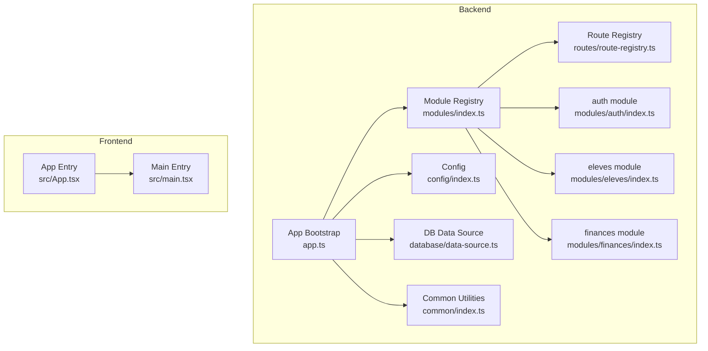
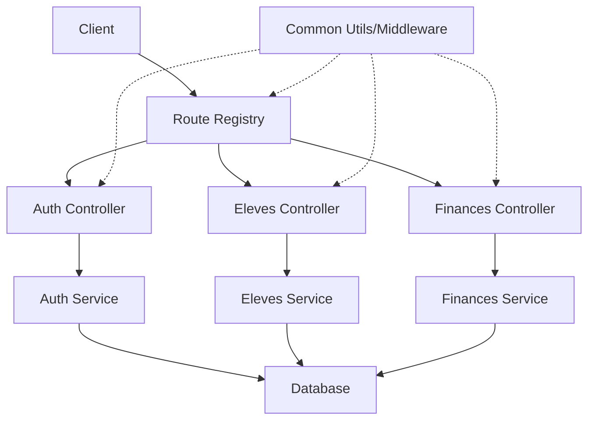
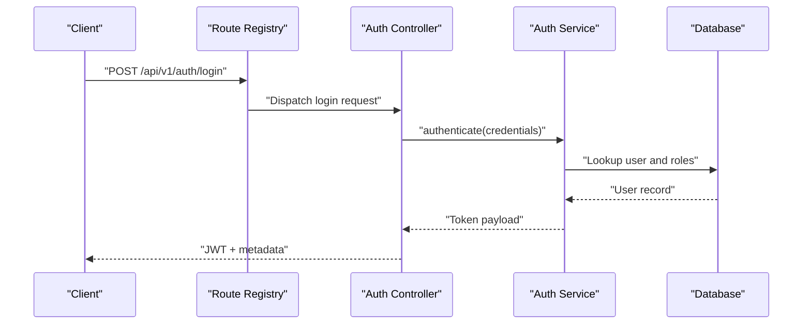
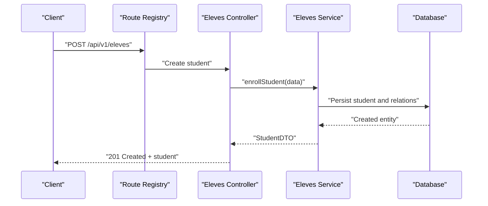
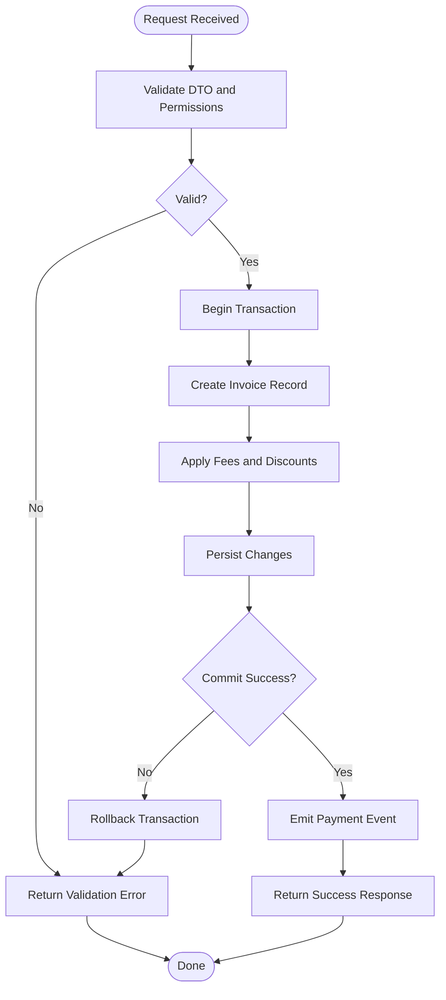
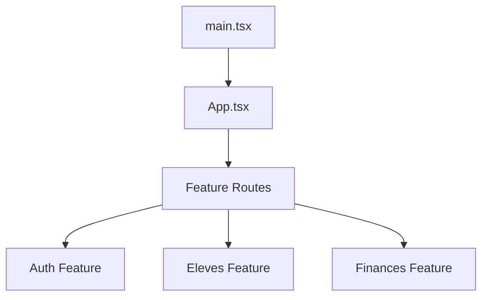
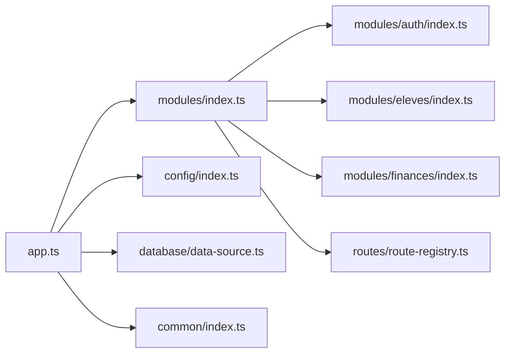

# Module Architecture & Organization

<cite>
**Referenced Files in This Document**
- [backend/src/modules/index.ts](file://backend/src/modules/index.ts)
- [backend/src/app.ts](file://backend/src/app.ts)
- [backend/src/routes/route-registry.ts](file://backend/src/routes/route-registry.ts)
- [backend/src/config/index.ts](file://backend/src/config/index.ts)
- [backend/src/database/data-source.ts](file://backend/src/database/data-source.ts)
- [backend/src/common/index.ts](file://backend/src/common/index.ts)
- [backend/src/modules/auth/index.ts](file://backend/src/modules/auth/index.ts)
- [backend/src/modules/eleves/index.ts](file://backend/src/modules/eleves/index.ts)
- [backend/src/modules/finances/index.ts](file://backend/src/modules/finances/index.ts)
- [frontend/src/App.tsx](file://frontend/src/App.tsx)
- [frontend/src/main.tsx](file://frontend/src/main.tsx)
</cite>

## Table of Contents
1. [Introduction](#introduction)
2. [Project Structure](#project-structure)
3. [Core Components](#core-components)
4. [Architecture Overview](#architecture-overview)
5. [Detailed Component Analysis](#detailed-component-analysis)
6. [Dependency Analysis](#dependency-analysis)
7. [Performance Considerations](#performance-considerations)
8. [Troubleshooting Guide](#troubleshooting-guide)
9. [Conclusion](#conclusion)
10. [Appendices](#appendices)

## Introduction
This document explains eLISAschool’s modular architecture across backend and frontend, focusing on the feature-based module organization pattern. It describes the standard module structure (controllers, services, entities, DTOs, index files), inter-module communication, dependency injection patterns, and lifecycle management. It also provides guidelines for creating new modules, naming conventions, and best practices to maintain separation of concerns, with examples drawn from existing modules such as auth, eleves, and finances.

## Project Structure
The project follows a clear separation between backend and frontend:
- Backend: NestJS-style feature modules under backend/src/modules, each encapsulating its own controllers, services, entities, DTOs, migrations, and an index file that registers routes and dependencies.
- Frontend: Feature-based features directory mirroring backend modules, with route definitions and UI components organized per feature.

**Diagram sources**
- [backend/src/app.ts](file://backend/src/app.ts)
- [backend/src/modules/index.ts](file://backend/src/modules/index.ts)
- [backend/src/routes/route-registry.ts](file://backend/src/routes/route-registry.ts)
- [backend/src/config/index.ts](file://backend/src/config/index.ts)
- [backend/src/database/data-source.ts](file://backend/src/database/data-source.ts)
- [backend/src/common/index.ts](file://backend/src/common/index.ts)
- [backend/src/modules/auth/index.ts](file://backend/src/modules/auth/index.ts)
- [backend/src/modules/eleves/index.ts](file://backend/src/modules/eleves/index.ts)
- [backend/src/modules/finances/index.ts](file://backend/src/modules/finances/index.ts)
- [frontend/src/App.tsx](file://frontend/src/App.tsx)
- [frontend/src/main.tsx](file://frontend/src/main.tsx)

**Section sources**
- [backend/src/app.ts](file://backend/src/app.ts)
- [backend/src/modules/index.ts](file://backend/src/modules/index.ts)
- [backend/src/routes/route-registry.ts](file://backend/src/routes/route-registry.ts)
- [backend/src/config/index.ts](file://backend/src/config/index.ts)
- [backend/src/database/data-source.ts](file://backend/src/database/data-source.ts)
- [backend/src/common/index.ts](file://backend/src/common/index.ts)
- [frontend/src/App.tsx](file://frontend/src/App.tsx)
- [frontend/src/main.tsx](file://frontend/src/main.tsx)

## Core Components
- App bootstrap: Initializes configuration, database connection, common utilities, and module registry; wires up global middleware and error handling.
- Module registry: Centralizes discovery and registration of feature modules, ensuring consistent initialization order and dependency resolution.
- Route registry: Aggregates controller routes exposed by modules and mounts them under versioned or namespaced paths.
- Config: Loads environment variables and shared settings consumed by modules.
- Database data source: Provides ORM configuration and connection pooling used by entity-backed modules.
- Common: Shared interceptors, filters, middlewares, types, and utilities reused across modules.

Key responsibilities:
- Keep modules decoupled via explicit interfaces and DI tokens.
- Expose only necessary APIs through index files.
- Centralize cross-cutting concerns (logging, validation, errors) in common.

**Section sources**
- [backend/src/app.ts](file://backend/src/app.ts)
- [backend/src/modules/index.ts](file://backend/src/modules/index.ts)
- [backend/src/routes/route-registry.ts](file://backend/src/routes/route-registry.ts)
- [backend/src/config/index.ts](file://backend/src/config/index.ts)
- [backend/src/database/data-source.ts](file://backend/src/database/data-source.ts)
- [backend/src/common/index.ts](file://backend/src/common/index.ts)

## Architecture Overview
The system uses a layered, feature-based architecture:
- Controllers handle HTTP requests and delegate to services.
- Services implement business logic and orchestrate repositories/entities.
- Entities represent persistent models mapped to database tables.
- DTOs define request/response contracts validated at the controller layer.
- Index files export public APIs and register routes and providers.

**Diagram sources**
- [backend/src/routes/route-registry.ts](file://backend/src/routes/route-registry.ts)
- [backend/src/modules/auth/index.ts](file://backend/src/modules/auth/index.ts)
- [backend/src/modules/eleves/index.ts](file://backend/src/modules/eleves/index.ts)
- [backend/src/modules/finances/index.ts](file://backend/src/modules/finances/index.ts)
- [backend/src/common/index.ts](file://backend/src/common/index.ts)

## Detailed Component Analysis

### Standard Module Structure
Each feature module typically includes:
- controllers/: Request handlers, input validation, response mapping.
- services/: Business logic, transaction orchestration, cross-module calls.
- entities/: Persistent models and relationships.
- dto/: Request/response schemas and validation rules.
- index.ts: Public exports, provider registration, route mounting, and optional lifecycle hooks.

Guidelines:
- One responsibility per module.
- Prefer composition over inheritance.
- Use DTOs for all external boundaries.
- Keep entities internal to the module unless explicitly shared.

Examples:
- auth module: Authentication flows, token issuance, session management.
- eleves module: Student lifecycle, enrollment, academic records.
- finances module: Fees, payments, invoices, financial reporting.

**Section sources**
- [backend/src/modules/auth/index.ts](file://backend/src/modules/auth/index.ts)
- [backend/src/modules/eleves/index.ts](file://backend/src/modules/eleves/index.ts)
- [backend/src/modules/finances/index.ts](file://backend/src/modules/finances/index.ts)

### Dependency Injection Patterns
- Providers are registered in module index files and resolved via DI container.
- Services depend on other services through constructor injection using typed tokens.
- Cross-module dependencies are declared explicitly to avoid circular imports.
- Configuration values are injected via config providers.

Best practices:
- Define interfaces for service contracts.
- Use factory providers for complex initialization.
- Avoid direct imports of concrete classes across module boundaries.

**Section sources**
- [backend/src/modules/index.ts](file://backend/src/modules/index.ts)
- [backend/src/config/index.ts](file://backend/src/config/index.ts)

### Module Lifecycle Management
Lifecycle phases:
- Initialization: Load config, connect to database, register providers.
- Startup: Register routes, initialize caches, warm-up resources.
- Runtime: Handle requests, manage transactions, emit events.
- Shutdown: Graceful teardown, flush logs, close connections.

Implementation points:
- App bootstrap orchestrates lifecycle steps.
- Modules expose optional lifecycle hooks in their index files.
- Global interceptors/filters ensure consistent error handling and logging.

**Section sources**
- [backend/src/app.ts](file://backend/src/app.ts)
- [backend/src/modules/index.ts](file://backend/src/modules/index.ts)

### Inter-Module Communication
Patterns:
- Direct service-to-service calls via DI when there is a clear ownership boundary.
- Event-driven messaging for asynchronous side effects (e.g., notifications).
- Shared enums/types in common or shared packages to keep contracts stable.

Rules:
- Prefer read-only access to another module’s data via well-defined services.
- Avoid tight coupling; use interfaces and DTOs.
- Document cross-module contracts in module READMEs.

**Section sources**
- [backend/src/common/index.ts](file://backend/src/common/index.ts)
- [backend/src/modules/auth/index.ts](file://backend/src/modules/auth/index.ts)
- [backend/src/modules/eleves/index.ts](file://backend/src/modules/eleves/index.ts)
- [backend/src/modules/finances/index.ts](file://backend/src/modules/finances/index.ts)

### API Workflow Example: Authentication

**Diagram sources**
- [backend/src/routes/route-registry.ts](file://backend/src/routes/route-registry.ts)
- [backend/src/modules/auth/index.ts](file://backend/src/modules/auth/index.ts)

### API Workflow Example: Student Enrollment

**Diagram sources**
- [backend/src/routes/route-registry.ts](file://backend/src/routes/route-registry.ts)
- [backend/src/modules/eleves/index.ts](file://backend/src/modules/eleves/index.ts)

### Financial Transaction Flowchart

**Diagram sources**
- [backend/src/modules/finances/index.ts](file://backend/src/modules/finances/index.ts)

### Frontend Feature-Based Organization
Frontend mirrors backend features:
- Features directory contains per-feature folders with components, hooks, stores, and route definitions.
- App entry initializes routing, theme, and feature plugins.
- Main entry bootstraps the application and connects to backend APIs.

**Diagram sources**
- [frontend/src/main.tsx](file://frontend/src/main.tsx)
- [frontend/src/App.tsx](file://frontend/src/App.tsx)

**Section sources**
- [frontend/src/main.tsx](file://frontend/src/main.tsx)
- [frontend/src/App.tsx](file://frontend/src/App.tsx)

## Dependency Analysis
High-level dependencies:
- app.ts depends on config, database, common, and module registry.
- modules/index.ts aggregates feature modules and exposes their providers/routes.
- route-registry.ts consumes module route definitions and mounts endpoints.
- Each module depends on common utilities and database data source.

**Diagram sources**
- [backend/src/app.ts](file://backend/src/app.ts)
- [backend/src/modules/index.ts](file://backend/src/modules/index.ts)
- [backend/src/routes/route-registry.ts](file://backend/src/routes/route-registry.ts)
- [backend/src/config/index.ts](file://backend/src/config/index.ts)
- [backend/src/database/data-source.ts](file://backend/src/database/data-source.ts)
- [backend/src/common/index.ts](file://backend/src/common/index.ts)
- [backend/src/modules/auth/index.ts](file://backend/src/modules/auth/index.ts)
- [backend/src/modules/eleves/index.ts](file://backend/src/modules/eleves/index.ts)
- [backend/src/modules/finances/index.ts](file://backend/src/modules/finances/index.ts)

**Section sources**
- [backend/src/app.ts](file://backend/src/app.ts)
- [backend/src/modules/index.ts](file://backend/src/modules/index.ts)
- [backend/src/routes/route-registry.ts](file://backend/src/routes/route-registry.ts)
- [backend/src/config/index.ts](file://backend/src/config/index.ts)
- [backend/src/database/data-source.ts](file://backend/src/database/data-source.ts)
- [backend/src/common/index.ts](file://backend/src/common/index.ts)

## Performance Considerations
- Connection pooling: Ensure database data source is configured with appropriate pool sizes and timeouts.
- Lazy loading: Defer heavy module initialization until routes are accessed.
- Caching: Introduce cache layers for frequently accessed read operations in services.
- Pagination and indexing: Use pagination in controllers and leverage database indexes defined in migrations.
- Monitoring: Add metrics and tracing around critical paths (auth, finances).

[No sources needed since this section provides general guidance]

## Troubleshooting Guide
Common issues and resolutions:
- Circular dependencies: Refactor to use interfaces and move shared types to common.
- Missing DI tokens: Verify provider registration in module index files.
- Route conflicts: Ensure unique path prefixes in route registry.
- Migration failures: Check data source configuration and migration ordering.
- Permission errors: Validate RBAC integration in controllers and guards.

Operational checks:
- Confirm app bootstrap completes without errors.
- Validate module registration order.
- Inspect logs for unhandled exceptions and slow queries.

**Section sources**
- [backend/src/app.ts](file://backend/src/app.ts)
- [backend/src/modules/index.ts](file://backend/src/modules/index.ts)
- [backend/src/routes/route-registry.ts](file://backend/src/routes/route-registry.ts)
- [backend/src/database/data-source.ts](file://backend/src/database/data-source.ts)

## Conclusion
eLISAschool’s modular architecture emphasizes clear separation of concerns, explicit dependencies, and consistent module structure. By following the guidelines for controllers, services, entities, DTOs, and index files, teams can scale features independently while maintaining cohesion. The provided diagrams and examples illustrate how modules communicate, how lifecycle is managed, and how to create new modules effectively.

[No sources needed since this section summarizes without analyzing specific files]

## Appendices

### Guidelines for Creating New Modules
- Create a folder under backend/src/modules/<feature>.
- Implement controllers, services, entities, and DTOs inside dedicated directories.
- Export public APIs and register providers/routes in index.ts.
- Add migrations if the module introduces schema changes.
- Wire the module into the module registry and route registry.
- Document cross-module contracts and usage examples.

Naming conventions:
- Use kebab-case for module folders (e.g., finances, eleves).
- PascalCase for classes and services (e.g., FinancesService).
- Lowercase snake_case for database tables and columns.
- Consistent DTO suffixes (e.g., CreateFinancesDto, UpdateFinancesDto).

Best practices:
- Keep controllers thin; delegate to services.
- Validate inputs with DTOs and decorators.
- Use transactions for multi-step writes.
- Emit domain events for side effects.
- Write unit and integration tests per module.

**Section sources**
- [backend/src/modules/index.ts](file://backend/src/modules/index.ts)
- [backend/src/routes/route-registry.ts](file://backend/src/routes/route-registry.ts)
- [backend/src/common/index.ts](file://backend/src/common/index.ts)