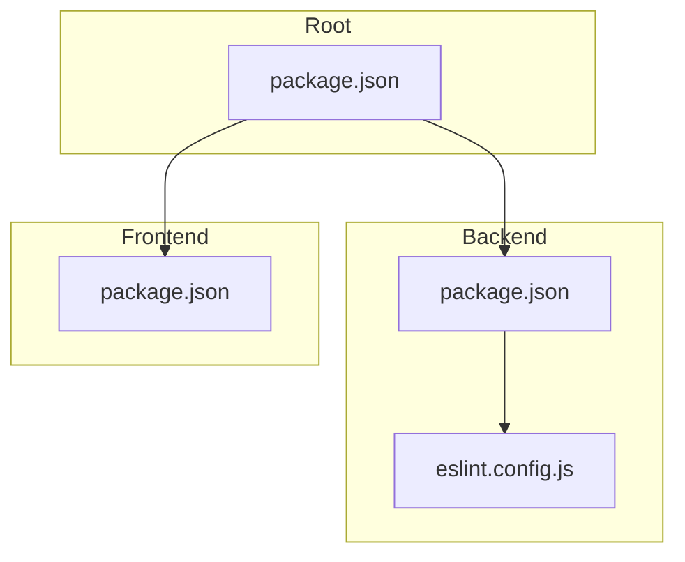
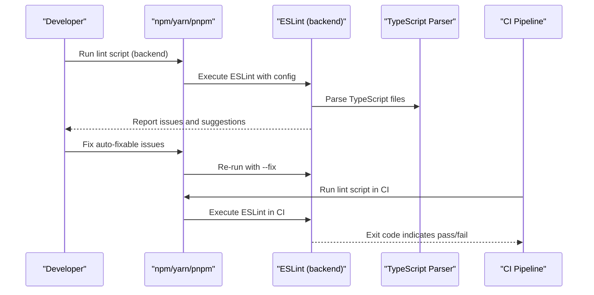
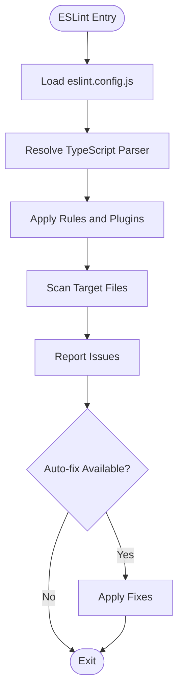
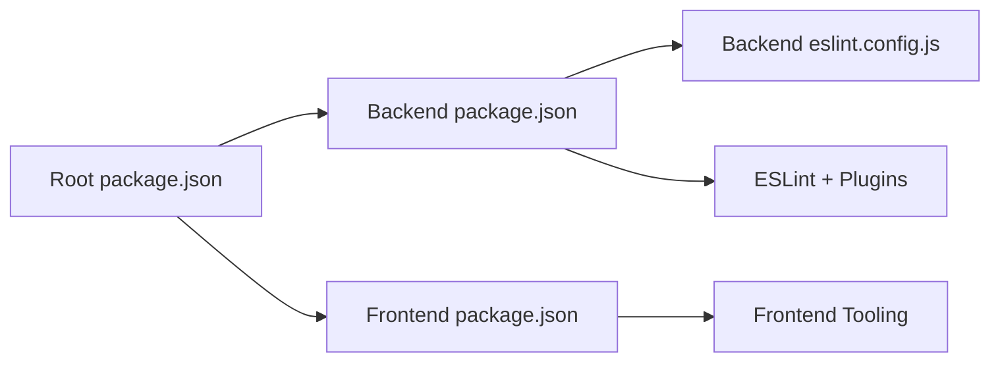

# Code Quality Tools & Linting

<cite>
**Referenced Files in This Document**
- [backend/eslint.config.js](file://backend/eslint.config.js)
- [backend/package.json](file://backend/package.json)
- [frontend/package.json](file://frontend/package.json)
- [package.json](file://package.json)
</cite>

## Table of Contents
1. [Introduction](#introduction)
2. [Project Structure](#project-structure)
3. [Core Components](#core-components)
4. [Architecture Overview](#architecture-overview)
5. [Detailed Component Analysis](#detailed-component-analysis)
6. [Dependency Analysis](#dependency-analysis)
7. [Performance Considerations](#performance-considerations)
8. [Troubleshooting Guide](#troubleshooting-guide)
9. [Conclusion](#conclusion)
10. [Appendices](#appendices)

## Introduction
This document explains the code quality tools and linting configuration used across eLISAschool, focusing on ESLint rules, Prettier formatting standards, and code style enforcement. It also provides setup instructions for IDE integration, pre-commit hooks, and CI/CD pipeline integration, along with guidance for custom project-specific rules, formatting preferences, and automated checks. The goal is to ensure consistent, high-quality code across both backend and frontend workspaces.

## Project Structure
eLISAschool uses a multi-package structure with separate tooling configurations per workspace:
- Backend (TypeScript/NestJS): ESLint configuration and scripts are defined under the backend directory.
- Frontend (React/Vite): Tooling and scripts are defined under the frontend directory.
- Root package.json: May contain shared scripts or workspace-level commands.

**Diagram sources**
- [backend/eslint.config.js](file://backend/eslint.config.js)
- [backend/package.json](file://backend/package.json)
- [frontend/package.json](file://frontend/package.json)
- [package.json](file://package.json)

**Section sources**
- [backend/eslint.config.js](file://backend/eslint.config.js)
- [backend/package.json](file://backend/package.json)
- [frontend/package.json](file://frontend/package.json)
- [package.json](file://package.json)

## Core Components
- ESLint Configuration (Backend): Centralized ESLint settings reside in the backend directory. This file defines parser options, plugins, rule sets, and environment targets for TypeScript and NestJS.
- Scripts and Dependencies: Both backend and frontend package.json files declare linting-related dependencies and npm scripts that run ESLint and related tools.
- Shared Commands: The root package.json may aggregate commands for running lint checks across packages.

Key responsibilities:
- Enforce consistent coding standards via ESLint rules.
- Integrate with TypeScript for type-aware linting.
- Provide convenient scripts for local development and CI.

**Section sources**
- [backend/eslint.config.js](file://backend/eslint.config.js)
- [backend/package.json](file://backend/package.json)
- [frontend/package.json](file://frontend/package.json)
- [package.json](file://package.json)

## Architecture Overview
The code quality architecture centers around ESLint as the primary linter, with optional Prettier integration for formatting. The flow below shows how developers trigger checks locally and how CI can enforce them.

[No sources needed since this diagram shows conceptual workflow, not actual code structure]

## Detailed Component Analysis

### ESLint Configuration (Backend)
The backend ESLint configuration defines:
- Parser and plugin usage for TypeScript and framework-specific patterns.
- Rule sets tailored to the project’s conventions.
- Environment and target settings aligned with Node.js and TypeScript versions.

Recommended practices:
- Keep TypeScript-aware rules enabled to catch type-related issues early.
- Use strict mode where appropriate to improve reliability.
- Avoid overly broad ignores; prefer targeted exclusions.

**Section sources**
- [backend/eslint.config.js](file://backend/eslint.config.js)

### Scripts and Dependencies (Backend and Frontend)
Both backend and frontend package.json files typically include:
- Dependency declarations for ESLint and related plugins.
- Scripts to run linting and fix issues.
- Optional integrations with formatters or task runners.

Guidance:
- Ensure scripts use consistent flags across environments.
- Pin dependency versions to avoid drift between local and CI.
- Separate lint and format steps if using Prettier.

**Section sources**
- [backend/package.json](file://backend/package.json)
- [frontend/package.json](file://frontend/package.json)

### Root-Level Aggregation (Optional)
If present, the root package.json can provide unified commands to run lint checks across all packages, simplifying developer workflows and CI definitions.

**Section sources**
- [package.json](file://package.json)

## Dependency Analysis
The following diagram illustrates the relationships among key configuration files and their roles in the linting pipeline.

**Diagram sources**
- [backend/eslint.config.js](file://backend/eslint.config.js)
- [backend/package.json](file://backend/package.json)
- [frontend/package.json](file://frontend/package.json)
- [package.json](file://package.json)

**Section sources**
- [backend/eslint.config.js](file://backend/eslint.config.js)
- [backend/package.json](file://backend/package.json)
- [frontend/package.json](file://frontend/package.json)
- [package.json](file://package.json)

## Performance Considerations
- Incremental Linting: Configure ESLint cache to speed up repeated runs.
- File Scope: Limit scanning to relevant directories to reduce overhead.
- Parallelization: If multiple packages exist, consider parallel execution in CI.
- Rule Selectivity: Disable expensive rules only when justified and documented.

[No sources needed since this section provides general guidance]

## Troubleshooting Guide
Common issues and resolutions:
- Missing Dependencies: Ensure all linting dependencies are installed in each workspace.
- Parser Mismatch: Verify TypeScript parser version aligns with project’s tsconfig.
- Rule Conflicts: If using Prettier, disable conflicting ESLint rules and rely on Prettier for formatting.
- Ignore Patterns: Review ignore lists to prevent unintended exclusions.
- CI Failures: Reproduce locally with the same Node.js version and dependency lockfiles.

IDE Integration Tips:
- Enable ESLint extension with automatic fixing on save.
- Align editor settings with project’s formatter and indentation rules.
- Use workspace-level settings to avoid global overrides.

Pre-commit Hooks:
- Run lint and fix before commit to catch issues early.
- Consider staged-only checks to minimize overhead.

CI/CD Integration:
- Add a dedicated job to run lint scripts across packages.
- Fail the build on non-zero exit codes from ESLint.
- Cache node_modules and ESLint cache to speed up builds.

Configuration Overrides:
- Prefer local overrides for exceptions rather than disabling rules globally.
- Document any intentional deviations with clear rationale.

[No sources needed since this section provides general guidance]

## Conclusion
By centralizing ESLint configuration in the backend and maintaining consistent scripts across workspaces, eLISAschool enforces uniform code quality standards. Integrating these checks into IDE workflows, pre-commit hooks, and CI pipelines ensures that issues are caught early and consistently. Adopting the recommendations above will help maintain a clean, reliable codebase as the project evolves.

[No sources needed since this section summarizes without analyzing specific files]

## Appendices

### Setup Instructions Summary
- Install dependencies per workspace (backend and frontend).
- Configure ESLint in your IDE with auto-fix on save.
- Add pre-commit hook to run lint and fix.
- Extend CI to execute lint scripts and fail on errors.

[No sources needed since this section provides general guidance]