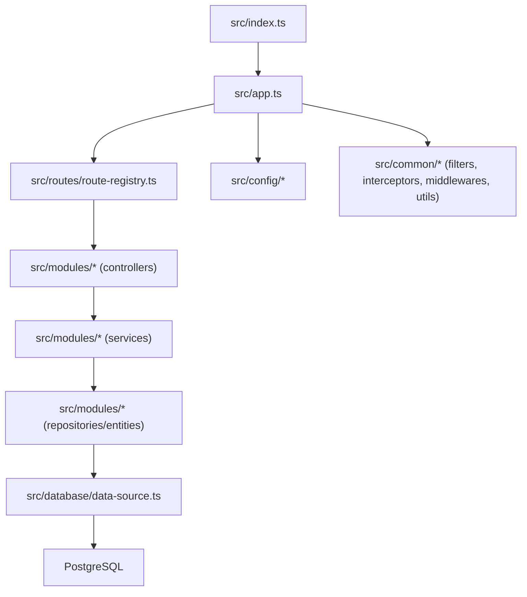
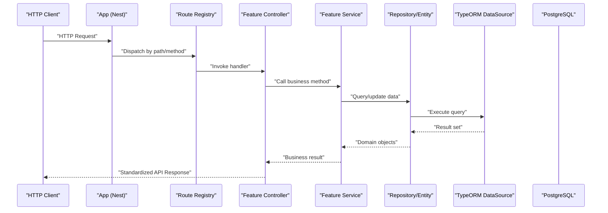
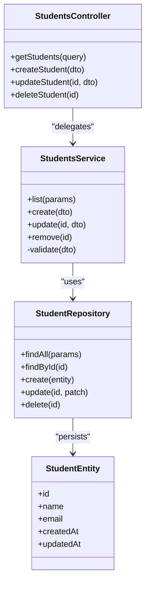
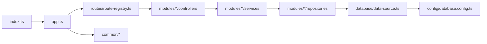

# Coding Standards & Conventions

<cite>
**Referenced Files in This Document**
- [tsconfig.json](file://backend/tsconfig.json)
- [eslint.config.js](file://backend/eslint.config.js)
- [package.json](file://backend/package.json)
- [app.ts](file://backend/src/app.ts)
- [index.ts](file://backend/src/index.ts)
- [route-registry.ts](file://backend/src/routes/route-registry.ts)
- [data-source.ts](file://backend/src/database/data-source.ts)
- [database.config.ts](file://backend/src/config/database.config.ts)
- [env.config.ts](file://backend/src/config/env.config.ts)
- [pagination-guide.md](file://backend/docs/pagination-guide.md)
- [audit-trail.md](file://backend/docs/audit-trail.md)
</cite>

## Table of Contents
1. [Introduction](#introduction)
2. [Project Structure](#project-structure)
3. [Core Components](#core-components)
4. [Architecture Overview](#architecture-overview)
5. [Detailed Component Analysis](#detailed-component-analysis)
6. [Dependency Analysis](#dependency-analysis)
7. [Performance Considerations](#performance-considerations)
8. [Troubleshooting Guide](#troubleshooting-guide)
9. [Conclusion](#conclusion)
10. [Appendices](#appendices)

## Introduction
This document defines the coding standards and conventions for eLISAschool’s backend, focusing on TypeScript configuration, ESLint rules, formatting expectations, code organization patterns, naming conventions, modular architecture (controller-service-repository), error handling strategies, logging conventions, API response formats, documentation comments, and a code review checklist for contributors. It is intended to ensure consistency, maintainability, and scalability across modules and teams.

## Project Structure
The backend follows a feature-based modular architecture under src/modules/<feature>, with shared utilities and cross-cutting concerns in src/common. Configuration lives in src/config, database access via TypeORM in src/database, and route registration in src/routes. The application entry points are src/index.ts and src/app.ts.

**Diagram sources**
- [index.ts](file://backend/src/index.ts)
- [app.ts](file://backend/src/app.ts)
- [route-registry.ts](file://backend/src/routes/route-registry.ts)
- [data-source.ts](file://backend/src/database/data-source.ts)
- [database.config.ts](file://backend/src/config/database.config.ts)

**Section sources**
- [index.ts](file://backend/src/index.ts)
- [app.ts](file://backend/src/app.ts)
- [route-registry.ts](file://backend/src/routes/route-registry.ts)
- [data-source.ts](file://backend/src/database/data-source.ts)
- [database.config.ts](file://backend/src/config/database.config.ts)

## Core Components
- Application bootstrap: Entry point initializes dependencies, configures the framework, registers routes, and starts the server.
- Route registry: Centralized route registration that wires controllers to HTTP endpoints.
- Database layer: TypeORM data source configuration and connection management.
- Configuration: Environment variables and database settings loaded at startup.

Key responsibilities:
- src/index.ts: Process lifecycle and server start.
- src/app.ts: Framework setup, middleware, global filters/interceptors, and route mounting.
- src/routes/route-registry.ts: Declarative route definitions and controller binding.
- src/database/data-source.ts: TypeORM DataSource initialization and entity discovery.
- src/config/*: Typed environment and database configuration.

**Section sources**
- [index.ts](file://backend/src/index.ts)
- [app.ts](file://backend/src/app.ts)
- [route-registry.ts](file://backend/src/routes/route-registry.ts)
- [data-source.ts](file://backend/src/database/data-source.ts)
- [database.config.ts](file://backend/src/config/database.config.ts)
- [env.config.ts](file://backend/src/config/env.config.ts)

## Architecture Overview
The system uses a layered, module-per-feature design with clear separation between HTTP handling, business logic, and persistence.

**Diagram sources**
- [app.ts](file://backend/src/app.ts)
- [route-registry.ts](file://backend/src/routes/route-registry.ts)
- [data-source.ts](file://backend/src/database/data-source.ts)

## Detailed Component Analysis

### TypeScript Configuration
- Target and module resolution aligned with Node.js runtime and modern ES features.
- Strict type checking enabled; decorators and emit metadata required for framework usage.
- Paths and outDir configured for build output and IDE support.
- Source maps enabled for debugging.

Guidelines:
- Keep strict mode on to catch errors early.
- Use explicit types for public APIs and service interfaces.
- Prefer enums or union types over string literals for domain values.
- Avoid any; use unknown where necessary and narrow explicitly.

**Section sources**
- [tsconfig.json](file://backend/tsconfig.json)

### ESLint Rules
- Centralized ESLint configuration enforces consistent style and safety checks.
- Recommended practices:
  - Enforce no unused variables and imports.
  - Require explicit return types for exported functions.
  - Disallow console statements in production code; use structured logger.
  - Prefer const over let; avoid var.
  - Enforce semicolons and single quotes per project preference.
  - Limit cyclomatic complexity and nesting depth.

Integration:
- Run linting in CI and pre-commit hooks.
- Fix auto-rules with formatter integration.

**Section sources**
- [eslint.config.js](file://backend/eslint.config.js)

### Prettier Formatting Standards
- Consistent formatting enforced across files.
- Defaults:
  - Single quotes for strings.
  - Semicolons at end of statements.
  - Trailing commas in multiline structures.
  - Indentation: 2 spaces.
  - Line length: 120 characters.
  - Bracket spacing: standard.
- Editor integration recommended for real-time formatting.

Note: If a local .prettierrc exists, it overrides defaults. Ensure team-wide alignment.

**Section sources**
- [package.json](file://backend/package.json)

### Code Organization Patterns
- Feature-based modules under src/modules/<feature>:
  - controllers: HTTP handlers.
  - services: Business logic.
  - repositories/entities: Data access and models.
  - dto: Input/output validation schemas.
  - guards/middlewares: Cross-cutting concerns scoped to feature when needed.
- Shared concerns in src/common:
  - Filters: Global exception filters.
  - Interceptors: Response transformation and logging.
  - Middlewares: Request processing.
  - Utils: Reusable helpers.
  - Types: Shared type definitions.

Naming conventions:
- Files: kebab-case for modules and features; PascalCase for classes and entities.
- Classes: PascalCase with descriptive nouns (e.g., StudentService).
- Functions/Methods: camelCase verbs describing actions (e.g., findStudentById).
- Variables: camelCase; booleans prefixed with is/has/can when appropriate.
- Constants: UPPER_SNAKE_CASE for configuration constants.
- DTOs: PascalCase suffixed with DTO (e.g., CreateStudentDto).
- Entities: PascalCase representing domain nouns (e.g., Student).
- Repositories: PascalCase suffixed with Repository (e.g., StudentRepository).
- Controllers: PascalCase suffixed with Controller (e.g., StudentsController).
- Routes: kebab-case paths with resource names pluralized (e.g., /students).

Modular architecture pattern:
- Controller: Validates input, orchestrates calls, returns standardized responses.
- Service: Encapsulates business rules, transactions, and side effects.
- Repository: Handles data access using TypeORM entities and queries.

Error handling strategy:
- Throw typed exceptions from services/repositories.
- Global filters convert exceptions into consistent API error responses.
- Include correlation IDs for request tracing.

Logging conventions:
- Structured logs with context (userId, tenantId, requestId).
- Log levels: error, warn, info, debug.
- Avoid sensitive data in logs.

API response format:
- Success: { success: true, data: <payload>, meta?: PaginationMeta }
- Error: { success: false, error: { code, message, details? }, requestId? }
- Pagination: { items, total, page, pageSize }

Documentation comments:
- JSDoc for public APIs, DTOs, and complex methods.
- Describe parameters, return types, and side effects.
- Keep examples minimal and link to tests.

Code review checklist:
- Does the change follow naming conventions and file structure?
- Are types explicit and strict?
- Is error handling complete and logged appropriately?
- Are new routes registered in the route registry?
- Are DTOs validated and documented?
- Are there unit/integration tests covering critical paths?
- Is performance impact considered (queries, N+1)?
- Are environment variables added to configuration safely?

**Section sources**
- [route-registry.ts](file://backend/src/routes/route-registry.ts)
- [app.ts](file://backend/src/app.ts)
- [pagination-guide.md](file://backend/docs/pagination-guide.md)
- [audit-trail.md](file://backend/docs/audit-trail.md)

### Controller-Service-Repository Pattern

**Diagram sources**
- [route-registry.ts](file://backend/src/routes/route-registry.ts)
- [data-source.ts](file://backend/src/database/data-source.ts)

**Section sources**
- [route-registry.ts](file://backend/src/routes/route-registry.ts)
- [data-source.ts](file://backend/src/database/data-source.ts)

### Database Layer and Migrations
- TypeORM DataSource initialized centrally for entity discovery and connection pooling.
- Migrations organized numerically for versioning; run via scripts.
- Multi-tenant considerations: scope queries by tenantId where applicable.

Best practices:
- Use migrations for schema changes; never alter schema manually in production.
- Index frequently queried columns; validate with explain plans.
- Prefer repository methods over raw SQL unless necessary.

**Section sources**
- [data-source.ts](file://backend/src/database/data-source.ts)
- [database.config.ts](file://backend/src/config/database.config.ts)

### Configuration and Environment
- Load environment variables with validation and defaults.
- Separate database and app configuration for clarity.
- Never commit secrets; use .env files locally and secret managers in CI/CD.

**Section sources**
- [env.config.ts](file://backend/src/config/env.config.ts)
- [database.config.ts](file://backend/src/config/database.config.ts)

## Dependency Analysis
High-level dependency relationships:
- index.ts bootstraps app.ts.
- app.ts configures framework, middleware, filters, and mounts routes.
- route-registry.ts binds controllers to endpoints.
- Controllers depend on services; services depend on repositories.
- Repositories depend on TypeORM DataSource and entities.

**Diagram sources**
- [index.ts](file://backend/src/index.ts)
- [app.ts](file://backend/src/app.ts)
- [route-registry.ts](file://backend/src/routes/route-registry.ts)
- [data-source.ts](file://backend/src/database/data-source.ts)
- [database.config.ts](file://backend/src/config/database.config.ts)

**Section sources**
- [index.ts](file://backend/src/index.ts)
- [app.ts](file://backend/src/app.ts)
- [route-registry.ts](file://backend/src/routes/route-registry.ts)
- [data-source.ts](file://backend/src/database/data-source.ts)
- [database.config.ts](file://backend/src/config/database.config.ts)

## Performance Considerations
- Enable query logging only in development; disable in production.
- Use pagination consistently for list endpoints; refer to pagination guide.
- Add indexes for high-cardinality and frequently filtered columns.
- Batch operations where possible to reduce round trips.
- Cache immutable or rarely changing data with appropriate invalidation.
- Profile hot paths with APM tools; monitor slow queries.

[No sources needed since this section provides general guidance]

## Troubleshooting Guide
Common issues and resolutions:
- Connection failures: Verify database credentials and network access; check env configuration.
- Migration errors: Roll back to last known good migration; inspect migration diffs.
- Linting/formatting conflicts: Run linter and formatter before committing; align editor settings.
- Unexpected 500 errors: Check global filters and structured logs; correlate with requestId.
- Pagination anomalies: Validate page/pageSize bounds and total counts; ensure proper indexing.

**Section sources**
- [pagination-guide.md](file://backend/docs/pagination-guide.md)
- [audit-trail.md](file://backend/docs/audit-trail.md)

## Conclusion
Adhering to these standards ensures a cohesive, scalable, and maintainable codebase. By following the TypeScript, ESLint, and formatting guidelines, organizing code by features, implementing the controller-service-repository pattern, and standardizing error handling and logging, teams can collaborate effectively and deliver reliable software.

[No sources needed since this section summarizes without analyzing specific files]

## Appendices

### Quick Start Checklist for New Contributors
- Install dependencies and configure environment variables.
- Run linter and formatter; fix all reported issues.
- Build the project and run migrations.
- Execute unit and integration tests.
- Follow naming and file structure conventions.
- Document public APIs with JSDoc.
- Submit PRs with clear descriptions and test coverage.

[No sources needed since this section provides general guidance]