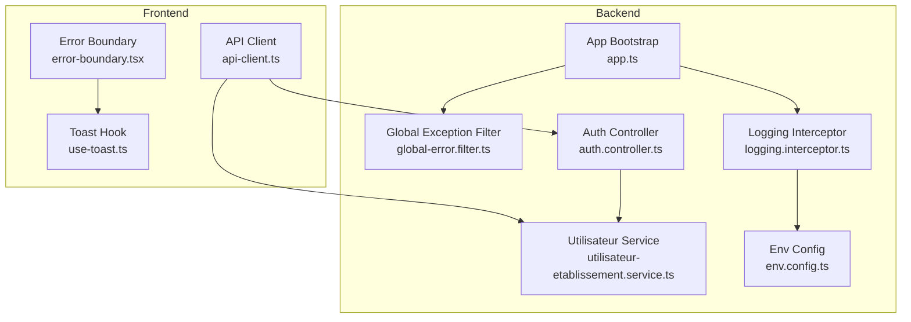
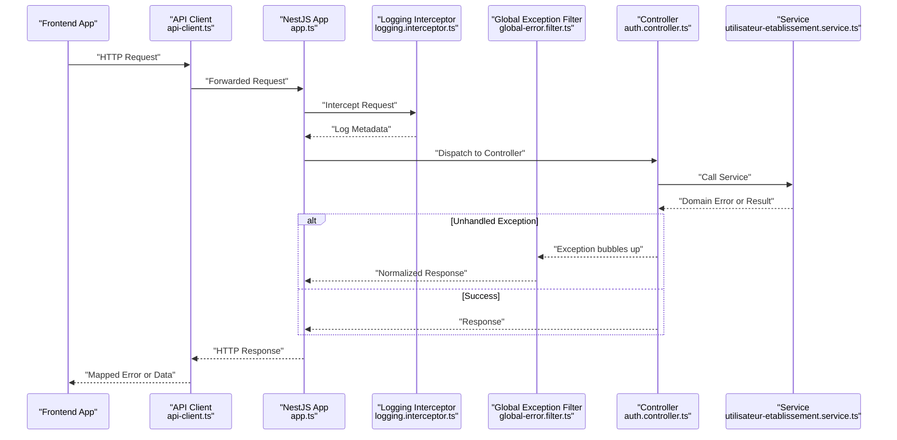
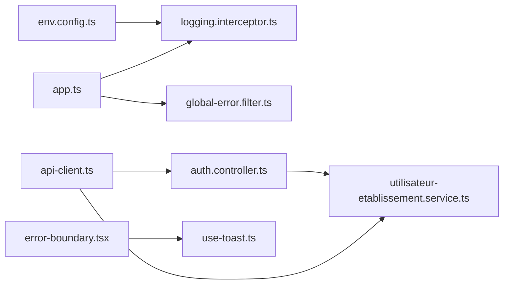

# Error Handling & Logging Standards

<cite>
**Referenced Files in This Document**
- [backend/src/common/filters/global-error.filter.ts](file://backend/src/common/filters/global-error.filter.ts)
- [backend/src/common/interceptors/logging.interceptor.ts](file://backend/src/common/interceptors/logging.interceptor.ts)
- [backend/src/config/env.config.ts](file://backend/src/config/env.config.ts)
- [backend/src/modules/auth/controllers/auth.controller.ts](file://backend/src/modules/auth/controllers/auth.controller.ts)
- [backend/src/modules/utilisateurs/services/utilisateur-etablissement.service.ts](file://backend/src/modules/utilisateurs/services/utilisateur-etablissement.service.ts)
- [backend/src/app.ts](file://backend/src/app.ts)
- [frontend/src/lib/api-client.ts](file://frontend/src/lib/api-client.ts)
- [frontend/src/components/ui/error-boundary.tsx](file://frontend/src/components/ui/error-boundary.tsx)
- [frontend/src/hooks/use-toast.ts](file://frontend/src/hooks/use-toast.ts)
</cite>

## Table of Contents
1. [Introduction](#introduction)
2. [Project Structure](#project-structure)
3. [Core Components](#core-components)
4. [Architecture Overview](#architecture-overview)
5. [Detailed Component Analysis](#detailed-component-analysis)
6. [Dependency Analysis](#dependency-analysis)
7. [Performance Considerations](#performance-considerations)
8. [Troubleshooting Guide](#troubleshooting-guide)
9. [Conclusion](#conclusion)
10. [Appendices](#appendices)

## Introduction
This document defines the error handling and logging standards for eLISAschool across backend and frontend. It covers exception filters, global error handlers, custom error classes, structured logging levels, API error response formats, user-friendly messaging, debugging information, frontend error boundaries, user feedback patterns, and integration points for error tracking. The goal is to ensure consistent, observable, and user-centric error behavior throughout the application.

## Project Structure
Error handling and logging are implemented at multiple layers:
- Backend: Global exception filter, request/response logging interceptor, environment-based configuration, controller-level validation and business errors, service-layer domain exceptions.
- Frontend: Centralized API client with standardized error mapping, UI error boundary component, toast notifications for user feedback.

**Diagram sources**
- [backend/src/common/filters/global-error.filter.ts](file://backend/src/common/filters/global-error.filter.ts)
- [backend/src/common/interceptors/logging.interceptor.ts](file://backend/src/common/interceptors/logging.interceptor.ts)
- [backend/src/config/env.config.ts](file://backend/src/config/env.config.ts)
- [backend/src/modules/auth/controllers/auth.controller.ts](file://backend/src/modules/auth/controllers/auth.controller.ts)
- [backend/src/modules/utilisateurs/services/utilisateur-etablissement.service.ts](file://backend/src/modules/utilisateurs/services/utilisateur-etablissement.service.ts)
- [backend/src/app.ts](file://backend/src/app.ts)
- [frontend/src/lib/api-client.ts](file://frontend/src/lib/api-client.ts)
- [frontend/src/components/ui/error-boundary.tsx](file://frontend/src/components/ui/error-boundary.tsx)
- [frontend/src/hooks/use-toast.ts](file://frontend/src/hooks/use-toast.ts)

**Section sources**
- [backend/src/app.ts](file://backend/src/app.ts)
- [backend/src/common/filters/global-error.filter.ts](file://backend/src/common/filters/global-error.filter.ts)
- [backend/src/common/interceptors/logging.interceptor.ts](file://backend/src/common/interceptors/logging.interceptor.ts)
- [backend/src/config/env.config.ts](file://backend/src/config/env.config.ts)
- [backend/src/modules/auth/controllers/auth.controller.ts](file://backend/src/modules/auth/controllers/auth.controller.ts)
- [backend/src/modules/utilisateurs/services/utilisateur-etablissement.service.ts](file://backend/src/modules/utilisateurs/services/utilisateur-etablissement.service.ts)
- [frontend/src/lib/api-client.ts](file://frontend/src/lib/api-client.ts)
- [frontend/src/components/ui/error-boundary.tsx](file://frontend/src/components/ui/error-boundary.tsx)
- [frontend/src/hooks/use-toast.ts](file://frontend/src/hooks/use-toast.ts)

## Core Components
- Global Exception Filter: Centralizes unhandled exception processing, maps framework-specific errors to consistent HTTP responses, and attaches correlation IDs for tracing.
- Logging Interceptor: Captures incoming requests and outgoing responses, logs duration and key metadata, and integrates with environment-driven log levels.
- Environment Configuration: Provides runtime toggles for verbose logging, sensitive field masking, and feature flags that influence error detail exposure.
- API Client (Frontend): Normalizes backend error payloads into a unified shape, surfaces user-friendly messages, and triggers analytics/tracking hooks.
- Error Boundary (Frontend): Catches rendering/runtime errors within React trees, renders fallback UI, and reports errors to monitoring services.
- Toast Hook (Frontend): Presents actionable, non-blocking user feedback for both success and error states.

**Section sources**
- [backend/src/common/filters/global-error.filter.ts](file://backend/src/common/filters/global-error.filter.ts)
- [backend/src/common/interceptors/logging.interceptor.ts](file://backend/src/common/interceptors/logging.interceptor.ts)
- [backend/src/config/env.config.ts](file://backend/src/config/env.config.ts)
- [frontend/src/lib/api-client.ts](file://frontend/src/lib/api-client.ts)
- [frontend/src/components/ui/error-boundary.tsx](file://frontend/src/components/ui/error-boundary.tsx)
- [frontend/src/hooks/use-toast.ts](file://frontend/src/hooks/use-toast.ts)

## Architecture Overview
The error handling pipeline ensures that all server-side exceptions are normalized before reaching clients, while frontend components remain resilient and informative.

**Diagram sources**
- [backend/src/app.ts](file://backend/src/app.ts)
- [backend/src/common/interceptors/logging.interceptor.ts](file://backend/src/common/interceptors/logging.interceptor.ts)
- [backend/src/common/filters/global-error.filter.ts](file://backend/src/common/filters/global-error.filter.ts)
- [backend/src/modules/auth/controllers/auth.controller.ts](file://backend/src/modules/auth/controllers/auth.controller.ts)
- [backend/src/modules/utilisateurs/services/utilisateur-etablissement.service.ts](file://backend/src/modules/utilisateurs/services/utilisateur-etablissement.service.ts)
- [frontend/src/lib/api-client.ts](file://frontend/src/lib/api-client.ts)

## Detailed Component Analysis

### Backend: Global Exception Filter
Responsibilities:
- Catch all unhandled exceptions thrown by controllers, guards, interceptors, and services.
- Map known error types (validation, authorization, not found, conflict) to appropriate HTTP status codes.
- Attach correlation ID and request context for traceability.
- Mask sensitive fields based on environment configuration.

Behavioral notes:
- For validation failures, return structured error objects with field-level details.
- For authentication/authorization issues, return minimal details to avoid leaking internals.
- For unexpected errors, include a safe message and correlation ID; stack traces are logged server-side only.

**Section sources**
- [backend/src/common/filters/global-error.filter.ts](file://backend/src/common/filters/global-error.filter.ts)

### Backend: Logging Interceptor
Responsibilities:
- Log incoming requests with method, path, query parameters (sanitized), headers (sanitized), and correlation ID.
- Measure and log response time.
- Log outgoing responses with status code and payload size (sanitized).
- Respect environment settings for verbosity and redaction rules.

Operational guidance:
- Use structured JSON logs for aggregation systems.
- Avoid logging tokens, passwords, or PII; rely on environment config to mask sensitive fields.
- Include correlation ID in response headers for client-side tracing.

**Section sources**
- [backend/src/common/interceptors/logging.interceptor.ts](file://backend/src/common/interceptors/logging.interceptor.ts)
- [backend/src/config/env.config.ts](file://backend/src/config/env.config.ts)

### Backend: Environment Configuration
Key concerns:
- Define log level thresholds (e.g., debug, info, warn, error).
- Toggle verbose logging for development vs production.
- Configure field redaction patterns for logs and responses.
- Enable/disable telemetry and error tracking integrations.

Usage:
- Interceptors and filters read these values to decide what to log and how much detail to expose.

**Section sources**
- [backend/src/config/env.config.ts](file://backend/src/config/env.config.ts)

### Backend: Controllers and Services
Controllers:
- Validate inputs early and throw domain-specific errors when constraints fail.
- Return consistent response shapes for successful operations.
- Let the global filter handle unexpected exceptions.

Services:
- Encapsulate business logic and throw typed domain errors (e.g., conflict, not found, permission denied).
- Provide clear error messages suitable for translation and user-facing contexts.

Example references:
- Authentication flow and error scenarios in auth controller.
- Multi-tenant scoping and permission checks in utilisateur-etablissement service.

**Section sources**
- [backend/src/modules/auth/controllers/auth.controller.ts](file://backend/src/modules/auth/controllers/auth.controller.ts)
- [backend/src/modules/utilisateurs/services/utilisateur-etablissement.service.ts](file://backend/src/modules/utilisateurs/services/utilisateur-etablissement.service.ts)

### Frontend: API Client
Responsibilities:
- Normalize backend error responses into a unified structure.
- Extract user-friendly messages and optional technical details for developers.
- Trigger analytics or error tracking hooks on failures.
- Handle network errors, timeouts, and retries where applicable.

Guidelines:
- Always present concise, actionable messages to users.
- Preserve correlation IDs from responses for support tickets.
- Avoid exposing raw stack traces to users.

**Section sources**
- [frontend/src/lib/api-client.ts](file://frontend/src/lib/api-client.ts)

### Frontend: Error Boundary
Responsibilities:
- Catch JavaScript errors during rendering and lifecycle methods.
- Render a friendly fallback UI with retry actions.
- Report errors to monitoring services with context (route, component tree summary).

Best practices:
- Keep fallback UI minimal and accessible.
- Include a “Report Issue” action that pre-fills error context.

**Section sources**
- [frontend/src/components/ui/error-boundary.tsx](file://frontend/src/components/ui/error-boundary.tsx)

### Frontend: Toast Notifications
Responsibilities:
- Show transient, non-blocking feedback for success and error outcomes.
- Allow dismissal and provide links to detailed logs if needed.
- Integrate with i18n for localized messages.

Patterns:
- Use distinct variants for error, warning, success, and info.
- Limit concurrent toasts to prevent UI clutter.

**Section sources**
- [frontend/src/hooks/use-toast.ts](file://frontend/src/hooks/use-toast.ts)

## Dependency Analysis
The following diagram shows how core error handling and logging components depend on each other and on environment configuration.

**Diagram sources**
- [backend/src/config/env.config.ts](file://backend/src/config/env.config.ts)
- [backend/src/common/interceptors/logging.interceptor.ts](file://backend/src/common/interceptors/logging.interceptor.ts)
- [backend/src/common/filters/global-error.filter.ts](file://backend/src/common/filters/global-error.filter.ts)
- [backend/src/app.ts](file://backend/src/app.ts)
- [backend/src/modules/auth/controllers/auth.controller.ts](file://backend/src/modules/auth/controllers/auth.controller.ts)
- [backend/src/modules/utilisateurs/services/utilisateur-etablissement.service.ts](file://backend/src/modules/utilisateurs/services/utilisateur-etablissement.service.ts)
- [frontend/src/lib/api-client.ts](file://frontend/src/lib/api-client.ts)
- [frontend/src/components/ui/error-boundary.tsx](file://frontend/src/components/ui/error-boundary.tsx)
- [frontend/src/hooks/use-toast.ts](file://frontend/src/hooks/use-toast.ts)

**Section sources**
- [backend/src/app.ts](file://backend/src/app.ts)
- [backend/src/common/filters/global-error.filter.ts](file://backend/src/common/filters/global-error.filter.ts)
- [backend/src/common/interceptors/logging.interceptor.ts](file://backend/src/common/interceptors/logging.interceptor.ts)
- [backend/src/config/env.config.ts](file://backend/src/config/env.config.ts)
- [backend/src/modules/auth/controllers/auth.controller.ts](file://backend/src/modules/auth/controllers/auth.controller.ts)
- [backend/src/modules/utilisateurs/services/utilisateur-etablissement.service.ts](file://backend/src/modules/utilisateurs/services/utilisateur-etablissement.service.ts)
- [frontend/src/lib/api-client.ts](file://frontend/src/lib/api-client.ts)
- [frontend/src/components/ui/error-boundary.tsx](file://frontend/src/components/ui/error-boundary.tsx)
- [frontend/src/hooks/use-toast.ts](file://frontend/src/hooks/use-toast.ts)

## Performance Considerations
- Logging overhead: Ensure log levels are tuned per environment; disable debug logs in production.
- Payload size: Avoid logging large request/response bodies; prefer sampling or truncation.
- Correlation IDs: Lightweight string propagation; do not block critical paths.
- Frontend error boundaries: Keep fallback rendering minimal to avoid additional errors.
- Retry policies: Implement exponential backoff for transient network errors; avoid thundering herds.

[No sources needed since this section provides general guidance]

## Troubleshooting Guide
Common issues and resolutions:
- Missing correlation ID in logs: Verify interceptor registration and header propagation.
- Overly verbose logs in production: Check environment configuration for log level and redaction settings.
- Inconsistent API error shapes: Confirm API client normalization and backend filter mapping.
- User sees raw stack traces: Ensure global filter masks sensitive data and API client hides technical details.
- Frontend crashes without feedback: Ensure error boundary wraps route trees and toast hook is used for feedback.

**Section sources**
- [backend/src/common/interceptors/logging.interceptor.ts](file://backend/src/common/interceptors/logging.interceptor.ts)
- [backend/src/common/filters/global-error.filter.ts](file://backend/src/common/filters/global-error.filter.ts)
- [backend/src/config/env.config.ts](file://backend/src/config/env.config.ts)
- [frontend/src/lib/api-client.ts](file://frontend/src/lib/api-client.ts)
- [frontend/src/components/ui/error-boundary.tsx](file://frontend/src/components/ui/error-boundary.tsx)
- [frontend/src/hooks/use-toast.ts](file://frontend/src/hooks/use-toast.ts)

## Conclusion
By standardizing exception handling, logging, and user feedback across backend and frontend, eLISAschool achieves consistent observability, safer error exposure, and better user experience. Adhering to these standards simplifies debugging, supports scalable operations, and maintains trust with end users.

[No sources needed since this section summarizes without analyzing specific files]

## Appendices

### API Error Response Format
- Status codes: Use standard HTTP codes aligned with error semantics.
- Body shape: Include message, code, correlationId, and optional details.
- Field-level errors: For validation failures, include field identifiers and messages.
- Localization: Prefer machine-readable codes; translate messages on the frontend.

[No sources needed since this section provides general guidance]

### Logging Levels and Structured Format
- Levels: debug, info, warn, error.
- Fields: timestamp, level, correlationId, method, path, statusCode, durationMs, message, meta.
- Redaction: Mask tokens, passwords, emails, and PII based on env config.
- Aggregation: Ship JSON logs to centralized systems; enable sampling for high-volume endpoints.

[No sources needed since this section provides general guidance]

### Frontend Error Boundaries and Feedback Patterns
- Wrap route trees with error boundaries.
- Provide retry and “Report Issue” actions.
- Use toast notifications for transient errors and successes.
- Capture minimal context for error tracking (component name, route, action).

[No sources needed since this section provides general guidance]