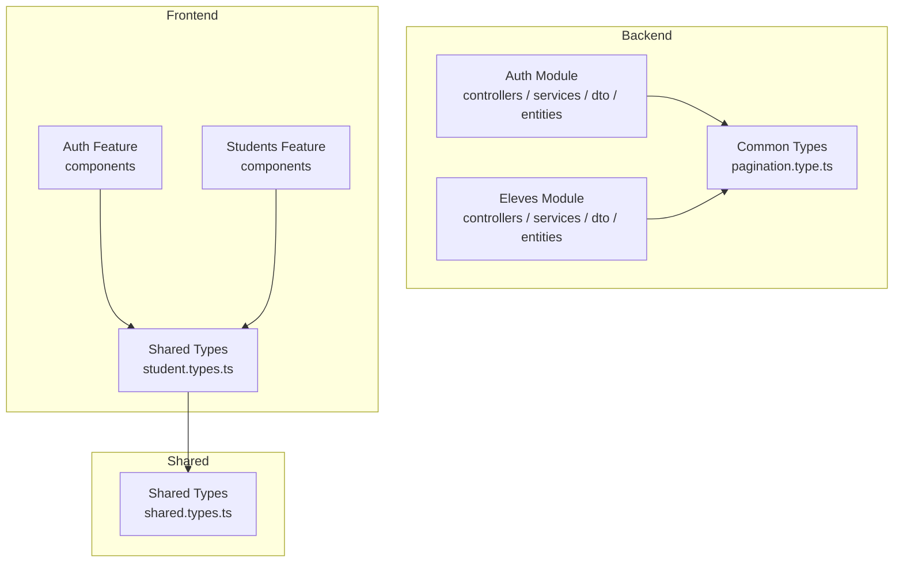
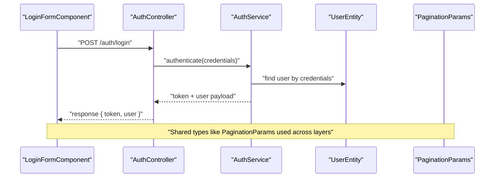
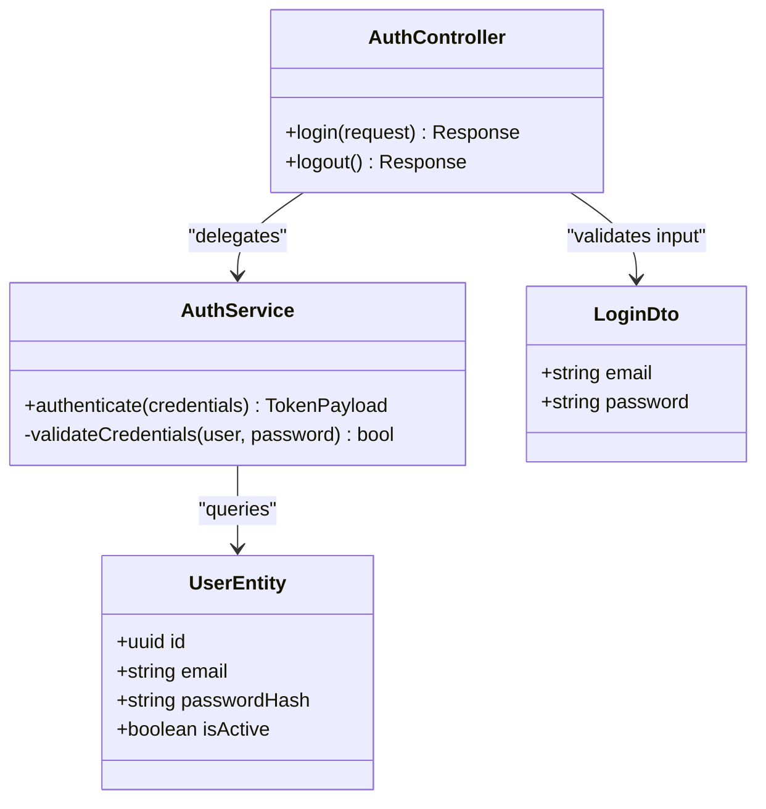
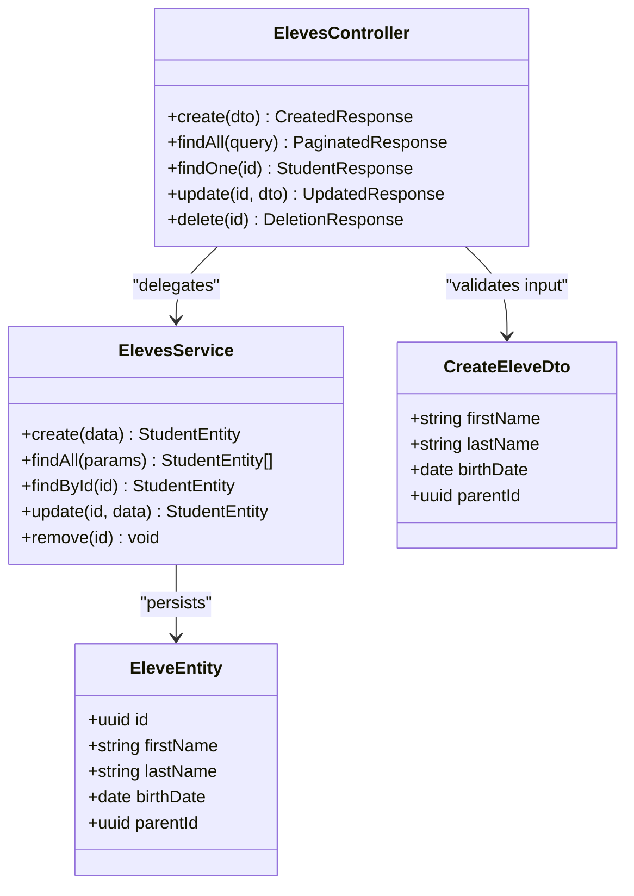
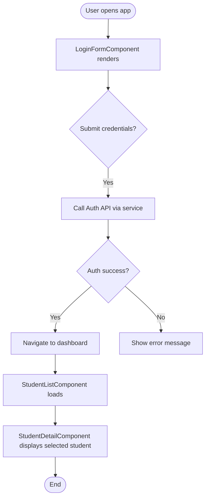
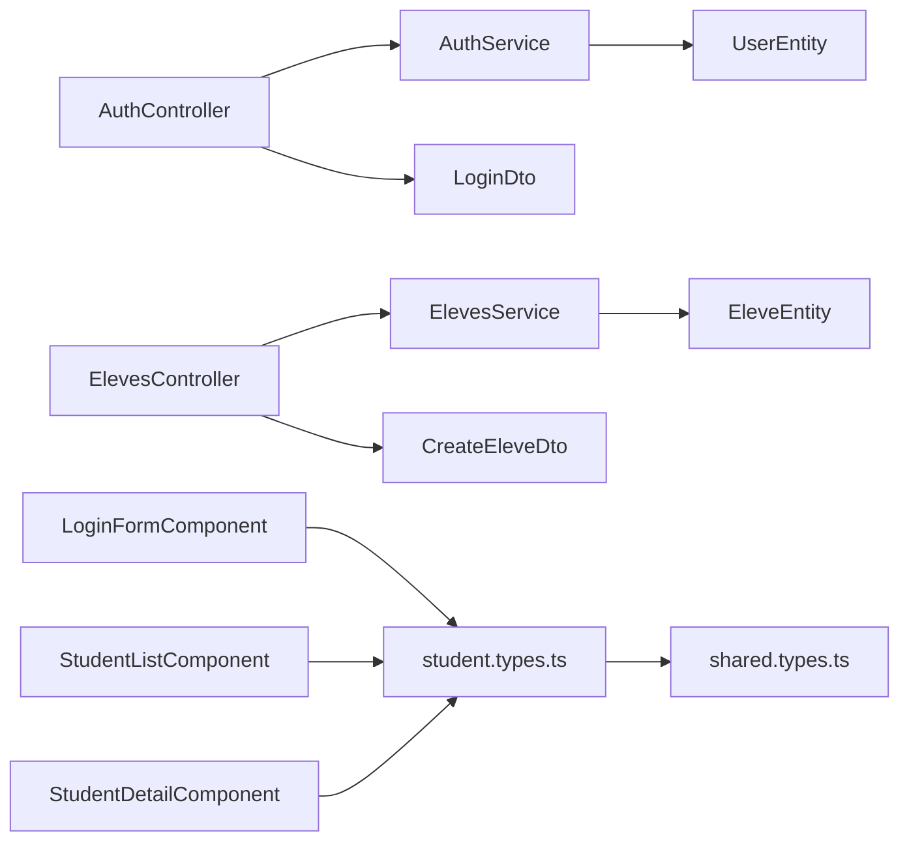

# Class & Interface Naming

<cite>
**Referenced Files in This Document**
- [backend/src/modules/auth/controllers/auth.controller.ts](file://backend/src/modules/auth/controllers/auth.controller.ts)
- [backend/src/modules/auth/services/auth.service.ts](file://backend/src/modules/auth/services/auth.service.ts)
- [backend/src/modules/auth/dto/login.dto.ts](file://backend/src/modules/auth/dto/login.dto.ts)
- [backend/src/modules/auth/entities/user.entity.ts](file://backend/src/modules/auth/entities/user.entity.ts)
- [backend/src/modules/eleves/controllers/eleves.controller.ts](file://backend/src/modules/eleves/controllers/eleves.controller.ts)
- [backend/src/modules/eleves/services/eleves.service.ts](file://backend/src/modules/eleves/services/eleves.service.ts)
- [backend/src/modules/eleves/dto/create-eleve.dto.ts](file://backend/src/modules/eleves/dto/create-eleve.dto.ts)
- [backend/src/modules/eleves/entities/eleve.entity.ts](file://backend/src/modules/eleves/entities/eleve.entity.ts)
- [backend/src/common/types/pagination.type.ts](file://backend/src/common/types/pagination.type.ts)
- [frontend/src/features/auth/components/LoginFormComponent.tsx](file://frontend/src/features/auth/components/LoginFormComponent.tsx)
- [frontend/src/features/students/components/StudentListComponent.tsx](file://frontend/src/features/students/components/StudentListComponent.tsx)
- [frontend/src/features/students/components/StudentDetailComponent.tsx](file://frontend/src/features/students/components/StudentDetailComponent.tsx)
- [frontend/src/types/student.types.ts](file://frontend/src/types/student.types.ts)
- [shared/src/types/shared.types.ts](file://shared/src/types/shared.types.ts)
</cite>

## Table of Contents
1. [Introduction](#introduction)
2. [Project Structure](#project-structure)
3. [Core Components](#core-components)
4. [Architecture Overview](#architecture-overview)
5. [Detailed Component Analysis](#detailed-component-analysis)
6. [Dependency Analysis](#dependency-analysis)
7. [Performance Considerations](#performance-considerations)
8. [Troubleshooting Guide](#troubleshooting-guide)
9. [Conclusion](#conclusion)
10. [Appendices](#appendices)

## Introduction
This document defines the class and interface naming conventions for eLISAschool across backend (NestJS), frontend (React), and shared types. It establishes consistent patterns for:
- Classes and interfaces using PascalCase
- DTOs with a clear suffix pattern
- Entities with an explicit Entity suffix
- React components with a Component suffix
- Shared types and utilities that remain consistent across layers

The goal is to improve readability, reduce ambiguity, and ensure uniformity across modules and teams.

## Project Structure
eLISAschool follows a modular architecture:
- Backend NestJS modules under backend/src/modules/<module>/ with controllers, services, DTOs, entities, guards, interceptors, etc.
- Frontend features under frontend/src/features/<feature>/ with components, hooks, services, and feature-specific types.
- Shared types and constants under shared/src/types and shared/src/constants.

[No sources needed since this diagram shows conceptual structure]

## Core Components
Naming conventions overview:
- Classes and Interfaces: PascalCase (e.g., UserService, StudentInterface, AuthGuard)
- DTOs: <Action><Entity>Dto (e.g., CreateUserDto, UpdateStudentDto)
- Entities: <Entity>Entity (e.g., UserEntity, StudentEntity)
- Controllers: <Entity>Controller (e.g., AuthController, ElevesController)
- Services: <Entity>Service (e.g., AuthService, ElevesService)
- Guards: <Feature>Guard (e.g., AuthGuard, RequirePermissionGuard)
- Interceptors: <Feature>Interceptor (e.g., LoggingInterceptor)
- Pipes: <Validation>Pipe (e.g., ParseIdPipe)
- Filters: <Error>Filter (e.g., HttpExceptionFilter)
- React Components: <Name>Component (e.g., LoginFormComponent, StudentListComponent)
- Hooks: use<Entity>Action (e.g., useLogin, useFetchStudents)
- Shared Types: PascalCase nouns or descriptive names (e.g., PaginationParams, ApiResponse<T>)

Examples from the codebase:
- Controller: AuthController, ElevesController
- Service: AuthService, ElevesService
- DTO: LoginDto, CreateEleveDto
- Entity: UserEntity, EleveEntity
- Component: LoginFormComponent, StudentListComponent, StudentDetailComponent
- Shared Type: PaginationParams

These examples demonstrate consistent PascalCase usage and suffixes that clarify purpose and layer.

**Section sources**
- [backend/src/modules/auth/controllers/auth.controller.ts](file://backend/src/modules/auth/controllers/auth.controller.ts)
- [backend/src/modules/auth/services/auth.service.ts](file://backend/src/modules/auth/services/auth.service.ts)
- [backend/src/modules/auth/dto/login.dto.ts](file://backend/src/modules/auth/dto/login.dto.ts)
- [backend/src/modules/auth/entities/user.entity.ts](file://backend/src/modules/auth/entities/user.entity.ts)
- [backend/src/modules/eleves/controllers/eleves.controller.ts](file://backend/src/modules/eleves/controllers/eleves.controller.ts)
- [backend/src/modules/eleves/services/eleves.service.ts](file://backend/src/modules/eleves/services/eleves.service.ts)
- [backend/src/modules/eleves/dto/create-eleve.dto.ts](file://backend/src/modules/eleves/dto/create-eleve.dto.ts)
- [backend/src/modules/eleves/entities/eleve.entity.ts](file://backend/src/modules/eleves/entities/eleve.entity.ts)
- [backend/src/common/types/pagination.type.ts](file://backend/src/common/types/pagination.type.ts)
- [frontend/src/features/auth/components/LoginFormComponent.tsx](file://frontend/src/features/auth/components/LoginFormComponent.tsx)
- [frontend/src/features/students/components/StudentListComponent.tsx](file://frontend/src/features/students/components/StudentListComponent.tsx)
- [frontend/src/features/students/components/StudentDetailComponent.tsx](file://frontend/src/features/students/components/StudentDetailComponent.tsx)
- [frontend/src/types/student.types.ts](file://frontend/src/types/student.types.ts)
- [shared/src/types/shared.types.ts](file://shared/src/types/shared.types.ts)

## Architecture Overview
High-level flow illustrating how naming aligns with responsibilities:
- Controllers expose endpoints and delegate to services
- Services implement business logic and interact with repositories/entities
- DTOs define request/response contracts
- Entities represent persistence models
- Frontend components consume typed APIs and display data

**Diagram sources**
- [backend/src/modules/auth/controllers/auth.controller.ts](file://backend/src/modules/auth/controllers/auth.controller.ts)
- [backend/src/modules/auth/services/auth.service.ts](file://backend/src/modules/auth/services/auth.service.ts)
- [backend/src/modules/auth/entities/user.entity.ts](file://backend/src/modules/auth/entities/user.entity.ts)
- [backend/src/common/types/pagination.type.ts](file://backend/src/common/types/pagination.type.ts)
- [frontend/src/features/auth/components/LoginFormComponent.tsx](file://frontend/src/features/auth/components/LoginFormComponent.tsx)

## Detailed Component Analysis

### Backend: Auth Module
- Controller: AuthController handles authentication endpoints and delegates to AuthService.
- Service: AuthService implements login logic and returns tokens.
- DTO: LoginDto validates incoming credentials.
- Entity: UserEntity represents the persisted user model.

**Diagram sources**
- [backend/src/modules/auth/controllers/auth.controller.ts](file://backend/src/modules/auth/controllers/auth.controller.ts)
- [backend/src/modules/auth/services/auth.service.ts](file://backend/src/modules/auth/services/auth.service.ts)
- [backend/src/modules/auth/dto/login.dto.ts](file://backend/src/modules/auth/dto/login.dto.ts)
- [backend/src/modules/auth/entities/user.entity.ts](file://backend/src/modules/auth/entities/user.entity.ts)

**Section sources**
- [backend/src/modules/auth/controllers/auth.controller.ts](file://backend/src/modules/auth/controllers/auth.controller.ts)
- [backend/src/modules/auth/services/auth.service.ts](file://backend/src/modules/auth/services/auth.service.ts)
- [backend/src/modules/auth/dto/login.dto.ts](file://backend/src/modules/auth/dto/login.dto.ts)
- [backend/src/modules/auth/entities/user.entity.ts](file://backend/src/modules/auth/entities/user.entity.ts)

### Backend: Eleves Module
- Controller: ElevesController exposes CRUD endpoints for students.
- Service: ElevesService orchestrates student operations.
- DTO: CreateEleveDto defines creation payload.
- Entity: EleveEntity maps to the database table.

**Diagram sources**
- [backend/src/modules/eleves/controllers/eleves.controller.ts](file://backend/src/modules/eleves/controllers/eleves.controller.ts)
- [backend/src/modules/eleves/services/eleves.service.ts](file://backend/src/modules/eleves/services/eleves.service.ts)
- [backend/src/modules/eleves/dto/create-eleve.dto.ts](file://backend/src/modules/eleves/dto/create-eleve.dto.ts)
- [backend/src/modules/eleves/entities/eleve.entity.ts](file://backend/src/modules/eleves/entities/eleve.entity.ts)

**Section sources**
- [backend/src/modules/eleves/controllers/eleves.controller.ts](file://backend/src/modules/eleves/controllers/eleves.controller.ts)
- [backend/src/modules/eleves/services/eleves.service.ts](file://backend/src/modules/eleves/services/eleves.service.ts)
- [backend/src/modules/eleves/dto/create-eleve.dto.ts](file://backend/src/modules/eleves/dto/create-eleve.dto.ts)
- [backend/src/modules/eleves/entities/eleve.entity.ts](file://backend/src/modules/eleves/entities/eleve.entity.ts)

### Frontend: Auth and Students Features
- Components: LoginFormComponent, StudentListComponent, StudentDetailComponent follow PascalCase with Component suffix.
- Types: student.types.ts provides feature-specific types; shared.types.ts provides cross-cutting types.

**Diagram sources**
- [frontend/src/features/auth/components/LoginFormComponent.tsx](file://frontend/src/features/auth/components/LoginFormComponent.tsx)
- [frontend/src/features/students/components/StudentListComponent.tsx](file://frontend/src/features/students/components/StudentListComponent.tsx)
- [frontend/src/features/students/components/StudentDetailComponent.tsx](file://frontend/src/features/students/components/StudentDetailComponent.tsx)

**Section sources**
- [frontend/src/features/auth/components/LoginFormComponent.tsx](file://frontend/src/features/auth/components/LoginFormComponent.tsx)
- [frontend/src/features/students/components/StudentListComponent.tsx](file://frontend/src/features/students/components/StudentListComponent.tsx)
- [frontend/src/features/students/components/StudentDetailComponent.tsx](file://frontend/src/features/students/components/StudentDetailComponent.tsx)
- [frontend/src/types/student.types.ts](file://frontend/src/types/student.types.ts)
- [shared/src/types/shared.types.ts](file://shared/src/types/shared.types.ts)

## Dependency Analysis
Naming conventions help visualize dependencies and reduce coupling:
- Controllers depend on Services and DTOs
- Services depend on Entities and shared types
- Frontend components depend on feature types and shared types

**Diagram sources**
- [backend/src/modules/auth/controllers/auth.controller.ts](file://backend/src/modules/auth/controllers/auth.controller.ts)
- [backend/src/modules/auth/services/auth.service.ts](file://backend/src/modules/auth/services/auth.service.ts)
- [backend/src/modules/auth/dto/login.dto.ts](file://backend/src/modules/auth/dto/login.dto.ts)
- [backend/src/modules/auth/entities/user.entity.ts](file://backend/src/modules/auth/entities/user.entity.ts)
- [backend/src/modules/eleves/controllers/eleves.controller.ts](file://backend/src/modules/eleves/controllers/eleves.controller.ts)
- [backend/src/modules/eleves/services/eleves.service.ts](file://backend/src/modules/eleves/services/eleves.service.ts)
- [backend/src/modules/eleves/dto/create-eleve.dto.ts](file://backend/src/modules/eleves/dto/create-eleve.dto.ts)
- [backend/src/modules/eleves/entities/eleve.entity.ts](file://backend/src/modules/eleves/entities/eleve.entity.ts)
- [frontend/src/features/auth/components/LoginFormComponent.tsx](file://frontend/src/features/auth/components/LoginFormComponent.tsx)
- [frontend/src/features/students/components/StudentListComponent.tsx](file://frontend/src/features/students/components/StudentListComponent.tsx)
- [frontend/src/features/students/components/StudentDetailComponent.tsx](file://frontend/src/features/students/components/StudentDetailComponent.tsx)
- [frontend/src/types/student.types.ts](file://frontend/src/types/student.types.ts)
- [shared/src/types/shared.types.ts](file://shared/src/types/shared.types.ts)

**Section sources**
- [backend/src/modules/auth/controllers/auth.controller.ts](file://backend/src/modules/auth/controllers/auth.controller.ts)
- [backend/src/modules/auth/services/auth.service.ts](file://backend/src/modules/auth/services/auth.service.ts)
- [backend/src/modules/auth/dto/login.dto.ts](file://backend/src/modules/auth/dto/login.dto.ts)
- [backend/src/modules/auth/entities/user.entity.ts](file://backend/src/modules/auth/entities/user.entity.ts)
- [backend/src/modules/eleves/controllers/eleves.controller.ts](file://backend/src/modules/eleves/controllers/eleves.controller.ts)
- [backend/src/modules/eleves/services/eleves.service.ts](file://backend/src/modules/eleves/services/eleves.service.ts)
- [backend/src/modules/eleves/dto/create-eleve.dto.ts](file://backend/src/modules/eleves/dto/create-eleve.dto.ts)
- [backend/src/modules/eleves/entities/eleve.entity.ts](file://backend/src/modules/eleves/entities/eleve.entity.ts)
- [frontend/src/features/auth/components/LoginFormComponent.tsx](file://frontend/src/features/auth/components/LoginFormComponent.tsx)
- [frontend/src/features/students/components/StudentListComponent.tsx](file://frontend/src/features/students/components/StudentListComponent.tsx)
- [frontend/src/features/students/components/StudentDetailComponent.tsx](file://frontend/src/features/students/components/StudentDetailComponent.tsx)
- [frontend/src/types/student.types.ts](file://frontend/src/types/student.types.ts)
- [shared/src/types/shared.types.ts](file://shared/src/types/shared.types.ts)

## Performance Considerations
- Keep DTOs minimal to reduce serialization overhead.
- Use specific entity fields in responses to avoid over-fetching.
- Prefer typed shared types to minimize runtime validation costs.
- Avoid unnecessary re-renders in React components by memoizing derived data.

[No sources needed since this section provides general guidance]

## Troubleshooting Guide
Common issues related to naming and typing:
- Mismatched DTO field names causing validation errors
- Inconsistent entity property casing leading to mapping failures
- Frontend type mismatches resulting in runtime errors
- Guard/service/controller naming inconsistencies making debugging harder

Recommendations:
- Enforce linters and formatters to catch naming deviations early
- Use strict TypeScript settings to highlight type mismatches
- Centralize shared types to prevent duplication and drift

[No sources needed since this section provides general guidance]

## Conclusion
Adopting consistent PascalCase for classes and interfaces, explicit suffixes for DTOs and entities, and clear component naming improves clarity and maintainability across eLISAschool. The provided examples from NestJS controllers, services, entities, React components, and shared types illustrate these patterns in practice.

[No sources needed since this section summarizes without analyzing specific files]

## Appendices

### Quick Reference Table
- Classes and Interfaces: PascalCase (e.g., UserService, StudentInterface, AuthGuard)
- DTOs: <Action><Entity>Dto (e.g., CreateUserDto, UpdateStudentDto)
- Entities: <Entity>Entity (e.g., UserEntity, StudentEntity)
- Controllers: <Entity>Controller (e.g., AuthController, ElevesController)
- Services: <Entity>Service (e.g., AuthService, ElevesService)
- Guards: <Feature>Guard (e.g., AuthGuard, RequirePermissionGuard)
- Interceptors: <Feature>Interceptor (e.g., LoggingInterceptor)
- Pipes: <Validation>Pipe (e.g., ParseIdPipe)
- Filters: <Error>Filter (e.g., HttpExceptionFilter)
- React Components: <Name>Component (e.g., LoginFormComponent, StudentListComponent)
- Hooks: use<Entity>Action (e.g., useLogin, useFetchStudents)
- Shared Types: PascalCase nouns (e.g., PaginationParams, ApiResponse<T>)

[No sources needed since this section provides general guidance]