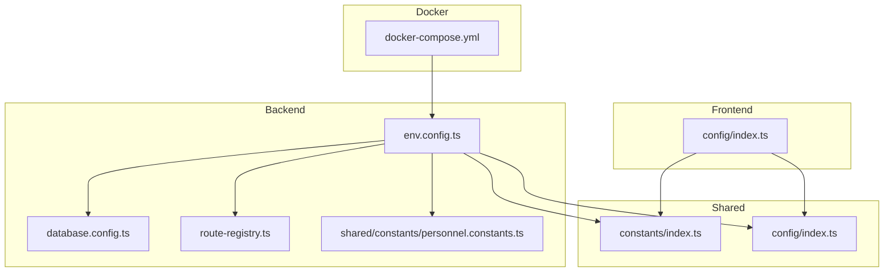
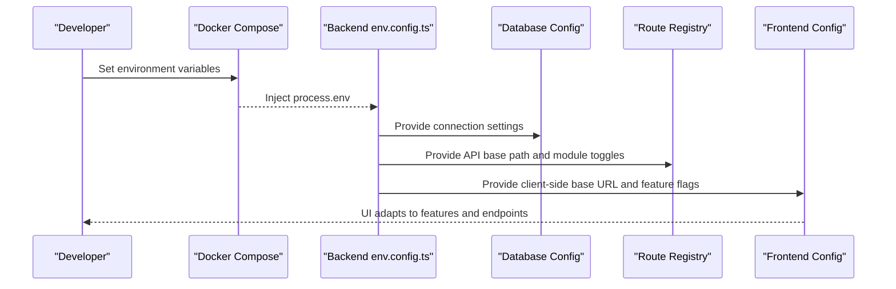
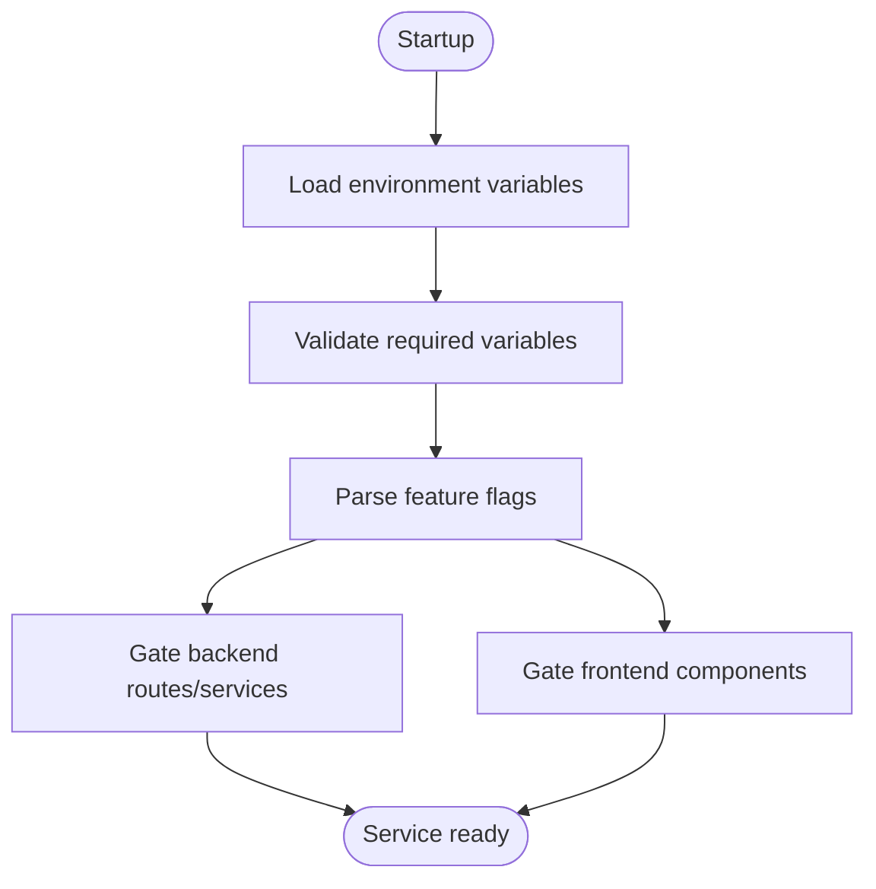
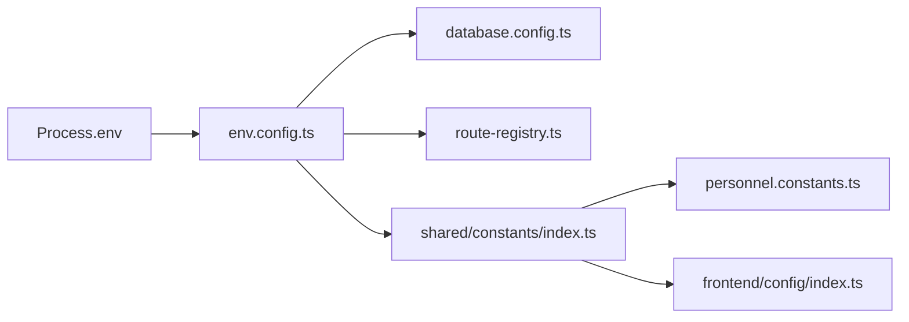

# Constants & Environment Variables

<cite>
**Referenced Files in This Document**
- [backend/src/config/env.config.ts](file://backend/src/config/env.config.ts)
- [backend/src/config/database.config.ts](file://backend/src/config/database.config.ts)
- [backend/src/shared/constants/personnel.constants.ts](file://backend/src/shared/constants/personnel.constants.ts)
- [shared/src/constants/index.ts](file://shared/src/constants/index.ts)
- [shared/src/config/index.ts](file://shared/src/config/index.ts)
- [frontend/src/config/index.ts](file://frontend/src/config/index.ts)
- [backend/src/routes/route-registry.ts](file://backend/src/routes/route-registry.ts)
- [docker/docker-compose.yml](file://docker/docker-compose.yml)
</cite>

## Table of Contents
1. [Introduction](#introduction)
2. [Project Structure](#project-structure)
3. [Core Components](#core-components)
4. [Architecture Overview](#architecture-overview)
5. [Detailed Component Analysis](#detailed-component-analysis)
6. [Dependency Analysis](#dependency-analysis)
7. [Performance Considerations](#performance-considerations)
8. [Troubleshooting Guide](#troubleshooting-guide)
9. [Conclusion](#conclusion)

## Introduction
This document defines the naming conventions and patterns for constants, environment variables, configuration keys, feature flags, and API endpoints across eLISAschool’s backend, shared library, and frontend. It provides consistent examples to ensure uniformity between services and UI layers.

## Project Structure
The project organizes configuration and constants as follows:
- Backend configuration is centralized under backend/src/config.
- Shared constants and configuration are exposed via shared/src.
- Frontend configuration is isolated under frontend/src/config.
- API routes are registered centrally in backend/src/routes.
- Docker Compose defines runtime environment variables.

**Diagram sources**
- [backend/src/config/env.config.ts](file://backend/src/config/env.config.ts)
- [backend/src/config/database.config.ts](file://backend/src/config/database.config.ts)
- [backend/src/routes/route-registry.ts](file://backend/src/routes/route-registry.ts)
- [backend/src/shared/constants/personnel.constants.ts](file://backend/src/shared/constants/personnel.constants.ts)
- [shared/src/constants/index.ts](file://shared/src/constants/index.ts)
- [shared/src/config/index.ts](file://shared/src/config/index.ts)
- [frontend/src/config/index.ts](file://frontend/src/config/index.ts)
- [docker/docker-compose.yml](file://docker/docker-compose.yml)

**Section sources**
- [backend/src/config/env.config.ts](file://backend/src/config/env.config.ts)
- [backend/src/config/database.config.ts](file://backend/src/config/database.config.ts)
- [backend/src/routes/route-registry.ts](file://backend/src/routes/route-registry.ts)
- [backend/src/shared/constants/personnel.constants.ts](file://backend/src/shared/constants/personnel.constants.ts)
- [shared/src/constants/index.ts](file://shared/src/constants/index.ts)
- [shared/src/config/index.ts](file://shared/src/config/index.ts)
- [frontend/src/config/index.ts](file://frontend/src/config/index.ts)
- [docker/docker-compose.yml](file://docker/docker-compose.yml)

## Core Components
- Environment loader (backend): Reads process.env and exposes typed values used by database, routes, and modules.
- Database config (backend): Consumes environment variables for connection parameters.
- Shared constants (shared + backend): Centralized constant definitions consumed by both backend and frontend.
- Frontend config (frontend): Exposes client-facing configuration derived from environment variables.
- Route registry (backend): Defines API endpoint patterns and prefixes.
- Docker Compose: Declares environment variables for local/CI runs.

Key naming conventions:
- Constants: UPPER_SNAKE_CASE (e.g., MAX_LOGIN_ATTEMPTS, DATABASE_URL).
- Configuration keys: dot-notation lowercase with underscores for multi-word segments (e.g., app.name, database.host).
- Feature flags: ENABLE_<FEATURE>, <MODULE>_ACTIVE (e.g., ENABLE_NOTIFICATIONS, MODULE_FINANCES_ACTIVE).
- API endpoints: RESTful paths using kebab-case nouns and HTTP verbs (e.g., GET /api/v1/auth/login, POST /api/v1/modules/finances/students).

Examples from code locations:
- Environment variable names and usage: [backend/src/config/env.config.ts](file://backend/src/config/env.config.ts), [backend/src/config/database.config.ts](file://backend/src/config/database.config.ts), [docker/docker-compose.yml](file://docker/docker-compose.yml).
- Shared constants: [shared/src/constants/index.ts](file://shared/src/constants/index.ts), [backend/src/shared/constants/personnel.constants.ts](file://backend/src/shared/constants/personnel.constants.ts).
- Frontend configuration: [frontend/src/config/index.ts](file://frontend/src/config/index.ts).
- API route patterns: [backend/src/routes/route-registry.ts](file://backend/src/routes/route-registry.ts).

**Section sources**
- [backend/src/config/env.config.ts](file://backend/src/config/env.config.ts)
- [backend/src/config/database.config.ts](file://backend/src/config/database.config.ts)
- [backend/src/shared/constants/personnel.constants.ts](file://backend/src/shared/constants/personnel.constants.ts)
- [shared/src/constants/index.ts](file://shared/src/constants/index.ts)
- [shared/src/config/index.ts](file://shared/src/config/index.ts)
- [frontend/src/config/index.ts](file://frontend/src/config/index.ts)
- [backend/src/routes/route-registry.ts](file://backend/src/routes/route-registry.ts)
- [docker/docker-compose.yml](file://docker/docker-compose.yml)

## Architecture Overview
Environment-driven architecture ensures that runtime behavior is controlled by environment variables, while shared constants provide compile-time stability across layers.

**Diagram sources**
- [docker/docker-compose.yml](file://docker/docker-compose.yml)
- [backend/src/config/env.config.ts](file://backend/src/config/env.config.ts)
- [backend/src/config/database.config.ts](file://backend/src/config/database.config.ts)
- [backend/src/routes/route-registry.ts](file://backend/src/routes/route-registry.ts)
- [frontend/src/config/index.ts](file://frontend/src/config/index.ts)

## Detailed Component Analysis

### Environment Variables (Backend)
- Naming: UPPER_SNAKE_CASE for all environment variables.
- Categories:
  - Application: APP_NAME, APP_PORT, APP_ENV, APP_BASE_URL.
  - Database: DATABASE_URL, DATABASE_HOST, DATABASE_PORT, DATABASE_NAME, DATABASE_USER, DATABASE_PASSWORD.
  - Security: JWT_SECRET, JWT_EXPIRES_IN, PASSWORD_MIN_LENGTH, MAX_LOGIN_ATTEMPTS.
  - Modules/Features: ENABLE_NOTIFICATIONS, MODULE_FINANCES_ACTIVE, MODULE_PERSONNEL_RH_ACTIVE.
  - External Services: SMTP_HOST, SMTP_PORT, SMTP_USER, SMTP_PASSWORD, REDIS_URL.
- Validation: The environment loader should validate presence and types at startup; fail fast on missing critical values.

Examples and references:
- [backend/src/config/env.config.ts](file://backend/src/config/env.config.ts)
- [backend/src/config/database.config.ts](file://backend/src/config/database.config.ts)
- [docker/docker-compose.yml](file://docker/docker-compose.yml)

**Section sources**
- [backend/src/config/env.config.ts](file://backend/src/config/env.config.ts)
- [backend/src/config/database.config.ts](file://backend/src/config/database.config.ts)
- [docker/docker-compose.yml](file://docker/docker-compose.yml)

### Configuration Keys (Dot Notation)
- Pattern: lowercase with underscores for multi-word segments, dot-separated hierarchy.
- Examples:
  - app.name, app.port, app.base_url
  - database.host, database.port, database.name
  - security.jwt_secret, security.max_login_attempts
  - modules.notifications.enabled, modules.finances.active
- Usage:
  - Backend reads these keys from environment or a configuration store and maps them to typed objects.
  - Frontend reads corresponding keys for UI behavior and routing.

References:
- [shared/src/config/index.ts](file://shared/src/config/index.ts)
- [frontend/src/config/index.ts](file://frontend/src/config/index.ts)

**Section sources**
- [shared/src/config/index.ts](file://shared/src/config/index.ts)
- [frontend/src/config/index.ts](file://frontend/src/config/index.ts)

### Shared Constants
- Naming: UPPER_SNAKE_CASE for string literals and numeric limits.
- Categories:
  - API: API_VERSION, API_PREFIX, API_BASE_PATH.
  - Auth: TOKEN_TYPE, TOKEN_HEADER, MAX_LOGIN_ATTEMPTS, LOCKOUT_WINDOW_SECONDS.
  - Modules: MODULE_FINANCES_ACTIVE, MODULE_PERSONNEL_RH_ACTIVE.
  - UI/UX: DEFAULT_LOCALE, THEME_DEFAULT.
- Consumption:
  - Backend uses constants for route registration and validation.
  - Frontend imports shared constants to align UI behavior and API calls.

References:
- [shared/src/constants/index.ts](file://shared/src/constants/index.ts)
- [backend/src/shared/constants/personnel.constants.ts](file://backend/src/shared/constants/personnel.constants.ts)

**Section sources**
- [shared/src/constants/index.ts](file://shared/src/constants/index.ts)
- [backend/src/shared/constants/personnel.constants.ts](file://backend/src/shared/constants/personnel.constants.ts)

### Feature Flags
- Naming:
  - Global toggles: ENABLE_<FEATURE> (e.g., ENABLE_NOTIFICATIONS).
  - Module toggles: MODULE_<NAME>_ACTIVE (e.g., MODULE_FINANCES_ACTIVE).
- Behavior:
  - Backend gates controllers/services behind flag checks.
  - Frontend hides/disables UI elements based on flags.
- Example mapping:
  - ENABLE_NOTIFICATIONS -> notifications module enabled.
  - MODULE_FINANCES_ACTIVE -> finances module routes and UI available.

References:
- [backend/src/shared/constants/personnel.constants.ts](file://backend/src/shared/constants/personnel.constants.ts)
- [shared/src/constants/index.ts](file://shared/src/constants/index.ts)

**Section sources**
- [backend/src/shared/constants/personnel.constants.ts](file://backend/src/shared/constants/personnel.constants.ts)
- [shared/src/constants/index.ts](file://shared/src/constants/index.ts)

### API Endpoint Patterns
- Base path: /api/v1
- Resource naming: kebab-case plural nouns (e.g., students, classes, payments).
- Actions:
  - CRUD: GET /students, POST /students, PUT /students/:id, DELETE /students/:id.
  - Sub-resources: GET /classes/:classId/subjects.
  - Module-scoped: GET /modules/finances/invoices.
- Authentication: Protected endpoints require bearer token via Authorization header.

References:
- [backend/src/routes/route-registry.ts](file://backend/src/routes/route-registry.ts)

**Section sources**
- [backend/src/routes/route-registry.ts](file://backend/src/routes/route-registry.ts)

### End-to-End Flow: Feature Flag Activation

[No sources needed since this diagram shows conceptual workflow, not actual code structure]

## Dependency Analysis
Environment variables flow into configuration modules, which then influence database connectivity, route registration, and feature availability. Shared constants unify behavior across backend and frontend.

**Diagram sources**
- [backend/src/config/env.config.ts](file://backend/src/config/env.config.ts)
- [backend/src/config/database.config.ts](file://backend/src/config/database.config.ts)
- [backend/src/routes/route-registry.ts](file://backend/src/routes/route-registry.ts)
- [shared/src/constants/index.ts](file://shared/src/constants/index.ts)
- [backend/src/shared/constants/personnel.constants.ts](file://backend/src/shared/constants/personnel.constants.ts)
- [frontend/src/config/index.ts](file://frontend/src/config/index.ts)

**Section sources**
- [backend/src/config/env.config.ts](file://backend/src/config/env.config.ts)
- [backend/src/config/database.config.ts](file://backend/src/config/database.config.ts)
- [backend/src/routes/route-registry.ts](file://backend/src/routes/route-registry.ts)
- [shared/src/constants/index.ts](file://shared/src/constants/index.ts)
- [backend/src/shared/constants/personnel.constants.ts](file://backend/src/shared/constants/personnel.constants.ts)
- [frontend/src/config/index.ts](file://frontend/src/config/index.ts)

## Performance Considerations
- Avoid repeated environment parsing: cache parsed values at startup.
- Use boolean flags for feature toggles to minimize conditional branching overhead.
- Keep API base paths stable to reduce client-side reconfiguration costs.
- Prefer shared constants over inline strings to enable compiler optimizations and tree-shaking.

[No sources needed since this section provides general guidance]

## Troubleshooting Guide
Common issues and resolutions:
- Missing environment variables: Ensure docker-compose.yml and deployment environments define all required variables.
- Invalid database credentials: Verify DATABASE_* variables match the running database instance.
- Feature flags not taking effect: Confirm flag names match convention (ENABLE_*, MODULE_*_ACTIVE) and are set correctly in environment.
- API mismatch between frontend and backend: Align API_PREFIX and versioning constants across shared and frontend configs.

Validation checklist:
- All required variables present and non-empty.
- Types coerced correctly (numbers, booleans).
- Feature flags consistently named and checked in both backend and frontend.

**Section sources**
- [docker/docker-compose.yml](file://docker/docker-compose.yml)
- [backend/src/config/env.config.ts](file://backend/src/config/env.config.ts)
- [backend/src/config/database.config.ts](file://backend/src/config/database.config.ts)
- [shared/src/constants/index.ts](file://shared/src/constants/index.ts)
- [frontend/src/config/index.ts](file://frontend/src/config/index.ts)

## Conclusion
Adopting consistent naming for constants, environment variables, configuration keys, feature flags, and API endpoints improves reliability, maintainability, and cross-layer alignment. Centralize definitions in shared modules, validate environment inputs early, and gate features explicitly to keep the system predictable and easy to operate.