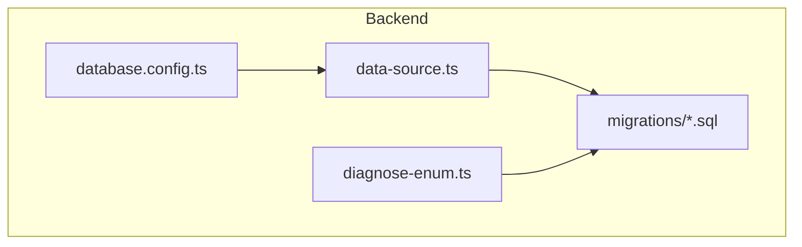
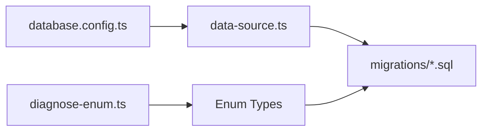

# Database Naming Conventions

<cite>
**Referenced Files in This Document**
- [database.config.ts](file://backend/src/config/database.config.ts)
- [data-source.ts](file://backend/src/database/data-source.ts)
- [036-module-types-enum.sql](file://backend/database/migrations/036-module-types-enum.sql)
- [058-multi-tenant-structure-academique.sql](file://backend/database/migrations/058-multi-tenant-structure-academique.sql)
- [088-refactorisation-architecture-academique.sql](file://backend/database/migrations/088-refactorisation-architecture-academique.sql)
- [090-correction-migration-088-camelcase.sql](file://backend/database/migrations/090-correction-migration-088-camelcase.sql)
- [104-refonte-periodes-niveaux-configurables.sql](file://backend/database/migrations/104-refonte-periodes-niveaux-configurables.sql)
- [diagnose-enum.ts](file://backend/src/database/diagnose-enum.ts)
</cite>

## Table of Contents
1. [Introduction](#introduction)
2. [Project Structure](#project-structure)
3. [Core Components](#core-components)
4. [Architecture Overview](#architecture-overview)
5. [Detailed Component Analysis](#detailed-component-analysis)
6. [Dependency Analysis](#dependency-analysis)
7. [Performance Considerations](#performance-considerations)
8. [Troubleshooting Guide](#troubleshooting-guide)
9. [Conclusion](#conclusion)

## Introduction
This document defines the database naming conventions for eLISAschool, focusing on:
- snake_case for tables and columns
- Foreign key naming patterns
- Migration file naming
- Enum naming patterns
- Multi-tenant educational data structures

The conventions are derived from existing TypeORM configuration, SQL migrations, and enum handling utilities within the repository.

## Project Structure
Database-related artifacts relevant to naming conventions are primarily located under:
- backend/src/config/database.config.ts: TypeORM connection and naming options
- backend/src/database/data-source.ts: TypeORM DataSource setup
- backend/database/migrations/*.sql: SQL migration files that define schema and enums
- backend/src/database/diagnose-enum.ts: Utility used to diagnose enum types



**Diagram sources**
- [database.config.ts](file://backend/src/config/database.config.ts)
- [data-source.ts](file://backend/src/database/data-source.ts)
- [036-module-types-enum.sql](file://backend/database/migrations/036-module-types-enum.sql)
- [diagnose-enum.ts](file://backend/src/database/diagnose-enum.ts)

**Section sources**
- [database.config.ts](file://backend/src/config/database.config.ts)
- [data-source.ts](file://backend/src/database/data-source.ts)

## Core Components
- TypeORM configuration and DataSource establish how entities map to database objects and influence naming behavior.
- SQL migrations define actual table names, column names, foreign keys, and enum types.
- The enum diagnostic utility helps validate and inspect enum types across the system.

Key responsibilities:
- Enforce consistent naming via configuration and code style
- Provide clear examples through migrations
- Support multi-tenant educational domains (e.g., academic structure, periods, levels)

**Section sources**
- [database.config.ts](file://backend/src/config/database.config.ts)
- [data-source.ts](file://backend/src/database/data-source.ts)
- [036-module-types-enum.sql](file://backend/database/migrations/036-module-types-enum.sql)
- [058-multi-tenant-structure-academique.sql](file://backend/database/migrations/058-multi-tenant-structure-academique.sql)
- [088-refactorisation-architecture-academique.sql](file://backend/database/migrations/088-refactorisation-architecture-academique.sql)
- [090-correction-migration-088-camelcase.sql](file://backend/database/migrations/090-correction-migration-088-camelcase.sql)
- [104-refonte-periodes-niveaux-configurables.sql](file://backend/database/migrations/104-refonte-periodes-niveaux-configurables.sql)
- [diagnose-enum.ts](file://backend/src/database/diagnose-enum.ts)

## Architecture Overview
The database layer is driven by TypeORM configuration and realized through SQL migrations. Enums are defined in dedicated migrations and can be diagnosed using a utility script.

```mermaid
sequenceDiagram
participant Dev as "Developer"
participant ORM as "TypeORM Config"
participant DS as "DataSource"
participant MIG as "Migrations"
participant DB as "PostgreSQL"
Dev->>ORM : Configure naming strategy and options
ORM->>DS : Build DataSource with config
Dev->>MIG : Write SQL migration (snake_case)
MIG->>DB : Apply CREATE TABLE / ALTER TABLE / CREATE TYPE
Dev->>DS : Run app; ORM maps entities to DB
```

**Diagram sources**
- [database.config.ts](file://backend/src/config/database.config.ts)
- [data-source.ts](file://backend/src/database/data-source.ts)
- [036-module-types-enum.sql](file://backend/database/migrations/036-module-types-enum.sql)

## Detailed Component Analysis

### Tables and Columns: snake_case
- All table and column names should use snake_case consistently.
- Examples from migrations include academic structure and period/level configurations, which demonstrate pluralized table names and descriptive snake_case columns.

Guidelines:
- Use plural nouns for tables (e.g., users, student_registrations).
- Use lowercase with underscores for columns (e.g., first_name, created_at).
- Avoid abbreviations unless widely understood (e.g., id, uuid).

**Section sources**
- [058-multi-tenant-structure-academique.sql](file://backend/database/migrations/058-multi-tenant-structure-academique.sql)
- [088-refactorisation-architecture-academique.sql](file://backend/database/migrations/088-refactorisation-architecture-academique.sql)
- [104-refonte-periodes-niveaux-configurables.sql](file://backend/database/migrations/104-refonte-periodes-niveaux-configurables.sql)

### Foreign Keys: _id suffix
- Foreign key columns should follow the pattern <entity>_id (e.g., user_id, profile_id).
- Composite or contextual foreign keys may add prefixes when necessary (e.g., class_id, subject_id).

Guidelines:
- Keep FK names explicit and readable.
- Ensure referential integrity constraints are named clearly.

**Section sources**
- [088-refactorisation-architecture-academique.sql](file://backend/database/migrations/088-refactorisation-architecture-academique.sql)
- [104-refonte-periodes-niveaux-configurables.sql](file://backend/database/migrations/104-refonte-periodes-niveaux-configurables.sql)

### Migration File Naming
- Migrations are numbered sequentially and describe the change in plain English.
- Format: <NNN>-<short-description>.sql (e.g., 036-module-types-enum.sql).

Guidelines:
- Always increment the numeric prefix.
- Use hyphen-separated words describing the change.
- Group related changes into a single migration when possible.

**Section sources**
- [036-module-types-enum.sql](file://backend/database/migrations/036-module-types-enum.sql)
- [058-multi-tenant-structure-academique.sql](file://backend/database/migrations/058-multi-tenant-structure-academique.sql)
- [088-refactorisation-architecture-academique.sql](file://backend/database/migrations/088-refactorisation-architecture-academique.sql)
- [090-correction-migration-088-camelcase.sql](file://backend/database/migrations/090-correction-migration-088-camelcase.sql)
- [104-refonte-periodes-niveaux-configurables.sql](file://backend/database/migrations/104-refonte-periodes-niveaux-configurables.sql)

### Enum Naming Patterns
- Enum types are created explicitly in migrations and referenced by name.
- Prefer uppercase with underscores for enum values (e.g., ACTIVE, PENDING).
- Use domain-specific names for enum types (e.g., status_type, role_type).

Guidelines:
- Centralize enum definitions in dedicated migrations.
- Reference enums consistently across tables.
- Use the diagnostic utility to verify enum presence and usage.

**Section sources**
- [036-module-types-enum.sql](file://backend/database/migrations/036-module-types-enum.sql)
- [diagnose-enum.ts](file://backend/src/database/diagnose-enum.ts)

### Multi-Tenant Educational Data Structures
- Multi-tenancy is supported by including tenant identifiers (e.g., etablishment_id) where appropriate.
- Academic structure includes hierarchical entities such as cycles, levels, classes, and periods.

Guidelines:
- Include tenant-scoped IDs in relevant tables.
- Maintain clear relationships between academic entities.
- Normalize hierarchical data while keeping queries efficient.

**Section sources**
- [058-multi-tenant-structure-academique.sql](file://backend/database/migrations/058-multi-tenant-structure-academique.sql)
- [088-refactorisation-architecture-academique.sql](file://backend/database/migrations/088-refactorisation-architecture-academique.sql)

### TypeORM Configuration Influence on Naming
- TypeORM configuration and DataSource settings determine how entities map to database objects.
- Ensure naming strategies align with the snake_case convention.

Guidelines:
- Review configuration for any camelCase defaults and override to snake_case if needed.
- Validate that entity property names translate correctly to snake_case columns.

**Section sources**
- [database.config.ts](file://backend/src/config/database.config.ts)
- [data-source.ts](file://backend/src/database/data-source.ts)

## Dependency Analysis
The following diagram shows how configuration, DataSource, migrations, and enum diagnostics interact to enforce naming conventions.



**Diagram sources**
- [database.config.ts](file://backend/src/config/database.config.ts)
- [data-source.ts](file://backend/src/database/data-source.ts)
- [036-module-types-enum.sql](file://backend/database/migrations/036-module-types-enum.sql)
- [diagnose-enum.ts](file://backend/src/database/diagnose-enum.ts)

**Section sources**
- [database.config.ts](file://backend/src/config/database.config.ts)
- [data-source.ts](file://backend/src/database/data-source.ts)
- [036-module-types-enum.sql](file://backend/database/migrations/036-module-types-enum.sql)
- [diagnose-enum.ts](file://backend/src/database/diagnose-enum.ts)

## Performance Considerations
- Consistent naming improves query readability and maintainability.
- Properly named foreign keys enable clearer join conditions and better indexing strategies.
- Enum types reduce storage overhead and improve validation at the database level.

[No sources needed since this section provides general guidance]

## Troubleshooting Guide
Common issues and resolutions:
- CamelCase leakage: If migrations introduce camelCase, apply corrective migrations to rename to snake_case.
- Missing enums: Use the enum diagnostic utility to detect missing or mismatched enum types.
- FK mismatches: Verify foreign key names match the <entity>_id convention and reference correct parent tables.

Actions:
- Inspect recent migrations for naming inconsistencies.
- Re-run the enum diagnostic tool to confirm type availability.
- Update TypeORM configuration to enforce snake_case mapping.

**Section sources**
- [090-correction-migration-088-camelcase.sql](file://backend/database/migrations/090-correction-migration-088-camelcase.sql)
- [diagnose-enum.ts](file://backend/src/database/diagnose-enum.ts)

## Conclusion
Adhering to these naming conventions ensures clarity, consistency, and scalability across eLISAschool’s database layer. By standardizing table/column names, foreign keys, migration filenames, and enum patterns—and by leveraging TypeORM configuration—you can maintain a robust, multi-tenant educational data model.

[No sources needed since this section summarizes without analyzing specific files]