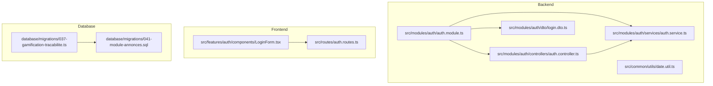
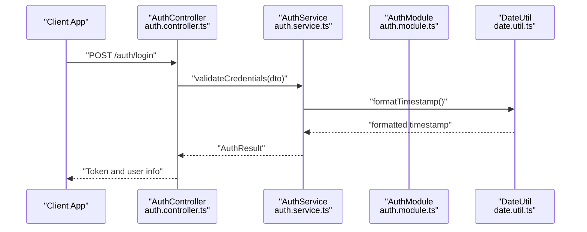
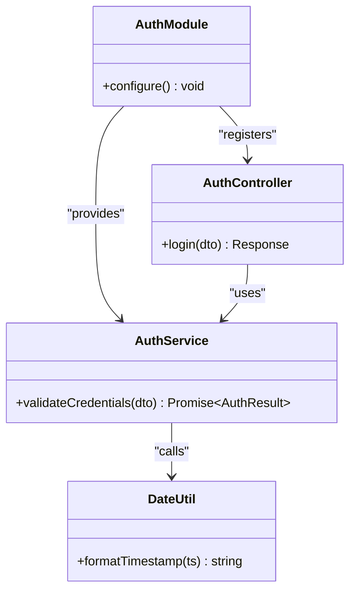
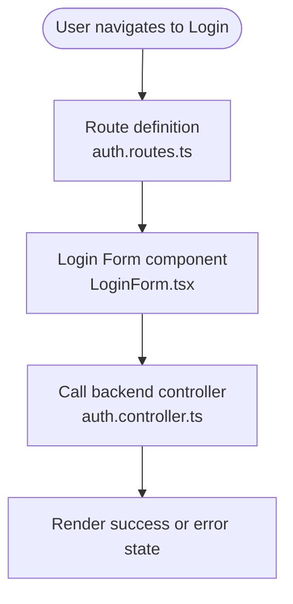
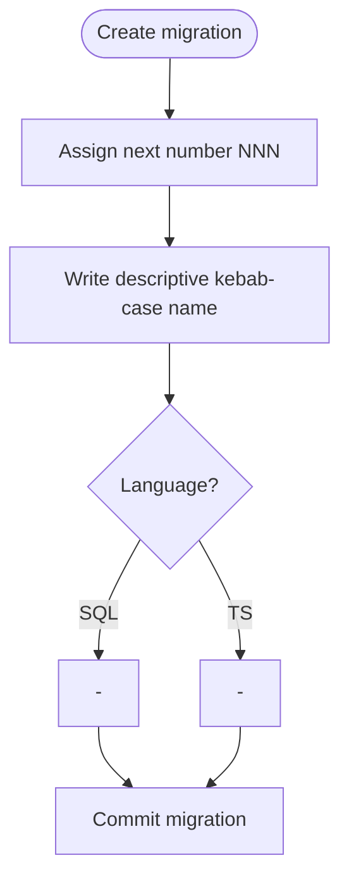
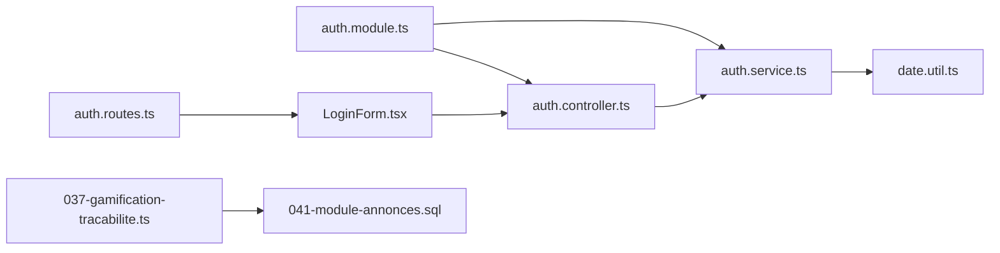

# File Naming Patterns

<cite>
**Referenced Files in This Document**
- [backend/src/modules/auth/controllers/auth.controller.ts](file://backend/src/modules/auth/controllers/auth.controller.ts)
- [backend/src/modules/auth/dto/login.dto.ts](file://backend/src/modules/auth/dto/login.dto.ts)
- [backend/src/modules/auth/services/auth.service.ts](file://backend/src/modules/auth/services/auth.service.ts)
- [backend/src/modules/auth/auth.module.ts](file://backend/src/modules/auth/auth.module.ts)
- [backend/src/common/utils/date.util.ts](file://backend/src/common/utils/date.util.ts)
- [backend/database/migrations/037-gamification-tracabilite.ts](file://backend/database/migrations/037-gamification-tracabilite.ts)
- [backend/database/migrations/041-module-annonces.sql](file://backend/database/migrations/041-module-annonces.sql)
- [frontend/src/features/auth/components/LoginForm.tsx](file://frontend/src/features/auth/components/LoginForm.tsx)
- [frontend/src/routes/auth.routes.ts](file://frontend/src/routes/auth.routes.ts)
</cite>

## Table of Contents
1. [Introduction](#introduction)
2. [Project Structure](#project-structure)
3. [Core Components](#core-components)
4. [Architecture Overview](#architecture-overview)
5. [Detailed Component Analysis](#detailed-component-analysis)
6. [Dependency Analysis](#dependency-analysis)
7. [Performance Considerations](#performance-considerations)
8. [Troubleshooting Guide](#troubleshooting-guide)
9. [Conclusion](#conclusion)

## Introduction
This document defines the file naming conventions for eLISAschool across backend (NestJS), frontend (React + TanStack Router), database migrations, and shared utilities. The goal is to ensure consistency, readability, and maintainability by standardizing how files are named and organized.

Key principles:
- Use kebab-case for most files (controllers, DTOs, services, hooks, routes, scripts).
- Use PascalCase for class-based components and TypeScript classes.
- Keep module directories descriptive and consistent with feature boundaries.
- Align migration filenames with versioning and semantic descriptions.

## Project Structure
The repository follows a modular architecture:
- Backend NestJS modules under src/modules/<feature>/ with subfolders for controllers, dto, services, entities, etc.
- Frontend features under src/features/<feature>/ with components, hooks, pages, and route definitions.
- Database migrations under database/migrations/ with numbered prefixes and descriptive names.
- Shared utilities under common or shared packages.

**Diagram sources**
- [backend/src/modules/auth/auth.module.ts](file://backend/src/modules/auth/auth.module.ts)
- [backend/src/modules/auth/controllers/auth.controller.ts](file://backend/src/modules/auth/controllers/auth.controller.ts)
- [backend/src/modules/auth/dto/login.dto.ts](file://backend/src/modules/auth/dto/login.dto.ts)
- [backend/src/modules/auth/services/auth.service.ts](file://backend/src/modules/auth/services/auth.service.ts)
- [backend/src/common/utils/date.util.ts](file://backend/src/common/utils/date.util.ts)
- [frontend/src/features/auth/components/LoginForm.tsx](file://frontend/src/features/auth/components/LoginForm.tsx)
- [frontend/src/routes/auth.routes.ts](file://frontend/src/routes/auth.routes.ts)
- [backend/database/migrations/037-gamification-tracabilite.ts](file://backend/database/migrations/037-gamification-tracabilite.ts)
- [backend/database/migrations/041-module-annonces.sql](file://backend/database/migrations/041-module-annonces.sql)

**Section sources**
- [backend/src/modules/auth/auth.module.ts](file://backend/src/modules/auth/auth.module.ts)
- [backend/src/modules/auth/controllers/auth.controller.ts](file://backend/src/modules/auth/controllers/auth.controller.ts)
- [backend/src/modules/auth/dto/login.dto.ts](file://backend/src/modules/auth/dto/login.dto.ts)
- [backend/src/modules/auth/services/auth.service.ts](file://backend/src/modules/auth/services/auth.service.ts)
- [backend/src/common/utils/date.util.ts](file://backend/src/common/utils/date.util.ts)
- [frontend/src/features/auth/components/LoginForm.tsx](file://frontend/src/features/auth/components/LoginForm.tsx)
- [frontend/src/routes/auth.routes.ts](file://frontend/src/routes/auth.routes.ts)
- [backend/database/migrations/037-gamification-tracabilite.ts](file://backend/database/migrations/037-gamification-tracabilite.ts)
- [backend/database/migrations/041-module-annonces.sql](file://backend/database/migrations/041-module-annonces.sql)

## Core Components
This section outlines the naming patterns used across key areas of the codebase.

- Controllers (kebab-case):
  - Example: auth.controller.ts
  - Pattern: <feature>.controller.ts
  - Purpose: HTTP endpoints for a feature.

- DTOs (kebab-case):
  - Example: login.dto.ts
  - Pattern: <action-or-entity>.dto.ts
  - Purpose: Request/response validation schemas.

- Services (kebab-case):
  - Example: auth.service.ts
  - Pattern: <feature>.service.ts
  - Purpose: Business logic encapsulation.

- Modules (kebab-case):
  - Example: auth.module.ts
  - Pattern: <feature>.module.ts
  - Purpose: NestJS module configuration and dependency wiring.

- Utilities (kebab-case):
  - Example: date.util.ts
  - Pattern: <capability>.util.ts
  - Purpose: Reusable functions and helpers.

- React Components (PascalCase):
  - Example: LoginForm.tsx
  - Pattern: <ComponentName>.tsx
  - Purpose: UI components representing user-facing elements.

- Routes (kebab-case):
  - Example: auth.routes.ts
  - Pattern: <area>.routes.ts
  - Purpose: Route definitions and navigation configuration.

- Migrations (versioned prefix + kebab-case):
  - Examples: 037-gamification-tracabilite.ts, 041-module-annonces.sql
  - Pattern: <NNN>-<description>.ts|.sql
  - Purpose: Schema changes and data migrations.

**Section sources**
- [backend/src/modules/auth/controllers/auth.controller.ts](file://backend/src/modules/auth/controllers/auth.controller.ts)
- [backend/src/modules/auth/dto/login.dto.ts](file://backend/src/modules/auth/dto/login.dto.ts)
- [backend/src/modules/auth/services/auth.service.ts](file://backend/src/modules/auth/services/auth.service.ts)
- [backend/src/modules/auth/auth.module.ts](file://backend/src/modules/auth/auth.module.ts)
- [backend/src/common/utils/date.util.ts](file://backend/src/common/utils/date.util.ts)
- [frontend/src/features/auth/components/LoginForm.tsx](file://frontend/src/features/auth/components/LoginForm.tsx)
- [frontend/src/routes/auth.routes.ts](file://frontend/src/routes/auth.routes.ts)
- [backend/database/migrations/037-gamification-tracabilite.ts](file://backend/database/migrations/037-gamification-tracabilite.ts)
- [backend/database/migrations/041-module-annonces.sql](file://backend/database/migrations/041-module-annonces.sql)

## Architecture Overview
The following diagram maps the core authentication flow and demonstrates how file naming aligns with architectural layers.

**Diagram sources**
- [backend/src/modules/auth/controllers/auth.controller.ts](file://backend/src/modules/auth/controllers/auth.controller.ts)
- [backend/src/modules/auth/services/auth.service.ts](file://backend/src/modules/auth/services/auth.service.ts)
- [backend/src/modules/auth/auth.module.ts](file://backend/src/modules/auth/auth.module.ts)
- [backend/src/common/utils/date.util.ts](file://backend/src/common/utils/date.util.ts)

## Detailed Component Analysis

### NestJS Module Organization
- Module file: <feature>.module.ts
- Controller file: <feature>.controller.ts
- Service file: <feature>.service.ts
- DTO file: <action-or-entity>.dto.ts
- Utility file: <capability>.util.ts

Naming rationale:
- Kebab-case improves readability and aligns with URL paths and import conventions.
- Class-based services and controllers use PascalCase in code but remain kebab-case in filenames for consistency.
- DTOs describe input/output contracts and follow action/entity semantics.

**Diagram sources**
- [backend/src/modules/auth/auth.module.ts](file://backend/src/modules/auth/auth.module.ts)
- [backend/src/modules/auth/controllers/auth.controller.ts](file://backend/src/modules/auth/controllers/auth.controller.ts)
- [backend/src/modules/auth/services/auth.service.ts](file://backend/src/modules/auth/services/auth.service.ts)
- [backend/src/common/utils/date.util.ts](file://backend/src/common/utils/date.util.ts)

**Section sources**
- [backend/src/modules/auth/auth.module.ts](file://backend/src/modules/auth/auth.module.ts)
- [backend/src/modules/auth/controllers/auth.controller.ts](file://backend/src/modules/auth/controllers/auth.controller.ts)
- [backend/src/modules/auth/services/auth.service.ts](file://backend/src/modules/auth/services/auth.service.ts)
- [backend/src/common/utils/date.util.ts](file://backend/src/common/utils/date.util.ts)

### React Feature Components
- Component file: <ComponentName>.tsx (PascalCase)
- Route file: <area>.routes.ts (kebab-case)
- Feature directory: src/features/<feature>/components/<ComponentName>.tsx

Naming rationale:
- PascalCase signals class-like components and improves JSX readability.
- Route files group navigation logic per area using kebab-case.

**Diagram sources**
- [frontend/src/routes/auth.routes.ts](file://frontend/src/routes/auth.routes.ts)
- [frontend/src/features/auth/components/LoginForm.tsx](file://frontend/src/features/auth/components/LoginForm.tsx)
- [backend/src/modules/auth/controllers/auth.controller.ts](file://backend/src/modules/auth/controllers/auth.controller.ts)

**Section sources**
- [frontend/src/routes/auth.routes.ts](file://frontend/src/routes/auth.routes.ts)
- [frontend/src/features/auth/components/LoginForm.tsx](file://frontend/src/features/auth/components/LoginForm.tsx)

### Database Migrations
- Migration file pattern: <NNN>-<description>.ts or .sql
- Examples:
  - 037-gamification-tracabilite.ts
  - 041-module-annonces.sql

Naming rationale:
- Numeric prefix ensures ordering.
- Descriptive kebab-case name clarifies purpose.
- Extension indicates language (TypeScript vs SQL).

**Diagram sources**
- [backend/database/migrations/037-gamification-tracabilite.ts](file://backend/database/migrations/037-gamification-tracabilite.ts)
- [backend/database/migrations/041-module-annonces.sql](file://backend/database/migrations/041-module-annonces.sql)

**Section sources**
- [backend/database/migrations/037-gamification-tracabilite.ts](file://backend/database/migrations/037-gamification-tracabilite.ts)
- [backend/database/migrations/041-module-annonces.sql](file://backend/database/migrations/041-module-annonces.sql)

### Shared Utilities
- Utility file pattern: <capability>.util.ts
- Example: date.util.ts

Naming rationale:
- Kebab-case keeps imports predictable and readable.
- Clear capability name indicates function scope.

**Section sources**
- [backend/src/common/utils/date.util.ts](file://backend/src/common/utils/date.util.ts)

## Dependency Analysis
The following diagram shows how module-level dependencies map to file naming patterns.

**Diagram sources**
- [backend/src/modules/auth/auth.module.ts](file://backend/src/modules/auth/auth.module.ts)
- [backend/src/modules/auth/controllers/auth.controller.ts](file://backend/src/modules/auth/controllers/auth.controller.ts)
- [backend/src/modules/auth/services/auth.service.ts](file://backend/src/modules/auth/services/auth.service.ts)
- [backend/src/common/utils/date.util.ts](file://backend/src/common/utils/date.util.ts)
- [frontend/src/routes/auth.routes.ts](file://frontend/src/routes/auth.routes.ts)
- [frontend/src/features/auth/components/LoginForm.tsx](file://frontend/src/features/auth/components/LoginForm.tsx)
- [backend/database/migrations/037-gamification-tracabilite.ts](file://backend/database/migrations/037-gamification-tracabilite.ts)
- [backend/database/migrations/041-module-annonces.sql](file://backend/database/migrations/041-module-annonces.sql)

**Section sources**
- [backend/src/modules/auth/auth.module.ts](file://backend/src/modules/auth/auth.module.ts)
- [backend/src/modules/auth/controllers/auth.controller.ts](file://backend/src/modules/auth/controllers/auth.controller.ts)
- [backend/src/modules/auth/services/auth.service.ts](file://backend/src/modules/auth/services/auth.service.ts)
- [backend/src/common/utils/date.util.ts](file://backend/src/common/utils/date.util.ts)
- [frontend/src/routes/auth.routes.ts](file://frontend/src/routes/auth.routes.ts)
- [frontend/src/features/auth/components/LoginForm.tsx](file://frontend/src/features/auth/components/LoginForm.tsx)
- [backend/database/migrations/037-gamification-tracabilite.ts](file://backend/database/migrations/037-gamification-tracabilite.ts)
- [backend/database/migrations/041-module-annonces.sql](file://backend/database/migrations/041-module-annonces.sql)

## Performance Considerations
- Consistent naming reduces cognitive load and speeds up navigation, indirectly improving development velocity.
- Predictable module boundaries aid tree-shaking and bundling optimizations on the frontend.
- Clear migration names simplify auditing and rollback processes.

[No sources needed since this section provides general guidance]

## Troubleshooting Guide
Common issues and resolutions:
- Import path mismatches due to inconsistent casing:
  - Ensure kebab-case for non-class files and PascalCase for class components.
  - Verify that module registrations match file names exactly.
- Migration ordering problems:
  - Confirm numeric prefixes are sequential and unique.
  - Validate that description names accurately reflect schema changes.
- Route-to-component binding errors:
  - Check that route files reference correctly named component files.

**Section sources**
- [backend/src/modules/auth/auth.module.ts](file://backend/src/modules/auth/auth.module.ts)
- [backend/src/modules/auth/controllers/auth.controller.ts](file://backend/src/modules/auth/controllers/auth.controller.ts)
- [backend/src/modules/auth/services/auth.service.ts](file://backend/src/modules/auth/services/auth.service.ts)
- [frontend/src/routes/auth.routes.ts](file://frontend/src/routes/auth.routes.ts)
- [frontend/src/features/auth/components/LoginForm.tsx](file://frontend/src/features/auth/components/LoginForm.tsx)
- [backend/database/migrations/037-gamification-tracabilite.ts](file://backend/database/migrations/037-gamification-tracabilite.ts)
- [backend/database/migrations/041-module-annonces.sql](file://backend/database/migrations/041-module-annonces.sql)

## Conclusion
Adopting these file naming conventions across eLISAschool promotes clarity, consistency, and scalability. By using kebab-case for most files and PascalCase for class-based components, teams can reduce ambiguity, improve collaboration, and streamline maintenance tasks such as refactoring, testing, and deployment.

[No sources needed since this section summarizes without analyzing specific files]