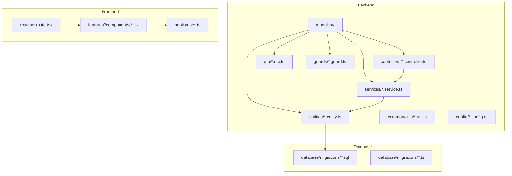
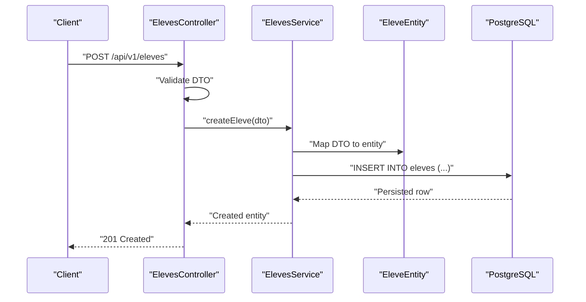
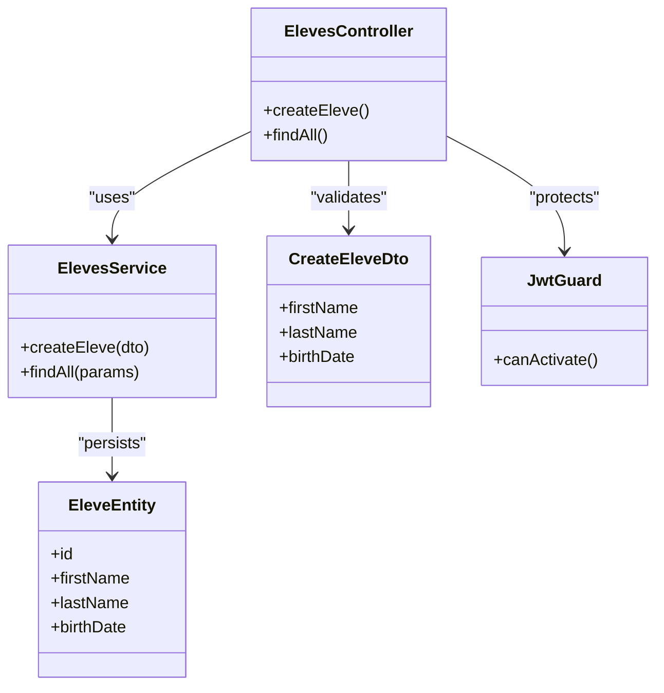
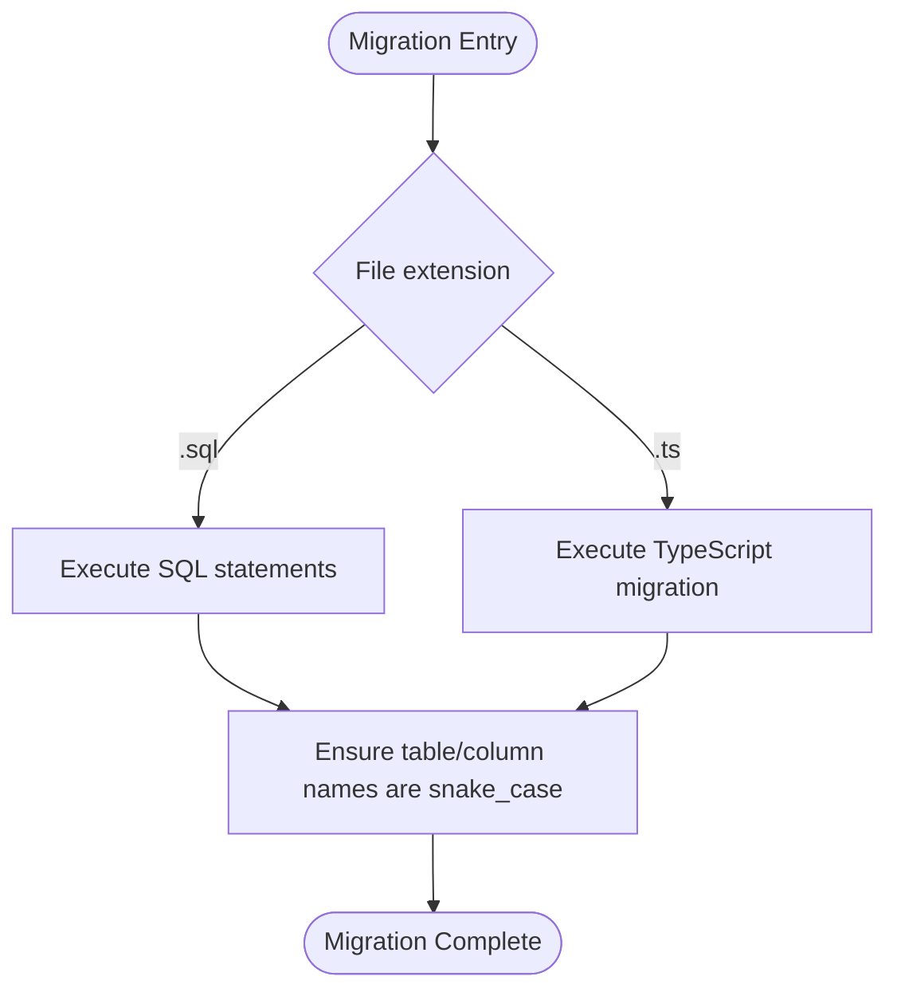
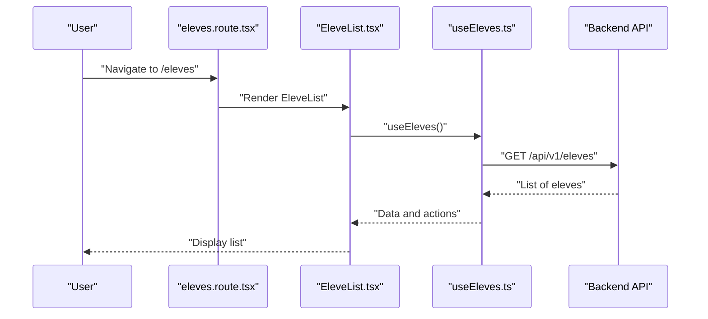
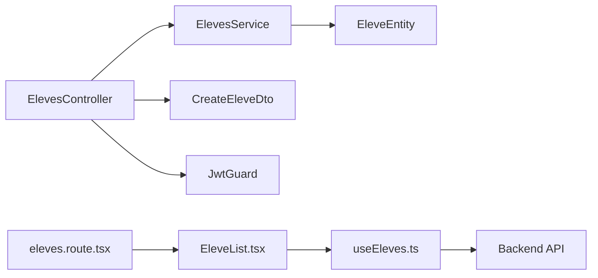

# Naming Conventions

<cite>
**Referenced Files in This Document**
- [backend/src/modules/eleves/eleves.controller.ts](file://backend/src/modules/eleves/eleves.controller.ts)
- [backend/src/modules/eleves/eleves.service.ts](file://backend/src/modules/eleves/eleves.service.ts)
- [backend/src/modules/eleves/dto/create-eleve.dto.ts](file://backend/src/modules/eleves/dto/create-eleve.dto.ts)
- [backend/src/modules/eleves/entities/eleve.entity.ts](file://backend/src/modules/eleves/entities/eleve.entity.ts)
- [backend/src/modules/auth/auth.controller.ts](file://backend/src/modules/auth/auth.controller.ts)
- [backend/src/modules/auth/auth.service.ts](file://backend/src/modules/auth/auth.service.ts)
- [backend/src/modules/auth/guards/jwt.guard.ts](file://backend/src/modules/auth/guards/jwt.guard.ts)
- [backend/src/common/utils/pagination.util.ts](file://backend/src/common/utils/pagination.util.ts)
- [backend/src/config/database.config.ts](file://backend/src/config/database.config.ts)
- [backend/src/database/migrations/090-correction-migration-088-camelcase.sql](file://backend/src/database/migrations/090-correction-migration-088-camelcase.sql)
- [backend/src/database/migrations/054-refonte-structure-academique-v2.sql](file://backend/src/database/migrations/054-refonte-structure-academique-v2.sql)
- [backend/src/database/migrations/037-gamification-tracabilite.ts](file://backend/src/database/migrations/037-gamification-tracabilite.ts)
- [frontend/src/features/eleves/components/EleveForm.tsx](file://frontend/src/features/eleves/components/EleveForm.tsx)
- [frontend/src/features/eleves/components/EleveList.tsx](file://frontend/src/features/eleves/components/EleveList.tsx)
- [frontend/src/hooks/useEleves.ts](file://frontend/src/hooks/useEleves.ts)
- [frontend/src/routes/eleves.route.tsx](file://frontend/src/routes/eleves.route.tsx)
</cite>

## Table of Contents
1. [Introduction](#introduction)
2. [Project Structure](#project-structure)
3. [Core Components](#core-components)
4. [Architecture Overview](#architecture-overview)
5. [Detailed Component Analysis](#detailed-component-analysis)
6. [Dependency Analysis](#dependency-analysis)
7. [Performance Considerations](#performance-considerations)
8. [Troubleshooting Guide](#troubleshooting-guide)
9. [Conclusion](#conclusion)
10. [Appendices](#appendices)

## Introduction
This document defines the naming conventions for the eLISAschool codebase across backend (NestJS), frontend (React + TanStack Router), and database layers. It covers file naming, class/module/component naming, variables and functions, constants, DTOs, entities, controllers, services, guards, hooks, routes, and database tables/columns. The goal is to ensure consistency, readability, and maintainability throughout the project.

## Project Structure
The repository follows a feature-based organization with clear separation between backend, frontend, shared libraries, migrations, scripts, and documentation. Key directories:
- Backend NestJS modules under backend/src/modules/<feature>/
- Common utilities and configuration under backend/src/common and backend/src/config
- Database migrations under backend/src/database/migrations
- Frontend features under frontend/src/features/<feature>/components and hooks
- Routes defined per feature under frontend/src/routes

[No sources needed since this diagram shows conceptual structure]

## Core Components
This section summarizes the naming patterns used across key components.

- File naming
  - Backend files: kebab-case for modules, controllers, services, DTOs, entities, utils, config, guards, and migrations.
  - Frontend files: PascalCase for React component files; camelCase for hooks and route files.
- Class and type naming
  - Classes, services, controllers, guards, entities, DTOs, and React components: PascalCase.
- Variables and functions
  - camelCase for local variables, parameters, methods, and functions.
- Constants
  - UPPER_SNAKE_CASE for module-level constants and environment keys.
- Database
  - Tables and columns: snake_case.
  - Migration filenames: numeric prefix with kebab-case description.

Examples from the codebase:
- Controller file: eleves.controller.ts
- Service file: eleves.service.ts
- Entity file: eleve.entity.ts
- DTO file: create-eleve.dto.ts
- Guard file: jwt.guard.ts
- Utility file: pagination.util.ts
- Config file: database.config.ts
- Migration SQL: 090-correction-migration-088-camelcase.sql
- Migration TS: 037-gamification-tracabilite.ts
- React component: EleveForm.tsx
- Hook: useEleves.ts
- Route: eleves.route.tsx

**Section sources**
- [backend/src/modules/eleves/eleves.controller.ts](file://backend/src/modules/eleves/eleves.controller.ts)
- [backend/src/modules/eleves/eleves.service.ts](file://backend/src/modules/eleves/eleves.service.ts)
- [backend/src/modules/eleves/entities/eleve.entity.ts](file://backend/src/modules/eleves/entities/eleve.entity.ts)
- [backend/src/modules/eleves/dto/create-eleve.dto.ts](file://backend/src/modules/eleves/dto/create-eleve.dto.ts)
- [backend/src/modules/auth/guards/jwt.guard.ts](file://backend/src/modules/auth/guards/jwt.guard.ts)
- [backend/src/common/utils/pagination.util.ts](file://backend/src/common/utils/pagination.util.ts)
- [backend/src/config/database.config.ts](file://backend/src/config/database.config.ts)
- [backend/src/database/migrations/090-correction-migration-088-camelcase.sql](file://backend/src/database/migrations/090-correction-migration-088-camelcase.sql)
- [backend/src/database/migrations/037-gamification-tracabilite.ts](file://backend/src/database/migrations/037-gamification-tracabilite.ts)
- [frontend/src/features/eleves/components/EleveForm.tsx](file://frontend/src/features/eleves/components/EleveForm.tsx)
- [frontend/src/hooks/useEleves.ts](file://frontend/src/hooks/useEleves.ts)
- [frontend/src/routes/eleves.route.tsx](file://frontend/src/routes/eleves.route.tsx)

## Architecture Overview
The system uses a layered architecture:
- Controllers handle HTTP requests and delegate to services.
- Services encapsulate business logic and interact with TypeORM entities.
- Entities map to database tables and define column names.
- DTOs validate and shape request/response payloads.
- Guards enforce authentication/authorization.
- Utilities provide reusable helpers (e.g., pagination).
- Frontend features are organized by domain, with components, hooks, and routes following consistent naming.

**Diagram sources**
- [backend/src/modules/eleves/eleves.controller.ts](file://backend/src/modules/eleves/eleves.controller.ts)
- [backend/src/modules/eleves/eleves.service.ts](file://backend/src/modules/eleves/eleves.service.ts)
- [backend/src/modules/eleves/entities/eleve.entity.ts](file://backend/src/modules/eleves/entities/eleve.entity.ts)

## Detailed Component Analysis

### Backend Modules (NestJS)
- Module directory: kebab-case (e.g., eleves, auth, notes).
- Controller: PascalCase class name in a kebab-case file (e.g., ElevesController in eleves.controller.ts).
- Service: PascalCase class name in a kebab-case file (e.g., ElevesService in eleves.service.ts).
- Entity: PascalCase class name in a kebab-case file (e.g., EleveEntity in eleve.entity.ts).
- DTO: PascalCase class name in a kebab-case file (e.g., CreateEleveDto in create-eleve.dto.ts).
- Guard: PascalCase class name in a kebab-case file (e.g., JwtGuard in jwt.guard.ts).
- Utility: camelCase function names inside kebab-case files (e.g., buildPaginationQuery in pagination.util.ts).
- Config: camelCase variable names inside kebab-case files (e.g., dataSourceConfig in database.config.ts).

**Diagram sources**
- [backend/src/modules/eleves/eleves.controller.ts](file://backend/src/modules/eleves/eleves.controller.ts)
- [backend/src/modules/eleves/eleves.service.ts](file://backend/src/modules/eleves/eleves.service.ts)
- [backend/src/modules/eleves/entities/eleve.entity.ts](file://backend/src/modules/eleves/entities/eleve.entity.ts)
- [backend/src/modules/eleves/dto/create-eleve.dto.ts](file://backend/src/modules/eleves/dto/create-eleve.dto.ts)
- [backend/src/modules/auth/guards/jwt.guard.ts](file://backend/src/modules/auth/guards/jwt.guard.ts)

**Section sources**
- [backend/src/modules/eleves/eleves.controller.ts](file://backend/src/modules/eleves/eleves.controller.ts)
- [backend/src/modules/eleves/eleves.service.ts](file://backend/src/modules/eleves/eleves.service.ts)
- [backend/src/modules/eleves/entities/eleve.entity.ts](file://backend/src/modules/eleves/entities/eleve.entity.ts)
- [backend/src/modules/eleves/dto/create-eleve.dto.ts](file://backend/src/modules/eleves/dto/create-eleve.dto.ts)
- [backend/src/modules/auth/guards/jwt.guard.ts](file://backend/src/modules/auth/guards/jwt.guard.ts)

### Database Migrations and Schema
- Migration filenames: numeric prefix followed by kebab-case description.
  - Examples: 090-correction-migration-088-camelcase.sql, 037-gamification-tracabilite.ts.
- Table and column names: snake_case.
  - Example migration references indicate corrections to camelCase usage, reinforcing snake_case for schema objects.
- Mixed migration types: both .sql and .ts migrations exist; filenames follow the same kebab-case pattern.

**Diagram sources**
- [backend/src/database/migrations/090-correction-migration-088-camelcase.sql](file://backend/src/database/migrations/090-correction-migration-088-camelcase.sql)
- [backend/src/database/migrations/037-gamification-tracabilite.ts](file://backend/src/database/migrations/037-gamification-tracabilite.ts)
- [backend/src/database/migrations/054-refonte-structure-academique-v2.sql](file://backend/src/database/migrations/054-refonte-structure-academique-v2.sql)

**Section sources**
- [backend/src/database/migrations/090-correction-migration-088-camelcase.sql](file://backend/src/database/migrations/090-correction-migration-088-camelcase.sql)
- [backend/src/database/migrations/037-gamification-tracabilite.ts](file://backend/src/database/migrations/037-gamification-tracabilite.ts)
- [backend/src/database/migrations/054-refonte-structure-academique-v2.sql](file://backend/src/database/migrations/054-refonte-structure-academique-v2.sql)

### Frontend Features (React + TanStack Router)
- Feature directory: kebab-case (e.g., eleves).
- React components: PascalCase file names (e.g., EleveForm.tsx, EleveList.tsx).
- Hooks: camelCase file names starting with use (e.g., useEleves.ts).
- Routes: kebab-case file names (e.g., eleves.route.tsx).
- Internal identifiers: camelCase for variables and functions within components and hooks.

**Diagram sources**
- [frontend/src/routes/eleves.route.tsx](file://frontend/src/routes/eleves.route.tsx)
- [frontend/src/features/eleves/components/EleveList.tsx](file://frontend/src/features/eleves/components/EleveList.tsx)
- [frontend/src/hooks/useEleves.ts](file://frontend/src/hooks/useEleves.ts)

**Section sources**
- [frontend/src/features/eleves/components/EleveForm.tsx](file://frontend/src/features/eleves/components/EleveForm.tsx)
- [frontend/src/features/eleves/components/EleveList.tsx](file://frontend/src/features/eleves/components/EleveList.tsx)
- [frontend/src/hooks/useEleves.ts](file://frontend/src/hooks/useEleves.ts)
- [frontend/src/routes/eleves.route.tsx](file://frontend/src/routes/eleves.route.tsx)

## Dependency Analysis
- Backend dependencies
  - Controllers depend on services and DTOs.
  - Services depend on entities and common utilities.
  - Guards protect controller endpoints.
- Frontend dependencies
  - Routes render feature components.
  - Components consume hooks for data fetching and state management.
  - Hooks call backend APIs.

**Diagram sources**
- [backend/src/modules/eleves/eleves.controller.ts](file://backend/src/modules/eleves/eleves.controller.ts)
- [backend/src/modules/eleves/eleves.service.ts](file://backend/src/modules/eleves/eleves.service.ts)
- [backend/src/modules/eleves/entities/eleve.entity.ts](file://backend/src/modules/eleves/entities/eleve.entity.ts)
- [backend/src/modules/eleves/dto/create-eleve.dto.ts](file://backend/src/modules/eleves/dto/create-eleve.dto.ts)
- [backend/src/modules/auth/guards/jwt.guard.ts](file://backend/src/modules/auth/guards/jwt.guard.ts)
- [frontend/src/routes/eleves.route.tsx](file://frontend/src/routes/eleves.route.tsx)
- [frontend/src/features/eleves/components/EleveList.tsx](file://frontend/src/features/eleves/components/EleveList.tsx)
- [frontend/src/hooks/useEleves.ts](file://frontend/src/hooks/useEleves.ts)

**Section sources**
- [backend/src/modules/eleves/eleves.controller.ts](file://backend/src/modules/eleves/eleves.controller.ts)
- [backend/src/modules/eleves/eleves.service.ts](file://backend/src/modules/eleves/eleves.service.ts)
- [backend/src/modules/eleves/entities/eleve.entity.ts](file://backend/src/modules/eleves/entities/eleve.entity.ts)
- [backend/src/modules/eleves/dto/create-eleve.dto.ts](file://backend/src/modules/eleves/dto/create-eleve.dto.ts)
- [backend/src/modules/auth/guards/jwt.guard.ts](file://backend/src/modules/auth/guards/jwt.guard.ts)
- [frontend/src/routes/eleves.route.tsx](file://frontend/src/routes/eleves.route.tsx)
- [frontend/src/features/eleves/components/EleveList.tsx](file://frontend/src/features/eleves/components/EleveList.tsx)
- [frontend/src/hooks/useEleves.ts](file://frontend/src/hooks/useEleves.ts)

## Performance Considerations
- Use snake_case consistently for database identifiers to avoid runtime mapping overhead and reduce errors.
- Keep utility functions small and focused (e.g., pagination helpers) to improve reusability and testability.
- Prefer typed DTOs to minimize validation costs and prevent unnecessary transformations.
- Avoid heavy computations in controllers; delegate to services and cache where appropriate.

[No sources needed since this section provides general guidance]

## Troubleshooting Guide
Common issues related to naming:
- Migration failures due to mismatched table/column names: ensure snake_case for all schema objects.
- Runtime errors when accessing properties: verify that entity column names match database schema and DTO field names align with API contracts.
- Guard misconfiguration: confirm guard class name and file naming follow PascalCase and kebab-case respectively.

Remediation steps:
- Review migration files for camelCase remnants and convert to snake_case.
- Align DTO fields with entity properties and database columns.
- Ensure controller method names reflect HTTP verbs and resource names consistently.

**Section sources**
- [backend/src/database/migrations/090-correction-migration-088-camelcase.sql](file://backend/src/database/migrations/090-correction-migration-088-camelcase.sql)
- [backend/src/modules/eleves/dto/create-eleve.dto.ts](file://backend/src/modules/eleves/dto/create-eleve.dto.ts)
- [backend/src/modules/eleves/entities/eleve.entity.ts](file://backend/src/modules/eleves/entities/eleve.entity.ts)
- [backend/src/modules/auth/guards/jwt.guard.ts](file://backend/src/modules/auth/guards/jwt.guard.ts)

## Conclusion
Adhering to these naming conventions ensures clarity, reduces cognitive load, and prevents subtle bugs across the eLISAschool codebase. Consistent kebab-case files, PascalCase classes and components, camelCase variables and functions, UPPER_SNAKE_CASE constants, and snake_case database identifiers form the backbone of maintainable development practices.

[No sources needed since this section summarizes without analyzing specific files]

## Appendices

### Quick Reference Table
- Files
  - Backend: kebab-case (e.g., eleves.controller.ts, eleves.service.ts, eleve.entity.ts, create-eleve.dto.ts, jwt.guard.ts, pagination.util.ts, database.config.ts)
  - Frontend: PascalCase for components (e.g., EleveForm.tsx), camelCase for hooks (e.g., useEleves.ts), kebab-case for routes (e.g., eleves.route.tsx)
- Types and Classes
  - PascalCase (e.g., ElevesController, ElevesService, EleveEntity, CreateEleveDto, JwtGuard)
- Variables and Functions
  - camelCase (e.g., buildPaginationQuery, findAllEleves)
- Constants
  - UPPER_SNAKE_CASE (e.g., MAX_PAGE_SIZE, DEFAULT_SORT_ORDER)
- Database
  - snake_case for tables and columns (e.g., eleves, first_name, last_name)
  - Migration filenames: numeric prefix + kebab-case (e.g., 090-correction-migration-088-camelcase.sql)

**Section sources**
- [backend/src/modules/eleves/eleves.controller.ts](file://backend/src/modules/eleves/eleves.controller.ts)
- [backend/src/modules/eleves/eleves.service.ts](file://backend/src/modules/eleves/eleves.service.ts)
- [backend/src/modules/eleves/entities/eleve.entity.ts](file://backend/src/modules/eleves/entities/eleve.entity.ts)
- [backend/src/modules/eleves/dto/create-eleve.dto.ts](file://backend/src/modules/eleves/dto/create-eleve.dto.ts)
- [backend/src/modules/auth/guards/jwt.guard.ts](file://backend/src/modules/auth/guards/jwt.guard.ts)
- [backend/src/common/utils/pagination.util.ts](file://backend/src/common/utils/pagination.util.ts)
- [backend/src/config/database.config.ts](file://backend/src/config/database.config.ts)
- [backend/src/database/migrations/090-correction-migration-088-camelcase.sql](file://backend/src/database/migrations/090-correction-migration-088-camelcase.sql)
- [backend/src/database/migrations/037-gamification-tracabilite.ts](file://backend/src/database/migrations/037-gamification-tracabilite.ts)
- [frontend/src/features/eleves/components/EleveForm.tsx](file://frontend/src/features/eleves/components/EleveForm.tsx)
- [frontend/src/hooks/useEleves.ts](file://frontend/src/hooks/useEleves.ts)
- [frontend/src/routes/eleves.route.tsx](file://frontend/src/routes/eleves.route.tsx)