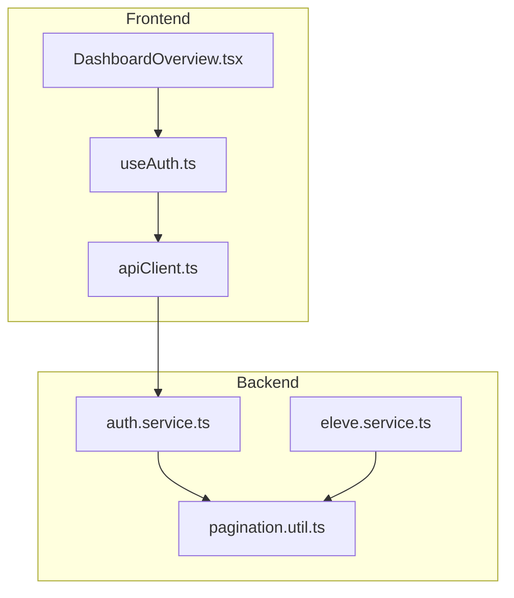
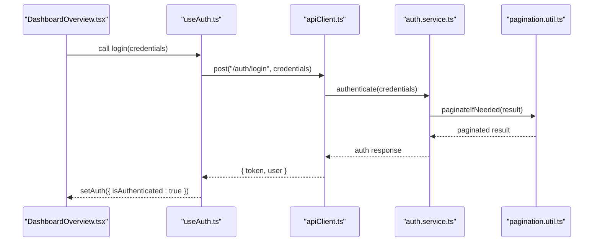
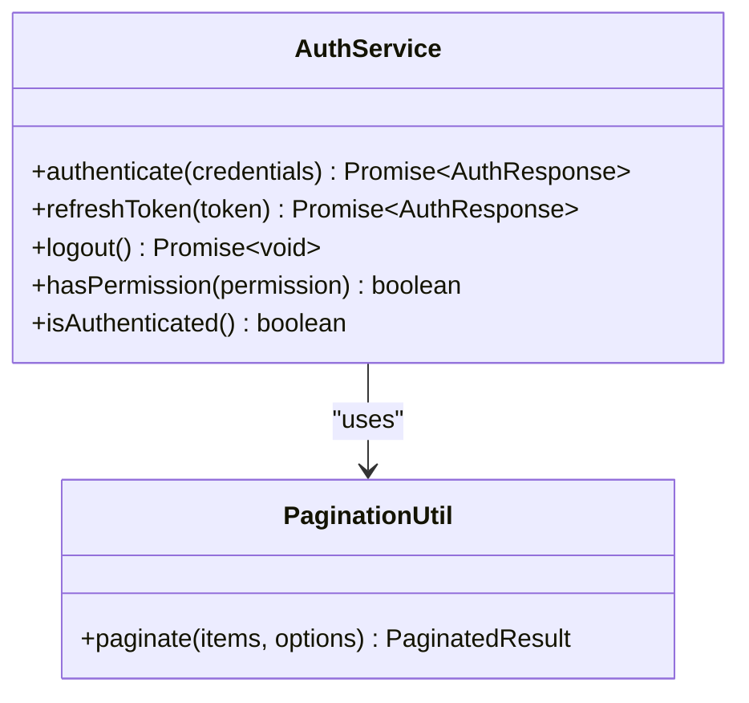
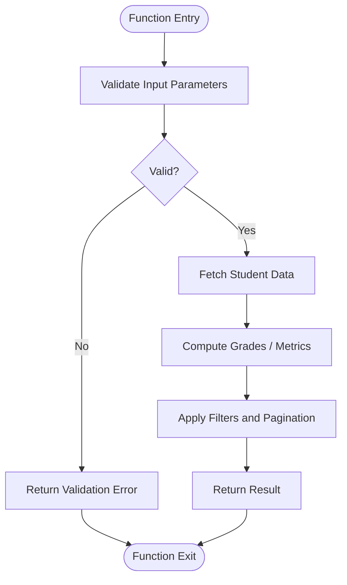
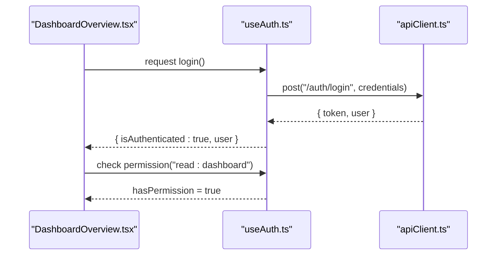
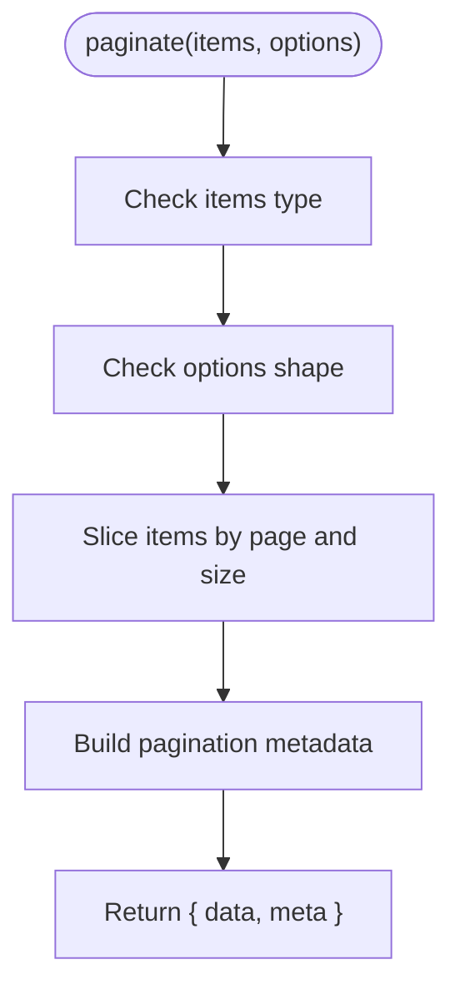
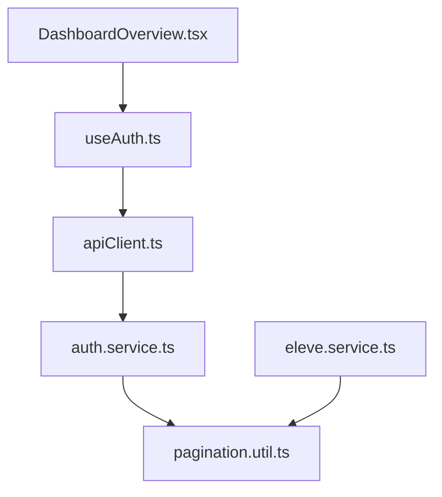

# Variable & Function Naming

<cite>
**Referenced Files in This Document**
- [backend/src/modules/auth/services/auth.service.ts](file://backend/src/modules/auth/services/auth.service.ts)
- [backend/src/modules/eleves/services/eleve.service.ts](file://backend/src/modules/eleves/services/eleve.service.ts)
- [backend/src/common/utils/pagination.util.ts](file://backend/src/common/utils/pagination.util.ts)
- [frontend/src/hooks/useAuth.ts](file://frontend/src/hooks/useAuth.ts)
- [frontend/src/features/dashboard/components/DashboardOverview.tsx](file://frontend/src/features/dashboard/components/DashboardOverview.tsx)
- [frontend/src/lib/apiClient.ts](file://frontend/src/lib/apiClient.ts)
</cite>

## Table of Contents
1. [Introduction](#introduction)
2. [Project Structure](#project-structure)
3. [Core Components](#core-components)
4. [Architecture Overview](#architecture-overview)
5. [Detailed Component Analysis](#detailed-component-analysis)
6. [Dependency Analysis](#dependency-analysis)
7. [Performance Considerations](#performance-considerations)
8. [Troubleshooting Guide](#troubleshooting-guide)
9. [Conclusion](#conclusion)
10. [Appendices](#appendices)

## Introduction
This document defines clear, consistent naming conventions for variables and functions across eLISAschool’s TypeScript backend and React frontend. It focuses on:
- camelCase for variables and functions
- Boolean naming with is/has/can prefixes
- Descriptive, domain-aligned names
- Context-specific patterns for services, hooks, utilities, and business logic

The goal is to improve readability, reduce ambiguity, and make code easier to maintain and review.

## Project Structure
Naming conventions apply throughout the repository, including:
- Backend services (business logic)
- Utilities (pure helpers)
- Frontend hooks (React stateful logic)
- Feature components (UI composition)
- API clients (HTTP interactions)

[No sources needed since this diagram shows conceptual structure]

## Core Components
This section outlines the naming rules and examples by context.

### General Rules
- Use camelCase for all variables and functions.
- Prefer descriptive nouns for variables and verb phrases for functions.
- Booleans must start with is, has, can, or should.
- Avoid abbreviations unless they are widely understood in the domain.
- Keep names stable and aligned with domain terms.

Examples:
- Variables: studentProfile, isActive, hasPermission, sortOrder, pageSize
- Functions: getUserProfile(), calculateStudentGPA(), validateEmail(), formatCurrency()

### Services (Backend)
- Methods should describe actions and return values clearly.
- Use domain-centric verbs: fetch, create, update, delete, compute, sync.
- Parameters should be explicit and typed; avoid generic names like data or payload without context.

Patterns:
- getEntityById(id): string -> Promise<Entity>
- createEntity(dto): EntityDto -> Promise<Entity>
- updateEntity(id, dto): string, EntityDto -> Promise<Entity>
- deleteEntity(id): string -> Promise<void>
- computeMetrics(filters): Filters -> Promise<Metrics>

Boolean flags:
- isActive, isEnabled, hasRole, canEdit, isLocked

References:
- [auth.service.ts](file://backend/src/modules/auth/services/auth.service.ts)
- [eleve.service.ts](file://backend/src/modules/eleves/services/eleve.service.ts)

**Section sources**
- [backend/src/modules/auth/services/auth.service.ts](file://backend/src/modules/auth/services/auth.service.ts)
- [backend/src/modules/eleves/services/eleve.service.ts](file://backend/src/modules/eleves/services/eleve.service.ts)

### Utilities (Backend)
- Pure functions with predictable inputs and outputs.
- Names should reflect transformation or validation intent.
- Keep parameters minimal and named descriptively.

Patterns:
- paginate(items, options): Array<T>, PaginationOptions -> PaginatedResult<T>
- validateInput(value, schema): any, Schema -> ValidationResult
- formatDate(date, locale): Date, LocaleString -> string
- hashPassword(password): string -> string

References:
- [pagination.util.ts](file://backend/src/common/utils/pagination.util.ts)

**Section sources**
- [backend/src/common/utils/pagination.util.ts](file://backend/src/common/utils/pagination.util.ts)

### Hooks (Frontend)
- Hook names start with use and describe the concern.
- Return values should be objects or tuples with clear keys.
- Local booleans follow is/has/can patterns.

Patterns:
- useAuth(): AuthState
- usePagination(options): PaginationState
- useDebounce(value, delay): any, number -> any
- useLocalStorage(key, initialValue): string, any -> [value, setValue]

Boolean flags:
- isLoading, isError, isSuccess, hasError, canSubmit

References:
- [useAuth.ts](file://frontend/src/hooks/useAuth.ts)

**Section sources**
- [frontend/src/hooks/useAuth.ts](file://frontend/src/hooks/useAuth.ts)

### Components (Frontend)
- Props should be self-describing and typed.
- Event handlers should use handle prefix.
- Derived state booleans should be is/has/can.

Patterns:
- props: { title: string; isVisible: boolean; onSubmit: () => void }
- handlers: handleSubmit(), handleCancel(), handleToggle()
- derived flags: isValid, isDirty, hasChanges

References:
- [DashboardOverview.tsx](file://frontend/src/features/dashboard/components/DashboardOverview.tsx)

**Section sources**
- [frontend/src/features/dashboard/components/DashboardOverview.tsx](file://frontend/src/features/dashboard/components/DashboardOverview.tsx)

### API Client (Frontend)
- Methods map to HTTP verbs and resources.
- Request/response types should be explicit.
- Error handling should expose meaningful messages.

Patterns:
- getUsers(params): QueryParams -> Promise<User[]>
- createUser(user): User -> Promise<User>
- updateUser(id, user): string, User -> Promise<User>
- deleteUser(id): string -> Promise<void>

References:
- [apiClient.ts](file://frontend/src/lib/apiClient.ts)

**Section sources**
- [frontend/src/lib/apiClient.ts](file://frontend/src/lib/apiClient.ts)

## Architecture Overview
The following sequence illustrates a typical authentication flow using proper naming conventions across layers.

**Diagram sources**
- [frontend/src/features/dashboard/components/DashboardOverview.tsx](file://frontend/src/features/dashboard/components/DashboardOverview.tsx)
- [frontend/src/hooks/useAuth.ts](file://frontend/src/hooks/useAuth.ts)
- [frontend/src/lib/apiClient.ts](file://frontend/src/lib/apiClient.ts)
- [backend/src/modules/auth/services/auth.service.ts](file://backend/src/modules/auth/services/auth.service.ts)
- [backend/src/common/utils/pagination.util.ts](file://backend/src/common/utils/pagination.util.ts)

## Detailed Component Analysis

### Services: Authentication
Focus areas:
- Method names describe operations precisely.
- Boolean flags indicate session state and permissions.
- Parameter names are explicit and typed.

**Diagram sources**
- [backend/src/modules/auth/services/auth.service.ts](file://backend/src/modules/auth/services/auth.service.ts)
- [backend/src/common/utils/pagination.util.ts](file://backend/src/common/utils/pagination.util.ts)

**Section sources**
- [backend/src/modules/auth/services/auth.service.ts](file://backend/src/modules/auth/services/auth.service.ts)
- [backend/src/common/utils/pagination.util.ts](file://backend/src/common/utils/pagination.util.ts)

### Services: Student Management
Focus areas:
- Domain-aligned method names (e.g., enrollStudent, computeGrades).
- Clear parameter descriptors (e.g., studentId, filters).
- Boolean flags for status checks (e.g., isEnrolled, hasTranscript).

**Diagram sources**
- [backend/src/modules/eleves/services/eleve.service.ts](file://backend/src/modules/eleves/services/eleve.service.ts)
- [backend/src/common/utils/pagination.util.ts](file://backend/src/common/utils/pagination.util.ts)

**Section sources**
- [backend/src/modules/eleves/services/eleve.service.ts](file://backend/src/modules/eleves/services/eleve.service.ts)
- [backend/src/common/utils/pagination.util.ts](file://backend/src/common/utils/pagination.util.ts)

### Hooks: Authentication State
Focus areas:
- Hook returns an object with descriptive keys.
- Boolean flags follow is/has/can patterns.
- Handlers are prefixed with handle.

**Diagram sources**
- [frontend/src/features/dashboard/components/DashboardOverview.tsx](file://frontend/src/features/dashboard/components/DashboardOverview.tsx)
- [frontend/src/hooks/useAuth.ts](file://frontend/src/hooks/useAuth.ts)
- [frontend/src/lib/apiClient.ts](file://frontend/src/lib/apiClient.ts)

**Section sources**
- [frontend/src/hooks/useAuth.ts](file://frontend/src/hooks/useAuth.ts)
- [frontend/src/features/dashboard/components/DashboardOverview.tsx](file://frontend/src/features/dashboard/components/DashboardOverview.tsx)
- [frontend/src/lib/apiClient.ts](file://frontend/src/lib/apiClient.ts)

### Utilities: Pagination
Focus areas:
- Pure function with explicit parameters.
- Returns structured results with metadata.
- No side effects; easy to test.

**Diagram sources**
- [backend/src/common/utils/pagination.util.ts](file://backend/src/common/utils/pagination.util.ts)

**Section sources**
- [backend/src/common/utils/pagination.util.ts](file://backend/src/common/utils/pagination.util.ts)

## Dependency Analysis
High-level dependencies between modules and files relevant to naming consistency:

**Diagram sources**
- [frontend/src/features/dashboard/components/DashboardOverview.tsx](file://frontend/src/features/dashboard/components/DashboardOverview.tsx)
- [frontend/src/hooks/useAuth.ts](file://frontend/src/hooks/useAuth.ts)
- [frontend/src/lib/apiClient.ts](file://frontend/src/lib/apiClient.ts)
- [backend/src/modules/auth/services/auth.service.ts](file://backend/src/modules/auth/services/auth.service.ts)
- [backend/src/modules/eleves/services/eleve.service.ts](file://backend/src/modules/eleves/services/eleve.service.ts)
- [backend/src/common/utils/pagination.util.ts](file://backend/src/common/utils/pagination.util.ts)

**Section sources**
- [frontend/src/features/dashboard/components/DashboardOverview.tsx](file://frontend/src/features/dashboard/components/DashboardOverview.tsx)
- [frontend/src/hooks/useAuth.ts](file://frontend/src/hooks/useAuth.ts)
- [frontend/src/lib/apiClient.ts](file://frontend/src/lib/apiClient.ts)
- [backend/src/modules/auth/services/auth.service.ts](file://backend/src/modules/auth/services/auth.service.ts)
- [backend/src/modules/eleves/services/eleve.service.ts](file://backend/src/modules/eleves/services/eleve.service.ts)
- [backend/src/common/utils/pagination.util.ts](file://backend/src/common/utils/pagination.util.ts)

## Performance Considerations
- Favor precise names that hint at behavior to reduce cognitive load during debugging and profiling.
- Avoid overly long names that obscure intent; prefer concise, descriptive terms.
- Keep utility functions pure and small to enable memoization and caching where appropriate.

[No sources needed since this section provides general guidance]

## Troubleshooting Guide
Common naming pitfalls and resolutions:
- Ambiguous booleans: Replace vague flags like flag or ok with isLoaded, hasError, canSubmit.
- Generic parameters: Replace data with specific DTOs like enrollmentDto or filters.
- Inconsistent prefixes: Standardize event handlers with handle prefix and hooks with use prefix.
- Mixed casing: Ensure all variables and functions consistently use camelCase.

[No sources needed since this section provides general guidance]

## Conclusion
Adopting these naming conventions improves clarity, reduces errors, and accelerates onboarding. Align names with domain concepts, keep them descriptive, and enforce consistent patterns across services, utilities, hooks, and components.

[No sources needed since this section summarizes without analyzing specific files]

## Appendices

### Quick Reference Cheat Sheet
- Variables: camelCase, descriptive nouns (studentProfile, sortOrder)
- Functions: camelCase, verb phrases (getUserProfile(), calculateStudentGPA())
- Booleans: is/has/can prefixes (isActive, hasPermission, canEdit)
- Hooks: use prefix, return descriptive objects (useAuth(), usePagination())
- Handlers: handle prefix (handleSubmit(), handleToggle())
- API methods: resource-oriented verbs (getUsers(), createUser(), updateUser(), deleteUser())

[No sources needed since this section provides general guidance]