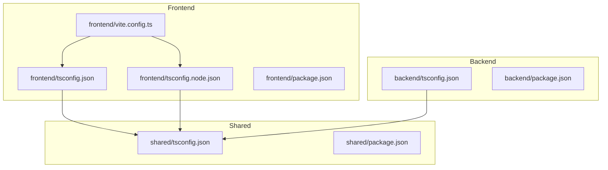
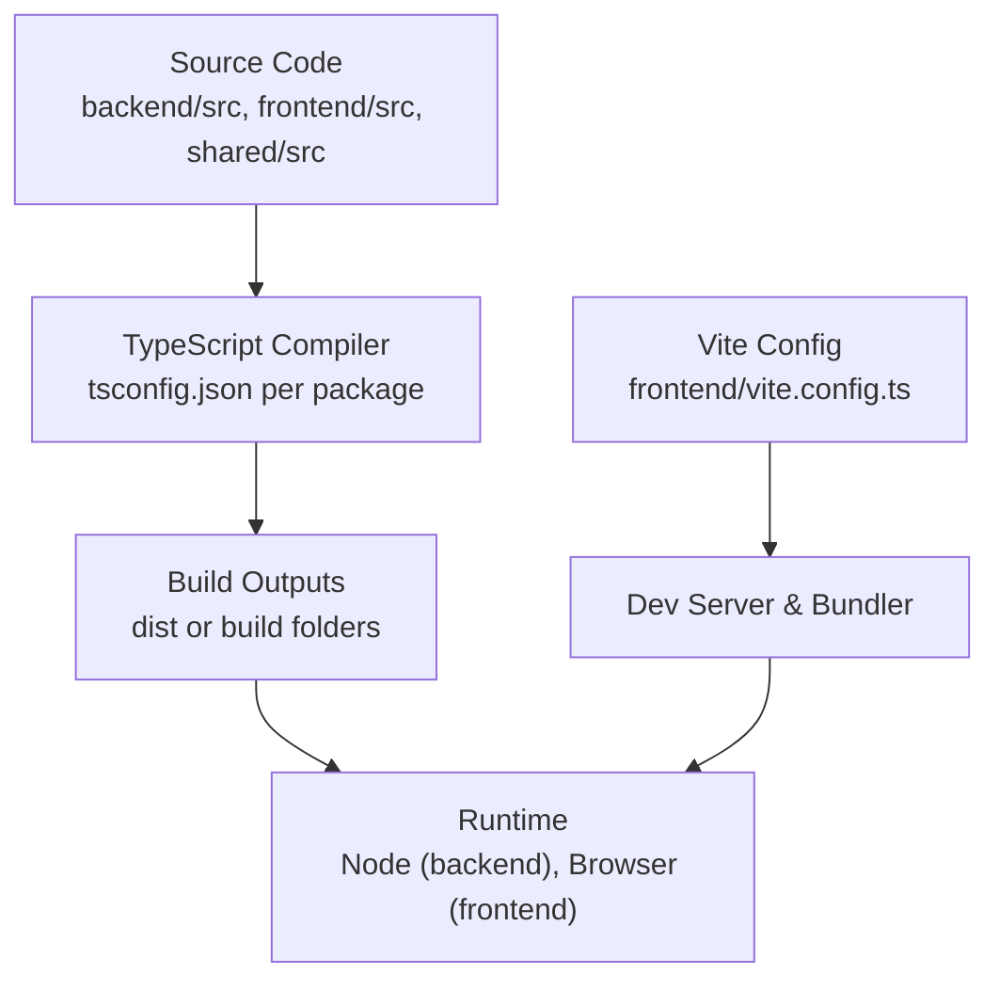
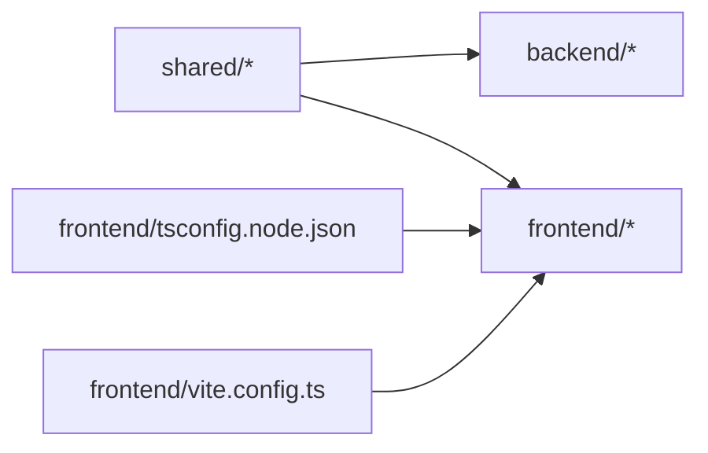

# TypeScript Configuration & Setup

<cite>
**Referenced Files in This Document**
- [backend/tsconfig.json](file://backend/tsconfig.json)
- [frontend/tsconfig.json](file://frontend/tsconfig.json)
- [frontend/tsconfig.node.json](file://frontend/tsconfig.node.json)
- [shared/tsconfig.json](file://shared/tsconfig.json)
- [backend/package.json](file://backend/package.json)
- [frontend/package.json](file://frontend/package.json)
- [shared/package.json](file://shared/package.json)
- [frontend/vite.config.ts](file://frontend/vite.config.ts)
</cite>

## Table of Contents
1. [Introduction](#introduction)
2. [Project Structure](#project-structure)
3. [Core Components](#core-components)
4. [Architecture Overview](#architecture-overview)
5. [Detailed Component Analysis](#detailed-component-analysis)
6. [Dependency Analysis](#dependency-analysis)
7. [Performance Considerations](#performance-considerations)
8. [Troubleshooting Guide](#troubleshooting-guide)
9. [Conclusion](#conclusion)
10. [Appendices](#appendices)

## Introduction
This document explains the TypeScript configuration and setup for eLISAschool across backend, frontend, and shared packages. It covers compiler options, module resolution strategies, path mappings, strict mode settings, type checking rules, build configurations, development versus production differences, and debugging with source maps. It also provides guidance on import/export patterns, interface definitions, and type guards to ensure consistent typing across the monorepo.

## Project Structure
The project is a multi-package workspace with separate TypeScript configurations per package:
- Backend (Node.js/NestJS): backend/tsconfig.json
- Frontend (Vite/React): frontend/tsconfig.json and frontend/tsconfig.node.json
- Shared types and utilities: shared/tsconfig.json

**Diagram sources**
- [backend/tsconfig.json](file://backend/tsconfig.json)
- [frontend/tsconfig.json](file://frontend/tsconfig.json)
- [frontend/tsconfig.node.json](file://frontend/tsconfig.node.json)
- [shared/tsconfig.json](file://shared/tsconfig.json)
- [frontend/vite.config.ts](file://frontend/vite.config.ts)

**Section sources**
- [backend/tsconfig.json](file://backend/tsconfig.json)
- [frontend/tsconfig.json](file://frontend/tsconfig.json)
- [frontend/tsconfig.node.json](file://frontend/tsconfig.node.json)
- [shared/tsconfig.json](file://shared/tsconfig.json)
- [frontend/vite.config.ts](file://frontend/vite.config.ts)

## Core Components
- Compiler Options: Strictness, target, module, emit behavior, and output directories are defined per package.
- Module Resolution: Node-style resolution, baseUrl/path mapping, and package references enable cross-package imports.
- Build Targets: Backend targets Node runtime; Frontend targets browser via Vite; Shared builds as a library consumed by both.
- Development vs Production: Source maps and incremental builds differ between dev and prod profiles.

Key areas to review:
- backend/tsconfig.json: Node-oriented settings, strict checks, and paths for internal modules.
- frontend/tsconfig.json: Browser-oriented settings, JSX support, and Vite integration.
- frontend/tsconfig.node.json: Node tooling config for Vite’s Node-side scripts.
- shared/tsconfig.json: Library build settings for shared types and constants.

**Section sources**
- [backend/tsconfig.json](file://backend/tsconfig.json)
- [frontend/tsconfig.json](file://frontend/tsconfig.json)
- [frontend/tsconfig.node.json](file://frontend/tsconfig.node.json)
- [shared/tsconfig.json](file://shared/tsconfig.json)

## Architecture Overview
TypeScript compilation flows through each package’s tsconfig, with shared types referenced by both backend and frontend. The frontend uses Vite for bundling and development server, while the backend compiles directly for Node execution.

[No sources needed since this diagram shows conceptual workflow, not actual code structure]

## Detailed Component Analysis

### Backend TypeScript Configuration
Focus areas:
- Target and module settings aligned with Node runtime.
- Strict mode flags for robust type safety.
- Path mappings for internal modules and shared package usage.
- Source map generation for debugging.

Recommended practices:
- Use absolute imports via path mappings to avoid relative import chains.
- Enable strict null checks and noImplicitAny for safer code.
- Keep emitDeclarationOnly off unless you need .d.ts outputs for consumers.

**Section sources**
- [backend/tsconfig.json](file://backend/tsconfig.json)
- [backend/package.json](file://backend/package.json)

### Frontend TypeScript Configuration
Focus areas:
- Target and module settings compatible with Vite and browsers.
- JSX support and environment declarations.
- Separate Node config for Vite’s Node-side scripts.
- Source maps enabled for debugging in the browser.

Recommended practices:
- Use tsconfig.node.json for Node-only tooling to avoid mixing DOM types.
- Keep lib includes minimal to reduce bundle size.
- Prefer explicit types for props and hooks to improve DX.

**Section sources**
- [frontend/tsconfig.json](file://frontend/tsconfig.json)
- [frontend/tsconfig.node.json](file://frontend/tsconfig.node.json)
- [frontend/vite.config.ts](file://frontend/vite.config.ts)
- [frontend/package.json](file://frontend/package.json)

### Shared Package TypeScript Configuration
Focus areas:
- Library-oriented settings suitable for consumption by both backend and frontend.
- Clean exports of types, enums, and validators.
- Minimal runtime dependencies to keep shared package lightweight.

Recommended practices:
- Export only what is necessary to prevent tight coupling.
- Use enums and interfaces consistently across packages.
- Avoid importing from backend/frontend-specific packages.

**Section sources**
- [shared/tsconfig.json](file://shared/tsconfig.json)
- [shared/package.json](file://shared/package.json)

### Import/Export Patterns
Guidelines:
- Prefer absolute imports using path mappings for clarity and maintainability.
- Centralize shared types in the shared package and import them explicitly.
- Use barrel files sparingly; prefer direct file imports for better tree-shaking.

Examples (paths only):
- Backend importing shared types: [backend/src/modules/auth/dto/login.dto.ts](file://backend/src/modules/auth/dto/login.dto.ts)
- Frontend importing shared constants: [frontend/src/features/dashboard/components/DashboardCard.tsx](file://frontend/src/features/dashboard/components/DashboardCard.tsx)
- Shared package exporting types: [shared/src/types/index.ts](file://shared/src/types/index.ts)

**Section sources**
- [backend/src/modules/auth/dto/login.dto.ts](file://backend/src/modules/auth/dto/login.dto.ts)
- [frontend/src/features/dashboard/components/DashboardCard.tsx](file://frontend/src/features/dashboard/components/DashboardCard.tsx)
- [shared/src/types/index.ts](file://shared/src/types/index.ts)

### Interface Definitions and Type Guards
Guidelines:
- Define interfaces in shared package for cross-cutting concerns (e.g., user roles, permissions).
- Implement type guards in shared utils to narrow union types safely.
- Use discriminated unions where possible to improve exhaustiveness checks.

Examples (paths only):
- Shared interface definition: [shared/src/types/user.types.ts](file://shared/src/types/user.types.ts)
- Type guard implementation: [shared/src/utils/type-guards.ts](file://shared/src/utils/type-guards.ts)
- Usage in backend controller: [backend/src/modules/auth/controllers/auth.controller.ts](file://backend/src/modules/auth/controllers/auth.controller.ts)
- Usage in frontend hook: [frontend/src/hooks/useAuth.ts](file://frontend/src/hooks/useAuth.ts)

**Section sources**
- [shared/src/types/user.types.ts](file://shared/src/types/user.types.ts)
- [shared/src/utils/type-guards.ts](file://shared/src/utils/type-guards.ts)
- [backend/src/modules/auth/controllers/auth.controller.ts](file://backend/src/modules/auth/controllers/auth.controller.ts)
- [frontend/src/hooks/useAuth.ts](file://frontend/src/hooks/useAuth.ts)

### Build Configurations and Dev vs Production
- Backend:
  - Development: Incremental builds, source maps enabled, watch mode via nodemon or similar.
  - Production: Optimized emits, no unused metadata, stricter flags.
- Frontend:
  - Development: HMR, source maps, fast refresh via Vite.
  - Production: Minification, dead code elimination, optimized assets.

References:
- Backend scripts and configs: [backend/package.json](file://backend/package.json)
- Frontend scripts and Vite config: [frontend/package.json](file://frontend/package.json), [frontend/vite.config.ts](file://frontend/vite.config.ts)

**Section sources**
- [backend/package.json](file://backend/package.json)
- [frontend/package.json](file://frontend/package.json)
- [frontend/vite.config.ts](file://frontend/vite.config.ts)

### Debugging with Source Maps
- Backend:
  - Ensure source maps are generated during development.
  - Configure IDE launch tasks to attach to Node process.
- Frontend:
  - Enable source maps in Vite dev server.
  - Use browser dev tools to inspect mapped TS sources.

References:
- Backend tsconfig: [backend/tsconfig.json](file://backend/tsconfig.json)
- Frontend tsconfig and Vite: [frontend/tsconfig.json](file://frontend/tsconfig.json), [frontend/vite.config.ts](file://frontend/vite.config.ts)

**Section sources**
- [backend/tsconfig.json](file://backend/tsconfig.json)
- [frontend/tsconfig.json](file://frontend/tsconfig.json)
- [frontend/vite.config.ts](file://frontend/vite.config.ts)

## Dependency Analysis
Cross-package dependencies and how they are resolved:

**Diagram sources**
- [shared/tsconfig.json](file://shared/tsconfig.json)
- [backend/tsconfig.json](file://backend/tsconfig.json)
- [frontend/tsconfig.json](file://frontend/tsconfig.json)
- [frontend/tsconfig.node.json](file://frontend/tsconfig.node.json)
- [frontend/vite.config.ts](file://frontend/vite.config.ts)

**Section sources**
- [shared/tsconfig.json](file://shared/tsconfig.json)
- [backend/tsconfig.json](file://backend/tsconfig.json)
- [frontend/tsconfig.json](file://frontend/tsconfig.json)
- [frontend/tsconfig.node.json](file://frontend/tsconfig.node.json)
- [frontend/vite.config.ts](file://frontend/vite.config.ts)

## Performance Considerations
- Use incremental builds to speed up repeated compilations.
- Limit lib includes to required environments to reduce compile time.
- Prefer path mappings over deep relative imports to improve IDE performance.
- Keep shared package small and focused on types and pure functions.

[No sources needed since this section provides general guidance]

## Troubleshooting Guide
Common issues and resolutions:
- Cannot find module errors:
  - Verify baseUrl and paths in tsconfig files.
  - Ensure shared package is built and referenced correctly.
- Type mismatches across packages:
  - Align enum values and interface shapes in shared package.
  - Rebuild shared package before building dependents.
- Source maps not working:
  - Confirm sourceMap flag in tsconfig and Vite config.
  - Clear caches and rebuild.

References:
- Backend tsconfig: [backend/tsconfig.json](file://backend/tsconfig.json)
- Frontend tsconfig: [frontend/tsconfig.json](file://frontend/tsconfig.json)
- Frontend node tsconfig: [frontend/tsconfig.node.json](file://frontend/tsconfig.node.json)
- Shared tsconfig: [shared/tsconfig.json](file://shared/tsconfig.json)
- Vite config: [frontend/vite.config.ts](file://frontend/vite.config.ts)

**Section sources**
- [backend/tsconfig.json](file://backend/tsconfig.json)
- [frontend/tsconfig.json](file://frontend/tsconfig.json)
- [frontend/tsconfig.node.json](file://frontend/tsconfig.node.json)
- [shared/tsconfig.json](file://shared/tsconfig.json)
- [frontend/vite.config.ts](file://frontend/vite.config.ts)

## Conclusion
A consistent TypeScript setup across backend, frontend, and shared packages ensures strong typing, reliable builds, and smooth debugging. By leveraging shared types, clear path mappings, and appropriate compiler options, eLISAschool maintains high code quality and developer productivity.

[No sources needed since this section summarizes without analyzing specific files]

## Appendices

### Quick Reference: Key Files
- Backend TypeScript config: [backend/tsconfig.json](file://backend/tsconfig.json)
- Frontend TypeScript config: [frontend/tsconfig.json](file://frontend/tsconfig.json)
- Frontend Node TypeScript config: [frontend/tsconfig.node.json](file://frontend/tsconfig.node.json)
- Shared TypeScript config: [shared/tsconfig.json](file://shared/tsconfig.json)
- Frontend Vite config: [frontend/vite.config.ts](file://frontend/vite.config.ts)

**Section sources**
- [backend/tsconfig.json](file://backend/tsconfig.json)
- [frontend/tsconfig.json](file://frontend/tsconfig.json)
- [frontend/tsconfig.node.json](file://frontend/tsconfig.node.json)
- [shared/tsconfig.json](file://shared/tsconfig.json)
- [frontend/vite.config.ts](file://frontend/vite.config.ts)