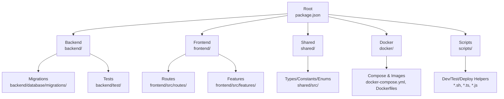
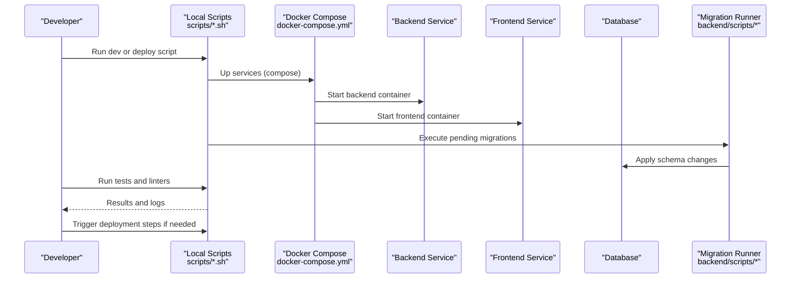
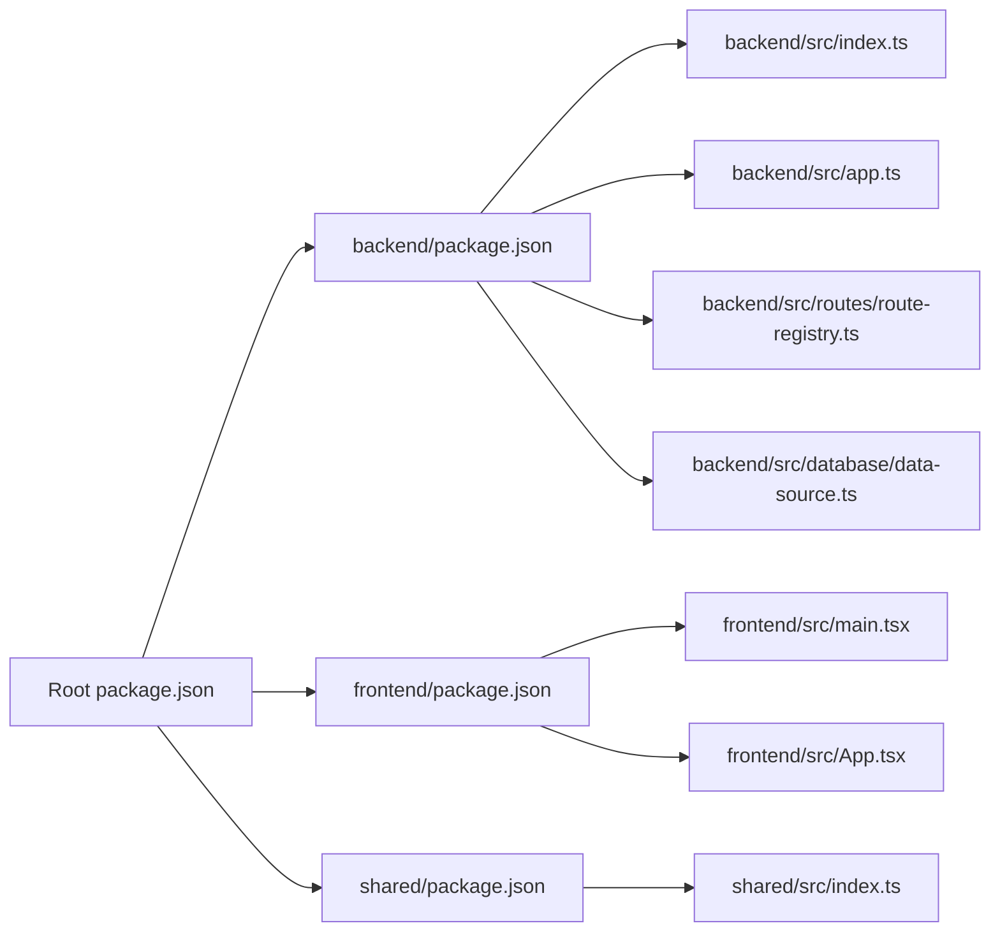

# Contribution Guidelines & Workflow

<cite>
**Referenced Files in This Document**
- [README.md](file://README.md)
- [QUICKSTART.md](file://QUICKSTART.md)
- [package.json](file://package.json)
- [backend/package.json](file://backend/package.json)
- [frontend/package.json](file://frontend/package.json)
- [docker-compose.yml](file://docker-compose.yml)
- [docker/deploy.sh](file://docker/deploy.sh)
- [scripts/start-dev.sh](file://scripts/start-dev.sh)
- [scripts/stop-dev.sh](file://scripts/stop-dev.sh)
- [scripts/rebuild-docker.sh](file://scripts/rebuild-docker.sh)
- [scripts/verify-setup.sh](file://scripts/verify-setup.sh)
- [scripts/verify-modules.sh](file://scripts/verify-modules.sh)
- [scripts/test-rapide-modules.sh](file://scripts/test-rapide-modules.sh)
- [scripts/run-migration-082.sh](file://scripts/run-migration-082.sh)
- [scripts/run-migration-083.sh](file://scripts/run-migration-083.sh)
- [scripts/run-seeds.sh](file://scripts/run-seeds.sh)
- [scripts/seed-groupes-etablissements.sh](file://scripts/seed-groupes-etablissements.sh)
- [scripts/deploy-complet.sh](file://scripts/deploy-complet.sh)
- [scripts/deploy-structure-academique-v2.sh](file://scripts/deploy-structure-academique-v2.sh)
- [scripts/deploy-notifications-performance.sh](file://scripts/deploy-notifications-performance.sh)
- [scripts/deploy-permissions.sh](file://scripts/deploy-permissions.sh)
- [scripts/deploy-preferences-v3.0.sh](file://scripts/deploy-preferences-v3.0.sh)
- [scripts/deploy-rbac-v3.sh](file://scripts/deploy-rbac-v3.sh)
- [scripts/deploy-salles.sh](file://scripts/deploy-salles.sh)
- [scripts/deploy-sondages.sh](file://scripts/deploy-sondages.sh)
- [scripts/deploy-messagerie.sh](file://scripts/deploy-messagerie.sh)
- [scripts/deploy-messagerie-v2.1.sh](file://scripts/deploy-messagerie-v2.1.sh)
- [scripts/deploy-messagerie-v2.2-complete.sh](file://scripts/deploy-messagerie-v2.2-complete.sh)
- [scripts/deploy-organisation.sh](file://scripts/deploy-organisation.sh)
- [scripts/deploy-organisation-v1.1.sh](file://scripts/deploy-organisation-v1.1.sh)
- [scripts/deploy-organisation-v1.2.sh](file://scripts/deploy-organisation-v1.2.sh)
- [scripts/deploy-organisation-v1.4.sh](file://scripts/deploy-organisation-v1.4.sh)
- [scripts/deploy-types-contrat-affectations.sh](file://scripts/deploy-types-contrat-affectations.sh)
- [scripts/deploy-scoring-personnel.sh](file://scripts/deploy-scoring-personnel.sh)
- [scripts/deploy-recrutement.sh](file://scripts/deploy-recrutement.sh)
- [scripts/deploy-blocage-auth.sh](file://scripts/deploy-blocage-auth.sh)
- [scripts/deploy-annonces.sh](file://scripts/deploy-annonces.sh)
- [scripts/deploy-apparence.sh](file://scripts/deploy-apparence.sh)
- [scripts/deploy-approche-hybride-parents.sh](file://scripts/deploy-approche-hybride-parents.sh)
- [scripts/deploy-correction-dossier-medical-fk.sh](file://scripts/deploy-correction-dossier-medical-fk.sh)
- [scripts/deploy-migration-075.sh](file://scripts/deploy-migration-075.sh)
- [scripts/deploy-migration-088.sh](file://scripts/deploy-migration-088.sh)
- [scripts/deploy-migration-089.sh](file://scripts/deploy-migration-089.sh)
- [scripts/deploy-migrations-phases.sh](file://scripts/deploy-migrations-phases.sh)
- [scripts/deploy-notifications-v2.sh](file://scripts/deploy-notifications-v2.sh)
- [scripts/deploy-optimisations-performance-v3.1.sh](file://scripts/deploy-optimisations-performance-v3.1.sh)
- [scripts/deploy-preferences-v3.0.sh](file://scripts/deploy-preferences-v3.0.sh)
- [scripts/deploy-rbac-v3.sh](file://scripts/deploy-rbac-v3.sh)
- [scripts/deploy-salles.sh](file://scripts/deploy-salles.sh)
- [scripts/deploy-scoring-personnel.sh](file://scripts/deploy-scoring-personnel.sh)
- [scripts/deploy-sondages.sh](file://scripts/deploy-sondages.sh)
- [scripts/deploy-structure-academique.sh](file://scripts/deploy-structure-academique.sh)
- [scripts/deploy-structure-academique-v2.sh](file://scripts/deploy-structure-academique-v2.sh)
- [scripts/deploy-types-contrat-affectations.sh](file://scripts/deploy-types-contrat-affectations.sh)
- [scripts/diagnostic-matricule.sh](file://scripts/diagnostic-matricule.sh)
- [scripts/fix-missing-isauthenticated.js](file://scripts/fix-missing-isauthenticated.js)
- [scripts/fix-permissions-groupes.sh](file://scripts/fix-permissions-groupes.sh)
- [scripts/fix-super-admin-permissions-v2.sh](file://scripts/fix-super-admin-permissions-v2.sh)
- [scripts/fix-super-admin-permissions.sh](file://scripts/fix-super-admin-permissions.sh)
- [scripts/force-restart-frontend.sh](file://scripts/force-restart-frontend.sh)
- [scripts/generate-fonds-svg.js](file://scripts/generate-fonds-svg.js)
- [scripts/generate-fonds-svg.sh](file://scripts/generate-fonds-svg.sh)
- [scripts/mark-obsolete.py](file://scripts/mark-obsolete.py)
- [scripts/migrate-academique.sh](file://scripts/migrate-academique.sh)
- [scripts/migrate-dashboard.sh](file://scripts/migrate-dashboard.sh)
- [scripts/migrate-require-roles-to-permission.js](file://scripts/migrate-require-roles-to-permission.js)
- [scripts/move-docs.py](file://scripts/move-docs.py)
- [scripts/move-docs.sh](file://scripts/move-docs.sh)
- [scripts/quick-start-v2.sh](file://scripts/quick-start-v2.sh)
- [scripts/rebuild-docker.sh](file://scripts/rebuild-docker.sh)
- [scripts/reclassify-autres.py](file://scripts/reclassify-autres.py)
- [scripts/restart-frontend.sh](file://scripts/restart-frontend.sh)
- [scripts/run-gamification-automation.sh](file://scripts/run-gamification-automation.sh)
- [scripts/run-gamification-migration.sh](file://scripts/run-gamification-migration.sh)
- [scripts/run-migration-082.sh](file://scripts/run-migration-082.sh)
- [scripts/run-migration-083.sh](file://scripts/run-migration-083.sh)
- [scripts/run-notification-migration.sh](file://scripts/run-notification-migration.sh)
- [scripts/run-rh-migrations.sh](file://scripts/run-rh-migrations.sh)
- [scripts/run-scoring-sql-migration.sh](file://scripts/run-scoring-sql-migration.sh)
- [scripts/run-seeds.sh](file://scripts/run-seeds.sh)
- [scripts/seed-groupes-etablissements.sh](file://scripts/seed-groupes-etablissements.sh)
- [scripts/setup-symlinks.sh](file://scripts/setup-symlinks.sh)
- [scripts/start-dev.sh](file://scripts/start-dev.sh)
- [scripts/stop-dev.sh](file://scripts/stop-dev.sh)
- [scripts/supprimer-base-de-donnees.sh](file://scripts/supprimer-base-de-donnees.sh)
- [scripts/test-blocage-2-minutes.sh](file://scripts/test-blocage-2-minutes.sh)
- [scripts/test-endpoints-utilisateurs.sh](file://scripts/test-endpoints-utilisateurs.sh)
- [scripts/test-finance-module.sh](file://scripts/test-finance-module.sh)
- [scripts/test-inscription-api.sh](file://scripts/test-inscription-api.sh)
- [scripts/test-migrations-v2.sh](file://scripts/test-migrations-v2.sh)
- [scripts/test-notification-api.sh](file://scripts/test-notification-api.sh)
- [scripts/test-persistence-compteur.sh](file://scripts/test-persistence-compteur.sh)
- [scripts/test-rapide-modules.sh](file://scripts/test-rapide-modules.sh)
- [scripts/test-redis.sh](file://scripts/test-redis.sh)
- [scripts/test-salles-api.sh](file://scripts/test-salles-api.sh)
- [scripts/test-structure-academique.sh](file://scripts/test-structure-academique.sh)
- [scripts/test-types-enum.sh](file://scripts/test-types-enum.sh)
- [scripts/update-docs-index.py](file://scripts/update-docs-index.py)
- [scripts/validate-architecture-v2.sh](file://scripts/validate-architecture-v2.sh)
- [scripts/verify-coherence.sh](file://scripts/verify-coherence.sh)
- [scripts/verify-corrections-academique.sh](file://scripts/verify-corrections-academique.sh)
- [scripts/verify-modules.sh](file://scripts/verify-modules.sh)
- [scripts/verify-multi-etablissements.sh](file://scripts/verify-multi-etablissements.sh)
- [scripts/verify-ports.sh](file://scripts/verify-ports.sh)
- [scripts/verify-seeds-multi-tenant.sh](file://scripts/verify-seeds-multi-tenant.sh)
- [scripts/verify-setup.sh](file://scripts/verify-setup.sh)
- [scripts/verify-structure-academique.sh](file://scripts/verify-structure-academique.sh)
- [backend/eslint.config.js](file://backend/eslint.config.js)
- [backend/tsconfig.json](file://backend/tsconfig.json)
- [backend/nodemon.json](file://backend/nodemon.json)
- [backend/src/index.ts](file://backend/src/index.ts)
- [backend/src/app.ts](file://backend/src/app.ts)
- [backend/src/config/env.config.ts](file://backend/src/config/env.config.ts)
- [backend/src/config/database.config.ts](file://backend/src/config/database.config.ts)
- [backend/src/config/swagger.config.ts](file://backend/src/config/swagger.config.ts)
- [backend/src/routes/route-registry.ts](file://backend/src/routes/route-registry.ts)
- [backend/src/modules/index.ts](file://backend/src/modules/index.ts)
- [backend/src/common/index.ts](file://backend/src/common/index.ts)
- [backend/src/database/data-source.ts](file://backend/src/database/data-source.ts)
- [backend/src/database/index.ts](file://backend/src/database/index.ts)
- [backend/scripts/run-migration.ts](file://backend/scripts/run-migration.ts)
- [backend/scripts/run-pending-migrations.ts](file://backend/scripts/run-pending-migrations.ts)
- [backend/scripts/run-role-perm-migration.ts](file://backend/scripts/run-role-perm-migration.ts)
- [backend/scripts/run-scoring-migration.ts](file://backend/scripts/run-scoring-migration.ts)
- [backend/scripts/run-scoring-migration-v2.ts](file://backend/scripts/run-scoring-migration-v2.ts)
- [backend/scripts/analyze-indexes.ts](file://backend/scripts/analyze-indexes.ts)
- [backend/scripts/fix-duplicate-index.sh](file://backend/scripts/fix-duplicate-index.sh)
- [backend/scripts/load-test-pagination.ts](file://backend/scripts/load-test-pagination.ts)
- [backend/scripts/migrate-config-app-to-parametres.ts](file://backend/scripts/migrate-config-app-to-parametres.ts)
- [backend/scripts/migrate-etablissement-config-to-parametres.ts](file://backend/scripts/migrate-etablissement-config-to-parametres.ts)
- [backend/scripts/migrate-parents.ts](file://backend/scripts/migrate-parents.ts)
- [backend/scripts/run-config-100-migration.sh](file://backend/scripts/run-config-100-migration.sh)
- [backend/scripts/run-config-migration.sh](file://backend/scripts/run-config-migration.sh)
- [backend/scripts/run-indexes.sh](file://backend/scripts/run-indexes.sh)
- [backend/scripts/supprimer-parametres-dupliques-etablissement.ts](file://backend/scripts/supprimer-parametres-dupliques-etablissement.ts)
- [backend/scripts/test-gamification-automatique.ts](file://backend/scripts/test-gamification-automatique.ts)
- [backend/scripts/test-gamification-integration.ts](file://backend/scripts/test-gamification-integration.ts)
- [backend/scripts/test-phase1-contexte-africain.ts](file://backend/scripts/test-phase1-contexte-africain.ts)
- [backend/scripts/test-programme-pedagogique.ts](file://backend/scripts/test-programme-pedagogique.ts)
- [backend/scripts/verify-configuration-integrity.ts](file://backend/scripts/verify-configuration-integrity.ts)
- [backend/scripts/verify-pagination.sh](file://backend/scripts/verify-pagination.sh)
- [backend/deploy-all-migrations.sh](file://backend/deploy-all-migrations.sh)
- [backend/deploy-v31-complete.sh](file://backend/deploy-v31-complete.sh)
- [backend/diagnose-entity.ts](file://backend/diagnose-entity.ts)
- [backend/diagnose-enum.ts](file://backend/diagnose-enum.ts)
- [backend/fix-index.sql](file://backend/fix-index.sql)
- [backend/analyse-enums-complet.ts](file://backend/analyse-enums-complet.ts)
- [backend/test/README.md](file://backend/test/README.md)
- [backend/test/integration/auth-multi-etablissement.spec.ts](file://backend/test/integration/auth-multi-etablissement.spec.ts)
- [backend/test/integration/configuration-multi-tenant.spec.ts](file://backend/test/integration/configuration-multi-tenant.spec.ts)
- [backend/test/services/utilisateur-etablissement.service.test.ts](file://backend/test/services/utilisateur-etablissement.service.test.ts)
- [backend/test/services/utilisateurs.service.test.ts](file://backend/test/services/utilisateurs.service.test.ts)
- [backend/test/unit/pagination.util.spec.ts](file://backend/test/unit/pagination.util.spec.ts)
- [backend/test/unit/redis.service.spec.ts](file://backend/test/unit/redis.service.spec.ts)
- [backend/tests/integration/corrections-academique.test.ts](file://backend/tests/integration/corrections-academique.test.ts)
- [frontend/vite.config.ts](file://frontend/vite.config.ts)
- [frontend/tsconfig.json](file://frontend/tsconfig.json)
- [frontend/tsconfig.node.json](file://frontend/tsconfig.node.json)
- [frontend/.dockerignore](file://frontend/.dockerignore)
- [frontend/index.html](file://frontend/index.html)
- [frontend/src/main.tsx](file://frontend/src/main.tsx)
- [frontend/src/App.tsx](file://frontend/src/App.tsx)
- [frontend/src/routeTree.gen.ts](file://frontend/src/routeTree.gen.ts)
- [shared/package.json](file://shared/package.json)
- [shared/tsconfig.json](file://shared/tsconfig.json)
- [shared/src/index.ts](file://shared/src/index.ts)
- [AGENTS.md](file://AGENTS.md)
- [CHEATSHEET.md](file://CHEATSHEET.md)
- [INDEX.md](file://INDEX.md)
</cite>

## Table of Contents
1. [Introduction](#introduction)
2. [Project Structure](#project-structure)
3. [Core Components](#core-components)
4. [Architecture Overview](#architecture-overview)
5. [Detailed Component Analysis](#detailed-component-analysis)
6. [Dependency Analysis](#dependency-analysis)
7. [Performance Considerations](#performance-considerations)
8. [Troubleshooting Guide](#troubleshooting-guide)
9. [Conclusion](#conclusion)
10. [Appendices](#appendices)

## Introduction
This document defines the contribution guidelines and workflow for eLISAschool. It covers branching strategy, commit message conventions, pull request process, code review procedures, quality gates, continuous integration expectations, automated testing requirements, deployment processes, bug reporting, feature requests, documentation contributions, release process, versioning strategy, backward compatibility considerations, community guidelines, communication channels, and contributor recognition.

The repository is a full-stack application with:
- Backend (NestJS-based TypeScript) under backend/
- Frontend (React + Vite + TanStack Router) under frontend/
- Shared library under shared/
- Docker orchestration under docker/
- Operational scripts under scripts/ and backend/scripts/
- Extensive documentation under docs/

## Project Structure
High-level layout relevant to contributors:
- Root configuration and entry points: package.json, README.md, QUICKSTART.md, INDEX.md
- Backend: NestJS app, modules, database migrations, tests, linting, and scripts
- Frontend: React app, routes, features, build config
- Shared: types, constants, enums, validators used by both layers
- Docker: Compose files, images, deploy helper
- Scripts: development, testing, migration, seed, verification, and deployment helpers

**Diagram sources**
- [package.json](file://package.json)
- [backend/package.json](file://backend/package.json)
- [frontend/package.json](file://frontend/package.json)
- [docker-compose.yml](file://docker-compose.yml)
- [scripts/start-dev.sh](file://scripts/start-dev.sh)

**Section sources**
- [README.md](file://README.md)
- [QUICKSTART.md](file://QUICKSTART.md)
- [package.json](file://package.json)
- [backend/package.json](file://backend/package.json)
- [frontend/package.json](file://frontend/package.json)
- [docker-compose.yml](file://docker-compose.yml)

## Core Components
Key areas that contributors will interact with most often:
- Backend application bootstrap and configuration
- Module registry and route registration
- Database data source and migrations
- Frontend app bootstrap and routing
- Shared types/constants/enums
- Development and operational scripts

**Section sources**
- [backend/src/index.ts](file://backend/src/index.ts)
- [backend/src/app.ts](file://backend/src/app.ts)
- [backend/src/config/env.config.ts](file://backend/src/config/env.config.ts)
- [backend/src/config/database.config.ts](file://backend/src/config/database.config.ts)
- [backend/src/config/swagger.config.ts](file://backend/src/config/swagger.config.ts)
- [backend/src/routes/route-registry.ts](file://backend/src/routes/route-registry.ts)
- [backend/src/modules/index.ts](file://backend/src/modules/index.ts)
- [backend/src/common/index.ts](file://backend/src/common/index.ts)
- [backend/src/database/data-source.ts](file://backend/src/database/data-source.ts)
- [backend/src/database/index.ts](file://backend/src/database/index.ts)
- [frontend/src/main.tsx](file://frontend/src/main.tsx)
- [frontend/src/App.tsx](file://frontend/src/App.tsx)
- [frontend/src/routeTree.gen.ts](file://frontend/src/routeTree.gen.ts)
- [shared/src/index.ts](file://shared/src/index.ts)

## Architecture Overview
End-to-end flow from local development to deployment using provided scripts and Docker.

**Diagram sources**
- [docker-compose.yml](file://docker-compose.yml)
- [scripts/start-dev.sh](file://scripts/start-dev.sh)
- [scripts/deploy-complet.sh](file://scripts/deploy-complet.sh)
- [backend/scripts/run-migration.ts](file://backend/scripts/run-migration.ts)
- [backend/scripts/run-pending-migrations.ts](file://backend/scripts/run-pending-migrations.ts)

## Detailed Component Analysis

### Branching Strategy
Recommended branches:
- main: Stable, production-ready code
- develop: Integration branch for ongoing work
- feature/<short-desc>: Feature branches branched from develop
- fix/<short-desc>: Bug fix branches branched from develop
- hotfix/<short-desc>: Urgent fixes branched from main

Rules:
- Keep feature branches short-lived; merge back into develop frequently
- Use descriptive names tied to issues or tickets when available
- Protect main and develop via repository settings where applicable

[No sources needed since this section provides general guidance]

### Commit Message Conventions
Use a concise subject line and optional body:
- Type prefixes: feat, fix, docs, style, refactor, perf, test, chore, revert
- Scope: module or area (e.g., auth, finances, rbac)
- Example format: type(scope): summary
- Reference related issue numbers in the body when applicable

Examples:
- feat(auth): add multi-mode login support
- fix(finances): correct fee rounding logic
- docs(guides): update contribution workflow

[No sources needed since this section provides general guidance]

### Pull Request Process
Steps:
- Create a branch from develop (or main for hotfixes)
- Implement changes and ensure all checks pass locally
- Open a PR targeting develop (or main for hotfixes)
- Fill out the PR template with context, scope, and impact
- Ensure tests and linters pass
- Request reviews from maintainers or domain experts
- Address review feedback and re-run checks
- Squash and merge following team policy

Quality gates before merging:
- All CI checks must pass
- At least one approving review
- No unresolved conflicts
- Documentation updated if user-facing changes are included

[No sources needed since this section provides general guidance]

### Code Review Procedures
Guidelines:
- Focus on correctness, security, performance, and maintainability
- Verify adherence to conventions and architecture patterns
- Check test coverage and edge cases
- Validate migration safety and rollback plans
- Confirm API contracts and backward compatibility

Review checklist:
- Does the change solve the stated problem?
- Are there unintended side effects?
- Is error handling robust?
- Are new dependencies justified?
- Are environment variables and configs documented?

[No sources needed since this section provides general guidance]

### Continuous Integration Expectations
While no explicit CI configuration was found in the repository snapshot, the project includes extensive local automation that can be mirrored in CI:
- Linting and type checks
- Unit and integration tests
- Migration validation and dry runs
- Seed execution for consistent test data
- Build artifacts for frontend and backend

Suggested CI stages:
- Install dependencies
- Lint and type-check
- Test suite (unit, service, integration)
- Migration run against ephemeral DB
- Build frontend and backend
- Upload artifacts and publish reports

[No sources needed since this section provides general guidance]

### Automated Testing Requirements
Testing locations and categories:
- Backend unit tests: backend/test/unit
- Backend service tests: backend/test/services
- Backend integration tests: backend/test/integration, backend/tests/integration
- Quick smoke tests: scripts/test-rapide-modules.sh, scripts/test-*.sh

Requirements:
- New features must include unit tests
- Critical flows must have integration tests
- Performance-sensitive paths should include load tests where appropriate
- Tests must be deterministic and fast

**Section sources**
- [backend/test/README.md](file://backend/test/README.md)
- [backend/test/unit/pagination.util.spec.ts](file://backend/test/unit/pagination.util.spec.ts)
- [backend/test/unit/redis.service.spec.ts](file://backend/test/unit/redis.service.spec.ts)
- [backend/test/services/utilisateur-etablissement.service.test.ts](file://backend/test/services/utilisateur-etablissement.service.test.ts)
- [backend/test/services/utilisateurs.service.test.ts](file://backend/test/services/utilisateurs.service.test.ts)
- [backend/test/integration/auth-multi-etablissement.spec.ts](file://backend/test/integration/auth-multi-etablissement.spec.ts)
- [backend/test/integration/configuration-multi-tenant.spec.ts](file://backend/test/integration/configuration-multi-tenant.spec.ts)
- [backend/tests/integration/corrections-academique.test.ts](file://backend/tests/integration/corrections-academique.test.ts)
- [scripts/test-rapide-modules.sh](file://scripts/test-rapide-modules.sh)

### Deployment Processes
Deployment helpers are provided via scripts and Docker:
- Local development: scripts/start-dev.sh, scripts/stop-dev.sh
- Rebuild containers: scripts/rebuild-docker.sh
- Full deployment: docker/deploy.sh, scripts/deploy-complet.sh
- Feature-specific deployments: scripts/deploy-*.sh
- Migrations and seeds: backend/scripts/*, scripts/run-seeds.sh, scripts/seed-groupes-etablissements.sh

Operational notes:
- Always run migrations before starting services
- Use seed scripts to populate reference data in non-prod environments
- Validate ports and network configuration with verify scripts
- Back up databases before major migrations

**Section sources**
- [docker/deploy.sh](file://docker/deploy.sh)
- [scripts/start-dev.sh](file://scripts/start-dev.sh)
- [scripts/stop-dev.sh](file://scripts/stop-dev.sh)
- [scripts/rebuild-docker.sh](file://scripts/rebuild-docker.sh)
- [scripts/deploy-complet.sh](file://scripts/deploy-complet.sh)
- [scripts/run-seeds.sh](file://scripts/run-seeds.sh)
- [scripts/seed-groupes-etablissements.sh](file://scripts/seed-groupes-etablissements.sh)
- [backend/scripts/run-migration.ts](file://backend/scripts/run-migration.ts)
- [backend/scripts/run-pending-migrations.ts](file://backend/scripts/run-pending-migrations.ts)

### Reporting Bugs
To report bugs:
- Search existing issues to avoid duplicates
- Provide environment details (OS, Node/Docker versions)
- Include reproduction steps and expected vs actual behavior
- Attach logs and screenshots where helpful
- Tag with relevant modules (auth, finances, etc.)

[No sources needed since this section provides general guidance]

### Requesting Features
To propose features:
- Describe the problem and proposed solution
- Outline impact and affected modules
- Suggest implementation approach and risks
- Link to related issues or discussions

[No sources needed since this section provides general guidance]

### Contributing Documentation
Documentation lives under docs/ and root-level guides:
- Update relevant guides when changing behavior
- Keep quick start and setup instructions current
- Add migration and deployment notes for significant changes
- Maintain consistency in language and structure

**Section sources**
- [docs/INDEX.md](file://docs/INDEX.md)
- [README.md](file://README.md)
- [QUICKSTART.md](file://QUICKSTART.md)

### Release Process
Release workflow:
- Prepare release notes and changelog
- Tag releases with semantic versioning
- Run full test and deployment pipelines
- Publish artifacts and update documentation
- Announce breaking changes and deprecations

Versioning strategy:
- Semantic Versioning (MAJOR.MINOR.PATCH)
- MAJOR for breaking changes
- MINOR for new features
- PATCH for bug fixes

Backward compatibility:
- Avoid breaking API contracts without deprecation notices
- Provide migration scripts for schema changes
- Document environment variable changes

[No sources needed since this section provides general guidance]

### Community Guidelines
Behavior and collaboration:
- Be respectful and inclusive
- Follow established conventions
- Communicate clearly and promptly
- Acknowledge contributions

Communication channels:
- Issue tracker for bugs and features
- Discussions for design and roadmap
- Code reviews for technical decisions

Contributor recognition:
- Acknowledge contributors in release notes
- Maintain contributor list if applicable

[No sources needed since this section provides general guidance]

## Dependency Analysis
Top-level dependency relationships among key components:

**Diagram sources**
- [package.json](file://package.json)
- [backend/package.json](file://backend/package.json)
- [frontend/package.json](file://frontend/package.json)
- [shared/package.json](file://shared/package.json)
- [backend/src/index.ts](file://backend/src/index.ts)
- [backend/src/app.ts](file://backend/src/app.ts)
- [backend/src/routes/route-registry.ts](file://backend/src/routes/route-registry.ts)
- [backend/src/database/data-source.ts](file://backend/src/database/data-source.ts)
- [frontend/src/main.tsx](file://frontend/src/main.tsx)
- [frontend/src/App.tsx](file://frontend/src/App.tsx)
- [shared/src/index.ts](file://shared/src/index.ts)

**Section sources**
- [package.json](file://package.json)
- [backend/package.json](file://backend/package.json)
- [frontend/package.json](file://frontend/package.json)
- [shared/package.json](file://shared/package.json)

## Performance Considerations
- Prefer targeted migrations and indexes; use analysis scripts to validate
- Use pagination consistently across APIs
- Cache frequently accessed data where safe
- Monitor query performance and adjust indexes accordingly
- Profile critical paths during development and testing

[No sources needed since this section provides general guidance]

## Troubleshooting Guide
Common issues and resolutions:
- Port conflicts: verify with scripts/verify-ports.sh
- Network issues: check docker networking and proxy settings
- Migration failures: inspect migration logs and rollback plan
- Seed errors: ensure reference data exists and constraints are satisfied
- Frontend build issues: clear caches and rebuild with scripts/rebuild-docker.sh

Diagnostic utilities:
- scripts/verify-setup.sh
- scripts/verify-modules.sh
- scripts/verify-coherence.sh
- scripts/validate-architecture-v2.sh
- backend/scripts/analyze-indexes.ts
- backend/scripts/verify-pagination.sh

**Section sources**
- [scripts/verify-setup.sh](file://scripts/verify-setup.sh)
- [scripts/verify-modules.sh](file://scripts/verify-modules.sh)
- [scripts/verify-coherence.sh](file://scripts/verify-coherence.sh)
- [scripts/validate-architecture-v2.sh](file://scripts/validate-architecture-v2.sh)
- [backend/scripts/analyze-indexes.ts](file://backend/scripts/analyze-indexes.ts)
- [backend/scripts/verify-pagination.sh](file://backend/scripts/verify-pagination.sh)

## Conclusion
This guide establishes a clear, repeatable workflow for contributing to eLISAschool. By following the branching strategy, commit conventions, PR process, and quality gates—and leveraging the provided scripts and Docker tooling—contributors can deliver reliable, high-quality changes efficiently.

[No sources needed since this section summarizes without analyzing specific files]

## Appendices

### Appendix A: Key Scripts Index
- Development: scripts/start-dev.sh, scripts/stop-dev.sh, scripts/rebuild-docker.sh
- Verification: scripts/verify-setup.sh, scripts/verify-modules.sh, scripts/verify-ports.sh
- Testing: scripts/test-rapide-modules.sh, scripts/test-*.sh
- Migrations and Seeds: backend/scripts/run-migration.ts, backend/scripts/run-pending-migrations.ts, scripts/run-seeds.sh, scripts/seed-groupes-etablissements.sh
- Deployment: docker/deploy.sh, scripts/deploy-complet.sh, scripts/deploy-*.sh

**Section sources**
- [scripts/start-dev.sh](file://scripts/start-dev.sh)
- [scripts/stop-dev.sh](file://scripts/stop-dev.sh)
- [scripts/rebuild-docker.sh](file://scripts/rebuild-docker.sh)
- [scripts/verify-setup.sh](file://scripts/verify-setup.sh)
- [scripts/verify-modules.sh](file://scripts/verify-modules.sh)
- [scripts/verify-ports.sh](file://scripts/verify-ports.sh)
- [scripts/test-rapide-modules.sh](file://scripts/test-rapide-modules.sh)
- [backend/scripts/run-migration.ts](file://backend/scripts/run-migration.ts)
- [backend/scripts/run-pending-migrations.ts](file://backend/scripts/run-pending-migrations.ts)
- [scripts/run-seeds.sh](file://scripts/run-seeds.sh)
- [scripts/seed-groupes-etablissements.sh](file://scripts/seed-groupes-etablissements.sh)
- [docker/deploy.sh](file://docker/deploy.sh)
- [scripts/deploy-complet.sh](file://scripts/deploy-complet.sh)

### Appendix B: Backend Configuration and Entry Points
- Application bootstrap: backend/src/index.ts, backend/src/app.ts
- Environment and DB config: backend/src/config/env.config.ts, backend/src/config/database.config.ts
- Swagger config: backend/src/config/swagger.config.ts
- Route registry: backend/src/routes/route-registry.ts
- Modules index: backend/src/modules/index.ts
- Common utilities index: backend/src/common/index.ts
- Data source and DB index: backend/src/database/data-source.ts, backend/src/database/index.ts

**Section sources**
- [backend/src/index.ts](file://backend/src/index.ts)
- [backend/src/app.ts](file://backend/src/app.ts)
- [backend/src/config/env.config.ts](file://backend/src/config/env.config.ts)
- [backend/src/config/database.config.ts](file://backend/src/config/database.config.ts)
- [backend/src/config/swagger.config.ts](file://backend/src/config/swagger.config.ts)
- [backend/src/routes/route-registry.ts](file://backend/src/routes/route-registry.ts)
- [backend/src/modules/index.ts](file://backend/src/modules/index.ts)
- [backend/src/common/index.ts](file://backend/src/common/index.ts)
- [backend/src/database/data-source.ts](file://backend/src/database/data-source.ts)
- [backend/src/database/index.ts](file://backend/src/database/index.ts)

### Appendix C: Frontend Configuration and Entry Points
- App bootstrap: frontend/src/main.tsx, frontend/src/App.tsx
- Generated routes: frontend/src/routeTree.gen.ts
- Build config: frontend/vite.config.ts
- TS configs: frontend/tsconfig.json, frontend/tsconfig.node.json

**Section sources**
- [frontend/src/main.tsx](file://frontend/src/main.tsx)
- [frontend/src/App.tsx](file://frontend/src/App.tsx)
- [frontend/src/routeTree.gen.ts](file://frontend/src/routeTree.gen.ts)
- [frontend/vite.config.ts](file://frontend/vite.config.ts)
- [frontend/tsconfig.json](file://frontend/tsconfig.json)
- [frontend/tsconfig.node.json](file://frontend/tsconfig.node.json)

### Appendix D: Shared Library
- Exposed index: shared/src/index.ts
- Package and TS config: shared/package.json, shared/tsconfig.json

**Section sources**
- [shared/src/index.ts](file://shared/src/index.ts)
- [shared/package.json](file://shared/package.json)
- [shared/tsconfig.json](file://shared/tsconfig.json)

### Appendix E: Additional References
- Agent and developer references: AGENTS.md, CHEATSHEET.md
- Project index: INDEX.md

**Section sources**
- [AGENTS.md](file://AGENTS.md)
- [CHEATSHEET.md](file://CHEATSHEET.md)
- [INDEX.md](file://INDEX.md)