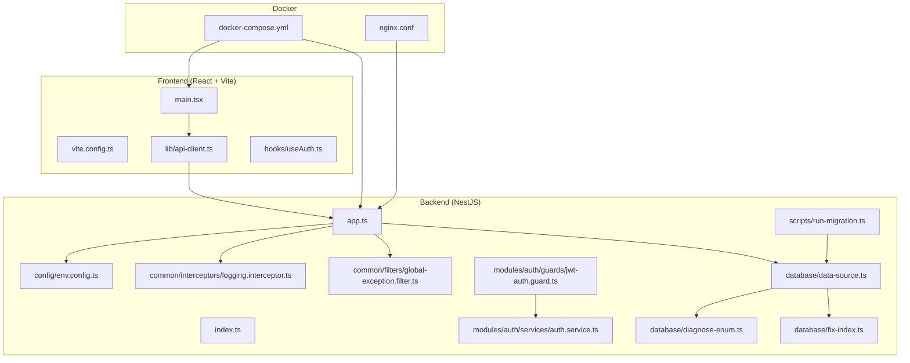
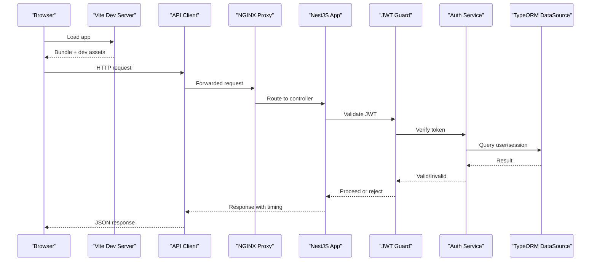
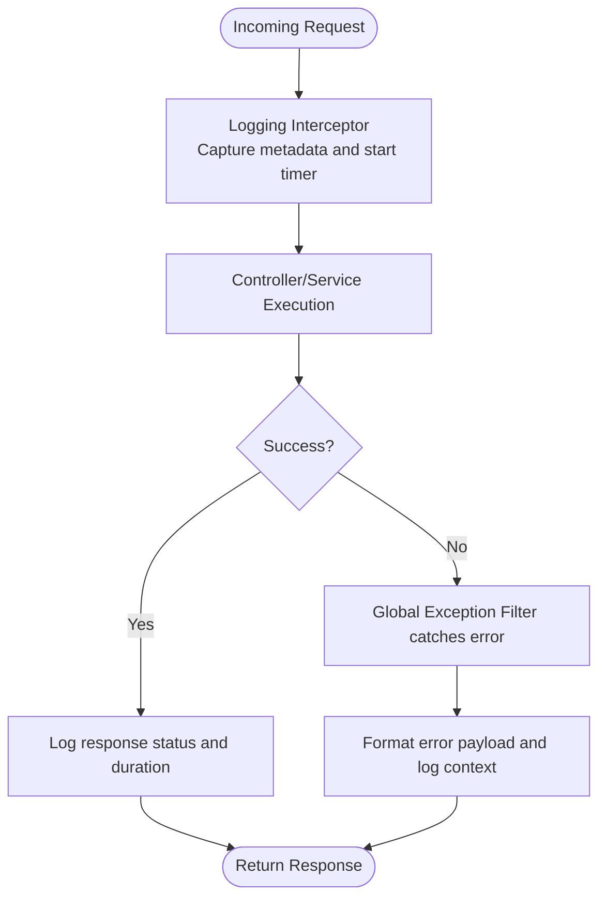
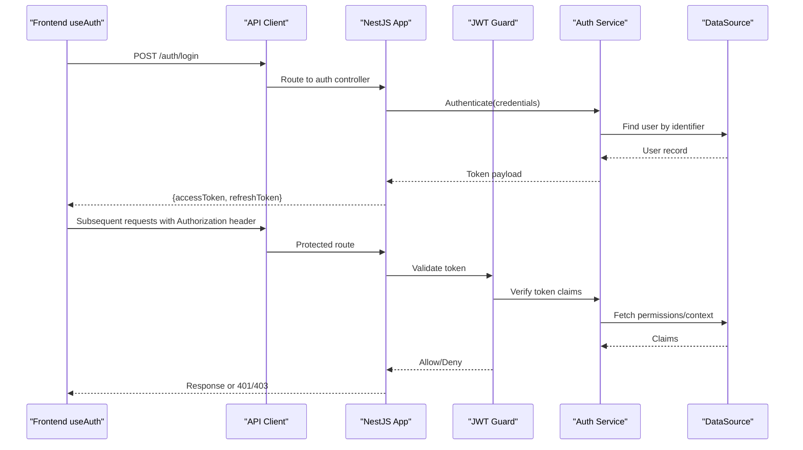
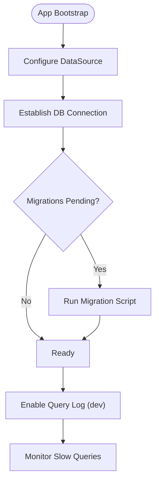
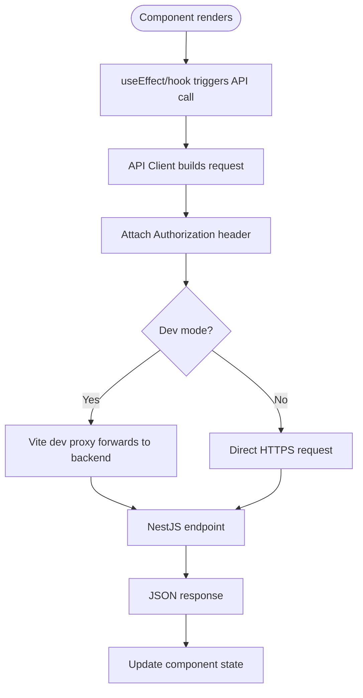
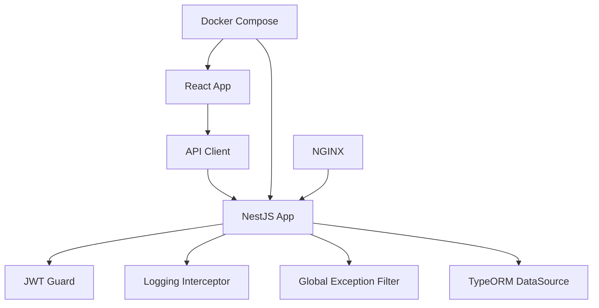

# Debugging & Performance Profiling

<cite>
**Referenced Files in This Document**
- [backend/src/app.ts](file://backend/src/app.ts)
- [backend/src/index.ts](file://backend/src/index.ts)
- [backend/src/config/env.config.ts](file://backend/src/config/env.config.ts)
- [backend/src/common/interceptors/logging.interceptor.ts](file://backend/src/common/interceptors/logging.interceptor.ts)
- [backend/src/common/filters/global-exception.filter.ts](file://backend/src/common/filters/global-exception.filter.ts)
- [backend/src/modules/auth/guards/jwt-auth.guard.ts](file://backend/src/modules/auth/guards/jwt-auth.guard.ts)
- [backend/src/modules/auth/services/auth.service.ts](file://backend/src/modules/auth/services/auth.service.ts)
- [backend/src/database/data-source.ts](file://backend/src/database/data-source.ts)
- [backend/src/database/diagnose-enum.ts](file://backend/src/database/diagnose-enum.ts)
- [backend/src/database/fix-index.ts](file://backend/src/database/fix-index.ts)
- [backend/scripts/run-migration.ts](file://backend/scripts/run-migration.ts)
- [backend/package.json](file://backend/package.json)
- [frontend/src/main.tsx](file://frontend/src/main.tsx)
- [frontend/vite.config.ts](file://frontend/vite.config.ts)
- [frontend/src/lib/api-client.ts](file://frontend/src/lib/api-client.ts)
- [frontend/src/hooks/useAuth.ts](file://frontend/src/hooks/useAuth.ts)
- [docker/docker-compose.yml](file://docker/docker-compose.yml)
- [docker/nginx.conf](file://docker/nginx.conf)
</cite>

## Table of Contents
1. [Introduction](#introduction)
2. [Project Structure](#project-structure)
3. [Core Components](#core-components)
4. [Architecture Overview](#architecture-overview)
5. [Detailed Component Analysis](#detailed-component-analysis)
6. [Dependency Analysis](#dependency-analysis)
7. [Performance Considerations](#performance-considerations)
8. [Troubleshooting Guide](#troubleshooting-guide)
9. [Conclusion](#conclusion)
10. [Appendices](#appendices)

## Introduction
This guide provides a comprehensive approach to debugging and performance profiling for eLISAschool, covering both the NestJS backend and React frontend. It explains logging strategies, log levels, centralized log management, and practical techniques for identifying bottlenecks in database queries, API responses, and frontend rendering. It also includes memory leak detection, CPU profiling, network request analysis, and troubleshooting workflows for common issues such as authentication problems, database connection issues, and CORS errors.

## Project Structure
The project is organized into:
- Backend (NestJS): application entry point, configuration, modules, interceptors, filters, database setup, and scripts.
- Frontend (React + Vite): application entry point, API client, hooks, and build configuration.
- Docker: container orchestration and reverse proxy configuration.

**Diagram sources**
- [backend/src/app.ts](file://backend/src/app.ts)
- [backend/src/index.ts](file://backend/src/index.ts)
- [backend/src/config/env.config.ts](file://backend/src/config/env.config.ts)
- [backend/src/common/interceptors/logging.interceptor.ts](file://backend/src/common/interceptors/logging.interceptor.ts)
- [backend/src/common/filters/global-exception.filter.ts](file://backend/src/common/filters/global-exception.filter.ts)
- [backend/src/modules/auth/guards/jwt-auth.guard.ts](file://backend/src/modules/auth/guards/jwt-auth.guard.ts)
- [backend/src/modules/auth/services/auth.service.ts](file://backend/src/modules/auth/services/auth.service.ts)
- [backend/src/database/data-source.ts](file://backend/src/database/data-source.ts)
- [backend/src/database/diagnose-enum.ts](file://backend/src/database/diagnose-enum.ts)
- [backend/src/database/fix-index.ts](file://backend/src/database/fix-index.ts)
- [backend/scripts/run-migration.ts](file://backend/scripts/run-migration.ts)
- [frontend/src/main.tsx](file://frontend/src/main.tsx)
- [frontend/vite.config.ts](file://frontend/vite.config.ts)
- [frontend/src/lib/api-client.ts](file://frontend/src/lib/api-client.ts)
- [frontend/src/hooks/useAuth.ts](file://frontend/src/hooks/useAuth.ts)
- [docker/docker-compose.yml](file://docker/docker-compose.yml)
- [docker/nginx.conf](file://docker/nginx.conf)

**Section sources**
- [backend/src/app.ts](file://backend/src/app.ts)
- [backend/src/index.ts](file://backend/src/index.ts)
- [backend/src/config/env.config.ts](file://backend/src/config/env.config.ts)
- [backend/src/common/interceptors/logging.interceptor.ts](file://backend/src/common/interceptors/logging.interceptor.ts)
- [backend/src/common/filters/global-exception.filter.ts](file://backend/src/common/filters/global-exception.filter.ts)
- [backend/src/modules/auth/guards/jwt-auth.guard.ts](file://backend/src/modules/auth/guards/jwt-auth.guard.ts)
- [backend/src/modules/auth/services/auth.service.ts](file://backend/src/modules/auth/services/auth.service.ts)
- [backend/src/database/data-source.ts](file://backend/src/database/data-source.ts)
- [backend/src/database/diagnose-enum.ts](file://backend/src/database/diagnose-enum.ts)
- [backend/src/database/fix-index.ts](file://backend/src/database/fix-index.ts)
- [backend/scripts/run-migration.ts](file://backend/scripts/run-migration.ts)
- [frontend/src/main.tsx](file://frontend/src/main.tsx)
- [frontend/vite.config.ts](file://frontend/vite.config.ts)
- [frontend/src/lib/api-client.ts](file://frontend/src/lib/api-client.ts)
- [frontend/src/hooks/useAuth.ts](file://frontend/src/hooks/useAuth.ts)
- [docker/docker-compose.yml](file://docker/docker-compose.yml)
- [docker/nginx.conf](file://docker/nginx.conf)

## Core Components
- Application bootstrap and global configuration:
  - Entry points initialize environment variables, database connections, and middleware.
  - Global exception filter centralizes error formatting and logging.
  - Logging interceptor captures request/response metadata and timing.
- Authentication flow:
  - JWT guard validates tokens and enforces access control.
  - Auth service handles token issuance and validation logic.
- Database layer:
  - Data source configures TypeORM with connection parameters and options.
  - Diagnostic utilities assist with enum inspection and index fixes.
- Frontend integration:
  - API client wraps HTTP calls, attaches headers, and handles errors.
  - Auth hook manages session state and token lifecycle.
  - Vite configuration supports development proxies and debugging flags.

**Section sources**
- [backend/src/app.ts](file://backend/src/app.ts)
- [backend/src/index.ts](file://backend/src/index.ts)
- [backend/src/config/env.config.ts](file://backend/src/config/env.config.ts)
- [backend/src/common/interceptors/logging.interceptor.ts](file://backend/src/common/interceptors/logging.interceptor.ts)
- [backend/src/common/filters/global-exception.filter.ts](file://backend/src/common/filters/global-exception.filter.ts)
- [backend/src/modules/auth/guards/jwt-auth.guard.ts](file://backend/src/modules/auth/guards/jwt-auth.guard.ts)
- [backend/src/modules/auth/services/auth.service.ts](file://backend/src/modules/auth/services/auth.service.ts)
- [backend/src/database/data-source.ts](file://backend/src/database/data-source.ts)
- [backend/src/database/diagnose-enum.ts](file://backend/src/database/diagnose-enum.ts)
- [backend/src/database/fix-index.ts](file://backend/src/database/fix-index.ts)
- [frontend/src/lib/api-client.ts](file://frontend/src/lib/api-client.ts)
- [frontend/src/hooks/useAuth.ts](file://frontend/src/hooks/useAuth.ts)
- [frontend/vite.config.ts](file://frontend/vite.config.ts)

## Architecture Overview
End-to-end request flow from browser to database and back, including logging and error handling.

**Diagram sources**
- [frontend/src/lib/api-client.ts](file://frontend/src/lib/api-client.ts)
- [docker/nginx.conf](file://docker/nginx.conf)
- [backend/src/app.ts](file://backend/src/app.ts)
- [backend/src/modules/auth/guards/jwt-auth.guard.ts](file://backend/src/modules/auth/guards/jwt-auth.guard.ts)
- [backend/src/modules/auth/services/auth.service.ts](file://backend/src/modules/auth/services/auth.service.ts)
- [backend/src/database/data-source.ts](file://backend/src/database/data-source.ts)

## Detailed Component Analysis

### Backend Logging and Error Handling
- Logging Interceptor:
  - Captures incoming requests, method, path, and correlation IDs.
  - Measures response time and logs outcomes consistently.
  - Integrates with NestJS pipeline to ensure uniform telemetry.
- Global Exception Filter:
  - Centralizes error formatting and stack traces.
  - Ensures consistent error payloads and prevents leaking sensitive details.
  - Logs exceptions with context for faster triage.

**Diagram sources**
- [backend/src/common/interceptors/logging.interceptor.ts](file://backend/src/common/interceptors/logging.interceptor.ts)
- [backend/src/common/filters/global-exception.filter.ts](file://backend/src/common/filters/global-exception.filter.ts)

**Section sources**
- [backend/src/common/interceptors/logging.interceptor.ts](file://backend/src/common/interceptors/logging.interceptor.ts)
- [backend/src/common/filters/global-exception.filter.ts](file://backend/src/common/filters/global-exception.filter.ts)

### Authentication Flow Debugging
- JWT Guard:
  - Validates token presence, signature, and expiration.
  - Extracts tenant context when applicable.
- Auth Service:
  - Verifies user credentials and issues tokens.
  - Handles multi-tenant scoping and permission checks.

**Diagram sources**
- [frontend/src/hooks/useAuth.ts](file://frontend/src/hooks/useAuth.ts)
- [frontend/src/lib/api-client.ts](file://frontend/src/lib/api-client.ts)
- [backend/src/modules/auth/guards/jwt-auth.guard.ts](file://backend/src/modules/auth/guards/jwt-auth.guard.ts)
- [backend/src/modules/auth/services/auth.service.ts](file://backend/src/modules/auth/services/auth.service.ts)
- [backend/src/database/data-source.ts](file://backend/src/database/data-source.ts)

**Section sources**
- [backend/src/modules/auth/guards/jwt-auth.guard.ts](file://backend/src/modules/auth/guards/jwt-auth.guard.ts)
- [backend/src/modules/auth/services/auth.service.ts](file://backend/src/modules/auth/services/auth.service.ts)
- [frontend/src/hooks/useAuth.ts](file://frontend/src/hooks/useAuth.ts)
- [frontend/src/lib/api-client.ts](file://frontend/src/lib/api-client.ts)

### Database Layer Diagnostics
- DataSource Configuration:
  - Connection parameters, SSL settings, and pool sizing.
  - Enables query logging in development for slow query identification.
- Diagnostic Utilities:
  - Enum diagnosis script helps validate schema consistency.
  - Index fix utility assists in repairing missing or duplicate indexes.

**Diagram sources**
- [backend/src/database/data-source.ts](file://backend/src/database/data-source.ts)
- [backend/scripts/run-migration.ts](file://backend/scripts/run-migration.ts)
- [backend/src/database/diagnose-enum.ts](file://backend/src/database/diagnose-enum.ts)
- [backend/src/database/fix-index.ts](file://backend/src/database/fix-index.ts)

**Section sources**
- [backend/src/database/data-source.ts](file://backend/src/database/data-source.ts)
- [backend/scripts/run-migration.ts](file://backend/scripts/run-migration.ts)
- [backend/src/database/diagnose-enum.ts](file://backend/src/database/diagnose-enum.ts)
- [backend/src/database/fix-index.ts](file://backend/src/database/fix-index.ts)

### Frontend Networking and Dev Tools
- API Client:
  - Centralized HTTP wrapper with base URL, headers, and error mapping.
  - Attaches authorization tokens and refresh logic.
- Vite Configuration:
  - Development server proxy to backend to avoid CORS during local dev.
  - Enables debug flags and source maps for easier tracing.

**Diagram sources**
- [frontend/src/lib/api-client.ts](file://frontend/src/lib/api-client.ts)
- [frontend/vite.config.ts](file://frontend/vite.config.ts)

**Section sources**
- [frontend/src/lib/api-client.ts](file://frontend/src/lib/api-client.ts)
- [frontend/vite.config.ts](file://frontend/vite.config.ts)

## Dependency Analysis
Key runtime dependencies and their roles:
- NestJS core and modules provide routing, guards, interceptors, and DI.
- TypeORM manages entity relationships and migrations.
- Vite powers the frontend dev server and production build.
- Docker Compose orchestrates services; NGINX acts as reverse proxy.

**Diagram sources**
- [backend/src/app.ts](file://backend/src/app.ts)
- [backend/src/modules/auth/guards/jwt-auth.guard.ts](file://backend/src/modules/auth/guards/jwt-auth.guard.ts)
- [backend/src/common/interceptors/logging.interceptor.ts](file://backend/src/common/interceptors/logging.interceptor.ts)
- [backend/src/common/filters/global-exception.filter.ts](file://backend/src/common/filters/global-exception.filter.ts)
- [backend/src/database/data-source.ts](file://backend/src/database/data-source.ts)
- [frontend/src/lib/api-client.ts](file://frontend/src/lib/api-client.ts)
- [docker/docker-compose.yml](file://docker/docker-compose.yml)
- [docker/nginx.conf](file://docker/nginx.conf)

**Section sources**
- [backend/src/app.ts](file://backend/src/app.ts)
- [backend/src/modules/auth/guards/jwt-auth.guard.ts](file://backend/src/modules/auth/guards/jwt-auth.guard.ts)
- [backend/src/common/interceptors/logging.interceptor.ts](file://backend/src/common/interceptors/logging.interceptor.ts)
- [backend/src/common/filters/global-exception.filter.ts](file://backend/src/common/filters/global-exception.filter.ts)
- [backend/src/database/data-source.ts](file://backend/src/database/data-source.ts)
- [frontend/src/lib/api-client.ts](file://frontend/src/lib/api-client.ts)
- [docker/docker-compose.yml](file://docker/docker-compose.yml)
- [docker/nginx.conf](file://docker/nginx.conf)

## Performance Considerations
- Backend:
  - Use the logging interceptor to measure per-request latency and identify slow endpoints.
  - Enable TypeORM query logging in development to detect N+1 queries and heavy joins.
  - Review database indexes using diagnostic utilities and migration scripts.
- Frontend:
  - Leverage browser DevTools Network tab to analyze request sizes, timings, and caching.
  - Use React DevTools Profiler to pinpoint expensive re-renders and unnecessary updates.
  - Inspect memory snapshots to detect retained references and potential leaks.
- Infrastructure:
  - Validate NGINX proxy settings and upstream timeouts.
  - Ensure Docker resource limits are appropriate for load testing.

[No sources needed since this section provides general guidance]

## Troubleshooting Guide

### Authentication Problems
Symptoms:
- Repeated 401 Unauthorized or 403 Forbidden responses.
- Tokens not attached or expired prematurely.

Workflows:
- Verify token issuance via login endpoint and inspect Authorization header on subsequent requests.
- Check JWT secret configuration and expiration settings.
- Confirm multi-tenant context extraction in guard and service layers.
- Inspect global exception filter logs for detailed error context.

**Section sources**
- [backend/src/modules/auth/guards/jwt-auth.guard.ts](file://backend/src/modules/auth/guards/jwt-auth.guard.ts)
- [backend/src/modules/auth/services/auth.service.ts](file://backend/src/modules/auth/services/auth.service.ts)
- [backend/src/common/filters/global-exception.filter.ts](file://backend/src/common/filters/global-exception.filter.ts)
- [frontend/src/hooks/useAuth.ts](file://frontend/src/hooks/useAuth.ts)
- [frontend/src/lib/api-client.ts](file://frontend/src/lib/api-client.ts)

### Database Connection Issues
Symptoms:
- Application fails to start due to connection errors.
- Intermittent timeouts or deadlocks under load.

Workflows:
- Validate DataSource configuration (host, port, credentials, SSL).
- Run migration script to ensure schema readiness.
- Use enum diagnosis and index fix utilities to resolve schema inconsistencies.
- Enable query logging to capture failing statements.

**Section sources**
- [backend/src/database/data-source.ts](file://backend/src/database/data-source.ts)
- [backend/scripts/run-migration.ts](file://backend/scripts/run-migration.ts)
- [backend/src/database/diagnose-enum.ts](file://backend/src/database/diagnose-enum.ts)
- [backend/src/database/fix-index.ts](file://backend/src/database/fix-index.ts)

### CORS Errors
Symptoms:
- Blocked requests in browser console due to cross-origin policy.
- Preflight failures or missing Access-Control headers.

Workflows:
- In development, ensure Vite dev proxy forwards requests to backend.
- In production, verify NGINX proxy configuration and allowed origins/methods.
- Confirm NestJS CORS settings if used directly without NGINX.

**Section sources**
- [frontend/vite.config.ts](file://frontend/vite.config.ts)
- [docker/nginx.conf](file://docker/nginx.conf)
- [backend/src/app.ts](file://backend/src/app.ts)

### Memory Leak Detection (Frontend)
Techniques:
- Take heap snapshots in Chrome DevTools and compare before/after navigation.
- Look for retained DOM nodes, event listeners, and closures holding references.
- Debounce/throttle frequent handlers and clean up subscriptions in useEffect.

[No sources needed since this section provides general guidance]

### CPU Profiling (Frontend)
Techniques:
- Use React DevTools Profiler to record interactions and identify costly components.
- Profile long tasks in Performance tab to find blocking operations.
- Optimize memoization and reduce re-renders where necessary.

[No sources needed since this section provides general guidance]

### Network Request Analysis (Frontend)
Techniques:
- Inspect Network tab for request/response payloads, timings, and cache usage.
- Validate Authorization headers and cookie policies.
- Use API client logs to correlate frontend calls with backend logs.

**Section sources**
- [frontend/src/lib/api-client.ts](file://frontend/src/lib/api-client.ts)
- [backend/src/common/interceptors/logging.interceptor.ts](file://backend/src/common/interceptors/logging.interceptor.ts)

### Centralized Log Management
Strategies:
- Standardize log format across interceptors and filters.
- Include correlation IDs and tenant context for traceability.
- Aggregate logs in a centralized system (e.g., file-based or external service) and enable structured parsing.

[No sources needed since this section provides general guidance]

## Conclusion
By combining structured logging, robust error handling, and targeted profiling tools, teams can efficiently diagnose and optimize eLISAschool. Focus on request-level telemetry, database query visibility, and frontend render/memory diagnostics. Use the provided utilities and configurations to streamline troubleshooting and maintain high performance across environments.

[No sources needed since this section summarizes without analyzing specific files]

## Appendices

### Environment and Scripts
- Backend package scripts:
  - Development startup, hot reload, and test execution commands.
- Docker Compose:
  - Service definitions for backend, frontend, database, and proxy.

**Section sources**
- [backend/package.json](file://backend/package.json)
- [docker/docker-compose.yml](file://docker/docker-compose.yml)