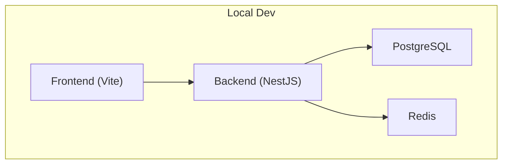
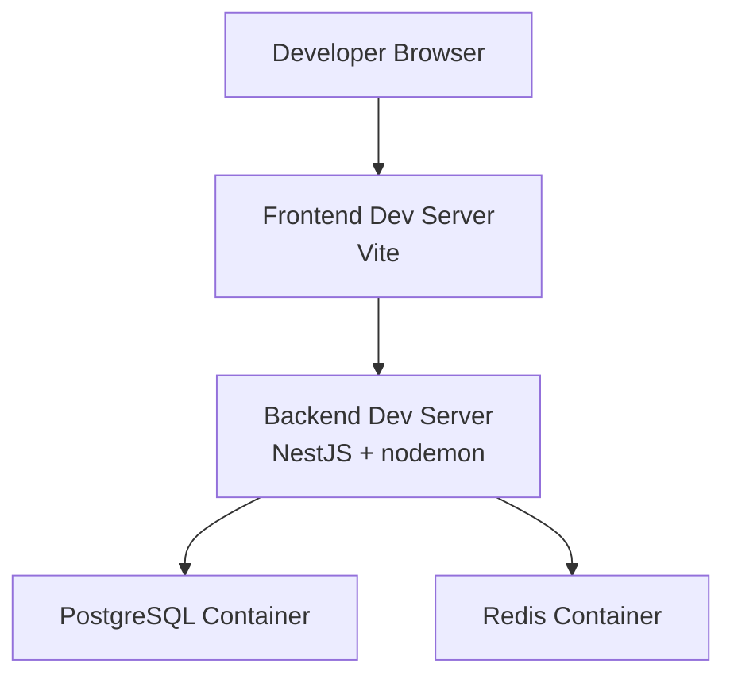
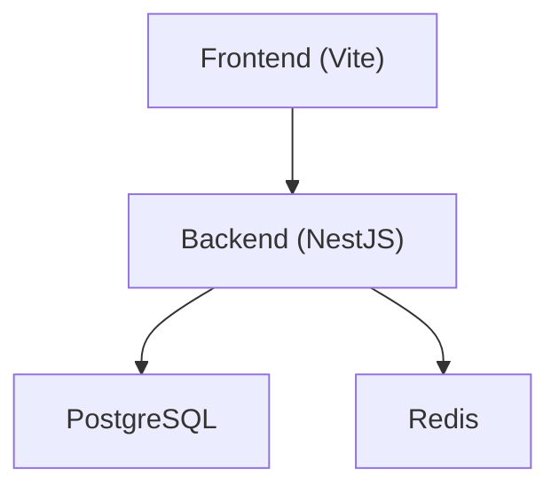

# Development Environment Setup

<cite>
**Referenced Files in This Document**
- [README.md](file://README.md)
- [QUICKSTART.md](file://QUICKSTART.md)
- [backend/package.json](file://backend/package.json)
- [backend/nodemon.json](file://backend/nodemon.json)
- [backend/src/config/env.config.ts](file://backend/src/config/env.config.ts)
- [backend/src/config/database.config.ts](file://backend/src/config/database.config.ts)
- [backend/src/index.ts](file://backend/src/index.ts)
- [docker/docker-compose.yml](file://docker/docker-compose.yml)
- [docker/docker-compose.local.dev.yml](file://docker/docker-compose.local.dev.yml)
- [docker/Dockerfile.backend.dev](file://docker/Dockerfile.backend.dev)
- [docker/QUICK-START.md](file://docker/QUICK-START.md)
- [frontend/vite.config.ts](file://frontend/vite.config.ts)
- [scripts/start-dev.sh](file://scripts/start-dev.sh)
- [scripts/verify-setup.sh](file://scripts/verify-setup.sh)
- [scripts/verify-ports.sh](file://scripts/verify-ports.sh)
- [scripts/test-redis.sh](file://scripts/test-redis.sh)
- [scripts/creer-base-de-donnees.sh](file://scripts/creer-base-de-donnees.sh)
- [scripts/run-seeds.sh](file://scripts/run-seeds.sh)
- [backend/scripts/run-migration.ts](file://backend/scripts/run-migration.ts)
- [backend/scripts/run-pending-migrations.ts](file://backend/scripts/run-pending-migrations.ts)
</cite>

## Table of Contents
1. [Introduction](#introduction)
2. [Project Structure](#project-structure)
3. [Core Components](#core-components)
4. [Architecture Overview](#architecture-overview)
5. [Detailed Component Analysis](#detailed-component-analysis)
6. [Dependency Analysis](#dependency-analysis)
7. [Performance Considerations](#performance-considerations)
8. [Troubleshooting Guide](#troubleshooting-guide)
9. [Conclusion](#conclusion)
10. [Appendices](#appendices)

## Introduction
This guide explains how to set up a complete local development environment for eLISAschool, including prerequisites (Node.js, PostgreSQL, Redis), environment configuration, database initialization, and service dependencies. It also covers Docker-based development using docker-compose, hot reload configuration, development scripts, and IDE recommendations. The goal is to help you get the backend, frontend, database, and cache services running locally with minimal friction.

## Project Structure
eLISAschool is a multi-package monorepo with:
- Backend: NestJS application with TypeORM migrations and seeds
- Frontend: Vite + React application
- Shared: TypeScript package shared between frontend and backend
- Docker: Compose files and Dockerfiles for containerized development
- Scripts: Utility scripts for setup, verification, and maintenance

[No sources needed since this diagram shows conceptual workflow, not actual code structure]

**Section sources**
- [README.md](file://README.md)
- [QUICKSTART.md](file://QUICKSTART.md)

## Core Components
- Node.js runtime and tooling for both frontend and backend
- PostgreSQL for persistent data
- Redis for caching and session storage
- Docker Compose for orchestrating services during development
- Development servers with hot reload for fast iteration

Key responsibilities:
- Backend: API server, database migrations, seeds, background tasks
- Frontend: UI and client-side logic
- Database: Relational data persistence
- Cache: In-memory store for sessions and performance-sensitive data

**Section sources**
- [backend/package.json](file://backend/package.json)
- [frontend/vite.config.ts](file://frontend/vite.config.ts)
- [docker/docker-compose.yml](file://docker/docker-compose.yml)

## Architecture Overview
The development architecture consists of:
- Frontend dev server (Vite) proxying API calls to the backend
- Backend dev server (NestJS) with hot reload via nodemon
- PostgreSQL container providing the relational database
- Redis container providing caching/session storage

**Diagram sources**
- [docker/docker-compose.yml](file://docker/docker-compose.yml)
- [backend/nodemon.json](file://backend/nodemon.json)
- [frontend/vite.config.ts](file://frontend/vite.config.ts)

## Detailed Component Analysis

### Prerequisites
- Node.js: Use the version specified by the project’s engine configuration. Install a matching LTS release and ensure npm or pnpm is available.
- PostgreSQL: Install a compatible version or use the provided Docker image. Ensure the default ports are free.
- Redis: Install a compatible version or use the provided Docker image. Ensure the default ports are free.
- Docker and Docker Compose: Required if you prefer containerized development.

Verification tips:
- Confirm Node.js version matches the project requirement.
- Check that PostgreSQL and Redis are reachable on expected ports.
- Validate Docker Compose availability and permissions.

**Section sources**
- [backend/package.json](file://backend/package.json)
- [docker/docker-compose.yml](file://docker/docker-compose.yml)

### Local Development Without Docker
Steps:
1. Install dependencies in backend and frontend directories.
2. Configure environment variables for the backend (database URL, Redis URL, JWT secret, etc.).
3. Initialize the database schema by running migrations.
4. Seed initial data if required.
5. Start the backend dev server with hot reload.
6. Start the frontend dev server and verify API connectivity.

Environment variables:
- Backend configuration is loaded from environment variables. Review the env configuration module to identify required keys such as database connection string, Redis URL, and JWT settings.

Database initialization:
- Run pending migrations using the provided migration script.
- Optionally run seed scripts to populate initial data.

Hot reload:
- Backend uses nodemon for automatic restarts on file changes.
- Frontend uses Vite’s built-in HMR.

**Section sources**
- [backend/src/config/env.config.ts](file://backend/src/config/env.config.ts)
- [backend/src/config/database.config.ts](file://backend/src/config/database.config.ts)
- [backend/nodemon.json](file://backend/nodemon.json)
- [backend/scripts/run-migration.ts](file://backend/scripts/run-migration.ts)
- [backend/scripts/run-pending-migrations.ts](file://backend/scripts/run-pending-migrations.ts)
- [scripts/run-seeds.sh](file://scripts/run-seeds.sh)
- [frontend/vite.config.ts](file://frontend/vite.config.ts)

### Docker-Based Development
Use docker-compose to spin up all services together:
- Start containers for PostgreSQL and Redis.
- Build and run the backend dev image with hot reload enabled.
- Run the frontend dev server and proxy API requests to the backend.

Compose files:
- docker-compose.yml defines base services and networks.
- docker-compose.local.dev.yml extends the base for local development overrides.

Dockerfiles:
- Dockerfile.backend.dev configures the backend development image with hot reload and dependency installation.

Quick start:
- Follow the Docker quick start guide to bring up the stack and access the app.

**Section sources**
- [docker/docker-compose.yml](file://docker/docker-compose.yml)
- [docker/docker-compose.local.dev.yml](file://docker/docker-compose.local.dev.yml)
- [docker/Dockerfile.backend.dev](file://docker/Dockerfile.backend.dev)
- [docker/QUICK-START.md](file://docker/QUICK-START.md)

### Service Dependencies and Ports
Common ports:
- Frontend dev server: typically 3000 or similar
- Backend API: typically 3000 or similar
- PostgreSQL: 5432
- Redis: 6379

Port conflicts:
- If any port is already in use, adjust compose port mappings or local service configurations accordingly.
- Use the provided port verification script to detect conflicts.

**Section sources**
- [scripts/verify-ports.sh](file://scripts/verify-ports.sh)
- [docker/docker-compose.yml](file://docker/docker-compose.yml)

### Database Initialization and Migrations
- Create the database if it does not exist.
- Apply all pending migrations to build the schema.
- Run seed scripts to create baseline data.

Recommended order:
1. Verify database connectivity.
2. Run migrations.
3. Run seeds.
4. Start backend and frontend.

**Section sources**
- [scripts/creer-base-de-donnees.sh](file://scripts/creer-base-de-donnees.sh)
- [backend/scripts/run-migration.ts](file://backend/scripts/run-migration.ts)
- [backend/scripts/run-pending-migrations.ts](file://backend/scripts/run-pending-migrations.ts)
- [scripts/run-seeds.sh](file://scripts/run-seeds.sh)

### Environment Variables Configuration
Required backend variables include:
- Database connection details (host, port, user, password, database name)
- Redis connection details (host, port, password if applicable)
- JWT secret and token expiration settings
- Application port and CORS origins

Configuration loading:
- The backend loads environment variables at startup and validates them before initializing services.

Best practices:
- Keep secrets out of version control; use .env files per developer.
- Validate required variables early to fail fast.

**Section sources**
- [backend/src/config/env.config.ts](file://backend/src/config/env.config.ts)
- [backend/src/config/database.config.ts](file://backend/src/config/database.config.ts)

### Hot Reload and Development Workflow
- Backend: nodemon watches source files and restarts the process automatically.
- Frontend: Vite provides instant HMR for rapid feedback.
- Combined workflow: Start backend and frontend concurrently using the provided development script.

**Section sources**
- [backend/nodemon.json](file://backend/nodemon.json)
- [frontend/vite.config.ts](file://frontend/vite.config.ts)
- [scripts/start-dev.sh](file://scripts/start-dev.sh)

### IDE Setup Recommendations
- Enable TypeScript support and linting for both backend and frontend.
- Configure ESLint and Prettier integrations.
- Set up debugging launch configurations for NestJS and Vite.
- Use Docker integration to develop inside containers if preferred.

[No sources needed since this section doesn't analyze specific source files]

## Dependency Analysis
The following diagram illustrates key runtime dependencies during development:

**Diagram sources**
- [docker/docker-compose.yml](file://docker/docker-compose.yml)
- [backend/src/config/database.config.ts](file://backend/src/config/database.config.ts)
- [backend/src/config/env.config.ts](file://backend/src/config/env.config.ts)

**Section sources**
- [docker/docker-compose.yml](file://docker/docker-compose.yml)
- [backend/src/config/database.config.ts](file://backend/src/config/database.config.ts)
- [backend/src/config/env.config.ts](file://backend/src/config/env.config.ts)

## Performance Considerations
- Prefer Docker volumes for database and cache data to avoid reinitialization overhead.
- Use incremental builds and keep node_modules cached in Docker layers.
- Limit excessive logging in development to reduce I/O pressure.
- Monitor memory usage when running multiple services locally.

[No sources needed since this section provides general guidance]

## Troubleshooting Guide
Common issues and resolutions:
- Port conflicts: Use the port verification script to detect and resolve conflicts. Adjust compose mappings or stop conflicting processes.
- Database connection errors: Verify credentials, host, and port. Ensure the database exists and migrations have been applied.
- Redis connection errors: Confirm Redis is running and accessible. Use the Redis test script to validate connectivity.
- CORS errors: Ensure frontend origin is allowed in backend CORS configuration.
- Migration failures: Inspect migration logs and rollback steps if necessary. Re-run migrations after fixing schema issues.
- Hot reload not triggering: Confirm nodemon watch paths and file change events. Restart the backend if needed.

Operational checks:
- Use the setup verification script to validate prerequisites and basic connectivity.
- Use the Redis test script to confirm cache availability.

**Section sources**
- [scripts/verify-setup.sh](file://scripts/verify-setup.sh)
- [scripts/verify-ports.sh](file://scripts/verify-ports.sh)
- [scripts/test-redis.sh](file://scripts/test-redis.sh)
- [backend/src/config/database.config.ts](file://backend/src/config/database.config.ts)
- [backend/src/config/env.config.ts](file://backend/src/config/env.config.ts)
- [backend/nodemon.json](file://backend/nodemon.json)

## Conclusion
You now have a complete guide to setting up eLISAschool locally, whether using native services or Docker Compose. With proper environment configuration, database initialization, and hot reload enabled, you can iterate quickly and confidently. Use the troubleshooting section to diagnose common issues and leverage the scripts to automate routine tasks.

[No sources needed since this section summarizes without analyzing specific files]

## Appendices

### Quick Start Commands
- Native development:
  - Install dependencies, configure environment, run migrations, start backend and frontend.
- Docker development:
  - Bring up the stack with docker-compose, then access the frontend and backend endpoints.

**Section sources**
- [QUICKSTART.md](file://QUICKSTART.md)
- [docker/QUICK-START.md](file://docker/QUICK-START.md)
- [scripts/start-dev.sh](file://scripts/start-dev.sh)

### Key Entry Points
- Backend entry point: initializes configuration, database, and routes.
- Frontend entry point: bootstraps the Vite dev server and application.

**Section sources**
- [backend/src/index.ts](file://backend/src/index.ts)
- [frontend/vite.config.ts](file://frontend/vite.config.ts)