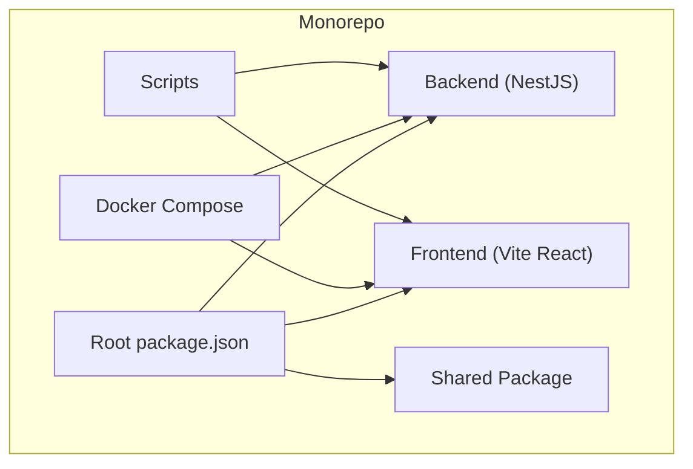
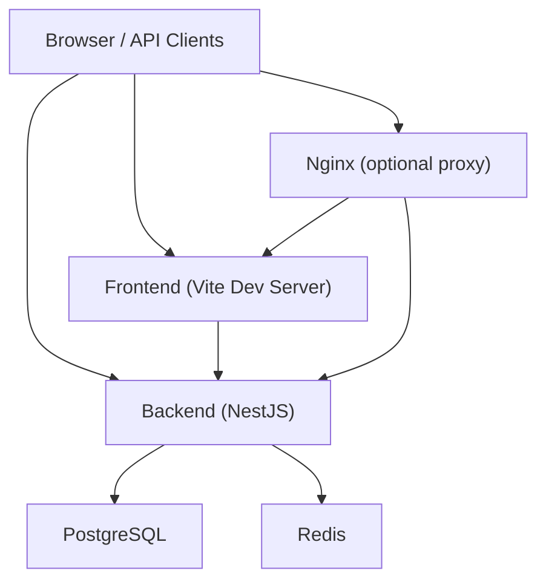
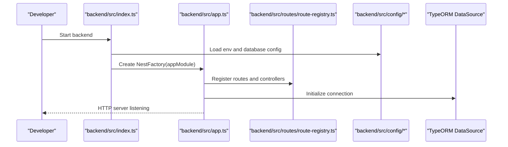
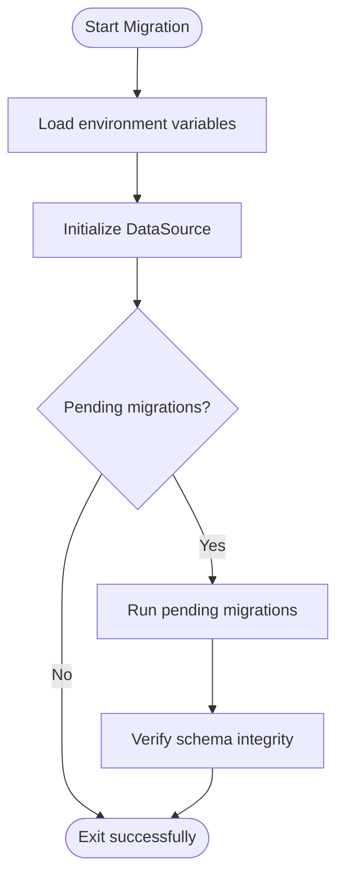
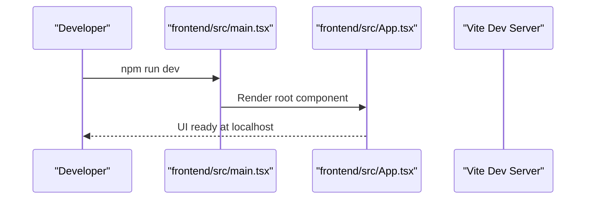
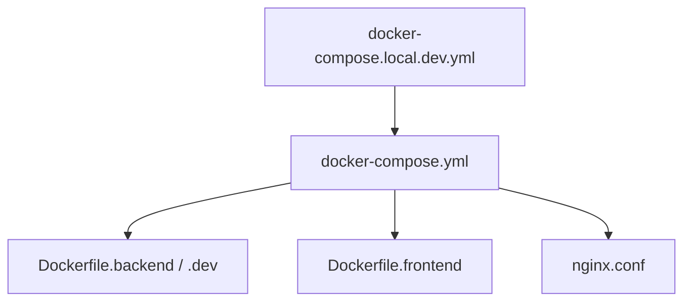
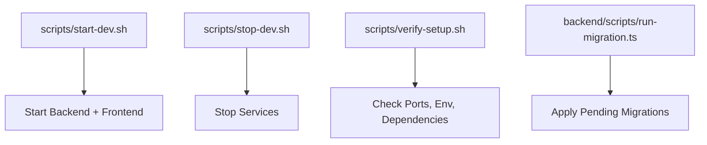
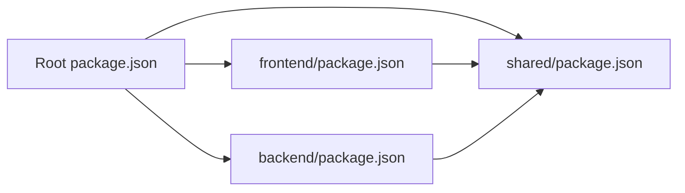

# Development Guide

<cite>
**Referenced Files in This Document**
- [README.md](file://README.md)
- [QUICKSTART.md](file://QUICKSTART.md)
- [package.json](file://package.json)
- [backend/package.json](file://backend/package.json)
- [frontend/package.json](file://frontend/package.json)
- [shared/package.json](file://shared/package.json)
- [docker-compose.yml](file://docker/docker-compose.yml)
- [docker-compose.local.dev.yml](file://docker/docker-compose.local.dev.yml)
- [Dockerfile.backend](file://docker/Dockerfile.backend)
- [Dockerfile.backend.dev](file://docker/Dockerfile.backend.dev)
- [Dockerfile.frontend](file://docker/Dockerfile.frontend)
- [nginx.conf](file://docker/nginx.conf)
- [start-dev.sh](file://scripts/start-dev.sh)
- [stop-dev.sh](file://scripts/stop-dev.sh)
- [verify-setup.sh](file://scripts/verify-setup.sh)
- [run-migration.ts](file://backend/scripts/run-migration.ts)
- [run-pending-migrations.ts](file://backend/scripts/run-pending-migrations.ts)
- [data-source.ts](file://backend/src/database/data-source.ts)
- [database.config.ts](file://backend/src/config/database.config.ts)
- [env.config.ts](file://backend/src/config/env.config.ts)
- [index.ts](file://backend/src/index.ts)
- [app.ts](file://backend/src/app.ts)
- [route-registry.ts](file://backend/src/routes/route-registry.ts)
- [eslint.config.js](file://backend/eslint.config.js)
- [nodemon.json](file://backend/nodemon.json)
- [tsconfig.json](file://backend/tsconfig.json)
- [vite.config.ts](file://frontend/vite.config.ts)
- [main.tsx](file://frontend/src/main.tsx)
- [App.tsx](file://frontend/src/App.tsx)
- [AGENTS.md](file://AGENTS.md)
- [CHEATSHEET.md](file://CHEATSHEET.md)
- [INDEX.md](file://INDEX.md)
</cite>

## Table of Contents
1. [Introduction](#introduction)
2. [Project Structure](#project-structure)
3. [Core Components](#core-components)
4. [Architecture Overview](#architecture-overview)
5. [Detailed Component Analysis](#detailed-component-analysis)
6. [Dependency Analysis](#dependency-analysis)
7. [Performance Considerations](#performance-considerations)
8. [Troubleshooting Guide](#troubleshooting-guide)
9. [Conclusion](#conclusion)
10. [Appendices](#appendices)

## Introduction
This development guide explains how to set up a local development environment for eLISAschool, coding standards, and workflows. It covers Node.js configuration, database initialization, development scripts, modular architecture patterns, code organization conventions, testing strategies, debugging techniques, logging patterns, performance profiling, guidelines for creating new modules, extending functionality, contributing to the codebase, code review processes, version control workflows, and continuous integration setup.

## Project Structure
eLISAschool is a multi-package monorepo with:
- Backend (NestJS + TypeScript + TypeORM migrations)
- Frontend (React + Vite + TypeScript)
- Shared package (types, constants, validators)
- Docker orchestration for local and cloud environments
- Scripts for development, migration, seeding, and verification

**Diagram sources**
- [package.json](file://package.json)
- [backend/package.json](file://backend/package.json)
- [frontend/package.json](file://frontend/package.json)
- [shared/package.json](file://shared/package.json)
- [docker-compose.yml](file://docker/docker-compose.yml)
- [scripts/start-dev.sh](file://scripts/start-dev.sh)

**Section sources**
- [README.md](file://README.md)
- [QUICKSTART.md](file://QUICKSTART.md)
- [package.json](file://package.json)

## Core Components
- Backend application bootstrap and routing
- Database configuration and data source
- Environment configuration
- Route registry for module endpoints
- Frontend entry points and app shell
- Docker images and compose files for local dev
- Development scripts for start, stop, verify, and migrations

Key responsibilities:
- Backend bootstraps NestJS, loads config, registers routes, and starts HTTP server
- Database layer uses TypeORM DataSource configured via environment variables
- Frontend initializes React app and mounts routes/features
- Docker provides consistent services (PostgreSQL, Redis, Nginx)
- Scripts automate common tasks (dev server, migrations, verification)

**Section sources**
- [backend/src/index.ts](file://backend/src/index.ts)
- [backend/src/app.ts](file://backend/src/app.ts)
- [backend/src/routes/route-registry.ts](file://backend/src/routes/route-registry.ts)
- [backend/src/config/database.config.ts](file://backend/src/config/database.config.ts)
- [backend/src/config/env.config.ts](file://backend/src/config/env.config.ts)
- [backend/src/database/data-source.ts](file://backend/src/database/data-source.ts)
- [frontend/src/main.tsx](file://frontend/src/main.tsx)
- [frontend/src/App.tsx](file://frontend/src/App.tsx)
- [docker-compose.yml](file://docker/docker-compose.yml)
- [Dockerfile.backend](file://docker/Dockerfile.backend)
- [Dockerfile.backend.dev](file://docker/Dockerfile.backend.dev)
- [Dockerfile.frontend](file://docker/Dockerfile.frontend)
- [nginx.conf](file://docker/nginx.conf)
- [scripts/start-dev.sh](file://scripts/start-dev.sh)
- [scripts/stop-dev.sh](file://scripts/stop-dev.sh)
- [scripts/verify-setup.sh](file://scripts/verify-setup.sh)

## Architecture Overview
High-level runtime architecture for local development:

**Diagram sources**
- [docker-compose.yml](file://docker/docker-compose.yml)
- [Dockerfile.backend](file://docker/Dockerfile.backend)
- [Dockerfile.frontend](file://docker/Dockerfile.frontend)
- [nginx.conf](file://docker/nginx.conf)
- [backend/src/index.ts](file://backend/src/index.ts)
- [frontend/src/main.tsx](file://frontend/src/main.tsx)

## Detailed Component Analysis

### Backend Bootstrap and Routing
The backend initializes the NestJS application, loads configuration, registers routes, and starts the HTTP server. The route registry centralizes endpoint registration across modules.

**Diagram sources**
- [backend/src/index.ts](file://backend/src/index.ts)
- [backend/src/app.ts](file://backend/src/app.ts)
- [backend/src/routes/route-registry.ts](file://backend/src/routes/route-registry.ts)
- [backend/src/config/database.config.ts](file://backend/src/config/database.config.ts)
- [backend/src/config/env.config.ts](file://backend/src/config/env.config.ts)
- [backend/src/database/data-source.ts](file://backend/src/database/data-source.ts)

**Section sources**
- [backend/src/index.ts](file://backend/src/index.ts)
- [backend/src/app.ts](file://backend/src/app.ts)
- [backend/src/routes/route-registry.ts](file://backend/src/routes/route-registry.ts)

### Database Configuration and Migrations
Database configuration is centralized and driven by environment variables. Migrations are executed via scripts that leverage TypeORM’s migration runner.

**Diagram sources**
- [backend/scripts/run-migration.ts](file://backend/scripts/run-migration.ts)
- [backend/scripts/run-pending-migrations.ts](file://backend/scripts/run-pending-migrations.ts)
- [backend/src/config/database.config.ts](file://backend/src/config/database.config.ts)
- [backend/src/database/data-source.ts](file://backend/src/database/data-source.ts)

**Section sources**
- [backend/scripts/run-migration.ts](file://backend/scripts/run-migration.ts)
- [backend/scripts/run-pending-migrations.ts](file://backend/scripts/run-pending-migrations.ts)
- [backend/src/config/database.config.ts](file://backend/src/config/database.config.ts)
- [backend/src/database/data-source.ts](file://backend/src/database/data-source.ts)

### Frontend Entry Points and App Shell
The frontend initializes the React application and mounts the root component. The app shell sets up providers, routing, and global styles.

**Diagram sources**
- [frontend/src/main.tsx](file://frontend/src/main.tsx)
- [frontend/src/App.tsx](file://frontend/src/App.tsx)
- [frontend/vite.config.ts](file://frontend/vite.config.ts)

**Section sources**
- [frontend/src/main.tsx](file://frontend/src/main.tsx)
- [frontend/src/App.tsx](file://frontend/src/App.tsx)
- [frontend/vite.config.ts](file://frontend/vite.config.ts)

### Docker Orchestration for Local Dev
Docker Compose defines services for backend, frontend, PostgreSQL, Redis, and optional Nginx. Separate compose files support local development and production-like setups.

**Diagram sources**
- [docker-compose.yml](file://docker/docker-compose.yml)
- [docker-compose.local.dev.yml](file://docker/docker-compose.local.dev.yml)
- [Dockerfile.backend](file://docker/Dockerfile.backend)
- [Dockerfile.backend.dev](file://docker/Dockerfile.backend.dev)
- [Dockerfile.frontend](file://docker/Dockerfile.frontend)
- [nginx.conf](file://docker/nginx.conf)

**Section sources**
- [docker-compose.yml](file://docker/docker-compose.yml)
- [docker-compose.local.dev.yml](file://docker/docker-compose.local.dev.yml)
- [Dockerfile.backend](file://docker/Dockerfile.backend)
- [Dockerfile.backend.dev](file://docker/Dockerfile.backend.dev)
- [Dockerfile.frontend](file://docker/Dockerfile.frontend)
- [nginx.conf](file://docker/nginx.conf)

### Development Scripts
Top-level scripts streamline development tasks such as starting/stopping servers, verifying setup, and running migrations.

**Diagram sources**
- [scripts/start-dev.sh](file://scripts/start-dev.sh)
- [scripts/stop-dev.sh](file://scripts/stop-dev.sh)
- [scripts/verify-setup.sh](file://scripts/verify-setup.sh)
- [backend/scripts/run-migration.ts](file://backend/scripts/run-migration.ts)

**Section sources**
- [scripts/start-dev.sh](file://scripts/start-dev.sh)
- [scripts/stop-dev.sh](file://scripts/stop-dev.sh)
- [scripts/verify-setup.sh](file://scripts/verify-setup.sh)
- [backend/scripts/run-migration.ts](file://backend/scripts/run-migration.ts)

## Dependency Analysis
Package dependencies and workspace relationships:

**Diagram sources**
- [package.json](file://package.json)
- [backend/package.json](file://backend/package.json)
- [frontend/package.json](file://frontend/package.json)
- [shared/package.json](file://shared/package.json)

**Section sources**
- [package.json](file://package.json)
- [backend/package.json](file://backend/package.json)
- [frontend/package.json](file://frontend/package.json)
- [shared/package.json](file://shared/package.json)

## Performance Considerations
- Use hot reload for faster iteration:
  - Backend: nodemon configuration for automatic restarts on changes
  - Frontend: Vite dev server for fast refresh
- Enable database indexes and query optimization through migrations and scripts
- Profile backend with built-in tools or external profilers; consider enabling request tracing
- Cache frequently accessed data using Redis where appropriate
- Monitor resource usage and adjust container limits in Docker Compose

[No sources needed since this section provides general guidance]

## Troubleshooting Guide
Common issues and resolutions:
- Port conflicts: use verification script to detect occupied ports
- Database connectivity: validate environment variables and credentials
- Migration failures: inspect logs from migration scripts and ensure schema consistency
- CORS and proxy issues: check Nginx configuration and frontend proxy settings
- Container networking: verify service names and ports in Docker Compose

Operational helpers:
- Start/stop development stack
- Verify environment and dependencies
- Run migrations and seeds

**Section sources**
- [scripts/verify-setup.sh](file://scripts/verify-setup.sh)
- [scripts/start-dev.sh](file://scripts/start-dev.sh)
- [scripts/stop-dev.sh](file://scripts/stop-dev.sh)
- [backend/scripts/run-migration.ts](file://backend/scripts/run-migration.ts)
- [docker-compose.yml](file://docker/docker-compose.yml)
- [nginx.conf](file://docker/nginx.conf)

## Conclusion
This guide provides a practical foundation for developing eLISAschool locally, understanding its architecture, and following consistent workflows. Use the provided scripts and Docker configurations to maintain a reproducible environment, and follow the coding standards and contribution guidelines outlined below.

[No sources needed since this section summarizes without analyzing specific files]

## Appendices

### Development Environment Setup
- Prerequisites:
  - Node.js LTS recommended
  - Docker and Docker Compose
  - PostgreSQL client utilities (optional)
- Install dependencies:
  - Root workspace install
  - Backend install
  - Frontend install
  - Shared package build if required
- Configure environment:
  - Backend environment variables for database and Redis
  - Frontend environment variables for API base URL
- Initialize database:
  - Create database if not present
  - Run migrations
  - Seed initial data if needed
- Start services:
  - Use development scripts or Docker Compose

**Section sources**
- [QUICKSTART.md](file://QUICKSTART.md)
- [package.json](file://package.json)
- [backend/package.json](file://backend/package.json)
- [frontend/package.json](file://frontend/package.json)
- [shared/package.json](file://shared/package.json)
- [backend/scripts/run-migration.ts](file://backend/scripts/run-migration.ts)
- [backend/scripts/run-pending-migrations.ts](file://backend/scripts/run-pending-migrations.ts)
- [docker-compose.local.dev.yml](file://docker/docker-compose.local.dev.yml)

### Coding Standards and Conventions
- TypeScript strictness and linting rules
- Naming conventions for modules, controllers, services, DTOs, and entities
- File and folder organization within modules
- Error handling patterns and response formats
- Logging patterns and structured logs
- API design principles (RESTful, pagination, filtering)

**Section sources**
- [backend/eslint.config.js](file://backend/eslint.config.js)
- [backend/tsconfig.json](file://backend/tsconfig.json)
- [AGENTS.md](file://AGENTS.md)
- [CHEATSHEET.md](file://CHEATSHEET.md)
- [INDEX.md](file://INDEX.md)

### Testing Strategies
- Unit tests:
  - Service and utility functions
  - Validators and formatters
- Integration tests:
  - API endpoints with test database
  - Multi-tenant isolation scenarios
- End-to-end tests:
  - User flows across frontend and backend
- Test execution commands and coverage reporting

**Section sources**
- [backend/package.json](file://backend/package.json)
- [frontend/package.json](file://frontend/package.json)

### Debugging Techniques and Logging Patterns
- Backend:
  - Structured logging levels
  - Request correlation IDs
  - Error filters and interceptors
- Frontend:
  - Network inspection and error boundaries
  - Feature flags for debug modes
- Tools:
  - Browser devtools
  - API clients (curl, Postman)
  - Log aggregation (local or remote)

**Section sources**
- [backend/src/app.ts](file://backend/src/app.ts)
- [backend/src/index.ts](file://backend/src/index.ts)
- [frontend/src/App.tsx](file://frontend/src/App.tsx)

### Performance Profiling Tools
- Backend profiling:
  - CPU and memory profiling
  - Query performance analysis
- Frontend profiling:
  - React DevTools
  - Network waterfall analysis
- Container metrics:
  - Resource usage and limits

[No sources needed since this section provides general guidance]

### Creating New Modules and Extending Functionality
- Module structure:
  - Controllers, services, DTOs, entities, guards, interceptors
- Registration:
  - Add routes and register in route registry
  - Update shared types/constants if needed
- Permissions and RBAC:
  - Define permissions and roles
  - Apply guards to endpoints
- Documentation:
  - Update API docs and module README

**Section sources**
- [backend/src/routes/route-registry.ts](file://backend/src/routes/route-registry.ts)
- [shared/package.json](file://shared/package.json)

### Contributing Guidelines and Code Review Processes
- Version control workflow:
  - Branching strategy and commit conventions
  - Pull requests and reviews
- Continuous integration:
  - Automated builds, tests, and linting
  - Deployment pipelines for staging and production
- Contribution checklist:
  - Tests added and passing
  - Documentation updated
  - No breaking changes without notice

**Section sources**
- [AGENTS.md](file://AGENTS.md)
- [CHEATSHEET.md](file://CHEATSHEET.md)
- [README.md](file://README.md)

### Continuous Integration Setup
- CI pipeline stages:
  - Install dependencies
  - Lint and type-check
  - Run unit and integration tests
  - Build artifacts
  - Deploy to staging
- Artifacts and caching:
  - Node modules cache
  - Docker image layers
- Secrets management:
  - Environment variables and tokens

[No sources needed since this section provides general guidance]