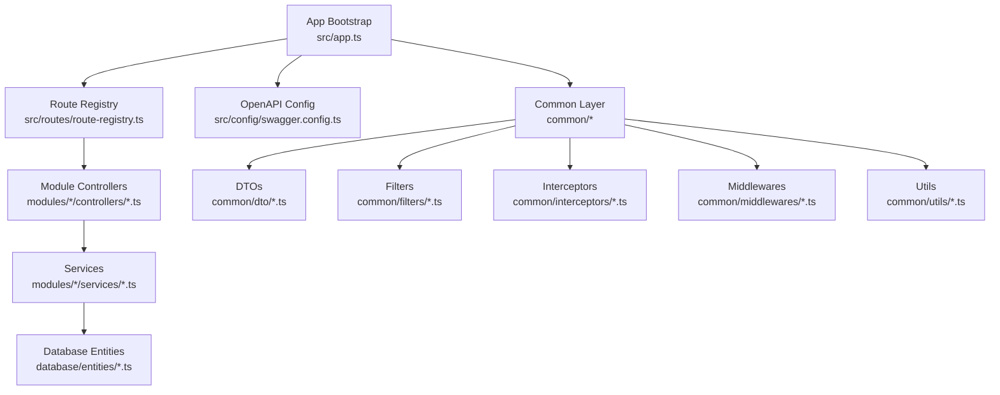
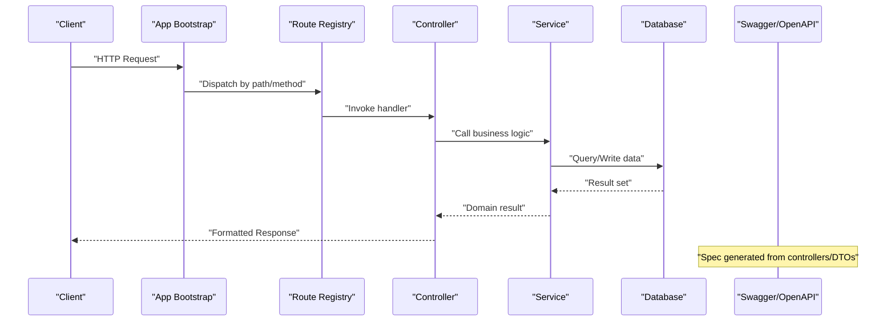
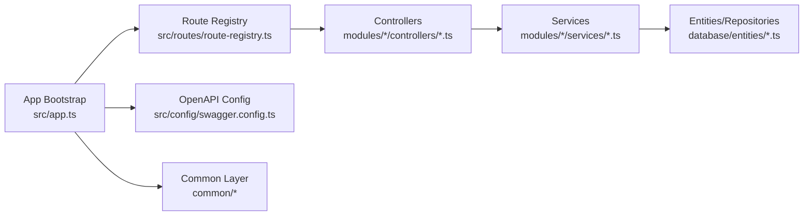

# API Endpoint Development

<cite>
**Referenced Files in This Document**
- [app.ts](file://backend/src/app.ts)
- [index.ts](file://backend/src/index.ts)
- [swagger.config.ts](file://backend/src/config/swagger.config.ts)
- [route-registry.ts](file://backend/src/routes/route-registry.ts)
- [pagination-guide.md](file://backend/docs/pagination-guide.md)
- [DASHBOARD-FRONTEND-INTEGRATION.md](file://backend/docs/DASHBOARD-FRONTEND-INTEGRATION.md)
- [test-endpoints-utilisateurs.sh](file://scripts/test-endpoints-utilisateurs.sh)
- [package.json](file://backend/package.json)
</cite>

## Table of Contents
1. [Introduction](#introduction)
2. [Project Structure](#project-structure)
3. [Core Components](#core-components)
4. [Architecture Overview](#architecture-overview)
5. [Detailed Component Analysis](#detailed-component-analysis)
6. [Dependency Analysis](#dependency-analysis)
7. [Performance Considerations](#performance-considerations)
8. [Troubleshooting Guide](#troubleshooting-guide)
9. [Conclusion](#conclusion)
10. [Appendices](#appendices)

## Introduction
This document provides a comprehensive guide to creating robust API endpoints within eLISAschool modules. It consolidates RESTful design principles, HTTP method usage, URL conventions, request/response schemas via DTOs, and end-to-end patterns for Swagger/OpenAPI documentation, parameter validation, error handling, and response formatting. It also covers CRUD operations, file uploads, pagination, filtering, sorting, authentication and authorization integration, rate limiting, security best practices, API versioning strategies, backward compatibility, deprecation policies, testing guidelines, and endpoint specification documentation.

The guidance is grounded in the repository’s backend structure and existing patterns, including application bootstrap, route registration, OpenAPI configuration, pagination documentation, and test utilities.

## Project Structure
The backend follows a modular architecture with clear separation of concerns:
- Application bootstrap and middleware setup
- Centralized route registry
- Feature modules organized by domain (e.g., auth, eleves, finances)
- Shared utilities, DTOs, filters, interceptors, middlewares, services, types, and examples
- Configuration for database, environment, and OpenAPI/Swagger
- Documentation and scripts for migrations, tests, and deployment

**Diagram sources**
- [app.ts](file://backend/src/app.ts)
- [route-registry.ts](file://backend/src/routes/route-registry.ts)
- [swagger.config.ts](file://backend/src/config/swagger.config.ts)

**Section sources**
- [app.ts](file://backend/src/app.ts)
- [index.ts](file://backend/src/index.ts)
- [route-registry.ts](file://backend/src/routes/route-registry.ts)
- [swagger.config.ts](file://backend/src/config/swagger.config.ts)

## Core Components
- Application bootstrap: Initializes Express/Nest-like server, global middleware, CORS, body parsing, logging, and mounts routes.
- Route registry: Centralizes module route mounting, enabling consistent URL prefixes and versioning.
- OpenAPI/Swagger configuration: Defines metadata, tags, security schemes, and output generation.
- Common layer: Provides reusable DTOs, filters, interceptors, middlewares, and utilities used across modules.
- Pagination documentation: Standardizes query parameters and response envelopes for list endpoints.

Key responsibilities:
- Ensure consistent request/response contracts via DTOs and interceptors.
- Enforce validation and sanitization using shared filters and decorators.
- Provide uniform error responses and logging through interceptors and filters.
- Generate and serve OpenAPI specs automatically from controllers and DTOs.

**Section sources**
- [app.ts](file://backend/src/app.ts)
- [route-registry.ts](file://backend/src/routes/route-registry.ts)
- [swagger.config.ts](file://backend/src/config/swagger.config.ts)
- [pagination-guide.md](file://backend/docs/pagination-guide.md)

## Architecture Overview
The API architecture emphasizes modularity, consistency, and developer experience:
- Controllers define REST endpoints and delegate business logic to services.
- Services orchestrate data access and domain rules, interacting with entities and repositories.
- DTOs enforce input/output contracts; filters handle query parameter parsing and validation.
- Interceptors standardize response shaping, timing, and error mapping.
- Middlewares implement cross-cutting concerns like authentication, authorization, and rate limiting.
- OpenAPI spec is generated from controller metadata and DTO definitions.

**Diagram sources**
- [app.ts](file://backend/src/app.ts)
- [route-registry.ts](file://backend/src/routes/route-registry.ts)
- [swagger.config.ts](file://backend/src/config/swagger.config.ts)

## Detailed Component Analysis

### RESTful Design Principles and URL Conventions
- Use nouns for resources and plural forms for collections (e.g., /api/v1/students).
- Avoid verbs in URLs; use HTTP methods to express actions (GET, POST, PUT/PATCH, DELETE).
- Nest only when there is a strong ownership relationship (e.g., /api/v1/classes/{id}/students).
- Use query parameters for filtering, sorting, and pagination; avoid embedding them in paths.
- Version APIs at the URL level (/api/v1/) or via headers; prefer URL versioning for clarity.

Best practices:
- Keep resource names short and meaningful.
- Use consistent casing (kebab-case for paths).
- Return proper status codes: 200 OK, 201 Created, 204 No Content, 400 Bad Request, 401 Unauthorized, 403 Forbidden, 404 Not Found, 409 Conflict, 422 Unprocessable Entity, 429 Too Many Requests, 500 Internal Server Error.

[No sources needed since this section doesn't analyze specific files]

### HTTP Method Usage
- GET: Retrieve resources or lists; idempotent and safe.
- POST: Create new resources; returns 201 with location header where applicable.
- PUT: Full update of a resource; requires complete payload.
- PATCH: Partial update; supports selective fields.
- DELETE: Remove a resource; may return 204 on success.

Idempotency and safety:
- Ensure GET, PUT, DELETE are idempotent.
- Use POST for non-idempotent operations (e.g., payments).

[No sources needed since this section doesn't analyze specific files]

### Request/Response Schemas Using DTOs
- Define strict DTOs for all inputs and outputs to ensure type safety and validation.
- Use decorators or validators to enforce constraints (required fields, formats, enums).
- Separate internal entities from external DTOs to evolve APIs without breaking clients.
- Include meta information in list responses (total, page, pageSize, hasNext).

Guidelines:
- Prefer explicit field types and optional markers.
- Use enums for constrained values.
- Validate at the boundary (controller/input) and sanitize before persistence.

[No sources needed since this section doesn't analyze specific files]

### Swagger/OpenAPI Documentation Generation
- Configure OpenAPI metadata (title, version, description, contact, license).
- Annotate controllers and DTOs to auto-generate endpoints, parameters, and schemas.
- Define security schemes (Bearer JWT, API Key) and apply globally or per-route.
- Serve interactive docs at a dedicated path (e.g., /api-docs).

Recommendations:
- Tag endpoints by feature/module for navigation.
- Provide example payloads and responses.
- Keep spec synchronized with code changes via CI checks.

**Section sources**
- [swagger.config.ts](file://backend/src/config/swagger.config.ts)

### Parameter Validation and Filtering
- Use shared filters to parse and validate query parameters (e.g., date ranges, enums).
- Apply validation decorators to DTOs for body and params.
- Normalize inputs (trim strings, coerce types) early in the pipeline.
- Return structured validation errors with field-level details.

Pagination standards:
- Query parameters: page, pageSize, sort, filter.
- Response envelope includes total, page, pageSize, data array.

**Section sources**
- [pagination-guide.md](file://backend/docs/pagination-guide.md)

### Error Handling Patterns and Response Formatting
- Centralize error mapping in filters/interceptors to produce consistent JSON structures.
- Include correlation IDs for tracing requests across logs.
- Log errors with context but avoid leaking sensitive data.
- Use appropriate HTTP status codes and human-readable messages.

Response envelope:
- Success: { data, meta }
- Error: { error: { code, message, details } }

[No sources needed since this section doesn't analyze specific files]

### Implementing CRUD Operations
- GET /resource: List with pagination/filter/sort; GET /resource/:id: Retrieve single.
- POST /resource: Create with validated DTO; return 201 and resource location.
- PUT /resource/:id: Replace entire resource; validate full DTO.
- PATCH /resource/:id: Partial update; validate provided fields.
- DELETE /resource/:id: Soft delete preferred; return 204 or updated entity.

Security considerations:
- Enforce tenant scoping (etablissementId) on all queries.
- Apply RBAC permissions per endpoint.

[No sources needed since this section doesn't analyze specific files]

### File Uploads
- Use multipart/form-data for file uploads.
- Validate file type, size, and content; scan for malware if applicable.
- Store files securely (object storage) and persist references in entities.
- Return stable URLs or signed links for downloads.

Rate limiting:
- Apply stricter limits for upload endpoints to prevent abuse.

[No sources needed since this section doesn't analyze specific files]

### Pagination, Filtering, and Sorting
- Standardize query parameters: page, pageSize, sort (field:asc|desc), filter (key=value).
- Support advanced filters (range, contains, in-list) via documented conventions.
- Enforce max pageSize to protect performance.
- Index frequently filtered/sorted columns.

**Section sources**
- [pagination-guide.md](file://backend/docs/pagination-guide.md)

### Authentication and Authorization Integration
- Integrate JWT-based authentication via middleware; verify tokens and extract user context.
- Apply role/permission guards at controller or route level.
- Scope data by tenant (etablissementId) to ensure multi-tenant isolation.
- Log authentication events and failures for auditability.

Security best practices:
- Rotate secrets and store securely.
- Enforce HTTPS and secure cookies.
- Limit token lifetime and refresh securely.

[No sources needed since this section doesn't analyze specific files]

### Rate Limiting and Security Best Practices
- Apply global and endpoint-specific rate limiting (IP/user-based).
- Sanitize inputs and escape outputs to prevent injection.
- Enable CORS with strict origins and methods.
- Use Helmet-like headers for security (HSTS, CSP, X-Frame-Options).
- Monitor and alert on anomalies (high error rates, spikes).

[No sources needed since this section doesn't analyze specific files]

### API Versioning Strategies, Backward Compatibility, and Deprecation Policies
- Prefer URL versioning (/api/v1/, /api/v2/) for clarity and easy routing.
- Maintain backward compatibility by avoiding breaking changes; introduce new fields as optional.
- Deprecate endpoints gradually with warnings in responses and docs.
- Track deprecations in changelogs and notify consumers.

[No sources needed since this section doesn't analyze specific files]

### Testing API Endpoints
- Unit tests: Validate DTOs, filters, and service logic.
- Integration tests: Hit real endpoints against a test database; assert status codes and payloads.
- Contract tests: Ensure OpenAPI spec matches implementation.
- Load tests: Validate pagination and large datasets.

Example script reference:
- The repository includes a shell script to exercise user-related endpoints for quick smoke tests.

**Section sources**
- [test-endpoints-utilisateurs.sh](file://scripts/test-endpoints-utilisateurs.sh)

### Documenting Endpoint Specifications
- Maintain an OpenAPI spec generated from code; host it alongside the app.
- Provide examples for common requests/responses and error cases.
- Document required permissions and tenant scoping per endpoint.
- Link to frontend integration notes where relevant.

**Section sources**
- [DASHBOARD-FRONTEND-INTEGRATION.md](file://backend/docs/DASHBOARD-FRONTEND-INTEGRATION.md)

## Dependency Analysis
The following diagram shows key runtime dependencies and interactions between core components involved in API processing.

**Diagram sources**
- [app.ts](file://backend/src/app.ts)
- [route-registry.ts](file://backend/src/routes/route-registry.ts)
- [swagger.config.ts](file://backend/src/config/swagger.config.ts)

**Section sources**
- [app.ts](file://backend/src/app.ts)
- [route-registry.ts](file://backend/src/routes/route-registry.ts)
- [swagger.config.ts](file://backend/src/config/swagger.config.ts)

## Performance Considerations
- Use pagination and limit result sets by default.
- Add database indexes for filtered/sorted columns.
- Cache read-heavy endpoints with appropriate invalidation strategies.
- Stream large responses and avoid loading entire datasets into memory.
- Profile hot paths and monitor latency/error rates.

[No sources needed since this section provides general guidance]

## Troubleshooting Guide
Common issues and resolutions:
- 401 Unauthorized: Verify JWT validity, issuer, and secret; check token expiration and scope.
- 403 Forbidden: Confirm RBAC permissions and tenant scoping.
- 404 Not Found: Validate resource existence and tenant boundaries.
- 422 Unprocessable Entity: Inspect DTO validation errors and field-level details.
- 429 Too Many Requests: Review rate limiting thresholds and client behavior.
- 500 Internal Server Error: Check logs for stack traces and correlation IDs.

Operational tips:
- Enable request correlation IDs for tracing.
- Centralize error formatting to include actionable details.
- Use healthcheck endpoints to verify readiness and dependency status.

[No sources needed since this section provides general guidance]

## Conclusion
By adhering to the principles and patterns outlined here—consistent REST design, strict DTOs, centralized validation and error handling, robust authentication/authorization, standardized pagination, and comprehensive OpenAPI documentation—you can build reliable, scalable, and maintainable API endpoints across eLISAschool modules. Embrace versioning and deprecation policies to evolve safely, and invest in thorough testing and monitoring to ensure quality and resilience.

[No sources needed since this section summarizes without analyzing specific files]

## Appendices

### Quick Start Checklist for New Endpoints
- Define DTOs for input and output.
- Implement controller with correct HTTP methods and status codes.
- Add validation and filtering via shared filters/decorators.
- Apply authentication and authorization guards.
- Wire route in the central registry with proper prefix/version.
- Annotate for OpenAPI and generate spec.
- Write unit and integration tests.
- Update documentation and examples.

[No sources needed since this section doesn't analyze specific files]