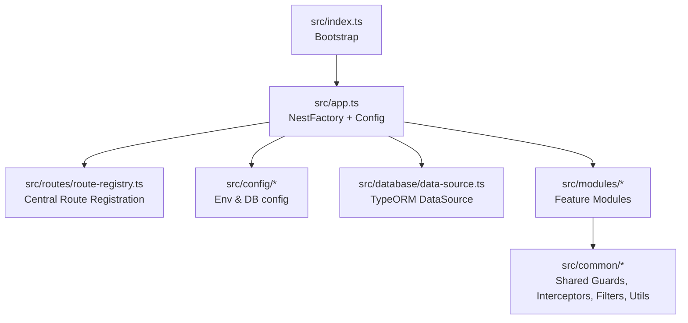
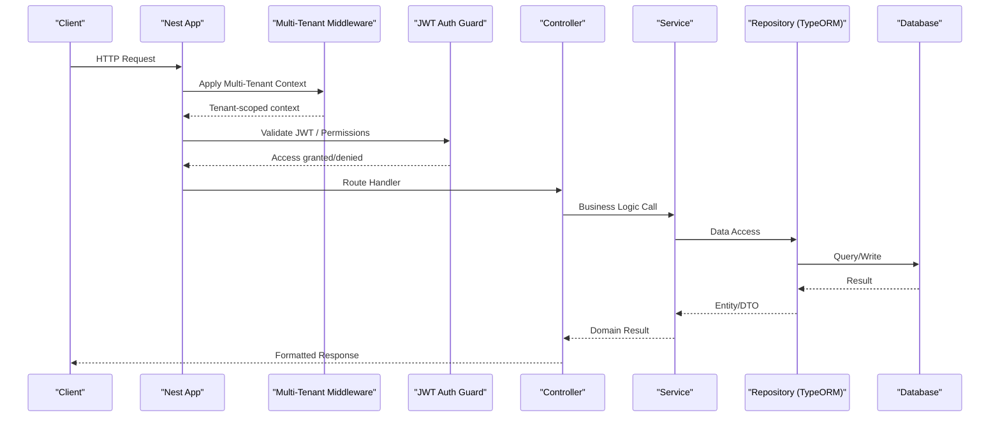
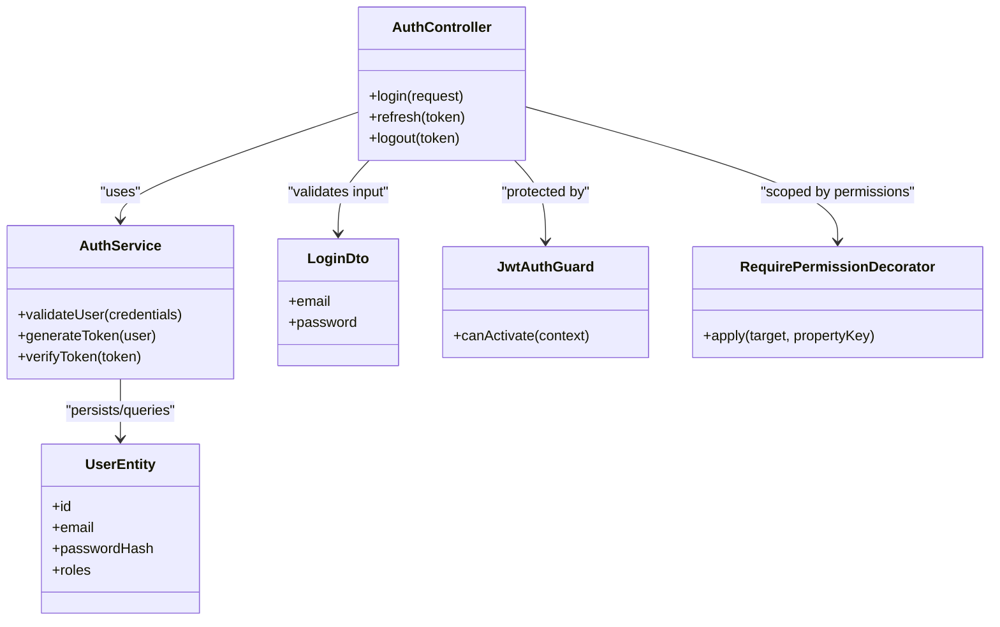
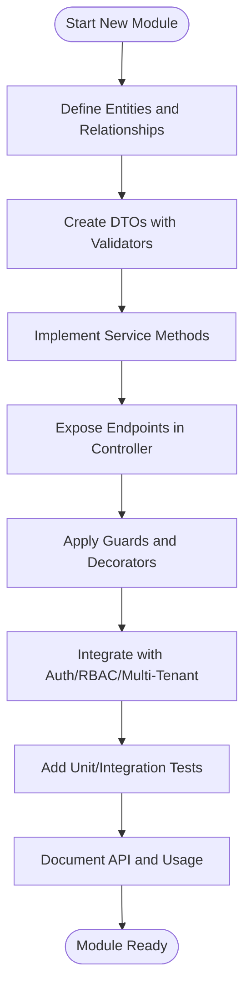
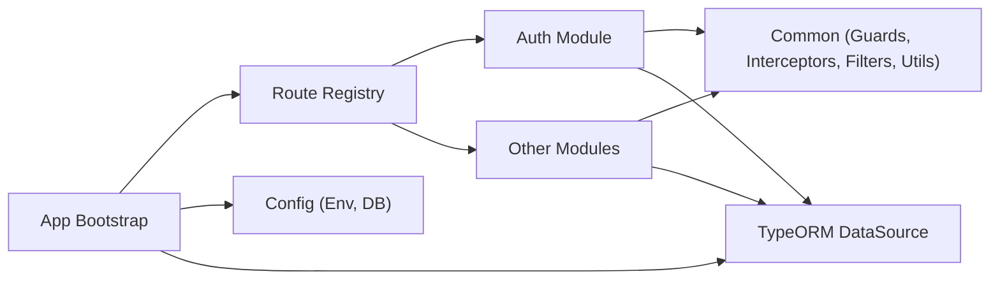

# Backend Module Creation

<cite>
**Referenced Files in This Document**
- [app.ts](file://backend/src/app.ts)
- [index.ts](file://backend/src/index.ts)
- [route-registry.ts](file://backend/src/routes/route-registry.ts)
- [database.config.ts](file://backend/src/config/database.config.ts)
- [env.config.ts](file://backend/src/config/env.config.ts)
- [data-source.ts](file://backend/src/database/data-source.ts)
- [index.ts](file://backend/src/modules/index.ts)
- [auth.module.ts](file://backend/src/modules/auth/auth.module.ts)
- [auth.controller.ts](file://backend/src/modules/auth/controllers/auth.controller.ts)
- [auth.service.ts](file://backend/src/modules/auth/services/auth.service.ts)
- [user.entity.ts](file://backend/src/modules/auth/entities/user.entity.ts)
- [login.dto.ts](file://backend/src/modules/auth/dto/login.dto.ts)
- [jwt.strategy.ts](file://backend/src/modules/auth/strategies/jwt.strategy.ts)
- [jwt-auth.guard.ts](file://backend/src/modules/auth/guards/jwt-auth.guard.ts)
- [require-permission.decorator.ts](file://backend/src/modules/auth/decorators/require-permission.decorator.ts)
- [multi-tenant.middleware.ts](file://backend/src/common/middlewares/multi-tenant.middleware.ts)
- [request.interceptor.ts](file://backend/src/common/interceptors/request.interceptor.ts)
- [global.filter.ts](file://backend/src/common/filters/global.filter.ts)
- [pagination.util.ts](file://backend/src/common/utils/pagination.util.ts)
- [README.md](file://README.md)
</cite>

## Table of Contents
1. [Introduction](#introduction)
2. [Project Structure](#project-structure)
3. [Core Components](#core-components)
4. [Architecture Overview](#architecture-overview)
5. [Detailed Component Analysis](#detailed-component-analysis)
6. [Dependency Analysis](#dependency-analysis)
7. [Performance Considerations](#performance-considerations)
8. [Troubleshooting Guide](#troubleshooting-guide)
9. [Conclusion](#conclusion)
10. [Appendices](#appendices)

## Introduction
This guide explains how to develop backend modules for eLISAschool using NestJS architectural patterns. It covers module structure (controllers, services, entities, DTOs), RESTful API design with validation and error handling, service layer implementation, repository patterns via TypeORM, and integration with authentication, authorization, and multi-tenancy. It also provides guidelines for logging, caching, and performance optimization within new modules.

## Project Structure
The backend follows a feature-based module layout under src/modules, with shared cross-cutting concerns in src/common. Configuration lives in src/config, database setup in src/database, and the application bootstrap in src/index.ts and src/app.ts. Routes are centrally registered through a route registry.

**Diagram sources**
- [index.ts](file://backend/src/index.ts)
- [app.ts](file://backend/src/app.ts)
- [route-registry.ts](file://backend/src/routes/route-registry.ts)
- [database.config.ts](file://backend/src/config/database.config.ts)
- [env.config.ts](file://backend/src/config/env.config.ts)
- [data-source.ts](file://backend/src/database/data-source.ts)
- [index.ts](file://backend/src/modules/index.ts)

**Section sources**
- [README.md](file://README.md)
- [index.ts](file://backend/src/index.ts)
- [app.ts](file://backend/src/app.ts)
- [route-registry.ts](file://backend/src/routes/route-registry.ts)
- [database.config.ts](file://backend/src/config/database.config.ts)
- [env.config.ts](file://backend/src/config/env.config.ts)
- [data-source.ts](file://backend/src/database/data-source.ts)
- [index.ts](file://backend/src/modules/index.ts)

## Core Components
- Controllers: Define HTTP endpoints, map requests to service methods, apply guards/decorators, and return structured responses.
- Services: Encapsulate business logic, orchestrate repositories, and interact with external systems.
- Entities: TypeORM models representing database tables, including relationships and constraints.
- DTOs: Request/response schemas validated by class-validator decorators.
- Guards: Authorization and access control (e.g., JWT guard).
- Decorators: Custom metadata like permission requirements.
- Interceptors: Cross-cutting behavior such as request logging or response formatting.
- Middleware: Pre-processing like multi-tenant context extraction.
- Filters: Global error handling and consistent error responses.
- Utilities: Shared helpers (e.g., pagination).

**Section sources**
- [auth.controller.ts](file://backend/src/modules/auth/controllers/auth.controller.ts)
- [auth.service.ts](file://backend/src/modules/auth/services/auth.service.ts)
- [user.entity.ts](file://backend/src/modules/auth/entities/user.entity.ts)
- [login.dto.ts](file://backend/src/modules/auth/dto/login.dto.ts)
- [jwt-auth.guard.ts](file://backend/src/modules/auth/guards/jwt-auth.guard.ts)
- [require-permission.decorator.ts](file://backend/src/modules/auth/decorators/require-permission.decorator.ts)
- [request.interceptor.ts](file://backend/src/common/interceptors/request.interceptor.ts)
- [multi-tenant.middleware.ts](file://backend/src/common/middlewares/multi-tenant.middleware.ts)
- [global.filter.ts](file://backend/src/common/filters/global.filter.ts)
- [pagination.util.ts](file://backend/src/common/utils/pagination.util.ts)

## Architecture Overview
The application bootstraps NestJS, loads configuration, initializes TypeORM, registers routes, and mounts feature modules. Each module exposes controllers and services, uses entities for persistence, and integrates with shared guards, interceptors, middleware, and filters.

**Diagram sources**
- [index.ts](file://backend/src/index.ts)
- [app.ts](file://backend/src/app.ts)
- [multi-tenant.middleware.ts](file://backend/src/common/middlewares/multi-tenant.middleware.ts)
- [jwt-auth.guard.ts](file://backend/src/modules/auth/guards/jwt-auth.guard.ts)
- [auth.controller.ts](file://backend/src/modules/auth/controllers/auth.controller.ts)
- [auth.service.ts](file://backend/src/modules/auth/services/auth.service.ts)
- [user.entity.ts](file://backend/src/modules/auth/entities/user.entity.ts)
- [data-source.ts](file://backend/src/database/data-source.ts)

## Detailed Component Analysis

### Authentication Module Example
This example demonstrates a complete module pattern using auth as a reference.

**Diagram sources**
- [auth.controller.ts](file://backend/src/modules/auth/controllers/auth.controller.ts)
- [auth.service.ts](file://backend/src/modules/auth/services/auth.service.ts)
- [user.entity.ts](file://backend/src/modules/auth/entities/user.entity.ts)
- [login.dto.ts](file://backend/src/modules/auth/dto/login.dto.ts)
- [jwt-auth.guard.ts](file://backend/src/modules/auth/guards/jwt-auth.guard.ts)
- [require-permission.decorator.ts](file://backend/src/modules/auth/decorators/require-permission.decorator.ts)

#### Controller Responsibilities
- Map HTTP verbs to service methods.
- Apply guards and custom decorators for authorization.
- Use DTOs for request validation and typed responses.
- Return standardized response envelopes.

**Section sources**
- [auth.controller.ts](file://backend/src/modules/auth/controllers/auth.controller.ts)
- [login.dto.ts](file://backend/src/modules/auth/dto/login.dto.ts)
- [jwt-auth.guard.ts](file://backend/src/modules/auth/guards/jwt-auth.guard.ts)
- [require-permission.decorator.ts](file://backend/src/modules/auth/decorators/require-permission.decorator.ts)

#### Service Layer Implementation
- Implement domain operations (e.g., login flow, token management).
- Coordinate with repositories and external services.
- Enforce business rules and validations beyond DTO constraints.
- Handle multi-tenant scoping when necessary.

**Section sources**
- [auth.service.ts](file://backend/src/modules/auth/services/auth.service.ts)
- [user.entity.ts](file://backend/src/modules/auth/entities/user.entity.ts)

#### Entity Definitions (TypeORM)
- Define entities with columns, relations, and indexes.
- Keep entity shape aligned with DTOs where appropriate.
- Use enums and constraints to enforce data integrity.

**Section sources**
- [user.entity.ts](file://backend/src/modules/auth/entities/user.entity.ts)
- [data-source.ts](file://backend/src/database/data-source.ts)

#### DTOs and Validation
- Use class-validator decorators to validate inputs.
- Provide clear error messages and types for frontend consumption.
- Separate request DTOs from response DTOs for clarity.

**Section sources**
- [login.dto.ts](file://backend/src/modules/auth/dto/login.dto.ts)

#### Guards and Decorators
- JWT guard validates tokens and attaches user context.
- Permission decorator enforces fine-grained access control.
- Combine guards and decorators for layered security.

**Section sources**
- [jwt-auth.guard.ts](file://backend/src/modules/auth/guards/jwt-auth.guard.ts)
- [require-permission.decorator.ts](file://backend/src/modules/auth/decorators/require-permission.decorator.ts)

### Creating a New Feature Module
Follow these steps to add a new module:

1. Create module directory under src/modules/<feature>.
2. Add controller(s) for endpoints, service(s) for business logic, entities for persistence, and DTOs for validation.
3. Register the module in the application bootstrap or central registry.
4. Apply guards, interceptors, and filters as needed.
5. Write migrations if you introduce new entities.

[No sources needed since this diagram shows conceptual workflow, not actual code structure]

### Centralized Error Handling and Response Formatting
- Global filter converts exceptions into consistent error responses.
- Interceptors can log requests/responses and format payloads uniformly.
- Use standard status codes and envelope structures for success/error cases.

**Section sources**
- [global.filter.ts](file://backend/src/common/filters/global.filter.ts)
- [request.interceptor.ts](file://backend/src/common/interceptors/request.interceptor.ts)

### Multi-Tenancy Integration
- Middleware extracts tenant context from requests (e.g., headers or subdomain).
- Services should scope queries by tenant ID.
- Ensure all entities include tenant identifiers where applicable.

**Section sources**
- [multi-tenant.middleware.ts](file://backend/src/common/middlewares/multi-tenant.middleware.ts)

### Pagination and Common Utilities
- Utility functions provide consistent pagination parameters and result shaping.
- Controllers should accept page, limit, sort, and filter query params.
- Services return paginated results compatible with frontend components.

**Section sources**
- [pagination.util.ts](file://backend/src/common/utils/pagination.util.ts)

## Dependency Analysis
Modules depend on shared infrastructure (guards, interceptors, filters, utilities) and configuration. The route registry centralizes endpoint registration, while TypeORM DataSource manages connections and entity loading.

**Diagram sources**
- [index.ts](file://backend/src/index.ts)
- [app.ts](file://backend/src/app.ts)
- [route-registry.ts](file://backend/src/routes/route-registry.ts)
- [database.config.ts](file://backend/src/config/database.config.ts)
- [env.config.ts](file://backend/src/config/env.config.ts)
- [data-source.ts](file://backend/src/database/data-source.ts)
- [index.ts](file://backend/src/modules/index.ts)

**Section sources**
- [index.ts](file://backend/src/index.ts)
- [app.ts](file://backend/src/app.ts)
- [route-registry.ts](file://backend/src/routes/route-registry.ts)
- [database.config.ts](file://backend/src/config/database.config.ts)
- [env.config.ts](file://backend/src/config/env.config.ts)
- [data-source.ts](file://backend/src/database/data-source.ts)
- [index.ts](file://backend/src/modules/index.ts)

## Performance Considerations
- Use DTOs and strict validation to reduce payload size and errors.
- Index frequently queried fields in entities and migrations.
- Apply pagination consistently for list endpoints.
- Cache read-heavy data at service level or via Redis when appropriate.
- Avoid N+1 queries by using joins or batch loaders.
- Log only essential information; avoid heavy logging in hot paths.

[No sources needed since this section provides general guidance]

## Troubleshooting Guide
- If requests fail with unauthorized errors, verify JWT strategy and guard configuration.
- For multi-tenant issues, ensure middleware runs before route handlers and sets correct context.
- For validation failures, check DTO decorators and error mapping in the global filter.
- For slow endpoints, review service queries, add indexes, and consider caching strategies.

**Section sources**
- [jwt.strategy.ts](file://backend/src/modules/auth/strategies/jwt.strategy.ts)
- [jwt-auth.guard.ts](file://backend/src/modules/auth/guards/jwt-auth.guard.ts)
- [multi-tenant.middleware.ts](file://backend/src/common/middlewares/multi-tenant.middleware.ts)
- [global.filter.ts](file://backend/src/common/filters/global.filter.ts)

## Conclusion
By following the module structure, validation practices, and integration points outlined here, you can build robust, secure, and maintainable features in eLISAschool. Leverage shared guards, interceptors, and filters for consistency, and keep business logic isolated in services with clear repository boundaries.

## Appendices

### Checklist for New Modules
- Define entities and migrations.
- Create DTOs with validators.
- Implement service methods with business rules.
- Expose endpoints in controllers with proper guards/decorators.
- Integrate multi-tenant scoping and RBAC.
- Add unit/integration tests.
- Document API usage and examples.

[No sources needed since this section summarizes without analyzing specific files]