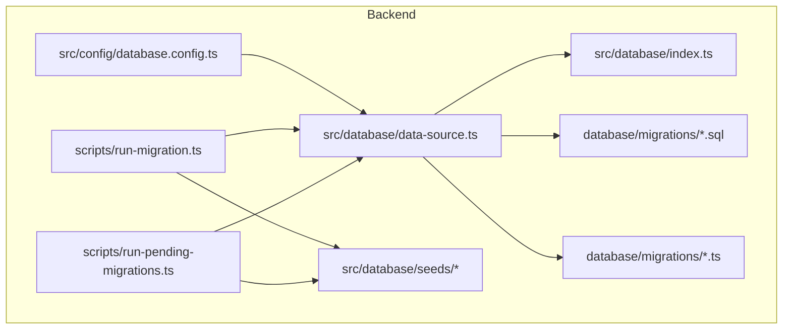
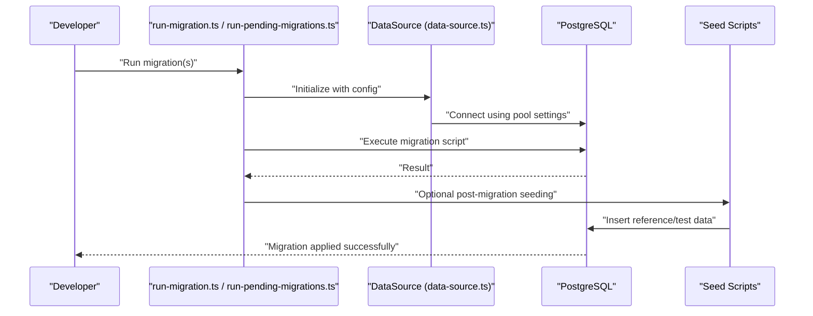
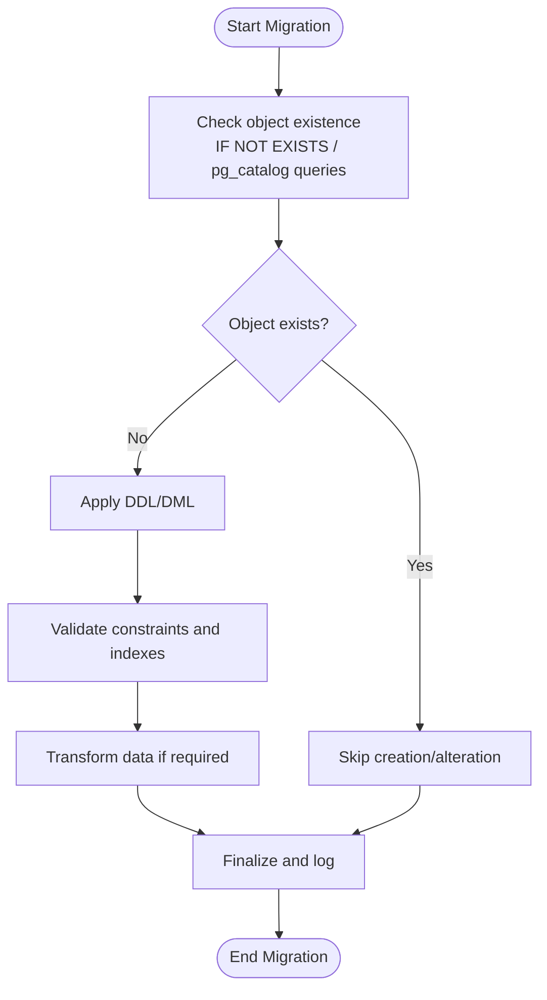
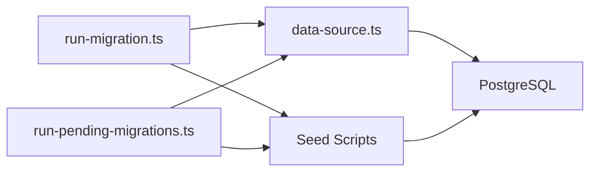

# Database Migrations & Schema Design

<cite>
**Referenced Files in This Document**
- [database.config.ts](file://backend/src/config/database.config.ts)
- [data-source.ts](file://backend/src/database/data-source.ts)
- [index.ts](file://backend/src/database/index.ts)
- [037-gamification-tracabilite.ts](file://backend/database/migrations/037-gamification-tracabilite.ts)
- [038-index-performance-gamification-suivi.ts](file://backend/database/migrations/038-index-performance-gamification-suivi.ts)
- [043-correction-dossier-medical-fk.ts](file://backend/database/migrations/043-correction-dossier-medical-fk.ts)
- [113-unite-responsable-fk-cleanup.sql](file://backend/database/migrations/113-unite-responsable-fk-cleanup.sql)
- [120-correction-vues-materialisees-organisation.sql](file://backend/database/migrations/120-correction-vues-materialisees-organisation.sql)
- [010-module-finances.sql](file://backend/database/migrations/010-module-finances.sql)
- [016-module-personnel-rh-phase1.sql](file://backend/database/migrations/016-module-personnel-rh-phase1.sql)
- [029-paie-etendue.sql](file://backend/database/migrations/029-paie-etendue.sql)
- [035-contexte-africain-periodes.sql](file://backend/database/migrations/035-contexte-africain-periodes.sql)
- [035b-migration-donnees-periodes.sql](file://backend/database/migrations/035b-migration-donnees-periodes.sql)
- [041-module-annonces-complete.sql](file://backend/database/migrations/041-module-annonces-complete.sql)
- [044-module-organisation.sql](file://backend/database/migrations/044-module-organisation.sql)
- [045-module-recrutement.sql](file://backend/database/migrations/045-module-recrutement.sql)
- [050-multi-tenant-v3-max-etablissements.sql](file://backend/database/migrations/050-multi-tenant-v3-max-etablissements.sql)
- [053-structure-academique-complete.sql](file://backend/database/migrations/053-structure-academique-complete.sql)
- [054-refonte-structure-academique-v2.sql](file://backend/database/migrations/054-refonte-structure-academique-v2.sql)
- [058-multi-tenant-structure-academique.sql](file://backend/database/migrations/058-multi-tenant-structure-academique.sql)
- [063-creer-module-emploi-du-temps.sql](file://backend/database/migrations/063-creer-module-emploi-du-temps.sql)
- [070-module-salles.sql](file://backend/database/migrations/070-module-salles.sql)
- [075-module-groupes-etablissements.sql](file://backend/database/migrations/075-module-groupes-etablissements.sql)
- [080-preferences-utilisateur-multi-tenant.sql](file://backend/database/migrations/080-preferences-utilisateur-multi-tenant.sql)
- [088-refactorisation-architecture-academique.sql](file://backend/database/migrations/088-refactorisation-architecture-academique.sql)
- [089-finalisation-architecture-academique-v2.sql](file://backend/database/migrations/089-finalisation-architecture-academique-v2.sql)
- [091-peuplement-architecture-academique.sql](file://backend/database/migrations/091-peuplement-architecture-academique.sql)
- [092-refactorisation-classeAnneeId.sql](file://backend/database/migrations/092-refactorisation-classeAnneeId.sql)
- [099-add-monitoring-params.sql](file://backend/database/migrations/099-add-monitoring-params.sql)
- [100-classes-salle-principale.sql](file://backend/database/migrations/100-classes-salle-principale.sql)
- [101-normalisation-annee-scolaire-cloture.sql](file://backend/database/migrations/101-normalisation-annee-scolaire-cloture.sql)
- [102-periodes-hierarchie.sql](file://backend/database/migrations/102-periodes-hierarchie.sql)
- [103-templates-periode-personnalisables.sql](file://backend/database/migrations/103-templates-periode-personnalisables.sql)
- [104-refonte-periodes-niveaux-configurables.sql](file://backend/database/migrations/104-refonte-periodes-niveaux-configurables.sql)
- [105-migration-templates-v5.sql](file://backend/database/migrations/105-migration-templates-v5.sql)
- [106-rename-sequence-to-evaluation.sql](file://backend/database/migrations/106-rename-sequence-to-evaluation.sql)
- [107-cleanup-configuration-modules-actif.sql](file://backend/database/migrations/107-cleanup-configuration-modules-actif.sql)
- [108-refactor-salle-principale.sql](file://backend/database/migrations/108-refactor-salle-principale.sql)
- [run-migration.ts](file://backend/scripts/run-migration.ts)
- [run-pending-migrations.ts](file://backend/scripts/run-pending-migrations.ts)
- [fix-index.ts](file://backend/src/database/fix-index.ts)
- [diagnose-enum.ts](file://backend/src/database/diagnose-enum.ts)
- [seed-users.ts](file://backend/src/database/seeds/seed-users.ts)
- [seed-roles-permissions.ts](file://backend/src/database/seeds/seed-roles-permissions.ts)
- [seed-structure-academique.ts](file://backend/src/database/seeds/seed-structure-academique.ts)
- [seed-finances.ts](file://backend/src/database/seeds/seed-finances.ts)
- [seed-emploi-du-temps.ts](file://backend/src/database/seeds/seed-emploi-du-temps.ts)
- [seed-salles.ts](file://backend/src/database/seeds/seed-salles.ts)
- [seed-groupes-etablissements.ts](file://backend/src/database/seeds/seed-groupes-etablissements.ts)
- [seed-preferences.ts](file://backend/src/database/seeds/seed-preferences.ts)
- [seed-sondages.ts](file://backend/src/database/seeds/seed-sondages.ts)
- [seed-notifications.ts](file://backend/src/database/seeds/seed-notifications.ts)
</cite>

## Update Summary
**Changes Made**
- Added documentation for migration 120-correction-vues-materialisees-organisation.sql addressing materialized view corrections for organization data
- Updated organization module section to include entity and service improvements (unite-organisationnelle.entity.ts and statistiques-optimisees.service.ts)
- Enhanced materialized views best practices section with recent organizational structure optimizations
- Updated performance considerations to include materialized view optimization patterns

## Table of Contents
1. [Introduction](#introduction)
2. [Project Structure](#project-structure)
3. [Core Components](#core-components)
4. [Architecture Overview](#architecture-overview)
5. [Detailed Component Analysis](#detailed-component-analysis)
6. [Dependency Analysis](#dependency-analysis)
7. [Performance Considerations](#performance-considerations)
8. [Troubleshooting Guide](#troubleshooting-guide)
9. [Conclusion](#conclusion)
10. [Appendices](#appendices)

## Introduction
This document provides a comprehensive guide to creating database migrations and designing schemas for new eLISAschool modules. It covers migration file structure, naming conventions, best practices for schema evolution, TypeORM entity design, relationships, indexing strategies, idempotent migrations, data transformations, backward compatibility, seed data creation, performance considerations, query optimization, and connection pooling configuration tailored to new module requirements.

## Project Structure
The project organizes database artifacts under backend/database/migrations for SQL and TypeScript migrations, and backend/src/database for the TypeORM DataSource and utilities. Seed scripts reside under backend/src/database/seeds. Configuration is centralized in backend/src/config and backend/src/database/data-source.ts.

**Diagram sources**
- [database.config.ts](file://backend/src/config/database.config.ts)
- [data-source.ts](file://backend/src/database/data-source.ts)
- [index.ts](file://backend/src/database/index.ts)
- [run-migration.ts](file://backend/scripts/run-migration.ts)
- [run-pending-migrations.ts](file://backend/scripts/run-pending-migrations.ts)

**Section sources**
- [database.config.ts](file://backend/src/config/database.config.ts)
- [data-source.ts](file://backend/src/database/data-source.ts)
- [index.ts](file://backend/src/database/index.ts)
- [run-migration.ts](file://backend/scripts/run-migration.ts)
- [run-pending-migrations.ts](file://backend/scripts/run-pending-migrations.ts)

## Core Components
- Migration runners:
  - run-migration.ts executes a single migration by name or path.
  - run-pending-migrations.ts applies all pending migrations based on DataSource state.
- DataSource configuration:
  - data-source.ts defines entities, migrations, and connection settings.
  - database.config.ts centralizes environment-based DB configuration.
- Utilities:
  - fix-index.ts and diagnose-enum.ts provide operational helpers for indexes and enums.

Key responsibilities:
- Ensure consistent connection pooling and logging via DataSource.
- Provide deterministic execution order through numeric prefixes in migration filenames.
- Support both SQL and TypeScript migrations for flexibility.

**Section sources**
- [run-migration.ts](file://backend/scripts/run-migration.ts)
- [run-pending-migrations.ts](file://backend/scripts/run-pending-migrations.ts)
- [data-source.ts](file://backend/src/database/data-source.ts)
- [database.config.ts](file://backend/src/config/database.config.ts)
- [fix-index.ts](file://backend/src/database/fix-index.ts)
- [diagnose-enum.ts](file://backend/src/database/diagnose-enum.ts)

## Architecture Overview
The migration architecture follows a clear separation between configuration, execution, and artifact storage.

**Diagram sources**
- [run-migration.ts](file://backend/scripts/run-migration.ts)
- [run-pending-migrations.ts](file://backend/scripts/run-pending-migrations.ts)
- [data-source.ts](file://backend/src/database/data-source.ts)

## Detailed Component Analysis

### Migration File Structure and Naming Conventions
- Numeric prefix ordering ensures deterministic execution across environments.
- Two formats are supported:
  - SQL files (*.sql) for pure DDL/DML changes.
  - TypeScript files (*.ts) for complex logic, conditional checks, and programmatic operations.
- Examples of patterns:
  - Module scaffolding: 010-module-finances.sql, 044-module-organisation.sql, 045-module-recrutement.sql, 063-creer-module-emploi-du-temps.sql, 070-module-salles.sql, 075-module-groupes-etablissements.sql.
  - Multi-tenant adjustments: 050-multi-tenant-v3-max-etablissements.sql, 058-multi-tenant-structure-academique.sql, 080-preferences-utilisateur-multi-tenant.sql.
  - Academic structure refactors: 053-structure-academique-complete.sql, 054-refonte-structure-academique-v2.sql, 088-refactorisation-architecture-academique.sql, 089-finalisation-architecture-academique-v2.sql, 091-peuplement-architecture-academique.sql, 092-refactorisation-classeAnneeId.sql.
  - Periods and templates: 035-contexte-africain-periodes.sql, 035b-migration-donnees-periodes.sql, 102-periodes-hierarchie.sql, 103-templates-periode-personnalisables.sql, 104-refonte-periodes-niveaux-configurables.sql, 105-migration-templates-v5.sql.
  - Performance and monitoring: 099-add-monitoring-params.sql, 100-classes-salle-principale.sql, 101-normalisation-annee-scolaire-cloture.sql, 106-rename-sequence-to-evaluation.sql, 107-cleanup-configuration-modules-actif.sql, 108-refactor-salle-principale.sql.
  - **Updated** Organizational integrity fixes: 113-unite-responsable-fk-cleanup.sql addresses foreign key relationships for unit responsibility management.
  - **New** Materialized view corrections: 120-correction-vues-materialisees-organisation.sql corrects materialized views for organization data to ensure optimal query performance.

Best practices:
- Keep each migration focused on a single change set.
- Use descriptive names that reflect intent and module scope.
- Prefer additive changes (add columns, add tables) over destructive ones when possible.
- For large refactors, split into multiple phases with explicit data backfills.
- **Updated** For materialized views, create separate cleanup and recreation migrations to maintain consistency during deployments.

**Section sources**
- [010-module-finances.sql](file://backend/database/migrations/010-module-finances.sql)
- [044-module-organisation.sql](file://backend/database/migrations/044-module-organisation.sql)
- [045-module-recrutement.sql](file://backend/database/migrations/045-module-recrutement.sql)
- [050-multi-tenant-v3-max-etablissements.sql](file://backend/database/migrations/050-multi-tenant-v3-max-etablissements.sql)
- [053-structure-academique-complete.sql](file://backend/database/migrations/053-structure-academique-complete.sql)
- [054-refonte-structure-academique-v2.sql](file://backend/database/migrations/054-refonte-structure-academique-v2.sql)
- [058-multi-tenant-structure-academique.sql](file://backend/database/migrations/058-multi-tenant-structure-academique.sql)
- [063-creer-module-emploi-du-temps.sql](file://backend/database/migrations/063-creer-module-emploi-du-temps.sql)
- [070-module-salles.sql](file://backend/database/migrations/070-module-salles.sql)
- [075-module-groupes-etablissements.sql](file://backend/database/migrations/075-module-groupes-etablissements.sql)
- [080-preferences-utilisateur-multi-tenant.sql](file://backend/database/migrations/080-preferences-utilisateur-multi-tenant.sql)
- [088-refactorisation-architecture-academique.sql](file://backend/database/migrations/088-refactorisation-architecture-academique.sql)
- [089-finalisation-architecture-academique-v2.sql](file://backend/database/migrations/089-finalisation-architecture-academique-v2.sql)
- [091-peuplement-architecture-academique.sql](file://backend/database/migrations/091-peuplement-architecture-academique.sql)
- [092-refactorisation-classeAnneeId.sql](file://backend/database/migrations/092-refactorisation-classeAnneeId.sql)
- [099-add-monitoring-params.sql](file://backend/database/migrations/099-add-monitoring-params.sql)
- [100-classes-salle-principale.sql](file://backend/database/migrations/100-classes-salle-principale.sql)
- [101-normalisation-annee-scolaire-cloture.sql](file://backend/database/migrations/101-normalisation-annee-scolaire-cloture.sql)
- [102-periodes-hierarchie.sql](file://backend/database/migrations/102-periodes-hierarchie.sql)
- [103-templates-periode-personnalisables.sql](file://backend/database/migrations/103-templates-periode-personnalisables.sql)
- [104-refonte-periodes-niveaux-configurables.sql](file://backend/database/migrations/104-refonte-periodes-niveaux-configurables.sql)
- [105-migration-templates-v5.sql](file://backend/database/migrations/105-migration-templates-v5.sql)
- [106-rename-sequence-to-evaluation.sql](file://backend/database/migrations/106-rename-sequence-to-evaluation.sql)
- [107-cleanup-configuration-modules-actif.sql](file://backend/database/migrations/107-cleanup-configuration-modules-actif.sql)
- [108-refactor-salle-principale.sql](file://backend/database/migrations/108-refactor-salle-principale.sql)
- [113-unite-responsable-fk-cleanup.sql](file://backend/database/migrations/113-unite-responsable-fk-cleanup.sql)
- [120-correction-vues-materialisees-organisation.sql](file://backend/database/migrations/120-correction-vues-materialisees-organisation.sql)

### Idempotent Migrations and Backward Compatibility
- Use IF NOT EXISTS for objects where supported to allow re-running without errors.
- Guard column additions with existence checks before altering constraints.
- Separate structural changes from data transformations; ensure data migrations can be rerun safely.
- Example pattern:
  - Structural migration: 035-contexte-africain-periodes.sql
  - Data transformation: 035b-migration-donnees-periodes.sql

Guidelines:
- Always test migrations against a production-like dataset.
- Avoid destructive operations in hot paths; prefer phased rollouts.
- Maintain rollback notes in migration comments for manual recovery if needed.
- **Updated** For materialized views, implement proper refresh strategies and handle concurrent access scenarios.

**Section sources**
- [035-contexte-africain-periodes.sql](file://backend/database/migrations/035-contexte-africain-periodes.sql)
- [035b-migration-donnees-periodes.sql](file://backend/database/migrations/035b-migration-donnees-periodes.sql)

### Writing Idempotent Migrations (Flow)

[No sources needed since this diagram shows conceptual workflow, not actual code structure]

### TypeScript Migrations for Complex Logic
TypeScript migrations enable conditional logic, transactions, and integration with TypeORM within migrations.

Examples:
- 037-gamification-tracabilite.ts: Adds tracking capabilities for gamification features.
- 038-index-performance-gamification-suivi.ts: Creates performance indexes for tracking tables.
- 043-correction-dossier-medical-fk.ts: Corrects foreign key references for medical records.

Best practices:
- Wrap multi-step changes in transactions.
- Use TypeORM QueryRunner for precise control.
- Log progress and handle partial failures gracefully.

**Section sources**
- [037-gamification-tracabilite.ts](file://backend/database/migrations/037-gamification-tracabilite.ts)
- [038-index-performance-gamification-suivi.ts](file://backend/database/migrations/038-index-performance-gamification-suivi.ts)
- [043-correction-dossier-medical-fk.ts](file://backend/database/migrations/043-correction-dossier-medical-fk.ts)

### Entities Using TypeORM Decorators
While specific entity files are not referenced here, follow these patterns aligned with the project's DataSource configuration:
- Define entities with decorators corresponding to tables created by migrations.
- Map columns to existing types and constraints defined in SQL migrations.
- Use @Entity, @PrimaryGeneratedColumn, @Column, @Index, and relationship decorators (@OneToMany, @ManyToOne, etc.) to mirror schema design.
- Align multi-tenant scoping with established patterns (e.g., etablissement_id).

Recommendations:
- Keep entity definitions synchronized with migrations.
- Prefer composite indexes for frequently queried combinations.
- Use enums consistently with database enum definitions.
- **Updated** For organization-related entities like unite-organisationnelle.entity.ts, ensure proper relationship mappings with statistical services and optimized query patterns.

[No sources needed since this section provides general guidance]

### Relationships Between Tables
- Model relationships explicitly in entities to match FK constraints defined in migrations.
- Use cascade rules judiciously; avoid heavy cascades on high-volume tables.
- Enforce referential integrity at the database level via FKs in migrations.

**Updated** Recent organizational structure improvements demonstrate proper foreign key constraint management:
- The 113-unite-responsable-fk-cleanup.sql migration specifically addresses foreign key relationships for unit responsibility management, ensuring data integrity and proper referential constraints within the organizational structure.
- The 120-correction-vues-materialisees-organisation.sql migration ensures materialized views maintain proper relationships with underlying organization tables.
- Entity updates in unite-organisationnelle.entity.ts improve relationship definitions for better query performance.

**Section sources**
- [113-unite-responsable-fk-cleanup.sql](file://backend/database/migrations/113-unite-responsable-fk-cleanup.sql)
- [120-correction-vues-materialisees-organisation.sql](file://backend/database/migrations/120-correction-vues-materialisees-organisation.sql)

### Indexing Strategies
- Add targeted indexes for frequent filter/join columns.
- Use composite indexes for common query predicates.
- Monitor index usage and remove redundant indexes.

Examples:
- 038-index-performance-gamification-suivi.ts demonstrates adding performance indexes.
- 099-add-monitoring-params.sql introduces monitoring-related parameters that may influence query plans.

Operational helpers:
- fix-index.ts assists in diagnosing and correcting index issues.
- **Updated** Materialized view optimizations in 120-correction-vues-materialisees-organisation.sql include strategic indexing for improved query performance on organization statistics.

**Section sources**
- [038-index-performance-gamification-suivi.ts](file://backend/database/migrations/038-index-performance-gamification-suivi.ts)
- [099-add-monitoring-params.sql](file://backend/database/migrations/099-add-monitoring-params.sql)
- [120-correction-vues-materialisees-organisation.sql](file://backend/database/migrations/120-correction-vues-materialisees-organisation.sql)
- [fix-index.ts](file://backend/src/database/fix-index.ts)

### Foreign Key Constraint Management
Foreign key constraints are critical for maintaining data integrity across related tables. The project follows strict patterns for managing referential integrity:

**Updated** Recent improvements in foreign key management:
- The 113-unite-responsable-fk-cleanup.sql migration demonstrates proper cleanup and establishment of foreign key relationships for unit responsibility management.
- The 120-correction-vues-materialisees-organisation.sql migration ensures materialized views maintain proper referential integrity with base organization tables.
- Entity improvements in unite-organisationnelle.entity.ts enhance relationship definitions for better data consistency.

Best practices for foreign key management:
- Always define foreign keys with appropriate ON DELETE and ON UPDATE actions.
- Use CASCADE carefully to avoid unintended data deletion.
- Implement proper validation before establishing foreign key constraints.
- Test constraint violations during development to catch data integrity issues early.
- Consider using DEFERRABLE constraints for complex initialization scenarios.
- **Updated** For materialized views, ensure proper dependency management and refresh strategies to maintain referential integrity.

**Section sources**
- [113-unite-responsable-fk-cleanup.sql](file://backend/database/migrations/113-unite-responsable-fk-cleanup.sql)
- [120-correction-vues-materialisees-organisation.sql](file://backend/database/migrations/120-correction-vues-materialisees-organisation.sql)
- [043-correction-dossier-medical-fk.ts](file://backend/database/migrations/043-correction-dossier-medical-fk.ts)

### Materialized Views Optimization
Materialized views provide significant performance benefits for complex queries and reporting scenarios. The project has implemented several optimization patterns:

**New** Materialized view management patterns:
- The 120-correction-vues-materialisees-organisation.sql migration demonstrates proper materialized view correction and optimization for organization data.
- Service improvements in statistiques-optimisees.service.ts enhance query performance through optimized materialized view usage.
- Entity updates in unite-organisationnelle.entity.ts support efficient materialized view refresh operations.

Best practices for materialized views:
- Create separate migration files for materialized view creation and maintenance.
- Implement proper refresh strategies (CONCURRENTLY for production environments).
- Monitor materialized view staleness and implement automated refresh schedules.
- Use appropriate indexing strategies on materialized views for common query patterns.
- Handle concurrent access scenarios to prevent refresh conflicts.
- **Updated** Organization-specific optimizations include targeted materialized views for statistical calculations and hierarchical data traversal.

**Section sources**
- [120-correction-vues-materialisees-organisation.sql](file://backend/database/migrations/120-correction-vues-materialisees-organisation.sql)

### Seed Data Creation for Testing and Development
Seed scripts populate essential reference data and sample records for local development and testing.

Available seeds:
- seed-users.ts
- seed-roles-permissions.ts
- seed-structure-academique.ts
- seed-finances.ts
- seed-emploi-du-temps.ts
- seed-salles.ts
- seed-groupes-etablissements.ts
- seed-preferences.ts
- seed-sondages.ts
- seed-notifications.ts

Guidelines:
- Make seeds idempotent; check for existing records before insert.
- Separate reference data (roles, permissions) from test data (sample students, classes).
- Use environment flags to restrict seeds to dev/test contexts.
- **Updated** Include seed data for materialized views and organization structures to support testing of optimized queries.

**Section sources**
- [seed-users.ts](file://backend/src/database/seeds/seed-users.ts)
- [seed-roles-permissions.ts](file://backend/src/database/seeds/seed-roles-permissions.ts)
- [seed-structure-academique.ts](file://backend/src/database/seeds/seed-structure-academique.ts)
- [seed-finances.ts](file://backend/src/database/seeds/seed-finances.ts)
- [seed-emploi-du-temps.ts](file://backend/src/database/seeds/seed-emploi-du-temps.ts)
- [seed-salles.ts](file://backend/src/database/seeds/seed-salles.ts)
- [seed-groupes-etablissements.ts](file://backend/src/database/seeds/seed-groupes-etablissements.ts)
- [seed-preferences.ts](file://backend/src/database/seeds/seed-preferences.ts)
- [seed-sondages.ts](file://backend/src/database/seeds/seed-sondages.ts)
- [seed-notifications.ts](file://backend/src/database/seeds/seed-notifications.ts)

### Connection Pooling Configuration
- Configure pool size, idle timeout, and max lifetime in data-source.ts according to workload.
- Adjust based on expected concurrent connections and database capacity.
- Enable logging for slow queries during development; disable in production unless necessary.
- **Updated** Consider increased pool sizes for applications utilizing materialized views and complex statistical queries.

**Section sources**
- [data-source.ts](file://backend/src/database/data-source.ts)
- [database.config.ts](file://backend/src/config/database.config.ts)

## Dependency Analysis
Migrations depend on the DataSource configuration and are executed by runner scripts. Seed scripts depend on migrations being applied first.

**Diagram sources**
- [run-migration.ts](file://backend/scripts/run-migration.ts)
- [run-pending-migrations.ts](file://backend/scripts/run-pending-migrations.ts)
- [data-source.ts](file://backend/src/database/data-source.ts)

**Section sources**
- [run-migration.ts](file://backend/scripts/run-migration.ts)
- [run-pending-migrations.ts](file://backend/scripts/run-pending-migrations.ts)
- [data-source.ts](file://backend/src/database/data-source.ts)

## Performance Considerations
- Prefer batch inserts in seeds and data migrations to reduce transaction overhead.
- Create indexes after bulk loads to speed up initial population.
- Use EXPLAIN ANALYZE to validate query plans for critical paths.
- Monitor long-running migrations; consider partitioning large table updates.
- Leverage monitoring parameters introduced by 099-add-monitoring-params.sql to track performance regressions.
- **Updated** Foreign key constraint cleanup migrations like 113-unite-responsable-fk-cleanup.sql help maintain optimal query performance by ensuring proper referential integrity.
- **New** Materialized view optimizations in 120-correction-vues-materialisees-organisation.sql significantly improve query performance for organization statistics and hierarchical data access.
- **Updated** Service-level optimizations in statistiques-optimisees.service.ts leverage materialized views for faster statistical calculations and reporting queries.

[No sources needed since this section provides general guidance]

## Troubleshooting Guide
Common issues and resolutions:
- Duplicate index or constraint errors:
  - Use fix-index.ts to detect and correct problematic indexes.
- Enum mismatches:
  - Use diagnose-enum.ts to identify discrepancies between application and database enums.
- Migration re-run failures:
  - Ensure idempotent guards (IF NOT EXISTS) and separate structural vs. data migrations.
- Slow migrations:
  - Break large updates into smaller batches; create indexes post-load.
- **Updated** Foreign key constraint violations:
  - Review recent constraint cleanup migrations like 113-unite-responsable-fk-cleanup.sql for proper patterns.
  - Check for orphaned records before establishing foreign key relationships.
  - Use deferred constraints for complex initialization scenarios.
- **New** Materialized view issues:
  - Verify materialized view refresh status and dependencies.
  - Check for concurrent access conflicts during view refresh operations.
  - Review optimization patterns from 120-correction-vues-materialisees-organisation.sql for proper implementation.
  - Monitor service-level performance metrics in statistiques-optimisees.service.ts for query optimization opportunities.

**Section sources**
- [fix-index.ts](file://backend/src/database/fix-index.ts)
- [diagnose-enum.ts](file://backend/src/database/diagnose-enum.ts)
- [113-unite-responsable-fk-cleanup.sql](file://backend/database/migrations/113-unite-responsable-fk-cleanup.sql)
- [120-correction-vues-materialisees-organisation.sql](file://backend/database/migrations/120-correction-vues-materialisees-organisation.sql)

## Conclusion
Adopting disciplined migration practices, robust entity design, and careful indexing will ensure scalable and maintainable schema evolution for new eLISAschool modules. Use TypeScript migrations for complex scenarios, keep SQL migrations simple and idempotent, and rely on seed scripts to bootstrap reliable test environments. Recent improvements in foreign key constraint management, particularly the 113-unite-responsable-fk-cleanup.sql migration, demonstrate the importance of maintaining proper referential integrity in organizational structures. **Updated** The addition of materialized view optimizations in 120-correction-vues-materialisees-organisation.sql and service-level improvements in statistiques-optimisees.service.ts showcase advanced performance optimization techniques for handling complex organizational data queries efficiently.

## Appendices

### Migration Execution Commands
- Run a specific migration:
  - Use run-migration.ts with the target migration identifier.
- Apply all pending migrations:
  - Use run-pending-migrations.ts to apply queued changes.

**Section sources**
- [run-migration.ts](file://backend/scripts/run-migration.ts)
- [run-pending-migrations.ts](file://backend/scripts/run-pending-migrations.ts)

### Reference Migration Examples by Theme
- Financials: 010-module-finances.sql, 029-paie-etendue.sql
- Personnel/RH: 016-module-personnel-rh-phase1.sql
- Announcements/Surveys: 041-module-annonces-complete.sql
- Organization/Recruitment: 044-module-organisation.sql, 045-module-recrutement.sql
- **Updated** Organizational Integrity: 113-unite-responsable-fk-cleanup.sql, 120-correction-vues-materialisees-organisation.sql
- Academic Structure Refactors: 053-structure-academique-complete.sql, 054-refonte-structure-academique-v2.sql, 088-refactorisation-architecture-academique.sql, 089-finalisation-architecture-academique-v2.sql, 091-peuplement-architecture-academique.sql, 092-refactorisation-classeAnneeId.sql
- Timetable: 063-creer-module-emploi-du-temps.sql
- Rooms: 070-module-salles.sql
- Groups/Etablissements: 075-module-groupes-etablissements.sql
- Preferences/Multi-tenant: 050-multi-tenant-v3-max-etablissements.sql, 058-multi-tenant-structure-academique.sql, 080-preferences-utilisateur-multi-tenant.sql
- Periods/Templates: 035-contexte-africain-periodes.sql, 035b-migration-donnees-periodes.sql, 102-periodes-hierarchie.sql, 103-templates-periode-personnalisables.sql, 104-refonte-periodes-niveaux-configurables.sql, 105-migration-templates-v5.sql
- Monitoring/Indexing: 099-add-monitoring-params.sql, 100-classes-salle-principale.sql, 101-normalisation-annee-scolaire-cloture.sql, 106-rename-sequence-to-evaluation.sql, 107-cleanup-configuration-modules-actif.sql, 108-refactor-salle-principale.sql
- **New** Materialized Views: 120-correction-vues-materialisees-organisation.sql

**Section sources**
- [010-module-finances.sql](file://backend/database/migrations/010-module-finances.sql)
- [029-paie-etendue.sql](file://backend/database/migrations/029-paie-etendue.sql)
- [016-module-personnel-rh-phase1.sql](file://backend/database/migrations/016-module-personnel-rh-phase1.sql)
- [041-module-annonces-complete.sql](file://backend/database/migrations/041-module-annonces-complete.sql)
- [044-module-organisation.sql](file://backend/database/migrations/044-module-organisation.sql)
- [045-module-recrutement.sql](file://backend/database/migrations/045-module-recrutement.sql)
- [113-unite-responsable-fk-cleanup.sql](file://backend/database/migrations/113-unite-responsable-fk-cleanup.sql)
- [120-correction-vues-materialisees-organisation.sql](file://backend/database/migrations/120-correction-vues-materialisees-organisation.sql)
- [050-multi-tenant-v3-max-etablissements.sql](file://backend/database/migrations/050-multi-tenant-v3-max-etablissements.sql)
- [053-structure-academique-complete.sql](file://backend/database/migrations/053-structure-academique-complete.sql)
- [054-refonte-structure-academique-v2.sql](file://backend/database/migrations/054-refonte-structure-academique-v2.sql)
- [058-multi-tenant-structure-academique.sql](file://backend/database/migrations/058-multi-tenant-structure-academique.sql)
- [063-creer-module-emploi-du-temps.sql](file://backend/database/migrations/063-creer-module-emploi-du-temps.sql)
- [070-module-salles.sql](file://backend/database/migrations/070-module-salles.sql)
- [075-module-groupes-etablissements.sql](file://backend/database/migrations/075-module-groupes-etablissements.sql)
- [080-preferences-utilisateur-multi-tenant.sql](file://backend/database/migrations/080-preferences-utilisateur-multi-tenant.sql)
- [088-refactorisation-architecture-academique.sql](file://backend/database/migrations/088-refactorisation-architecture-academique.sql)
- [089-finalisation-architecture-academique-v2.sql](file://backend/database/migrations/089-finalisation-architecture-academique-v2.sql)
- [091-peuplement-architecture-academique.sql](file://backend/database/migrations/091-peuplement-architecture-academique.sql)
- [092-refactorisation-classeAnneeId.sql](file://backend/database/migrations/092-refactorisation-classeAnneeId.sql)
- [099-add-monitoring-params.sql](file://backend/database/migrations/099-add-monitoring-params.sql)
- [100-classes-salle-principale.sql](file://backend/database/migrations/100-classes-salle-principale.sql)
- [101-normalisation-annee-scolaire-cloture.sql](file://backend/database/migrations/101-normalisation-annee-scolaire-cloture.sql)
- [102-periodes-hierarchie.sql](file://backend/database/migrations/102-periodes-hierarchie.sql)
- [103-templates-periode-personnalisables.sql](file://backend/database/migrations/103-templates-periode-personnalisables.sql)
- [104-refonte-periodes-niveaux-configurables.sql](file://backend/database/migrations/104-refonte-periodes-niveaux-configurables.sql)
- [105-migration-templates-v5.sql](file://backend/database/migrations/105-migration-templates-v5.sql)
- [106-rename-sequence-to-evaluation.sql](file://backend/database/migrations/106-rename-sequence-to-evaluation.sql)
- [107-cleanup-configuration-modules-actif.sql](file://backend/database/migrations/107-cleanup-configuration-modules-actif.sql)
- [108-refactor-salle-principale.sql](file://backend/database/migrations/108-refactor-salle-principale.sql)