# Deployment & Release Procedures

<cite>
**Referenced Files in This Document**
- [docker-compose.yml](file://docker/docker-compose.yml)
- [docker-compose.local.dev.yml](file://docker/docker-compose.local.dev.yml)
- [docker-compose.local.prod.yml](file://docker/docker-compose.local.prod.yml)
- [docker-compose.cloud.dev.yml](file://docker/docker-compose.cloud.dev.yml)
- [docker-compose.cloud.prod.yml](file://docker/docker-compose.cloud.prod.yml)
- [Dockerfile.backend](file://docker/Dockerfile.backend)
- [Dockerfile.frontend](file://docker/Dockerfile.frontend)
- [nginx.conf](file://docker/nginx.conf)
- [deploy.sh](file://docker/deploy.sh)
- [scripts/backup-auto.sh](file://docker/scripts/backup-auto.sh)
- [scripts/backup-manuel.sh](file://docker/scripts/backup-manuel.sh)
- [scripts/restore.sh](file://docker/scripts/restore.sh)
- [scripts/update.sh](file://docker/scripts/update.sh)
- [scripts/install-cron.sh](file://docker/scripts/install-cron.sh)
- [scripts/cron-backup.txt](file://docker/scripts/cron-backup.txt)
- [backend/package.json](file://backend/package.json)
- [backend/src/config/env.config.ts](file://backend/src/config/env.config.ts)
- [backend/src/config/database.config.ts](file://backend/src/config/database.config.ts)
- [backend/src/app.ts](file://backend/src/app.ts)
- [backend/src/index.ts](file://backend/src/index.ts)
- [backend/database/migrations/099-add-monitoring-params.sql](file://backend/database/migrations/099-add-monitoring-params.sql)
- [backend/scripts/run-migration.ts](file://backend/scripts/run-migration.ts)
- [backend/scripts/run-pending-migrations.ts](file://backend/scripts/run-pending-migrations.ts)
- [backend/deploy-all-migrations.sh](file://backend/deploy-all-migrations.sh)
- [backend/deploy-v31-complete.sh](file://backend/deploy-v31-complete.sh)
- [frontend/vite.config.ts](file://frontend/vite.config.ts)
- [frontend/package.json](file://frontend/package.json)
- [docker/pgadmin-servers.json](file://docker/pgadmin-servers.json)
- [docker/pgadmin.sh](file://docker/pgadmin.sh)
</cite>

## Table of Contents
1. [Introduction](#introduction)
2. [Project Structure](#project-structure)
3. [Core Components](#core-components)
4. [Architecture Overview](#architecture-overview)
5. [Detailed Component Analysis](#detailed-component-analysis)
6. [Dependency Analysis](#dependency-analysis)
7. [Performance Considerations](#performance-considerations)
8. [Troubleshooting Guide](#troubleshooting-guide)
9. [Conclusion](#conclusion)
10. [Appendices](#appendices)

## Introduction
This document provides a complete deployment and release guide for eLISAschool modules and features. It covers build processes, environment configuration, Docker-based container orchestration, database migrations, seed data deployment, configuration management across environments, rollback procedures, backup strategies, disaster recovery, staging and production releases, monitoring, scaling, performance tuning, health checks, troubleshooting, and maintenance.

The goal is to enable teams to reliably deploy new modules with minimal risk, consistent processes, and clear operational runbooks.

## Project Structure
At a high level, the project includes:
- Backend (NestJS application) with TypeScript, TypeORM migrations, scripts, and module sources
- Frontend (Vite + React) with build configuration and assets
- Docker infrastructure for local and cloud deployments, including Nginx reverse proxy, PostgreSQL, pgAdmin, and automation scripts
- Documentation and deployment scripts at repository root and within docker/backend/frontend directories

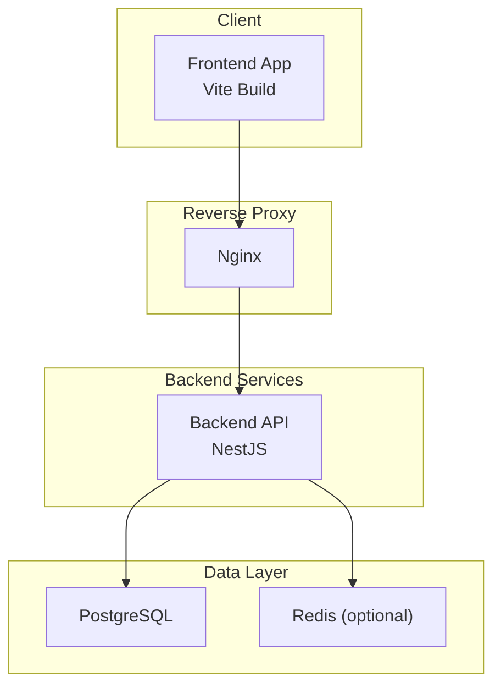

[No sources needed since this diagram shows conceptual workflow, not actual code structure]

**Section sources**
- [docker-compose.yml](file://docker/docker-compose.yml)
- [Dockerfile.backend](file://docker/Dockerfile.backend)
- [Dockerfile.frontend](file://docker/Dockerfile.frontend)
- [nginx.conf](file://docker/nginx.conf)

## Core Components
- Container Orchestration: Compose files define services for backend, frontend, Nginx, PostgreSQL, Redis, and pgAdmin. Separate compose profiles exist for local development and cloud deployments.
- Build Pipeline:
  - Backend builds via Node.js image using package.json scripts and TypeScript compilation.
  - Frontend builds via Vite into static assets served by Nginx.
- Configuration Management: Environment variables drive runtime behavior for both backend and frontend. Database connectivity and feature toggles are configured through environment files and config modules.
- Database Migrations: SQL and TypeScript migration runners execute schema changes and optional data fixes.
- Seed Data: Dedicated scripts populate initial/reference data for modules.
- Monitoring and Health: Health endpoints and monitoring parameters are added via migrations and service configuration.

**Section sources**
- [docker-compose.local.dev.yml](file://docker/docker-compose.local.dev.yml)
- [docker-compose.local.prod.yml](file://docker/docker-compose.local.prod.yml)
- [docker-compose.cloud.dev.yml](file://docker/docker-compose.cloud.dev.yml)
- [docker-compose.cloud.prod.yml](file://docker/docker-compose.cloud.prod.yml)
- [backend/package.json](file://backend/package.json)
- [frontend/package.json](file://frontend/package.json)
- [backend/src/config/env.config.ts](file://backend/src/config/env.config.ts)
- [backend/src/config/database.config.ts](file://backend/src/config/database.config.ts)
- [backend/scripts/run-migration.ts](file://backend/scripts/run-migration.ts)
- [backend/scripts/run-pending-migrations.ts](file://backend/scripts/run-pending-migrations.ts)
- [backend/deploy-all-migrations.sh](file://backend/deploy-all-migrations.sh)
- [backend/deploy-v31-complete.sh](file://backend/deploy-v31-complete.sh)

## Architecture Overview
The deployment architecture uses Docker Compose to orchestrate services. Nginx acts as a reverse proxy routing frontend static assets and backend API requests. PostgreSQL persists data; Redis can be used for caching or sessions. pgAdmin is available for database administration.

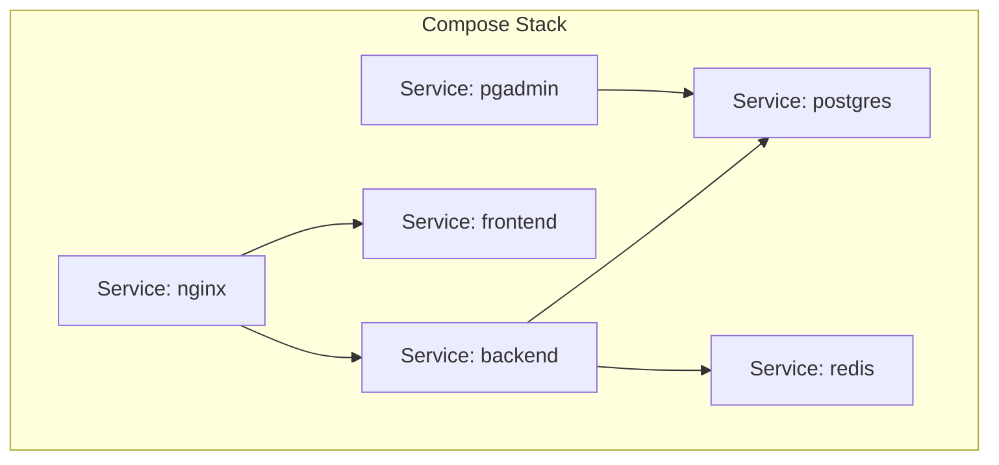

**Diagram sources**
- [docker-compose.yml](file://docker/docker-compose.yml)
- [docker-compose.local.dev.yml](file://docker/docker-compose.local.dev.yml)
- [docker-compose.local.prod.yml](file://docker/docker-compose.local.prod.yml)
- [docker-compose.cloud.dev.yml](file://docker/docker-compose.cloud.dev.yml)
- [docker-compose.cloud.prod.yml](file://docker/docker-compose.cloud.prod.yml)
- [nginx.conf](file://docker/nginx.conf)
- [pgadmin-servers.json](file://docker/pgadmin-servers.json)

## Detailed Component Analysis

### Build Processes
- Backend Build
  - Uses a Node.js base image, installs dependencies, compiles TypeScript, and exposes the compiled output.
  - Entrypoint runs the NestJS application process.
- Frontend Build
  - Uses a Node.js image to install dependencies and run Vite build, producing static assets.
  - Nginx serves these assets and proxies API calls to the backend.

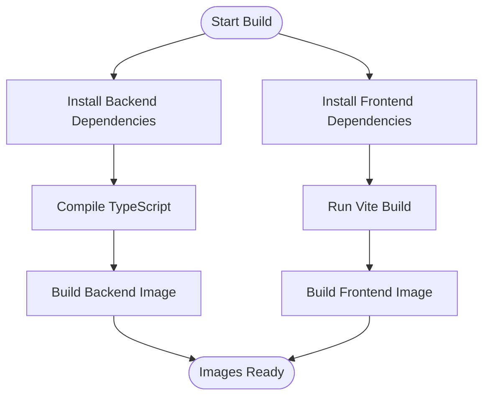

**Diagram sources**
- [Dockerfile.backend](file://docker/Dockerfile.backend)
- [Dockerfile.frontend](file://docker/Dockerfile.frontend)
- [backend/package.json](file://backend/package.json)
- [frontend/package.json](file://frontend/package.json)

**Section sources**
- [Dockerfile.backend](file://docker/Dockerfile.backend)
- [Dockerfile.frontend](file://docker/Dockerfile.frontend)
- [backend/package.json](file://backend/package.json)
- [frontend/package.json](file://frontend/package.json)

### Environment Configuration
- Backend Configuration
  - Environment variables control database connection, JWT secrets, feature flags, and logging.
  - Config modules load environment values and provide typed access throughout the app.
- Frontend Configuration
  - Vite configuration defines build targets, asset handling, and proxy settings for development.
- Compose Profiles
  - Local dev and prod compose files set different environment variables, ports, volumes, and service options.
  - Cloud compose files adjust resource limits, networking, and external dependencies.

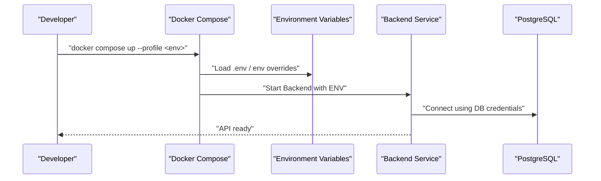

**Diagram sources**
- [docker-compose.local.dev.yml](file://docker/docker-compose.local.dev.yml)
- [docker-compose.local.prod.yml](file://docker/docker-compose.local.prod.yml)
- [docker-compose.cloud.dev.yml](file://docker/docker-compose.cloud.dev.yml)
- [docker-compose.cloud.prod.yml](file://docker/docker-compose.cloud.prod.yml)
- [backend/src/config/env.config.ts](file://backend/src/config/env.config.ts)
- [backend/src/config/database.config.ts](file://backend/src/config/database.config.ts)

**Section sources**
- [backend/src/config/env.config.ts](file://backend/src/config/env.config.ts)
- [backend/src/config/database.config.ts](file://backend/src/config/database.config.ts)
- [docker-compose.local.dev.yml](file://docker/docker-compose.local.dev.yml)
- [docker-compose.local.prod.yml](file://docker/docker-compose.local.prod.yml)
- [docker-compose.cloud.dev.yml](file://docker/docker-compose.cloud.dev.yml)
- [docker-compose.cloud.prod.yml](file://docker/docker-compose.cloud.prod.yml)
- [frontend/vite.config.ts](file://frontend/vite.config.ts)

### Container Orchestration with Docker
- Services
  - Backend: NestJS API server
  - Frontend: Static site built by Vite
  - Nginx: Reverse proxy and SSL termination (if configured)
  - PostgreSQL: Primary datastore
  - Redis: Optional cache/session store
  - pgAdmin: Database admin UI
- Networking
  - Internal Docker network connects services; Nginx routes traffic based on host/path rules.
- Volumes
  - Persistent volumes for PostgreSQL data and backups.
- Profiles
  - Use profiles to switch between local dev and cloud environments.

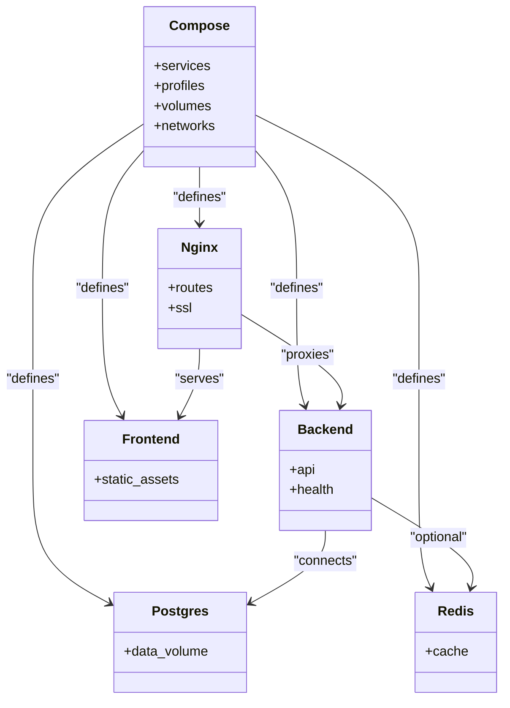

**Diagram sources**
- [docker-compose.yml](file://docker/docker-compose.yml)
- [nginx.conf](file://docker/nginx.conf)
- [pgadmin-servers.json](file://docker/pgadmin-servers.json)

**Section sources**
- [docker-compose.yml](file://docker/docker-compose.yml)
- [docker-compose.local.dev.yml](file://docker/docker-compose.local.dev.yml)
- [docker-compose.local.prod.yml](file://docker/docker-compose.local.prod.yml)
- [docker-compose.cloud.dev.yml](file://docker/docker-compose.cloud.dev.yml)
- [docker-compose.cloud.prod.yml](file://docker/docker-compose.cloud.prod.yml)
- [nginx.conf](file://docker/nginx.conf)
- [pgadmin-servers.json](file://docker/pgadmin-servers.json)

### Database Migration Execution
- Run Pending Migrations
  - Use the provided TypeScript runner to apply pending migrations against the configured database.
- Batch Migration Scripts
  - Shell scripts automate running all migrations or specific phases.
- Monitoring Parameters
  - A dedicated migration adds monitoring-related parameters to support observability.

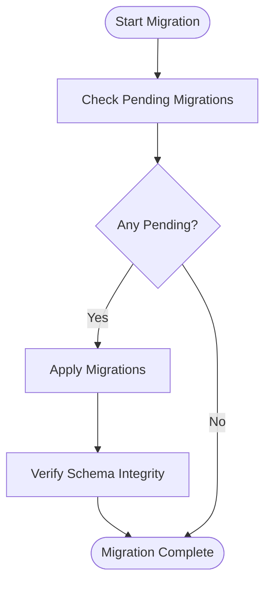

**Diagram sources**
- [backend/scripts/run-pending-migrations.ts](file://backend/scripts/run-pending-migrations.ts)
- [backend/scripts/run-migration.ts](file://backend/scripts/run-migration.ts)
- [backend/deploy-all-migrations.sh](file://backend/deploy-all-migrations.sh)
- [backend/deploy-v31-complete.sh](file://backend/deploy-v31-complete.sh)
- [backend/database/migrations/099-add-monitoring-params.sql](file://backend/database/migrations/099-add-monitoring-params.sql)

**Section sources**
- [backend/scripts/run-pending-migrations.ts](file://backend/scripts/run-pending-migrations.ts)
- [backend/scripts/run-migration.ts](file://backend/scripts/run-migration.ts)
- [backend/deploy-all-migrations.sh](file://backend/deploy-all-migrations.sh)
- [backend/deploy-v31-complete.sh](file://backend/deploy-v31-complete.sh)
- [backend/database/migrations/099-add-monitoring-params.sql](file://backend/database/migrations/099-add-monitoring-params.sql)

### Seed Data Deployment
- Purpose
  - Populate reference data, default configurations, and module-specific seeds required after fresh installations or resets.
- Execution
  - Use repository-provided scripts to run seeders against the target environment.
- Idempotency
  - Ensure seed scripts are idempotent to avoid duplicate records during repeated deployments.

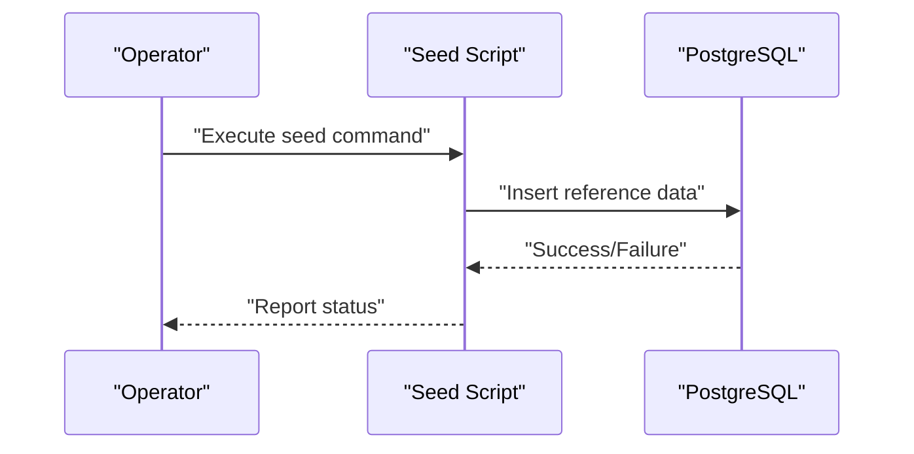

[No sources needed since this diagram shows conceptual workflow, not actual code structure]

**Section sources**
- [backend/scripts/run-migration.ts](file://backend/scripts/run-migration.ts)
- [backend/scripts/run-pending-migrations.ts](file://backend/scripts/run-pending-migrations.ts)

### Configuration Management Across Environments
- Local Development
  - Use local dev compose profile with development-friendly settings (hot reload, verbose logs).
- Staging
  - Mirror production configuration with smaller scale and test datasets.
- Production
  - Use cloud prod compose profile with hardened settings, resource limits, and secure secrets.
- Secrets
  - Store sensitive values (JWT secret, DB credentials) in environment files or orchestrator secret stores.

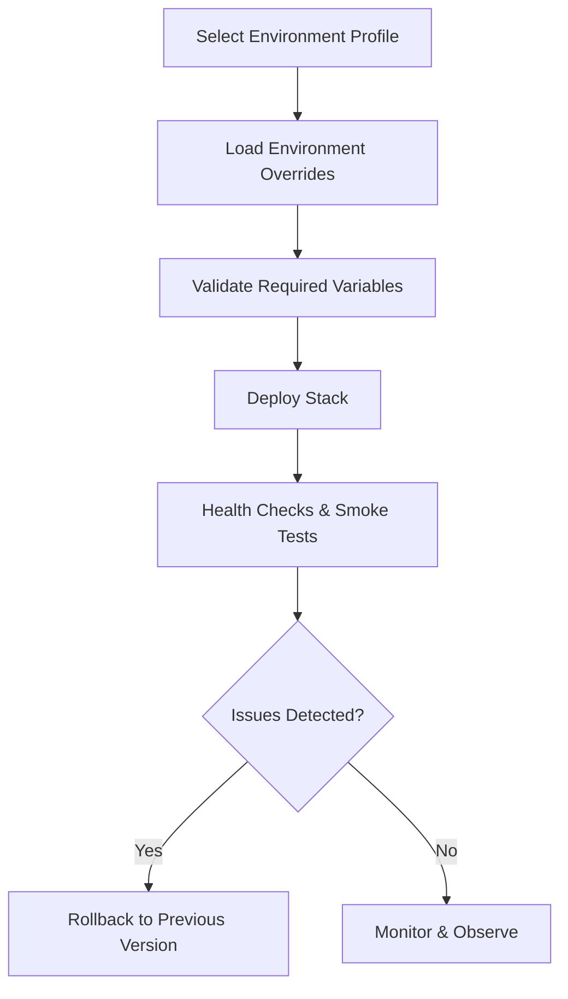

**Diagram sources**
- [docker-compose.local.dev.yml](file://docker/docker-compose.local.dev.yml)
- [docker-compose.local.prod.yml](file://docker/docker-compose.local.prod.yml)
- [docker-compose.cloud.dev.yml](file://docker/docker-compose.cloud.dev.yml)
- [docker-compose.cloud.prod.yml](file://docker/docker-compose.cloud.prod.yml)
- [backend/src/config/env.config.ts](file://backend/src/config/env.config.ts)

**Section sources**
- [docker-compose.local.dev.yml](file://docker/docker-compose.local.dev.yml)
- [docker-compose.local.prod.yml](file://docker/docker-compose.local.prod.yml)
- [docker-compose.cloud.dev.yml](file://docker/docker-compose.cloud.dev.yml)
- [docker-compose.cloud.prod.yml](file://docker/docker-compose.cloud.prod.yml)
- [backend/src/config/env.config.ts](file://backend/src/config/env.config.ts)

### Rollback Procedures
- Application Rollback
  - Re-deploy previous images using version tags and restore environment configuration to prior state.
- Database Rollback
  - If migrations are reversible, apply down migrations; otherwise, restore from pre-migration backup.
- Automated Rollback
  - Use update script to perform safe rollbacks when health checks fail.

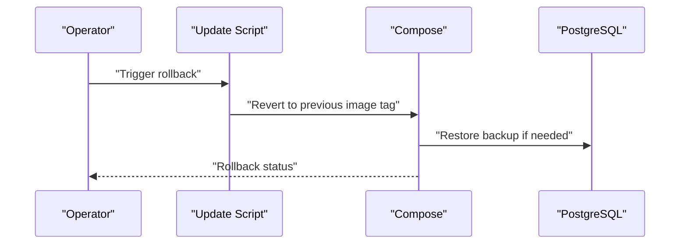

**Diagram sources**
- [scripts/update.sh](file://docker/scripts/update.sh)
- [scripts/restore.sh](file://docker/scripts/restore.sh)

**Section sources**
- [scripts/update.sh](file://docker/scripts/update.sh)
- [scripts/restore.sh](file://docker/scripts/restore.sh)

### Backup Strategies and Disaster Recovery
- Automated Backups
  - Cron job triggers daily backups to persistent storage.
- Manual Backups
  - On-demand backup script for pre-release snapshots.
- Restore Process
  - Restore script applies latest backup to target database.
- Retention
  - Organize backups by frequency (daily, weekly, monthly) and keep according to policy.

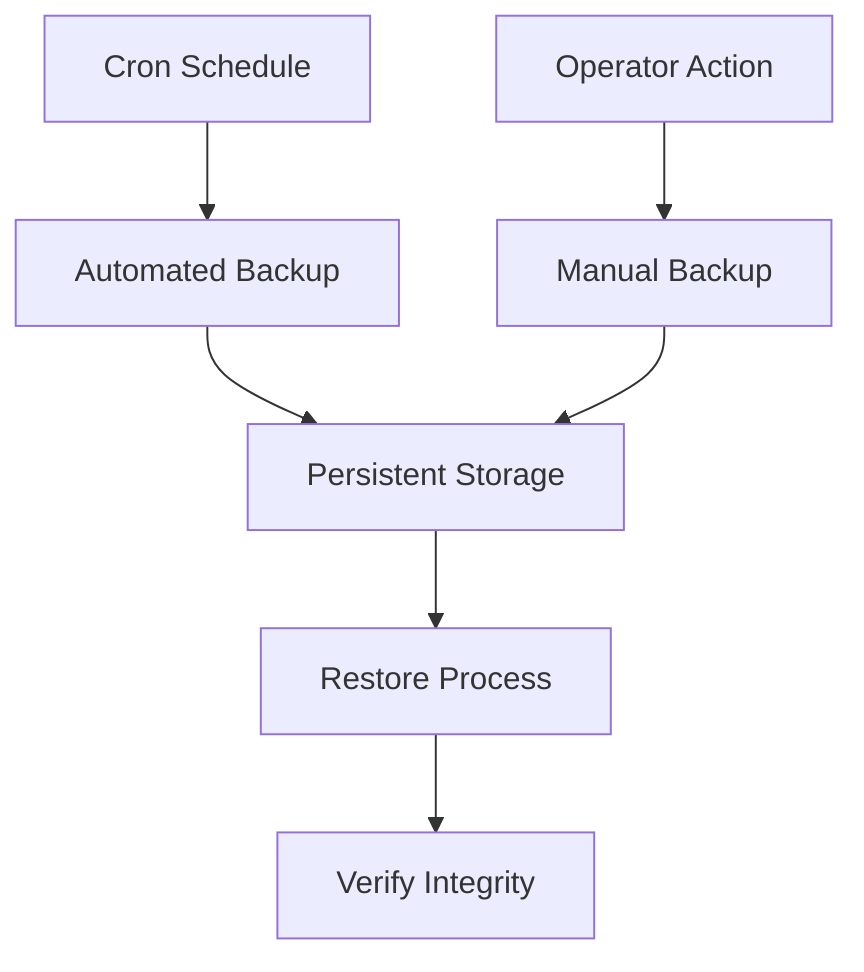

**Diagram sources**
- [scripts/backup-auto.sh](file://docker/scripts/backup-auto.sh)
- [scripts/backup-manuel.sh](file://docker/scripts/backup-manuel.sh)
- [scripts/restore.sh](file://docker/scripts/restore.sh)
- [scripts/install-cron.sh](file://docker/scripts/install-cron.sh)
- [scripts/cron-backup.txt](file://docker/scripts/cron-backup.txt)

**Section sources**
- [scripts/backup-auto.sh](file://docker/scripts/backup-auto.sh)
- [scripts/backup-manuel.sh](file://docker/scripts/backup-manuel.sh)
- [scripts/restore.sh](file://docker/scripts/restore.sh)
- [scripts/install-cron.sh](file://docker/scripts/install-cron.sh)
- [scripts/cron-backup.txt](file://docker/scripts/cron-backup.txt)

### Staging Deployments
- Purpose
  - Validate new modules and features under realistic conditions before production release.
- Configuration
  - Use cloud dev compose profile with staging-like settings.
- Testing
  - Run integration tests and smoke checks post-deployment.
- Approval Gate
  - Require sign-off from QA and ops before promoting to production.

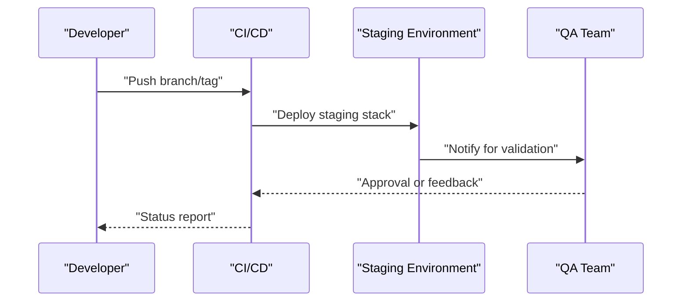

[No sources needed since this diagram shows conceptual workflow, not actual code structure]

**Section sources**
- [docker-compose.cloud.dev.yml](file://docker/docker-compose.cloud.dev.yml)

### Production Releases
- Pre-flight Checks
  - Validate environment variables, image versions, and dependency readiness.
- Blue-Green or Rolling Updates
  - Prefer zero-downtime updates by swapping service versions and verifying health.
- Post-release Verification
  - Confirm health endpoints, key workflows, and monitoring metrics.

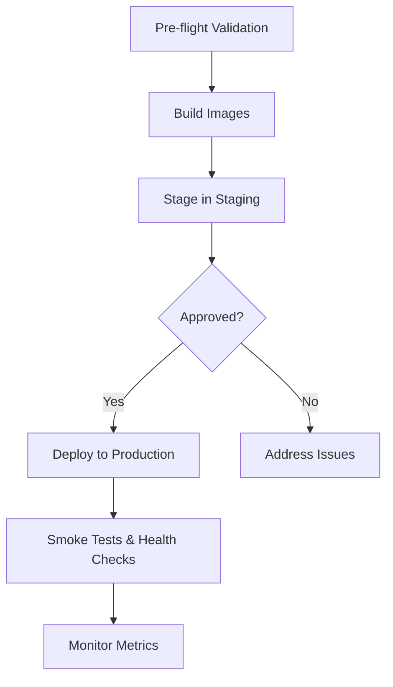

**Diagram sources**
- [deploy.sh](file://docker/deploy.sh)
- [docker-compose.cloud.prod.yml](file://docker/docker-compose.cloud.prod.yml)

**Section sources**
- [deploy.sh](file://docker/deploy.sh)
- [docker-compose.cloud.prod.yml](file://docker/docker-compose.cloud.prod.yml)

### Monitoring Deployment Success
- Health Endpoints
  - Implement health checks for backend services and database connectivity.
- Observability
  - Enable logging, metrics, and tracing where applicable.
- Alerts
  - Configure alerts for failures, latency spikes, and error rates.

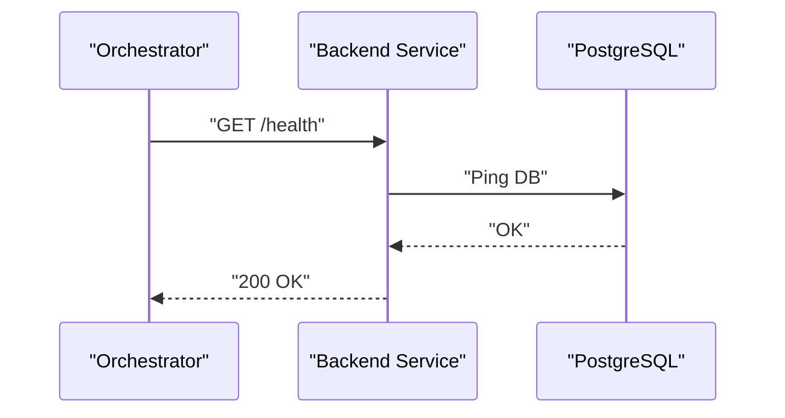

**Diagram sources**
- [backend/src/app.ts](file://backend/src/app.ts)
- [backend/src/index.ts](file://backend/src/index.ts)

**Section sources**
- [backend/src/app.ts](file://backend/src/app.ts)
- [backend/src/index.ts](file://backend/src/index.ts)

### Scaling Considerations
- Horizontal Scaling
  - Scale backend replicas behind Nginx load balancing.
- Database Scaling
  - Use read replicas and connection pooling for increased throughput.
- Caching
  - Leverage Redis for session/cache layers to reduce DB pressure.
- Resource Limits
  - Set CPU/memory limits per service in compose files.

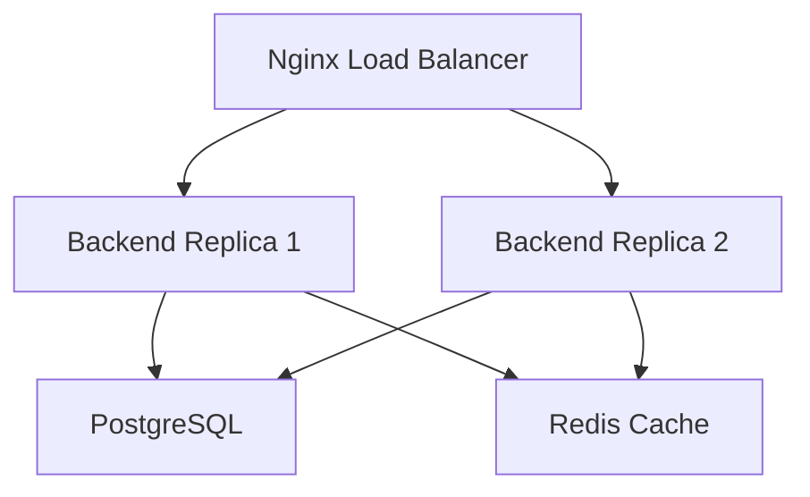

[No sources needed since this diagram shows conceptual workflow, not actual code structure]

**Section sources**
- [docker-compose.local.prod.yml](file://docker/docker-compose.local.prod.yml)
- [docker-compose.cloud.prod.yml](file://docker/docker-compose.cloud.prod.yml)
- [nginx.conf](file://docker/nginx.conf)

### Performance Tuning
- Database Indexes
  - Add indexes for frequently queried columns and composite keys.
- Query Optimization
  - Review slow queries and optimize joins/filters.
- Connection Pooling
  - Tune pool sizes for backend and database connections.
- Asset Optimization
  - Enable compression and caching for static assets via Nginx.

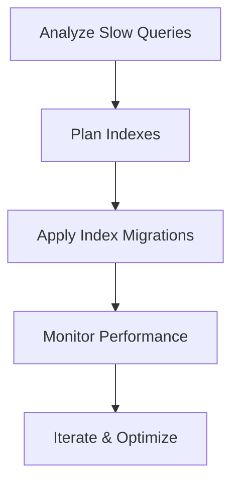

**Diagram sources**
- [backend/database/migrations/099-add-monitoring-params.sql](file://backend/database/migrations/099-add-monitoring-params.sql)

**Section sources**
- [backend/database/migrations/099-add-monitoring-params.sql](file://backend/database/migrations/099-add-monitoring-params.sql)

### Troubleshooting Common Deployment Issues
- Connectivity Errors
  - Verify DB credentials, network policies, and service discovery.
- Port Conflicts
  - Ensure no host port collisions; adjust compose mappings.
- CORS and Proxy Issues
  - Check Nginx routing rules and backend CORS configuration.
- Missing Environment Variables
  - Validate required variables and defaults.
- Migration Failures
  - Inspect migration logs and revert to last known good state.

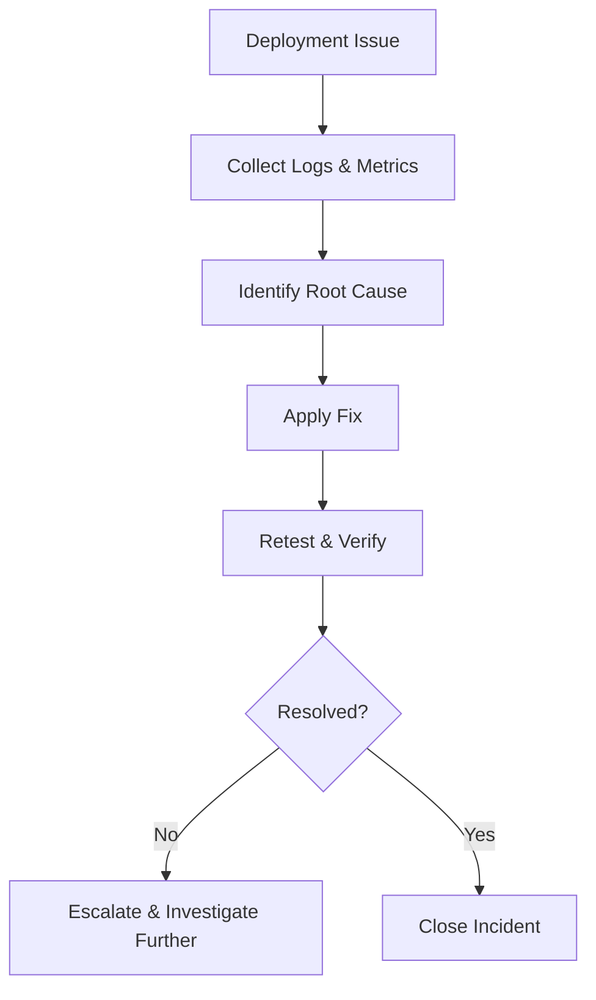

[No sources needed since this diagram shows conceptual workflow, not actual code structure]

**Section sources**
- [backend/src/config/env.config.ts](file://backend/src/config/env.config.ts)
- [backend/src/config/database.config.ts](file://backend/src/config/database.config.ts)
- [nginx.conf](file://docker/nginx.conf)

### Maintenance Procedures
- Routine Tasks
  - Rotate logs, prune unused images, and review backup retention.
- Security Updates
  - Patch base images and dependencies regularly.
- Database Maintenance
  - Vacuum and analyze tables; monitor index bloat.
- pgAdmin Access
  - Use pgAdmin service to inspect schemas and data safely.

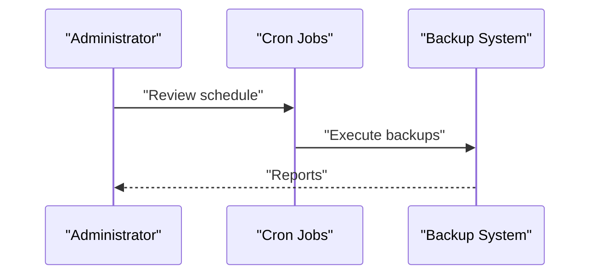

**Diagram sources**
- [scripts/install-cron.sh](file://docker/scripts/install-cron.sh)
- [scripts/cron-backup.txt](file://docker/scripts/cron-backup.txt)
- [pgadmin.sh](file://docker/pgadmin.sh)
- [pgadmin-servers.json](file://docker/pgadmin-servers.json)

**Section sources**
- [scripts/install-cron.sh](file://docker/scripts/install-cron.sh)
- [scripts/cron-backup.txt](file://docker/scripts/cron-backup.txt)
- [pgadmin.sh](file://docker/pgadmin.sh)
- [pgadmin-servers.json](file://docker/pgadmin-servers.json)

## Dependency Analysis
Key dependencies include:
- Backend depends on PostgreSQL and optionally Redis.
- Frontend depends on Vite build toolchain and produces static assets.
- Nginx depends on backend and frontend outputs for routing and serving.
- pgAdmin depends on PostgreSQL for administration.

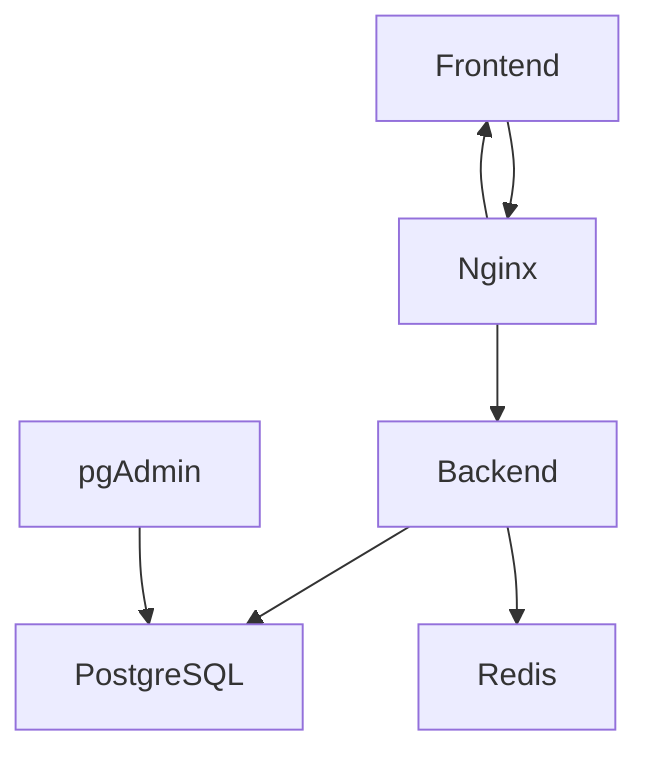

**Diagram sources**
- [docker-compose.yml](file://docker/docker-compose.yml)
- [nginx.conf](file://docker/nginx.conf)
- [pgadmin-servers.json](file://docker/pgadmin-servers.json)

**Section sources**
- [docker-compose.yml](file://docker/docker-compose.yml)
- [nginx.conf](file://docker/nginx.conf)
- [pgadmin-servers.json](file://docker/pgadmin-servers.json)

## Performance Considerations
- Optimize database queries and add appropriate indexes.
- Use connection pooling and tune pool sizes.
- Enable HTTP compression and caching for static assets.
- Monitor resource usage and scale horizontally as needed.
- Regularly review slow query logs and adjust indexing strategy.

[No sources needed since this section provides general guidance]

## Troubleshooting Guide
- Verify environment variables and secrets.
- Check service logs for errors and stack traces.
- Validate database connectivity and migration status.
- Inspect Nginx routing and CORS settings.
- Use pgAdmin to validate schema integrity and data consistency.

**Section sources**
- [backend/src/config/env.config.ts](file://backend/src/config/env.config.ts)
- [backend/src/config/database.config.ts](file://backend/src/config/database.config.ts)
- [nginx.conf](file://docker/nginx.conf)
- [pgadmin-servers.json](file://docker/pgadmin-servers.json)

## Conclusion
This deployment guide outlines a robust, repeatable process for releasing eLISAschool modules and features. By leveraging Docker Compose, structured migrations, comprehensive backups, and clear rollback procedures, teams can deploy confidently across staging and production while maintaining performance and reliability.

[No sources needed since this section summarizes without analyzing specific files]

## Appendices

### Quick Commands Reference
- Start local development stack
- Start production stack
- Run pending migrations
- Execute manual backup
- Restore from backup
- Open pgAdmin

[No sources needed since this section provides general guidance]