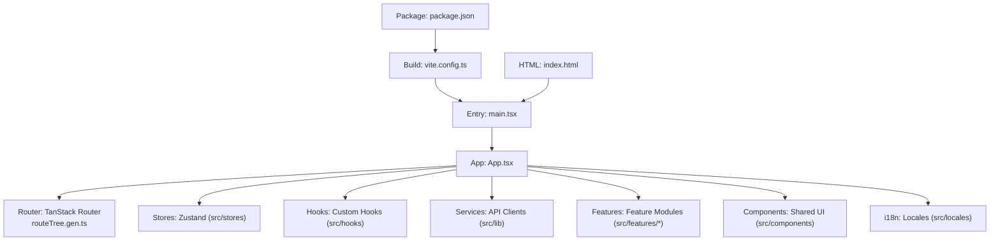
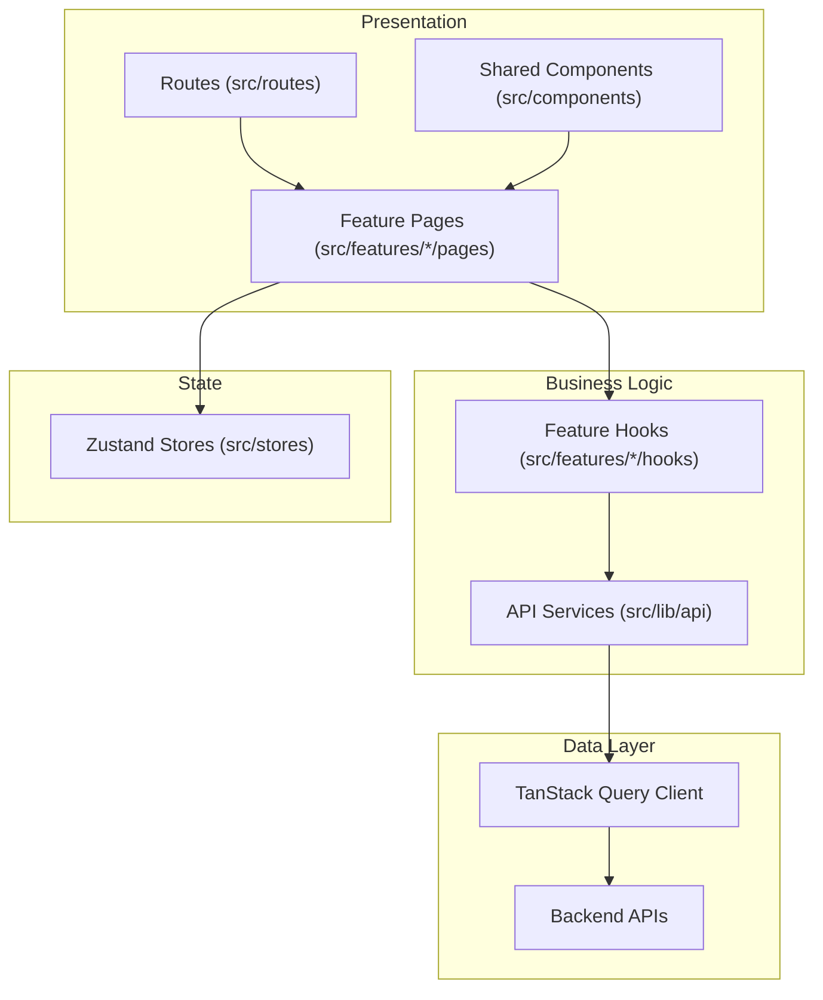
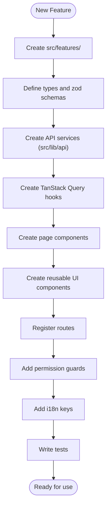
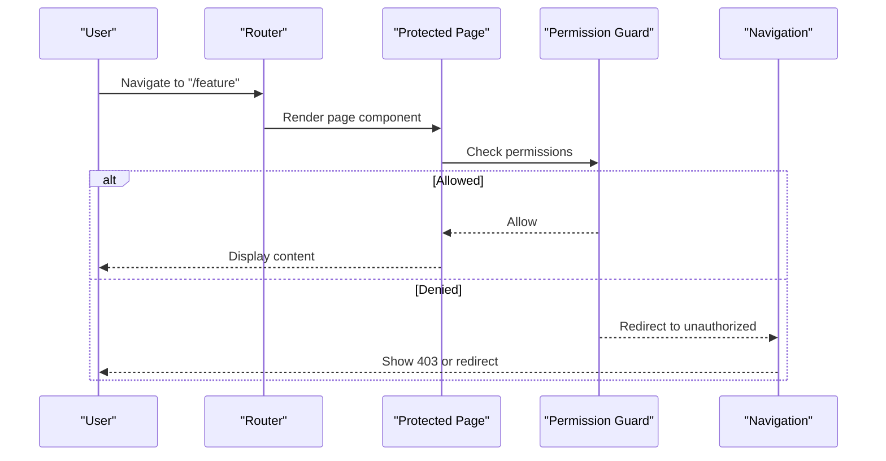
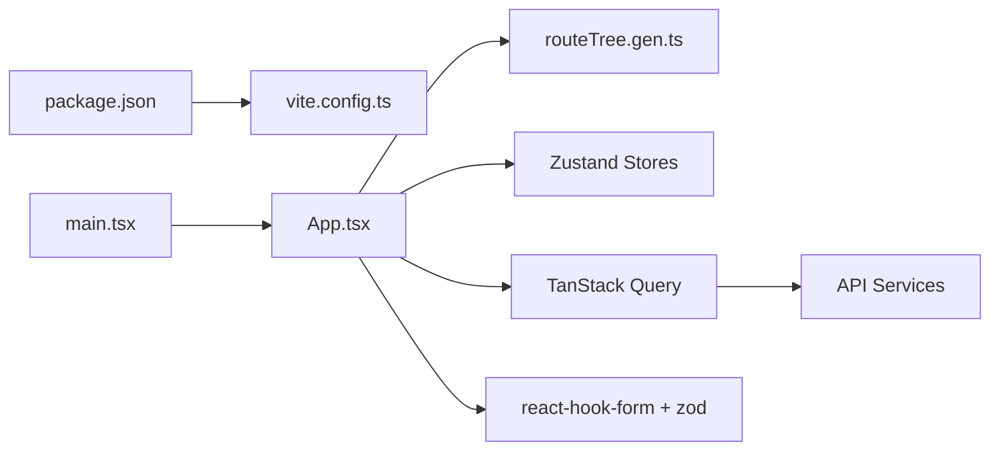

# Frontend Module Integration

<cite>
**Referenced Files in This Document**
- [App.tsx](file://frontend/src/App.tsx)
- [main.tsx](file://frontend/src/main.tsx)
- [routeTree.gen.ts](file://frontend/src/routeTree.gen.ts)
- [vite.config.ts](file://frontend/vite.config.ts)
- [package.json](file://frontend/package.json)
- [index.html](file://frontend/index.html)
</cite>

## Table of Contents
1. [Introduction](#introduction)
2. [Project Structure](#project-structure)
3. [Core Components](#core-components)
4. [Architecture Overview](#architecture-overview)
5. [Detailed Component Analysis](#detailed-component-analysis)
6. [Dependency Analysis](#dependency-analysis)
7. [Performance Considerations](#performance-considerations)
8. [Troubleshooting Guide](#troubleshooting-guide)
9. [Conclusion](#conclusion)
10. [Appendices](#appendices)

## Introduction
This guide explains how to integrate new modules into the eLISAschool frontend application using its feature-based architecture. It covers folder organization, component patterns, state management with Zustand, form handling with react-hook-form and zod validation, data fetching with TanStack Query, route configuration and navigation, permission-based access control, internationalization, responsive design, accessibility compliance, testing strategies, and backend API integration. The goal is to provide a consistent, scalable approach for adding features that align with existing conventions.

## Project Structure
The frontend follows a feature-based architecture where each business capability lives under src/features/<feature-name>. Shared UI components live under src/components, global stores under src/stores, hooks under src/hooks, services and utilities under src/lib, routes under src/routes, and localization files under src/locales. The app entry points are main.tsx and App.tsx, with Vite as the build tool and TanStack Router generating route trees.

**Diagram sources**
- [main.tsx](file://frontend/src/main.tsx)
- [App.tsx](file://frontend/src/App.tsx)
- [routeTree.gen.ts](file://frontend/src/routeTree.gen.ts)
- [vite.config.ts](file://frontend/vite.config.ts)
- [package.json](file://frontend/package.json)
- [index.html](file://frontend/index.html)

**Section sources**
- [main.tsx](file://frontend/src/main.tsx)
- [App.tsx](file://frontend/src/App.tsx)
- [routeTree.gen.ts](file://frontend/src/routeTree.gen.ts)
- [vite.config.ts](file://frontend/vite.config.ts)
- [package.json](file://frontend/package.json)
- [index.html](file://frontend/index.html)

## Core Components
- Application bootstrap: main.tsx initializes React and mounts the app; App.tsx configures providers, router, theme, and global stores.
- Routing: TanStack Router generates routeTree.gen.ts from file-based routes under src/routes.
- State management: Zustand stores in src/stores manage UI and cross-cutting state.
- Data layer: Services and hooks in src/lib and src/hooks encapsulate TanStack Query usage and API calls.
- Features: Each feature directory under src/features contains its own routes, components, hooks, stores, and types.
- Shared UI: Reusable components in src/components follow the design system tokens and patterns.
- Internationalization: i18n resources under src/locales support multi-language content.
- Build and dev tooling: Vite configuration in vite.config.ts and dependencies in package.json.

**Section sources**
- [main.tsx](file://frontend/src/main.tsx)
- [App.tsx](file://frontend/src/App.tsx)
- [routeTree.gen.ts](file://frontend/src/routeTree.gen.ts)
- [vite.config.ts](file://frontend/vite.config.ts)
- [package.json](file://frontend/package.json)

## Architecture Overview
The frontend uses a layered, feature-driven architecture:
- Presentation layer: Route pages and feature components.
- Business logic layer: Feature-specific hooks and services.
- State layer: Zustand stores for UI/global state.
- Data layer: TanStack Query for caching, background updates, and mutations.
- Infrastructure: Providers (router, theme, i18n), API client, and error boundaries.

[No sources needed since this diagram shows conceptual workflow, not actual code structure]

## Detailed Component Analysis

### Feature Module Template
Use this pattern when creating a new module:
- Create a feature directory under src/features/<feature-name>.
- Organize by concerns:
  - pages/: route-level components
  - components/: feature-scoped components
  - hooks/: feature-specific hooks (including TanStack Query hooks)
  - stores/: feature-specific Zustand stores
  - types/: TypeScript types and schemas
  - services/: API service functions
  - utils/: helpers and constants
- Register routes in src/routes or via TanStack Router file-based conventions.
- Add permissions guards around protected routes/pages.
- Provide i18n keys under src/locales.

[No sources needed since this diagram shows conceptual workflow, not actual code structure]

### Reusable UI Components
Guidelines:
- Keep components pure and focused on presentation.
- Use props interfaces and default values.
- Follow design tokens (colors, spacing, typography).
- Support keyboard navigation and screen readers.
- Compose complex UIs from smaller primitives.

Example references:
- Shared component patterns and composition can be found in existing feature pages and components directories.

**Section sources**
- [App.tsx](file://frontend/src/App.tsx)

### Form Handling with react-hook-form and zod
Recommended flow:
- Define a zod schema for validation.
- Use react-hook-form’s useForm with resolver to validate against zod.
- Bind fields via register and handle errors via form state.
- Submit handler triggers mutation (TanStack Query) to persist data.
- Show success/error feedback via notifications.

References:
- Validation and form patterns are used across features; see feature pages and hooks for examples.

**Section sources**
- [App.tsx](file://frontend/src/App.tsx)

### Data Fetching with TanStack Query
Patterns:
- Create query keys per resource.
- Implement useQuery hooks for reads with proper cache keys and refetch policies.
- Implement useMutation hooks for writes with optimistic updates if applicable.
- Centralize API clients in src/lib/api to handle base URLs, headers, and error mapping.
- Use invalidateQueries after mutations to refresh lists.

References:
- Service and hook implementations reside under src/lib and src/features/*/hooks.

**Section sources**
- [App.tsx](file://frontend/src/App.tsx)

### Route Configuration and Navigation
- File-based routing under src/routes integrates with TanStack Router.
- Generated route tree appears in routeTree.gen.ts.
- Use Link components for navigation and preserve search params/state as needed.
- Wrap protected routes with permission guards.

**Diagram sources**
- [routeTree.gen.ts](file://frontend/src/routeTree.gen.ts)
- [App.tsx](file://frontend/src/App.tsx)

**Section sources**
- [routeTree.gen.ts](file://frontend/src/routeTree.gen.ts)
- [App.tsx](file://frontend/src/App.tsx)

### Permission-Based Access Control
- Centralize permission checks in guards or higher-order components.
- Evaluate user roles/permissions before rendering sensitive UI or allowing navigation.
- Combine with route-level guards to enforce server-side and client-side security.

References:
- Guards and permission checks are integrated at the app level and within feature routes.

**Section sources**
- [App.tsx](file://frontend/src/App.tsx)

### Internationalization (i18n)
- Store translations under src/locales.
- Use a consistent key naming convention (e.g., feature.section.field).
- Provide fallbacks and pluralization rules.
- Ensure dynamic content is localized through keys rather than hardcoded strings.

**Section sources**
- [App.tsx](file://frontend/src/App.tsx)

### Responsive Design and Accessibility
- Use responsive utilities and breakpoints consistently.
- Ensure focus management, semantic HTML, and ARIA attributes.
- Test with keyboard-only navigation and screen readers.
- Maintain color contrast and scalable text.

**Section sources**
- [App.tsx](file://frontend/src/App.tsx)

### Testing Strategies
- Unit tests for hooks and services using test utilities for TanStack Query and react-hook-form.
- Component tests with mocked stores and API responses.
- Integration tests for critical flows (login, create/update/delete).
- Snapshot tests sparingly; prefer behavior assertions.

**Section sources**
- [package.json](file://frontend/package.json)

### Backend API Integration
- Centralize HTTP client configuration (base URL, interceptors, token handling).
- Map backend errors to user-friendly messages.
- Handle pagination, filtering, and sorting consistently.
- Use optimistic updates for better UX where appropriate.

**Section sources**
- [App.tsx](file://frontend/src/App.tsx)

## Dependency Analysis
Key runtime and build-time dependencies include React, TanStack Router, TanStack Query, Zustand, react-hook-form, zod, and Vite. The build pipeline is configured via vite.config.ts and package.json.

**Diagram sources**
- [package.json](file://frontend/package.json)
- [vite.config.ts](file://frontend/vite.config.ts)
- [main.tsx](file://frontend/src/main.tsx)
- [App.tsx](file://frontend/src/App.tsx)
- [routeTree.gen.ts](file://frontend/src/routeTree.gen.ts)

**Section sources**
- [package.json](file://frontend/package.json)
- [vite.config.ts](file://frontend/vite.config.ts)
- [main.tsx](file://frontend/src/main.tsx)
- [App.tsx](file://frontend/src/App.tsx)
- [routeTree.gen.ts](file://frontend/src/routeTree.gen.ts)

## Performance Considerations
- Lazy-load route components and feature modules to reduce initial bundle size.
- Prefer TanStack Query caching and stale-while-revalidate strategies.
- Memoize expensive computations and derived state.
- Optimize images and assets; use code splitting and tree-shaking.
- Debounce input-heavy operations and avoid unnecessary re-renders.

[No sources needed since this section provides general guidance]

## Troubleshooting Guide
Common issues and resolutions:
- Routes not resolving: Verify route registration and generated route tree.
- Permission denied: Confirm guard logic and user permissions.
- Form validation errors: Ensure zod schema matches backend expectations and react-hook-form bindings.
- Data not updating: Check query keys and invalidation after mutations.
- Build failures: Validate vite.config.ts and dependency versions in package.json.

**Section sources**
- [routeTree.gen.ts](file://frontend/src/routeTree.gen.ts)
- [vite.config.ts](file://frontend/vite.config.ts)
- [package.json](file://frontend/package.json)

## Conclusion
By following the feature-based architecture, established patterns for forms, data fetching, routing, permissions, i18n, responsiveness, and accessibility, you can integrate new modules efficiently and consistently. Use shared components and centralized services to maintain cohesion, and rely on TanStack Query and Zustand for predictable state and data synchronization.

[No sources needed since this section summarizes without analyzing specific files]

## Appendices

### Quick Checklist for New Module Integration
- Create feature directory and organize files by concern.
- Define types and zod schemas.
- Implement API services and TanStack Query hooks.
- Build page components and reusable UI.
- Register routes and add permission guards.
- Add i18n keys and ensure accessibility.
- Write unit and integration tests.
- Validate performance and responsiveness.

[No sources needed since this section provides general guidance]