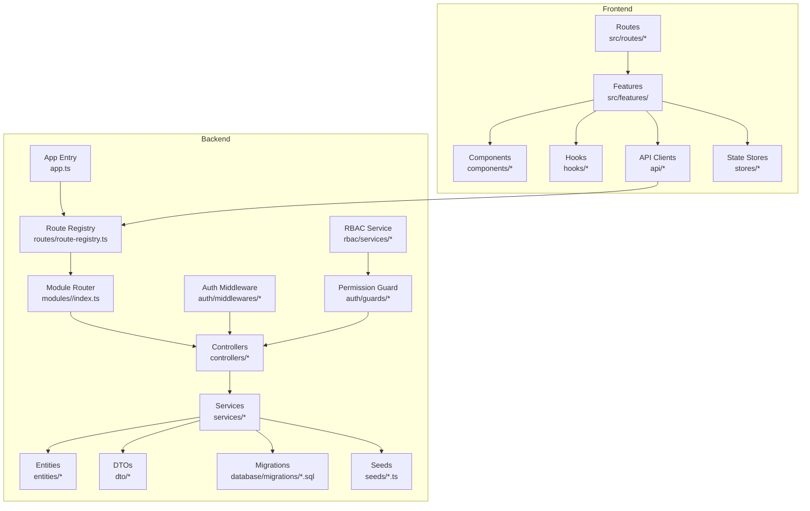
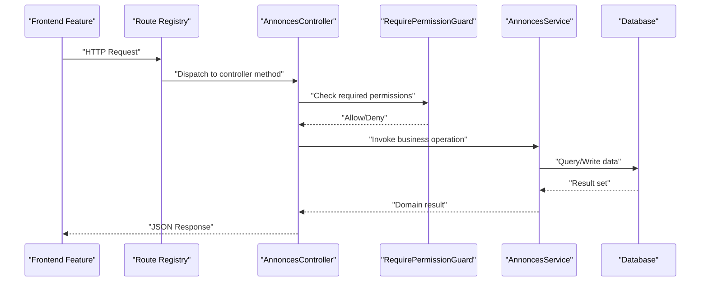
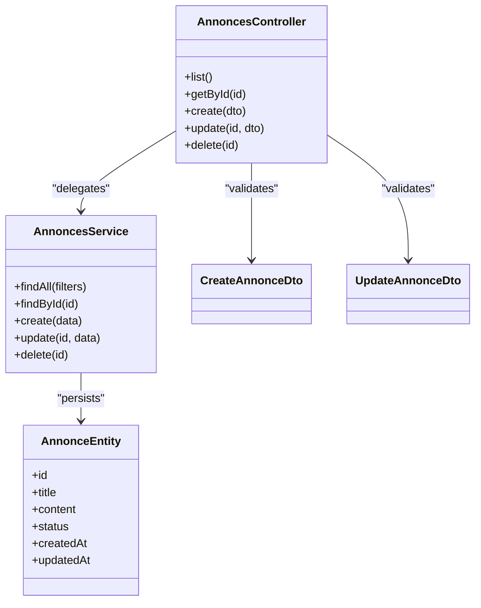
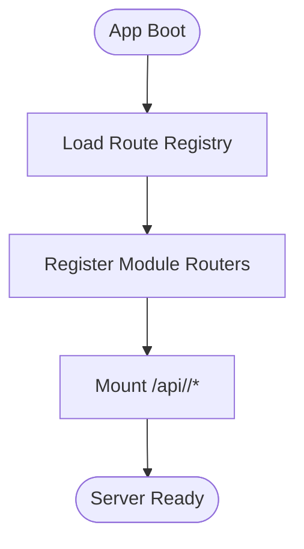
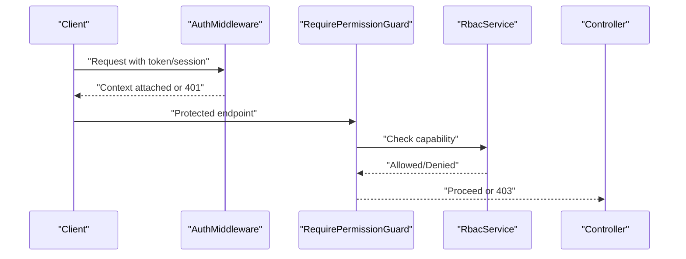
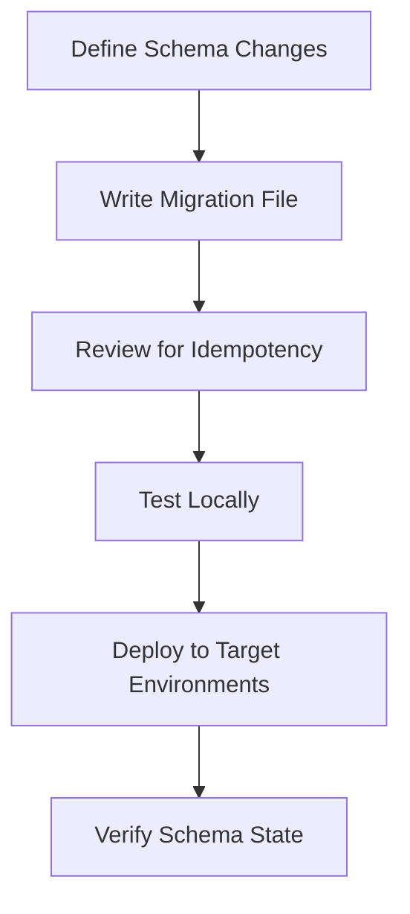
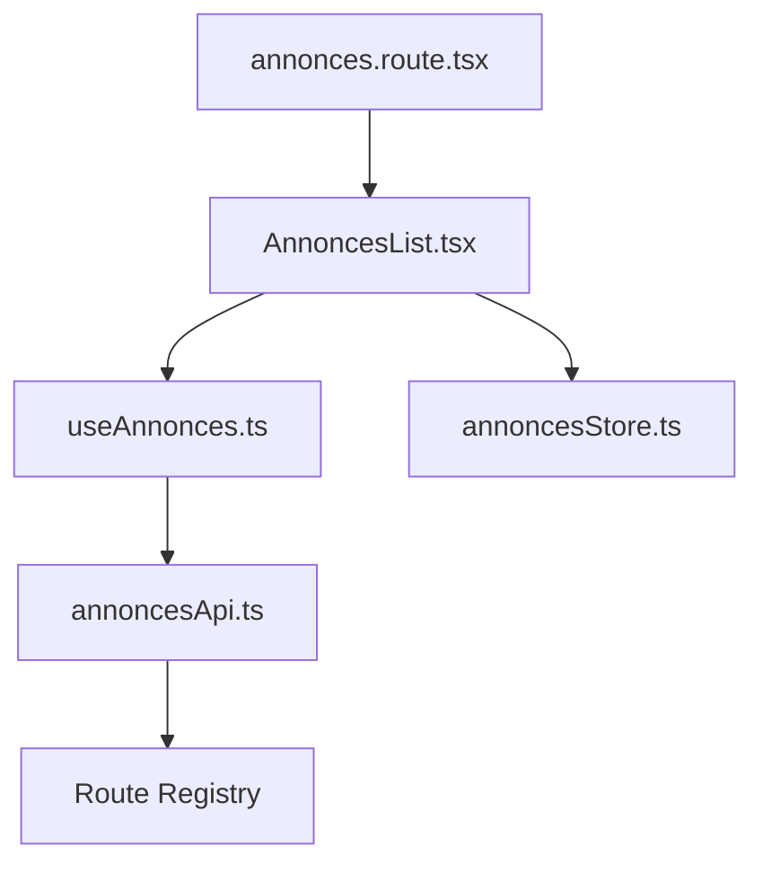
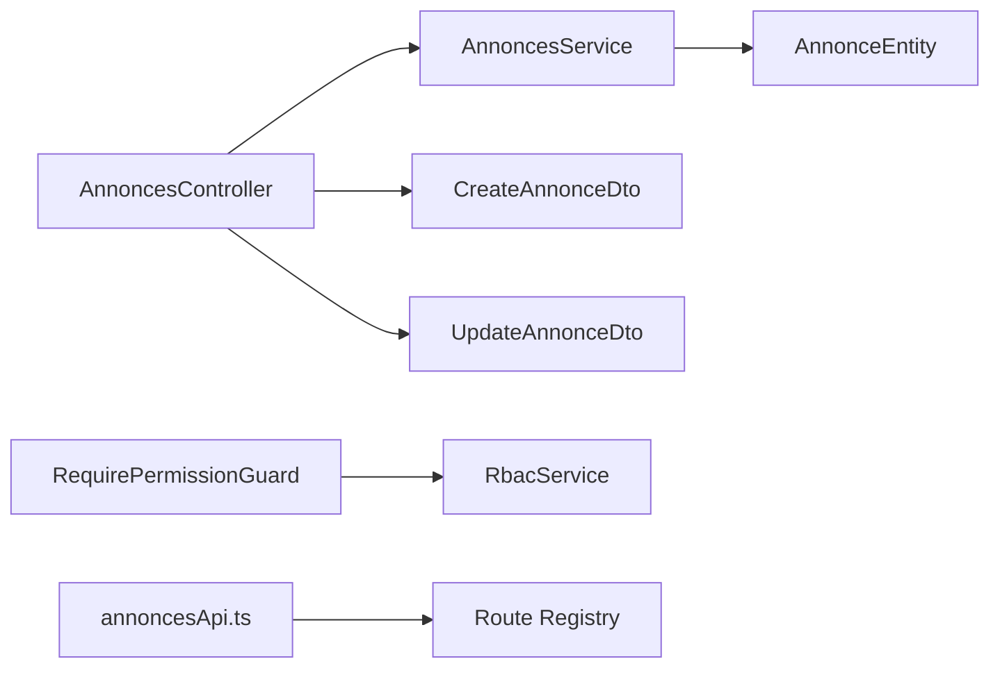

# Module Development & Extension

<cite>
**Referenced Files in This Document**
- [app.ts](file://backend/src/app.ts)
- [index.ts](file://backend/src/index.ts)
- [route-registry.ts](file://backend/src/routes/route-registry.ts)
- [data-source.ts](file://backend/src/database/data-source.ts)
- [database.config.ts](file://backend/src/config/database.config.ts)
- [env.config.ts](file://backend/src/config/env.config.ts)
- [modules/index.ts](file://backend/src/modules/index.ts)
- [modules/annonces/index.ts](file://backend/src/modules/annonces/index.ts)
- [modules/annonces/controllers/AnnoncesController.ts](file://backend/src/modules/annonces/controllers/AnnoncesController.ts)
- [modules/annonces/services/AnnoncesService.ts](file://backend/src/modules/annonces/services/AnnoncesService.ts)
- [modules/annonces/entities/AnnonceEntity.ts](file://backend/src/modules/annonces/entities/AnnonceEntity.ts)
- [modules/annonces/dto/CreateAnnonceDto.ts](file://backend/src/modules/annonces/dto/CreateAnnonceDto.ts)
- [modules/annonces/dto/UpdateAnnonceDto.ts](file://backend/src/modules/annonces/dto/UpdateAnnonceDto.ts)
- [modules/annonces/migrations/041-module-annonces.sql](file://backend/database/migrations/041-module-annonces.sql)
- [modules/annonces/migrations/042-annonces-performance-optimization.sql](file://backend/database/migrations/042-annonces-performance-optimization.sql)
- [modules/annonces/seeds/annonces.seed.ts](file://backend/src/modules/annonces/seeds/annonces.seed.ts)
- [modules/auth/guards/RequirePermissionGuard.ts](file://backend/src/modules/auth/guards/RequirePermissionGuard.ts)
- [modules/auth/middlewares/AuthMiddleware.ts](file://backend/src/modules/auth/middlewares/AuthMiddleware.ts)
- [modules/rbac/controllers/RbacController.ts](file://backend/src/modules/rbac/controllers/RbacController.ts)
- [modules/rbac/services/RbacService.ts](file://backend/src/modules/rbac/services/RbacService.ts)
- [modules/configuration/services/ModuleActivationService.ts](file://backend/src/modules/configuration/services/ModuleActivationService.ts)
- [frontend/src/features/annonces/components/AnnoncesList.tsx](file://frontend/src/features/annonces/components/AnnoncesList.tsx)
- [frontend/src/features/annonces/hooks/useAnnonces.ts](file://frontend/src/features/annonces/hooks/useAnnonces.ts)
- [frontend/src/features/annonces/api/annoncesApi.ts](file://frontend/src/features/annonces/api/annoncesApi.ts)
- [frontend/src/routes/annonces.route.tsx](file://frontend/src/routes/annonces.route.tsx)
- [frontend/src/stores/annoncesStore.ts](file://frontend/src/stores/annoncesStore.ts)
- [test/integration/auth-multi-etablissement.spec.ts](file://backend/test/integration/auth-multi-etablissement.spec.ts)
- [test/unit/pagination.util.spec.ts](file://backend/test/unit/pagination.util.spec.ts)
</cite>

## Table of Contents
1. [Introduction](#introduction)
2. [Project Structure](#project-structure)
3. [Core Components](#core-components)
4. [Architecture Overview](#architecture-overview)
5. [Detailed Component Analysis](#detailed-component-analysis)
6. [Dependency Analysis](#dependency-analysis)
7. [Performance Considerations](#performance-considerations)
8. [Troubleshooting Guide](#troubleshooting-guide)
9. [Conclusion](#conclusion)
10. [Appendices](#appendices)

## Introduction
This guide explains how to extend eLISAschool by creating new modules that follow the established architectural patterns. It covers backend module structure (controllers, services, entities, DTOs, migrations, seeds), integration with routing and authentication/permissions, database migration creation, API endpoint development, frontend integration (components, hooks, state management), testing, documentation requirements, and deployment procedures. The goal is to enable consistent, maintainable, and secure feature expansion across both backend and frontend.

## Project Structure
eLISAschool follows a modular architecture:
- Backend modules live under backend/src/modules/<module-name>, each containing controllers, services, entities, DTOs, migrations, and optional seeds.
- Database migrations are stored under backend/database/migrations.
- Routes are registered centrally via a route registry.
- Authentication and authorization are provided by shared guards and middlewares.
- Frontend features mirror backend modules under frontend/src/features/<feature-name> with components, hooks, API clients, routes, and stores.

**Diagram sources**
- [app.ts](file://backend/src/app.ts)
- [route-registry.ts](file://backend/src/routes/route-registry.ts)
- [modules/index.ts](file://backend/src/modules/index.ts)
- [modules/annonces/index.ts](file://backend/src/modules/annonces/index.ts)
- [modules/annonces/controllers/AnnoncesController.ts](file://backend/src/modules/annonces/controllers/AnnoncesController.ts)
- [modules/annonces/services/AnnoncesService.ts](file://backend/src/modules/annonces/services/AnnoncesService.ts)
- [modules/annonces/entities/AnnonceEntity.ts](file://backend/src/modules/annonces/entities/AnnonceEntity.ts)
- [modules/annonces/dto/CreateAnnonceDto.ts](file://backend/src/modules/annonces/dto/CreateAnnonceDto.ts)
- [modules/annonces/dto/UpdateAnnonceDto.ts](file://backend/src/modules/annonces/dto/UpdateAnnonceDto.ts)
- [modules/annonces/migrations/041-module-annonces.sql](file://backend/database/migrations/041-module-annonces.sql)
- [modules/annonces/migrations/042-annonces-performance-optimization.sql](file://backend/database/migrations/042-annonces-performance-optimization.sql)
- [modules/annonces/seeds/annonces.seed.ts](file://backend/src/modules/annonces/seeds/annonces.seed.ts)
- [modules/auth/middlewares/AuthMiddleware.ts](file://backend/src/modules/auth/middlewares/AuthMiddleware.ts)
- [modules/auth/guards/RequirePermissionGuard.ts](file://backend/src/modules/auth/guards/RequirePermissionGuard.ts)
- [modules/rbac/services/RbacService.ts](file://backend/src/modules/rbac/services/RbacService.ts)
- [frontend/src/routes/annonces.route.tsx](file://frontend/src/routes/annonces.route.tsx)
- [frontend/src/features/annonces/components/AnnoncesList.tsx](file://frontend/src/features/annonces/components/AnnoncesList.tsx)
- [frontend/src/features/annonces/hooks/useAnnonces.ts](file://frontend/src/features/annonces/hooks/useAnnonces.ts)
- [frontend/src/features/annonces/api/annoncesApi.ts](file://frontend/src/features/annonces/api/annoncesApi.ts)
- [frontend/src/stores/annoncesStore.ts](file://frontend/src/stores/annoncesStore.ts)

**Section sources**
- [app.ts](file://backend/src/app.ts)
- [index.ts](file://backend/src/index.ts)
- [route-registry.ts](file://backend/src/routes/route-registry.ts)
- [modules/index.ts](file://backend/src/modules/index.ts)
- [modules/annonces/index.ts](file://backend/src/modules/annonces/index.ts)

## Core Components
A typical module includes:
- Controller: HTTP endpoints, request validation, response formatting.
- Service: Business logic, data access orchestration, cross-cutting concerns.
- Entity: ORM entity mapping to database tables.
- DTO: Request/response schemas for validation and typing.
- Migrations: SQL or TypeScript scripts to evolve schema.
- Seeds: Initial or reference data population.
- Module index: Registration and router mounting.

Key integration points:
- Route registration through the central registry.
- Authentication via middleware; authorization via permission guard.
- RBAC service for capability checks.
- Module activation configuration for runtime toggling.

**Section sources**
- [modules/annonces/controllers/AnnoncesController.ts](file://backend/src/modules/annonces/controllers/AnnoncesController.ts)
- [modules/annonces/services/AnnoncesService.ts](file://backend/src/modules/annonces/services/AnnoncesService.ts)
- [modules/annonces/entities/AnnonceEntity.ts](file://backend/src/modules/annonces/entities/AnnonceEntity.ts)
- [modules/annonces/dto/CreateAnnonceDto.ts](file://backend/src/modules/annonces/dto/CreateAnnonceDto.ts)
- [modules/annonces/dto/UpdateAnnonceDto.ts](file://backend/src/modules/annonces/dto/UpdateAnnonceDto.ts)
- [modules/annonces/migrations/041-module-annonces.sql](file://backend/database/migrations/041-module-annonces.sql)
- [modules/annonces/migrations/042-annonces-performance-optimization.sql](file://backend/database/migrations/042-annonces-performance-optimization.sql)
- [modules/annonces/seeds/annonces.seed.ts](file://backend/src/modules/annonces/seeds/annonces.seed.ts)
- [modules/auth/middlewares/AuthMiddleware.ts](file://backend/src/modules/auth/middlewares/AuthMiddleware.ts)
- [modules/auth/guards/RequirePermissionGuard.ts](file://backend/src/modules/auth/guards/RequirePermissionGuard.ts)
- [modules/rbac/services/RbacService.ts](file://backend/src/modules/rbac/services/RbacService.ts)
- [modules/configuration/services/ModuleActivationService.ts](file://backend/src/modules/configuration/services/ModuleActivationService.ts)

## Architecture Overview
The system uses a layered approach:
- Controllers receive HTTP requests, validate inputs using DTOs, delegate to services.
- Services implement business rules and interact with entities and repositories.
- Entities map to database tables defined by migrations.
- Auth middleware validates sessions/tokens; permission guards enforce RBAC capabilities.
- Frontend features call backend APIs via typed clients and manage UI state with hooks and stores.

**Diagram sources**
- [route-registry.ts](file://backend/src/routes/route-registry.ts)
- [modules/annonces/controllers/AnnoncesController.ts](file://backend/src/modules/annonces/controllers/AnnoncesController.ts)
- [modules/auth/guards/RequirePermissionGuard.ts](file://backend/src/modules/auth/guards/RequirePermissionGuard.ts)
- [modules/annonces/services/AnnoncesService.ts](file://backend/src/modules/annonces/services/AnnoncesService.ts)
- [data-source.ts](file://backend/src/database/data-source.ts)

## Detailed Component Analysis

### Backend Module Anatomy
- Controller layer handles HTTP concerns: path binding, query/body parsing, error mapping, pagination wrappers.
- Service layer encapsulates domain logic, transaction boundaries, and repository calls.
- Entities define table structures, relationships, and constraints.
- DTOs provide input/output contracts and validation rules.
- Migrations ensure idempotent schema evolution.
- Seeds populate initial/reference data safely.

**Diagram sources**
- [modules/annonces/controllers/AnnoncesController.ts](file://backend/src/modules/annonces/controllers/AnnoncesController.ts)
- [modules/annonces/services/AnnoncesService.ts](file://backend/src/modules/annonces/services/AnnoncesService.ts)
- [modules/annonces/entities/AnnonceEntity.ts](file://backend/src/modules/annonces/entities/AnnonceEntity.ts)
- [modules/annonces/dto/CreateAnnonceDto.ts](file://backend/src/modules/annonces/dto/CreateAnnonceDto.ts)
- [modules/annonces/dto/UpdateAnnonceDto.ts](file://backend/src/modules/annonces/dto/UpdateAnnonceDto.ts)

**Section sources**
- [modules/annonces/controllers/AnnoncesController.ts](file://backend/src/modules/annonces/controllers/AnnoncesController.ts)
- [modules/annonces/services/AnnoncesService.ts](file://backend/src/modules/annonces/services/AnnoncesService.ts)
- [modules/annonces/entities/AnnonceEntity.ts](file://backend/src/modules/annonces/entities/AnnonceEntity.ts)
- [modules/annonces/dto/CreateAnnonceDto.ts](file://backend/src/modules/annonces/dto/CreateAnnonceDto.ts)
- [modules/annonces/dto/UpdateAnnonceDto.ts](file://backend/src/modules/annonces/dto/UpdateAnnonceDto.ts)

### Routing and Module Registration
- Central route registry mounts module routers.
- Each module exposes an index file that registers its routes and applies guards/middlewares.
- Ensure unique prefixes per module to avoid collisions.

**Diagram sources**
- [app.ts](file://backend/src/app.ts)
- [route-registry.ts](file://backend/src/routes/route-registry.ts)
- [modules/index.ts](file://backend/src/modules/index.ts)
- [modules/annonces/index.ts](file://backend/src/modules/annonces/index.ts)

**Section sources**
- [route-registry.ts](file://backend/src/routes/route-registry.ts)
- [modules/index.ts](file://backend/src/modules/index.ts)
- [modules/annonces/index.ts](file://backend/src/modules/annonces/index.ts)

### Authentication and Authorization Integration
- Auth middleware validates session/token context and attaches user context to requests.
- Permission guard enforces RBAC capabilities on protected endpoints.
- RBAC service provides capability resolution and checks.

**Diagram sources**
- [modules/auth/middlewares/AuthMiddleware.ts](file://backend/src/modules/auth/middlewares/AuthMiddleware.ts)
- [modules/auth/guards/RequirePermissionGuard.ts](file://backend/src/modules/auth/guards/RequirePermissionGuard.ts)
- [modules/rbac/services/RbacService.ts](file://backend/src/modules/rbac/services/RbacService.ts)

**Section sources**
- [modules/auth/middlewares/AuthMiddleware.ts](file://backend/src/modules/auth/middlewares/AuthMiddleware.ts)
- [modules/auth/guards/RequirePermissionGuard.ts](file://backend/src/modules/auth/guards/RequirePermissionGuard.ts)
- [modules/rbac/services/RbacService.ts](file://backend/src/modules/rbac/services/RbacService.ts)

### Database Migration Creation
- Place migration files under backend/database/migrations with descriptive names.
- Use SQL for schema changes; ensure idempotency and backward compatibility.
- Include performance indexes and constraints where appropriate.
- Run migrations via provided scripts or CLI tools.

**Diagram sources**
- [modules/annonces/migrations/041-module-annonces.sql](file://backend/database/migrations/041-module-annonces.sql)
- [modules/annonces/migrations/042-annonces-performance-optimization.sql](file://backend/database/migrations/042-annonces-performance-optimization.sql)

**Section sources**
- [modules/annonces/migrations/041-module-annonces.sql](file://backend/database/migrations/041-module-annonces.sql)
- [modules/annonces/migrations/042-annonces-performance-optimization.sql](file://backend/database/migrations/042-annonces-performance-optimization.sql)

### Seed Data Management
- Add seed scripts under module seeds directory.
- Use upsert patterns to avoid duplicates.
- Reference roles, permissions, and module activation flags when needed.

**Section sources**
- [modules/annonces/seeds/annonces.seed.ts](file://backend/src/modules/annonces/seeds/annonces.seed.ts)

### API Endpoint Development
- Define endpoints in controllers with clear verbs and resource paths.
- Validate payloads using DTOs.
- Return consistent response envelopes and error codes.
- Apply guards/middlewares for security.

**Section sources**
- [modules/annonces/controllers/AnnoncesController.ts](file://backend/src/modules/annonces/controllers/AnnoncesController.ts)
- [modules/annonces/dto/CreateAnnonceDto.ts](file://backend/src/modules/annonces/dto/CreateAnnonceDto.ts)
- [modules/annonces/dto/UpdateAnnonceDto.ts](file://backend/src/modules/annonces/dto/UpdateAnnonceDto.ts)

### Frontend Module Integration
- Create feature folder under frontend/src/features/<feature-name>.
- Implement components, hooks, API client, routes, and store.
- Integrate routes into the application router.
- Use typed API clients and centralized stores for state.

**Diagram sources**
- [frontend/src/routes/annonces.route.tsx](file://frontend/src/routes/annonces.route.tsx)
- [frontend/src/features/annonces/components/AnnoncesList.tsx](file://frontend/src/features/annonces/components/AnnoncesList.tsx)
- [frontend/src/features/annonces/hooks/useAnnonces.ts](file://frontend/src/features/annonces/hooks/useAnnonces.ts)
- [frontend/src/features/annonces/api/annoncesApi.ts](file://frontend/src/features/annonces/api/annoncesApi.ts)
- [frontend/src/stores/annoncesStore.ts](file://frontend/src/stores/annoncesStore.ts)

**Section sources**
- [frontend/src/routes/annonces.route.tsx](file://frontend/src/routes/annonces.route.tsx)
- [frontend/src/features/annonces/components/AnnoncesList.tsx](file://frontend/src/features/annonces/components/AnnoncesList.tsx)
- [frontend/src/features/annonces/hooks/useAnnonces.ts](file://frontend/src/features/annonces/hooks/useAnnonces.ts)
- [frontend/src/features/annonces/api/annoncesApi.ts](file://frontend/src/features/annonces/api/annoncesApi.ts)
- [frontend/src/stores/annoncesStore.ts](file://frontend/src/stores/annoncesStore.ts)

### Module Activation and Configuration
- Use module activation service to toggle features at runtime.
- Persist activation flags and respect tenant scoping if applicable.
- Gate UI rendering based on activation status.

**Section sources**
- [modules/configuration/services/ModuleActivationService.ts](file://backend/src/modules/configuration/services/ModuleActivationService.ts)

## Dependency Analysis
- Controllers depend on services and DTOs.
- Services depend on entities and external services (RBAC, configuration).
- Guards depend on RBAC service and auth context.
- Frontend features depend on API clients and stores.

**Diagram sources**
- [modules/annonces/controllers/AnnoncesController.ts](file://backend/src/modules/annonces/controllers/AnnoncesController.ts)
- [modules/annonces/services/AnnoncesService.ts](file://backend/src/modules/annonces/services/AnnoncesService.ts)
- [modules/annonces/entities/AnnonceEntity.ts](file://backend/src/modules/annonces/entities/AnnonceEntity.ts)
- [modules/annonces/dto/CreateAnnonceDto.ts](file://backend/src/modules/annonces/dto/CreateAnnonceDto.ts)
- [modules/annonces/dto/UpdateAnnonceDto.ts](file://backend/src/modules/annonces/dto/UpdateAnnonceDto.ts)
- [modules/auth/guards/RequirePermissionGuard.ts](file://backend/src/modules/auth/guards/RequirePermissionGuard.ts)
- [modules/rbac/services/RbacService.ts](file://backend/src/modules/rbac/services/RbacService.ts)
- [frontend/src/features/annonces/api/annoncesApi.ts](file://frontend/src/features/annonces/api/annoncesApi.ts)
- [route-registry.ts](file://backend/src/routes/route-registry.ts)

**Section sources**
- [modules/annonces/controllers/AnnoncesController.ts](file://backend/src/modules/annonces/controllers/AnnoncesController.ts)
- [modules/annonces/services/AnnoncesService.ts](file://backend/src/modules/annonces/services/AnnoncesService.ts)
- [modules/annonces/entities/AnnonceEntity.ts](file://backend/src/modules/annonces/entities/AnnonceEntity.ts)
- [modules/annonces/dto/CreateAnnonceDto.ts](file://backend/src/modules/annonces/dto/CreateAnnonceDto.ts)
- [modules/annonces/dto/UpdateAnnonceDto.ts](file://backend/src/modules/annonces/dto/UpdateAnnonceDto.ts)
- [modules/auth/guards/RequirePermissionGuard.ts](file://backend/src/modules/auth/guards/RequirePermissionGuard.ts)
- [modules/rbac/services/RbacService.ts](file://backend/src/modules/rbac/services/RbacService.ts)
- [frontend/src/features/annonces/api/annoncesApi.ts](file://frontend/src/features/annonces/api/annoncesApi.ts)
- [route-registry.ts](file://backend/src/routes/route-registry.ts)

## Performance Considerations
- Index frequently queried columns in migrations.
- Use pagination and filtering in controllers/services.
- Avoid N+1 queries by eager loading related entities.
- Cache read-heavy endpoints where appropriate.
- Monitor slow queries and optimize joins.

[No sources needed since this section provides general guidance]

## Troubleshooting Guide
Common issues and resolutions:
- 401 Unauthorized: Ensure auth middleware runs before route handlers and tokens are valid.
- 403 Forbidden: Check permission guard and RBAC capability assignments.
- Migration failures: Validate idempotency and rollback strategies; inspect logs for constraint violations.
- Frontend 404 routes: Confirm route registration and feature activation flags.

**Section sources**
- [modules/auth/middlewares/AuthMiddleware.ts](file://backend/src/modules/auth/middlewares/AuthMiddleware.ts)
- [modules/auth/guards/RequirePermissionGuard.ts](file://backend/src/modules/auth/guards/RequirePermissionGuard.ts)
- [modules/rbac/services/RbacService.ts](file://backend/src/modules/rbac/services/RbacService.ts)
- [test/integration/auth-multi-etablissement.spec.ts](file://backend/test/integration/auth-multi-etablissement.spec.ts)
- [test/unit/pagination.util.spec.ts](file://backend/test/unit/pagination.util.spec.ts)

## Conclusion
By following the established patterns—clear separation of concerns, robust validation, secure authentication/authorization, idempotent migrations, and cohesive frontend integration—you can reliably extend eLISAschool with new modules. Use the examples from existing modules as templates, adhere to naming conventions, and document your changes thoroughly for maintainability.

[No sources needed since this section summarizes without analyzing specific files]

## Appendices

### Step-by-Step Checklist for New Modules
- Define scope and requirements; draft entities and DTOs.
- Create migrations and seeds; test locally.
- Implement service and controller; add guards/middlewares.
- Register routes in the registry; activate module if needed.
- Build frontend feature: components, hooks, API client, routes, store.
- Write unit and integration tests; document API and usage.
- Deploy migrations and seeds; verify functionality in staging/prod.

[No sources needed since this section provides general guidance]