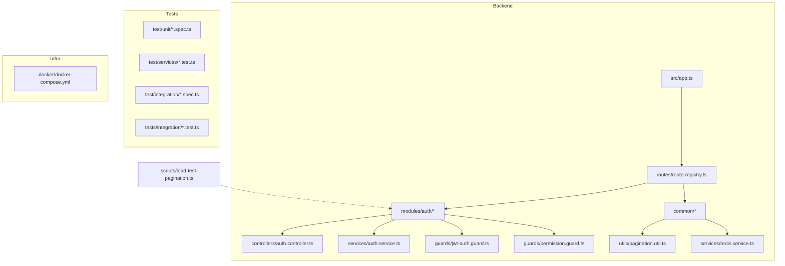
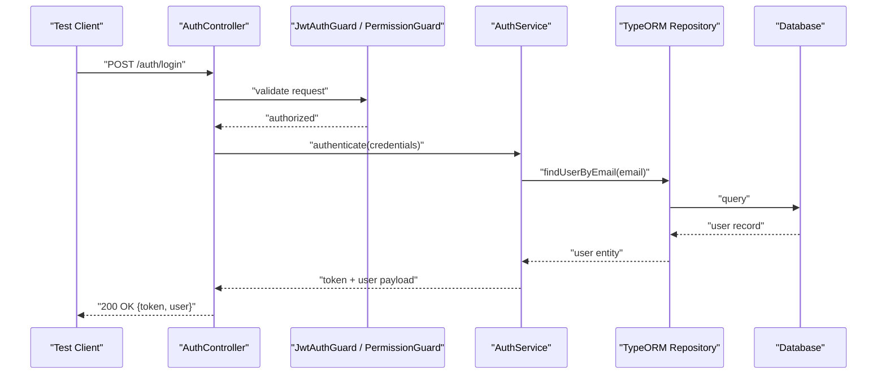
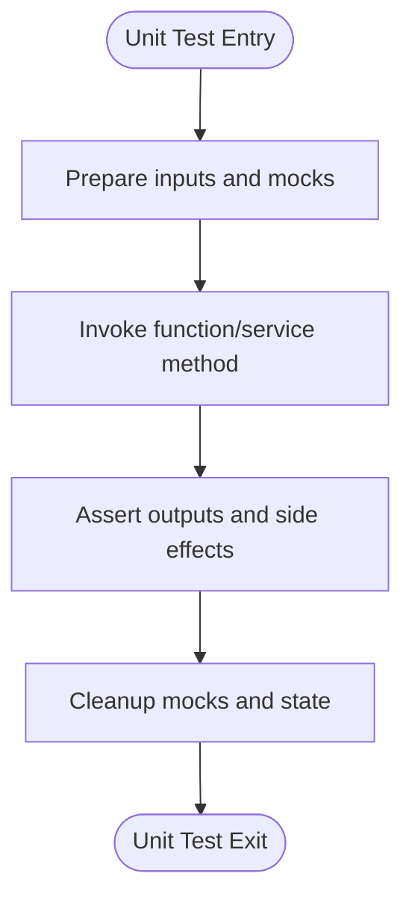
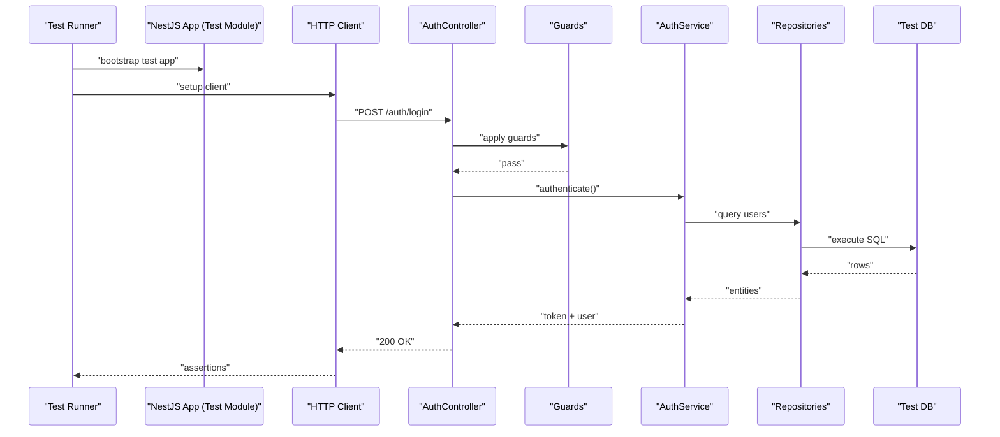
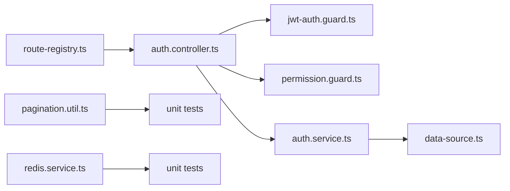

# Testing Strategies & Quality Assurance

<cite>
**Referenced Files in This Document**
- [backend/package.json](file://backend/package.json)
- [backend/test/README.md](file://backend/test/README.md)
- [backend/test/unit/pagination.util.spec.ts](file://backend/test/unit/pagination.util.spec.ts)
- [backend/test/unit/redis.service.spec.ts](file://backend/test/unit/redis.service.spec.ts)
- [backend/test/services/utilisateur-etablissement.service.test.ts](file://backend/test/services/utilisateur-etablissement.service.test.ts)
- [backend/test/services/utilisateurs.service.test.ts](file://backend/test/services/utilisateurs.service.test.ts)
- [backend/test/integration/auth-multi-etablissement.spec.ts](file://backend/test/integration/auth-multi-etablissement.spec.ts)
- [backend/test/integration/configuration-multi-tenant.spec.ts](file://backend/test/integration/configuration-multi-tenant.spec.ts)
- [backend/tests/integration/corrections-academique.test.ts](file://backend/tests/integration/corrections-academique.test.ts)
- [backend/src/config/database.config.ts](file://backend/src/config/database.config.ts)
- [backend/src/config/env.config.ts](file://backend/src/config/env.config.ts)
- [backend/src/database/data-source.ts](file://backend/src/database/data-source.ts)
- [backend/src/modules/auth/controllers/auth.controller.ts](file://backend/src/modules/auth/controllers/auth.controller.ts)
- [backend/src/modules/auth/services/auth.service.ts](file://backend/src/modules/auth/services/auth.service.ts)
- [backend/src/modules/auth/guards/jwt-auth.guard.ts](file://backend/src/modules/auth/guards/jwt-auth.guard.ts)
- [backend/src/modules/auth/guards/permission.guard.ts](file://backend/src/modules/auth/guards/permission.guard.ts)
- [backend/src/common/utils/pagination.util.ts](file://backend/src/common/utils/pagination.util.ts)
- [backend/src/common/services/redis.service.ts](file://backend/src/common/services/redis.service.ts)
- [backend/src/routes/route-registry.ts](file://backend/src/routes/route-registry.ts)
- [backend/scripts/load-test-pagination.ts](file://backend/scripts/load-test-pagination.ts)
- [docker/docker-compose.yml](file://docker/docker-compose.yml)
- [frontend/package.json](file://frontend/package.json)
- [frontend/vite.config.ts](file://frontend/vite.config.ts)
</cite>

## Table of Contents
1. [Introduction](#introduction)
2. [Project Structure](#project-structure)
3. [Core Components](#core-components)
4. [Architecture Overview](#architecture-overview)
5. [Detailed Component Analysis](#detailed-component-analysis)
6. [Dependency Analysis](#dependency-analysis)
7. [Performance Considerations](#performance-considerations)
8. [Troubleshooting Guide](#troubleshooting-guide)
9. [Conclusion](#conclusion)
10. [Appendices](#appendices)

## Introduction
This document provides a comprehensive testing guide for eLISAschool module development, covering unit, integration, and end-to-end testing strategies across backend services and frontend components. It explains how to set up test environments, manage test data, mock external dependencies, enforce code coverage, integrate tests into continuous integration, and perform debugging, performance, and load testing. The guidance is tailored to the existing project structure and tooling visible in the repository.

## Project Structure
The repository includes:
- Backend NestJS application with dedicated test directories for unit, service-level, and integration tests.
- Frontend React/Vite application with its own package configuration.
- Docker Compose for local infrastructure (database, cache, etc.).
- Scripts for migrations, seeds, and verification tasks.

**Diagram sources**
- [backend/src/routes/route-registry.ts](file://backend/src/routes/route-registry.ts)
- [backend/src/modules/auth/controllers/auth.controller.ts](file://backend/src/modules/auth/controllers/auth.controller.ts)
- [backend/src/modules/auth/services/auth.service.ts](file://backend/src/modules/auth/services/auth.service.ts)
- [backend/src/modules/auth/guards/jwt-auth.guard.ts](file://backend/src/modules/auth/guards/jwt-auth.guard.ts)
- [backend/src/modules/auth/guards/permission.guard.ts](file://backend/src/modules/auth/guards/permission.guard.ts)
- [backend/src/common/utils/pagination.util.ts](file://backend/src/common/utils/pagination.util.ts)
- [backend/src/common/services/redis.service.ts](file://backend/src/common/services/redis.service.ts)
- [backend/test/unit/pagination.util.spec.ts](file://backend/test/unit/pagination.util.spec.ts)
- [backend/test/unit/redis.service.spec.ts](file://backend/test/unit/redis.service.spec.ts)
- [backend/test/services/utilisateur-etablissement.service.test.ts](file://backend/test/services/utilisateur-etablissement.service.test.ts)
- [backend/test/services/utilisateurs.service.test.ts](file://backend/test/services/utilisateurs.service.test.ts)
- [backend/test/integration/auth-multi-etablissement.spec.ts](file://backend/test/integration/auth-multi-etablissement.spec.ts)
- [backend/test/integration/configuration-multi-tenant.spec.ts](file://backend/test/integration/configuration-multi-tenant.spec.ts)
- [backend/tests/integration/corrections-academique.test.ts](file://backend/tests/integration/corrections-academique.test.ts)
- [docker/docker-compose.yml](file://docker/docker-compose.yml)
- [backend/scripts/load-test-pagination.ts](file://backend/scripts/load-test-pagination.ts)

**Section sources**
- [backend/package.json](file://backend/package.json)
- [backend/test/README.md](file://backend/test/README.md)
- [backend/test/unit/pagination.util.spec.ts](file://backend/test/unit/pagination.util.spec.ts)
- [backend/test/unit/redis.service.spec.ts](file://backend/test/unit/redis.service.spec.ts)
- [backend/test/services/utilisateur-etablissement.service.test.ts](file://backend/test/services/utilisateur-etablissement.service.test.ts)
- [backend/test/services/utilisateurs.service.test.ts](file://backend/test/services/utilisateurs.service.test.ts)
- [backend/test/integration/auth-multi-etablissement.spec.ts](file://backend/test/integration/auth-multi-etablissement.spec.ts)
- [backend/test/integration/configuration-multi-tenant.spec.ts](file://backend/test/integration/configuration-multi-tenant.spec.ts)
- [backend/tests/integration/corrections-academique.test.ts](file://backend/tests/integration/corrections-academique.test.ts)
- [docker/docker-compose.yml](file://docker/docker-compose.yml)

## Core Components
This section outlines the key areas where testing should be focused when developing new modules:
- Unit tests for pure utilities and isolated services (e.g., pagination utility, Redis client wrapper).
- Service-level tests for business logic with mocked repositories and external clients.
- Integration tests for API endpoints using real controllers, guards, and database interactions via Testcontainers or an in-memory DB.
- End-to-end tests for user workflows across modules (auth, multi-tenant scoping, permissions).

Existing examples:
- Unit tests for pagination and Redis service demonstrate mocking patterns and assertion styles.
- Service tests show how to isolate business logic from persistence layers.
- Integration tests cover authentication flows and multi-tenant configuration scenarios.

**Section sources**
- [backend/test/unit/pagination.util.spec.ts](file://backend/test/unit/pagination.util.spec.ts)
- [backend/test/unit/redis.service.spec.ts](file://backend/test/unit/redis.service.spec.ts)
- [backend/test/services/utilisateur-etablissement.service.test.ts](file://backend/test/services/utilisateur-etablissement.service.test.ts)
- [backend/test/services/utilisateurs.service.test.ts](file://backend/test/services/utilisateurs.service.test.ts)
- [backend/test/integration/auth-multi-etablissement.spec.ts](file://backend/test/integration/auth-multi-etablissement.spec.ts)
- [backend/test/integration/configuration-multi-tenant.spec.ts](file://backend/test/integration/configuration-multi-tenant.spec.ts)

## Architecture Overview
The backend follows a layered architecture:
- Controllers handle HTTP requests and responses.
- Guards enforce authentication and authorization.
- Services encapsulate business logic.
- Data access uses TypeORM entities and repositories.
- Common utilities provide reusable functionality (pagination, caching).

**Diagram sources**
- [backend/src/modules/auth/controllers/auth.controller.ts](file://backend/src/modules/auth/controllers/auth.controller.ts)
- [backend/src/modules/auth/guards/jwt-auth.guard.ts](file://backend/src/modules/auth/guards/jwt-auth.guard.ts)
- [backend/src/modules/auth/guards/permission.guard.ts](file://backend/src/modules/auth/guards/permission.guard.ts)
- [backend/src/modules/auth/services/auth.service.ts](file://backend/src/modules/auth/services/auth.service.ts)
- [backend/src/database/data-source.ts](file://backend/src/database/data-source.ts)

**Section sources**
- [backend/src/modules/auth/controllers/auth.controller.ts](file://backend/src/modules/auth/controllers/auth.controller.ts)
- [backend/src/modules/auth/services/auth.service.ts](file://backend/src/modules/auth/services/auth.service.ts)
- [backend/src/modules/auth/guards/jwt-auth.guard.ts](file://backend/src/modules/auth/guards/jwt-auth.guard.ts)
- [backend/src/modules/auth/guards/permission.guard.ts](file://backend/src/modules/auth/guards/permission.guard.ts)
- [backend/src/database/data-source.ts](file://backend/src/database/data-source.ts)

## Detailed Component Analysis

### Unit Testing Strategy
Focus on deterministic, fast tests that validate pure functions and isolated services. Use mocks for external dependencies like Redis and filesystem.

Recommended practices:
- Isolate logic by replacing network calls, DB access, and third-party SDKs with spies/mocks.
- Assert both happy paths and error conditions.
- Keep fixtures small and composable; prefer factory helpers for complex objects.

Examples in this repository:
- Pagination utility tests verify correct slicing, total counts, and edge cases.
- Redis service tests validate get/set operations and error handling.

**Section sources**
- [backend/test/unit/pagination.util.spec.ts](file://backend/test/unit/pagination.util.spec.ts)
- [backend/test/unit/redis.service.spec.ts](file://backend/test/unit/redis.service.spec.ts)
- [backend/src/common/utils/pagination.util.ts](file://backend/src/common/utils/pagination.util.ts)
- [backend/src/common/services/redis.service.ts](file://backend/src/common/services/redis.service.ts)

### Service-Level Testing Strategy
Validate business logic without hitting the database or external APIs. Inject mocked repositories and clients into services under test.

Key considerations:
- Mock repository methods to return controlled datasets.
- Simulate permission checks and multi-tenant scoping within service methods.
- Verify transactional behavior and rollback paths.

Existing service tests illustrate these patterns for user and establishment-related logic.

**Section sources**
- [backend/test/services/utilisateur-etablissement.service.test.ts](file://backend/test/services/utilisateur-etablissement.service.test.ts)
- [backend/test/services/utilisateurs.service.test.ts](file://backend/test/services/utilisateurs.service.test.ts)

### Integration Testing Strategy
Use real controllers, guards, and a test database to validate end-to-end API flows. Prefer an ephemeral database per test suite to ensure isolation.

Guidelines:
- Seed minimal required data before each test case.
- Authenticate via the same flow used by clients (JWT issuance and validation).
- Validate status codes, response shapes, and database state changes.

Repository examples:
- Multi-establishment authentication flow.
- Multi-tenant configuration validation.

**Diagram sources**
- [backend/test/integration/auth-multi-etablissement.spec.ts](file://backend/test/integration/auth-multi-etablissement.spec.ts)
- [backend/test/integration/configuration-multi-tenant.spec.ts](file://backend/test/integration/configuration-multi-tenant.spec.ts)
- [backend/src/modules/auth/controllers/auth.controller.ts](file://backend/src/modules/auth/controllers/auth.controller.ts)
- [backend/src/modules/auth/guards/jwt-auth.guard.ts](file://backend/src/modules/auth/guards/jwt-auth.guard.ts)
- [backend/src/modules/auth/guards/permission.guard.ts](file://backend/src/modules/auth/guards/permission.guard.ts)
- [backend/src/modules/auth/services/auth.service.ts](file://backend/src/modules/auth/services/auth.service.ts)
- [backend/src/database/data-source.ts](file://backend/src/database/data-source.ts)

**Section sources**
- [backend/test/integration/auth-multi-etablissement.spec.ts](file://backend/test/integration/auth-multi-etablissement.spec.ts)
- [backend/test/integration/configuration-multi-tenant.spec.ts](file://backend/test/integration/configuration-multi-tenant.spec.ts)
- [backend/tests/integration/corrections-academique.test.ts](file://backend/tests/integration/corrections-academique.test.ts)

### End-to-End Testing Procedures
For cross-module workflows (e.g., enrollment, scheduling, payments), use a full-stack approach:
- Spin up backend and frontend via Docker Compose.
- Use browser automation or API-driven UI tests to simulate user journeys.
- Validate UI states, navigation, and data consistency across modules.

Suggested steps:
- Provision environment using docker-compose.
- Seed baseline data through migration/seed scripts.
- Execute user flows and assert outcomes.

[No sources needed since this section provides general guidance]

### Test Data Management
Recommendations:
- Create deterministic seed data for each scenario.
- Use factories to generate realistic entities with unique identifiers.
- Reset or truncate tables between tests to avoid leakage.
- Separate global fixtures from test-specific data.

[No sources needed since this section provides general guidance]

### Mocking Strategies
- Replace external services (email, SMS, payment gateways) with no-op or stub implementations.
- Mock Redis and other caches to control latency and errors.
- For database interactions, prefer in-memory databases or Testcontainers for realistic behavior.

**Section sources**
- [backend/test/unit/redis.service.spec.ts](file://backend/test/unit/redis.service.spec.ts)
- [backend/src/common/services/redis.service.ts](file://backend/src/common/services/redis.service.ts)

### Test Environment Setup
- Configure environment variables for test DB, JWT secrets, and feature flags.
- Use separate config files for test profiles.
- Ensure ports are free and resources are cleaned up after runs.

**Section sources**
- [backend/src/config/env.config.ts](file://backend/src/config/env.config.ts)
- [backend/src/config/database.config.ts](file://backend/src/config/database.config.ts)
- [docker/docker-compose.yml](file://docker/docker-compose.yml)

### Code Coverage Requirements
- Set minimum thresholds for statements, branches, functions, and lines.
- Exclude generated files and boilerplate.
- Report coverage per module to track progress.

[No sources needed since this section provides general guidance]

### Continuous Integration Testing
- Run unit and integration tests on every PR.
- Cache dependencies to speed up builds.
- Publish test reports and coverage artifacts.

[No sources needed since this section provides general guidance]

### Automated Quality Checks
- Enforce linting and formatting rules.
- Run type checks and static analysis.
- Block merges if tests fail or coverage drops below thresholds.

[No sources needed since this section provides general guidance]

### Debugging Techniques
- Enable verbose logging in test suites for failing cases.
- Use interactive debuggers for unit tests.
- Capture request/response payloads in integration tests.
- Inspect database snapshots after mutations.

[No sources needed since this section provides general guidance]

### Performance and Load Testing
- Use dedicated scripts to simulate concurrent requests against critical endpoints.
- Measure p95/p99 latencies and throughput.
- Identify bottlenecks in queries and cache usage.

**Section sources**
- [backend/scripts/load-test-pagination.ts](file://backend/scripts/load-test-pagination.ts)

## Dependency Analysis
The following diagram shows core runtime dependencies relevant to testing:

**Diagram sources**
- [backend/src/routes/route-registry.ts](file://backend/src/routes/route-registry.ts)
- [backend/src/modules/auth/controllers/auth.controller.ts](file://backend/src/modules/auth/controllers/auth.controller.ts)
- [backend/src/modules/auth/guards/jwt-auth.guard.ts](file://backend/src/modules/auth/guards/jwt-auth.guard.ts)
- [backend/src/modules/auth/guards/permission.guard.ts](file://backend/src/modules/auth/guards/permission.guard.ts)
- [backend/src/modules/auth/services/auth.service.ts](file://backend/src/modules/auth/services/auth.service.ts)
- [backend/src/database/data-source.ts](file://backend/src/database/data-source.ts)
- [backend/src/common/utils/pagination.util.ts](file://backend/src/common/utils/pagination.util.ts)
- [backend/src/common/services/redis.service.ts](file://backend/src/common/services/redis.service.ts)

**Section sources**
- [backend/src/routes/route-registry.ts](file://backend/src/routes/route-registry.ts)
- [backend/src/modules/auth/controllers/auth.controller.ts](file://backend/src/modules/auth/controllers/auth.controller.ts)
- [backend/src/modules/auth/guards/jwt-auth.guard.ts](file://backend/src/modules/auth/guards/jwt-auth.guard.ts)
- [backend/src/modules/auth/guards/permission.guard.ts](file://backend/src/modules/auth/guards/permission.guard.ts)
- [backend/src/modules/auth/services/auth.service.ts](file://backend/src/modules/auth/services/auth.service.ts)
- [backend/src/database/data-source.ts](file://backend/src/database/data-source.ts)
- [backend/src/common/utils/pagination.util.ts](file://backend/src/common/utils/pagination.util.ts)
- [backend/src/common/services/redis.service.ts](file://backend/src/common/services/redis.service.ts)

## Performance Considerations
- Keep unit tests fast by avoiding I/O and heavy computations.
- Parallelize independent integration tests using isolated DB instances.
- Profile hot paths and add targeted benchmarks for critical algorithms.
- Monitor memory leaks in long-running test processes.

[No sources needed since this section provides general guidance]

## Troubleshooting Guide
Common issues and resolutions:
- Flaky integration tests: ensure proper DB reset and unique test data.
- Authentication failures: verify JWT secret configuration and guard order.
- Redis connectivity: confirm service availability and fallback behaviors.
- Timeouts: adjust timeouts for slow endpoints and increase concurrency limits cautiously.

**Section sources**
- [backend/test/integration/auth-multi-etablissement.spec.ts](file://backend/test/integration/auth-multi-etablissement.spec.ts)
- [backend/test/unit/redis.service.spec.ts](file://backend/test/unit/redis.service.spec.ts)

## Conclusion
Adopting a layered testing strategy—unit, service, integration, and end-to-end—ensures robustness and maintainability for eLISAschool modules. Leverage existing examples for patterns, automate quality gates, and continuously monitor performance. This approach reduces regressions, accelerates delivery, and improves overall system reliability.

[No sources needed since this section summarizes without analyzing specific files]

## Appendices

### Appendix A: Backend Test Commands
- Run all tests: see scripts in package.json.
- Run unit tests only: filter by path.
- Run integration tests: ensure test DB is available.

**Section sources**
- [backend/package.json](file://backend/package.json)

### Appendix B: Frontend Testing Strategy
- Use Vite’s built-in test runner configured in vite.config.ts.
- Write component tests with shallow rendering and DOM assertions.
- Mock API calls using fetch/XHR mocks or lightweight server.

**Section sources**
- [frontend/package.json](file://frontend/package.json)
- [frontend/vite.config.ts](file://frontend/vite.config.ts)