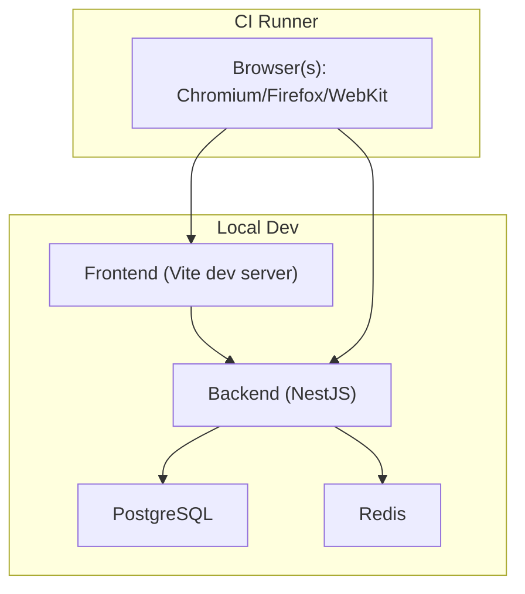
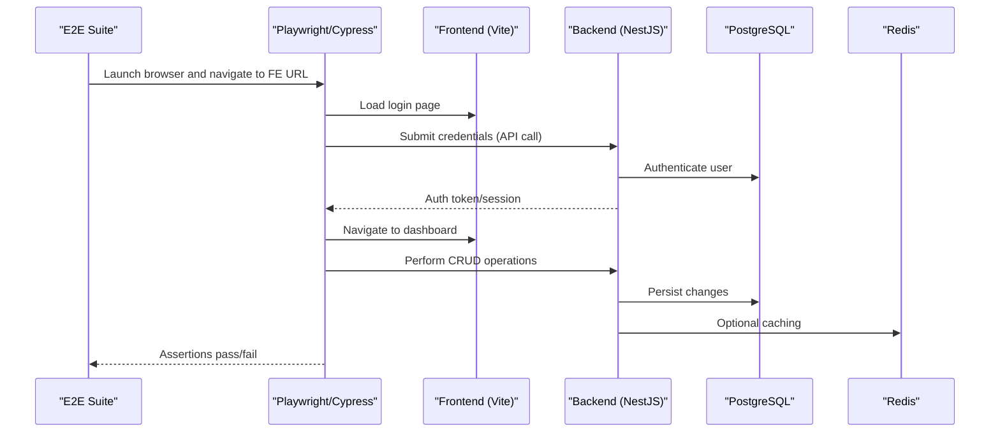
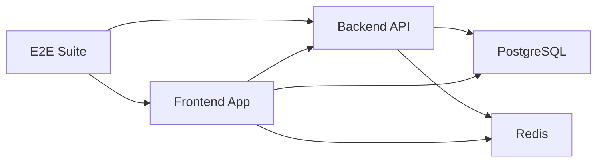
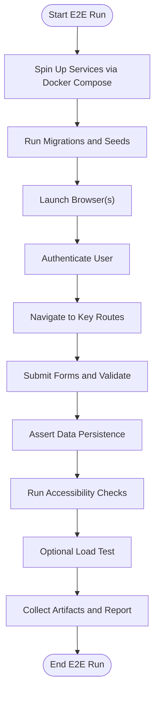

# End-to-End Testing

<cite>
**Referenced Files in This Document**
- [README.md](file://README.md)
- [package.json](file://package.json)
- [frontend/package.json](file://frontend/package.json)
- [backend/package.json](file://backend/package.json)
- [docker-compose.yml](file://docker/docker-compose.yml)
- [docker-compose.local.dev.yml](file://docker/docker-compose.local.dev.yml)
- [docker-compose.local.prod.yml](file://docker/docker-compose.local.prod.yml)
- [docker-compose.cloud.dev.yml](file://docker/docker-compose.cloud.dev.yml)
- [docker-compose.cloud.prod.yml](file://docker/docker-compose.cloud.prod.yml)
- [Dockerfile.frontend](file://docker/Dockerfile.frontend)
- [Dockerfile.backend](file://docker/Dockerfile.backend)
- [nginx.conf](file://docker/nginx.conf)
- [scripts/quick-start-v2.sh](file://scripts/quick-start-v2.sh)
- [scripts/start-dev.sh](file://scripts/start-dev.sh)
- [scripts/stop-dev.sh](file://scripts/stop-dev.sh)
- [scripts/rebuild-docker.sh](file://scripts/rebuild-docker.sh)
- [scripts/verify-setup.sh](file://scripts/verify-setup.sh)
- [scripts/test-rapide-modules.sh](file://scripts/test-rapide-modules.sh)
- [scripts/test-endpoints-utilisateurs.sh](file://scripts/test-endpoints-utilisateurs.sh)
- [scripts/test-inscription-api.sh](file://scripts/test-inscription-api.sh)
- [scripts/test-notification-api.sh](file://scripts/test-notification-providers.sh)
- [scripts/test-salles-api.sh](file://scripts/test-salles-api.sh)
- [scripts/test-types-enum.sh](file://scripts/test-types-enum.sh)
- [scripts/test-persistence-compteur.sh](file://scripts/test-persistence-compteur.sh)
- [scripts/test-blocage-2-minutes.sh](file://scripts/test-blocage-2-minutes.sh)
- [scripts/seed-groupes-etablissements.sh](file://scripts/seed-groupes-etablissements.sh)
- [scripts/run-seeds.sh](file://scripts/run-seeds.sh)
- [backend/src/config/env.config.ts](file://backend/src/config/env.config.ts)
- [backend/src/config/database.config.ts](file://backend/src/config/database.config.ts)
- [backend/src/app.ts](file://backend/src/app.ts)
- [backend/src/index.ts](file://backend/src/index.ts)
- [frontend/vite.config.ts](file://frontend/vite.config.ts)
- [frontend/src/main.tsx](file://frontend/src/main.tsx)
- [frontend/src/App.tsx](file://frontend/src/App.tsx)
- [backend/scripts/load-test-pagination.ts](file://backend/scripts/load-test-pagination.ts)
</cite>

## Table of Contents
1. [Introduction](#introduction)
2. [Project Structure](#project-structure)
3. [Core Components](#core-components)
4. [Architecture Overview](#architecture-overview)
5. [Detailed Component Analysis](#detailed-component-analysis)
6. [Dependency Analysis](#dependency-analysis)
7. [Performance Considerations](#performance-considerations)
8. [Troubleshooting Guide](#troubleshooting-guide)
9. [Conclusion](#conclusion)
10. [Appendices](#appendices)

## Introduction
This document defines the end-to-end (E2E) testing strategy for eLISAschool, focusing on complete user workflow validation across authentication, navigation, form submissions, and data persistence. It covers browser automation setup using Playwright or Cypress, test environment configuration, cross-browser compatibility, mobile-responsive testing, accessibility compliance verification, test data management, performance testing under realistic load conditions, and CI/CD pipeline integration. The guidance is tailored to the existing multi-tenant school management system with Docker-based development and deployment configurations.

## Project Structure
The repository includes a backend (NestJS), frontend (React + Vite), shared libraries, Docker orchestration, scripts for local development and testing, and extensive documentation. E2E testing should target the full stack via the deployed endpoints and UI routes, leveraging Docker Compose for consistent environments.

[No sources needed since this diagram shows conceptual workflow, not actual code structure]

**Section sources**
- [docker-compose.yml](file://docker/docker-compose.yml)
- [docker-compose.local.dev.yml](file://docker/docker-compose.local.dev.yml)
- [docker-compose.local.prod.yml](file://docker/docker-compose.local.prod.yml)
- [docker-compose.cloud.dev.yml](file://docker/docker-compose.cloud.dev.yml)
- [docker-compose.cloud.prod.yml](file://docker/docker-compose.cloud.prod.yml)
- [Dockerfile.frontend](file://docker/Dockerfile.frontend)
- [Dockerfile.backend](file://docker/Dockerfile.backend)
- [nginx.conf](file://docker/nginx.conf)

## Core Components
- Browser Automation Framework: Choose Playwright or Cypress. Both support cross-browser testing, mobile emulation, and headless execution suitable for CI.
- Test Environment: Use Docker Compose to spin up Frontend, Backend, PostgreSQL, and Redis consistently across local and CI.
- API and UI Entrypoints: Backend NestJS app and Frontend React app are orchestrated by Docker and proxied via Nginx in production-like setups.
- Seed Data and Scripts: Existing scripts provide utilities for seeding and quick tests; these can be adapted to prepare E2E test data.

Key responsibilities:
- Setup and teardown of isolated test databases and tenants per suite.
- Authentication flows (login/logout, role-based access).
- Navigation and routing across modules.
- Form submissions and data persistence validations.
- Mobile responsiveness and accessibility checks.
- Performance baselining under realistic load.

**Section sources**
- [backend/src/app.ts](file://backend/src/app.ts)
- [backend/src/index.ts](file://backend/src/index.ts)
- [frontend/src/main.tsx](file://frontend/src/main.tsx)
- [frontend/src/App.tsx](file://frontend/src/App.tsx)
- [docker-compose.yml](file://docker/docker-compose.yml)
- [nginx.conf](file://docker/nginx.conf)

## Architecture Overview
The E2E layer interacts with the running application stack. In development, the frontend proxies API calls to the backend. In CI, services are started via Docker Compose and browsers execute against the composed URLs.

**Diagram sources**
- [docker-compose.yml](file://docker/docker-compose.yml)
- [backend/src/app.ts](file://backend/src/app.ts)
- [backend/src/index.ts](file://backend/src/index.ts)
- [frontend/vite.config.ts](file://frontend/vite.config.ts)

**Section sources**
- [docker-compose.yml](file://docker/docker-compose.yml)
- [backend/src/config/env.config.ts](file://backend/src/config/env.config.ts)
- [backend/src/config/database.config.ts](file://backend/src/config/database.config.ts)
- [frontend/vite.config.ts](file://frontend/vite.config.ts)

## Detailed Component Analysis

### Browser Automation Setup (Playwright or Cypress)
- Installation: Add Playwright or Cypress to the project root or a dedicated tests directory. Install browser binaries in CI.
- Configuration: Configure base URL, viewport sizes, timeouts, and retries. Set environment variables for tenant context and feature flags.
- Cross-Browser: Run suites against Chromium, Firefox, and WebKit.
- Headless Mode: Enable headless execution in CI; allow headed mode locally for debugging.
- Artifacts: Capture screenshots and videos on failure.

Recommendations:
- Use Playwright’s built-in tracing and network interception for robust diagnostics.
- If choosing Cypress, leverage plugins for screenshots/videos and cypress-a11y for accessibility checks.

[No sources needed since this section provides general guidance]

### Test Environment Configuration
- Local Development: Start services using provided scripts and Docker Compose files. Ensure ports and CORS settings align with frontend proxying.
- CI Environment: Spin up services via Docker Compose, run migrations/seeds, then execute E2E suites.
- Environment Variables: Centralize configuration for database, Redis, JWT secrets, and module toggles.

Operational steps:
- Use docker-compose commands to start/stop services.
- Apply migrations and seeds before E2E runs.
- Verify health endpoints and readiness probes.

**Section sources**
- [docker-compose.local.dev.yml](file://docker/docker-compose.local.dev.yml)
- [docker-compose.local.prod.yml](file://docker/docker-compose.local.prod.yml)
- [docker-compose.cloud.dev.yml](file://docker/docker-compose.cloud.dev.yml)
- [docker-compose.cloud.prod.yml](file://docker/docker-compose.cloud.prod.yml)
- [scripts/quick-start-v2.sh](file://scripts/quick-start-v2.sh)
- [scripts/start-dev.sh](file://scripts/start-dev.sh)
- [scripts/stop-dev.sh](file://scripts/stop-dev.sh)
- [scripts/rebuild-docker.sh](file://scripts/rebuild-docker.sh)
- [scripts/verify-setup.sh](file://scripts/verify-setup.sh)
- [backend/src/config/env.config.ts](file://backend/src/config/env.config.ts)
- [backend/src/config/database.config.ts](file://backend/src/config/database.config.ts)

### Cross-Browser Compatibility Testing
- Matrix: Chromium, Firefox, WebKit.
- Viewports: Desktop breakpoints and common mobile devices.
- Timezones/Locales: Simulate regional settings if required by features.
- Feature Flags: Toggle optional modules per browser if necessary.

[No sources needed since this section provides general guidance]

### Complete User Journeys
Authentication:
- Login with valid credentials, verify token/session handling, and redirect to dashboard.
- Logout and ensure session invalidation.
- Role-based access: Validate permissions for different roles.

Navigation:
- Traverse key routes (dashboard, academic structure, personnel, finances).
- Verify breadcrumbs, active states, and deep links.

Form Submissions:
- Create/edit entities (e.g., student, staff, class).
- Validate client-side and server-side errors.
- Confirm success messages and redirects.

Data Persistence:
- Assert records exist post-submission via UI and API.
- Validate related entities and cascading updates.

Mobile-Responsive Testing:
- Emulate mobile viewports and touch interactions.
- Check layout and usability on small screens.

Accessibility Compliance:
- Automated checks for ARIA attributes, contrast, keyboard navigation.
- Manual spot-checks for complex modals and forms.

[No sources needed since this section provides general guidance]

### Test Data Management
- Isolation: Create separate test databases or tenants per suite to avoid interference.
- Seeding: Use existing seed scripts to populate baseline data (roles, permissions, institutions).
- Dynamic Creation: Programmatically create users and institutions within tests when needed.
- Cleanup: Teardown routines to drop test data and reset state.

Existing utilities:
- Seed scripts for groups and institutions.
- Quick-start and setup verification scripts.

**Section sources**
- [scripts/seed-groupes-etablissements.sh](file://scripts/seed-groupes-etablissements.sh)
- [scripts/run-seeds.sh](file://scripts/run-seeds.sh)
- [scripts/verify-setup.sh](file://scripts/verify-setup.sh)

### Performance Testing Under Realistic Load
- Baseline Metrics: Measure response times and throughput for critical paths (auth, list views, form submissions).
- Load Simulation: Use existing load-testing script as a reference to simulate pagination-heavy scenarios.
- Concurrency: Increase concurrent users gradually to identify bottlenecks.
- Observability: Collect logs, metrics, and traces from backend and database.

Reference implementation:
- Pagination load test script demonstrates how to drive repeated requests and measure performance.

**Section sources**
- [backend/scripts/load-test-pagination.ts](file://backend/scripts/load-test-pagination.ts)

### CI/CD Pipeline Integration
- Stages: Build, migrate/seed, start services, run E2E suites, collect artifacts, report results.
- Parallelization: Split suites by feature area and run in parallel across matrix jobs.
- Artifacts: Store screenshots, videos, and logs for failed runs.
- Rollback Strategy: Keep previous stable images and revert on failures.

[No sources needed since this section provides general guidance]

## Dependency Analysis
The E2E layer depends on:
- Frontend build and runtime (Vite dev server or production bundle).
- Backend APIs (NestJS controllers/services).
- Database (PostgreSQL) and cache (Redis).
- Docker Compose orchestration and Nginx proxy in production-like setups.

[No sources needed since this diagram shows conceptual relationships, not direct code mapping]

**Section sources**
- [docker-compose.yml](file://docker/docker-compose.yml)
- [nginx.conf](file://docker/nginx.conf)
- [backend/src/app.ts](file://backend/src/app.ts)
- [frontend/vite.config.ts](file://frontend/vite.config.ts)

## Performance Considerations
- Prefer headless execution in CI to reduce resource usage.
- Reuse browser contexts where possible to speed up suites.
- Avoid flaky waits; use explicit assertions and auto-waiting features.
- Monitor backend CPU/memory and DB query performance during E2E runs.
- Use connection pooling and appropriate timeouts to prevent bottlenecks.

[No sources needed since this section provides general guidance]

## Troubleshooting Guide
Common issues and resolutions:
- Service Unavailable: Verify Docker Compose status and port bindings.
- CORS Errors: Ensure frontend proxy configuration matches backend origins.
- Auth Failures: Check JWT secrets and environment variables.
- Database Connectivity: Validate credentials and migration status.
- Flaky Tests: Increase timeouts selectively, add retries, and capture artifacts.

Useful scripts:
- Start/stop development services.
- Rebuild Docker images.
- Verify setup and connectivity.
- Quick smoke tests for specific modules.

**Section sources**
- [scripts/start-dev.sh](file://scripts/start-dev.sh)
- [scripts/stop-dev.sh](file://scripts/stop-dev.sh)
- [scripts/rebuild-docker.sh](file://scripts/rebuild-docker.sh)
- [scripts/verify-setup.sh](file://scripts/verify-setup.sh)
- [scripts/test-rapide-modules.sh](file://scripts/test-rapide-modules.sh)
- [scripts/test-endpoints-utilisateurs.sh](file://scripts/test-endpoints-utilisateurs.sh)
- [scripts/test-inscription-api.sh](file://scripts/test-inscription-api.sh)
- [scripts/test-notification-api.sh](file://scripts/test-notification-providers.sh)
- [scripts/test-salles-api.sh](file://scripts/test-salles-api.sh)
- [scripts/test-types-enum.sh](file://scripts/test-types-enum.sh)
- [scripts/test-persistence-compteur.sh](file://scripts/test-persistence-compteur.sh)
- [scripts/test-blocage-2-minutes.sh](file://scripts/test-blocage-2-minutes.sh)

## Conclusion
Adopting a structured E2E testing approach with Playwright or Cypress ensures reliable validation of eLISAschool’s core workflows across browsers and devices. By leveraging Docker Compose for consistent environments, existing seed and utility scripts for data preparation, and performance baselines from load-testing references, teams can maintain high confidence in releases. Integrating E2E into CI/CD with parallelization and artifact collection further strengthens quality gates and accelerates feedback loops.

## Appendices

### Appendix A: Example E2E Workflow Sequence

[No sources needed since this diagram shows conceptual workflow, not actual code structure]

### Appendix B: Environment Variables Checklist
- Database host, port, name, user, password.
- Redis host and port.
- JWT secret and token expiration.
- Frontend base URL and API proxy settings.
- Feature flags for modules.

[No sources needed since this section provides general guidance]