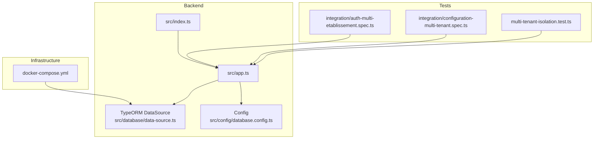
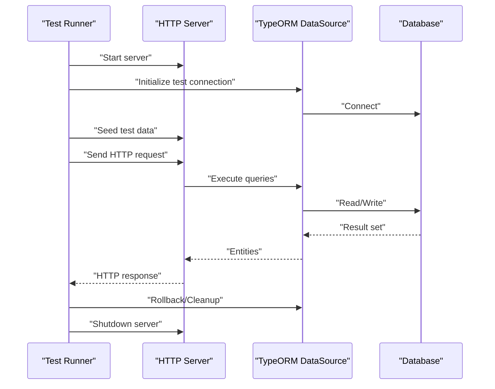
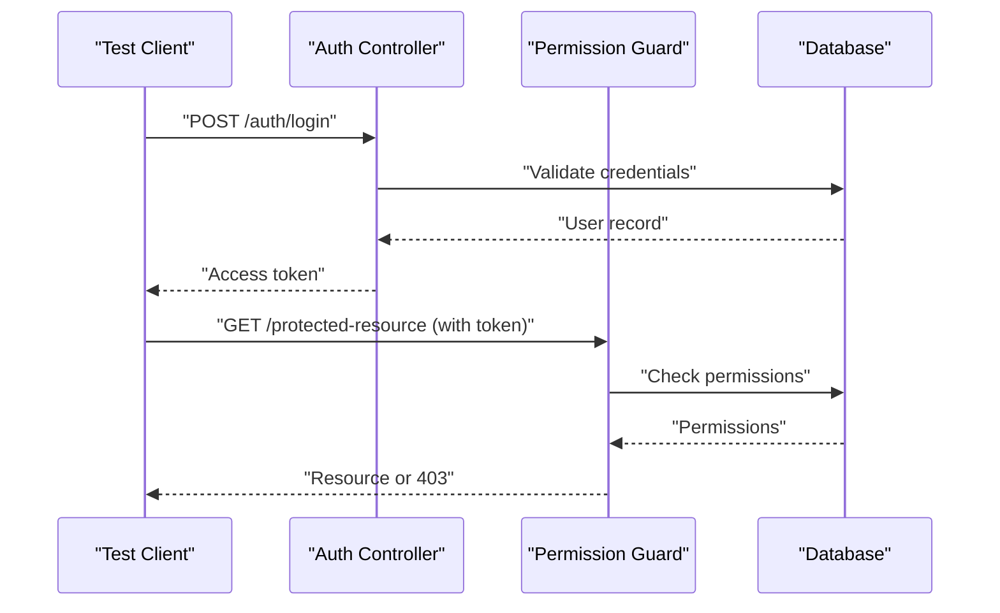
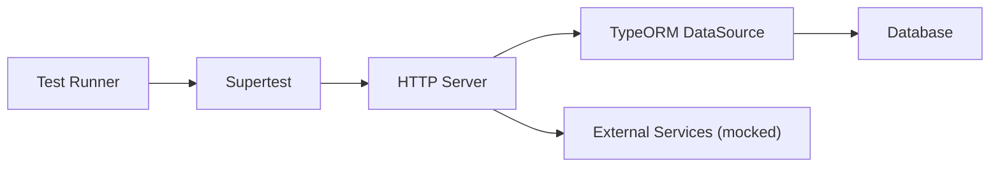

# Integration Testing

<cite>
**Referenced Files in This Document**
- [backend/test/integration/auth-multi-etablissement.spec.ts](file://backend/test/integration/auth-multi-etablissement.spec.ts)
- [backend/test/integration/configuration-multi-tenant.spec.ts](file://backend/test/integration/configuration-multi-tenant.spec.ts)
- [backend/test/multi-tenant-isolation.test.ts](file://backend/test/multi-tenant-isolation.test.ts)
- [backend/src/config/database.config.ts](file://backend/src/config/database.config.ts)
- [backend/src/database/data-source.ts](file://backend/src/database/data-source.ts)
- [backend/src/app.ts](file://backend/src/app.ts)
- [backend/src/index.ts](file://backend/src/index.ts)
- [backend/package.json](file://backend/package.json)
- [docker-compose.yml](file://docker-compose.yml)
</cite>

## Table of Contents
1. [Introduction](#introduction)
2. [Project Structure](#project-structure)
3. [Core Components](#core-components)
4. [Architecture Overview](#architecture-overview)
5. [Detailed Component Analysis](#detailed-component-analysis)
6. [Dependency Analysis](#dependency-analysis)
7. [Performance Considerations](#performance-considerations)
8. [Troubleshooting Guide](#troubleshooting-guide)
9. [Conclusion](#conclusion)
10. [Appendices](#appendices)

## Introduction
This document provides a comprehensive integration testing guide for eLISAschool, focusing on:
- REST API testing with Supertest
- Database integration testing with TypeORM (transactions and test data setup)
- External service integration testing with mocking strategies (email providers, payment gateways, cloud storage)
- Multi-tenant testing scenarios and cross-tenant isolation validation
- Authentication flows, authorization guards, and permission-based access control
- WebSocket connection testing for real-time features
- Complex business workflows spanning multiple modules
- Test database setup, seeding strategies, and cleanup procedures

The guidance is grounded in the existing backend structure and tests present in the repository.

## Project Structure
Integration tests are organized under the backend directory, with dedicated folders for integration and unit tests. The application bootstraps via an Express/Nest-like entry point and uses TypeORM for persistence. Docker Compose provisions external services such as databases.

**Diagram sources**
- [backend/src/index.ts](file://backend/src/index.ts)
- [backend/src/app.ts](file://backend/src/app.ts)
- [backend/src/database/data-source.ts](file://backend/src/database/data-source.ts)
- [backend/src/config/database.config.ts](file://backend/src/config/database.config.ts)
- [backend/test/integration/auth-multi-etablissement.spec.ts](file://backend/test/integration/auth-multi-etablissement.spec.ts)
- [backend/test/integration/configuration-multi-tenant.spec.ts](file://backend/test/integration/configuration-multi-tenant.spec.ts)
- [backend/test/multi-tenant-isolation.test.ts](file://backend/test/multi-tenant-isolation.test.ts)
- [docker-compose.yml](file://docker-compose.yml)

**Section sources**
- [backend/test/integration/auth-multi-etablissement.spec.ts](file://backend/test/integration/auth-multi-etablissement.spec.ts)
- [backend/test/integration/configuration-multi-tenant.spec.ts](file://backend/test/integration/configuration-multi-tenant.spec.ts)
- [backend/test/multi-tenant-isolation.test.ts](file://backend/test/multi-tenant-isolation.test.ts)
- [backend/src/config/database.config.ts](file://backend/src/config/database.config.ts)
- [backend/src/database/data-source.ts](file://backend/src/database/data-source.ts)
- [backend/src/app.ts](file://backend/src/app.ts)
- [backend/src/index.ts](file://backend/src/index.ts)
- [docker-compose.yml](file://docker-compose.yml)

## Core Components
- Application bootstrap and HTTP server initialization
- TypeORM configuration and data source setup
- Existing integration tests for multi-tenant authentication and configuration
- Package scripts and dependencies for running tests

Key responsibilities:
- Start the server within test suites to exercise full request/response cycles
- Configure a test database instance isolated from development/production
- Seed deterministic test data per scenario
- Assert API responses, status codes, and side effects

**Section sources**
- [backend/src/app.ts](file://backend/src/app.ts)
- [backend/src/index.ts](file://backend/src/index.ts)
- [backend/src/config/database.config.ts](file://backend/src/config/database.config.ts)
- [backend/src/database/data-source.ts](file://backend/src/database/data-source.ts)
- [backend/package.json](file://backend/package.json)

## Architecture Overview
Integration tests interact with the live HTTP server and the actual database configured by TypeORM. The flow typically involves:
- Starting the app in a test process
- Creating or resetting the test database schema
- Seeding tenant-specific data
- Executing requests against endpoints
- Validating responses and database state
- Rolling back or cleaning up after each test

[No sources needed since this diagram shows conceptual workflow, not actual code structure]

## Detailed Component Analysis

### REST API Testing with Supertest
- Use Supertest to send HTTP requests to the running server within integration tests.
- Validate status codes, headers, and JSON bodies for success and error paths.
- Chain dependent requests (e.g., login then resource access).
- Isolate tests using transactions or per-test seeds to avoid shared state.

Recommended patterns:
- Create a helper to start the server once per suite and stop it afterward.
- Wrap each test in a transaction that rolls back at the end.
- Use unique identifiers (timestamps or UUIDs) to prevent collisions.

**Section sources**
- [backend/test/integration/auth-multi-etablissement.spec.ts](file://backend/test/integration/auth-multi-etablissement.spec.ts)
- [backend/test/integration/configuration-multi-tenant.spec.ts](file://backend/test/integration/configuration-multi-tenant.spec.ts)

### Database Integration Testing with TypeORM
- Initialize a separate test database connection using TypeORM’s DataSource.
- Apply migrations or synchronize schema before tests run.
- Use transactions around each test to ensure rollback and isolation.
- Seed minimal required data for each scenario.

Best practices:
- Prefer explicit migration execution over schema sync in CI.
- Keep seeders small and idempotent.
- Reset sequences and indexes if necessary after bulk inserts.

**Section sources**
- [backend/src/config/database.config.ts](file://backend/src/config/database.config.ts)
- [backend/src/database/data-source.ts](file://backend/src/database/data-source.ts)

### External Service Integration Testing (Mocking Strategies)
For email providers, payment gateways, and cloud storage:
- Replace real clients with test doubles (spies/stubs) during tests.
- For HTTP-based services, intercept outbound calls or use a local mock server.
- Verify that integrations call expected endpoints with correct payloads.
- Simulate success and failure scenarios deterministically.

Guidance:
- Inject mocks through dependency injection where possible.
- Avoid network calls in tests; assert behavior without side effects.
- Record and replay responses only when necessary and safe.

[No sources needed since this section provides general guidance]

### Multi-Tenant Testing Scenarios and Cross-Tenant Isolation
- Create multiple tenants with distinct identifiers.
- Seed tenant-scoped data and verify that operations do not leak across tenants.
- Assert that filters and middleware enforce tenant context correctly.
- Run concurrent tests per tenant to detect race conditions.

Validation checklist:
- Queries include tenant scoping clauses.
- Responses never expose resources belonging to other tenants.
- Configuration endpoints respect tenant boundaries.

**Section sources**
- [backend/test/integration/auth-multi-etablissement.spec.ts](file://backend/test/integration/auth-multi-etablissement.spec.ts)
- [backend/test/integration/configuration-multi-tenant.spec.ts](file://backend/test/integration/configuration-multi-tenant.spec.ts)
- [backend/test/multi-tenant-isolation.test.ts](file://backend/test/multi-tenant-isolation.test.ts)

### Authentication Flows, Authorization Guards, and Permission-Based Access Control
- Test login and token issuance, including invalid credentials and lockout policies.
- Verify protected routes return unauthorized/unauthorized errors for missing or invalid tokens.
- Exercise role/permission checks by creating users with different roles and asserting access.
- Ensure token refresh and logout behaviors are covered.

Sequence example:

**Diagram sources**
- [backend/test/integration/auth-multi-etablissement.spec.ts](file://backend/test/integration/auth-multi-etablissement.spec.ts)

**Section sources**
- [backend/test/integration/auth-multi-etablissement.spec.ts](file://backend/test/integration/auth-multi-etablissement.spec.ts)

### WebSocket Connections for Real-Time Features
- Establish WebSocket connections in tests and simulate client events.
- Assert server broadcasts and message routing.
- Validate reconnection and error handling paths.
- Ensure messages are scoped to tenants and authenticated contexts.

[No sources needed since this section provides general guidance]

### Complex Business Workflows Spanning Multiple Modules
- Design end-to-end scenarios that touch several modules (e.g., enrollment, finance, scheduling).
- Prepare prerequisite data across modules before invoking the main workflow.
- Assert intermediate and final states consistently.
- Use transactions to keep tests fast and isolated.

[No sources needed since this section provides general guidance]

### Test Database Setup, Seeding Strategies, and Cleanup Procedures
- Provision a dedicated test database via environment variables or Docker Compose.
- Run migrations before tests; optionally reset between suites.
- Seed only what is necessary for each test case.
- Roll back transactions or truncate tables after each test to maintain isolation.

**Section sources**
- [backend/src/config/database.config.ts](file://backend/src/config/database.config.ts)
- [backend/src/database/data-source.ts](file://backend/src/database/data-source.ts)
- [docker-compose.yml](file://docker-compose.yml)

## Dependency Analysis
Integration tests depend on:
- The running HTTP server
- TypeORM DataSource and configured database
- External services (mocked or stubbed)
- Test runner and assertion libraries

[No sources needed since this diagram shows conceptual relationships, not specific file mappings]

**Section sources**
- [backend/package.json](file://backend/package.json)
- [backend/src/app.ts](file://backend/src/app.ts)
- [backend/src/database/data-source.ts](file://backend/src/database/data-source.ts)

## Performance Considerations
- Reuse the server instance across tests in a single suite to reduce startup overhead.
- Use transactions to avoid expensive rollbacks and schema resets.
- Limit seed data to the minimum required for assertions.
- Parallelize independent tests carefully to avoid contention on shared resources.
- Profile slow endpoints and optimize queries used in tests.

[No sources needed since this section provides general guidance]

## Troubleshooting Guide
Common issues and resolutions:
- Connection failures: Verify database credentials and Docker Compose services are up.
- Schema mismatch: Ensure migrations are applied before tests.
- Flaky tests: Add retries for transient network errors and stabilize random IDs.
- Timeouts: Increase timeouts for heavy operations or parallelized suites.
- Tenant leakage: Confirm tenant scoping in all queries and controllers.

**Section sources**
- [backend/src/config/database.config.ts](file://backend/src/config/database.config.ts)
- [backend/src/database/data-source.ts](file://backend/src/database/data-source.ts)
- [docker-compose.yml](file://docker-compose.yml)

## Conclusion
By combining Supertest-driven HTTP assertions, TypeORM-backed database interactions, robust mocking for external services, and strict multi-tenant isolation, eLISAschool can achieve reliable integration tests that validate both functional correctness and security constraints. Adopting the patterns outlined here will improve confidence in deployments and accelerate feature delivery.

[No sources needed since this section summarizes without analyzing specific files]

## Appendices

### Appendix A: Running Tests
- Ensure the test database is provisioned and accessible.
- Execute the test command defined in package scripts.
- Review logs for failed assertions and database errors.

**Section sources**
- [backend/package.json](file://backend/package.json)

### Appendix B: Environment Variables for Test Database
- Configure host, port, user, password, and database name for the test instance.
- Point TypeORM to the test DataSource configuration.

**Section sources**
- [backend/src/config/database.config.ts](file://backend/src/config/database.config.ts)
- [backend/src/database/data-source.ts](file://backend/src/database/data-source.ts)