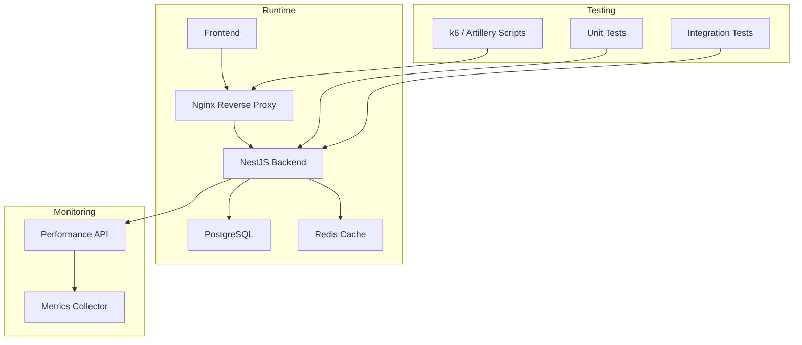
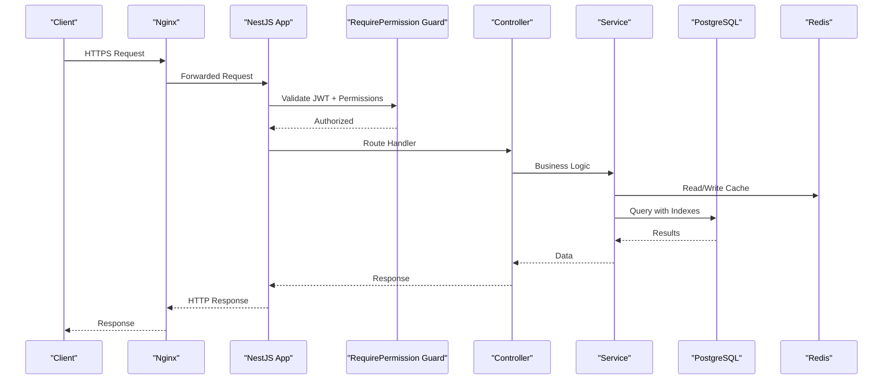
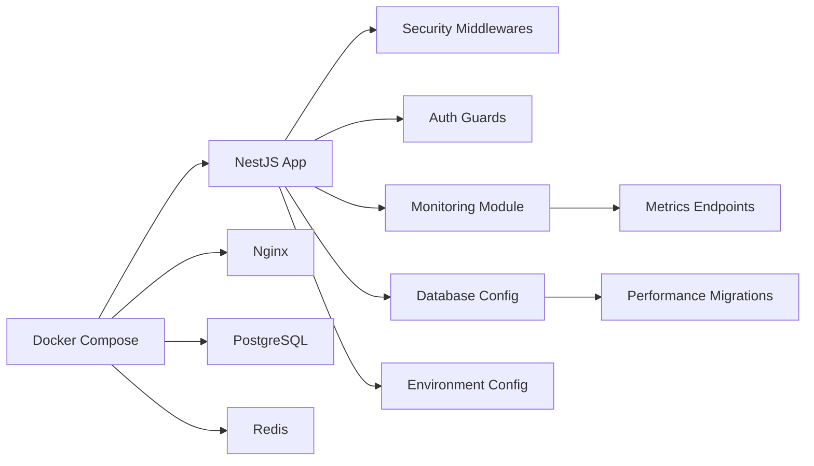

# Performance & Security Testing

<cite>
**Referenced Files in This Document**
- [backend/package.json](file://backend/package.json)
- [backend/src/app.ts](file://backend/src/app.ts)
- [backend/src/index.ts](file://backend/src/index.ts)
- [backend/src/config/database.config.ts](file://backend/src/config/database.config.ts)
- [backend/src/config/env.config.ts](file://backend/src/config/env.config.ts)
- [backend/src/modules/auth/strategies/jwt.strategy.ts](file://backend/src/modules/auth/strategies/jwt.strategy.ts)
- [backend/src/modules/auth/guards/require-permission.guard.ts](file://backend/src/modules/auth/guards/require-permission.guard.ts)
- [backend/src/common/middlewares/rate-limit.middleware.ts](file://backend/src/common/middlewares/rate-limit.middleware.ts)
- [backend/src/common/middlewares/cors.middleware.ts](file://backend/src/common/middlewares/cors.middleware.ts)
- [backend/src/common/middlewares/helmet.middleware.ts](file://backend/src/common/middlewares/helmet.middleware.ts)
- [backend/src/common/middlewares/input-sanitizer.middleware.ts](file://backend/src/common/middlewares/input-sanitizer.middleware.ts)
- [backend/src/modules/monitoring/services/performance.service.ts](file://backend/src/modules/monitoring/services/performance.service.ts)
- [backend/src/modules/monitoring/controllers/performance.controller.ts](file://backend/src/modules/monitoring/controllers/performance.controller.ts)
- [backend/scripts/load-test-pagination.ts](file://backend/scripts/load-test-pagination.ts)
- [backend/test/integration/auth-multi-etablissement.spec.ts](file://backend/test/integration/auth-multi-etablissement.spec.ts)
- [backend/test/integration/configuration-multi-tenant.spec.ts](file://backend/test/integration/configuration-multi-tenant.spec.ts)
- [backend/test/unit/redis.service.spec.ts](file://backend/test/unit/redis.service.spec.ts)
- [backend/test/multi-tenant-isolation.test.ts](file://backend/test/multi-tenant-isolation.test.ts)
- [docker/docker-compose.yml](file://docker/docker-compose.yml)
- [docker/nginx.conf](file://docker/nginx.conf)
- [scripts/GUIDE-TEST-RAPIDE.md](file://scripts/GUIDE-TEST-RAPIDE.md)
- [docs/guides/GUIDE-TEST-SECURITE.md](file://docs/guides/GUIDE-TEST-SECURITE.md)
- [docs/guides/GUIDE-MONITORING-PERFORMANCE-RBAC.md](file://docs/guides/GUIDE-MONITORING-PERFORMANCE-RBAC.md)
- [backend/database/migrations/009-performance-indexes.sql](file://backend/database/migrations/009-performance-indexes.sql)
- [backend/database/migrations/042-annonces-performance-optimization.sql](file://backend/database/migrations/042-annonces-performance-optimization.sql)
- [backend/database/migrations/046-organisation-performance-avancee.sql](file://backend/database/migrations/046-organisation-performance-avancee.sql)
- [backend/database/migrations/047-optimisations-performance-v3.1.sql](file://backend/database/migrations/047-optimisations-performance-v3.1.sql)
- [backend/database/migrations/048-notifications-performance-optimizations.sql](file://backend/database/migrations/048-notifications-performance-optimizations.sql)
- [backend/database/migrations/099-add-monitoring-params.sql](file://backend/database/migrations/099-add-monitoring-params.sql)
</cite>

## Table of Contents
1. [Introduction](#introduction)
2. [Project Structure](#project-structure)
3. [Core Components](#core-components)
4. [Architecture Overview](#architecture-overview)
5. [Detailed Component Analysis](#detailed-component-analysis)
6. [Dependency Analysis](#dependency-analysis)
7. [Performance Considerations](#performance-considerations)
8. [Troubleshooting Guide](#troubleshooting-guide)
9. [Conclusion](#conclusion)
10. [Appendices](#appendices)

## Introduction
This document provides comprehensive guidance for performance and security testing of eLISAschool, focusing on load testing strategies (k6/Artillery), profiling techniques (queries, caching, memory), security testing (penetration testing, vulnerability scanning, OWASP compliance), authentication bypass prevention, SQL injection protection, XSS mitigation, stress testing for multi-tenant scenarios, monitoring and metrics collection during tests, and automated performance regression testing in CI/CD with baselines.

## Project Structure
The backend is a NestJS application with modular architecture, middleware-based security controls, and a monitoring module exposing performance endpoints. Database migrations include performance indexes and optimizations. Docker Compose defines the runtime stack including Nginx as reverse proxy. Test suites cover integration and unit cases relevant to multi-tenant isolation and Redis usage.

[No sources needed since this diagram shows conceptual workflow, not actual code structure]

**Section sources**
- [backend/src/app.ts](file://backend/src/app.ts)
- [backend/src/index.ts](file://backend/src/index.ts)
- [docker/docker-compose.yml](file://docker/docker-compose.yml)
- [docker/nginx.conf](file://docker/nginx.conf)

## Core Components
- Application bootstrap and global middleware registration: app initialization, CORS, helmet, rate limiting, input sanitization, and route setup.
- Authentication and authorization: JWT strategy and permission guards enforce access control across modules.
- Monitoring: dedicated service and controller expose performance metrics and health information.
- Database configuration and environment variables: connection settings and feature toggles.
- Existing scripts and tests: pagination load test script, integration and unit tests for auth and multi-tenant behavior.

Key responsibilities:
- Secure request handling via middlewares and guards.
- Expose metrics endpoints for observability.
- Provide baseline scripts and tests to validate critical flows under load.

**Section sources**
- [backend/src/app.ts](file://backend/src/app.ts)
- [backend/src/index.ts](file://backend/src/index.ts)
- [backend/src/config/database.config.ts](file://backend/src/config/database.config.ts)
- [backend/src/config/env.config.ts](file://backend/src/config/env.config.ts)
- [backend/src/modules/auth/strategies/jwt.strategy.ts](file://backend/src/modules/auth/strategies/jwt.strategy.ts)
- [backend/src/modules/auth/guards/require-permission.guard.ts](file://backend/src/modules/auth/guards/require-permission.guard.ts)
- [backend/src/modules/monitoring/services/performance.service.ts](file://backend/src/modules/monitoring/services/performance.service.ts)
- [backend/src/modules/monitoring/controllers/performance.controller.ts](file://backend/src/modules/monitoring/controllers/performance.controller.ts)
- [backend/scripts/load-test-pagination.ts](file://backend/scripts/load-test-pagination.ts)
- [backend/test/integration/auth-multi-etablissement.spec.ts](file://backend/test/integration/auth-multi-etablissement.spec.ts)
- [backend/test/integration/configuration-multi-tenant.spec.ts](file://backend/test/integration/configuration-multi-tenant.spec.ts)
- [backend/test/unit/redis.service.spec.ts](file://backend/test/unit/redis.service.spec.ts)
- [backend/test/multi-tenant-isolation.test.ts](file://backend/test/multi-tenant-isolation.test.ts)

## Architecture Overview
The system uses a layered approach:
- Nginx terminates TLS and proxies requests to the backend.
- NestJS applies global middlewares for security and rate limiting before routing to controllers.
- Controllers delegate to services; database queries leverage optimized indexes and prepared statements.
- A monitoring module exposes metrics endpoints consumed by external collectors or dashboards.

**Diagram sources**
- [backend/src/app.ts](file://backend/src/app.ts)
- [backend/src/modules/auth/guards/require-permission.guard.ts](file://backend/src/modules/auth/guards/require-permission.guard.ts)
- [backend/src/modules/monitoring/controllers/performance.controller.ts](file://backend/src/modules/monitoring/controllers/performance.controller.ts)
- [backend/src/config/database.config.ts](file://backend/src/config/database.config.ts)
- [docker/nginx.conf](file://docker/nginx.conf)

## Detailed Component Analysis

### Load Testing Strategy (k6 and Artillery)
Objectives:
- Measure throughput, latency, error rates for key API endpoints.
- Validate database query performance under realistic loads.
- Verify cache hit ratios and eviction behavior.
- Stress multi-tenant isolation under concurrent users.

Recommended approach:
- Use k6 for HTTP API load tests targeting authenticated endpoints and pagination-heavy flows.
- Use Artillery for distributed load generation and scenario orchestration.
- Combine with existing pagination load script to exercise high-cardinality queries.

Key steps:
- Define scenarios: login, read-only dashboard, write operations, batch updates.
- Parameterize tenant IDs and user roles to simulate multi-tenant traffic.
- Collect metrics from monitoring endpoints and export to Prometheus/Grafana.
- Establish SLOs: p95/p99 latency thresholds, error budgets, CPU/memory limits.

Existing assets:
- Pagination load test script for targeted stress of list endpoints.
- Integration tests validating multi-tenant auth and configuration behaviors.

**Section sources**
- [backend/scripts/load-test-pagination.ts](file://backend/scripts/load-test-pagination.ts)
- [backend/test/integration/auth-multi-etablissement.spec.ts](file://backend/test/integration/auth-multi-etablissement.spec.ts)
- [backend/test/integration/configuration-multi-tenant.spec.ts](file://backend/test/integration/configuration-multi-tenant.spec.ts)
- [backend/src/modules/monitoring/controllers/performance.controller.ts](file://backend/src/modules/monitoring/controllers/performance.controller.ts)

### Performance Profiling Techniques
Focus areas:
- Database queries: analyze slow queries, missing indexes, N+1 patterns.
- Caching: verify TTLs, cache invalidation, and hit/miss ratios.
- Memory usage: detect leaks, excessive allocations, and GC pressure.

Practical methods:
- Enable PostgreSQL query logging and EXPLAIN ANALYZE for hot paths.
- Use Node.js profilers (CPU/memory) and heap snapshots to identify bottlenecks.
- Monitor Redis stats for eviction policies and memory fragmentation.
- Correlate backend metrics with database and cache telemetry.

Database optimization references:
- Migrations include performance indexes and optimizations across modules.

**Section sources**
- [backend/database/migrations/009-performance-indexes.sql](file://backend/database/migrations/009-performance-indexes.sql)
- [backend/database/migrations/042-annonces-performance-optimization.sql](file://backend/database/migrations/042-annonces-performance-optimization.sql)
- [backend/database/migrations/046-organisation-performance-avancee.sql](file://backend/database/migrations/046-organisation-performance-avancee.sql)
- [backend/database/migrations/047-optimisations-performance-v3.1.sql](file://backend/database/migrations/047-optimisations-performance-v3.1.sql)
- [backend/database/migrations/048-notifications-performance-optimizations.sql](file://backend/database/migrations/048-notifications-performance-optimizations.sql)
- [backend/src/config/database.config.ts](file://backend/src/config/database.config.ts)

### Security Testing Approaches
Scope:
- Penetration testing: authenticate-as-user, escalate privileges, lateral movement within tenants.
- Vulnerability scanning: static analysis (SAST), dependency scanning (SCA), container image scanning.
- OWASP Top 10 validation: injection, broken access control, sensitive data exposure, etc.

Specific checks:
- Authentication bypass attempts: token forgery, expired tokens, role switching across tenants.
- SQL injection prevention: parameterized queries, ORM usage, input validation.
- XSS protection: output encoding, CSP headers, sanitized inputs.

Security controls in place:
- Helmet middleware for secure headers.
- Rate limiting to mitigate brute-force and DoS.
- CORS policy enforcement.
- Input sanitizer middleware to reduce injection risks.
- JWT strategy and permission guards for authorization.

**Section sources**
- [backend/src/common/middlewares/helmet.middleware.ts](file://backend/src/common/middlewares/helmet.middleware.ts)
- [backend/src/common/middlewares/rate-limit.middleware.ts](file://backend/src/common/middlewares/rate-limit.middleware.ts)
- [backend/src/common/middlewares/cors.middleware.ts](file://backend/src/common/middlewares/cors.middleware.ts)
- [backend/src/common/middlewares/input-sanitizer.middleware.ts](file://backend/src/common/middlewares/input-sanitizer.middleware.ts)
- [backend/src/modules/auth/strategies/jwt.strategy.ts](file://backend/src/modules/auth/strategies/jwt.strategy.ts)
- [backend/src/modules/auth/guards/require-permission.guard.ts](file://backend/src/modules/auth/guards/require-permission.guard.ts)
- [docs/guides/GUIDE-TEST-SECURITE.md](file://docs/guides/GUIDE-TEST-SECURITE.md)

### Stress Testing for Multi-Tenant Scenarios
Goals:
- Ensure strict tenant isolation under concurrent loads.
- Validate RBAC permissions do not leak across tenants.
- Measure scaling characteristics of database connections and cache layers.

Approach:
- Generate traffic per tenant with distinct credentials and scopes.
- Simulate peak enrollment periods and batch operations.
- Observe resource contention and lock waits in the database.

Relevant tests:
- Multi-tenant isolation tests and configuration-driven tenant behavior.

**Section sources**
- [backend/test/multi-tenant-isolation.test.ts](file://backend/test/multi-tenant-isolation.test.ts)
- [backend/test/integration/auth-multi-etablissement.spec.ts](file://backend/test/integration/auth-multi-etablissement.spec.ts)
- [backend/test/integration/configuration-multi-tenant.spec.ts](file://backend/test/integration/configuration-multi-tenant.spec.ts)

### Monitoring and Metrics Collection During Performance Tests
What to collect:
- API latency percentiles, throughput, error rates.
- Database query durations, index usage, lock waits.
- Cache hit/miss ratios, memory usage, eviction events.
- Node.js process metrics: CPU, heap, event loop lag.

Implementation:
- Use the monitoring service and controller to expose metrics endpoints.
- Export to time-series databases and visualize in dashboards.
- Integrate with alerting rules tied to SLOs.

**Section sources**
- [backend/src/modules/monitoring/services/performance.service.ts](file://backend/src/modules/monitoring/services/performance.service.ts)
- [backend/src/modules/monitoring/controllers/performance.controller.ts](file://backend/src/modules/monitoring/controllers/performance.controller.ts)
- [docs/guides/GUIDE-MONITORING-PERFORMANCE-RBAC.md](file://docs/guides/GUIDE-MONITORING-PERFORMANCE-RBAC.md)

### Automated Performance Regression Testing in CI/CD
Pipeline stages:
- Build and start services using Docker Compose.
- Run unit and integration tests.
- Execute load tests against staging-like environments.
- Compare results against baselines and fail if regressions exceed thresholds.

Baselines:
- Store historical metrics (latency percentiles, throughput).
- Define acceptable variance windows per endpoint.
- Archive reports and artifacts for traceability.

Operational notes:
- Use separate environments for performance runs to avoid interference.
- Seed deterministic datasets for repeatable results.

**Section sources**
- [docker/docker-compose.yml](file://docker/docker-compose.yml)
- [backend/package.json](file://backend/package.json)
- [scripts/GUIDE-TEST-RAPIDE.md](file://scripts/GUIDE-TEST-RAPIDE.md)

## Dependency Analysis
High-level dependencies relevant to performance and security:
- NestJS application depends on security middlewares and guards.
- Monitoring module exposes metrics used by external collectors.
- Database configuration ties into migration-defined indexes and optimizations.
- Docker Compose orchestrates Nginx, backend, database, and cache.

**Diagram sources**
- [backend/src/app.ts](file://backend/src/app.ts)
- [backend/src/config/database.config.ts](file://backend/src/config/database.config.ts)
- [backend/src/config/env.config.ts](file://backend/src/config/env.config.ts)
- [backend/src/modules/monitoring/controllers/performance.controller.ts](file://backend/src/modules/monitoring/controllers/performance.controller.ts)
- [docker/docker-compose.yml](file://docker/docker-compose.yml)

**Section sources**
- [backend/src/app.ts](file://backend/src/app.ts)
- [backend/src/config/database.config.ts](file://backend/src/config/database.config.ts)
- [backend/src/config/env.config.ts](file://backend/src/config/env.config.ts)
- [backend/src/modules/monitoring/controllers/performance.controller.ts](file://backend/src/modules/monitoring/controllers/performance.controller.ts)
- [docker/docker-compose.yml](file://docker/docker-compose.yml)

## Performance Considerations
- Prefer indexed queries and avoid full table scans; leverage provided performance migrations.
- Implement efficient pagination and server-side filtering to reduce payload sizes.
- Tune connection pools for database and Redis based on expected concurrency.
- Use caching strategically for read-heavy endpoints; ensure proper invalidation.
- Profile memory periodically to detect leaks and optimize object lifecycles.
- Set up alerting on latency percentiles and error rates to catch regressions early.

[No sources needed since this section provides general guidance]

## Troubleshooting Guide
Common issues and resolutions:
- High latency spikes: check database locks and slow queries; review index usage and query plans.
- Cache misses: validate TTLs and keys; inspect Redis memory and eviction policies.
- Auth failures under load: confirm token signing consistency and guard logic; verify rate limit thresholds.
- Tenant leakage: audit permission checks and tenant scoping in queries.
- Resource exhaustion: monitor CPU, memory, and file descriptors; adjust worker processes and pool sizes.

Useful references:
- Security testing guide for penetration and OWASP checks.
- Monitoring guide for performance metrics and RBAC-related insights.

**Section sources**
- [docs/guides/GUIDE-TEST-SECURITE.md](file://docs/guides/GUIDE-TEST-SECURITE.md)
- [docs/guides/GUIDE-MONITORING-PERFORMANCE-RBAC.md](file://docs/guides/GUIDE-MONITORING-PERFORMANCE-RBAC.md)

## Conclusion
By combining structured load tests, rigorous profiling, and comprehensive security validations, eLISAschool can maintain robust performance and strong security posture. The existing monitoring module, security middlewares, and performance-focused migrations provide a solid foundation. Integrating automated regression checks in CI/CD ensures continuous assurance and rapid detection of regressions.

[No sources needed since this section summarizes without analyzing specific files]

## Appendices

### Appendix A: Key Endpoints for Metrics
- Performance metrics endpoints exposed by the monitoring controller.
- Health and readiness endpoints for orchestration and probes.

**Section sources**
- [backend/src/modules/monitoring/controllers/performance.controller.ts](file://backend/src/modules/monitoring/controllers/performance.controller.ts)

### Appendix B: Database Performance Migrations
- Indexes and query optimizations included in migrations to improve throughput and reduce latency.

**Section sources**
- [backend/database/migrations/009-performance-indexes.sql](file://backend/database/migrations/009-performance-indexes.sql)
- [backend/database/migrations/042-annonces-performance-optimization.sql](file://backend/database/migrations/042-annonces-performance-optimization.sql)
- [backend/database/migrations/046-organisation-performance-avancee.sql](file://backend/database/migrations/046-organisation-performance-avancee.sql)
- [backend/database/migrations/047-optimisations-performance-v3.1.sql](file://backend/database/migrations/047-optimisations-performance-v3.1.sql)
- [backend/database/migrations/048-notifications-performance-optimizations.sql](file://backend/database/migrations/048-notifications-performance-optimizations.sql)

### Appendix C: Environment and Configuration
- Database configuration and environment variables that influence performance and security behavior.

**Section sources**
- [backend/src/config/database.config.ts](file://backend/src/config/database.config.ts)
- [backend/src/config/env.config.ts](file://backend/src/config/env.config.ts)