# Test Data Management

<cite>
**Referenced Files in This Document**
- [backend/src/database/seeds/README.md](file://backend/src/database/seeds/README.md)
- [backend/src/database/seeds/index.ts](file://backend/src/database/seeds/index.ts)
- [backend/src/database/seeds/factories/user.factory.ts](file://backend/src/database/seeds/factories/user.factory.ts)
- [backend/src/database/seeds/factories/etablissement.factory.ts](file://backend/src/database/seeds/factories/etablissement.factory.ts)
- [backend/src/database/seeds/fixtures/users.json](file://backend/src/database/seeds/fixtures/users.json)
- [backend/src/database/seeds/fixtures/etablissements.json](file://backend/src/database/seeds/fixtures/etablissements.json)
- [backend/test/multi-tenant-isolation.test.ts](file://backend/test/multi-tenant-isolation.test.ts)
- [backend/test/integration/auth-multi-etablissement.spec.ts](file://backend/test/integration/auth-multi-etablissement.spec.ts)
- [backend/test/integration/configuration-multi-tenant.spec.ts](file://backend/test/integration/configuration-multi-tenant.spec.ts)
- [backend/test/services/utilisateur-etablissement.service.test.ts](file://backend/test/services/utilisateur-etablissement.service.test.ts)
- [backend/test/services/utilisateurs.service.test.ts](file://backend/test/services/utilisateurs.service.test.ts)
- [backend/test/unit/pagination.util.spec.ts](file://backend/test/unit/pagination.util.spec.ts)
- [backend/test/unit/redis.service.spec.ts](file://backend/test/unit/redis.service.spec.ts)
- [backend/tests/integration/corrections-academique.test.ts](file://backend/tests/integration/corrections-academique.test.ts)
- [backend/scripts/run-seeds.sh](file://backend/scripts/run-seeds.sh)
- [scripts/run-seeds.sh](file://scripts/run-seeds.sh)
- [scripts/verify-seeds-multi-tenant.sh](file://scripts/verify-seeds-multi-tenant.sh)
- [docker/scripts/restore.sh](file://docker/scripts/restore.sh)
- [docker/scripts/backup-auto.sh](file://docker/scripts/backup-auto.sh)
- [docker/scripts/backup-manuel.sh](file://docker/scripts/backup-manuel.sh)
- [backend/src/config/database.config.ts](file://backend/src/config/database.config.ts)
- [backend/src/database/data-source.ts](file://backend/src/database/data-source.ts)
- [backend/src/modules/etablissement/entities/etablissement.entity.ts](file://backend/src/modules/etablissement/entities/etablissement.entity.ts)
- [backend/src/modules/utilisateurs/entities/utilisateur.entity.ts](file://backend/src/modules/utilisateurs/entities/utilisateur.entity.ts)
</cite>

## Table of Contents
1. [Introduction](#introduction)
2. [Project Structure](#project-structure)
3. [Core Components](#core-components)
4. [Architecture Overview](#architecture-overview)
5. [Detailed Component Analysis](#detailed-component-analysis)
6. [Dependency Analysis](#dependency-analysis)
7. [Performance Considerations](#performance-considerations)
8. [Troubleshooting Guide](#troubleshooting-guide)
9. [Conclusion](#conclusion)
10. [Appendices](#appendices)

## Introduction
This document provides a comprehensive guide to test data management for eLISAschool. It covers seed data strategies, factory pattern usage, isolation techniques for concurrent and multi-tenant tests, fixtures and dynamic generation, database reset and rollback procedures, sensitive data handling and anonymization, and examples of complex scenarios involving multiple related entities and business workflows. The goal is to enable reliable, repeatable, and compliant testing across all modules.

## Project Structure
Test data assets and utilities are organized under the backend directory:
- Seeds: deterministic seed scripts and factories for core entities
- Fixtures: JSON-based static datasets for common scenarios
- Tests: unit, service, integration, and multi-tenant isolation tests
- Scripts: shell utilities to run seeds, backups, and restores
- Configuration: database configuration and TypeORM data source setup

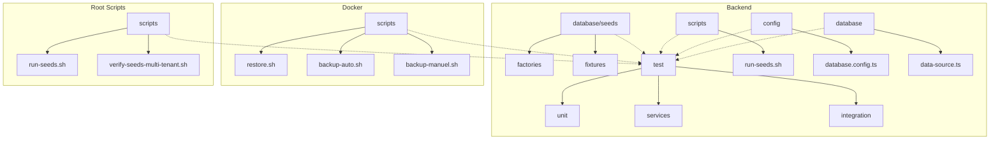

**Diagram sources**
- [backend/src/database/seeds/index.ts](file://backend/src/database/seeds/index.ts)
- [backend/src/database/seeds/factories/user.factory.ts](file://backend/src/database/seeds/factories/user.factory.ts)
- [backend/src/database/seeds/factories/etablissement.factory.ts](file://backend/src/database/seeds/factories/etablissement.factory.ts)
- [backend/src/database/seeds/fixtures/users.json](file://backend/src/database/seeds/fixtures/users.json)
- [backend/src/database/seeds/fixtures/etablissements.json](file://backend/src/database/seeds/fixtures/etablissements.json)
- [backend/test/multi-tenant-isolation.test.ts](file://backend/test/multi-tenant-isolation.test.ts)
- [backend/test/integration/auth-multi-etablissement.spec.ts](file://backend/test/integration/auth-multi-etablissement.spec.ts)
- [backend/test/integration/configuration-multi-tenant.spec.ts](file://backend/test/integration/configuration-multi-tenant.spec.ts)
- [backend/test/services/utilisateur-etablissement.service.test.ts](file://backend/test/services/utilisateur-etablissement.service.test.ts)
- [backend/test/services/utilisateurs.service.test.ts](file://backend/test/services/utilisateurs.service.test.ts)
- [backend/test/unit/pagination.util.spec.ts](file://backend/test/unit/pagination.util.spec.ts)
- [backend/test/unit/redis.service.spec.ts](file://backend/test/unit/redis.service.spec.ts)
- [backend/tests/integration/corrections-academique.test.ts](file://backend/tests/integration/corrections-academique.test.ts)
- [backend/scripts/run-seeds.sh](file://backend/scripts/run-seeds.sh)
- [scripts/run-seeds.sh](file://scripts/run-seeds.sh)
- [scripts/verify-seeds-multi-tenant.sh](file://scripts/verify-seeds-multi-tenant.sh)
- [docker/scripts/restore.sh](file://docker/scripts/restore.sh)
- [docker/scripts/backup-auto.sh](file://docker/scripts/backup-auto.sh)
- [docker/scripts/backup-manuel.sh](file://docker/scripts/backup-manuel.sh)
- [backend/src/config/database.config.ts](file://backend/src/config/database.config.ts)
- [backend/src/database/data-source.ts](file://backend/src/database/data-source.ts)

**Section sources**
- [backend/src/database/seeds/README.md](file://backend/src/database/seeds/README.md)
- [backend/src/database/seeds/index.ts](file://backend/src/database/seeds/index.ts)
- [backend/src/database/seeds/factories/user.factory.ts](file://backend/src/database/seeds/factories/user.factory.ts)
- [backend/src/database/seeds/factories/etablissement.factory.ts](file://backend/src/database/seeds/factories/etablissement.factory.ts)
- [backend/src/database/seeds/fixtures/users.json](file://backend/src/database/seeds/fixtures/users.json)
- [backend/src/database/seeds/fixtures/etablissements.json](file://backend/src/database/seeds/fixtures/etablissements.json)
- [backend/test/multi-tenant-isolation.test.ts](file://backend/test/multi-tenant-isolation.test.ts)
- [backend/test/integration/auth-multi-etablissement.spec.ts](file://backend/test/integration/auth-multi-etablissement.spec.ts)
- [backend/test/integration/configuration-multi-tenant.spec.ts](file://backend/test/integration/configuration-multi-tenant.spec.ts)
- [backend/test/services/utilisateur-etablissement.service.test.ts](file://backend/test/services/utilisateur-etablissement.service.test.ts)
- [backend/test/services/utilisateurs.service.test.ts](file://backend/test/services/utilisateurs.service.test.ts)
- [backend/test/unit/pagination.util.spec.ts](file://backend/test/unit/pagination.util.spec.ts)
- [backend/test/unit/redis.service.spec.ts](file://backend/test/unit/redis.service.spec.ts)
- [backend/tests/integration/corrections-academique.test.ts](file://backend/tests/integration/corrections-academique.test.ts)
- [backend/scripts/run-seeds.sh](file://backend/scripts/run-seeds.sh)
- [scripts/run-seeds.sh](file://scripts/run-seeds.sh)
- [scripts/verify-seeds-multi-tenant.sh](file://scripts/verify-seeds-multi-tenant.sh)
- [docker/scripts/restore.sh](file://docker/scripts/restore.sh)
- [docker/scripts/backup-auto.sh](file://docker/scripts/backup-auto.sh)
- [docker/scripts/backup-manuel.sh](file://docker/scripts/backup-manuel.sh)
- [backend/src/config/database.config.ts](file://backend/src/config/database.config.ts)
- [backend/src/database/data-source.ts](file://backend/src/database/data-source.ts)

## Core Components
- Seed orchestration: central entry point that loads and executes seed modules deterministically.
- Factories: reusable builders for realistic entities (e.g., users, établissements) with relationships.
- Fixtures: JSON files representing baseline or scenario-specific datasets.
- Test suites: unit, service, integration, and multi-tenant isolation tests using isolated databases or transactions.
- Scripts: automation for running seeds, verifying multi-tenant seeding, and restoring from backups.
- Database configuration: environment-driven connection settings and TypeORM data source initialization.

Key responsibilities:
- Deterministic ordering and idempotency for seeds
- Factory composition for complex entity graphs
- Fixture loading for stable baselines
- Isolation via per-test transactions or separate schemas/databases
- Anonymization and compliance safeguards for sensitive fields

**Section sources**
- [backend/src/database/seeds/index.ts](file://backend/src/database/seeds/index.ts)
- [backend/src/database/seeds/factories/user.factory.ts](file://backend/src/database/seeds/factories/user.factory.ts)
- [backend/src/database/seeds/factories/etablissement.factory.ts](file://backend/src/database/seeds/factories/etablissement.factory.ts)
- [backend/src/database/seeds/fixtures/users.json](file://backend/src/database/seeds/fixtures/users.json)
- [backend/src/database/seeds/fixtures/etablissements.json](file://backend/src/database/seeds/fixtures/etablissements.json)
- [backend/src/config/database.config.ts](file://backend/src/config/database.config.ts)
- [backend/src/database/data-source.ts](file://backend/src/database/data-source.ts)

## Architecture Overview
The test data architecture separates concerns between deterministic seeding, flexible factory generation, static fixtures, and robust isolation mechanisms.

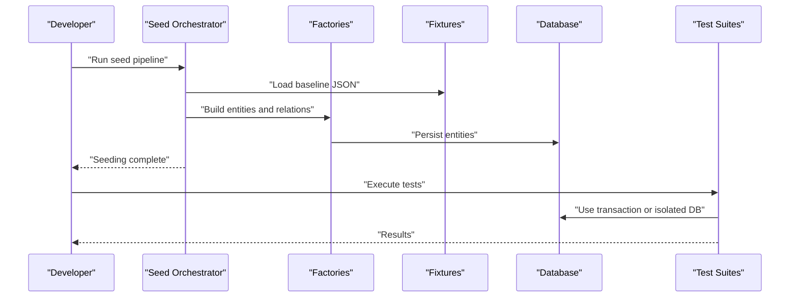

**Diagram sources**
- [backend/src/database/seeds/index.ts](file://backend/src/database/seeds/index.ts)
- [backend/src/database/seeds/factories/user.factory.ts](file://backend/src/database/seeds/factories/user.factory.ts)
- [backend/src/database/seeds/factories/etablissement.factory.ts](file://backend/src/database/seeds/factories/etablissement.factory.ts)
- [backend/src/database/seeds/fixtures/users.json](file://backend/src/database/seeds/fixtures/users.json)
- [backend/src/database/seeds/fixtures/etablissements.json](file://backend/src/database/seeds/fixtures/etablissements.json)
- [backend/test/multi-tenant-isolation.test.ts](file://backend/test/multi-tenant-isolation.test.ts)

## Detailed Component Analysis

### Seed Orchestration
- Purpose: Provide a single entry point to load fixtures, build entities via factories, and persist them in a deterministic order.
- Behavior:
  - Loads fixture sets for baseline data
  - Invokes factory builders to create relationships
  - Ensures idempotent execution by checking existing records where applicable
  - Exposes hooks for pre/post seed actions (e.g., index rebuilds)

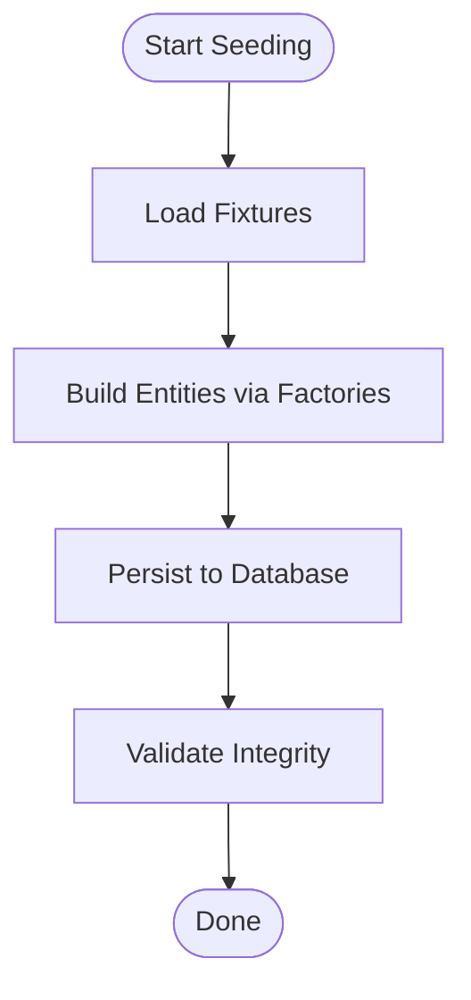

**Diagram sources**
- [backend/src/database/seeds/index.ts](file://backend/src/database/seeds/index.ts)

**Section sources**
- [backend/src/database/seeds/index.ts](file://backend/src/database/seeds/index.ts)

### Factory Pattern Implementation
- User Factory: constructs user entities with roles, permissions, and optional associations to établissements.
- Établissement Factory: constructs school entities with default configurations and references to other foundational entities.
- Composition: factories accept partial overrides and generate consistent defaults; they can compose multiple entities to represent complex scenarios.

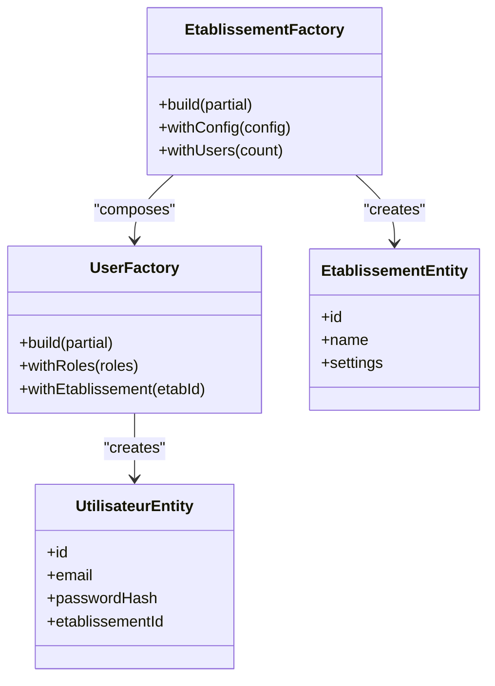

**Diagram sources**
- [backend/src/database/seeds/factories/user.factory.ts](file://backend/src/database/seeds/factories/user.factory.ts)
- [backend/src/database/seeds/factories/etablissement.factory.ts](file://backend/src/database/seeds/factories/etablissement.factory.ts)
- [backend/src/modules/utilisateurs/entities/utilisateur.entity.ts](file://backend/src/modules/utilisateurs/entities/utilisateur.entity.ts)
- [backend/src/modules/etablissement/entities/etablissement.entity.ts](file://backend/src/modules/etablissement/entities/etablissement.entity.ts)

**Section sources**
- [backend/src/database/seeds/factories/user.factory.ts](file://backend/src/database/seeds/factories/user.factory.ts)
- [backend/src/database/seeds/factories/etablissement.factory.ts](file://backend/src/database/seeds/factories/etablissement.factory.ts)
- [backend/src/modules/utilisateurs/entities/utilisateur.entity.ts](file://backend/src/modules/utilisateurs/entities/utilisateur.entity.ts)
- [backend/src/modules/etablissement/entities/etablissement.entity.ts](file://backend/src/modules/etablissement/entities/etablissement.entity.ts)

### Fixtures Strategy
- Baseline fixtures: small, stable JSON datasets for essential entities (users, établissements).
- Scenario fixtures: larger datasets for specific workflows (e.g., enrollment, scheduling).
- Loading mechanism: fixtures are read at seed time and transformed into entities via factories before persistence.

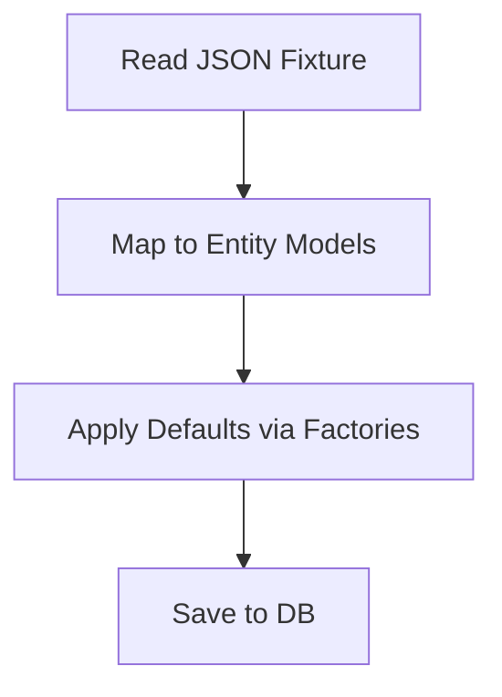

**Diagram sources**
- [backend/src/database/seeds/fixtures/users.json](file://backend/src/database/seeds/fixtures/users.json)
- [backend/src/database/seeds/fixtures/etablissements.json](file://backend/src/database/seeds/fixtures/etablissements.json)
- [backend/src/database/seeds/index.ts](file://backend/src/database/seeds/index.ts)

**Section sources**
- [backend/src/database/seeds/fixtures/users.json](file://backend/src/database/seeds/fixtures/users.json)
- [backend/src/database/seeds/fixtures/etablissements.json](file://backend/src/database/seeds/fixtures/etablissements.json)
- [backend/src/database/seeds/index.ts](file://backend/src/database/seeds/index.ts)

### Test Data Isolation Techniques
- Per-test transactions: wrap each test in a transaction and roll back on completion to ensure clean state.
- Separate test databases/schemas: isolate tenants by assigning distinct database identifiers or schema prefixes.
- Concurrency safety: avoid shared mutable state; use unique IDs and randomized values when necessary.

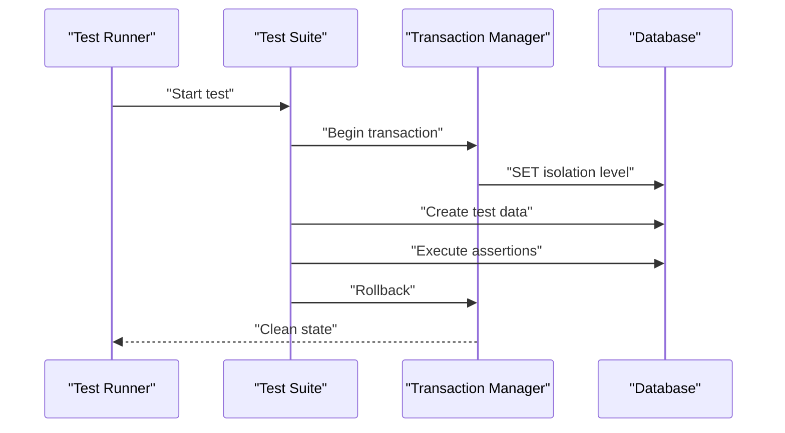

**Diagram sources**
- [backend/test/multi-tenant-isolation.test.ts](file://backend/test/multi-tenant-isolation.test.ts)
- [backend/test/integration/auth-multi-etablissement.spec.ts](file://backend/test/integration/auth-multi-etablissement.spec.ts)
- [backend/test/integration/configuration-multi-tenant.spec.ts](file://backend/test/integration/configuration-multi-tenant.spec.ts)

**Section sources**
- [backend/test/multi-tenant-isolation.test.ts](file://backend/test/multi-tenant-isolation.test.ts)
- [backend/test/integration/auth-multi-etablissement.spec.ts](file://backend/test/integration/auth-multi-etablissement.spec.ts)
- [backend/test/integration/configuration-multi-tenant.spec.ts](file://backend/test/integration/configuration-multi-tenant.spec.ts)

### Dynamic Test Data Generation
- Use factories to generate varied but valid datasets within tests.
- Introduce controlled randomness for non-key fields while preserving referential integrity.
- Combine fixtures for base data and factories for scenario-specific variations.

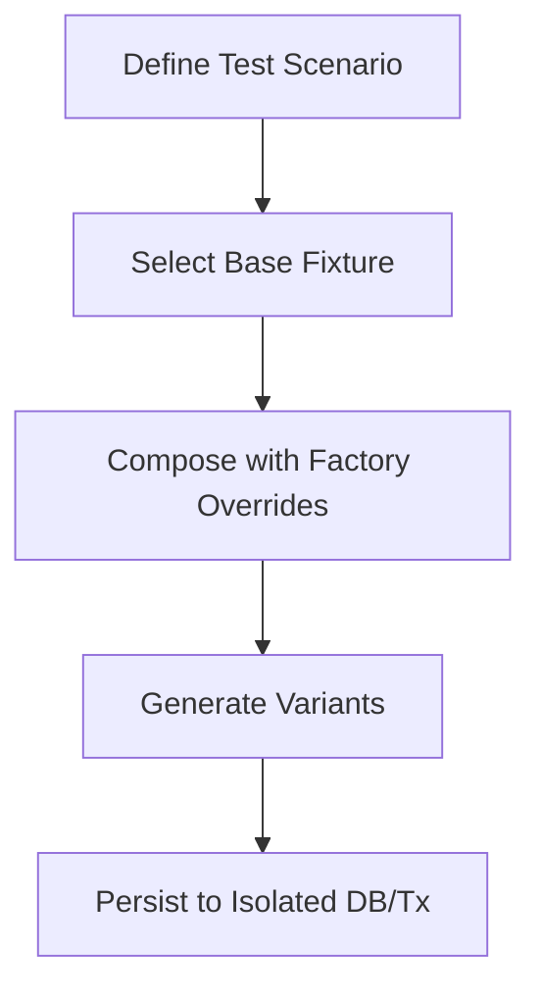

[No sources needed since this diagram shows conceptual workflow, not actual code structure]

### Database Reset Procedures
- Restore from backup: use provided restore script to reload a known-good snapshot.
- Automated backups: schedule periodic backups to maintain recoverable states.
- Manual backups: trigger ad-hoc snapshots before risky operations.

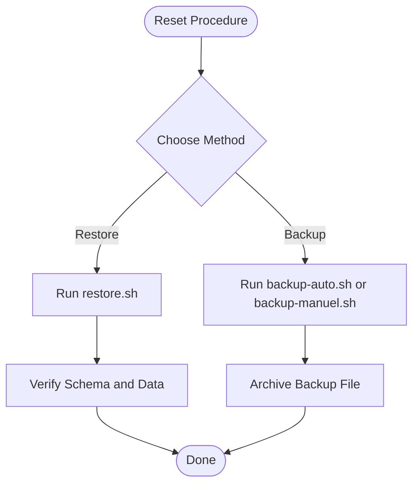

**Diagram sources**
- [docker/scripts/restore.sh](file://docker/scripts/restore.sh)
- [docker/scripts/backup-auto.sh](file://docker/scripts/backup-auto.sh)
- [docker/scripts/backup-manuel.sh](file://docker/scripts/backup-manuel.sh)

**Section sources**
- [docker/scripts/restore.sh](file://docker/scripts/restore.sh)
- [docker/scripts/backup-auto.sh](file://docker/scripts/backup-auto.sh)
- [docker/scripts/backup-manuel.sh](file://docker/scripts/backup-manuel.sh)

### Transaction Rollback Strategies
- Wrap entire test suites or individual tests in transactions.
- Ensure foreign key constraints do not prevent rollback by avoiding cascading deletes outside the transaction scope.
- For multi-tenant tests, isolate tenant contexts within transactions or separate databases.

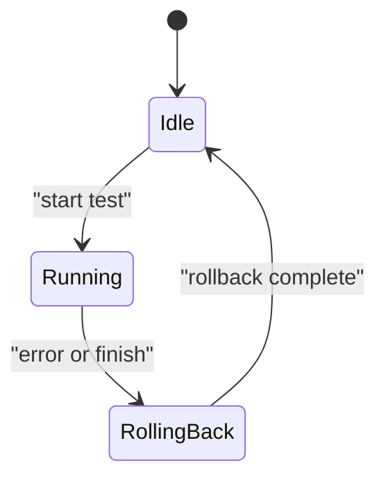

[No sources needed since this diagram shows conceptual workflow, not actual code structure]

### Sensitive Data Handling and Anonymization
- Avoid storing real personal data in fixtures; use synthetic data generated by factories.
- Mask or hash sensitive fields (e.g., passwords) consistently in test environments.
- Enforce compliance policies by validating that no PII leaks into logs or test outputs.

[No sources needed since this section provides general guidance]

### Examples of Complex Scenarios
- Multi-tenant enrollment: create an établissement, enroll students, assign teachers, and validate access control.
- Academic workflow: set up cycles, levels, classes, subjects, evaluations, and grades; assert report generation.
- Personnel payroll: create staff contracts, assignments, and pay runs; verify calculations and audit trails.

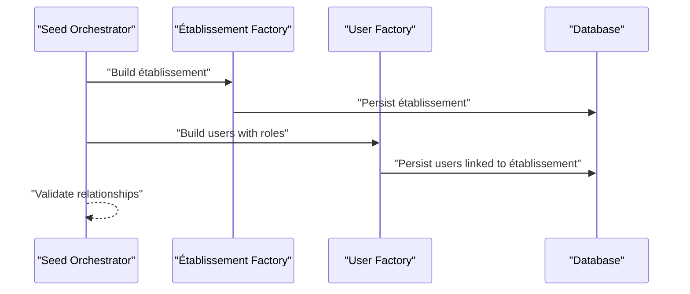

**Diagram sources**
- [backend/src/database/seeds/index.ts](file://backend/src/database/seeds/index.ts)
- [backend/src/database/seeds/factories/etablissement.factory.ts](file://backend/src/database/seeds/factories/etablissement.factory.ts)
- [backend/src/database/seeds/factories/user.factory.ts](file://backend/src/database/seeds/factories/user.factory.ts)

**Section sources**
- [backend/src/database/seeds/index.ts](file://backend/src/database/seeds/index.ts)
- [backend/src/database/seeds/factories/etablissement.factory.ts](file://backend/src/database/seeds/factories/etablissement.factory.ts)
- [backend/src/database/seeds/factories/user.factory.ts](file://backend/src/database/seeds/factories/user.factory.ts)

## Dependency Analysis
The following diagram maps dependencies among test data components and their interactions with configuration and database layers.

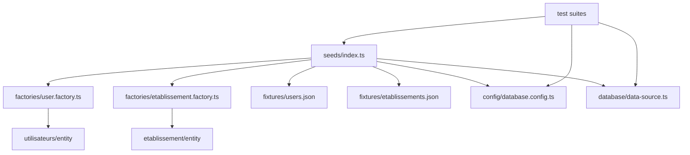

**Diagram sources**
- [backend/src/database/seeds/index.ts](file://backend/src/database/seeds/index.ts)
- [backend/src/database/seeds/factories/user.factory.ts](file://backend/src/database/seeds/factories/user.factory.ts)
- [backend/src/database/seeds/factories/etablissement.factory.ts](file://backend/src/database/seeds/factories/etablissement.factory.ts)
- [backend/src/database/seeds/fixtures/users.json](file://backend/src/database/seeds/fixtures/users.json)
- [backend/src/database/seeds/fixtures/etablissements.json](file://backend/src/database/seeds/fixtures/etablissements.json)
- [backend/src/config/database.config.ts](file://backend/src/config/database.config.ts)
- [backend/src/database/data-source.ts](file://backend/src/database/data-source.ts)
- [backend/src/modules/utilisateurs/entities/utilisateur.entity.ts](file://backend/src/modules/utilisateurs/entities/utilisateur.entity.ts)
- [backend/src/modules/etablissement/entities/etablissement.entity.ts](file://backend/src/modules/etablissement/entities/etablissement.entity.ts)

**Section sources**
- [backend/src/database/seeds/index.ts](file://backend/src/database/seeds/index.ts)
- [backend/src/config/database.config.ts](file://backend/src/config/database.config.ts)
- [backend/src/database/data-source.ts](file://backend/src/database/data-source.ts)

## Performance Considerations
- Prefer fixtures for stable baseline data to reduce factory overhead.
- Batch insertions where possible to minimize round-trips to the database.
- Use indexes judiciously in test databases to mirror production performance characteristics without excessive write costs.
- Limit randomization to non-critical fields to keep tests deterministic and fast.

[No sources needed since this section provides general guidance]

## Troubleshooting Guide
Common issues and resolutions:
- Seed ordering conflicts: ensure seed orchestration respects dependency order; add explicit checks for existing records.
- Foreign key violations during rollback: avoid cascading deletes outside transactions; use soft deletes if required.
- Multi-tenant leakage: verify tenant scoping in tests; enforce strict separation via database/schema or context headers.
- Fixture mismatches: validate fixture schemas against entity models; update fixtures after schema changes.

Operational tips:
- Use verification scripts to confirm seed correctness across tenants.
- Maintain recent backups before major schema updates.
- Log seed steps for traceability and quick diagnosis.

**Section sources**
- [scripts/verify-seeds-multi-tenant.sh](file://scripts/verify-seeds-multi-tenant.sh)
- [backend/scripts/run-seeds.sh](file://backend/scripts/run-seeds.sh)
- [scripts/run-seeds.sh](file://scripts/run-seeds.sh)

## Conclusion
A robust test data strategy for eLISAschool combines deterministic seeding, composable factories, stable fixtures, and strong isolation mechanisms. By leveraging the provided orchestration, factories, and scripts, teams can create realistic, compliant, and performant test environments that scale across modules and tenants.

[No sources needed since this section summarizes without analyzing specific files]

## Appendices

### Quick Commands
- Run seeds:
  - Backend: [backend/scripts/run-seeds.sh](file://backend/scripts/run-seeds.sh)
  - Root: [scripts/run-seeds.sh](file://scripts/run-seeds.sh)
- Verify multi-tenant seeds:
  - [scripts/verify-seeds-multi-tenant.sh](file://scripts/verify-seeds-multi-tenant.sh)
- Restore from backup:
  - [docker/scripts/restore.sh](file://docker/scripts/restore.sh)
- Create backups:
  - Auto: [docker/scripts/backup-auto.sh](file://docker/scripts/backup-auto.sh)
  - Manual: [docker/scripts/backup-manuel.sh](file://docker/scripts/backup-manuel.sh)

**Section sources**
- [backend/scripts/run-seeds.sh](file://backend/scripts/run-seeds.sh)
- [scripts/run-seeds.sh](file://scripts/run-seeds.sh)
- [scripts/verify-seeds-multi-tenant.sh](file://scripts/verify-seeds-multi-tenant.sh)
- [docker/scripts/restore.sh](file://docker/scripts/restore.sh)
- [docker/scripts/backup-auto.sh](file://docker/scripts/backup-auto.sh)
- [docker/scripts/backup-manuel.sh](file://docker/scripts/backup-manuel.sh)