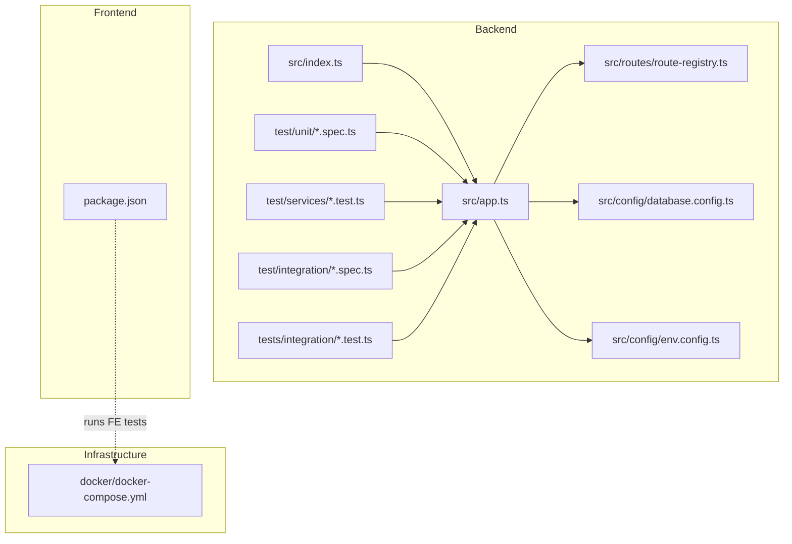
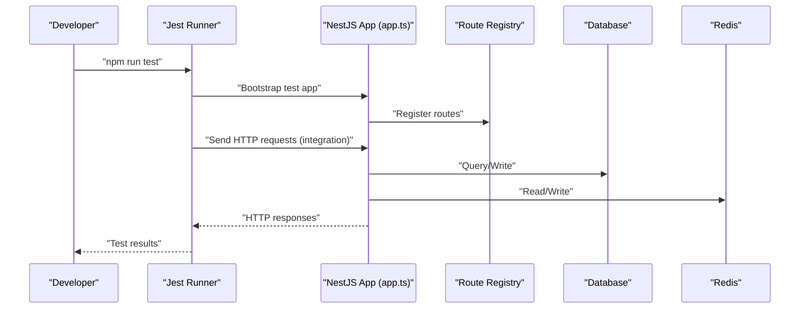
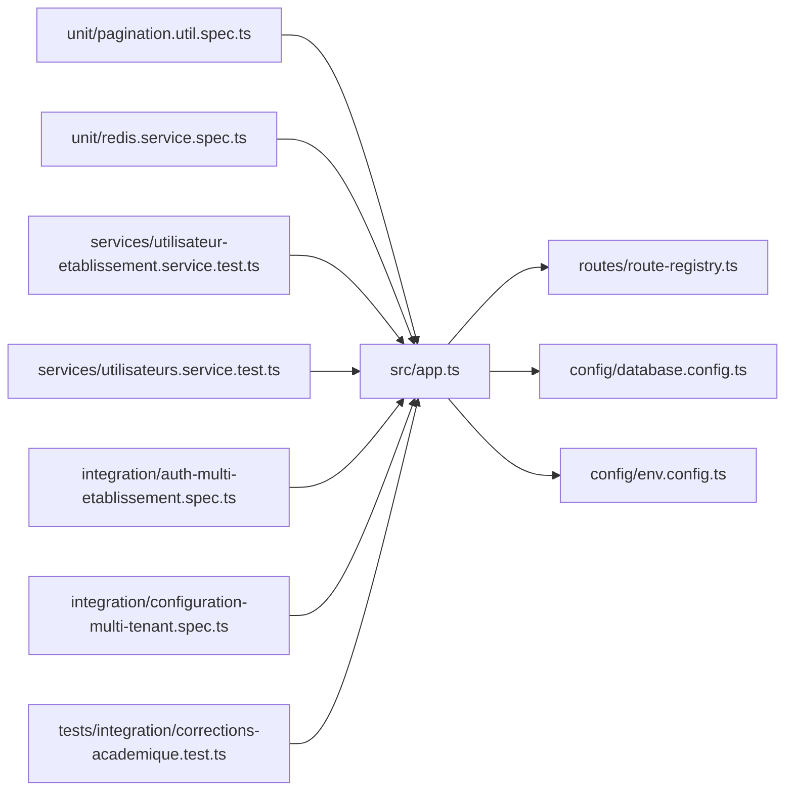
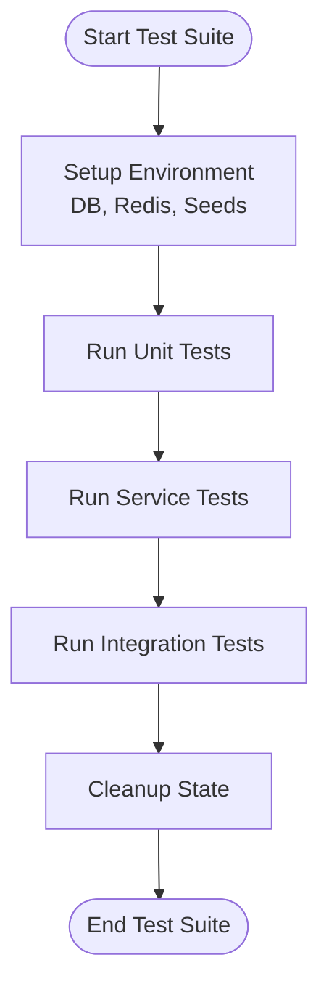

# Testing Strategies & Implementation

<cite>
**Referenced Files in This Document**
- [backend/package.json](file://backend/package.json)
- [backend/test/README.md](file://backend/test/README.md)
- [backend/test/unit/pagination.util.spec.ts](file://backend/test/unit/pagination.util.spec.ts)
- [backend/test/unit/redis.service.spec.ts](file://backend/test/unit/redis.service.spec.ts)
- [backend/test/services/utilisateur-etablissement.service.test.ts](file://backend/test/services/utilisateur-etablissement.service.test.ts)
- [backend/test/services/utilisateurs.service.test.ts](file://backend/test/services/utilisateurs.service.test.ts)
- [backend/test/integration/auth-multi-etablissement.spec.ts](file://backend/test/integration/auth-multi-etablissement.spec.ts)
- [backend/test/integration/configuration-multi-tenant.spec.ts](file://backend/test/integration/configuration-multi-tenant.spec.ts)
- [backend/tests/integration/corrections-academique.test.ts](file://backend/tests/integration/corrections-academique.test.ts)
- [backend/src/config/database.config.ts](file://backend/src/config/database.config.ts)
- [backend/src/config/env.config.ts](file://backend/src/config/env.config.ts)
- [backend/src/app.ts](file://backend/src/app.ts)
- [backend/src/index.ts](file://backend/src/index.ts)
- [backend/src/routes/route-registry.ts](file://backend/src/routes/route-registry.ts)
- [frontend/package.json](file://frontend/package.json)
- [docker/docker-compose.yml](file://docker/docker-compose.yml)
</cite>

## Table of Contents
1. [Introduction](#introduction)
2. [Project Structure](#project-structure)
3. [Core Components](#core-components)
4. [Architecture Overview](#architecture-overview)
5. [Detailed Component Analysis](#detailed-component-analysis)
6. [Dependency Analysis](#dependency-analysis)
7. [Performance Considerations](#performance-considerations)
8. [Troubleshooting Guide](#troubleshooting-guide)
9. [Conclusion](#conclusion)
10. [Appendices](#appendices)

## Introduction
This document defines the comprehensive testing strategy for eLISAschool across backend and frontend layers. It covers unit, integration, and end-to-end testing approaches; test data management; mocking strategies; environment configuration; coverage requirements; CI pipeline recommendations; and performance, load, and security testing considerations. The goal is to provide actionable guidance that aligns with the existing codebase structure and tools.

## Project Structure
The repository includes:
- Backend NestJS application with dedicated test directories under backend/test and backend/tests
- Frontend application with its own package configuration
- Docker Compose for local infrastructure (database, Redis, etc.)
- Shared utilities and configuration modules used by tests

**Diagram sources**
- [backend/src/app.ts](file://backend/src/app.ts)
- [backend/src/index.ts](file://backend/src/index.ts)
- [backend/src/routes/route-registry.ts](file://backend/src/routes/route-registry.ts)
- [backend/src/config/database.config.ts](file://backend/src/config/database.config.ts)
- [backend/src/config/env.config.ts](file://backend/src/config/env.config.ts)
- [backend/test/unit/pagination.util.spec.ts](file://backend/test/unit/pagination.util.spec.ts)
- [backend/test/unit/redis.service.spec.ts](file://backend/test/unit/redis.service.spec.ts)
- [backend/test/services/utilisateur-etablissement.service.test.ts](file://backend/test/services/utilisateur-etablissement.service.test.ts)
- [backend/test/services/utilisateurs.service.test.ts](file://backend/test/services/utilisateurs.service.test.ts)
- [backend/test/integration/auth-multi-etablissement.spec.ts](file://backend/test/integration/auth-multi-etablissement.spec.ts)
- [backend/test/integration/configuration-multi-tenant.spec.ts](file://backend/test/integration/configuration-multi-tenant.spec.ts)
- [backend/tests/integration/corrections-academique.test.ts](file://backend/tests/integration/corrections-academique.test.ts)
- [frontend/package.json](file://frontend/package.json)
- [docker/docker-compose.yml](file://docker/docker-compose.yml)

**Section sources**
- [backend/package.json](file://backend/package.json)
- [backend/test/README.md](file://backend/test/README.md)
- [backend/test/unit/pagination.util.spec.ts](file://backend/test/unit/pagination.util.spec.ts)
- [backend/test/unit/redis.service.spec.ts](file://backend/test/unit/redis.service.spec.ts)
- [backend/test/services/utilisateur-etablissement.service.test.ts](file://backend/test/services/utilisateur-etablissement.service.test.ts)
- [backend/test/services/utilisateurs.service.test.ts](file://backend/test/services/utilisateurs.service.test.ts)
- [backend/test/integration/auth-multi-etablissement.spec.ts](file://backend/test/integration/auth-multi-etablissement.spec.ts)
- [backend/test/integration/configuration-multi-tenant.spec.ts](file://backend/test/integration/configuration-multi-tenant.spec.ts)
- [backend/tests/integration/corrections-academique.test.ts](file://backend/tests/integration/corrections-academique.test.ts)
- [backend/src/config/database.config.ts](file://backend/src/config/database.config.ts)
- [backend/src/config/env.config.ts](file://backend/src/config/env.config.ts)
- [backend/src/app.ts](file://backend/src/app.ts)
- [backend/src/index.ts](file://backend/src/index.ts)
- [backend/src/routes/route-registry.ts](file://backend/src/routes/route-registry.ts)
- [frontend/package.json](file://frontend/package.json)
- [docker/docker-compose.yml](file://docker/docker-compose.yml)

## Core Components
- Test runners and frameworks
  - Backend uses Jest via npm scripts defined in the backend package configuration.
  - Frontend uses its own package configuration for running tests.
- Test organization
  - Unit tests: backend/test/unit
  - Service-level tests: backend/test/services
  - Integration tests: backend/test/integration and backend/tests/integration
  - Documentation: backend/test/README.md provides guidance on running and organizing tests
- Configuration
  - Database configuration module and environment configuration module are referenced by the application and can be leveraged by tests to set up isolated environments.

Key responsibilities:
- Unit tests validate pure logic and utility functions without external dependencies.
- Service tests validate business logic using mocked or test doubles where appropriate.
- Integration tests exercise API endpoints and database interactions against a real or test database.

**Section sources**
- [backend/package.json](file://backend/package.json)
- [backend/test/README.md](file://backend/test/README.md)
- [backend/test/unit/pagination.util.spec.ts](file://backend/test/unit/pagination.util.spec.ts)
- [backend/test/unit/redis.service.spec.ts](file://backend/test/unit/redis.service.spec.ts)
- [backend/test/services/utilisateur-etablissement.service.test.ts](file://backend/test/services/utilisateur-etablissement.service.test.ts)
- [backend/test/services/utilisateurs.service.test.ts](file://backend/test/services/utilisateurs.service.test.ts)
- [backend/test/integration/auth-multi-etablissement.spec.ts](file://backend/test/integration/auth-multi-etablissement.spec.ts)
- [backend/test/integration/configuration-multi-tenant.spec.ts](file://backend/test/integration/configuration-multi-tenant.spec.ts)
- [backend/tests/integration/corrections-academique.test.ts](file://backend/tests/integration/corrections-academique.test.ts)
- [backend/src/config/database.config.ts](file://backend/src/config/database.config.ts)
- [backend/src/config/env.config.ts](file://backend/src/config/env.config.ts)

## Architecture Overview
The testing architecture spans multiple layers:
- Unit layer: Validates internal logic and utilities in isolation.
- Service layer: Tests business services with controlled dependencies.
- Integration layer: Exercises HTTP routes and database operations.
- End-to-end layer: Simulates user flows through the UI and backend.

**Diagram sources**
- [backend/src/app.ts](file://backend/src/app.ts)
- [backend/src/routes/route-registry.ts](file://backend/src/routes/route-registry.ts)
- [backend/src/config/database.config.ts](file://backend/src/config/database.config.ts)
- [backend/src/config/env.config.ts](file://backend/src/config/env.config.ts)
- [backend/test/integration/auth-multi-etablissement.spec.ts](file://backend/test/integration/auth-multi-etablissement.spec.ts)
- [backend/test/integration/configuration-multi-tenant.spec.ts](file://backend/test/integration/configuration-multi-tenant.spec.ts)

## Detailed Component Analysis

### Unit Testing Strategy (Jest)
Focus areas:
- Utility functions (e.g., pagination helpers)
- Service methods with deterministic behavior
- External service wrappers (e.g., Redis client)

Guidelines:
- Use Jest’s built-in mocking for external dependencies.
- Keep tests fast and deterministic; avoid network calls.
- Organize tests by feature or module under backend/test/unit.

Example references:
- Pagination utility tests
- Redis service tests

**Section sources**
- [backend/test/unit/pagination.util.spec.ts](file://backend/test/unit/pagination.util.spec.ts)
- [backend/test/unit/redis.service.spec.ts](file://backend/test/unit/redis.service.spec.ts)

### Service-Level Testing Strategy
Focus areas:
- Business logic validation
- Multi-tenant scoping and permissions
- Data transformation and validation

Guidelines:
- Mock repositories and external services.
- Assert side effects and return values.
- Cover edge cases and error paths.

Example references:
- Utilisateur établissement service tests
- Utilisateurs service tests

**Section sources**
- [backend/test/services/utilisateur-etablissement.service.test.ts](file://backend/test/services/utilisateur-etablissement.service.test.ts)
- [backend/test/services/utilisateurs.service.test.ts](file://backend/test/services/utilisateurs.service.test.ts)

### Integration Testing Strategy (API + Database)
Focus areas:
- HTTP endpoint correctness
- Authentication and authorization flows
- Multi-tenant configuration and isolation
- Database schema migrations and queries

Guidelines:
- Use a dedicated test database instance.
- Seed minimal required data per test scenario.
- Reset state between tests to ensure isolation.

Example references:
- Multi-establishment authentication integration
- Multi-tenant configuration integration
- Academic corrections integration

**Section sources**
- [backend/test/integration/auth-multi-etablissement.spec.ts](file://backend/test/integration/auth-multi-etablissement.spec.ts)
- [backend/test/integration/configuration-multi-tenant.spec.ts](file://backend/test/integration/configuration-multi-tenant.spec.ts)
- [backend/tests/integration/corrections-academique.test.ts](file://backend/tests/integration/corrections-academique.test.ts)

### End-to-End Testing Strategy (Cypress or Playwright)
Recommended approach:
- Use Cypress or Playwright to simulate user workflows across the frontend and backend.
- Target critical user journeys such as login, navigation, form submissions, and report generation.
- Run E2E tests against a live instance provisioned by Docker Compose.

Environment setup:
- Spin up backend, database, and Redis via docker-compose.
- Configure base URLs and credentials via environment variables.
- Isolate test tenants and users to prevent cross-test interference.

[No sources needed since this section provides conceptual guidance]

### Test Data Management
Recommendations:
- Create seed fixtures for common entities (users, establishments, academic structures).
- Use transactional rollback or truncate tables after each test suite.
- Maintain separate seeds for integration vs. E2E scenarios.
- Version control seed scripts alongside migrations.

[No sources needed since this section provides general guidance]

### Mocking Strategies
Recommendations:
- Mock external APIs (payment providers, email/SMS gateways).
- Stub Redis and database clients for unit/service tests.
- Use factory functions to generate realistic test objects deterministically.
- Centralize mocks in shared test utilities to reduce duplication.

[No sources needed since this section provides general guidance]

### Test Environment Configuration
Recommendations:
- Separate environment files for test, development, and production.
- Configure database connection strings and Redis endpoints per environment.
- Ensure consistent ports and hostnames in CI and local runs.

References:
- Database configuration module
- Environment configuration module

**Section sources**
- [backend/src/config/database.config.ts](file://backend/src/config/database.config.ts)
- [backend/src/config/env.config.ts](file://backend/src/config/env.config.ts)

### Continuous Integration Testing Pipelines
Recommendations:
- Stages: lint → unit → service → integration → build → E2E
- Parallelize independent suites to reduce runtime.
- Publish test reports and artifacts (screenshots, logs).
- Gate merges on passing tests and coverage thresholds.

[No sources needed since this section provides general guidance]

### Coverage Requirements
Recommendations:
- Enforce minimum coverage thresholds per file and overall.
- Prioritize coverage for core business logic and public APIs.
- Track trends over time rather than chasing 100% blindly.

[No sources needed since this section provides general guidance]

### Performance, Load, and Security Testing
Recommendations:
- Performance: Profile hot paths and database queries; add benchmarks for critical algorithms.
- Load: Use k6 or Artillery to simulate concurrent users and measure latency/throughput.
- Security: Integrate SAST/DAST scans; perform dependency vulnerability checks; validate authZ/AuthN flows.

[No sources needed since this section provides general guidance]

## Dependency Analysis
The following diagram shows how test suites depend on application components and configuration modules.

**Diagram sources**
- [backend/test/unit/pagination.util.spec.ts](file://backend/test/unit/pagination.util.spec.ts)
- [backend/test/unit/redis.service.spec.ts](file://backend/test/unit/redis.service.spec.ts)
- [backend/test/services/utilisateur-etablissement.service.test.ts](file://backend/test/services/utilisateur-etablissement.service.test.ts)
- [backend/test/services/utilisateurs.service.test.ts](file://backend/test/services/utilisateurs.service.test.ts)
- [backend/test/integration/auth-multi-etablissement.spec.ts](file://backend/test/integration/auth-multi-etablissement.spec.ts)
- [backend/test/integration/configuration-multi-tenant.spec.ts](file://backend/test/integration/configuration-multi-tenant.spec.ts)
- [backend/tests/integration/corrections-academique.test.ts](file://backend/tests/integration/corrections-academique.test.ts)
- [backend/src/app.ts](file://backend/src/app.ts)
- [backend/src/routes/route-registry.ts](file://backend/src/routes/route-registry.ts)
- [backend/src/config/database.config.ts](file://backend/src/config/database.config.ts)
- [backend/src/config/env.config.ts](file://backend/src/config/env.config.ts)

**Section sources**
- [backend/test/unit/pagination.util.spec.ts](file://backend/test/unit/pagination.util.spec.ts)
- [backend/test/unit/redis.service.spec.ts](file://backend/test/unit/redis.service.spec.ts)
- [backend/test/services/utilisateur-etablissement.service.test.ts](file://backend/test/services/utilisateur-etablissement.service.test.ts)
- [backend/test/services/utilisateurs.service.test.ts](file://backend/test/services/utilisateurs.service.test.ts)
- [backend/test/integration/auth-multi-etablissement.spec.ts](file://backend/test/integration/auth-multi-etablissement.spec.ts)
- [backend/test/integration/configuration-multi-tenant.spec.ts](file://backend/test/integration/configuration-multi-tenant.spec.ts)
- [backend/tests/integration/corrections-academique.test.ts](file://backend/tests/integration/corrections-academique.test.ts)
- [backend/src/app.ts](file://backend/src/app.ts)
- [backend/src/routes/route-registry.ts](file://backend/src/routes/route-registry.ts)
- [backend/src/config/database.config.ts](file://backend/src/config/database.config.ts)
- [backend/src/config/env.config.ts](file://backend/src/config/env.config.ts)

## Performance Considerations
- Prefer in-memory databases or lightweight containers for faster integration tests.
- Avoid heavy seeding; use targeted fixtures per test case.
- Parallelize independent suites and limit concurrency to avoid resource contention.
- Monitor test flakiness and stabilize non-deterministic assertions.

[No sources needed since this section provides general guidance]

## Troubleshooting Guide
Common issues and resolutions:
- Flaky integration tests due to shared state: enforce strict isolation and cleanup.
- Timeouts from slow external services: mock or stub them in tests.
- Database connectivity errors: verify environment variables and container health.
- Redis availability: ensure Redis is started and reachable in test environments.

Operational references:
- Application bootstrap and route registration
- Database and environment configuration modules

**Section sources**
- [backend/src/app.ts](file://backend/src/app.ts)
- [backend/src/index.ts](file://backend/src/index.ts)
- [backend/src/routes/route-registry.ts](file://backend/src/routes/route-registry.ts)
- [backend/src/config/database.config.ts](file://backend/src/config/database.config.ts)
- [backend/src/config/env.config.ts](file://backend/src/config/env.config.ts)

## Conclusion
A robust testing strategy for eLISAschool combines unit, service, integration, and end-to-end tests, supported by strong environment configuration, disciplined data management, and effective mocking. By enforcing coverage thresholds, integrating tests into CI, and adding performance/load/security validations, the team can maintain high quality and reliability across the platform.

## Appendices

### Appendix A: Running Tests Locally
- Backend unit and service tests: use Jest via npm scripts defined in the backend package configuration.
- Backend integration tests: ensure database and Redis are available via Docker Compose.
- Frontend tests: use the frontend package configuration to run component and integration tests.

**Section sources**
- [backend/package.json](file://backend/package.json)
- [frontend/package.json](file://frontend/package.json)
- [docker/docker-compose.yml](file://docker/docker-compose.yml)

### Appendix B: Example Test Workflows

[No sources needed since this diagram shows conceptual workflow, not actual code structure]