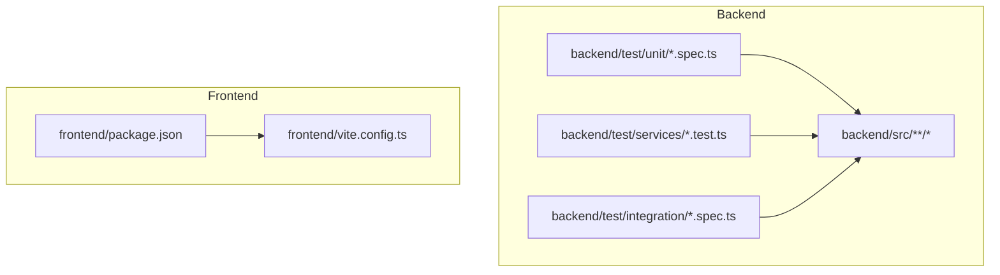
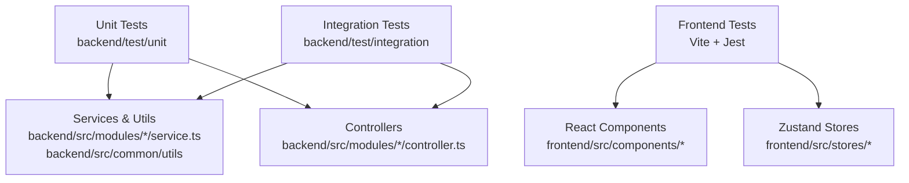
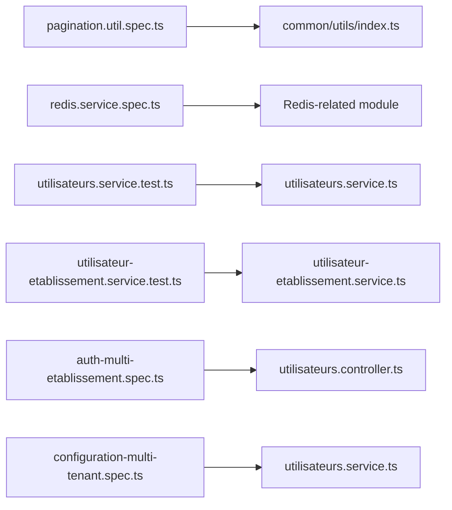

# Unit Testing

<cite>
**Referenced Files in This Document**
- [backend/package.json](file://backend/package.json)
- [backend/test/README.md](file://backend/test/README.md)
- [backend/test/unit/pagination.util.spec.ts](file://backend/test/unit/pagination.util.spec.ts)
- [backend/test/unit/redis.service.spec.ts](file://backend/test/unit/redis.service.spec.ts)
- [backend/test/services/utilisateur-etablissement.service.test.ts](file://backend/test/services/utilisateur-etablissement.service.test.ts)
- [backend/test/services/utilisateurs.service.test.ts](file://backend/test/services/utilisateurs.service.test.ts)
- [backend/test/integration/auth-multi-etablissement.spec.ts](file://backend/test/integration/auth-multi-etablissement.spec.ts)
- [backend/test/integration/configuration-multi-tenant.spec.ts](file://backend/test/integration/configuration-multi-tenant.spec.ts)
- [backend/src/common/utils/index.ts](file://backend/src/common/utils/index.ts)
- [backend/src/modules/utilisateurs/utilisateurs.controller.ts](file://backend/src/modules/utilisateurs/utilisateurs.controller.ts)
- [backend/src/modules/utilisateurs/utilisateurs.service.ts](file://backend/src/modules/utilisateurs/utilisateurs.service.ts)
- [backend/src/modules/utilisateurs/dto/create-utilisateur.dto.ts](file://backend/src/modules/utilisateurs/dto/create-utilisateur.dto.ts)
- [frontend/package.json](file://frontend/package.json)
- [frontend/vite.config.ts](file://frontend/vite.config.ts)
</cite>

## Table of Contents
1. [Introduction](#introduction)
2. [Project Structure](#project-structure)
3. [Core Components](#core-components)
4. [Architecture Overview](#architecture-overview)
5. [Detailed Component Analysis](#detailed-component-analysis)
6. [Dependency Analysis](#dependency-analysis)
7. [Performance Considerations](#performance-considerations)
8. [Troubleshooting Guide](#troubleshooting-guide)
9. [Conclusion](#conclusion)
10. [Appendices](#appendices)

## Introduction
This document provides comprehensive unit testing guidance for eLISAschool, covering both the NestJS backend and React frontend. It explains how Jest is configured and used across the codebase, outlines recommended patterns for services, controllers, utilities, and React components, and details strategies for mocking dependencies, testing asynchronous operations, and validating business logic. It also includes conventions for test organization, naming, assertions, and coverage goals.

## Project Structure
The repository organizes tests close to their source:
- Backend (NestJS): Tests live under backend/test with subfolders for unit, services, and integration.
- Frontend (React): Uses Vite’s built-in Jest configuration via package.json scripts.

**Diagram sources**
- [backend/test/unit/pagination.util.spec.ts](file://backend/test/unit/pagination.util.spec.ts)
- [backend/test/services/utilisateur-etablissement.service.test.ts](file://backend/test/services/utilisateur-etablissement.service.test.ts)
- [backend/test/integration/auth-multi-etablissement.spec.ts](file://backend/test/integration/auth-multi-etablissement.spec.ts)
- [backend/src/modules/utilisateurs/utilisateurs.controller.ts](file://backend/src/modules/utilisateurs/utilisateurs.controller.ts)
- [backend/src/modules/utilisateurs/utilisateurs.service.ts](file://backend/src/modules/utilisateurs/utilisateurs.service.ts)
- [frontend/package.json](file://frontend/package.json)
- [frontend/vite.config.ts](file://frontend/vite.config.ts)

**Section sources**
- [backend/test/README.md](file://backend/test/README.md)
- [backend/package.json](file://backend/package.json)
- [frontend/package.json](file://frontend/package.json)
- [frontend/vite.config.ts](file://frontend/vite.config.ts)

## Core Components
- Jest configuration for backend: Defined in backend/package.json. The project uses Jest directly for TypeScript tests (.spec.ts and .test.ts).
- Jest configuration for frontend: Provided by Vite’s default setup; scripts are defined in frontend/package.json.

Key responsibilities:
- Backend: Run unit, service, and integration tests using Jest.
- Frontend: Run component and utility tests using Jest through Vite.

**Section sources**
- [backend/package.json](file://backend/package.json)
- [frontend/package.json](file://frontend/package.json)

## Architecture Overview
The testing architecture separates concerns by layer:
- Unit tests validate pure functions and isolated modules.
- Service tests verify business logic with mocked repositories or external services.
- Integration tests exercise controllers and middleware against a test database or mock HTTP stack.
- Frontend tests render React components and simulate user interactions.

[No sources needed since this diagram shows conceptual workflow, not actual code structure]

## Detailed Component Analysis

### Backend: Jest Configuration and Setup
- Test runner: Jest configured in backend/package.json.
- File patterns: Both .spec.ts and .test.ts files are executed.
- Typical commands: Use npm scripts from backend/package.json to run all tests or specific suites.

Recommendations:
- Keep unit tests fast and deterministic.
- Isolate side effects (DB, network) behind interfaces and mock them in tests.
- Use separate folders for unit, service, and integration tests to clarify intent.

**Section sources**
- [backend/package.json](file://backend/package.json)

### Backend: Unit Tests for Utilities
Focus areas:
- Pure functions and helpers in common utils.
- Deterministic inputs and outputs without external dependencies.

Example targets:
- Pagination utilities: Validate page calculations, slicing, and edge cases.

Guidelines:
- Provide multiple input scenarios including empty arrays, single items, and boundary conditions.
- Assert exact output shapes and values.

**Section sources**
- [backend/test/unit/pagination.util.spec.ts](file://backend/test/unit/pagination.util.spec.ts)
- [backend/src/common/utils/index.ts](file://backend/src/common/utils/index.ts)

### Backend: Unit Tests for Redis Service
Focus areas:
- Encapsulated Redis client behavior.
- Error handling and retry strategies if implemented.

Guidelines:
- Mock the underlying Redis client methods.
- Verify that errors propagate correctly and timeouts are handled as expected.

**Section sources**
- [backend/test/unit/redis.service.spec.ts](file://backend/test/unit/redis.service.spec.ts)

### Backend: Service Tests (Business Logic)
Focus areas:
- Business rules in service classes.
- Interactions with repositories, DTOs, and domain models.

Example targets:
- Utilisateurs service: Create, update, delete, and query users with multi-tenant constraints.
- Utilisateur et établissement service: Validate relationships between users and establishments.

Mocking strategy:
- Replace repositories with jest.fn() mocks returning controlled data.
- Validate DTO transformations and validation outcomes.

Async testing:
- Return promises or use async/await.
- Assert resolved values and rejected errors.

**Section sources**
- [backend/test/services/utilisateurs.service.test.ts](file://backend/test/services/utilisateurs.service.test.ts)
- [backend/test/services/utilisateur-etablissement.service.test.ts](file://backend/test/services/utilisateur-etablissement.service.test.ts)
- [backend/src/modules/utilisateurs/utilisateurs.service.ts](file://backend/src/modules/utilisateurs/utilisateurs.service.ts)
- [backend/src/modules/utilisateurs/dto/create-utilisateur.dto.ts](file://backend/src/modules/utilisateurs/dto/create-utilisateur.dto.ts)

### Backend: Controller Tests (HTTP Layer)
Focus areas:
- Request/response contracts.
- Validation via DTOs.
- Status codes and error responses.

Example target:
- Utilisateurs controller: Ensure endpoints accept valid payloads, reject invalid ones, and return correct structures.

Mocking strategy:
- Inject mocked services into the controller instance.
- Call controller methods directly or use Nest’s testing utilities to invoke routes.

**Section sources**
- [backend/src/modules/utilisateurs/utilisateurs.controller.ts](file://backend/src/modules/utilisateurs/utilisateurs.controller.ts)
- [backend/src/modules/utilisateurs/dto/create-utilisateur.dto.ts](file://backend/src/modules/utilisateurs/dto/create-utilisateur.dto.ts)

### Backend: Integration Tests
Focus areas:
- End-to-end flows across controllers, services, and data access layers.
- Multi-tenant isolation and authentication flows.

Examples:
- Authentication across multiple établissements.
- Configuration queries respecting tenant boundaries.

Guidelines:
- Use an in-memory database or a dedicated test DB.
- Seed minimal data required for each scenario.
- Reset state between tests to ensure isolation.

**Section sources**
- [backend/test/integration/auth-multi-etablissement.spec.ts](file://backend/test/integration/auth-multi-etablissement.spec.ts)
- [backend/test/integration/configuration-multi-tenant.spec.ts](file://backend/test/integration/configuration-multi-tenant.spec.ts)

### Backend: Testing Decorators, Guards, Interceptors, and Middleware
Patterns:
- Decorators: Test by invoking controller methods with decorated parameters and asserting behavior.
- Guards: Instantiate guards with mocked dependencies and assert canActivate returns expected booleans.
- Interceptors: Wrap handler calls and assert response transformation or logging.
- Middleware: Mount middleware in a Nest testing application and send requests to verify side effects.

Best practices:
- Keep guard/interceptor/middleware tests focused on their contract.
- Avoid heavy DB/network calls; mock collaborators.

[No sources needed since this section provides general guidance]

### Frontend: Jest Configuration and Setup
- Configuration: Provided by Vite’s default Jest setup.
- Scripts: Defined in frontend/package.json to run tests.
- Environment: jsdom-based DOM simulation for React components.

Recommendations:
- Place tests next to components or in a parallel __tests__ folder.
- Use file suffixes like .test.tsx for clarity.

**Section sources**
- [frontend/package.json](file://frontend/package.json)
- [frontend/vite.config.ts](file://frontend/vite.config.ts)

### Frontend: Component Rendering and User Interaction
Focus areas:
- Render components with required props and context.
- Simulate user events (clicks, typing) and assert UI updates.
- Test conditional rendering based on store state.

State management with Zustand:
- Create a store instance per test or reset store state before each test.
- Mutate store via actions and assert derived UI changes.

**Section sources**
- [frontend/package.json](file://frontend/package.json)

### Frontend: Utilities and Hooks
Focus areas:
- Pure utility functions: Assert inputs/outputs deterministically.
- Custom hooks: Render hook results within a test harness and assert state transitions.

**Section sources**
- [frontend/package.json](file://frontend/package.json)

## Dependency Analysis
The following diagram maps key test files to their corresponding source modules.

**Diagram sources**
- [backend/test/unit/pagination.util.spec.ts](file://backend/test/unit/pagination.util.spec.ts)
- [backend/src/common/utils/index.ts](file://backend/src/common/utils/index.ts)
- [backend/test/unit/redis.service.spec.ts](file://backend/test/unit/redis.service.spec.ts)
- [backend/test/services/utilisateurs.service.test.ts](file://backend/test/services/utilisateurs.service.test.ts)
- [backend/src/modules/utilisateurs/utilisateurs.service.ts](file://backend/src/modules/utilisateurs/utilisateurs.service.ts)
- [backend/test/services/utilisateur-etablissement.service.test.ts](file://backend/test/services/utilisateur-etablissement.service.test.ts)
- [backend/test/integration/auth-multi-etablissement.spec.ts](file://backend/test/integration/auth-multi-etablissement.spec.ts)
- [backend/src/modules/utilisateurs/utilisateurs.controller.ts](file://backend/src/modules/utilisateurs/utilisateurs.controller.ts)
- [backend/test/integration/configuration-multi-tenant.spec.ts](file://backend/test/integration/configuration-multi-tenant.spec.ts)

**Section sources**
- [backend/test/unit/pagination.util.spec.ts](file://backend/test/unit/pagination.util.spec.ts)
- [backend/test/unit/redis.service.spec.ts](file://backend/test/unit/redis.service.spec.ts)
- [backend/test/services/utilisateurs.service.test.ts](file://backend/test/services/utilisateurs.service.test.ts)
- [backend/test/services/utilisateur-etablissement.service.test.ts](file://backend/test/services/utilisateur-etablissement.service.test.ts)
- [backend/test/integration/auth-multi-etablissement.spec.ts](file://backend/test/integration/auth-multi-etablissement.spec.ts)
- [backend/test/integration/configuration-multi-tenant.spec.ts](file://backend/test/integration/configuration-multi-tenant.spec.ts)
- [backend/src/modules/utilisateurs/utilisateurs.controller.ts](file://backend/src/modules/utilisateurs/utilisateurs.controller.ts)
- [backend/src/modules/utilisateurs/utilisateurs.service.ts](file://backend/src/modules/utilisateurs/utilisateurs.service.ts)
- [backend/src/common/utils/index.ts](file://backend/src/common/utils/index.ts)

## Performance Considerations
- Prefer unit tests over integration tests for speed; keep integration tests minimal and targeted.
- Use in-memory databases or lightweight fixtures for integration tests.
- Parallelize test execution where possible; avoid shared mutable state.
- Mock expensive operations (network, disk, crypto) to reduce runtime.

[No sources needed since this section provides general guidance]

## Troubleshooting Guide
Common issues and resolutions:
- Missing Jest config: Ensure backend/package.json defines Jest scripts and options; frontend relies on Vite defaults.
- TypeScript compilation errors in tests: Confirm tsconfig paths and Jest transform settings match your setup.
- Flaky integration tests: Isolate test data, reset state between runs, and avoid cross-test dependencies.
- Slow tests: Identify long-running operations and replace with mocks or faster alternatives.

**Section sources**
- [backend/package.json](file://backend/package.json)
- [frontend/package.json](file://frontend/package.json)

## Conclusion
Adopting clear testing patterns—unit, service, integration, and frontend—ensures reliability and maintainability across eLISAschool. By isolating dependencies, standardizing naming and organization, and focusing on meaningful assertions, teams can achieve high confidence in both backend and frontend behavior while keeping test suites fast and readable.

[No sources needed since this section summarizes without analyzing specific files]

## Appendices

### Test Organization and Naming Conventions
- Backend:
  - Unit: backend/test/unit/<module>.util.spec.ts
  - Services: backend/test/services/<module>.service.test.ts
  - Integration: backend/test/integration/<feature>.spec.ts
- Frontend:
  - Co-locate tests with components: <Component>.test.tsx
  - Or group under __tests__ directories.

### Assertion Strategies
- Backend:
  - Equality checks for DTOs and entities.
  - Async assertions with await and expect(Promise).rejects.
  - Guard/Interceptor assertions on method results and response objects.
- Frontend:
  - Render assertions with container/query selectors.
  - Event simulation followed by state/UI assertions.
  - Store mutation verification via selector reads.

### Coverage Goals
- Aim for high branch and line coverage on critical paths (auth, RBAC, multi-tenant scoping).
- Prioritize coverage on business logic and integrations that affect correctness.
- Track coverage trends and enforce thresholds in CI.

[No sources needed since this section provides general guidance]