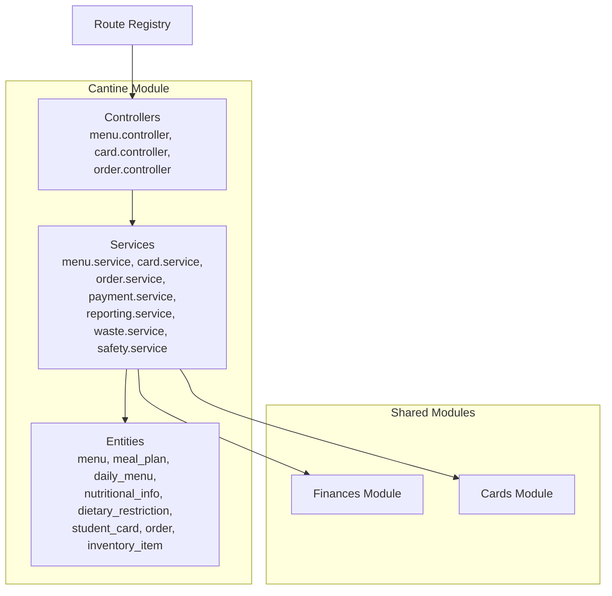
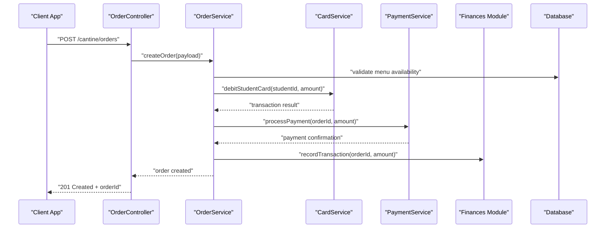
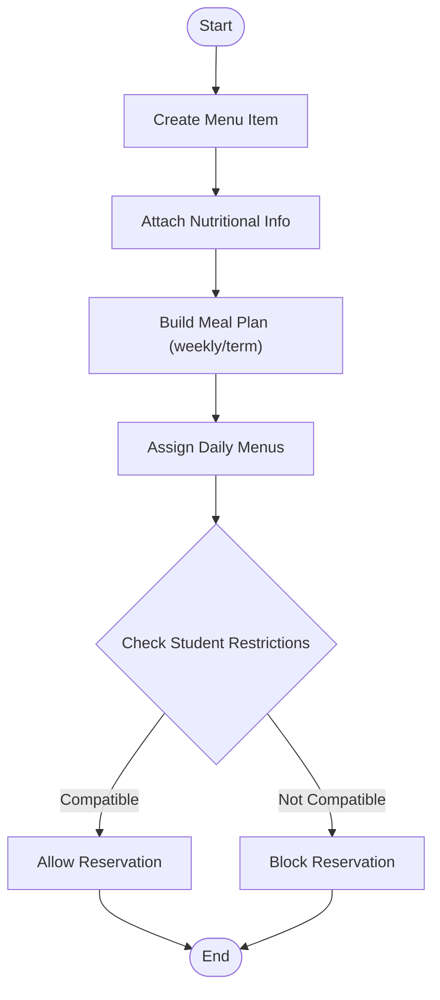
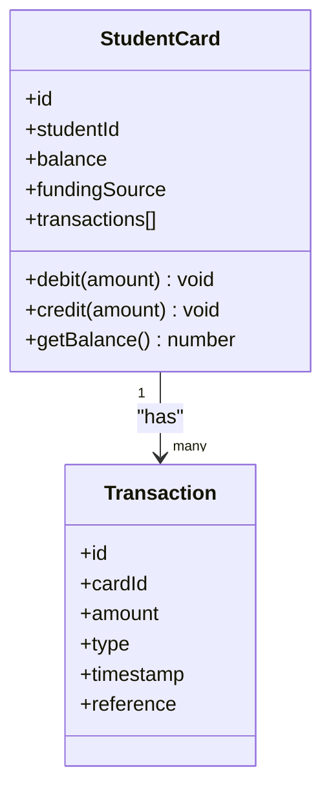
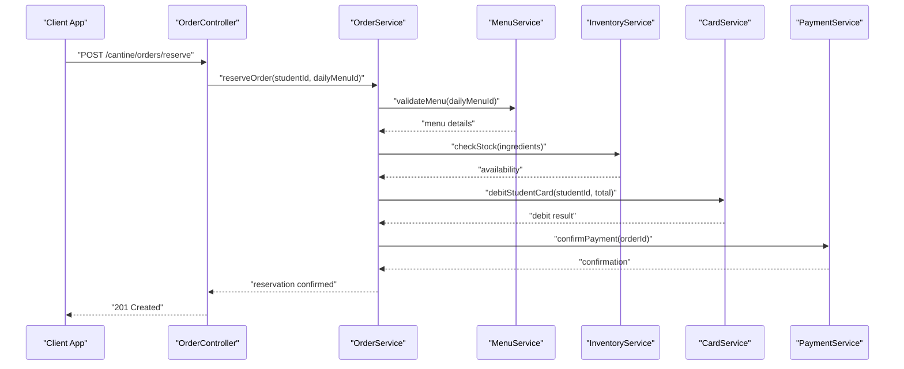
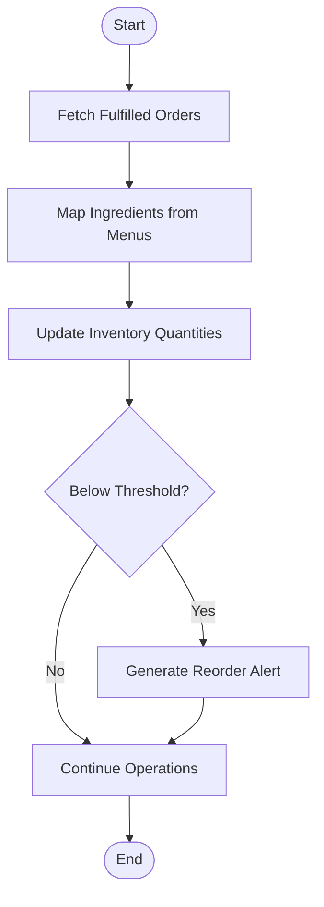
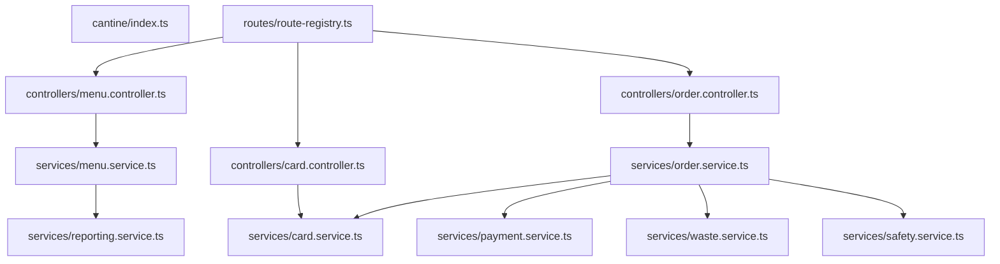

# Cafeteria & Meal Management

<cite>
**Referenced Files in This Document**
- [backend/src/modules/cantine/index.ts](file://backend/src/modules/cantine/index.ts)
- [backend/src/modules/cantine/entities/menu.entity.ts](file://backend/src/modules/cantine/entities/menu.entity.ts)
- [backend/src/modules/cantine/entities/meal_plan.entity.ts](file://backend/src/modules/cantine/entities/meal_plan.entity.ts)
- [backend/src/modules/cantine/entities/daily_menu.entity.ts](file://backend/src/modules/cantine/entities/daily_menu.entity.ts)
- [backend/src/modules/cantine/entities/nutritional_info.entity.ts](file://backend/src/modules/cantine/entities/nutritional_info.entity.ts)
- [backend/src/modules/cantine/entities/dietary_restriction.entity.ts](file://backend/src/modules/cantine/entities/dietary_restriction.entity.ts)
- [backend/src/modules/cantine/entities/student_card.entity.ts](file://backend/src/modules/cantine/entities/student_card.entity.ts)
- [backend/src/modules/cantine/entities/order.entity.ts](file://backend/src/modules/cantine/entities/order.entity.ts)
- [backend/src/modules/cantine/entities/inventory_item.entity.ts](file://backend/src/modules/cantine/entities/inventory_item.entity.ts)
- [backend/src/modules/cantine/controllers/menu.controller.ts](file://backend/src/modules/cantine/controllers/menu.controller.ts)
- [backend/src/modules/cantine/controllers/card.controller.ts](file://backend/src/modules/cantine/controllers/card.controller.ts)
- [backend/src/modules/cantine/controllers/order.controller.ts](file://backend/src/modules/cantine/controllers/order.controller.ts)
- [backend/src/modules/cantine/services/menu.service.ts](file://backend/src/modules/cantine/services/menu.service.ts)
- [backend/src/modules/cantine/services/card.service.ts](file://backend/src/modules/cantine/services/card.service.ts)
- [backend/src/modules/cantine/services/order.service.ts](file://backend/src/modules/cantine/services/order.service.ts)
- [backend/src/modules/cantine/services/payment.service.ts](file://backend/src/modules/cantine/services/payment.service.ts)
- [backend/src/modules/cantine/services/reporting.service.ts](file://backend/src/modules/cantine/services/reporting.service.ts)
- [backend/src/modules/cantine/services/waste.service.ts](file://backend/src/modules/cantine/services/waste.service.ts)
- [backend/src/modules/cantine/services/safety.service.ts](file://backend/src/modules/cantine/services/safety.service.ts)
- [backend/src/routes/route-registry.ts](file://backend/src/routes/route-registry.ts)
</cite>

## Table of Contents
1. [Introduction](#introduction)
2. [Project Structure](#project-structure)
3. [Core Components](#core-components)
4. [Architecture Overview](#architecture-overview)
5. [Detailed Component Analysis](#detailed-component-analysis)
6. [Dependency Analysis](#dependency-analysis)
7. [Performance Considerations](#performance-considerations)
8. [Troubleshooting Guide](#troubleshooting-guide)
9. [Conclusion](#conclusion)
10. [Appendices](#appendices)

## Introduction
This document describes the cafeteria and meal management system for eLISAschool. It covers:
- Meal plan configuration: daily menus, nutritional information, and dietary restrictions handling
- Student meal card management: balance tracking, automatic deductions, and parent funding options
- Ordering system: pre-meal reservations, walk-in purchases, and bulk meal orders
- Practical examples: menu planning, inventory management, and meal cost calculations
- Integrations: payment systems, nutritional compliance reporting, waste reduction analytics
- Food safety tracking and allergen management protocols

The goal is to provide both a high-level understanding and detailed implementation guidance for developers, administrators, and operators.

## Project Structure
The cafeteria module follows a layered architecture with clear separation between entities (data models), services (business logic), controllers (API endpoints), and routes (registration). The module integrates with shared modules such as finances and cards for payments and card operations.

**Diagram sources**
- [backend/src/modules/cantine/index.ts](file://backend/src/modules/cantine/index.ts)
- [backend/src/routes/route-registry.ts](file://backend/src/routes/route-registry.ts)

**Section sources**
- [backend/src/modules/cantine/index.ts](file://backend/src/modules/cantine/index.ts)
- [backend/src/routes/route-registry.ts](file://backend/src/routes/route-registry.ts)

## Core Components
- Menu and Meal Plans
  - Menu entity defines reusable dishes and categories
  - MealPlan aggregates multiple menus across weeks or terms
  - DailyMenu maps specific menus to calendar days, enabling dynamic scheduling
  - NutritionalInfo captures per-dish nutrition data for compliance and reporting
  - DietaryRestriction stores student-specific constraints (e.g., allergies, vegetarian)
- Student Card Management
  - StudentCard tracks balances, funding sources, and transaction history
  - Automatic deduction occurs at checkout; parent top-ups update balances
- Ordering System
  - Order represents reservations, walk-ins, and bulk orders
  - Supports reservation windows, capacity checks, and fulfillment status
- Inventory Management
  - InventoryItem tracks stock levels, consumption rates, and reorder thresholds
  - Links to menu items via recipes or ingredient mappings
- Reporting and Analytics
  - ReportingService provides nutritional compliance reports and financial summaries
  - WasteService calculates waste metrics and suggests reductions
- Safety and Allergen Management
  - SafetyService logs food safety events, batch tracking, and allergen alerts

**Section sources**
- [backend/src/modules/cantine/entities/menu.entity.ts](file://backend/src/modules/cantine/entities/menu.entity.ts)
- [backend/src/modules/cantine/entities/meal_plan.entity.ts](file://backend/src/modules/cantine/entities/meal_plan.entity.ts)
- [backend/src/modules/cantine/entities/daily_menu.entity.ts](file://backend/src/modules/cantine/entities/daily_menu.entity.ts)
- [backend/src/modules/cantine/entities/nutritional_info.entity.ts](file://backend/src/modules/cantine/entities/nutritional_info.entity.ts)
- [backend/src/modules/cantine/entities/dietary_restriction.entity.ts](file://backend/src/modules/cantine/entities/dietary_restriction.entity.ts)
- [backend/src/modules/cantine/entities/student_card.entity.ts](file://backend/src/modules/cantine/entities/student_card.entity.ts)
- [backend/src/modules/cantine/entities/order.entity.ts](file://backend/src/modules/cantine/entities/order.entity.ts)
- [backend/src/modules/cantine/entities/inventory_item.entity.ts](file://backend/src/modules/cantine/entities/inventory_item.entity.ts)

## Architecture Overview
The system exposes REST APIs through controllers, delegates business logic to services, and persists data via entities. Integration points include:
- Payment processing via PaymentService (external gateway integration)
- Financial accounting via Finances module
- Card operations via Cards module

**Diagram sources**
- [backend/src/modules/cantine/controllers/order.controller.ts](file://backend/src/modules/cantine/controllers/order.controller.ts)
- [backend/src/modules/cantine/services/order.service.ts](file://backend/src/modules/cantine/services/order.service.ts)
- [backend/src/modules/cantine/services/card.service.ts](file://backend/src/modules/cantine/services/card.service.ts)
- [backend/src/modules/cantine/services/payment.service.ts](file://backend/src/modules/cantine/services/payment.service.ts)

## Detailed Component Analysis

### Meal Plan Configuration
- Menu Planning
  - Define reusable menus with categories and pricing
  - Create weekly or term-based meal plans that reference multiple menus
  - Assign daily menus to calendar dates for precise scheduling
- Nutritional Information
  - Attach nutritional profiles to each menu item
  - Aggregate daily totals for compliance checks against standards
- Dietary Restrictions Handling
  - Store student-specific restrictions and preferences
  - Validate daily menus against restrictions before allowing reservations
- Example Workflow
  - Admin creates a new menu item with nutritional info
  - MealPlan includes several menus for a week
  - DailyMenu assigns specific menus to Monday–Friday
  - Students can only reserve meals compatible with their restrictions

**Diagram sources**
- [backend/src/modules/cantine/entities/menu.entity.ts](file://backend/src/modules/cantine/entities/menu.entity.ts)
- [backend/src/modules/cantine/entities/meal_plan.entity.ts](file://backend/src/modules/cantine/entities/meal_plan.entity.ts)
- [backend/src/modules/cantine/entities/daily_menu.entity.ts](file://backend/src/modules/cantine/entities/daily_menu.entity.ts)
- [backend/src/modules/cantine/entities/nutritional_info.entity.ts](file://backend/src/modules/cantine/entities/nutritional_info.entity.ts)
- [backend/src/modules/cantine/entities/dietary_restriction.entity.ts](file://backend/src/modules/cantine/entities/dietary_restriction.entity.ts)

**Section sources**
- [backend/src/modules/cantine/entities/menu.entity.ts](file://backend/src/modules/cantine/entities/menu.entity.ts)
- [backend/src/modules/cantine/entities/meal_plan.entity.ts](file://backend/src/modules/cantine/entities/meal_plan.entity.ts)
- [backend/src/modules/cantine/entities/daily_menu.entity.ts](file://backend/src/modules/cantine/entities/daily_menu.entity.ts)
- [backend/src/modules/cantine/entities/nutritional_info.entity.ts](file://backend/src/modules/cantine/entities/nutritional_info.entity.ts)
- [backend/src/modules/cantine/entities/dietary_restriction.entity.ts](file://backend/src/modules/cantine/entities/dietary_restriction.entity.ts)

### Student Meal Card Management
- Balance Tracking
  - Each student has a card with current balance and transaction log
  - Real-time updates on purchases and top-ups
- Automatic Deductions
  - At checkout, the system debits the student’s card automatically
  - Insufficient funds trigger fallback payment options or notifications
- Parent Funding Options
  - Parents can add funds to student cards via integrated payment methods
  - Top-up transactions are recorded and reflected immediately

**Diagram sources**
- [backend/src/modules/cantine/entities/student_card.entity.ts](file://backend/src/modules/cantine/entities/student_card.entity.ts)

**Section sources**
- [backend/src/modules/cantine/entities/student_card.entity.ts](file://backend/src/modules/cantine/entities/student_card.entity.ts)
- [backend/src/modules/cantine/services/card.service.ts](file://backend/src/modules/cantine/services/card.service.ts)

### Ordering System
- Pre-Meal Reservations
  - Students or parents reserve meals ahead of time
  - Capacity limits enforced based on daily menu assignments
- Walk-In Purchases
  - Immediate ordering with real-time inventory checks
  - Fallback to alternative items if out-of-stock
- Bulk Meal Orders
  - Group orders for classes or events
  - Batch processing and consolidated billing

**Diagram sources**
- [backend/src/modules/cantine/controllers/order.controller.ts](file://backend/src/modules/cantine/controllers/order.controller.ts)
- [backend/src/modules/cantine/services/order.service.ts](file://backend/src/modules/cantine/services/order.service.ts)
- [backend/src/modules/cantine/services/menu.service.ts](file://backend/src/modules/cantine/services/menu.service.ts)
- [backend/src/modules/cantine/services/card.service.ts](file://backend/src/modules/cantine/services/card.service.ts)
- [backend/src/modules/cantine/services/payment.service.ts](file://backend/src/modules/cantine/services/payment.service.ts)

**Section sources**
- [backend/src/modules/cantine/controllers/order.controller.ts](file://backend/src/modules/cantine/controllers/order.controller.ts)
- [backend/src/modules/cantine/services/order.service.ts](file://backend/src/modules/cantine/services/order.service.ts)
- [backend/src/modules/cantine/services/menu.service.ts](file://backend/src/modules/cantine/services/menu.service.ts)
- [backend/src/modules/cantine/services/card.service.ts](file://backend/src/modules/cantine/services/card.service.ts)
- [backend/src/modules/cantine/services/payment.service.ts](file://backend/src/modules/cantine/services/payment.service.ts)

### Inventory Management
- Stock Levels
  - Track quantities per ingredient or component
  - Auto-decrement on fulfilled orders
- Consumption Rates
  - Historical usage informs forecasting and reordering
- Reorder Thresholds
  - Alerts when stock falls below configured minimums
- Recipe Mapping
  - Link ingredients to menu items for accurate consumption calculation

**Diagram sources**
- [backend/src/modules/cantine/entities/inventory_item.entity.ts](file://backend/src/modules/cantine/entities/inventory_item.entity.ts)

**Section sources**
- [backend/src/modules/cantine/entities/inventory_item.entity.ts](file://backend/src/modules/cantine/entities/inventory_item.entity.ts)

### Meal Cost Calculations
- Pricing Rules
  - Base price per menu item with modifiers for extras or discounts
- Aggregation
  - Sum line items for total order cost
- Adjustments
  - Apply subsidies, parental contributions, or promotional credits
- Billing Integration
  - Record charges in financial ledger and reconcile with payments

[No sources needed since this section provides general guidance]

### Reporting and Analytics
- Nutritional Compliance
  - Generate daily and weekly reports comparing intake vs. standards
- Waste Reduction
  - Track leftovers and spoilage; suggest menu adjustments
- Financial Summaries
  - Revenue by day/week/month; top-selling items; refund analysis

**Section sources**
- [backend/src/modules/cantine/services/reporting.service.ts](file://backend/src/modules/cantine/services/reporting.service.ts)
- [backend/src/modules/cantine/services/waste.service.ts](file://backend/src/modules/cantine/services/waste.service.ts)

### Food Safety and Allergen Management
- Safety Tracking
  - Log batch numbers, supplier info, and expiration dates
  - Incident reporting and recall workflows
- Allergen Protocols
  - Tag menu items with allergens
  - Cross-check against student restrictions before fulfillment
- Audit Trails
  - Maintain immutable records for compliance and traceability

**Section sources**
- [backend/src/modules/cantine/services/safety.service.ts](file://backend/src/modules/cantine/services/safety.service.ts)
- [backend/src/modules/cantine/entities/dietary_restriction.entity.ts](file://backend/src/modules/cantine/entities/dietary_restriction.entity.ts)

## Dependency Analysis
The cantine module depends on shared modules for payments and card operations, and registers its routes centrally.

**Diagram sources**
- [backend/src/modules/cantine/index.ts](file://backend/src/modules/cantine/index.ts)
- [backend/src/routes/route-registry.ts](file://backend/src/routes/route-registry.ts)
- [backend/src/modules/cantine/controllers/menu.controller.ts](file://backend/src/modules/cantine/controllers/menu.controller.ts)
- [backend/src/modules/cantine/controllers/card.controller.ts](file://backend/src/modules/cantine/controllers/card.controller.ts)
- [backend/src/modules/cantine/controllers/order.controller.ts](file://backend/src/modules/cantine/controllers/order.controller.ts)
- [backend/src/modules/cantine/services/menu.service.ts](file://backend/src/modules/cantine/services/menu.service.ts)
- [backend/src/modules/cantine/services/card.service.ts](file://backend/src/modules/cantine/services/card.service.ts)
- [backend/src/modules/cantine/services/order.service.ts](file://backend/src/modules/cantine/services/order.service.ts)
- [backend/src/modules/cantine/services/payment.service.ts](file://backend/src/modules/cantine/services/payment.service.ts)
- [backend/src/modules/cantine/services/reporting.service.ts](file://backend/src/modules/cantine/services/reporting.service.ts)
- [backend/src/modules/cantine/services/waste.service.ts](file://backend/src/modules/cantine/services/waste.service.ts)
- [backend/src/modules/cantine/services/safety.service.ts](file://backend/src/modules/cantine/services/safety.service.ts)

**Section sources**
- [backend/src/modules/cantine/index.ts](file://backend/src/modules/cantine/index.ts)
- [backend/src/routes/route-registry.ts](file://backend/src/routes/route-registry.ts)

## Performance Considerations
- Indexing
  - Ensure indexes on frequently queried fields (studentId, date, orderId)
- Caching
  - Cache daily menus and nutritional data for read-heavy endpoints
- Batching
  - Use batch operations for bulk orders and inventory updates
- Concurrency
  - Implement optimistic locking for card balances and inventory counts
- Pagination
  - Paginate large lists (orders, transactions) to reduce payload sizes

[No sources needed since this section provides general guidance]

## Troubleshooting Guide
- Common Issues
  - Insufficient funds: verify card balance and funding source; retry with alternate payment method
  - Out-of-stock: check inventory thresholds and reorder alerts; substitute menu items
  - Allergen conflicts: review dietary restrictions and allergen tags; block incompatible reservations
- Diagnostics
  - Review audit trails for transactions and safety incidents
  - Validate menu-compliance reports for nutritional deviations
- Recovery Steps
  - Reverse failed transactions and restore inventory consistency
  - Notify affected students/parents and offer alternatives

**Section sources**
- [backend/src/modules/cantine/services/card.service.ts](file://backend/src/modules/cantine/services/card.service.ts)
- [backend/src/modules/cantine/services/reporting.service.ts](file://backend/src/modules/cantine/services/reporting.service.ts)
- [backend/src/modules/cantine/services/safety.service.ts](file://backend/src/modules/cantine/services/safety.service.ts)

## Conclusion
The eLISAschool cafeteria and meal management system provides robust capabilities for meal planning, student card operations, ordering, inventory control, reporting, and safety compliance. Its modular design enables clear separation of concerns, easy integration with payment and finance systems, and scalable performance for busy school environments.

[No sources needed since this section summarizes without analyzing specific files]

## Appendices
- API Endpoints Reference
  - Menu endpoints: create, update, list, assign daily
  - Card endpoints: debit, credit, get balance, transaction history
  - Order endpoints: reserve, walk-in purchase, bulk order, status
- Data Models Summary
  - Menu, MealPlan, DailyMenu, NutritionalInfo, DietaryRestriction
  - StudentCard, Order, InventoryItem
- Operational Playbooks
  - Weekly menu planning checklist
  - Inventory replenishment workflow
  - Allergen incident response procedure

[No sources needed since this section provides general guidance]