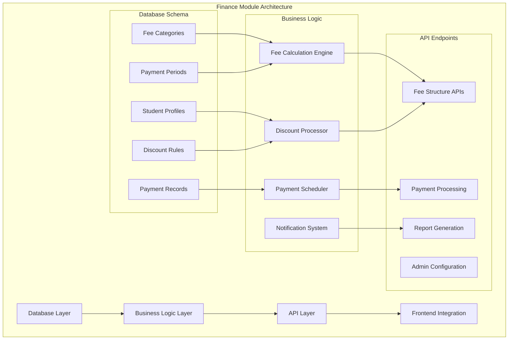
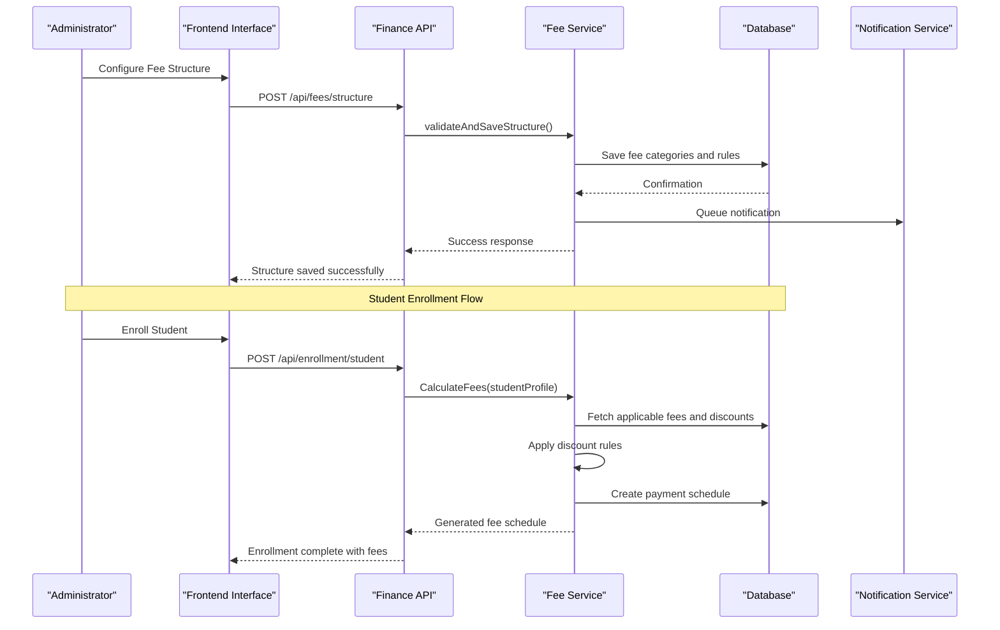
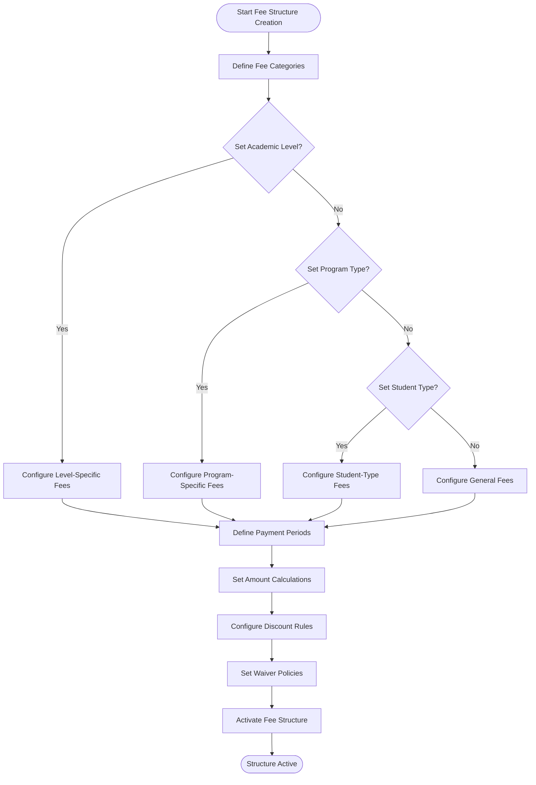
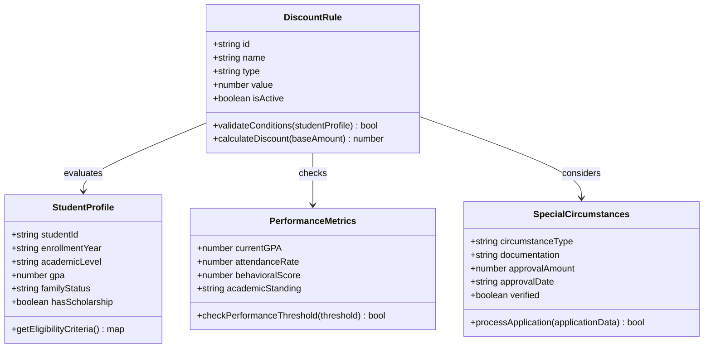
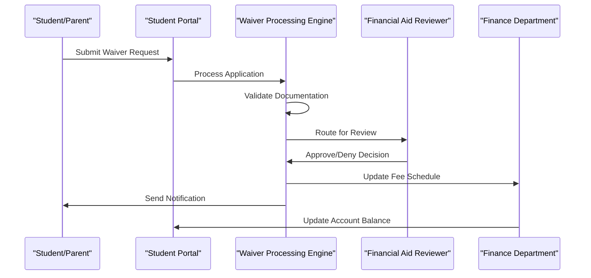
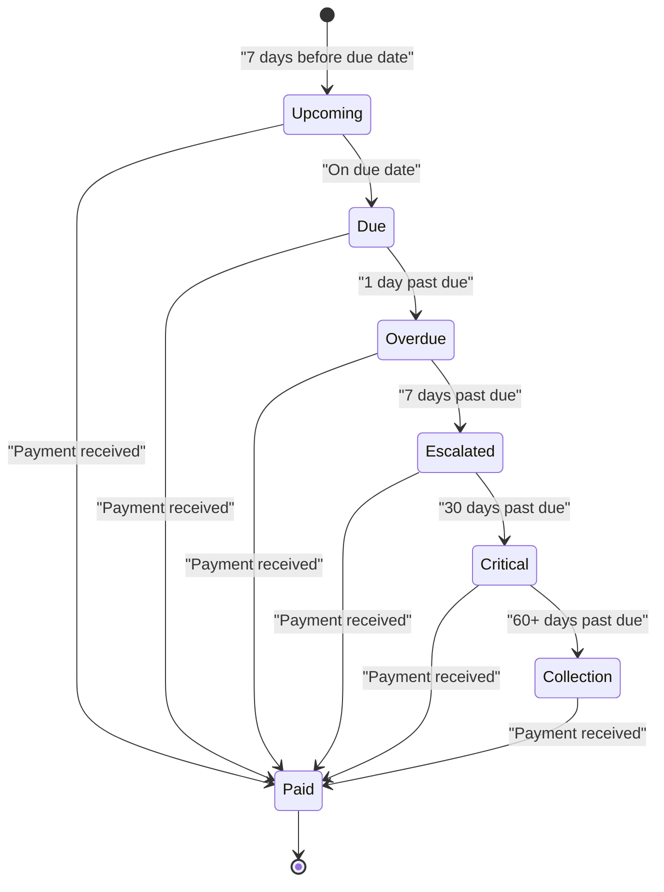
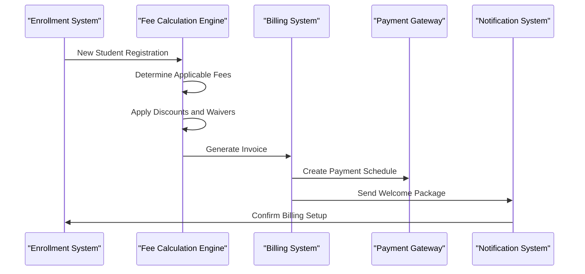
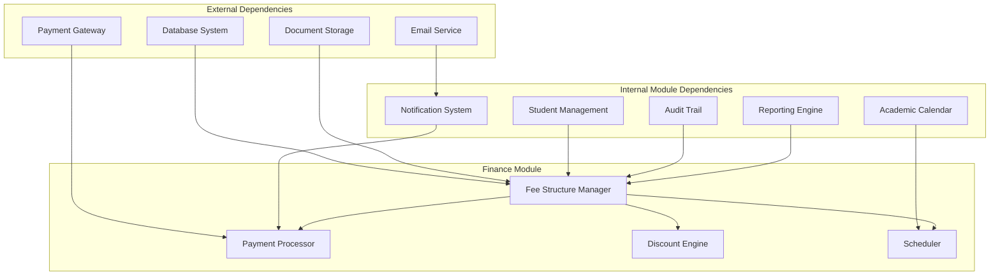

# Fee Structure Management

<cite>
**Referenced Files in This Document**
- [010-module-finances.sql](file://backend/database/migrations/010-module-finances.sql)
- [011-module-finances-part2.sql](file://backend/database/migrations/011-module-finances-part2.sql)
- [012-module-finances-part3-parametres.sql](file://backend/database/migrations/012-module-finances-part3-parametres.sql)
- [013-module-finances-phase1-granularite.sql](file://backend/database/migrations/013-module-finances-phase1-granularite.sql)
- [014-module-finances-phase2-section.sql](file://backend/database/migrations/014-module-finances-phase2-section.sql)
- [IMPLEMENTATION-COMPLETE-FINANCES.md](file://docs/implementations/IMPLEMENTATION-COMPLETE-FINANCES.md)
- [ANALYSE-GESTION-FINANCIERE.md](file://docs/analyses/ANALYSE-GESTION-FINANCIERE.md)
- [ANALYSE-FRAIS-REMISES-COHERENCE.md](file://docs/analyses/ANALYSE-FRAIS-REMISES-COHERENCE.md)
- [API-FINANCES.md](file://docs/API-FINANCES.md)
- [GUIDE-DEPLOIEMENT-FINANCES.md](file://docs/GUIDE-DEPLOIEMENT-FINANCES.md)
</cite>

## Table of Contents
1. [Introduction](#introduction)
2. [Project Structure](#project-structure)
3. [Core Components](#core-components)
4. [Architecture Overview](#architecture-overview)
5. [Detailed Component Analysis](#detailed-component-analysis)
6. [Dependency Analysis](#dependency-analysis)
7. [Performance Considerations](#performance-considerations)
8. [Troubleshooting Guide](#troubleshooting-guide)
9. [Conclusion](#conclusion)
10. [Appendices](#appendices)

## Introduction

eLISAschool's Fee Structure Management System is a comprehensive financial module designed to handle complex school fee structures, payment processing, discounts, waivers, and automated billing workflows. The system supports multi-level academic institutions with diverse fee categories, flexible payment plans, and sophisticated discount mechanisms based on student profiles and academic performance.

The fee management system integrates seamlessly with student enrollment workflows, providing automated billing processes, installment schedules, late fee policies, and automatic reminders. It supports various academic levels, scholarship programs, and fee adjustments while maintaining audit trails and compliance requirements.

## Project Structure

The fee structure management system is implemented as part of the broader eLISAschool platform, following a modular architecture pattern. The finance module is organized into distinct phases, each building upon previous functionality to provide comprehensive financial management capabilities.

**Diagram sources**
- [010-module-finances.sql:1-50](file://backend/database/migrations/010-module-finances.sql#L1-L50)
- [011-module-finances-part2.sql:1-50](file://backend/database/migrations/011-module-finances-part2.sql#L1-L50)

**Section sources**
- [010-module-finances.sql:1-100](file://backend/database/migrations/010-module-finances.sql#L1-L100)
- [011-module-finances-part2.sql:1-100](file://backend/database/migrations/011-module-finances-part2.sql#L1-L100)

## Core Components

The fee structure management system consists of several core components that work together to provide comprehensive financial management capabilities:

### Fee Category Management
The system supports hierarchical fee categories that can be configured for different academic levels, programs, and student types. Each category can have multiple payment periods and associated rules.

### Payment Period Configuration
Flexible payment period definitions support monthly, quarterly, semester-based, or custom payment schedules. The system handles prorated calculations and partial payments.

### Discount and Waiver Engine
A sophisticated rule-based engine applies discounts and waivers based on student profiles, academic performance, family circumstances, and institutional policies.

### Payment Plan Management
Comprehensive payment plan configuration supports installment schedules, late fee policies, automatic reminders, and payment tracking across multiple channels.

**Section sources**
- [012-module-finances-part3-parametres.sql:1-100](file://backend/database/migrations/012-module-finances-part3-parametres.sql#L1-L100)
- [013-module-finances-phase1-granularite.sql:1-100](file://backend/database/migrations/013-module-finances-phase1-granularite.sql#L1-L100)

## Architecture Overview

The fee structure management system follows a layered architecture pattern with clear separation of concerns and well-defined interfaces between components.

**Diagram sources**
- [014-module-finances-phase2-section.sql:1-50](file://backend/database/migrations/014-module-finances-phase2-section.sql#L1-L50)
- [API-FINANCES.md:1-100](file://docs/API-FINANCES.md#L1-L100)

## Detailed Component Analysis

### Fee Structure Definition Workflow

The fee structure definition workflow encompasses the complete process from initial setup to active implementation across different academic levels.

#### Fee Categories Hierarchy
The system supports a hierarchical fee category structure that allows for granular control over different types of fees:

**Diagram sources**
- [010-module-finances.sql:50-150](file://backend/database/migrations/010-module-finances.sql#L50-L150)
- [011-module-finances-part2.sql:50-150](file://backend/database/migrations/011-module-finances-part2.sql#L50-L150)

#### Payment Period Configuration
Payment periods are defined with specific scheduling rules and calculation methods:

| Period Type | Description | Calculation Method | Minimum Duration | Maximum Duration |
|-------------|-------------|-------------------|------------------|------------------|
| Monthly | Standard monthly payments | Fixed amount per month | 1 month | 12 months |
| Quarterly | Three-month payment blocks | Proportional quarterly amounts | 3 months | 12 months |
| Semester | Two-semester academic year | Full semester amounts | 4 months | 8 months |
| Custom | Flexible custom periods | Configurable calculation rules | 1 month | 24 months |

#### Amount Calculation Engine
The amount calculation engine supports multiple pricing strategies:

- **Fixed Amount**: Static fee amounts regardless of other factors
- **Percentage-Based**: Fees calculated as percentage of base tuition
- **Tiered Pricing**: Different rates based on student categories or performance levels
- **Dynamic Adjustment**: Real-time adjustments based on enrollment changes or policy updates

**Section sources**
- [013-module-finances-phase1-granularite.sql:1-100](file://backend/database/migrations/013-module-finances-phase1-granularite.sql#L1-L100)
- [014-module-finances-phase2-section.sql:1-100](file://backend/database/migrations/014-module-finances-phase2-section.sql#L1-L100)

### Discount and Waiver System

The discount and waiver system implements conditional logic based on multiple criteria including student profiles, academic performance, and special circumstances.

#### Conditional Logic Framework

**Diagram sources**
- [ANALYSE-FRAIS-REMISES-COHERENCE.md:1-100](file://docs/analyses/ANALYSE-FRAIS-REMISES-COHERENCE.md#L1-L100)

#### Scholarship Program Implementation

The system supports comprehensive scholarship program management with automated eligibility determination and application processing:

1. **Program Setup**: Define scholarship criteria, funding sources, and allocation limits
2. **Student Eligibility**: Automated assessment based on academic performance, financial need, and other criteria
3. **Application Processing**: Streamlined application workflow with document verification
4. **Award Management**: Tracking scholarship awards, disbursements, and compliance requirements

#### Waiver Processing Workflow

**Diagram sources**
- [IMPLEMENTATION-COMPLETE-FINANCES.md:1-100](file://docs/implementations/IMPLEMENTATION-COMPLETE-FINANCES.md#L1-L100)

**Section sources**
- [ANALYSE-FRAIS-REMISES-COHERENCE.md:1-200](file://docs/analyses/ANALYSE-FRAIS-REMISES-COHERENCE.md#L1-L200)
- [IMPLEMENTATION-COMPLETE-FINANCES.md:1-200](file://docs/implementations/IMPLEMENTATION-COMPLETE-FINANCES.md#L1-L200)

### Payment Plan Configuration

The payment plan configuration system provides comprehensive support for installment schedules, late fee policies, and automated reminder systems.

#### Installment Schedule Management

The system supports flexible installment configurations with the following features:

- **Custom Scheduling**: Define payment dates, amounts, and frequency
- **Proration Support**: Handle mid-year enrollments and early withdrawals
- **Auto-Renewal**: Automatic renewal of payment plans for subsequent terms
- **Modification Handling**: Process plan modifications during active periods

#### Late Fee Policy Engine

Late fee policies are configurable with multiple calculation methods:

| Policy Type | Calculation Method | Grace Period | Maximum Cap | Escalation Rule |
|-------------|-------------------|--------------|-------------|-----------------|
| Flat Fee | Fixed amount per late payment | 5 days | 10% of unpaid balance | None |
| Percentage | Percentage of overdue amount | 3 days | 15% of total debt | Increases monthly |
| Compound | Daily compounding interest | 2 days | Legal maximum | Exponential growth |
| Tiered | Different rates by duration | 7 days | 20% of balance | Steps increase |

#### Automatic Reminder System

The reminder system provides multi-channel communication with intelligent timing:

**Diagram sources**
- [012-module-finances-part3-parametres.sql:100-200](file://backend/database/migrations/012-module-finances-part3-parametres.sql#L100-L200)

**Section sources**
- [012-module-finances-part3-parametres.sql:1-200](file://backend/database/migrations/012-module-finances-part3-parametres.sql#L1-200)

### Practical Examples and Use Cases

#### Complex Fee Structure for Different Academic Levels

**Primary School Example:**
- Base tuition: $5,000/year
- Activity fees: $500/year (optional)
- Technology fee: $200/year (mandatory)
- Transportation: $1,200/year (optional)
- Discounts: 10% for siblings, 15% for early registration

**High School Example:**
- Base tuition: $8,000/year
- Laboratory fees: $800/year (science track)
- Art supplies: $300/year (arts track)
- Advanced placement: $500/course (optional)
- Scholarships: Merit-based up to 50%, Need-based up to 75%

#### Scholarship Program Implementation

The system supports multiple scholarship types with automated processing:

1. **Merit Scholarships**: Based on GPA, test scores, and extracurricular achievements
2. **Need-Based Scholarships**: Determined through financial assessment and income verification
3. **Special Talent Scholarships**: For students with exceptional abilities in arts, sports, or academics
4. **Institutional Scholarships**: Funded by the school for strategic enrollment goals

#### Fee Adjustment Handling

The system provides comprehensive fee adjustment capabilities:

- **Mid-Year Adjustments**: Handle enrollment changes, program switches, and withdrawals
- **Policy Updates**: Apply new fee structures to existing students with grandfathering options
- **Emergency Adjustments**: Process urgent fee modifications with proper authorization workflows
- **Audit Trail**: Maintain complete history of all fee changes with justification documentation

**Section sources**
- [ANALYSE-GESTION-FINANCIERE.md:1-200](file://docs/analyses/ANALYSE-GESTION-FINANCIERE.md#L1-L200)
- [API-FINANCES.md:1-200](file://docs/API-FINANCES.md#L1-L200)

### Integration with Student Enrollment Workflows

The fee structure management system integrates seamlessly with student enrollment processes, providing automated billing and payment scheduling.

#### Enrollment-to-Billing Pipeline

#### Automated Billing Processes

The automated billing system handles recurring payments, invoice generation, and payment processing:

- **Invoice Generation**: Automatic creation of invoices based on fee schedules
- **Payment Processing**: Integration with multiple payment gateways and methods
- **Receipt Management**: Automated receipt generation and distribution
- **Account Reconciliation**: Daily reconciliation of payments and account balances

#### Real-Time Fee Calculation

The system provides real-time fee calculation during enrollment:

- **Instant Quotation**: Immediate fee estimates for prospective students
- **Scenario Modeling**: Compare different payment plans and discount combinations
- **Approval Workflows**: Multi-level approval for fee exceptions and adjustments
- **Audit Compliance**: Complete audit trail for all fee-related transactions

**Section sources**
- [GUIDE-DEPLOIEMENT-FINANCES.md:1-200](file://docs/GUIDE-DEPLOIEMENT-FINANCES.md#L1-L200)
- [API-FINANCES.md:1-200](file://docs/API-FINANCES.md#L1-L200)

## Dependency Analysis

The fee structure management system has well-defined dependencies and integration points with other modules within the eLISAschool platform.

**Diagram sources**
- [010-module-finances.sql:1-100](file://backend/database/migrations/010-module-finances.sql#L1-L100)
- [IMPLEMENTATION-COMPLETE-FINANCES.md:1-100](file://docs/implementations/IMPLEMENTATION-COMPLETE-FINANCES.md#L1-L100)

### Component Coupling and Cohesion

The finance module demonstrates high cohesion within its functional areas while maintaining loose coupling with external systems through well-defined APIs and event-driven communication patterns.

### External Dependencies and Integration Points

Key external integrations include:

- **Database Systems**: PostgreSQL for persistent storage with transaction support
- **Payment Gateways**: Multiple payment processor integrations for diverse payment methods
- **Email Services**: Transactional email delivery for notifications and receipts
- **Document Storage**: Secure storage for financial documents and supporting materials

### Interface Contracts and Implementation Details

The system exposes RESTful APIs with comprehensive error handling, validation, and authentication mechanisms. All financial operations maintain strict ACID properties and provide detailed audit trails.

**Section sources**
- [API-FINANCES.md:1-200](file://docs/API-FINANCES.md#L1-L200)
- [IMPLEMENTATION-COMPLETE-FINANCES.md:1-200](file://docs/implementations/IMPLEMENTATION-COMPLETE-FINANCES.md#L1-L200)

## Performance Considerations

The fee structure management system is designed with performance optimization in mind, particularly for large-scale deployments with thousands of students and complex fee structures.

### Database Optimization Strategies

- **Indexing Strategy**: Strategic indexing on frequently queried fields such as student IDs, fee categories, and payment dates
- **Query Optimization**: Efficient SQL queries with proper joins and filtering to minimize database load
- **Connection Pooling**: Optimized database connection management for concurrent access scenarios
- **Archival Policies**: Automated archival of historical data to maintain optimal database performance

### Caching Mechanisms

- **Fee Structure Cache**: In-memory caching of active fee structures to reduce database queries
- **Discount Rule Cache**: Cached evaluation of discount rules for frequently accessed student profiles
- **Payment Schedule Cache**: Pre-computed payment schedules for upcoming billing cycles

### Scalability Considerations

- **Horizontal Scaling**: Stateless service design enabling horizontal scaling across multiple instances
- **Load Balancing**: Intelligent request distribution across backend instances
- **Queue Processing**: Asynchronous processing for heavy computational tasks like bulk fee calculations
- **Monitoring and Alerting**: Comprehensive monitoring for performance metrics and capacity planning

## Troubleshooting Guide

Common issues and their resolution strategies in the fee structure management system:

### Fee Calculation Errors

**Symptoms**: Incorrect fee amounts, missing discounts, or calculation timeouts
**Resolution Steps**:
1. Verify fee structure configuration and active status
2. Check student profile completeness and eligibility criteria
3. Review discount rule conditions and priority ordering
4. Examine system logs for calculation errors and timeout indicators

### Payment Processing Failures

**Symptoms**: Payment gateway errors, failed transactions, or duplicate charges
**Resolution Steps**:
1. Validate payment gateway connectivity and credentials
2. Check for duplicate payment attempts and idempotency keys
3. Review transaction logs and error messages from payment providers
4. Implement retry mechanisms with exponential backoff

### Notification Delivery Issues

**Symptoms**: Missing payment reminders, failed email delivery, or incorrect recipient lists
**Resolution Steps**:
1. Verify email service configuration and template availability
2. Check recipient contact information and notification preferences
3. Review email queue status and delivery logs
4. Implement fallback notification channels for critical communications

### Performance Degradation

**Symptoms**: Slow fee calculations, delayed payment processing, or system timeouts
**Resolution Steps**:
1. Monitor database query performance and identify slow queries
2. Check cache hit ratios and implement cache warming strategies
3. Review system resource utilization and scale horizontally if needed
4. Optimize batch processing jobs and adjust scheduling intervals

**Section sources**
- [ANALYSE-GESTION-FINANCIERE.md:1-200](file://docs/analyses/ANALYSE-GESTION-FINANCIERE.md#L1-L200)
- [GUIDE-DEPLOIEMENT-FINANCES.md:1-200](file://docs/GUIDE-DEPLOIEMENT-FINANCES.md#L1-L200)

## Conclusion

The eLISAschool Fee Structure Management System provides a comprehensive, scalable, and flexible solution for managing complex educational institution finances. The system's modular architecture, sophisticated discount and waiver engine, and seamless integration with enrollment workflows make it suitable for institutions of all sizes and complexity levels.

Key strengths of the system include its extensible fee category structure, powerful conditional logic for discounts and waivers, flexible payment plan configuration, and robust automation capabilities. The system maintains high performance standards while providing comprehensive audit trails and compliance features.

Future enhancements may include advanced analytics capabilities, machine learning-based fee optimization, expanded payment method support, and enhanced reporting dashboards for financial administrators.

## Appendices

### API Reference Summary

The finance module exposes comprehensive REST APIs for all fee management operations, including:

- **Fee Structure Management**: CRUD operations for fee categories, payment periods, and calculation rules
- **Student Fee Processing**: Real-time fee calculation, discount application, and payment schedule generation
- **Payment Processing**: Payment initiation, status tracking, and reconciliation
- **Reporting and Analytics**: Financial reports, compliance documentation, and audit trails

### Configuration Guidelines

Best practices for configuring the fee structure management system include:

- Establish clear fee hierarchy and naming conventions
- Implement comprehensive discount rule testing before deployment
- Configure appropriate backup and disaster recovery procedures
- Set up monitoring and alerting for critical financial operations
- Train administrative staff on system usage and troubleshooting procedures