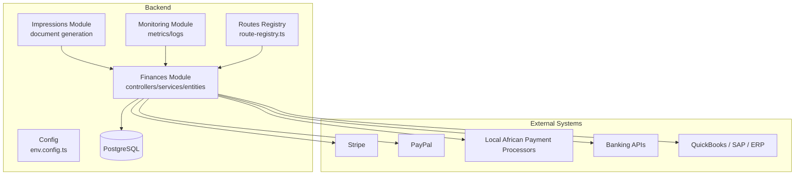
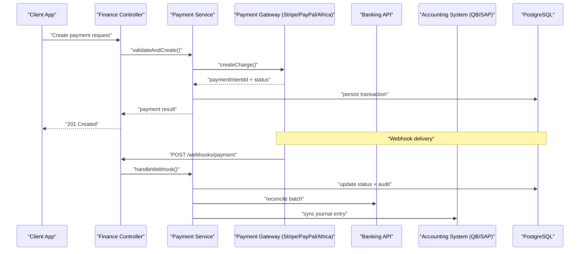
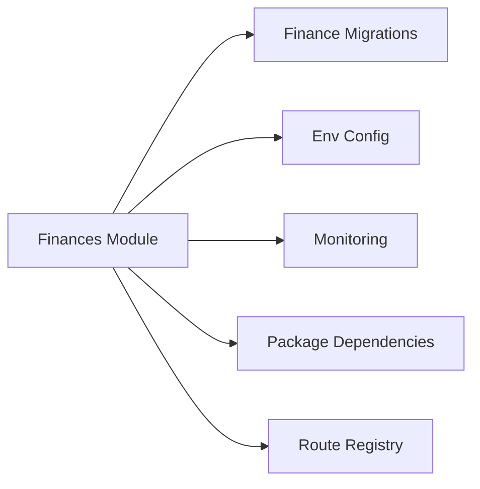

# Financial Integration & External Systems

<cite>
**Referenced Files in This Document**
- [backend/src/modules/finances](file://backend/src/modules/finances)
- [backend/database/migrations/010-module-finances.sql](file://backend/database/migrations/010-module-finances.sql)
- [backend/database/migrations/011-module-finances-part2.sql](file://backend/database/migrations/011-module-finances-part2.sql)
- [backend/database/migrations/012-module-finances-part3-parametres.sql](file://backend/database/migrations/012-module-finances-part3-parametres.sql)
- [backend/database/migrations/013-module-finances-phase1-granularite.sql](file://backend/database/migrations/013-module-finances-phase1-granularite.sql)
- [backend/database/migrations/014-module-finances-phase2-section.sql](file://backend/database/migrations/014-module-finances-phase2-section.sql)
- [backend/database/migrations/049-ameliorations-inscription-finances.sql](file://backend/database/migrations/049-ameliorations-inscription-finances.sql)
- [backend/database/migrations/050-ameliorations-inscription-relances.sql](file://backend/database/migrations/050-ameliorations-inscription-relances.sql)
- [backend/database/migrations/099-add-monitoring-params.sql](file://backend/database/migrations/099-add-monitoring-params.sql)
- [backend/src/modules/impressions](file://backend/src/modules/impressions)
- [backend/src/modules/monitoring](file://backend/src/modules/monitoring)
- [backend/src/config/env.config.ts](file://backend/src/config/env.config.ts)
- [backend/src/common/utils](file://backend/src/common/utils)
- [backend/src/routes/route-registry.ts](file://backend/src/routes/route-registry.ts)
- [backend/package.json](file://backend/package.json)
- [docs/API-FINANCES.md](file://docs/API-FINANCES.md)
- [docs/IMPLEMENTATION-COMPLETE-FINANCES.md](file://docs/IMPLEMENTATION-COMPLETE-FINANCES.md)
- [docs/ANALYSE-GESTION-FINANCIERE.md](file://docs/ANALYSE-GESTION-FINANCIERE.md)
- [docs/AMÉLIORATIONS-FINANCES-FINAL.md](file://docs/AMÉLIORATIONS-FINANCES-FINAL.md)
</cite>

## Table of Contents
1. [Introduction](#introduction)
2. [Project Structure](#project-structure)
3. [Core Components](#core-components)
4. [Architecture Overview](#architecture-overview)
5. [Detailed Component Analysis](#detailed-component-analysis)
6. [Dependency Analysis](#dependency-analysis)
7. [Performance Considerations](#performance-considerations)
8. [Troubleshooting Guide](#troubleshooting-guide)
9. [Conclusion](#conclusion)
10. [Appendices](#appendices)

## Introduction
This document describes eLISAschool’s financial integration capabilities with external systems and third-party services. It focuses on:
- Payment gateway integrations (Stripe, PayPal, and local African payment processors)
- Banking system connections for reconciliation and direct deposit processing
- Accounting software integrations (QuickBooks, SAP, and others)
- Webhook implementations, API authentication, and error handling strategies
- Document generation services for invoices, receipts, and financial certificates
- Security protocols, data encryption, and compliance considerations
- Troubleshooting guides and monitoring approaches

The content synthesizes the finance module structure, database schema evolution, configuration patterns, and available documentation to provide a comprehensive guide for developers and integrators.

## Project Structure
The financial integration surface is primarily implemented under the finances module, supported by migrations that define the financial data model and features. Supporting modules include impressions for document generation and monitoring for observability. Configuration and environment variables are centralized, and routes are registered centrally.

**Diagram sources**
- [backend/src/modules/finances](file://backend/src/modules/finances)
- [backend/src/modules/impressions](file://backend/src/modules/impressions)
- [backend/src/modules/monitoring](file://backend/src/modules/monitoring)
- [backend/src/config/env.config.ts](file://backend/src/config/env.config.ts)
- [backend/src/routes/route-registry.ts](file://backend/src/routes/route-registry.ts)

**Section sources**
- [backend/src/modules/finances](file://backend/src/modules/finances)
- [backend/src/modules/impressions](file://backend/src/modules/impressions)
- [backend/src/modules/monitoring](file://backend/src/modules/monitoring)
- [backend/src/config/env.config.ts](file://backend/src/config/env.config.ts)
- [backend/src/routes/route-registry.ts](file://backend/src/routes/route-registry.ts)

## Core Components
- Finance domain entities and workflows: The finances module encapsulates fee management, payments, remittances, and related business logic. Migrations progressively introduce granularities, sections, and enrollment-related enhancements.
- Document generation: The impressions module provides templates and rendering utilities for invoices, receipts, and certificates.
- Monitoring and observability: The monitoring module exposes metrics and logging hooks to track financial operations and integration health.
- Configuration: Environment-driven settings centralize secrets and feature flags for payment gateways and banking connectors.
- Routing: Central route registration wires controllers to HTTP endpoints for webhooks and client interactions.

Key implementation references:
- Finance module source: [backend/src/modules/finances](file://backend/src/modules/finances)
- Impressions module source: [backend/src/modules/impressions](file://backend/src/modules/impressions)
- Monitoring module source: [backend/src/modules/monitoring](file://backend/src/modules/monitoring)
- Environment configuration: [backend/src/config/env.config.ts](file://backend/src/config/env.config.ts)
- Route registry: [backend/src/routes/route-registry.ts](file://backend/src/routes/route-registry.ts)

**Section sources**
- [backend/src/modules/finances](file://backend/src/modules/finances)
- [backend/src/modules/impressions](file://backend/src/modules/impressions)
- [backend/src/modules/monitoring](file://backend/src/modules/monitoring)
- [backend/src/config/env.config.ts](file://backend/src/config/env.config.ts)
- [backend/src/routes/route-registry.ts](file://backend/src/routes/route-registry.ts)

## Architecture Overview
The financial integration architecture follows a modular design:
- Controllers handle inbound requests and webhook payloads.
- Services orchestrate business logic, including payment creation, status updates, and reconciliation.
- Repositories interact with PostgreSQL via TypeORM entities defined through migrations.
- External integrations communicate over HTTPS using SDKs or REST APIs, with signatures verified and retries managed.
- Document generation uses templates to produce PDFs for invoices and receipts.
- Monitoring captures key events and errors for alerting and dashboards.

**Diagram sources**
- [backend/src/modules/finances](file://backend/src/modules/finances)
- [backend/src/routes/route-registry.ts](file://backend/src/routes/route-registry.ts)
- [backend/src/config/env.config.ts](file://backend/src/config/env.config.ts)

## Detailed Component Analysis

### Payment Gateway Integrations
eLISAschool supports multiple payment providers:
- Stripe: Create charges, capture payments, and process refunds via SDK calls. Webhooks update payment states and trigger downstream actions.
- PayPal: Similar lifecycle with order capture and refund flows; signature verification ensures authenticity.
- Local African processors: Country-specific adapters abstract differences while maintaining consistent interfaces for create, confirm, and reconcile operations.

Implementation guidance:
- Use environment variables for provider credentials and keys.
- Implement idempotency keys for all payment creation requests.
- Validate webhook signatures and payload schemas before processing.
- Persist provider IDs and statuses for traceability.

References:
- Finance module: [backend/src/modules/finances](file://backend/src/modules/finances)
- Environment config: [backend/src/config/env.config.ts](file://backend/src/config/env.config.ts)
- Routes: [backend/src/routes/route-registry.ts](file://backend/src/routes/route-registry.ts)

**Section sources**
- [backend/src/modules/finances](file://backend/src/modules/finances)
- [backend/src/config/env.config.ts](file://backend/src/config/env.config.ts)
- [backend/src/routes/route-registry.ts](file://backend/src/routes/route-registry.ts)

### Banking System Connections
For automatic reconciliation and direct deposit processing:
- Reconciliation: Periodic jobs fetch bank statements or use APIs to match transactions against internal records.
- Direct deposits: Batch file generation or API calls to initiate payouts to staff or vendors.
- Error handling: Retry policies, dead-letter queues, and alerts for unmatched transactions.

References:
- Finance module: [backend/src/modules/finances](file://backend/src/modules/finances)
- Monitoring: [backend/src/modules/monitoring](file://backend/src/modules/monitoring)

**Section sources**
- [backend/src/modules/finances](file://backend/src/modules/finances)
- [backend/src/modules/monitoring](file://backend/src/modules/monitoring)

### Accounting Software Integrations
Integrations with QuickBooks, SAP, and other ERPs:
- Sync journal entries for fees, payments, and adjustments.
- Map eLISAschool accounts to accounting chart-of-accounts.
- Ensure double-entry consistency and audit trails.

References:
- Finance module: [backend/src/modules/finances](file://backend/src/modules/finances)
- Monitoring: [backend/src/modules/monitoring](file://backend/src/modules/monitoring)

**Section sources**
- [backend/src/modules/finances](file://backend/src/modules/finances)
- [backend/src/modules/monitoring](file://backend/src/modules/monitoring)

### Webhook Implementations
Webhooks enable asynchronous updates from payment providers and banks:
- Endpoints receive event payloads, verify signatures, and update transaction states.
- Idempotent handlers prevent duplicate processing.
- Robust logging and metrics capture success/failure rates.

References:
- Routes: [backend/src/routes/route-registry.ts](file://backend/src/routes/route-registry.ts)
- Finance module: [backend/src/modules/finances](file://backend/src/modules/finances)

**Section sources**
- [backend/src/routes/route-registry.ts](file://backend/src/routes/route-registry.ts)
- [backend/src/modules/finances](file://backend/src/modules/finances)

### API Authentication
Authentication and authorization protect financial endpoints:
- JWT-based access tokens with short lifetimes and refresh mechanisms.
- Role-based permissions restrict sensitive operations.
- TLS enforced for all external communications.

References:
- Environment config: [backend/src/config/env.config.ts](file://backend/src/config/env.config.ts)
- Routes: [backend/src/routes/route-registry.ts](file://backend/src/routes/route-registry.ts)

**Section sources**
- [backend/src/config/env.config.ts](file://backend/src/config/env.config.ts)
- [backend/src/routes/route-registry.ts](file://backend/src/routes/route-registry.ts)

### Error Handling Strategies
- Provider-specific error mapping to user-friendly messages.
- Retry with exponential backoff for transient failures.
- Circuit breakers to avoid cascading failures.
- Audit logs for all financial mutations.

References:
- Common utils: [backend/src/common/utils](file://backend/src/common/utils)
- Finance module: [backend/src/modules/finances](file://backend/src/modules/finances)

**Section sources**
- [backend/src/common/utils](file://backend/src/common/utils)
- [backend/src/modules/finances](file://backend/src/modules/finances)

### Document Generation Services
Invoices, receipts, and financial certificates are generated via templates:
- Template engine renders structured data into PDFs.
- Templates stored and versioned for consistency.
- Generated documents linked to transactions for retrieval and download.

References:
- Impressions module: [backend/src/modules/impressions](file://backend/src/modules/impressions)
- Finance module: [backend/src/modules/finances](file://backend/src/modules/finances)

**Section sources**
- [backend/src/modules/impressions](file://backend/src/modules/impressions)
- [backend/src/modules/finances](file://backend/src/modules/finances)

### Security Protocols, Encryption, and Compliance
- Secrets management via environment variables and secure vaults.
- Data encryption at rest and in transit.
- PCI-DSS alignment for payment data handling.
- GDPR-compliant data retention and deletion policies.
- Comprehensive audit trails for regulatory reporting.

References:
- Environment config: [backend/src/config/env.config.ts](file://backend/src/config/env.config.ts)
- Finance module: [backend/src/modules/finances](file://backend/src/modules/finances)

**Section sources**
- [backend/src/config/env.config.ts](file://backend/src/config/env.config.ts)
- [backend/src/modules/finances](file://backend/src/modules/finances)

## Dependency Analysis
Financial integrations depend on:
- Database layer defined by migrations for entities and indexes.
- Configuration for provider credentials and feature toggles.
- Monitoring for observability and alerting.
- External SDKs and libraries declared in package manifests.

**Diagram sources**
- [backend/database/migrations/010-module-finances.sql](file://backend/database/migrations/010-module-finances.sql)
- [backend/database/migrations/011-module-finances-part2.sql](file://backend/database/migrations/011-module-finances-part2.sql)
- [backend/database/migrations/012-module-finances-part3-parametres.sql](file://backend/database/migrations/012-module-finances-part3-parametres.sql)
- [backend/database/migrations/013-module-finances-phase1-granularite.sql](file://backend/database/migrations/013-module-finances-phase1-granularite.sql)
- [backend/database/migrations/014-module-finances-phase2-section.sql](file://backend/database/migrations/014-module-finances-phase2-section.sql)
- [backend/database/migrations/049-ameliorations-inscription-finances.sql](file://backend/database/migrations/049-ameliorations-inscription-finances.sql)
- [backend/database/migrations/050-ameliorations-inscription-relances.sql](file://backend/database/migrations/050-ameliorations-inscription-relances.sql)
- [backend/database/migrations/099-add-monitoring-params.sql](file://backend/database/migrations/099-add-monitoring-params.sql)
- [backend/src/config/env.config.ts](file://backend/src/config/env.config.ts)
- [backend/src/modules/monitoring](file://backend/src/modules/monitoring)
- [backend/src/routes/route-registry.ts](file://backend/src/routes/route-registry.ts)
- [backend/package.json](file://backend/package.json)

**Section sources**
- [backend/database/migrations/010-module-finances.sql](file://backend/database/migrations/010-module-finances.sql)
- [backend/database/migrations/011-module-finances-part2.sql](file://backend/database/migrations/011-module-finances-part2.sql)
- [backend/database/migrations/012-module-finances-part3-parametres.sql](file://backend/database/migrations/012-module-finances-part3-parametres.sql)
- [backend/database/migrations/013-module-finances-phase1-granularite.sql](file://backend/database/migrations/013-module-finances-phase1-granularite.sql)
- [backend/database/migrations/014-module-finances-phase2-section.sql](file://backend/database/migrations/014-module-finances-phase2-section.sql)
- [backend/database/migrations/049-ameliorations-inscription-finances.sql](file://backend/database/migrations/049-ameliorations-inscription-finances.sql)
- [backend/database/migrations/050-ameliorations-inscription-relances.sql](file://backend/database/migrations/050-ameliorations-inscription-relances.sql)
- [backend/database/migrations/099-add-monitoring-params.sql](file://backend/database/migrations/099-add-monitoring-params.sql)
- [backend/src/config/env.config.ts](file://backend/src/config/env.config.ts)
- [backend/src/modules/monitoring](file://backend/src/modules/monitoring)
- [backend/src/routes/route-registry.ts](file://backend/src/routes/route-registry.ts)
- [backend/package.json](file://backend/package.json)

## Performance Considerations
- Indexes and query optimization: Migrations include performance-focused indexes to accelerate financial queries.
- Connection pooling: Configure database connection pools to handle peak loads.
- Asynchronous processing: Offload heavy tasks (document generation, reconciliation) to background workers.
- Caching: Cache read-heavy reference data (fee schedules, tax rules) with appropriate invalidation strategies.
- Rate limiting: Protect external API calls with throttling to respect provider limits.

[No sources needed since this section provides general guidance]

## Troubleshooting Guide
Common issues and resolutions:
- Webhook signature verification failures: Ensure correct secret configuration and timestamp validation.
- Duplicate payments: Verify idempotency keys and handler deduplication logic.
- Reconciliation mismatches: Inspect bank statement parsing and matching rules; review audit logs.
- Accounting sync errors: Check account mappings and journal entry formats; validate ERP credentials.
- Document generation failures: Confirm template availability and data completeness.

Operational checks:
- Monitor metrics and logs via the monitoring module.
- Review migration history for schema changes affecting integrations.
- Validate environment variables and secrets rotation procedures.

References:
- Monitoring module: [backend/src/modules/monitoring](file://backend/src/modules/monitoring)
- Finance module: [backend/src/modules/finances](file://backend/src/modules/finances)
- Monitoring params migration: [backend/database/migrations/099-add-monitoring-params.sql](file://backend/database/migrations/099-add-monitoring-params.sql)

**Section sources**
- [backend/src/modules/monitoring](file://backend/src/modules/monitoring)
- [backend/src/modules/finances](file://backend/src/modules/finances)
- [backend/database/migrations/099-add-monitoring-params.sql](file://backend/database/migrations/099-add-monitoring-params.sql)

## Conclusion
eLISAschool’s financial integration framework provides a robust foundation for connecting with payment gateways, banking systems, and accounting platforms. The modular design, comprehensive migrations, and supporting modules for document generation and monitoring ensure scalability, security, and maintainability. By following the recommended practices for authentication, error handling, and observability, teams can implement reliable integrations tailored to diverse regional requirements.

[No sources needed since this section summarizes without analyzing specific files]

## Appendices

### Practical Examples and References
- API documentation for finances: [docs/API-FINANCES.md](file://docs/API-FINANCES.md)
- Implementation summary for finances: [docs/IMPLEMENTATION-COMPLETE-FINANCES.md](file://docs/IMPLEMENTATION-COMPLETE-FINANCES.md)
- Financial analysis overview: [docs/ANALYSE-GESTION-FINANCIERE.md](file://docs/ANALYSE-GESTION-FINANCIERE.md)
- Final improvements for finances: [docs/AMÉLIORATIONS-FINANCES-FINAL.md](file://docs/AMÉLIORATIONS-FINANCES-FINAL.md)

**Section sources**
- [docs/API-FINANCES.md](file://docs/API-FINANCES.md)
- [docs/IMPLEMENTATION-COMPLETE-FINANCES.md](file://docs/IMPLEMENTATION-COMPLETE-FINANCES.md)
- [docs/ANALYSE-GESTION-FINANCIERE.md](file://docs/ANALYSE-GESTION-FINANCIERE.md)
- [docs/AMÉLIORATIONS-FINANCES-FINAL.md](file://docs/AMÉLIORATIONS-FINANCES-FINAL.md)