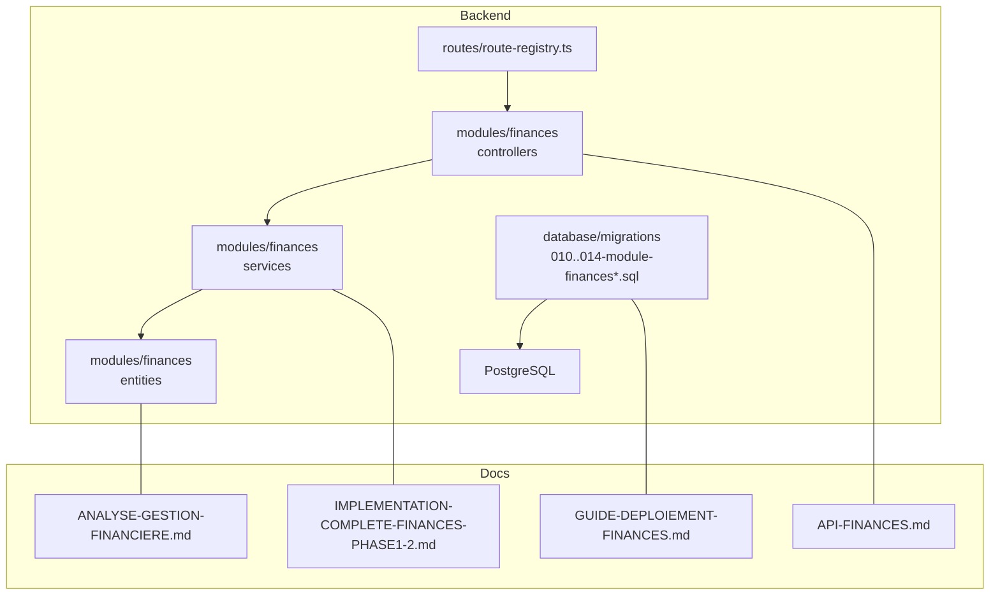
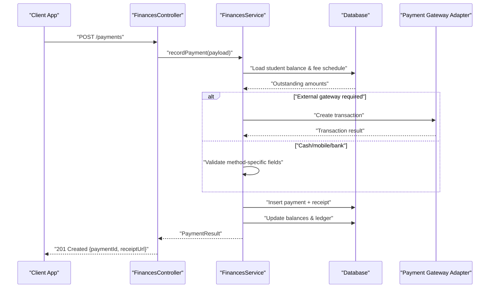
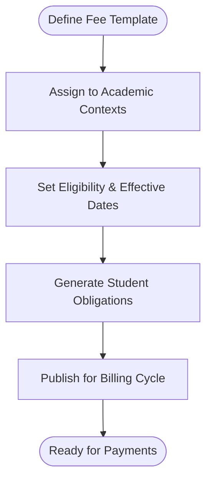
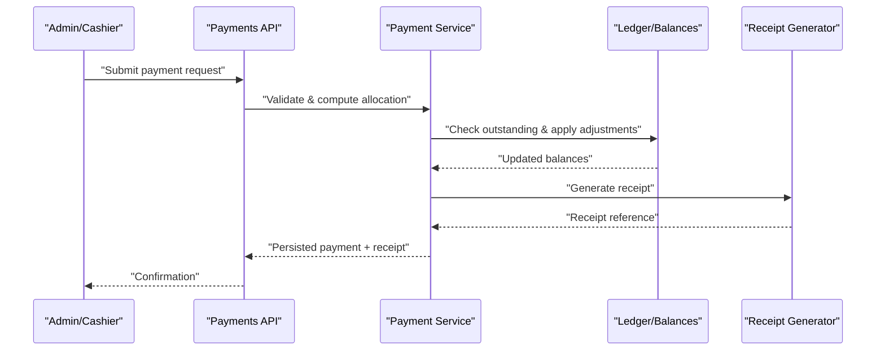
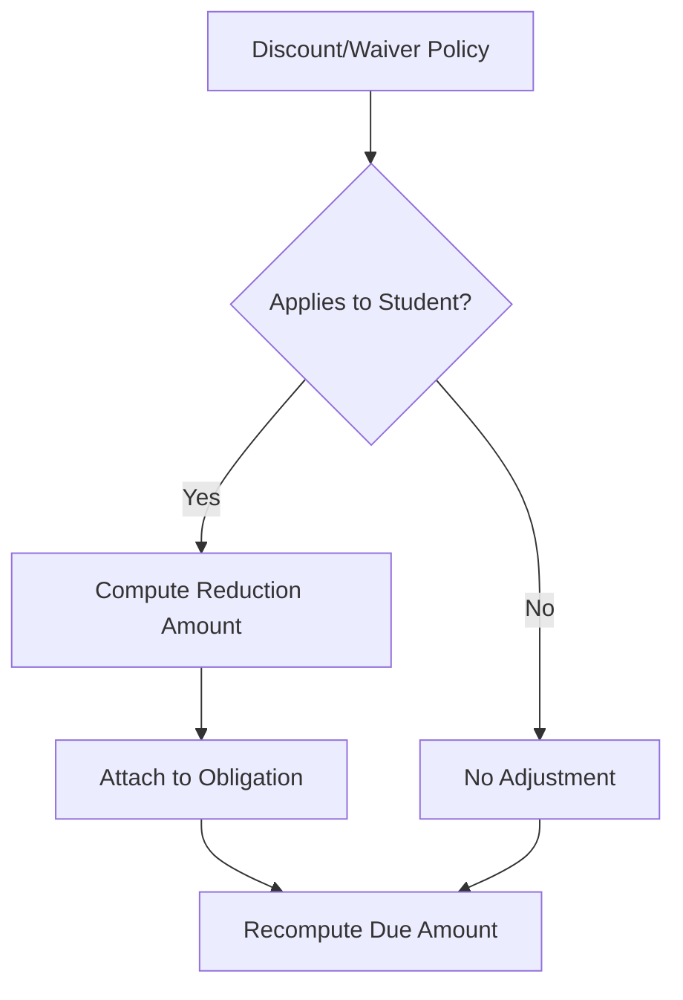
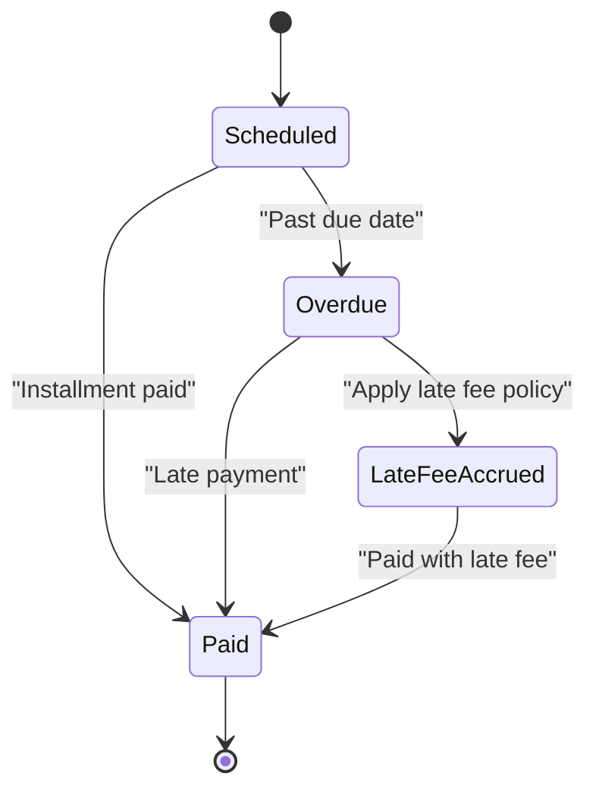
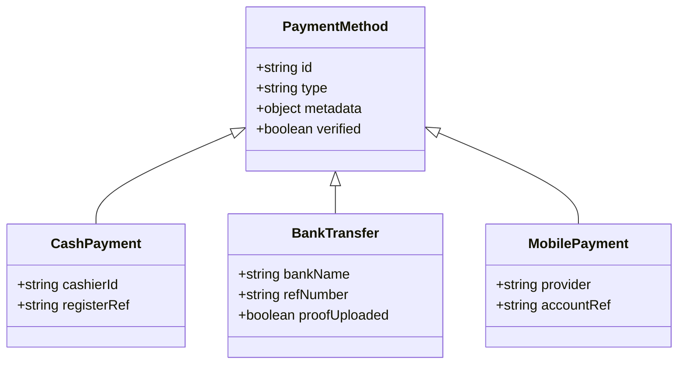
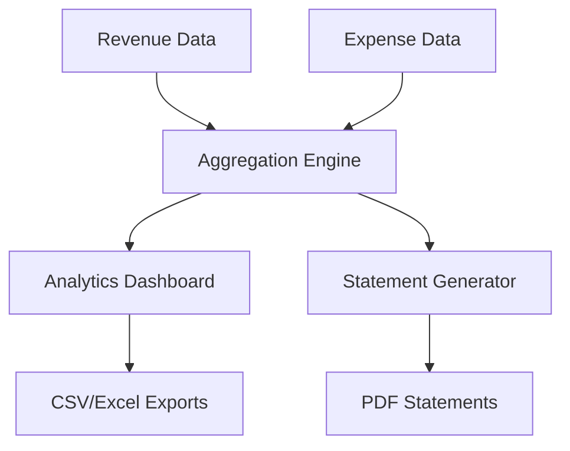
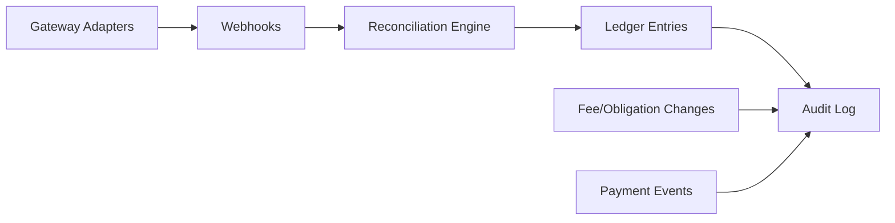
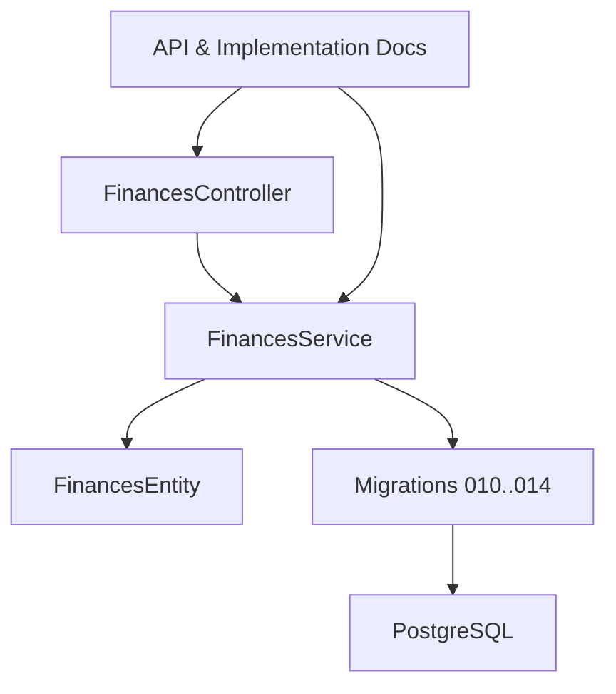

# Financial Management System

<cite>
**Referenced Files in This Document**
- [010-module-finances.sql](file://backend/database/migrations/010-module-finances.sql)
- [011-module-finances-part2.sql](file://backend/database/migrations/011-module-finances-part2.sql)
- [012-module-finances-part3-parametres.sql](file://backend/database/migrations/012-module-finances-part3-parametres.sql)
- [013-module-finances-phase1-granularite.sql](file://backend/database/migrations/013-module-finances-phase1-granularite.sql)
- [014-module-finances-phase2-section.sql](file://backend/database/migrations/014-module-finances-phase2-section.sql)
- [finances.controller.ts](file://backend/src/modules/finances/controllers/finances.controller.ts)
- [finances.service.ts](file://backend/src/modules/finances/services/finances.service.ts)
- [finances.entity.ts](file://backend/src/modules/finances/entities/finances.entity.ts)
- [API-FINANCES.md](file://docs/API-FINANCES.md)
- [IMPLEMENTATION-COMPLETE-FINANCES-PHASE1-2.md](file://docs/implementations/IMPLEMENTATION-COMPLETE-FINANCES-PHASE1-2.md)
- [ANALYSE-GESTION-FINANCIERE.md](file://docs/analyses/ANALYSE-GESTION-FINANCIERE.md)
- [GUIDE-DEPLOIEMENT-FINANCES.md](file://docs/GUIDE-DEPLOIEMENT-FINANCES.md)
</cite>

## Table of Contents
1. [Introduction](#introduction)
2. [Project Structure](#project-structure)
3. [Core Components](#core-components)
4. [Architecture Overview](#architecture-overview)
5. [Detailed Component Analysis](#detailed-component-analysis)
6. [Dependency Analysis](#dependency-analysis)
7. [Performance Considerations](#performance-considerations)
8. [Troubleshooting Guide](#troubleshooting-guide)
9. [Conclusion](#conclusion)
10. [Appendices](#appendices)

## Introduction
This document explains eLISAschool’s financial management system with a focus on fee structure management, payment processing, and financial reporting. It covers the end-to-end workflow from defining fees to collecting payments, generating receipts, applying discounts/waivers, configuring payment plans and late fees, supporting multiple payment methods, and producing financial reports. It also addresses accounting principles, audit trails, and integration points for external payment gateways.

## Project Structure
The financial module is implemented as a dedicated backend module with database migrations, entities, services, and controllers. Documentation and implementation summaries are provided in the docs directory.

**Diagram sources**
- [010-module-finances.sql](file://backend/database/migrations/010-module-finances.sql)
- [011-module-finances-part2.sql](file://backend/database/migrations/011-module-finances-part2.sql)
- [012-module-finances-part3-parametres.sql](file://backend/database/migrations/012-module-finances-part3-parametres.sql)
- [013-module-finances-phase1-granularite.sql](file://backend/database/migrations/013-module-finances-phase1-granularite.sql)
- [014-module-finances-phase2-section.sql](file://backend/database/migrations/014-module-finances-phase2-section.sql)
- [finances.controller.ts](file://backend/src/modules/finances/controllers/finances.controller.ts)
- [finances.service.ts](file://backend/src/modules/finances/services/finances.service.ts)
- [finances.entity.ts](file://backend/src/modules/finances/entities/finances.entity.ts)
- [API-FINANCES.md](file://docs/API-FINANCES.md)
- [IMPLEMENTATION-COMPLETE-FINANCES-PHASE1-2.md](file://docs/implementations/IMPLEMENTATION-COMPLETE-FINANCES-PHASE1-2.md)
- [ANALYSE-GESTION-FINANCIERE.md](file://docs/analyses/ANALYSE-GESTION-FINANCIERE.md)
- [GUIDE-DEPLOIEMENT-FINANCES.md](file://docs/GUIDE-DEPLOIEMENT-FINANCES.md)

**Section sources**
- [API-FINANCES.md](file://docs/API-FINANCES.md)
- [IMPLEMENTATION-COMPLETE-FINANCES-PHASE1-2.md](file://docs/implementations/IMPLEMENTATION-COMPLETE-FINANCES-PHASE1-2.md)
- [ANALYSE-GESTION-FINANCIERE.md](file://docs/analyses/ANALYSE-GESTION-FINANCIERE.md)
- [GUIDE-DEPLOIEMENT-FINANCES.md](file://docs/GUIDE-DEPLOIEMENT-FINANCES.md)

## Core Components
- Fee Structure Management: Define fee types, categories, and schedules; associate with students/classes/sections; support granular application rules.
- Payment Processing: Record payments, reconcile against outstanding balances, generate receipts, and handle partial/full settlements.
- Discounts and Waivers: Apply percentage or fixed reductions; track waiver approvals and reasons.
- Payment Plans: Configure installment schedules and due dates; enforce reminders and late fees.
- Late Fee Policies: Automatic accrual based on configured rules; configurable thresholds and caps.
- Multiple Payment Methods: Cash, bank transfer, mobile payments; method-specific metadata and reconciliation.
- Financial Reporting: Revenue analytics by period/category, expense tracking, budget management, and statement generation.
- Audit Trail: Immutable records for all financial events with user context and timestamps.
- External Integrations: Pluggable adapters for payment gateways and bank statements.

**Section sources**
- [010-module-finances.sql](file://backend/database/migrations/010-module-finances.sql)
- [011-module-finances-part2.sql](file://backend/database/migrations/011-module-finances-part2.sql)
- [012-module-finances-part3-parametres.sql](file://backend/database/migrations/012-module-finances-part3-parametres.sql)
- [013-module-finances-phase1-granularite.sql](file://backend/database/migrations/013-module-finances-phase1-granularite.sql)
- [014-module-finances-phase2-section.sql](file://backend/database/migrations/014-module-finances-phase2-section.sql)
- [finances.controller.ts](file://backend/src/modules/finances/controllers/finances.controller.ts)
- [finances.service.ts](file://backend/src/modules/finances/services/finances.service.ts)
- [finances.entity.ts](file://backend/src/modules/finances/entities/finances.entity.ts)

## Architecture Overview
The financial module follows a layered architecture:
- Controllers expose REST endpoints for fee definitions, payments, receipts, and reports.
- Services encapsulate business logic (calculations, validations, scheduling).
- Entities map to relational tables defined by migrations.
- Migrations implement schema evolution for fee structures, payments, discounts/waivers, and reporting views.

**Diagram sources**
- [finances.controller.ts](file://backend/src/modules/finances/controllers/finances.controller.ts)
- [finances.service.ts](file://backend/src/modules/finances/services/finances.service.ts)
- [010-module-finances.sql](file://backend/database/migrations/010-module-finances.sql)
- [011-module-finances-part2.sql](file://backend/database/migrations/011-module-finances-part2.sql)

## Detailed Component Analysis

### Fee Structure Management
- Purpose: Centralize definition of tuition and ancillary fees, including periodicity, eligibility, and applicability rules.
- Key capabilities:
  - Create/update fee templates with type, amount, currency, and recurrence.
  - Assign fees to academic contexts (classes, sections, cycles).
  - Enforce effective date ranges and versioning.
  - Compute per-student obligations using enrollment data.

**Diagram sources**
- [010-module-finances.sql](file://backend/database/migrations/010-module-finances.sql)
- [013-module-finances-phase1-granularite.sql](file://backend/database/migrations/013-module-finances-phase1-granularite.sql)
- [014-module-finances-phase2-section.sql](file://backend/database/migrations/014-module-finances-phase2-section.sql)

**Section sources**
- [010-module-finances.sql](file://backend/database/migrations/010-module-finances.sql)
- [013-module-finances-phase1-granularite.sql](file://backend/database/migrations/013-module-finances-phase1-granularite.sql)
- [014-module-finances-phase2-section.sql](file://backend/database/migrations/014-module-finances-phase2-section.sql)

### Payment Processing and Receipt Generation
- Purpose: Accept and record payments, reconcile balances, and issue receipts.
- Workflow highlights:
  - Validate payment method and required metadata.
  - Calculate applied amount considering discounts/waivers and outstanding balances.
  - Persist payment, update ledger entries, and generate receipt identifiers.
  - Support partial payments and multi-method splits.

**Diagram sources**
- [finances.controller.ts](file://backend/src/modules/finances/controllers/finances.controller.ts)
- [finances.service.ts](file://backend/src/modules/finances/services/finances.service.ts)
- [011-module-finances-part2.sql](file://backend/database/migrations/011-module-finances-part2.sql)

**Section sources**
- [finances.controller.ts](file://backend/src/modules/finances/controllers/finances.controller.ts)
- [finances.service.ts](file://backend/src/modules/finances/services/finances.service.ts)
- [011-module-finances-part2.sql](file://backend/database/migrations/011-module-finances-part2.sql)

### Discount and Waiver System
- Purpose: Allow controlled reductions on fees via discounts or full/partial waivers.
- Features:
  - Percentage or fixed-value discounts tied to criteria (e.g., scholarships, early-bird).
  - Waiver approvals with reason codes and approver audit trail.
  - Automatic recalculation of obligations when policies change.

**Diagram sources**
- [012-module-finances-part3-parametres.sql](file://backend/database/migrations/012-module-finances-part3-parametres.sql)
- [013-module-finances-phase1-granularite.sql](file://backend/database/migrations/013-module-finances-phase1-granularite.sql)

**Section sources**
- [012-module-finances-part3-parametres.sql](file://backend/database/migrations/012-module-finances-part3-parametres.sql)
- [013-module-finances-phase1-granularite.sql](file://backend/database/migrations/013-module-finances-phase1-granularite.sql)

### Payment Plans and Late Fee Policies
- Purpose: Enable installment-based billing and enforce timely payments.
- Capabilities:
  - Define plan schedules with due dates and minimum installments.
  - Auto-calculate late fees after grace periods; cap total late charges.
  - Notify stakeholders before due dates and upon overdue status.

**Diagram sources**
- [014-module-finances-phase2-section.sql](file://backend/database/migrations/014-module-finances-phase2-section.sql)
- [012-module-finances-part3-parametres.sql](file://backend/database/migrations/012-module-finances-part3-parametres.sql)

**Section sources**
- [014-module-finances-phase2-section.sql](file://backend/database/migrations/014-module-finances-phase2-section.sql)
- [012-module-finances-part3-parametres.sql](file://backend/database/migrations/012-module-finances-part3-parametres.sql)

### Multiple Payment Method Support
- Supported methods:
  - Cash: Requires cashier ID, location, and cash register reference.
  - Bank Transfer: Requires reference numbers, bank name, and upload of proof if needed.
  - Mobile Payments: Requires provider, phone/account ID, and transaction reference.
- Reconciliation:
  - Match incoming transfers to obligations using references and amounts.
  - Flag unmatched items for manual review.

**Diagram sources**
- [finances.entity.ts](file://backend/src/modules/finances/entities/finances.entity.ts)
- [011-module-finances-part2.sql](file://backend/database/migrations/011-module-finances-part2.sql)

**Section sources**
- [finances.entity.ts](file://backend/src/modules/finances/entities/finances.entity.ts)
- [011-module-finances-part2.sql](file://backend/database/migrations/011-module-finances-part2.sql)

### Financial Reporting, Analytics, and Budget Management
- Reports:
  - Revenue by category, period, and student cohort.
  - Expense tracking by department and cost center.
  - Budget vs actual analysis with variance alerts.
- Statement Generation:
  - Per-statement PDFs with totals, discounts, late fees, and payment history.
  - Export to CSV/Excel for further analysis.

**Diagram sources**
- [API-FINANCES.md](file://docs/API-FINANCES.md)
- [IMPLEMENTATION-COMPLETE-FINANCES-PHASE1-2.md](file://docs/implementations/IMPLEMENTATION-COMPLETE-FINANCES-PHASE1-2.md)

**Section sources**
- [API-FINANCES.md](file://docs/API-FINANCES.md)
- [IMPLEMENTATION-COMPLETE-FINANCES-PHASE1-2.md](file://docs/implementations/IMPLEMENTATION-COMPLETE-FINANCES-PHASE1-2.md)

### Accounting Principles, Audit Trails, and Integration Points
- Accounting principles:
  - Double-entry style ledger entries for debits/credits.
  - Clear separation between receivables, payments, adjustments, and write-offs.
  - Periodic closing and immutable historical snapshots.
- Audit trails:
  - Every financial event recorded with actor, timestamp, and rationale.
  - Change logs for fee templates, discount/waiver approvals, and late fee adjustments.
- External integrations:
  - Payment gateway adapter interface for third-party processors.
  - Webhook handling for asynchronous confirmations and retries.
  - Bank statement import for automated reconciliation.

**Diagram sources**
- [010-module-finances.sql](file://backend/database/migrations/010-module-finances.sql)
- [011-module-finances-part2.sql](file://backend/database/migrations/011-module-finances-part2.sql)
- [012-module-finances-part3-parametres.sql](file://backend/database/migrations/012-module-finances-part3-parametres.sql)

**Section sources**
- [010-module-finances.sql](file://backend/database/migrations/010-module-finances.sql)
- [011-module-finances-part2.sql](file://backend/database/migrations/011-module-finances-part2.sql)
- [012-module-finances-part3-parametres.sql](file://backend/database/migrations/012-module-finances-part3-parametres.sql)

## Dependency Analysis
The financial module depends on core entities and shared utilities, while exposing APIs through controllers and orchestrating flows via services. Database schema is evolved through migrations.

**Diagram sources**
- [finances.controller.ts](file://backend/src/modules/finances/controllers/finances.controller.ts)
- [finances.service.ts](file://backend/src/modules/finances/services/finances.service.ts)
- [finances.entity.ts](file://backend/src/modules/finances/entities/finances.entity.ts)
- [010-module-finances.sql](file://backend/database/migrations/010-module-finances.sql)
- [011-module-finances-part2.sql](file://backend/database/migrations/011-module-finances-part2.sql)
- [012-module-finances-part3-parametres.sql](file://backend/database/migrations/012-module-finances-part3-parametres.sql)
- [013-module-finances-phase1-granularite.sql](file://backend/database/migrations/013-module-finances-phase1-granularite.sql)
- [014-module-finances-phase2-section.sql](file://backend/database/migrations/014-module-finances-phase2-section.sql)

**Section sources**
- [finances.controller.ts](file://backend/src/modules/finances/controllers/finances.controller.ts)
- [finances.service.ts](file://backend/src/modules/finances/services/finances.service.ts)
- [finances.entity.ts](file://backend/src/modules/finances/entities/finances.entity.ts)
- [010-module-finances.sql](file://backend/database/migrations/010-module-finances.sql)
- [011-module-finances-part2.sql](file://backend/database/migrations/011-module-finances-part2.sql)
- [012-module-finances-part3-parametres.sql](file://backend/database/migrations/012-module-finances-part3-parametres.sql)
- [013-module-finances-phase1-granularite.sql](file://backend/database/migrations/013-module-finances-phase1-granularite.sql)
- [014-module-finances-phase2-section.sql](file://backend/database/migrations/014-module-finances-phase2-section.sql)

## Performance Considerations
- Indexing: Ensure indexes on foreign keys and frequently filtered columns (student_id, period, status).
- Batch operations: Use batch inserts for obligation generation and report aggregation.
- Read scaling: Materialized views or summary tables for heavy analytical queries.
- Concurrency: Optimistic locking on balance updates to prevent race conditions.
- Caching: Cache static configuration (fee templates, late fee rules) with invalidation on changes.

[No sources needed since this section provides general guidance]

## Troubleshooting Guide
Common issues and resolutions:
- Duplicate payments: Verify idempotency keys and unique constraints on payment references.
- Unreconciled transfers: Cross-check bank references and enable manual matching workflows.
- Late fee miscalculations: Review grace periods, caps, and effective date ranges in configuration.
- Report discrepancies: Validate ledger postings and ensure period closures are finalized.

Operational checks:
- Confirm migration execution order and success.
- Inspect audit logs for recent financial events.
- Validate environment variables for gateway credentials and webhook endpoints.

**Section sources**
- [GUIDE-DEPLOIEMENT-FINANCES.md](file://docs/GUIDE-DEPLOIEMENT-FINANCES.md)
- [IMPLEMENTATION-COMPLETE-FINANCES-PHASE1-2.md](file://docs/implementations/IMPLEMENTATION-COMPLETE-FINANCES-PHASE1-2.md)

## Conclusion
eLISAschool’s financial management system provides a robust foundation for managing fees, processing payments, and delivering actionable financial insights. Its modular design, strong auditability, and extensible integrations support scalable operations across diverse school contexts.

[No sources needed since this section summarizes without analyzing specific files]

## Appendices

### Practical Examples

- Fee Collection Workflow
  - Define fee template and assign to academic context.
  - Generate student obligations for the billing cycle.
  - Collect payments via preferred method; auto-generate receipts.
  - Reconcile and close the period.

- Payment Reconciliation
  - Import bank statements or receive webhooks.
  - Match transactions to obligations using references and amounts.
  - Resolve exceptions and finalize reconciliations.

- Financial Statement Generation
  - Select period and filters (category, department).
  - Generate revenue and expense summaries.
  - Export statements and distribute to stakeholders.

**Section sources**
- [API-FINANCES.md](file://docs/API-FINANCES.md)
- [IMPLEMENTATION-COMPLETE-FINANCES-PHASE1-2.md](file://docs/implementations/IMPLEMENTATION-COMPLETE-FINANCES-PHASE1-2.md)
- [ANALYSE-GESTION-FINANCIERE.md](file://docs/analyses/ANALYSE-GESTION-FINANCIERE.md)