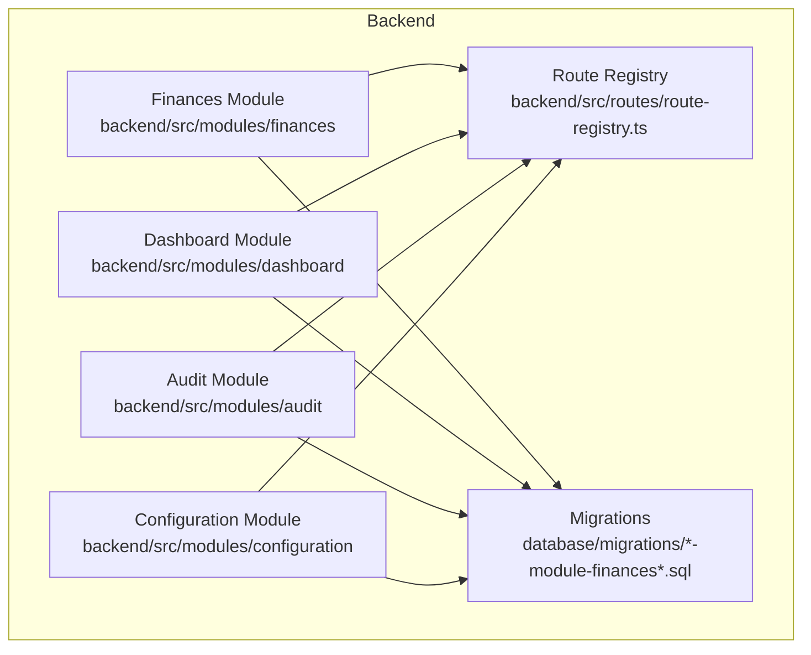
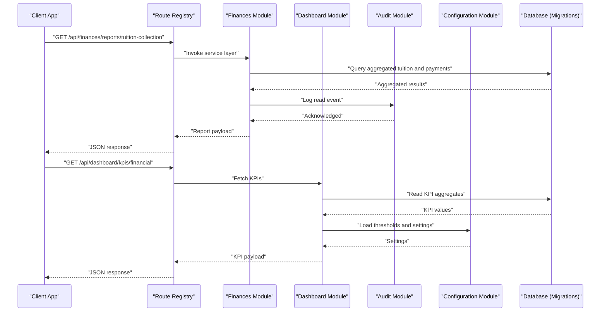
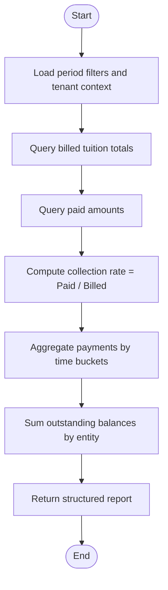
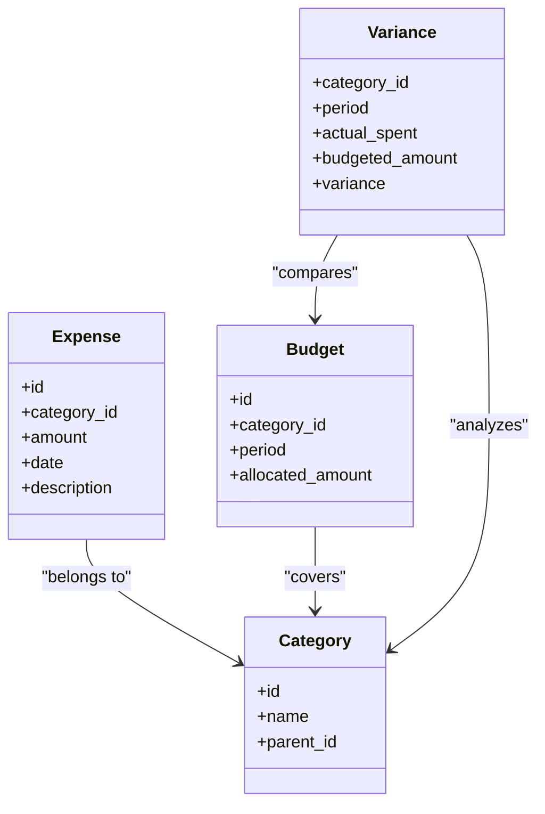
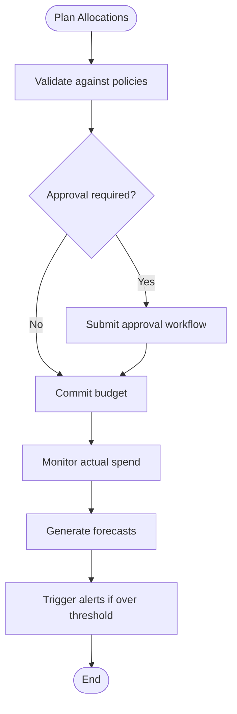
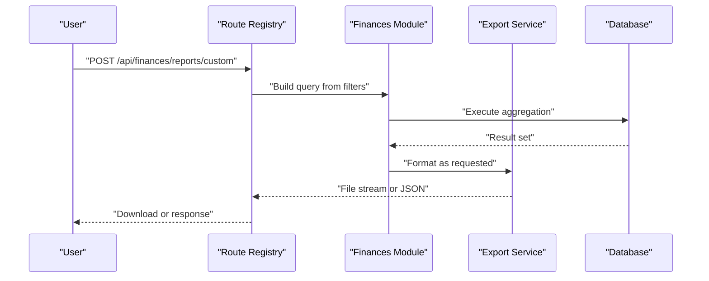
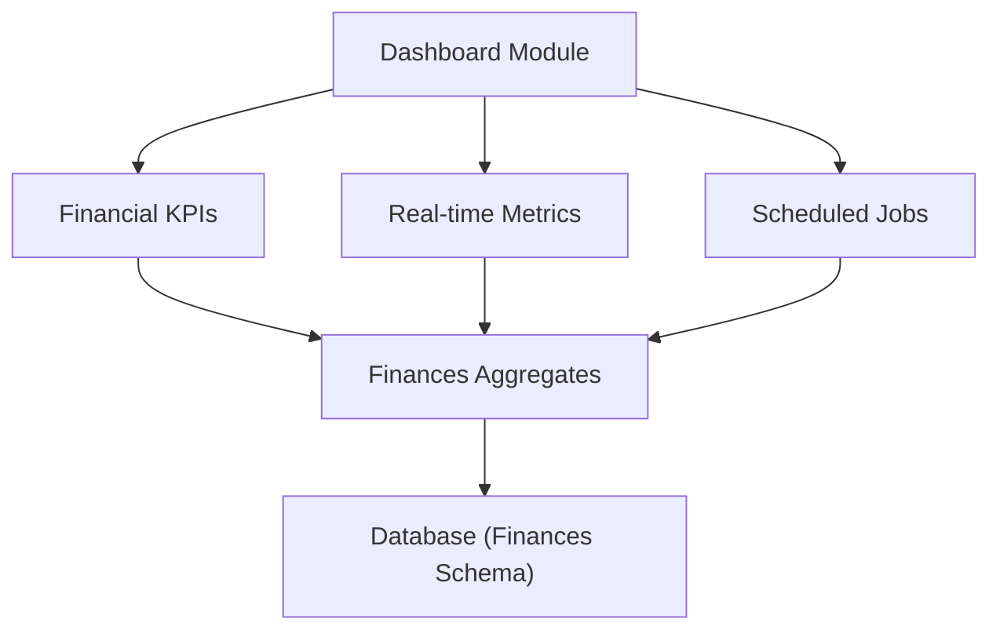
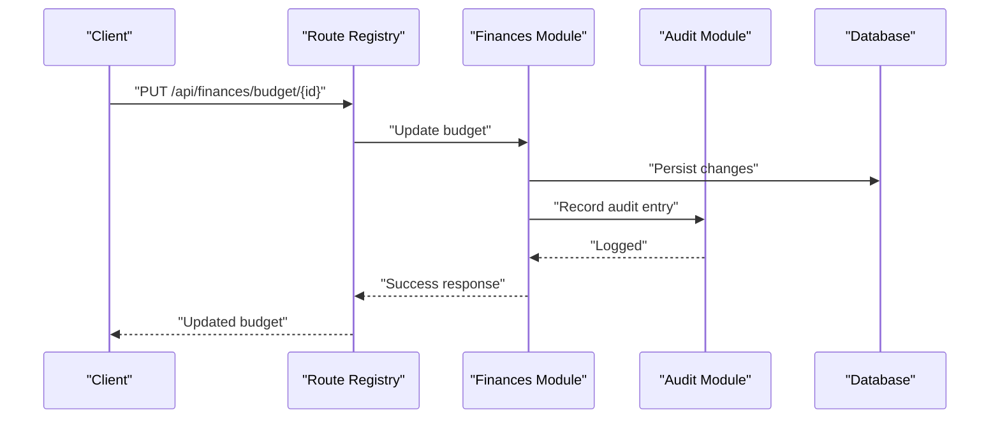
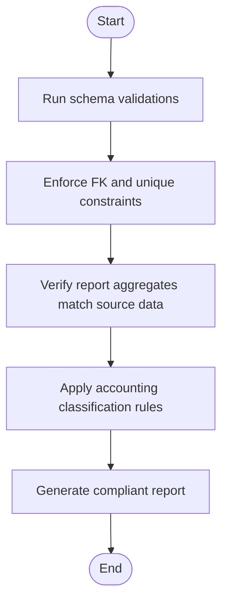
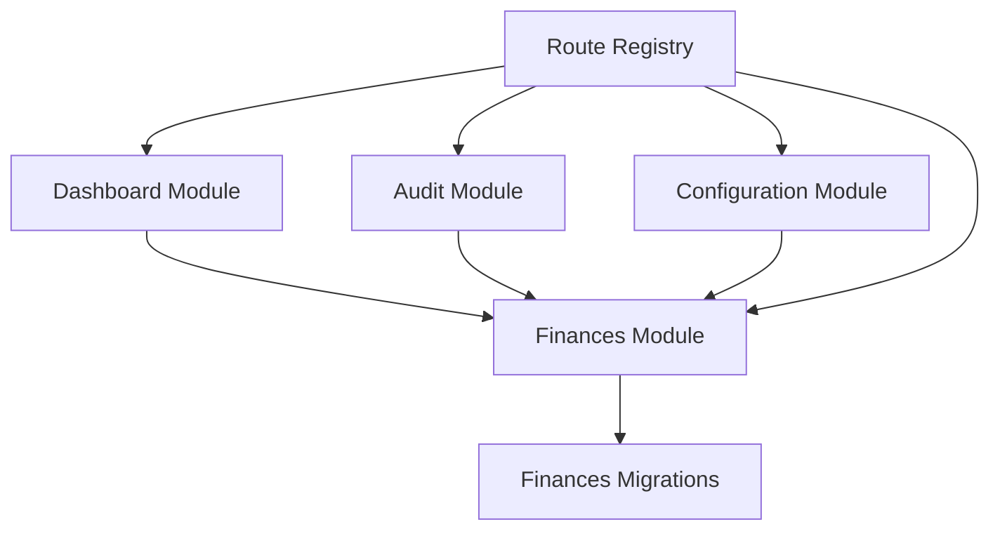

# Financial Reporting & Analytics

<cite>
**Referenced Files in This Document**
- [backend/src/modules/finances](file://backend/src/modules/finances)
- [backend/database/migrations/010-module-finances.sql](file://backend/database/migrations/010-module-finances.sql)
- [backend/database/migrations/011-module-finances-part2.sql](file://backend/database/migrations/011-module-finances-part2.sql)
- [backend/database/migrations/012-module-finances-part3-parametres.sql](file://backend/database/migrations/012-module-finances-part3-parametres.sql)
- [backend/database/migrations/013-module-finances-phase1-granularite.sql](file://backend/database/migrations/013-module-finances-phase1-granularite.sql)
- [backend/database/migrations/014-module-finances-phase2-section.sql](file://backend/database/migrations/014-module-finances-phase2-section.sql)
- [backend/docs/DASHBOARD-SYSTEM.md](file://backend/docs/DASHBOARD-SYSTEM.md)
- [backend/docs/DASHBOARD-FRONTEND-INTEGRATION.md](file://backend/docs/DASHBOARD-FRONTEND-INTEGRATION.md)
- [backend/docs/DASHBOARD-IMPLEMENTATION-SUMMARY.md](file://backend/docs/DASHBOARD-IMPLEMENTATION-SUMMARY.md)
- [backend/docs/audit-trail.md](file://backend/docs/audit-trail.md)
- [backend/src/modules/dashboard](file://backend/src/modules/dashboard)
- [backend/src/modules/audit](file://backend/src/modules/audit)
- [backend/src/modules/configuration](file://backend/src/modules/configuration)
- [backend/src/routes/route-registry.ts](file://backend/src/routes/route-registry.ts)
- [backend/scripts/run-migration.ts](file://backend/scripts/run-migration.ts)
- [backend/scripts/run-pending-migrations.ts](file://backend/scripts/run-pending-migrations.ts)
- [backend/scripts/verify-configuration-integrity.ts](file://backend/scripts/verify-configuration-integrity.ts)
- [backend/test/integration/auth-multi-etablissement.spec.ts](file://backend/test/integration/auth-multi-etablissement.spec.ts)
- [backend/test/integration/configuration-multi-tenant.spec.ts](file://backend/test/integration/configuration-multi-tenant.spec.ts)
</cite>

## Table of Contents
1. [Introduction](#introduction)
2. [Project Structure](#project-structure)
3. [Core Components](#core-components)
4. [Architecture Overview](#architecture-overview)
5. [Detailed Component Analysis](#detailed-component-analysis)
6. [Dependency Analysis](#dependency-analysis)
7. [Performance Considerations](#performance-considerations)
8. [Troubleshooting Guide](#troubleshooting-guide)
9. [Conclusion](#conclusion)
10. [Appendices](#appendices)

## Introduction
This document describes eLISAschool’s financial reporting and analytics system, focusing on revenue analytics (tuition collection rates, payment trends, outstanding balances), expense tracking with categorization and budget monitoring, budget management including allocation planning, spending controls, and forecast modeling. It also covers practical examples for generating financial statements and custom reports, export formats, real-time dashboards, KPI tracking, automated report scheduling, audit trail requirements, data integrity checks, and integration with accounting standards.

The content is grounded in the repository’s finance module migrations, dashboard documentation, audit trail documentation, and related backend modules.

## Project Structure
The financial reporting and analytics capabilities are implemented primarily within the finances module and supported by shared infrastructure such as dashboards, audit trails, configuration, and route registration. Database schema evolution is managed via SQL migrations.

**Diagram sources**
- [backend/src/modules/finances](file://backend/src/modules/finances)
- [backend/src/modules/dashboard](file://backend/src/modules/dashboard)
- [backend/src/modules/audit](file://backend/src/modules/audit)
- [backend/src/modules/configuration](file://backend/src/modules/configuration)
- [backend/src/routes/route-registry.ts](file://backend/src/routes/route-registry.ts)
- [backend/database/migrations/010-module-finances.sql](file://backend/database/migrations/010-module-finances.sql)
- [backend/database/migrations/011-module-finances-part2.sql](file://backend/database/migrations/011-module-finances-part2.sql)
- [backend/database/migrations/012-module-finances-part3-parametres.sql](file://backend/database/migrations/012-module-finances-part3-parametres.sql)
- [backend/database/migrations/013-module-finances-phase1-granularite.sql](file://backend/database/migrations/013-module-finances-phase1-granularite.sql)
- [backend/database/migrations/014-module-finances-phase2-section.sql](file://backend/database/migrations/014-module-finances-phase2-section.sql)

**Section sources**
- [backend/src/modules/finances](file://backend/src/modules/finances)
- [backend/src/modules/dashboard](file://backend/src/modules/dashboard)
- [backend/src/modules/audit](file://backend/src/modules/audit)
- [backend/src/modules/configuration](file://backend/src/modules/configuration)
- [backend/src/routes/route-registry.ts](file://backend/src/routes/route-registry.ts)
- [backend/database/migrations/010-module-finances.sql](file://backend/database/migrations/010-module-finances.sql)
- [backend/database/migrations/011-module-finances-part2.sql](file://backend/database/migrations/011-module-finances-part2.sql)
- [backend/database/migrations/012-module-finances-part3-parametres.sql](file://backend/database/migrations/012-module-finances-part3-parametres.sql)
- [backend/database/migrations/013-module-finances-phase1-granularite.sql](file://backend/database/migrations/013-module-finances-phase1-granularite.sql)
- [backend/database/migrations/014-module-finances-phase2-section.sql](file://backend/database/migrations/014-module-finances-phase2-section.sql)

## Core Components
- Finances module: Provides core financial entities and operations for tuition, payments, expenses, budgets, and related analytics.
- Dashboard module: Supplies endpoints and services to power real-time dashboards and KPIs.
- Audit module: Captures change events and supports compliance and traceability.
- Configuration module: Manages system parameters that influence financial behavior and reporting.
- Route registry: Centralizes API routes for all modules, enabling consistent access patterns.

Key responsibilities:
- Revenue analytics: tuition collection rates, payment trends, outstanding balances.
- Expense tracking: categorization, budget monitoring, variance analysis.
- Budget management: allocation planning, spending controls, forecast modeling.
- Reporting: financial statements, custom reports, export formats.
- Dashboards: real-time views, KPI tracking, scheduled reports.
- Compliance: audit trails, data integrity checks, alignment with accounting standards.

**Section sources**
- [backend/src/modules/finances](file://backend/src/modules/finances)
- [backend/src/modules/dashboard](file://backend/src/modules/dashboard)
- [backend/src/modules/audit](file://backend/src/modules/audit)
- [backend/src/modules/configuration](file://backend/src/modules/configuration)
- [backend/src/routes/route-registry.ts](file://backend/src/routes/route-registry.ts)

## Architecture Overview
The financial reporting and analytics architecture integrates the finances module with dashboards, audit logging, and configuration. Migrations define the underlying data model. The route registry exposes APIs consumed by frontend dashboards and reporting tools.

**Diagram sources**
- [backend/src/routes/route-registry.ts](file://backend/src/routes/route-registry.ts)
- [backend/src/modules/finances](file://backend/src/modules/finances)
- [backend/src/modules/dashboard](file://backend/src/modules/dashboard)
- [backend/src/modules/audit](file://backend/src/modules/audit)
- [backend/src/modules/configuration](file://backend/src/modules/configuration)
- [backend/database/migrations/010-module-finances.sql](file://backend/database/migrations/010-module-finances.sql)
- [backend/database/migrations/011-module-finances-part2.sql](file://backend/database/migrations/011-module-finances-part2.sql)
- [backend/database/migrations/012-module-finances-part3-parametres.sql](file://backend/database/migrations/012-module-finances-part3-parametres.sql)
- [backend/database/migrations/013-module-finances-phase1-granularite.sql](file://backend/database/migrations/013-module-finances-phase1-granularite.sql)
- [backend/database/migrations/014-module-finances-phase2-section.sql](file://backend/database/migrations/014-module-finances-phase2-section.sql)

## Detailed Component Analysis

### Revenue Analytics
- Tuition collection rates: Compute ratio of collected tuition to billed tuition over defined periods.
- Payment trends: Analyze payment volumes and timing across months or terms.
- Outstanding balances: Summarize unpaid amounts per student, class, or term.

Implementation anchors:
- Data model foundations and financial entities are defined in the finances migrations.
- Aggregation logic resides in the finances module services.
- Dashboard endpoints expose computed metrics for UI consumption.

**Diagram sources**
- [backend/src/modules/finances](file://backend/src/modules/finances)
- [backend/database/migrations/010-module-finances.sql](file://backend/database/migrations/010-module-finances.sql)
- [backend/database/migrations/011-module-finances-part2.sql](file://backend/database/migrations/011-module-finances-part2.sql)
- [backend/database/migrations/013-module-finances-phase1-granularite.sql](file://backend/database/migrations/013-module-finances-phase1-granularite.sql)

**Section sources**
- [backend/src/modules/finances](file://backend/src/modules/finances)
- [backend/database/migrations/010-module-finances.sql](file://backend/database/migrations/010-module-finances.sql)
- [backend/database/migrations/011-module-finances-part2.sql](file://backend/database/migrations/011-module-finances-part2.sql)
- [backend/database/migrations/013-module-finances-phase1-granularite.sql](file://backend/database/migrations/013-module-finances-phase1-granularite.sql)

### Expense Tracking
- Categorization: Group expenses by predefined categories and subcategories.
- Budget monitoring: Compare actual spend against allocated budgets per category or project.
- Variance analysis: Calculate differences between planned and actual expenditures.

Implementation anchors:
- Category structures and budgeting tables are established through finances migrations.
- Services compute variances and flag overspending based on configuration thresholds.

**Diagram sources**
- [backend/database/migrations/010-module-finances.sql](file://backend/database/migrations/010-module-finances.sql)
- [backend/database/migrations/011-module-finances-part2.sql](file://backend/database/migrations/011-module-finances-part2.sql)
- [backend/database/migrations/012-module-finances-part3-parametres.sql](file://backend/database/migrations/012-module-finances-part3-parametres.sql)
- [backend/database/migrations/013-module-finances-phase1-granularite.sql](file://backend/database/migrations/013-module-finances-phase1-granularite.sql)
- [backend/database/migrations/014-module-finances-phase2-section.sql](file://backend/database/migrations/014-module-finances-phase2-section.sql)

**Section sources**
- [backend/database/migrations/010-module-finances.sql](file://backend/database/migrations/010-module-finances.sql)
- [backend/database/migrations/011-module-finances-part2.sql](file://backend/database/migrations/011-module-finances-part2.sql)
- [backend/database/migrations/012-module-finances-part3-parametres.sql](file://backend/database/migrations/012-module-finances-part3-parametres.sql)
- [backend/database/migrations/013-module-finances-phase1-granularite.sql](file://backend/database/migrations/013-module-finances-phase1-granularite.sql)
- [backend/database/migrations/014-module-finances-phase2-section.sql](file://backend/database/migrations/014-module-finances-phase2-section.sql)

### Budget Management
- Allocation planning: Define budgets per category, department, or project for specific periods.
- Spending controls: Enforce limits and approvals based on configured policies.
- Forecast modeling: Project future spend using historical trends and planned allocations.

Implementation anchors:
- Parameters influencing budget behavior are stored in configuration-related migrations.
- Controls and forecasting logic are implemented in the finances module services.

**Diagram sources**
- [backend/database/migrations/012-module-finances-part3-parametres.sql](file://backend/database/migrations/012-module-finances-part3-parametres.sql)
- [backend/src/modules/finances](file://backend/src/modules/finances)

**Section sources**
- [backend/database/migrations/012-module-finances-part3-parametres.sql](file://backend/database/migrations/012-module-finances-part3-parametres.sql)
- [backend/src/modules/finances](file://backend/src/modules/finances)

### Financial Statements and Custom Reports
- Financial statements: Generate income statements, balance sheets, and cash flow summaries from financial transactions.
- Custom reports: Allow users to define filters, groupings, and aggregations for tailored insights.
- Export formats: Support common formats (e.g., CSV, JSON) for downstream processing.

Implementation anchors:
- Report generation leverages aggregation queries built on the finances schema.
- Export functionality is exposed via dedicated endpoints registered in the route registry.

**Diagram sources**
- [backend/src/routes/route-registry.ts](file://backend/src/routes/route-registry.ts)
- [backend/src/modules/finances](file://backend/src/modules/finances)
- [backend/database/migrations/010-module-finances.sql](file://backend/database/migrations/010-module-finances.sql)
- [backend/database/migrations/011-module-finances-part2.sql](file://backend/database/migrations/011-module-finances-part2.sql)

**Section sources**
- [backend/src/routes/route-registry.ts](file://backend/src/routes/route-registry.ts)
- [backend/src/modules/finances](file://backend/src/modules/finances)
- [backend/database/migrations/010-module-finances.sql](file://backend/database/migrations/010-module-finances.sql)
- [backend/database/migrations/011-module-finances-part2.sql](file://backend/database/migrations/011-module-finances-part2.sql)

### Real-Time Dashboards and KPI Tracking
- Real-time dashboards: Display live financial metrics such as collections, expenses, and budget utilization.
- KPI tracking: Track key indicators like collection rate, overdue balances, and variance percentages.
- Scheduled reports: Automate periodic generation and distribution of financial summaries.

Implementation anchors:
- Dashboard endpoints and services are provided by the dashboard module.
- Documentation outlines integration points and implementation details.

**Diagram sources**
- [backend/src/modules/dashboard](file://backend/src/modules/dashboard)
- [backend/src/modules/finances](file://backend/src/modules/finances)
- [backend/database/migrations/010-module-finances.sql](file://backend/database/migrations/010-module-finances.sql)
- [backend/database/migrations/011-module-finances-part2.sql](file://backend/database/migrations/011-module-finances-part2.sql)

**Section sources**
- [backend/src/modules/dashboard](file://backend/src/modules/dashboard)
- [backend/docs/DASHBOARD-SYSTEM.md](file://backend/docs/DASHBOARD-SYSTEM.md)
- [backend/docs/DASHBOARD-FRONTEND-INTEGRATION.md](file://backend/docs/DASHBOARD-FRONTEND-INTEGRATION.md)
- [backend/docs/DASHBOARD-IMPLEMENTATION-SUMMARY.md](file://backend/docs/DASHBOARD-IMPLEMENTATION-SUMMARY.md)

### Audit Trail Requirements
- Change capture: Log creation, updates, and deletions of financial records.
- Traceability: Maintain who changed what and when for compliance.
- Access control: Restrict sensitive financial operations based on roles and permissions.

Implementation anchors:
- Audit module provides logging mechanisms and policies.
- Audit documentation specifies operational requirements and usage.

**Diagram sources**
- [backend/src/modules/audit](file://backend/src/modules/audit)
- [backend/src/modules/finances](file://backend/src/modules/finances)
- [backend/src/routes/route-registry.ts](file://backend/src/routes/route-registry.ts)

**Section sources**
- [backend/src/modules/audit](file://backend/src/modules/audit)
- [backend/docs/audit-trail.md](file://backend/docs/audit-trail.md)

### Data Integrity Checks and Accounting Standards Integration
- Integrity checks: Validate referential consistency, enforce constraints, and ensure accurate aggregations.
- Accounting standards: Align reporting structures and classifications with recognized frameworks.
- Configuration-driven rules: Use parameters to adapt to institutional policies and standards.

Implementation anchors:
- Migration scripts establish constraints and indexes supporting integrity.
- Configuration module manages parameters affecting financial calculations and reporting.

**Diagram sources**
- [backend/database/migrations/010-module-finances.sql](file://backend/database/migrations/010-module-finances.sql)
- [backend/database/migrations/011-module-finances-part2.sql](file://backend/database/migrations/011-module-finances-part2.sql)
- [backend/database/migrations/012-module-finances-part3-parametres.sql](file://backend/database/migrations/012-module-finances-part3-parametres.sql)
- [backend/database/migrations/013-module-finances-phase1-granularite.sql](file://backend/database/migrations/013-module-finances-phase1-granularite.sql)
- [backend/database/migrations/014-module-finances-phase2-section.sql](file://backend/database/migrations/014-module-finances-phase2-section.sql)

**Section sources**
- [backend/database/migrations/010-module-finances.sql](file://backend/database/migrations/010-module-finances.sql)
- [backend/database/migrations/011-module-finances-part2.sql](file://backend/database/migrations/011-module-finances-part2.sql)
- [backend/database/migrations/012-module-finances-part3-parametres.sql](file://backend/database/migrations/012-module-finances-part3-parametres.sql)
- [backend/database/migrations/013-module-finances-phase1-granularite.sql](file://backend/database/migrations/013-module-finances-phase1-granularite.sql)
- [backend/database/migrations/014-module-finances-phase2-section.sql](file://backend/database/migrations/014-module-finances-phase2-section.sql)

## Dependency Analysis
The finances module depends on database migrations for its schema, while dashboards and audit modules provide cross-cutting concerns. The route registry centralizes API exposure.

**Diagram sources**
- [backend/src/modules/finances](file://backend/src/modules/finances)
- [backend/src/modules/dashboard](file://backend/src/modules/dashboard)
- [backend/src/modules/audit](file://backend/src/modules/audit)
- [backend/src/modules/configuration](file://backend/src/modules/configuration)
- [backend/src/routes/route-registry.ts](file://backend/src/routes/route-registry.ts)
- [backend/database/migrations/010-module-finances.sql](file://backend/database/migrations/010-module-finances.sql)
- [backend/database/migrations/011-module-finances-part2.sql](file://backend/database/migrations/011-module-finances-part2.sql)
- [backend/database/migrations/012-module-finances-part3-parametres.sql](file://backend/database/migrations/012-module-finances-part3-parametres.sql)
- [backend/database/migrations/013-module-finances-phase1-granularite.sql](file://backend/database/migrations/013-module-finances-phase1-granularite.sql)
- [backend/database/migrations/014-module-finances-phase2-section.sql](file://backend/database/migrations/014-module-finances-phase2-section.sql)

**Section sources**
- [backend/src/modules/finances](file://backend/src/modules/finances)
- [backend/src/modules/dashboard](file://backend/src/modules/dashboard)
- [backend/src/modules/audit](file://backend/src/modules/audit)
- [backend/src/modules/configuration](file://backend/src/modules/configuration)
- [backend/src/routes/route-registry.ts](file://backend/src/routes/route-registry.ts)
- [backend/database/migrations/010-module-finances.sql](file://backend/database/migrations/010-module-finances.sql)
- [backend/database/migrations/011-module-finances-part2.sql](file://backend/database/migrations/011-module-finances-part2.sql)
- [backend/database/migrations/012-module-finances-part3-parametres.sql](file://backend/database/migrations/012-module-finances-part3-parametres.sql)
- [backend/database/migrations/013-module-finances-phase1-granularite.sql](file://backend/database/migrations/013-module-finances-phase1-granularite.sql)
- [backend/database/migrations/014-module-finances-phase2-section.sql](file://backend/database/migrations/014-module-finances-phase2-section.sql)

## Performance Considerations
- Indexing: Ensure appropriate indexes on frequently filtered columns (dates, entity IDs, categories).
- Aggregation optimization: Use materialized views or summary tables for heavy reports where feasible.
- Pagination and filtering: Implement server-side pagination and selective field retrieval for large datasets.
- Caching: Cache stable KPIs and configuration values to reduce repeated computation.

[No sources needed since this section provides general guidance]

## Troubleshooting Guide
Common issues and resolutions:
- Migration failures: Use migration runners to inspect pending or failed migrations and re-run safely.
- Configuration integrity: Run verification scripts to detect inconsistencies in parameters affecting financial calculations.
- Multi-tenant isolation: Validate tenant scoping in tests to ensure financial data remains isolated.
- Audit gaps: Confirm audit entries exist for critical financial operations; investigate missing logs.

Operational references:
- Migration execution scripts.
- Configuration integrity verification script.
- Integration tests for multi-tenant scenarios.

**Section sources**
- [backend/scripts/run-migration.ts](file://backend/scripts/run-migration.ts)
- [backend/scripts/run-pending-migrations.ts](file://backend/scripts/run-pending-migrations.ts)
- [backend/scripts/verify-configuration-integrity.ts](file://backend/scripts/verify-configuration-integrity.ts)
- [backend/test/integration/auth-multi-etablissement.spec.ts](file://backend/test/integration/auth-multi-etablissement.spec.ts)
- [backend/test/integration/configuration-multi-tenant.spec.ts](file://backend/test/integration/configuration-multi-tenant.spec.ts)

## Conclusion
eLISAschool’s financial reporting and analytics system combines a robust finances module with dashboarding, auditing, and configuration capabilities. The migration-backed schema ensures data integrity, while dashboards and KPIs deliver actionable insights. With audit trails, integrity checks, and configurable parameters, the system aligns with accounting standards and supports comprehensive financial oversight.

[No sources needed since this section summarizes without analyzing specific files]

## Appendices
- Practical examples:
  - Generating a tuition collection report: Filter by academic year and term, aggregate billed vs paid amounts, compute collection rate, and export as CSV.
  - Creating a budget variance report: Select category and period, compare actual spend to allocated budget, highlight overspending, and schedule monthly delivery.
  - Building a real-time dashboard: Connect dashboard endpoints to display current collection rates, outstanding balances, and budget utilization.

[No sources needed since this section provides general guidance]